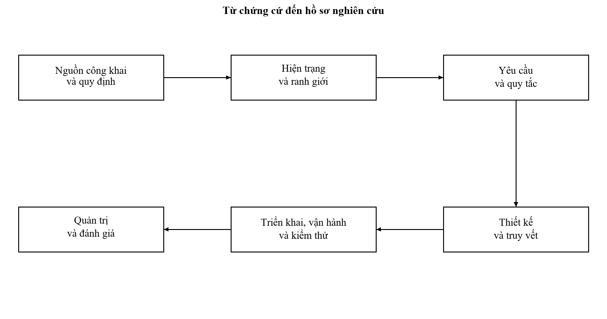

# I. MỞ ĐẦU VÀ PHƯƠNG PHÁP NGHIÊN CỨU

## 1.1. Lý do lựa chọn hệ thống

Hệ thống thông tin giải quyết thủ tục hành chính thành phố Hà Nội là đối tượng phù hợp để nghiên cứu mối quan hệ giữa tổ chức công vụ và thiết kế hệ thống thông tin. Một hồ sơ hành chính đi qua nhiều chủ thể, chịu sự điều chỉnh của quy định về thẩm quyền, thời hạn, thành phần giấy tờ, phí và giá trị pháp lý của kết quả. Phần mềm chỉ hỗ trợ đúng nghiệp vụ khi các quy định này được chuyển thành điều kiện xử lý có thể kiểm tra và truy nguyên. Vì vậy, phân tích hệ thống cần bắt đầu từ quy trình công vụ và trách nhiệm giải quyết, sau đó mới xác định kiến trúc và công nghệ.

Hà Nội có hệ thống đã được đưa vào vận hành từ ngày 11/04/2023 theo thông tin của Cổng Thông tin điện tử Chính phủ. Tài liệu hướng dẫn năm 2023 có giao diện và thao tác thực tế; hoạt động tập huấn ngày 17/09/2026 tiếp tục xác nhận việc cán bộ sử dụng hệ thống Thành phố để số hóa, ký duyệt và tạo kết quả điện tử. Đây là các bằng chứng độc lập về thời điểm vận hành, sản phẩm sử dụng và hoạt động tổ chức thực hiện. [15], [16], [23]

Thông báo chuyển dịch vụ công trực tuyến lên Cổng Dịch vụ công quốc gia từ ngày 01/07/2025 và chỉ đạo phối hợp với hệ thống tập trung của các bộ năm 2026 cho thấy ranh giới hệ thống đã thay đổi. Cổng giao dịch của công dân, nơi tác nghiệp của cán bộ và nơi lưu dữ liệu chuyên ngành có thể thuộc ba nền tảng khác nhau. Nghiên cứu xem xét hệ thống Thành phố trong quan hệ đó, thay vì mặc định mọi thủ tục của Hà Nội đều được xử lý trên một phần mềm địa phương. [1], [19]

Thủ tục cấp bản sao trích lục hộ tịch, bản sao giấy khai sinh được lựa chọn để phân tích sâu. Quyết định 1811/QĐ-TTPVHCC ngày 24/12/2025 và phương án kèm theo cung cấp một trường hợp cụ thể, có cơ quan giải quyết, thành phần hồ sơ, quy trình điện tử và trách nhiệm tổ chức thực hiện. Trường hợp này giúp kiểm tra sự thống nhất giữa yêu cầu nghiệp vụ, mô hình dữ liệu, thiết kế giao diện, kế hoạch triển khai và tiêu chí nghiệm thu. Trường hợp hộ tịch được phân tích theo nhánh tại Sở Tư pháp trong phương án; một thủ tục chứng thực tại cấp xã được bổ sung để đối chiếu đặc điểm khác nhau giữa các lĩnh vực. [2]

## 1.2. Mục tiêu và câu hỏi nghiên cứu

### 1.2.1. Mục tiêu nghiên cứu

Mục tiêu của báo cáo là xây dựng một hồ sơ phân tích và thiết kế có thể sử dụng làm cơ sở trao đổi với cán bộ nghiệp vụ, đơn vị quản lý và đơn vị phát triển phần mềm. Hồ sơ phải thể hiện được dữ liệu đầu vào, kết quả đầu ra, người chịu trách nhiệm, điều kiện chuyển bước, trường hợp ngoại lệ và bằng chứng cần lưu giữ. Kế hoạch triển khai, vận hành, kiểm thử và quản trị được xây dựng trên cùng mô hình nghiệp vụ để tránh tình trạng mỗi phần mô tả một hệ thống khác nhau.

Nghiên cứu không đặt mục tiêu tái tạo mã nguồn hay chứng minh kiến trúc nội bộ của hệ thống đang vận hành. Mục tiêu kỹ thuật là đề xuất thiết kế đáp ứng các chức năng được xác định từ nguồn công khai, đồng thời chỉ ra thông tin cần xác nhận trước khi triển khai. Việc lựa chọn công nghệ, quy mô máy chủ và chỉ tiêu dịch vụ trong báo cáo là quyết định thiết kế có điều kiện, không phải số liệu đo kiểm của hệ thống Hà Nội.

### 1.2.2. Câu hỏi nghiên cứu

Bảng 1.1: Câu hỏi nghiên cứu và sản phẩm đối chiếu

| Mã | Câu hỏi | Sản phẩm trả lời |
| --- | --- | --- |
| NC01 | Hệ thống thực tế phục vụ ai và thuộc trách nhiệm của chủ thể nào? | Ranh giới hệ thống, ma trận chủ thể và nguồn chứng cứ |
| NC02 | Hồ sơ được tiếp nhận, giải quyết và trả kết quả theo quy trình nào? | Luồng nghiệp vụ hiện trạng, Use case và quy tắc ngoại lệ |
| NC03 | Dữ liệu và kiến trúc nào có thể đáp ứng quy trình đó? | Mô hình dữ liệu, đặc tả giao tiếp và sơ đồ kiến trúc đề xuất |
| NC04 | Làm thế nào đưa thiết kế vào sử dụng mà vẫn kiểm soát rủi ro? | Kế hoạch chuyển đổi, nghiệm thu và quay lui |
| NC05 | Chất lượng và trách nhiệm công vụ được kiểm chứng như thế nào? | Ma trận truy vết, kế hoạch kiểm thử và cơ chế quản trị |

## 1.3. Đối tượng, phạm vi và giới hạn

Đối tượng nghiên cứu là Hệ thống thông tin giải quyết thủ tục hành chính thành phố Hà Nội trong toàn bộ vòng đời quản lý. Phạm vi chức năng được đối chiếu theo chín nhóm tại Điều 5 Thông tư 21/2023/TT-BTTTT, được sửa đổi bởi Thông tư 11/2025/TT-BKHCN: tài khoản; danh mục và hồ sơ; ký số; tiếp nhận và giải quyết; tiện ích; báo cáo; điều hành; kho dữ liệu; liên thông. Nghiên cứu phân tích cả quản lý nguồn lực, an toàn, lưu trữ, chuyển đổi tổ chức và kiểm soát nhà cung cấp. Hộ tịch là trường hợp đặc tả sâu; thủ tục cấp bản sao từ sổ gốc tại cấp xã được dùng làm trường hợp đối chiếu để kiểm tra khả năng áp dụng thiết kế cho nghiệp vụ khác. [18], [22]

Các nền tảng quốc gia, hệ thống giải quyết thủ tục của bộ, cơ sở dữ liệu chuyên ngành, thanh toán, chuyển phát và lưu trữ là những đầu mối liên quan. Báo cáo xác định trách nhiệm, dữ liệu trao đổi và xử lý thất bại tại điểm kết nối; không suy đoán cấu trúc lưu trữ bên trong của các đầu mối này.

Phạm vi thời gian của việc rà soát nguồn là đến ngày 02/10/2026. Các nguồn có thời điểm ban hành khác nhau được ghi riêng để tránh gộp hiện trạng trước và sau đợt chuyển đổi năm 2025. Hồ sơ nội bộ, quyền truy cập cán bộ, cấu hình vận hành, nhật ký máy chủ và số liệu kiểm thử thực tế chưa được cung cấp. Do đó, báo cáo không kết luận về nhà cung cấp tường lửa, số lượng vi dịch vụ, dung lượng máy chủ hoặc mức độ sẵn sàng thực tế.

Bảng 1.2: Phân định phạm vi nghiên cứu

| Nội dung | Trong phạm vi | Giới hạn |
| --- | --- | --- |
| Hệ thống thực tế | Hệ thống giải quyết thủ tục hành chính Thành phố | Không truy cập tài khoản cán bộ |
| Trường hợp chuyên sâu | Cấp bản sao trích lục hộ tịch tại Sở Tư pháp theo phương án 1811 | Không suy rộng thẩm quyền sang mọi cấp |
| Phân tích nghiệp vụ | Tiếp nhận, bổ sung, giải quyết, ký, trả và theo dõi | Quy trình chuyên ngành được ưu tiên khi khác quy trình chung |
| Thiết kế kỹ thuật | Mô hình logic và phương án hoàn thiện | Không khẳng định đó là thiết kế nội bộ hiện hữu |
| Kiểm thử | Kịch bản, dữ liệu, tiêu chí và biểu mẫu ghi nhận | Chưa thực thi trên môi trường vận hành |
| Triển khai và vận hành | Kế hoạch, trách nhiệm, điều kiện và phương án phục hồi | Chưa triển khai phần mềm trong phạm vi báo cáo |

## 1.4. Phương pháp thu thập và đánh giá chứng cứ

### 1.4.1. Phân tích tài liệu và khảo sát công khai

Nghiên cứu sử dụng văn bản và thông tin do cơ quan có thẩm quyền công bố để xác định quy trình. Đối với dữ liệu thủ tục, cần lưu tên thủ tục, mã thủ tục, cơ quan thực hiện, quyết định công bố và ngày hiệu lực của phiên bản. Một trang tra cứu có mã giống nhau nhưng cơ quan thực hiện khác không đủ để thay thế phương án chuyên sâu đã chọn. Đối với văn bản pháp luật, việc kiểm tra phải bao gồm quan hệ sửa đổi, thay thế và hiệu lực tại thời điểm áp dụng.

Khảo sát công khai được giới hạn ở nội dung không cần đăng nhập hoặc hướng dẫn do cơ quan phát hành. Một thông báo trên trang chính chứng minh sự tồn tại của thông báo và địa chỉ giao dịch, nhưng không chứng minh mọi kết nối phía sau đang hoạt động. Nghiên cứu không gửi hồ sơ thử, không thực hiện thanh toán và không thử tải trên hệ thống phục vụ người dân. Việc kiểm chứng kỹ thuật sau này phải được thực hiện tại môi trường được đơn vị quản lý cho phép.

### 1.4.2. Phân loại độ chắc chắn của thông tin

Bảng 1.3: Quy ước chứng cứ trong báo cáo

| Loại | Ý nghĩa | Cách sử dụng |
| --- | --- | --- |
| Có nguồn công khai | Nội dung được cơ quan công bố hoặc quy định bằng văn bản | Ghi số tài liệu và mốc thời gian |
| Suy luận phân tích | Kết luận rút ra từ quy trình và yêu cầu có nguồn | Giải thích lập luận và giới hạn |
| Thiết kế đề xuất | Phương án do nghiên cứu xây dựng | Dùng để đánh giá, chưa coi là hiện trạng |
| Cần xác nhận | Thông tin chưa thể xác minh qua nguồn công khai | Đưa vào danh sách khảo sát bổ sung |

Quy ước trên được áp dụng xuyên suốt. Số lượng 1.209 hồ sơ trong phương án 1811 là thông tin lịch sử của một nhánh thủ tục trong khoảng 01/07/2025 đến 15/11/2025. Con số này không đại diện cho tổng hồ sơ Thành phố năm 2026. Chi phí tuân thủ trong phương án là tính toán phục vụ đánh giá tác động, không phải kết quả kiểm toán chi phí sau vận hành. Các chỉ tiêu thời gian đáp ứng trong chương kiểm thử là ngưỡng nghiệm thu đề xuất.

### 1.4.3. Phương pháp mô hình hóa và truy vết

Mô hình hóa được thực hiện theo ba lớp. Lớp nghiệp vụ xác định tác nhân, hoạt động và trách nhiệm; lớp thông tin xác định hồ sơ, thành phần giấy tờ, phiên bản và lịch sử; lớp kỹ thuật xác định thành phần xử lý, giao tiếp và kiểm soát. Một ca kiểm thử phải truy về yêu cầu cụ thể, còn yêu cầu phải truy về nguồn hoặc quyết định thiết kế. Cách tổ chức này cho phép sửa một quy tắc mà vẫn tìm được bảng dữ liệu, giao diện và kịch bản chịu tác động.

Hình 1.1: Quan hệ giữa chứng cứ và các sản phẩm nghiên cứu

## 1.5. Cấu trúc và kết quả dự kiến của nghiên cứu

Báo cáo trình bày lựa chọn hệ thống và phương pháp ở chương I; phân tích hiện trạng và căn cứ áp dụng ở chương II; yêu cầu và nghiệp vụ ở chương III; thiết kế ở chương IV; triển khai và vận hành ở chương V; kiểm thử ở chương VI; quản trị và kết luận ở chương VII. Tài liệu tham khảo và phụ lục tạo thành phần tra cứu, hỗ trợ kiểm chứng.

Bộ thiết kế đi kèm gồm sơ đồ có thể chỉnh sửa, mô hình dữ liệu, danh mục giao tiếp, ma trận quyền và kịch bản kiểm thử. Các sản phẩm này được tổ chức riêng để có thể tiếp tục phát triển mà không phải tách lại từ tệp Word. Mối liên hệ với báo cáo được giữ bằng mã yêu cầu, mã Use case và mã kiểm thử thống nhất.
