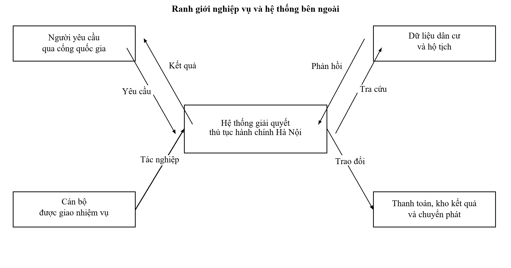
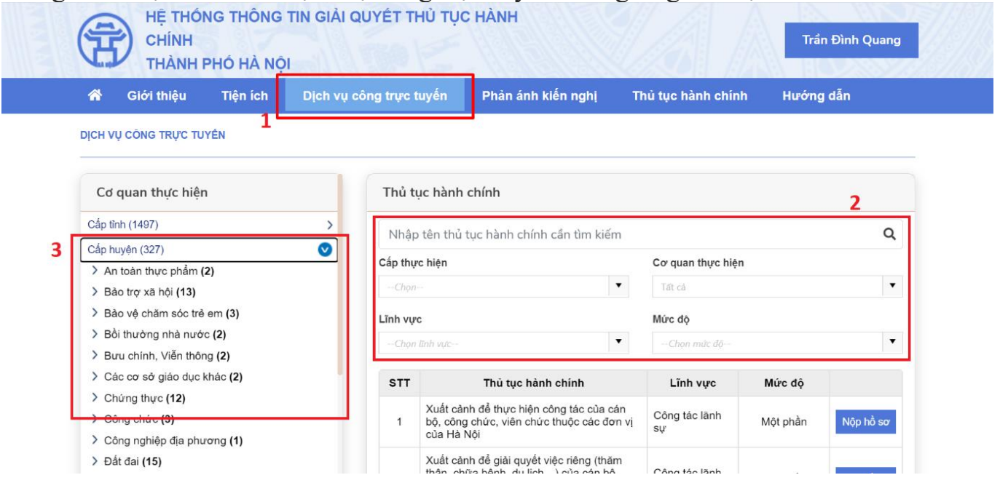
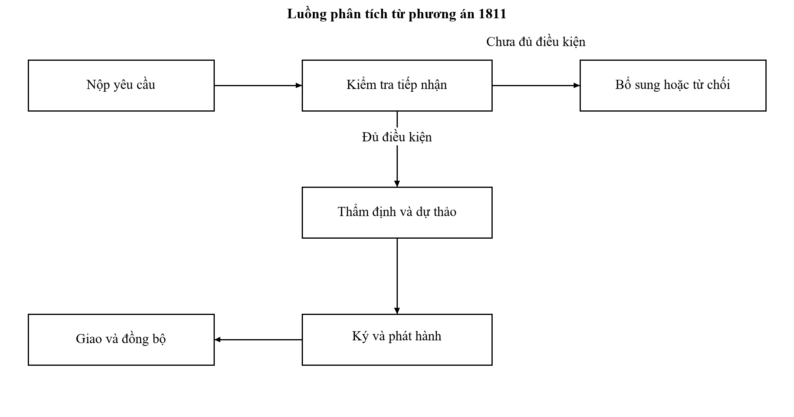
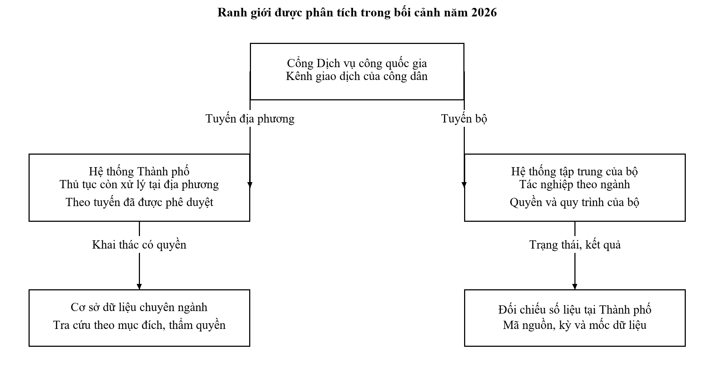
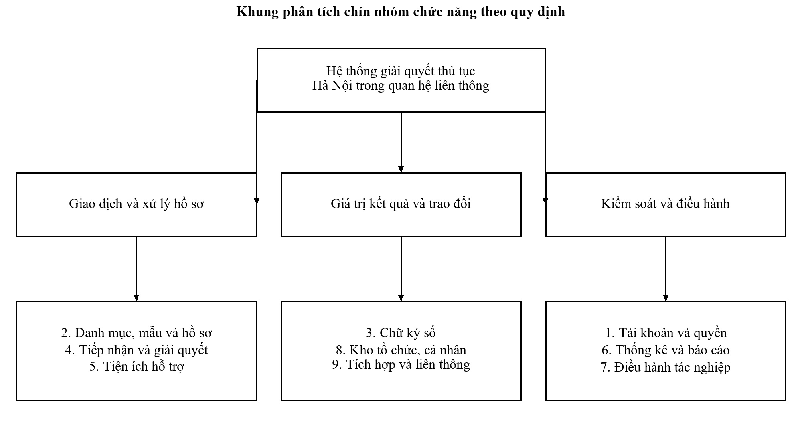

# II. HỆ THỐNG THỰC TẾ VÀ CƠ SỞ ÁP DỤNG

## 2.1. Nhận diện hệ thống và ranh giới nghiên cứu

Hệ thống thông tin giải quyết thủ tục hành chính thành phố Hà Nội được xác định từ tên hệ thống được công bố trên trang dịch vụ công của Thành phố và tài liệu của Trung tâm Phục vụ hành chính công. Kênh công dân hiện được định hướng tới Cổng Dịch vụ công quốc gia. Trong mô hình nghiên cứu, cổng quốc gia tiếp nhận tương tác của người sử dụng, còn hệ thống giải quyết tại Thành phố tổ chức nghiệp vụ và đồng bộ hồ sơ theo các giao tiếp được thống nhất. Không sử dụng địa chỉ cổng cũ như bằng chứng rằng người dân vẫn nộp trực tuyến tại đó. [1]

Bảng 2.1: Các đầu mối công khai phục vụ nhận diện hệ thống

| Đầu mối | Vai trò trong nghiên cứu | Nội dung có thể chứng minh |
| --- | --- | --- |
| dichvucong.hanoi.gov.vn | Nhận diện hệ thống và thông báo chuyển kênh | Tên hệ thống; mốc chuyển tới cổng quốc gia |
| dichvucong.gov.vn | Kênh giao dịch công dân và tra cứu thủ tục | Danh mục, hướng dẫn và điều kiện của phiên bản công bố |
| ttpvhcc.hanoi.gov.vn | Nguồn tổ chức thực hiện và hướng dẫn | Quyết định, thông báo và phương án cải cách |
| vanban.hanoi.gov.vn | Tra cứu văn bản của Thành phố | Thông tin Quyết định 1811 và tệp phương án |
| Hệ thống dùng chung ngành Tư pháp | Đầu mối tích hợp theo phương án 1811 | Yêu cầu kết nối; không xác minh được cấu hình nội bộ |

Hệ thống quản lý hành chính gồm nhiều thành phần ngoài phần mềm. Quyết định công bố thủ tục là cơ sở cấu hình, cán bộ nghiệp vụ là chủ thể ra quyết định, dữ liệu và văn bản có giá trị làm bằng chứng, hạ tầng duy trì khả năng cung cấp dịch vụ. Một lỗi cấu hình thời hạn có thể làm báo cáo quá hạn sai ngay cả khi máy chủ vẫn hoạt động bình thường. Vì vậy, nghiên cứu đánh giá cả chất lượng dữ liệu quản trị và chất lượng xử lý kỹ thuật.

Hình 2.1: Ranh giới hệ thống Hà Nội và các nền tảng kết nối

### 2.1.1. Bằng chứng về sự tồn tại và quá trình vận hành

Cổng Thông tin điện tử Chính phủ ngày 03/07/2023 nêu hệ thống được triển khai từ đầu tháng 02/2023 và vận hành ngày 11/04/2023. Tài liệu hướng dẫn công dân mang tên hệ thống Hà Nội, phiên bản 1.0 năm 2023, do Công ty TNHH Hệ thống thông tin FPT biên soạn, mô tả đăng nhập, tra cứu, nộp, thanh toán và phản ánh. Tài liệu có giao diện minh họa chứ không chỉ mô tả chủ trương. Nguồn này xác nhận vai trò biên soạn hướng dẫn của FPT tại thời điểm đó; không đủ để kết luận hợp đồng vận hành hiện nay hoặc cấu trúc máy chủ. [15], [16]

Bảng 2.8: Chuỗi chứng cứ vận hành theo thời gian

| Thời điểm | Bằng chứng công khai | Điều có thể kết luận |
| --- | --- | --- |
| 11/04/2023 | Thông tin vận hành trên Cổng Chính phủ | Hệ thống đã được đưa vào sử dụng |
| Năm 2023 | Hướng dẫn công dân có giao diện và thao tác | Có sản phẩm phần mềm và chức năng giao dịch |
| 13/02/2025 | Phường Hoàng Liệt giới thiệu hướng dẫn | Cơ quan cơ sở có phổ biến cách sử dụng |
| 01/07/2025 | Thông báo chuyển kênh giao dịch lên cổng quốc gia | Kênh nộp trực tuyến địa phương thay đổi |
| 25/04/2026 | Công văn 1747/UBND-NC được Thành phố công bố | Có phân chia xử lý giữa hệ thống bộ và Thành phố |
| 17/09/2026 | Tập huấn ký số và kết quả điện tử | Cán bộ tiếp tục được hướng dẫn tác nghiệp trên hệ thống Thành phố |

Hình 2.3: Giao diện tra cứu trong tài liệu hướng dẫn công dân năm 2023

Hình trên được trích từ trang 27 của tài liệu hướng dẫn năm 2023. Cấp huyện và cách phân loại trong hình thuộc phiên bản lịch sử; hình không đại diện cho giao diện năm 2026. Các bước đăng ký bằng thuê bao, bảo hiểm xã hội hoặc thiết bị ký trong hướng dẫn cũ cũng không được dùng làm yêu cầu đăng nhập hiện hành. Giá trị của nguồn là kiểm chứng sản phẩm và hành vi đã được hướng dẫn tại thời điểm công bố. [16], [29]

Thông tin tập huấn tháng 09/2026 đề cập việc cán bộ nhận biết tệp hệ thống không đọc được và lỗi trong ký số, tạo kết quả. Đây là căn cứ lựa chọn kiểm thử định dạng, quyền ký và khả năng sử dụng; không đủ để định lượng tỷ lệ lỗi. Việc hướng tới trả trực tuyến toàn bộ kết quả là mục tiêu nêu tại hội nghị, chưa phải tỷ lệ thực hiện đã được đo. [23]

## 2.2. Khung pháp lý và quản lý phiên bản quy định

### 2.2.1. Căn cứ cho cơ chế một cửa và giao dịch điện tử

Nghị định 118/2025/NĐ-CP là căn cứ về cơ chế một cửa, một cửa liên thông trong giai đoạn nghiên cứu. Nghị định 367/2025/NĐ-CP sửa đổi một số nội dung của văn bản này. Thông tư 03/2025/TT-VPCP hướng dẫn tổ chức hoạt động, biểu mẫu, mã hồ sơ và danh mục mã ngành, lĩnh vực. Hồ sơ nghiên cứu năm 2026 cần đối chiếu các văn bản đó thay vì mặc định áp dụng nguyên trạng khung năm 2018. [3], [4], [5]

Bảng 2.2: Căn cứ áp dụng và hệ quả đối với thiết kế

| Tài liệu | Nội dung sử dụng | Hệ quả thiết kế |
| --- | --- | --- |
| Nghị định 118/2025/NĐ-CP | Cơ chế một cửa và tổ chức tiếp nhận, giải quyết | Tách nơi hỗ trợ, nơi tiếp nhận và cơ quan có thẩm quyền |
| Nghị định 367/2025/NĐ-CP | Nội dung sửa đổi của Nghị định 118 | Quản lý phiên bản quy tắc có ngày hiệu lực |
| Thông tư 03/2025/TT-VPCP | Biểu mẫu và mã hóa hồ sơ | Quản lý bộ mẫu theo căn cứ và phiên bản |
| Nghị định 45/2020/NĐ-CP | Thủ tục trên môi trường điện tử | Đối chiếu phần còn hiệu lực và phần đã sửa đổi |
| Nghị định 137/2024/NĐ-CP | Giao dịch điện tử của cơ quan nhà nước | Quản lý dữ liệu trao đổi, chuyển đổi và bằng chứng |
| Nghị định 30/2020/NĐ-CP | Công tác văn thư | Tách ký duyệt, cấp số và phát hành văn bản |
| Luật Bảo vệ dữ liệu cá nhân 91/2025/QH15 | Bảo vệ dữ liệu cá nhân | Xác định mục đích, quyền truy cập và vòng đời dữ liệu |
| Quyết định 1811/QĐ-TTPVHCC | Phương án thủ tục chuyên sâu | Làm cơ sở mô hình hóa nhánh tại Sở Tư pháp |

Các căn cứ được chuyển thành tham số và điều kiện có quản lý, không viết cố định rải rác trong từng màn hình. Một phiên bản thủ tục gồm quyết định công bố, thẩm quyền, thành phần hồ sơ, cách tính hạn, mức thu, miễn giảm và mẫu kết quả. Hồ sơ đã tiếp nhận giữ tham chiếu đến phiên bản áp dụng; thay đổi danh mục không tự làm thay đổi thời hạn của hồ sơ cũ. Khi có quy định chuyển tiếp, cán bộ có thẩm quyền phê duyệt việc chuyển phiên bản và hệ thống ghi nhận căn cứ.

### 2.2.2. Biểu mẫu hành chính và giới hạn suy diễn

Bảng 2.3: Bộ biểu mẫu theo Phụ lục I Thông tư 03/2025/TT-VPCP

| Mẫu | Tên biểu mẫu | Điểm phát sinh dữ liệu |
| --- | --- | --- |
| 01 | Giấy tiếp nhận hồ sơ và hẹn trả kết quả | Tiếp nhận hợp lệ |
| 02 | Phiếu yêu cầu bổ sung, hoàn thiện hồ sơ | Yêu cầu làm rõ hoặc bổ sung theo căn cứ |
| 03 | Phiếu từ chối tiếp nhận giải quyết hồ sơ | Quyết định không tiếp nhận |
| 04 | Văn bản xin lỗi và đề nghị gia hạn thời gian giải quyết | Trường hợp chậm giải quyết theo quy định |
| 05 | Thông báo dừng giải quyết hồ sơ | Quyết định dừng sau khi xem xét đề nghị |
| 06 | Phiếu kiểm soát quá trình giải quyết hồ sơ | Theo dõi luân chuyển và trách nhiệm |
| 07 | Sổ theo dõi hồ sơ | Tổng hợp tiếp nhận và kết quả |

Biên lai phí, lệ phí thuộc phân hệ tài chính và được quản lý theo quy định chuyên ngành; không đặt tên là Mẫu 07 của bộ biểu mẫu một cửa. Quy tắc bổ sung cần phân biệt giai đoạn kiểm tra đầu vào với yêu cầu làm rõ trong thẩm định và quy định chuyên ngành. Thiết kế sử dụng trường giai đoạn, căn cứ và người phê duyệt, thay cho một giới hạn số lần áp dụng đồng loạt cho mọi tình huống. Tương tự, quá hạn là thuộc tính của thời hạn xử lý, không tự tạo thẩm quyền từ chối trả kết quả cho người dân.

### 2.2.3. Căn cứ kỹ thuật và thay đổi pháp luật năm 2026

Khung chức năng được đọc theo Thông tư 21/2023/TT-BTTTT cùng Thông tư 11/2025/TT-BKHCN, có hiệu lực từ ngày 01/08/2025. Không áp dụng các điều và phụ lục đã bị bãi bỏ của bản gốc. Tại thời điểm nghiên cứu, Luật Bảo vệ dữ liệu cá nhân được đối chiếu với Nghị định 356/2025/NĐ-CP, có hiệu lực từ ngày 01/01/2026; Luật An ninh mạng 116/2025/QH15 có hiệu lực từ ngày 01/07/2026. Việc rà soát an toàn cần giữ hồ sơ căn cứ, phạm vi trách nhiệm và phương án đã phê duyệt, thay vì chỉ viện dẫn tài liệu kỹ thuật quốc tế. [17], [18], [24], [25]

Luật Lưu trữ 33/2024/QH15 có hiệu lực từ ngày 01/07/2025 là căn cứ về lưu trữ trong giai đoạn này. Thông tư 13/2023/TT-BNV cung cấp yêu cầu về thành phần hồ sơ nộp lưu và kết nối với hệ thống quản lý tài liệu; các viện dẫn cũ trong thông tư phải được đọc cùng quy định sửa đổi, thay thế. Việc giữ tệp trong kho phục vụ người dân không tự hoàn thành nghĩa vụ lập hồ sơ và nộp lưu. [26], [27]

Luật Hộ tịch 03/2026/QH16 đã được ban hành ngày 23/04/2026 nhưng có hiệu lực từ ngày 01/03/2027. Vì vậy, báo cáo không dùng luật mới như căn cứ đang có hiệu lực cho hồ sơ tại ngày 02/10/2026. Điều khoản chuyển tiếp còn yêu cầu hồ sơ tiếp nhận trước ngày hiệu lực tiếp tục giải quyết theo pháp luật tại thời điểm tiếp nhận. Thiết kế phải chuẩn bị phiên bản tương lai và kiểm thử tại ranh giới hiệu lực, đồng thời giữ phiên bản áp dụng cho hồ sơ cũ. [28]

## 2.3. Trường hợp nghiên cứu tại Sở Tư pháp

### 2.3.1. Đặc điểm được xác nhận từ phương án công khai

Phương án kèm Quyết định 1811 xác định thủ tục mã 2.000635, phạm vi giải quyết tại Sở Tư pháp, tiếp nhận trực tuyến và trả kết quả điện tử. Phương án quy định thời gian giải quyết trong ngày; trường hợp tiếp nhận sau 15 giờ thì trả trong ngày làm việc tiếp theo. Thành phần hồ sơ gồm tờ khai hoặc biểu mẫu tương tác, thông tin chứng minh nhân thân được khai thác khi khả dụng và văn bản ủy quyền khi phát sinh. Phân tích này sử dụng đúng phạm vi của phương án, đồng thời yêu cầu xác nhận phiên bản đang cấu hình trước khi triển khai. [2]

Bảng 2.4: Hồ sơ chứng cứ của trường hợp nghiên cứu

| Nội dung | Chứng cứ | Cách diễn giải |
| --- | --- | --- |
| Mã thủ tục | Phương án 1811, phần B | Mã chung 2.000635; cần lưu thêm cơ quan và phiên bản |
| Thẩm quyền chuyên sâu | Phương án 1811, mục B.3 | Sở Tư pháp trong nhánh nghiên cứu |
| Mốc 15 giờ | Phương án 1811, mục B.4 | Quy tắc tính hạn của phương án, không phải số giờ cố định |
| Tái sử dụng dữ liệu | Phương án 1811, mục B.5 | Áp dụng khi dữ liệu có và phù hợp |
| Ký và phát hành | Phương án 1811, mục B.6 | Có trách nhiệm lãnh đạo và văn thư |
| Kết quả điện tử | Phương án 1811, mục B.6 | Có yêu cầu chuyển kho dữ liệu và xác nhận trả |

### 2.3.2. Đọc số liệu lịch sử và đánh giá tác động

Phương án nêu 1.209 hồ sơ phát sinh từ 01/07/2025 đến 15/11/2025 và sử dụng số lượng 3.228 đối tượng tuân thủ trong tính toán chi phí một năm. Bảng tính dự kiến giảm chi phí từ 1.024.000 đồng xuống 231.000 đồng cho một hồ sơ, tương ứng mức tiết kiệm khoảng 77,44%. Các giá trị đó thể hiện cơ sở lập phương án tại thời điểm ban hành. Báo cáo không dùng chúng để khẳng định mức tiết kiệm đã đạt được trong năm 2026. [2]

Bảng 2.5: Phân biệt số liệu nguồn và chỉ số cần đo sau triển khai

| Chỉ số | Giá trị trong nguồn | Chỉ số cần đo để đánh giá thực hiện |
| --- | --- | --- |
| Hồ sơ trong khoảng lịch sử | 1.209 hồ sơ | Tổng hồ sơ theo tháng, đúng nhánh và phiên bản |
| Chi phí một hồ sơ trước tái cấu trúc | 1.024.000 đồng | Chi phí thực tế theo khảo sát có phương pháp |
| Chi phí một hồ sơ sau tái cấu trúc | 231.000 đồng dự kiến | Chi phí sau triển khai trên mẫu khảo sát tương ứng |
| Tỷ lệ tiết kiệm chi phí | 77,44% dự kiến | Chênh lệch kiểm chứng với kỳ và phương pháp thống nhất |

## 2.4. Quy trình nghiệp vụ được phân tích

Quy trình công khai được chia thành nộp hồ sơ, tiếp nhận và chuyển, thẩm định, nhận kết quả. Trong mỗi giai đoạn có các quyết định khác nhau về tính hợp lệ, thẩm quyền và nội dung. Thiết kế cần thể hiện các quyết định này thành nhánh có điều kiện, vì một chuỗi tuyến tính từ nộp đến trả không mô tả được hồ sơ thiếu giấy tờ, dữ liệu không tìm thấy, ký thất bại hoặc kết quả có sai sót.

Bảng 2.6: Luồng xử lý của thủ tục chuyên sâu

| Bước | Chủ thể | Hoạt động | Bằng chứng đầu ra |
| --- | --- | --- | --- |
| 1 | Người yêu cầu | Chọn đúng thủ tục, cơ quan và kê khai | Tờ khai, thông tin định danh và tài liệu liên quan |
| 2 | Cán bộ tiếp nhận | Kiểm tra thành phần và thẩm quyền | Giấy tiếp nhận hoặc phiếu hướng dẫn, từ chối |
| 3 | Cơ quan chuyên môn | Tra cứu dữ liệu hộ tịch và thẩm định | Kết quả tra cứu, ý kiến xử lý, dự thảo |
| 4 | Người có thẩm quyền | Kiểm tra và ký kết quả | Văn bản đã ký; chứng cứ kiểm tra chữ ký |
| 5 | Văn thư | Cấp số, vào sổ và phát hành | Số văn bản, bản phát hành và lịch sử |
| 6 | Cán bộ trả kết quả | Kiểm tra và xác nhận giao kết quả | Thông tin giao nhận và trạng thái đồng bộ |

Hình 2.2: Quy trình xử lý có nhánh bổ sung và từ chối

## 2.5. Vấn đề cần kiểm chứng và định hướng hoàn thiện

Bảng 2.7: Khoảng trống chứng cứ và nội dung khảo sát bổ sung

| Chủ đề | Thông tin chưa có | Người cần xác nhận |
| --- | --- | --- |
| Phiên bản thủ tục | Quyết định đang cấu hình và cách tính hạn thực tế | Đơn vị kiểm soát thủ tục và Sở Tư pháp |
| Tích hợp | Đặc tả trao đổi với cổng quốc gia và ngành Tư pháp | Đơn vị kỹ thuật quản lý kết nối |
| Ký số | Quy trình chứng thư, phần mềm ký và kiểm tra chữ ký | Văn thư và đơn vị quản lý chứng thư |
| Hạ tầng | Sơ đồ triển khai, công suất và mức độ an toàn được phê duyệt | Đơn vị vận hành và an toàn thông tin |
| Hiệu quả | Số liệu thực hiện sau tái cấu trúc và phương pháp đo | Trung tâm và cơ quan giải quyết |
| Tài chính | Biểu phí, miễn giảm, đối soát đang áp dụng | Bộ phận tài chính có thẩm quyền |

Định hướng hoàn thiện được xây dựng từ rủi ro quy trình: giảm kê khai trùng, kiểm soát phiên bản, lưu dấu vết ra quyết định, phân biệt đã giải quyết với đã giao, và bảo đảm khả năng phục hồi khi tích hợp thất bại. Đây là yêu cầu phân tích, chưa phải kết luận rằng hệ thống hiện hữu đang thiếu những chức năng này. Khảo sát nội bộ sau này cần kiểm tra từng chức năng trước khi quyết định thay đổi.

## 2.6. Phạm vi chức năng của toàn hệ thống

### 2.6.1. Chín nhóm chức năng và mức độ chứng cứ

Thông tư 11/2025/TT-BKHCN sửa Điều 5 của Thông tư 21/2023/TT-BTTTT, bổ sung khung chín nhóm chức năng và phụ lục yêu cầu cụ thể, đồng thời bãi bỏ một số điều và phụ lục cũ. Khoản 3 của Điều 5 sau sửa đổi đặt các chức năng phục vụ giao dịch của tổ chức, cá nhân trên Cổng Dịch vụ công quốc gia. Vì vậy, bảng chức năng của một hệ thống địa phương năm 2026 không được sao chép nguyên mô hình gồm cổng công dân riêng và một cửa riêng của giai đoạn trước. [17], [18]

Bảng 2.9: Đối chiếu nhóm chức năng với chứng cứ và phạm vi phân tích

| Nhóm | Chứng cứ và mức xác nhận | Nội dung cần phân tích |
| --- | --- | --- |
| Tài khoản | Khung chức năng quy định; hướng dẫn cũ có đăng nhập | Danh tính cán bộ, vai trò, cơ quan, thời hạn quyền |
| Danh mục và hồ sơ | Quy trình 1811, 663; khung chức năng | Phiên bản, mẫu, mã thủ tục, mã hồ sơ và luân chuyển |
| Ký số | Tập huấn thực tế tháng 09/2026; quy định tích hợp | Chứng thư, bản ký, chữ ký cá nhân và cơ quan |
| Tiếp nhận và giải quyết | Quy trình có chủ thể và thời gian; hướng dẫn giao dịch | Nhiều kênh, bổ sung, phân công, thẩm định, phê duyệt |
| Tiện ích | Phụ lục quy định in, nhắc việc, tìm kiếm, trợ lý | Quyền tìm kiếm, nội dung nhắc việc và giới hạn trợ giúp |
| Báo cáo | Thông tin kết quả sáu tháng năm 2026 | Mẫu số, mốc dữ liệu, phạm vi và đối chiếu giữa hệ thống |
| Điều hành | Công văn 1747 giao trách nhiệm xử lý, phối hợp | Người chịu trách nhiệm, quá hạn và cơ quan phối hợp |
| Kho dữ liệu | Quy trình và khung chức năng yêu cầu lưu, dùng lại | Chủ thể sở hữu, nguồn, phiên bản, thời hạn và quyền dùng |
| Liên thông | Chỉ đạo năm 2026 và yêu cầu đồng bộ quốc gia | Nguồn chính thức, thông điệp, gửi lặp và đối soát |

Bảng này xác định phạm vi nghiên cứu, không chấm hệ thống Hà Nội đạt toàn bộ yêu cầu kỹ thuật. Hướng dẫn công dân chỉ cho phép quan sát phần giao dịch, trong khi tài khoản quản trị, hiệu năng, quyền nội bộ và kho dữ liệu cần chứng cứ khác. Không có chức năng trong tài liệu hướng dẫn không đồng nghĩa chức năng đó không tồn tại; có chức năng trong quy định cũng không đồng nghĩa hệ thống đã triển khai đầy đủ.

### 2.6.2. Tiếp nhận đa kênh và thay đổi tổ chức

Một hồ sơ có ít nhất ba thông tin tổ chức cần phân biệt: nơi người dân được hỗ trợ, nơi tiếp nhận chính thức và cơ quan có thẩm quyền giải quyết. Khi tiếp nhận không phụ thuộc địa giới, nơi tiếp nhận có thể ở một chi nhánh khác với cơ quan giải quyết. Hệ thống phải xác định đúng thẩm quyền từ phiên bản thủ tục, thay vì chọn cơ quan theo địa chỉ của điểm hỗ trợ. Việc cấu hình sai có thể làm hồ sơ được tiếp nhận nhanh nhưng phải chuyển lại hoặc tính thời hạn không đúng.

Hồ sơ trực tiếp cần số hóa và kiểm tra chất lượng; hồ sơ bưu chính cần ghi nhận mốc đến cùng dấu vết bàn giao; hồ sơ trực tuyến cần ghi mốc gửi, nhận và tiếp nhận hợp lệ. Người được hỗ trợ kê khai vẫn là người giao dịch; tài khoản của cán bộ hỗ trợ không thay cho danh tính người yêu cầu. Các kênh phải dùng cùng mã hồ sơ sau tiếp nhận để tránh đếm một người nộp trực tuyến rồi đến điểm hỗ trợ thành hai hồ sơ. Yêu cầu phân biệt kênh cũng được thể hiện trong phụ lục Thông tư 11. [18]

Khi sắp xếp đơn vị hành chính, danh mục cơ quan phải có lịch sử hiệu lực và quan hệ kế thừa. Hồ sơ cũ cần giữ cơ quan tiếp nhận gốc, đồng thời ghi cơ quan tiếp tục xử lý. Việc đổi tên cơ quan trên danh mục không được viết lại lịch sử văn bản đã ký. Cán bộ chuyển đơn vị phải được thu hồi quyền cũ và cấp quyền mới theo nhiệm vụ; không chỉ sửa tên phòng trên hồ sơ tài khoản.

## 2.7. Phân chia xử lý giữa Thành phố và hệ thống bộ

Công văn 1747/UBND-NC ngày 25/04/2026 yêu cầu các sở, ngành phối hợp cấu hình quy trình và phân quyền trên hệ thống của bộ chủ quản; hệ thống Thành phố tiếp tục xử lý thủ tục đặc thù hoặc chưa cung cấp theo mô hình tập trung. Nguồn công bố ngày 29/04/2026 còn yêu cầu các đơn vị đối chiếu số liệu với Trung tâm. Ranh giới vận hành vì thế phải được xác định theo từng thủ tục và phiên bản, không theo một tuyên bố rằng toàn bộ hồ sơ đều nằm tại địa phương. [19]

Hình 2.4: Phân chia trách nhiệm tác nghiệp trong bối cảnh năm 2026

Bảng 2.10: Trách nhiệm cần xác định tại các điểm chuyển hệ thống

| Điểm chuyển | Quyết định phải thống nhất | Rủi ro nếu không thống nhất |
| --- | --- | --- |
| Công dân đến cổng quốc gia | Đúng phiên bản và hệ thống xử lý | Hồ sơ gửi tới tuyến không còn hoạt động |
| Tiếp nhận đến tác nghiệp | Mã chính thức và thời điểm nhận hợp lệ | Cấp hai mã, tính lại hạn hoặc mất hồ sơ |
| Bộ đến Thành phố | Nguồn được quyền xác nhận trạng thái | Cán bộ sửa hai nơi, báo cáo trái nhau |
| Chuyên ngành đến kết quả | Người có thẩm quyền và bản kết quả cuối | Dữ liệu tra cứu bị hiểu như quyết định giải quyết |
| Kết quả đến kho cá nhân | Quyền nhận và chứng cứ giao | Đã phát hành nhưng người yêu cầu chưa nhận |
| Dữ liệu đến báo cáo | Quy tắc gộp, khử trùng và mốc chốt | Đếm trùng hoặc bỏ hồ sơ xử lý ngoài Thành phố |

Mỗi hồ sơ chỉ có một đầu mối được quyền xác nhận trạng thái nghiệp vụ tại một giai đoạn. Các nền tảng khác giữ tham chiếu và trạng thái nhận được, kèm thời điểm nguồn. Nếu tuyến thay đổi trong lúc xử lý, phải có bàn giao và chấp thuận tiếp nhận của hệ thống đích. Chuyển tuyến kỹ thuật không tự làm phát sinh một yêu cầu hành chính mới hoặc cho phép bắt đầu lại hạn.

## 2.8. Đối chiếu một thủ tục khác để kiểm tra tính khái quát

Quyết định 663/QĐ-TTPVHCC ngày 13/05/2026 phê duyệt quy trình thuộc lĩnh vực công chứng, giám định tư pháp, chứng thực. Trang 65 đến 69 của phụ lục có thủ tục Cấp bản sao từ sổ gốc, mã 2.000908, thuộc thẩm quyền UBND cấp xã. Nguồn ghi tiếp nhận trực tiếp, bưu chính hoặc trực tuyến, không thu phí, giải quyết trong ngày hoặc ngày làm việc tiếp theo nếu tiếp nhận sau 15 giờ. Đây là nghiệp vụ chứng thực; nguồn còn lưu ý yêu cầu bản sao trích lục hộ tịch phải thực hiện theo thủ tục hộ tịch riêng. [22]

Bảng 2.11: So sánh hai quy trình có nguồn

| Tiêu chí | Trích lục hộ tịch theo phương án 1811 | Bản sao từ sổ gốc theo quy trình 663 |
| --- | --- | --- |
| Mã và lĩnh vực | 2.000635, hộ tịch | 2.000908, chứng thực |
| Nhánh thẩm quyền | Sở Tư pháp trong phương án nghiên cứu | UBND cấp xã, cơ quan lưu sổ gốc |
| Dữ liệu quyết định | Sự kiện và dữ liệu hộ tịch phù hợp | Nội dung sổ gốc được cơ quan lưu giữ |
| Kênh tiếp nhận | Trực tuyến theo phương án tái cấu trúc | Trực tiếp, bưu chính và trực tuyến |
| Khoản thu | Xác nhận theo phiên bản nhánh áp dụng | Nguồn quy trình ghi không thu phí |
| Điều kiện không có dữ liệu | Kiểm tra nguồn hộ tịch và nội dung yêu cầu | Trả lời khi không tìm thấy hoặc không có nội dung trong sổ |

Quy trình 663 phân bổ các bước tiếp nhận, thẩm định, ký và phát hành lần lượt 02, 03, 02 và 01 giờ. Tổng thời gian nội bộ không được dùng để thay quy tắc hạn trong ngày. Một hồ sơ đến gần cuối buổi phải được ưu tiên theo hạn pháp lý; không coi mỗi bước luôn được chờ đủ thời lượng mới chuyển. Nếu cấu hình luồng không thể đáp ứng hạn, đơn vị nghiệp vụ phải điều chỉnh việc tổ chức xử lý, thay vì nới hạn bằng phần mềm.

Phần nơi tiếp nhận của quy trình còn liệt kê địa chỉ cổng địa phương, cổng quốc gia và hệ thống một cửa ngành Tư pháp. Khi đối chiếu với định hướng một cổng giao dịch và Công văn 1747, đây là điểm cần xác nhận tuyến đang sử dụng; không nên hướng dẫn người dân đăng nhập đồng thời ba cổng. Sự khác nhau giữa văn bản quy trình, giao diện lịch sử và tuyến vận hành cho thấy nghiên cứu phải lưu thời điểm, phạm vi và kết quả đối chiếu, không chỉ gom tài liệu thành danh sách.

## 2.9. Kết quả công bố và giới hạn đánh giá hiệu quả

Thông tin của trang cải cách hành chính Hà Nội công bố ngày 22/06/2026, dẫn Báo cáo 275/BC-UBND ngày 18/06/2026, nêu 2.057 thủ tục được công khai đầu tháng 06/2026, tỷ lệ hồ sơ trực tuyến trên 97%, số hóa hồ sơ và kết quả hơn 98%, thanh toán trực tuyến 74,1%. Những số liệu này phản ánh phạm vi quản lý được cơ quan công bố, không phải phép đo riêng của máy chủ hoặc từng chức năng trong hệ thống Thành phố. [20]

Kế hoạch 86/KH-UBND sử dụng tổng số 2.149 thủ tục tại ngày 12/02/2026 và đặt mục tiêu tái cấu trúc 80% vào ngày 30/06, 95% cuối năm. Hai tổng số ở hai thời điểm không được so sánh như cùng một danh mục cố định; cần kiểm tra thủ tục bị bãi bỏ, thay thế, thay đổi thẩm quyền và cách đếm. Mục tiêu kế hoạch cũng không được ghi thành kết quả đã đạt. [21]

## 2.10. Hệ thống được nghiên cứu, địa chỉ và các nhánh hoạt động

### 2.10.1. Xác định đúng đối tượng và đường dẫn

Tên đối tượng nghiên cứu là Hệ thống thông tin giải quyết thủ tục hành chính thành phố Hà Nội. Hệ thống hỗ trợ quản lý hồ sơ yêu cầu giải quyết thủ tục: từ tiếp nhận, chuyển xử lý, theo dõi trách nhiệm và thời hạn đến ký, trả kết quả, đồng bộ và báo cáo. Đây là một hệ thống quản lý hành chính cụ thể trong hoạt động của Thành phố. Toàn bộ chính quyền Hà Nội còn có các hệ thống quản lý văn bản, tài chính, nhân sự, đất đai và dữ liệu chuyên ngành; những hệ thống đó được xét ở điểm kết nối liên quan, không bị gộp thành cùng một phần mềm. [15], [18], [19], [30]

Địa chỉ công khai mang tên hệ thống của Thành phố: https://dichvucong.hanoi.gov.vn/ . Bản tải ngày 02/10/2026 có tiêu đề Hệ thống thông tin giải quyết thủ tục hành chính. Phần hiển thị phụ thuộc việc thực thi nội dung trên trình duyệt, nên bản tải này chỉ được dùng để nhận diện địa chỉ và tên trang; không dùng làm bằng chứng các chức năng bên trong đều hoạt động. [31]

Địa chỉ giao dịch của tổ chức, cá nhân: https://dichvucong.gov.vn/ . Thông báo của Hà Nội quy định từ ngày 01/07/2025 thực hiện dịch vụ công trực tuyến trên Cổng Dịch vụ công quốc gia. Người dân tra cứu thủ tục, chọn địa phương và cơ quan theo phiên bản công bố; địa chỉ hệ thống Thành phố không được trình bày như một cổng nộp trực tuyến độc lập hiện hành. Khả năng tải trang bằng công cụ nghiên cứu có thể bị giới hạn xác minh truy cập, không phải kết luận dịch vụ ngừng hoạt động. [1]

Địa chỉ thông tin của Trung tâm Phục vụ hành chính công: https://ttpvhcc.hanoi.gov.vn/ . Đây là nơi công bố hoạt động, hướng dẫn, thông báo và tài liệu tổ chức thực hiện. Địa chỉ tra cứu văn bản của Thành phố: https://vanban.hanoi.gov.vn/ . Hai trang này hỗ trợ kiểm chứng nghiệp vụ, không thay thế hệ thống tác nghiệp của cán bộ. [1], [2], [22], [23]

Nghiên cứu không công bố hoặc suy đoán đường dẫn quản trị, tài khoản cán bộ hay địa chỉ giao tiếp nội bộ. Đường dẫn công khai chứng minh kênh truy cập; tài liệu hướng dẫn và hoạt động tập huấn mới bổ sung chứng cứ về hành vi sử dụng. Cấu hình sau đăng nhập vẫn thuộc phần cần đối chiếu với đơn vị vận hành. [16], [23]

### 2.10.2. Ba cách phân nhánh cần được phân biệt

Phân nhánh tổ chức trả lời ai tiếp nhận, ai có thẩm quyền và ai vận hành. Phân nhánh chức năng trả lời hệ thống làm những việc gì. Phân tuyến tác nghiệp trả lời hồ sơ của một thủ tục đi qua hệ thống Thành phố hay hệ thống tập trung của bộ. Ba cách nhìn liên hệ với nhau nhưng không tương đương: một điểm tiếp nhận có thể phục vụ nhiều lĩnh vực; một cơ quan có thể thao tác trên nhiều nền tảng; một nhóm chức năng có thể được cung cấp qua kết nối với hệ thống khác. [18], [19]

Bảng 2.12: Nhánh tổ chức và trách nhiệm cần xác lập

| Chủ thể | Nhánh công việc | Ranh giới trách nhiệm |
| --- | --- | --- |
| Người dân, tổ chức và đại diện | Giao dịch, khai thông tin, bổ sung, nhận kết quả, phản hồi | Có quyền với hồ sơ của mình hoặc phạm vi đại diện |
| Trung tâm, chi nhánh và điểm tiếp nhận | Hướng dẫn, kiểm tra đầu vào, số hóa, cấp giấy hẹn, chuyển hồ sơ | Tiếp nhận và hỗ trợ không tự thay quyền quyết định chuyên môn |
| Sở và cơ quan cấp xã có thẩm quyền | Xác minh, thẩm định, phối hợp, đề xuất và giải quyết | Thẩm quyền theo thủ tục, phiên bản và căn cứ phân công |
| Lãnh đạo và văn thư | Phê duyệt, ký, cấp số, phát hành, kiểm tra bản điện tử | Phê duyệt nghiệp vụ, ký và phát hành là các bước có chứng cứ riêng |
| Đầu mối điều hành và kiểm soát thủ tục | Theo dõi hạn, chất lượng phục vụ, danh mục và thay đổi | Quyết định nghiệp vụ và chỉ số phải có căn cứ, nguồn và phiên bản |
| Đơn vị kỹ thuật và cung cấp dịch vụ | Duy trì hạ tầng, tích hợp, giám sát, phục hồi và hỗ trợ | Quyền hỗ trợ không tạo quyền phê duyệt hồ sơ hành chính |
| Hệ thống bộ, nền tảng quốc gia và chuyên ngành | Xử lý hoặc trao đổi theo từng tuyến | Xác định bên có trạng thái gốc và trách nhiệm đối soát |

Bảng trên là mô hình trách nhiệm để phân tích nguồn, không phải danh sách đầy đủ tên chi nhánh hoặc cơ cấu nhân sự hiện hành. Danh mục cơ quan và điểm tiếp nhận phải có ngày hiệu lực; việc đổi địa giới, tên cơ quan hoặc phạm vi phục vụ cần giữ lịch sử để giải thích hồ sơ cũ. Nghiên cứu không cố định số điểm tiếp nhận từ một tin công bố ở thời điểm khác. [3], [4], [19]

Hình 2.5: Chín nhóm chức năng trong khung phân tích toàn hệ thống

### 2.10.3. Luồng hoạt động và các nhánh có điều kiện

Bảng 2.13: Nhánh hoạt động từ giao dịch đến kết thúc hồ sơ

| Nhánh | Điều kiện đầu vào | Hoạt động và đầu ra |
| --- | --- | --- |
| Trực tuyến | Người giao dịch, thủ tục và biểu mẫu được xác định trên cổng quốc gia | Nhận yêu cầu theo kết nối; phản hồi mã và tình trạng xử lý |
| Trực tiếp hoặc bưu chính | Có hồ sơ giấy hoặc thành phần cần kiểm tra tại điểm nhận | Số hóa, ghi kênh thực tế, kiểm tra và nhập hồ sơ có chứng cứ |
| Chưa đủ hoặc không tiếp nhận | Thiếu thành phần, sai phạm vi hoặc căn cứ tiếp nhận chưa đáp ứng | Hướng dẫn bổ sung hoặc từ chối có lý do; không tạo hồ sơ hợp lệ giả |
| Xử lý tại Thành phố | Tuyến phiên bản chỉ định hệ thống địa phương | Phân công, thẩm định, phối hợp, trình và theo dõi hạn |
| Xử lý trên hệ thống bộ | Thủ tục được triển khai theo mô hình tập trung | Chuyển đúng đích, theo dõi mã ngoài; không quyết định thay nguồn |
| Xác minh và phối hợp | Có yêu cầu chuyên môn hoặc ý kiến bắt buộc | Giao nhiệm vụ, nhận ý kiến, kiểm tra đủ căn cứ để tổng hợp |
| Thu hoặc miễn khoản thu | Phiên bản quy định nghĩa vụ tài chính | Xác định phải thu, miễn giảm, thanh toán và đối soát; thủ tục không phí được đi tiếp |
| Chấp thuận hoặc không giải quyết | Kết luận chuyên môn theo thẩm quyền | Ký và phát hành kết quả hoặc văn bản trả lời có căn cứ |
| Trả và đồng bộ | Có bản phát hành hợp lệ và người nhận có quyền | Giao trực tuyến, trực tiếp hoặc bưu chính; lưu chứng cứ cho từng đích |
| Dừng, điều chỉnh hoặc phục hồi | Có quyết định dừng, sai bản hoặc gián đoạn | Giữ lịch sử, xử lý nghĩa vụ còn lại, đối soát trước khi tiếp tục |
| Kho, nộp lưu và phản hồi | Hồ sơ kết thúc hoặc có yêu cầu khai thác, đánh giá | Dùng lại theo quyền, nộp lưu có biên nhận, tiếp nhận phản ánh đúng quy trình |

Các nhánh không nhất thiết thực hiện theo một đường thẳng. Phối hợp có thể chạy song song; tài chính có thời điểm riêng theo thủ tục; đồng bộ một kho có thể đang thử lại sau khi kết quả đã được giao. Bởi vậy, báo cáo tách trạng thái nghiệp vụ, tài chính, giao nhận và đồng bộ. Kết thúc công việc ở một cơ quan chưa đồng nghĩa mọi trách nhiệm lưu trữ và đối soát đã hoàn thành.

### 2.10.4. Phạm vi xác nhận hiện trạng và chiều sâu phân tích

Nguồn công khai xác nhận hệ thống có thật, các hành vi đã được hướng dẫn, các quy trình đã được phê duyệt và hướng phân chia xử lý năm 2026. Khung chín nhóm và 31 chức năng là chuẩn đối chiếu yêu cầu sau sửa đổi của Thông tư 11/2025/TT-BKHCN. Nghiên cứu chưa có quyền kiểm tra từng chức năng trên môi trường cán bộ, nên không ghi 31 chức năng là 31 tính năng đã nghiệm thu của Hà Nội. [16], [18], [19], [23]

Chương 3 phân tích đầu vào, đầu ra và kiểm soát cho từng chức năng; Chương 4 đặc tả dữ liệu, trạng thái và giao tiếp; Chương 5 xem xét triển khai, tải và vận hành; Chương 6 lập kế hoạch kiểm thử; Chương 7 phân tích trách nhiệm, chi phí, rủi ro và khoảng trống chứng cứ. Mức độ đầy đủ được đánh giá theo ma trận phạm vi, không theo số trang. Muốn kết luận đầy đủ về hiện trạng nội bộ phải có thêm khảo sát, tài liệu cấu hình và kết quả đo kiểm.

Để đánh giá hệ thống, cần bổ sung số hồ sơ theo tuyến xử lý, tỷ lệ từ đầu đến cuối hoàn toàn điện tử, thời gian người dân thực sự chờ, số lần nhập lại, lỗi đồng bộ và mức hỗ trợ tại điểm phục vụ. Tỷ lệ nộp trực tuyến cao không đủ chứng minh người dân có thể tự hoàn tất; số hóa cao không đủ chứng minh giấy tờ được dùng lại; thanh toán thành công không đủ chứng minh đã đối soát tài chính. Các quan hệ này được chuyển thành chỉ số và ca kiểm thử ở các chương sau.
