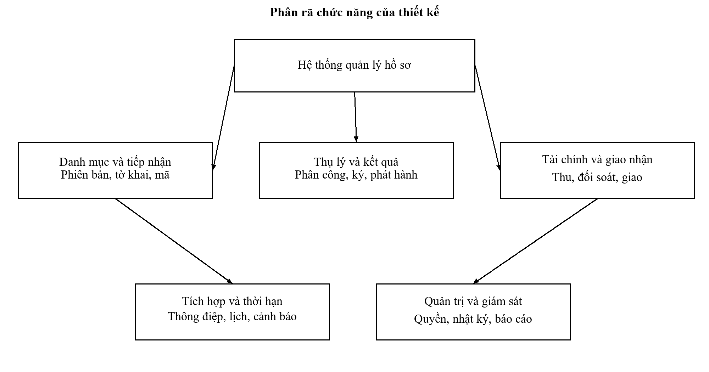
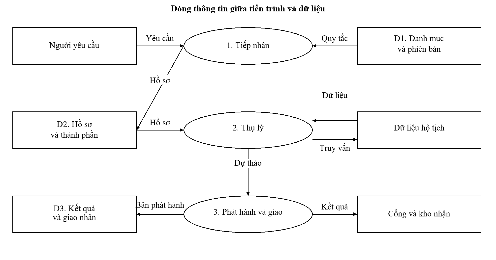
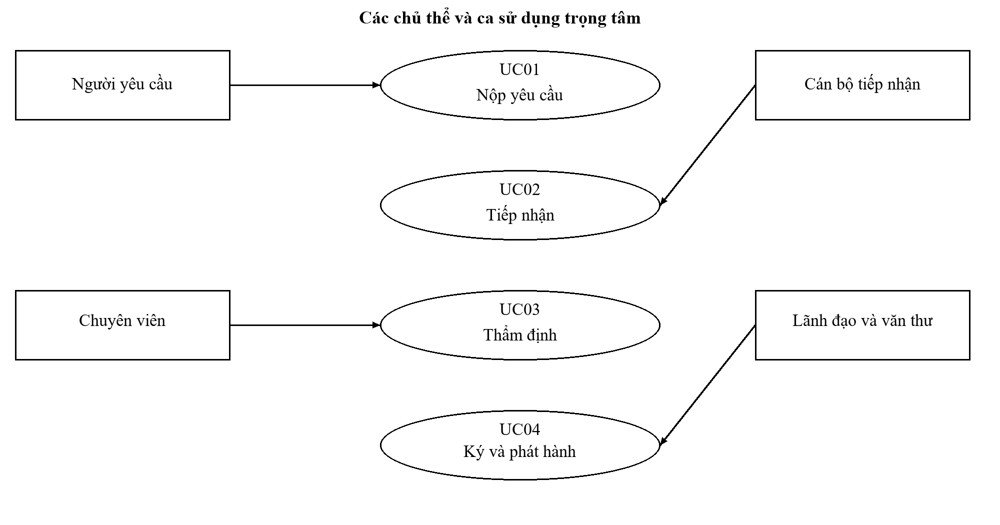
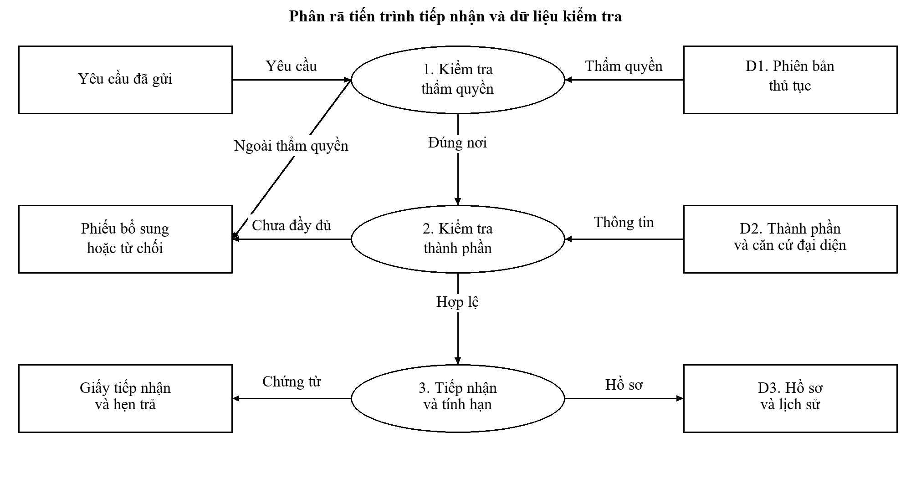
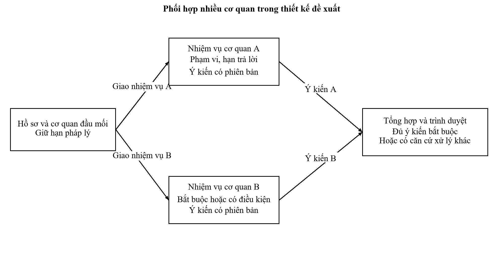

# III. PHÂN TÍCH VÀ ĐẶC TẢ YÊU CẦU

## 3.1. Chủ thể và trách nhiệm

Người yêu cầu có thể đồng thời là người có sự kiện hộ tịch hoặc người đại diện. Hệ thống phải lưu riêng danh tính người giao dịch, chủ thể của thông tin hộ tịch và căn cứ đại diện. Nếu gộp các chủ thể vào một trường công dân, hồ sơ ủy quyền sẽ khó kiểm soát và việc giao kết quả có thể đến sai người. Quyền tra cứu và nhận tài liệu phải được kiểm tra trên quan hệ với từng hồ sơ.

Bảng 3.1: Chủ thể nghiệp vụ và phạm vi trách nhiệm

| Chủ thể | Trách nhiệm | Giới hạn quyền |
| --- | --- | --- |
| Người yêu cầu | Kê khai, bổ sung, theo dõi, nhận kết quả | Chỉ hồ sơ có quan hệ hợp lệ |
| Cán bộ hỗ trợ | Hướng dẫn thao tác và tiếp cận dịch vụ | Không tự xác nhận thay người yêu cầu |
| Cán bộ tiếp nhận | Kiểm tra và lập chứng từ tiếp nhận | Không quyết định nội dung thay chuyên môn |
| Chuyên viên thụ lý | Tra cứu, thẩm định và dự thảo | Không ký kết quả ngoài thẩm quyền |
| Lãnh đạo có thẩm quyền | Phê duyệt hoặc yêu cầu chỉnh sửa | Quyền gắn với cơ quan, thủ tục và thời hạn ủy quyền |
| Văn thư | Cấp số và phát hành | Không thay nội dung bản đã ký |
| Tài chính | Xác định khoản thu, miễn giảm và đối soát | Không sửa trạng thái chuyên môn |
| Quản trị nghiệp vụ | Cấu hình danh mục và quy trình | Phải được phê duyệt trước khi áp dụng |
| Quản trị kỹ thuật | Quản lý tài khoản kỹ thuật, cấu hình vận hành | Không mặc nhiên đọc toàn bộ hồ sơ công dân |
| Kiểm tra, giám sát | Kiểm tra nhật ký và số liệu theo nhiệm vụ | Quyền chỉ đọc và phạm vi được giao |

## 3.2. Phân rã chức năng và dữ liệu trao đổi

Hệ thống được phân thành quản lý danh mục, tiếp nhận, thụ lý, kết quả, tài chính, giao tiếp và quản trị. Phân rã này xác định ranh giới trách nhiệm logic; không yêu cầu triển khai mỗi chức năng thành một vi dịch vụ riêng. Chức năng dùng chung như lịch làm việc và kiểm tra quyền được cung cấp thống nhất để các màn hình không tự tính lại theo cách khác nhau.

Hình 3.1: Sơ đồ phân rã chức năng

Bảng 3.2: Dòng thông tin đầu vào và đầu ra

| Dòng dữ liệu | Nguồn hoặc nơi nhận | Nội dung kiểm soát |
| --- | --- | --- |
| Thông tin thủ tục | Danh mục có quyết định công bố | Phiên bản, hiệu lực, cơ quan và mẫu |
| Hồ sơ yêu cầu | Người yêu cầu qua cổng giao dịch | Chủ thể, tờ khai, thành phần và căn cứ đại diện |
| Kết quả định danh | Nền tảng xác thực được phép | Danh tính, độ tin cậy và thời hạn phiên |
| Dữ liệu hộ tịch | Hệ thống chuyên ngành | Phạm vi truy vấn, tính phù hợp và nguồn dữ liệu |
| Thông báo nghiệp vụ | Người yêu cầu và đơn vị xử lý | Nội dung, thời điểm gửi và trạng thái giao |
| Kết quả giải quyết | Kho dữ liệu và người có quyền nhận | Bản phát hành, chữ ký và chứng cứ giao |
| Giao dịch tài chính | Đơn vị thanh toán và kế toán | Mã giao dịch, số tiền, khoản thu và đối soát |
| Báo cáo điều hành | Người được giao giám sát | Kỳ thống kê, phạm vi và công thức |

Hình 3.2: Sơ đồ luồng dữ liệu mức khái quát

## 3.3. Danh mục yêu cầu chức năng

Bảng 3.3: Yêu cầu chức năng của thiết kế

| Mã | Yêu cầu | Điều kiện chấp nhận |
| --- | --- | --- |
| YC01 | Quản lý phiên bản thủ tục | Hồ sơ giữ đúng phiên bản tại thời điểm tiếp nhận |
| YC02 | Xác thực và kiểm soát quan hệ hồ sơ | Không xem được hồ sơ ngoài quyền |
| YC03 | Kê khai và tái sử dụng dữ liệu | Ghi nguồn; cho xử lý khi dữ liệu không khả dụng |
| YC04 | Tiếp nhận hợp lệ và cấp mã | Mã không trùng; giấy hẹn khớp dữ liệu đã lưu |
| YC05 | Bổ sung và từ chối có căn cứ | Lưu giai đoạn, nội dung, căn cứ và chứng từ |
| YC06 | Phân công thụ lý | Có người chịu trách nhiệm và lịch sử thay đổi |
| YC07 | Tra cứu, thẩm định và trình duyệt | Có bằng chứng tra cứu và phiên bản dự thảo |
| YC08 | Ký duyệt và phát hành | Bản ký bất biến; chữ ký được kiểm tra |
| YC09 | Quản lý thu và đối soát | Thông báo lặp không làm tăng khoản thu |
| YC10 | Trả và đồng bộ kết quả | Lưu chứng cứ giao; phân biệt lỗi đồng bộ |
| YC11 | Theo dõi thời hạn | Lịch, ngoại lệ và điều chỉnh có căn cứ |
| YC12 | Dừng hoặc rút yêu cầu | Có quyết định xử lý và kết luận tài chính |
| YC13 | Nhật ký và báo cáo điều hành | Truy nguyên hành động; số liệu đối chiếu được |
| YC14 | Quản trị tài khoản và cấu hình | Có phê duyệt, giới hạn hiệu lực và thu hồi quyền |

### 3.3.1. Quy tắc về thành phần hồ sơ và dữ liệu dùng lại

Mỗi thành phần hồ sơ có trạng thái cần cung cấp, được thay bằng dữ liệu xác thực, đang chờ kiểm tra hoặc không áp dụng. Một kết nối trả dữ liệu không đồng nghĩa dữ liệu phù hợp với sự kiện hộ tịch cần trích lục. Cán bộ thụ lý phải kiểm tra đúng chủ thể, loại sự kiện và thông tin đăng ký. Khi có dữ liệu phù hợp, thiết kế ghi định danh bản ghi và thời điểm khai thác; không tải toàn bộ hồ sơ dân cư về để dự phòng.

Tái sử dụng tài liệu cần kiểm tra quyền của người yêu cầu, tính toàn vẹn, hiệu lực và mục đích sử dụng. Một tài liệu có chữ ký hợp lệ nhưng đã bị thay thế không được mặc nhiên sử dụng. Nếu dữ liệu đối chiếu chưa đầy đủ, hệ thống đưa hồ sơ sang nhánh cần kiểm tra thay vì suy diễn rằng người yêu cầu khai sai.

### 3.3.2. Quy tắc thời hạn và quá hạn

Thời hạn giải quyết được tính từ thời điểm tiếp nhận hợp lệ theo lịch và quy tắc của phiên bản thủ tục. Đối với nhánh được nghiên cứu, thiết kế mô hình hóa mốc 15 giờ và ngày làm việc tiếp theo theo phương án 1811. Mốc kết thúc ngày làm việc là tham số cần đơn vị quản lý xác nhận. Không thay thời hạn này bằng một số giờ đếm ngược cố định cho mọi hồ sơ.

Sự cố nền tảng, chờ xử lý nội bộ hoặc chờ người phê duyệt không tự cho phép tạm dừng hạn pháp lý. Mỗi khoảng loại trừ thời gian chỉ được ghi khi có căn cứ áp dụng và chứng từ tương ứng. Hệ thống lưu hạn ban đầu, hạn hiện hành và lịch sử điều chỉnh để báo cáo vẫn phản ánh được việc thay đổi. Quá hạn kích hoạt cảnh báo, trách nhiệm giải trình và chứng từ theo quy định; thao tác trả kết quả vẫn được tổ chức để không tiếp tục kéo dài việc phục vụ.

## 3.4. Đặc tả Use case trọng tâm

Hình 3.3: Các chủ thể và Use case trọng tâm

### 3.4.1. Nộp yêu cầu trực tuyến

Bảng 3.4: Use case UC01 về nộp yêu cầu

| Thuộc tính | Nội dung |
| --- | --- |
| Mã và mục tiêu | UC01; tạo yêu cầu có thể chuyển tới đúng cơ quan |
| Chủ thể | Người yêu cầu hoặc đại diện có căn cứ |
| Điều kiện trước | Danh tính đã xác thực; thủ tục và cơ quan đang có hiệu lực |
| Luồng chính | Chọn thủ tục; xác nhận chủ thể; kê khai; bổ sung thành phần áp dụng; kiểm tra; gửi; nhận mã giao dịch |
| Kiểm tra | Trường bắt buộc; quan hệ đại diện; định dạng tệp; phiên bản biểu mẫu; yêu cầu chưa gửi trùng |
| Ngoại lệ | Lỗi kết nối hoặc gửi lại: giữ bản nháp; kiểm tra mã yêu cầu duy nhất trước khi tạo mới |
| Kết quả | Yêu cầu ở trạng thái chờ tiếp nhận và có dấu vết gửi |

### 3.4.2. Kiểm tra và tiếp nhận

Bảng 3.5: Use case UC02 về tiếp nhận hồ sơ

| Thuộc tính | Nội dung |
| --- | --- |
| Mã và mục tiêu | UC02; xác định hồ sơ hợp lệ và thẩm quyền tiếp nhận |
| Chủ thể | Cán bộ tiếp nhận trong phạm vi được phân công |
| Điều kiện trước | Yêu cầu đã gửi và chưa bị xử lý bởi giao dịch khác |
| Luồng chính | Mở yêu cầu; kiểm tra thành phần; chọn nhánh; xác nhận; cấp mã hồ sơ; lập giấy tiếp nhận; tính hạn; chuyển đơn vị |
| Nhánh bổ sung | Lập yêu cầu ghi rõ thiếu sót và căn cứ; gửi chứng từ; giữ lịch sử |
| Nhánh từ chối | Ghi lý do và cơ sở; lập phiếu; thông báo đến người yêu cầu |
| Đồng thời | Nếu người khác đã tiếp nhận, từ chối lưu bản cũ và yêu cầu tải lại |
| Kết quả | Một quyết định tiếp nhận có người thực hiện và chứng từ khớp dữ liệu |

### 3.4.3. Thẩm định và trình ký

Hình 3.4: Phân rã tiến trình tiếp nhận và kiểm tra hồ sơ

Bảng 3.6: Use case UC03 về thẩm định

| Thuộc tính | Nội dung |
| --- | --- |
| Mã và mục tiêu | UC03; hình thành dự thảo trên dữ liệu hộ tịch phù hợp |
| Chủ thể | Chuyên viên được phân công |
| Điều kiện trước | Hồ sơ đã tiếp nhận; quyền truy vấn có hiệu lực |
| Luồng chính | Kiểm tra yêu cầu; truy vấn có mục đích; đối chiếu kết quả; ghi ý kiến; tạo dự thảo; trình người có thẩm quyền |
| Dữ liệu không tìm thấy | Lưu mã truy vấn và kết quả; kiểm tra thông tin đăng ký; xử lý theo quy trình chuyên ngành |
| Dữ liệu có mâu thuẫn | Chuyển kiểm tra chuyên môn; không tự thay dữ liệu gốc |
| Kết quả | Dự thảo có phiên bản và lịch sử nguồn dữ liệu |

### 3.4.4. Ký, phát hành và giao kết quả

Bảng 3.7: Use case UC04 về ký và phát hành

| Thuộc tính | Nội dung |
| --- | --- |
| Mục tiêu | Phát hành đúng bản đã được người có thẩm quyền phê duyệt |
| Điều kiện trước | Dự thảo đã chốt; người ký có thẩm quyền tại thời điểm ký |
| Luồng chính | Kiểm tra bản; ký; kiểm tra chữ ký; chuyển văn thư; cấp số; hoàn thành phát hành; ghi kết quả |
| Ký thất bại | Giữ dự thảo và ghi lỗi; chưa chuyển trạng thái thành đã phát hành |
| Bản bị thay sau ký | Kiểm tra giá trị băm; từ chối phát hành; yêu cầu quy trình sửa đổi |
| Kết quả | Bản phát hành bất biến, số văn bản và bằng chứng chữ ký |

Bảng 3.8: Use case UC05 về trả kết quả

| Thuộc tính | Nội dung |
| --- | --- |
| Mục tiêu | Giao đúng kết quả cho chủ thể có quyền nhận |
| Điều kiện trước | Kết quả đã phát hành và được cán bộ trả kiểm tra |
| Luồng chính | Xác định kênh nhận; gửi kho hoặc thông báo; ghi nhận xác nhận giao; đồng bộ; kết thúc tác nghiệp |
| Lỗi kho nhận | Ghi đã phát hành nhưng chưa đồng bộ; xếp hàng thử lại có giới hạn |
| Sai sót kết quả | Trả lại đơn vị giải quyết theo quy trình; liên kết bản thay thế với bản cũ |
| Kết quả | Trạng thái giao nhận riêng với trạng thái chuyên môn |

### 3.4.5. Đối soát tài chính và dừng yêu cầu

Bảng 3.9: Use case UC06 và UC07 về tài chính và dừng yêu cầu

| Thuộc tính | UC06 đối soát | UC07 dừng yêu cầu |
| --- | --- | --- |
| Chủ thể | Tài chính và hệ thống thanh toán | Người yêu cầu, cán bộ có trách nhiệm |
| Điều kiện | Khoản thu có căn cứ và mã giao dịch | Hồ sơ còn khả năng xử lý theo quy định |
| Luồng | Xác minh thông báo; đối chiếu số tiền; ghi nhận; so sánh sao kê | Tiếp nhận đề nghị; xem giai đoạn; quyết định; thông báo; xử lý tài chính |
| Ngoại lệ | Trùng thông báo, thiếu tiền, hoàn tiền hoặc sai hồ sơ | Kết quả đã phát hành hoặc quyền đại diện chưa đủ |
| Kết quả | Giao dịch có trạng thái và bằng chứng đối soát | Hồ sơ dừng có lý do và chứng từ |

## 3.5. Yêu cầu phi chức năng và rủi ro

Bảng 3.10: Chỉ tiêu phi chức năng đề xuất cho nghiệm thu

| Mã | Nội dung | Mức đề xuất và cách đo |
| --- | --- | --- |
| PC01 | Kiểm soát truy cập | Kiểm tra quyền cho mọi thao tác đọc và ghi hồ sơ |
| PC02 | Thời gian thao tác thông thường | 95% yêu cầu không quá 2 giây, không tính dịch vụ bên ngoài |
| PC03 | Toàn vẹn hồ sơ | Không mất cập nhật; không cấp trùng mã trong thử đồng thời |
| PC04 | Khả năng phục hồi | Mục tiêu mất dữ liệu không quá 15 phút; phục hồi trong 4 giờ |
| PC05 | Khả năng sử dụng | Thao tác được bằng bàn phím; lỗi có chỉ dẫn rõ; nhãn không phụ thuộc màu |
| PC06 | Nhật ký | Tìm được chủ thể, hành động, đối tượng và thời điểm của giao dịch |
| PC07 | Tương thích | Kiểm tra các trình duyệt được đơn vị sử dụng thống nhất |
| PC08 | Bảo trì | Thay quy tắc bằng phiên bản; có quy trình quay lui |

Các chỉ tiêu phải được thương lượng lại sau khi biết tổng tải, số điểm truy cập, hạ tầng và mức độ an toàn được phê duyệt. Lưu lượng của một thủ tục không đủ để suy ra công suất toàn hệ thống. Thời gian hoàn thành thủ tục cũng khác thời gian đáp ứng của một thao tác phần mềm; hai chỉ số cần được báo cáo riêng.

Bảng 3.11: Rủi ro và biện pháp trong phân tích yêu cầu

| Rủi ro | Tác động | Kiểm soát đề xuất |
| --- | --- | --- |
| Sai phiên bản thủ tục | Thu sai hoặc hẹn sai hạn | Chốt phiên bản và kiểm tra quyết định công bố |
| Gộp chủ thể đại diện | Lộ kết quả cho người không có quyền | Lưu quan hệ và kiểm tra theo hồ sơ |
| Nhận lại thông báo tài chính | Ghi thu lặp | Mã giao dịch duy nhất và xử lý lặp an toàn |
| Hiểu đã ký là đã giao | Báo cáo hoàn thành sai | Tách phát hành, giao và đồng bộ |
| Chặn trả vì quá hạn | Tiếp tục kéo dài quyền lợi người dân | Cảnh báo và giải trình; không tạo rào cản giao kết quả |
| Áp dụng giới hạn bổ sung máy móc | Bỏ sót nghiệp vụ chuyên ngành | Gắn giai đoạn, căn cứ và thẩm quyền |

## 3.6. Ma trận truy vết yêu cầu

Bảng 3.12: Truy vết từ yêu cầu đến thiết kế và kiểm thử

| Yêu cầu | Use case | Thành phần thiết kế | Kiểm thử |
| --- | --- | --- | --- |
| YC01 | UC01, UC02 | phien_ban_thu_tuc | KT01, KT02 |
| YC02 | UC01, UC05 | chu_the, uy_quyen, quyền hồ sơ | KT03, KT04 |
| YC03 | UC01, UC03 | thanh_phan, bằng chứng nguồn | KT05, KT06 |
| YC04 | UC02 | ho_so, biểu mẫu và mã hồ sơ | KT07, KT08 |
| YC05 | UC02, UC03 | yeu_cau_bo_sung, nhat_ky | KT09, KT10 |
| YC06, YC07 | UC03 | phan_cong, sự kiện xử lý | KT11, KT12 |
| YC08 | UC04 | ket_qua, chu_ky | KT13, KT14 |
| YC09 | UC06 | khoan_thu, giao_dich | KT15, KT16 |
| YC10 | UC05 | giao_nhan, hang_doi_gui | KT17, KT18 |
| YC11 | UC02, UC03 | lich_lam_viec, hạn và ngoại lệ | KT19, KT20 |
| YC12 | UC07 | quyết định dừng và liên kết tài chính | KT21 |
| YC13, YC14 | Các ca | nhật ký, cấu hình và quyền | KT22, KT23, KT24 |

Ma trận là công cụ quản lý thay đổi. Khi sửa cách tính hạn, cần xem lại kiểm thử KT19 và KT20, giấy hẹn, báo cáo quá hạn và lịch sử điều chỉnh. Nếu thay phiên bản biểu mẫu mà không sửa truy vết, việc kiểm thử lại có thể bỏ qua đầu ra hành chính chịu tác động.

## 3.7. Yêu cầu bổ sung cho toàn hệ thống

### 3.7.1. Phân biệt quy trình dùng chung và nghiệp vụ chuyên ngành

Các yêu cầu YC01 đến YC14 mô tả lõi xử lý và được đặc tả sâu bằng thủ tục hộ tịch. Khi áp dụng cho toàn hệ thống, cần bổ sung tổ chức giao dịch, tuyến tác nghiệp, phối hợp nhiều cơ quan, quản lý kho, nộp lưu và phản ánh. Một cơ quan có thể xử lý nhiều lĩnh vực; một lĩnh vực có nhiều phiên bản thủ tục; một hồ sơ có nhiều nhiệm vụ phối hợp nhưng vẫn có đầu mối chịu trách nhiệm cuối cùng. Không được lấy cấu trúc của một hồ sơ hộ tịch để bắt mọi hồ sơ đất đai, doanh nghiệp hoặc an sinh phải có chủ thể sự kiện hộ tịch.

Bảng 3.13: Yêu cầu và điều kiện chấp nhận ở phạm vi toàn hệ thống

| Mã | Nội dung yêu cầu | Điều kiện chấp nhận |
| --- | --- | --- |
| YCT01 | Đồng bộ danh mục và đơn vị có lịch sử | Mã mới không làm đổi chứng từ hoặc cơ quan gốc của hồ sơ cũ |
| YCT02 | Xác định tuyến xử lý theo phiên bản | Chỉ một tuyến có quyền tiếp nhận tại cùng thời điểm áp dụng |
| YCT03 | Nhận hồ sơ từ nhiều kênh | Kênh, người hỗ trợ và người giao dịch được lưu riêng |
| YCT04 | Số hóa và kiểm tra chất lượng | Đủ trang, đọc được, đúng hồ sơ và có xác nhận theo quy định |
| YCT05 | Quản lý giao dịch của tổ chức | Kiểm tra quan hệ đại diện; chữ ký cá nhân không mặc nhiên thay quyền tổ chức |
| YCT06 | Phối hợp nhiều cơ quan | Có nhiệm vụ, người nhận, hạn, ý kiến và bằng chứng kết thúc |
| YCT07 | Tiếp nhận sự kiện từ hệ thống bộ | Kiểm tra nguồn, mã ngoài, thứ tự và thông điệp lặp |
| YCT08 | Bàn giao khi đổi tuyến | Có xác nhận nhận đủ; giữ mã, hạn và lịch sử |
| YCT09 | Tích hợp ký và kiểm tra chứng thư | Gắn chữ ký đúng phiên bản; không chỉ kiểm tra hình chữ ký |
| YCT10 | Dùng lại giấy tờ trong kho | Đúng chủ thể, mục đích, hiệu lực và phiên bản |
| YCT11 | Kết nối kho quốc gia | Không tìm thấy tại địa phương mới truy vấn theo quyền và hợp đồng |
| YCT12 | Nộp lưu hồ sơ điện tử | Có danh mục thành phần, giá trị toàn vẹn và biên nhận |
| YCT13 | Thông báo, nhắc việc và tra cứu | Đúng người nhận, không lộ nội dung nhạy cảm qua kênh công khai |
| YCT14 | Phản ánh và đánh giá phục vụ | Phân loại, chuyển đúng đơn vị, theo dõi trả lời; không sửa quyết định hồ sơ |
| YCT15 | Thống kê hợp nhất nhiều nguồn | Khử trùng theo mã và hệ thống nguồn; có mốc chốt và dấu vết điều chỉnh |
| YCT16 | Tách nghĩa vụ và kênh thanh toán | Hồ sơ không thu phí không bị buộc qua màn hình thanh toán |
| YCT17 | Kiểm soát tìm kiếm và kết xuất | Áp dụng quyền tới từng hồ sơ trước khi trả hoặc xuất dữ liệu |
| YCT18 | Xử lý mất kết nối phụ thuộc | Có hướng dẫn và theo dõi phục hồi; không báo thành công giả |
| YCT19 | Quản trị phiên bản tương lai | Ngày hiệu lực quyết định áp dụng; hồ sơ chuyển tiếp giữ căn cứ phù hợp |
| YCT20 | Trợ giúp cán bộ dựa trên nguồn | Câu trả lời có căn cứ, đúng phiên bản; cán bộ xác nhận trước sử dụng |

Yêu cầu YCT01 đến YCT20 là yêu cầu của thiết kế nghiên cứu, được xây dựng từ khung chức năng và rủi ro phát sinh trong bối cảnh Hà Nội. Chúng không phải danh sách thiếu sót đã xác nhận của phần mềm đang vận hành. Các nội dung về danh mục, luân chuyển, phối hợp, nhắc việc, báo cáo, kho và kết nối được đối chiếu với phụ lục Thông tư 11/2025/TT-BKHCN. [18], [19]

### 3.7.2. Luồng phối hợp và điều kiện tổng hợp

Quy trình liên thông có thể gồm các nhiệm vụ song song. Hồ sơ chỉ được tổng hợp trình duyệt khi các ý kiến bắt buộc đã hoàn tất hoặc có căn cứ xử lý trường hợp thiếu ý kiến. Mỗi nhiệm vụ giữ cơ quan nhận, nội dung yêu cầu, hạn phản hồi, người thực hiện và phiên bản trả lời. Nếu một đơn vị gửi lại ý kiến, bản mới thay thế có liên kết nhưng không xóa bản đã dùng để ra quyết định trước đó.

Hình 3.4: Nhiệm vụ phối hợp và điều kiện tổng hợp hồ sơ

Đối với nhiệm vụ trên hệ thống bộ, cán bộ địa phương có thể chỉ có quyền theo dõi hoặc thực hiện bước được giao. Thiết kế cần phân biệt quyền ra quyết định với quyền ghi nhận thông tin từ nguồn. Người dùng không được chọn “hoàn tất” chỉ để làm sạch danh sách công việc khi hệ thống nguồn chưa có quyết định. Sự kiện không đúng thứ tự được giữ để đối chiếu, thay vì áp dụng trực tiếp rồi làm hồ sơ quay ngược trạng thái.

### 3.7.3. Kho, phản ánh và trợ giúp nghiệp vụ

Kho dữ liệu phục vụ dùng lại giấy tờ phải lưu chủ thể, loại tài liệu, cơ quan cấp, thời điểm, phạm vi hiệu lực, phiên bản và tình trạng thay thế. Không lấy việc người dân từng tải một tệp lên làm bằng chứng tài liệu đã được cơ quan kiểm tra. Một yêu cầu dùng lại tạo dấu vết truy cập và tham chiếu, để có thể biết giấy tờ nào đã được dùng cho quyết định nào.

Phản ánh kiến nghị, đánh giá hài lòng và khiếu nại quyết định hành chính có mục đích, quy trình khác nhau. Thiết kế phân loại thông tin ngay khi nhận và chuyển tới đơn vị phù hợp; phản ánh về thái độ phục vụ không tự làm thay đổi kết quả giải quyết. Đánh giá cần ghi kênh, thời điểm và quan hệ hồ sơ khi có, tránh để cán bộ đánh giá thay người được phục vụ. Hệ thống không yêu cầu đánh giá tích cực như điều kiện nhận kết quả.

Trợ giúp cán bộ chỉ tìm và giải thích tài liệu đã được phê duyệt theo phiên bản. Khi không có căn cứ hoặc có quy định mâu thuẫn, hệ thống hiển thị nội dung cần hỏi đơn vị nghiệp vụ. Dữ liệu hồ sơ không được đưa vào dịch vụ bên ngoài chỉ vì công cụ đó có thể trả lời nhanh. Quyết định thẩm định và ký vẫn thuộc người có thẩm quyền; phải kiểm tra nguy cơ hướng dẫn sai, lấy nguồn cũ và lộ thông tin trước khi cho sử dụng.

## 3.8. Truy vết chín nhóm chức năng vào thiết kế

Bảng 3.14: Phạm vi chức năng và bằng chứng kiểm chứng dự kiến

| Nhóm chức năng | Yêu cầu liên quan | Thiết kế hoặc quản trị | Ca kiểm thử |
| --- | --- | --- | --- |
| Tài khoản | YC02, YC14, YCT05 | Tài khoản, quyền phạm vi, đại diện | KT03, AT02, HT05 |
| Danh mục và hồ sơ | YC01, YC04, YCT01, YCT19 | Phiên bản, lịch, đơn vị và mẫu | KT01, HT01, HT19 |
| Ký số | YC08, YCT09 | Kết quả, chữ ký, kiểm tra chứng thư | KT13, KT14, HT09 |
| Tiếp nhận, giải quyết | YC03 đến YC12, YCT03, YCT06 | Hồ sơ, phân công, nhiệm vụ phối hợp | KT07 đến KT21, HT03, HT06 |
| Tiện ích | YCT13, YCT17, YCT20 | Thông báo, tìm kiếm, trợ giúp | HT13, HT17, HT20 |
| Báo cáo | YC13, YCT15 | Dữ liệu hợp nhất và quy tắc chốt | KT22, HT15 |
| Điều hành | YC06, YC11, YCT06 | Người chịu trách nhiệm và cảnh báo | KT11, KT19, HT06 |
| Kho dữ liệu | YCT10, YCT11, YCT12 | Kho, tham chiếu, gói nộp lưu | HT10, HT11, HT12 |
| Liên thông | YC09, YC10, YCT02, YCT07, YCT08 | Tuyến, thông điệp, đối soát | KT15, KT17, HT02, HT07, HT08 |

Ma trận này bảo đảm không bỏ một nhóm chức năng trong phạm vi nghiên cứu. Nó chưa chứng minh đã bao phủ mọi nhánh chuyên ngành hoặc mọi tình huống sản xuất. Trước nghiệm thu, đơn vị sử dụng cần chọn mẫu thủ tục theo khác biệt về chủ thể, thẩm quyền, thời hạn, nghĩa vụ tài chính, xác minh và kết quả; mỗi nhóm khác biệt phải có ca chấp nhận riêng.

## 3.9. Phân tích từng chức năng trong chín nhóm

Phần này phân rã 31 chức năng của khung yêu cầu tại phụ lục Thông tư 11/2025/TT-BKHCN. Mã CN01 đến CN31 là mã truy vết do nghiên cứu đặt theo thứ tự nhóm, không phải mã tính năng nội bộ của Hà Nội. Tên trong bảng được diễn đạt ngắn theo trách nhiệm; nội dung đầu vào, đầu ra và kiểm soát là phân tích thiết kế. Mỗi nhóm cần được đối chiếu trên môi trường thực tế trước khi xác nhận mức đáp ứng. [18]

### 3.9.1. Nhánh tài khoản

Bảng 3.15: Đặc tả chức năng nhánh tài khoản

| Chức năng | Đầu vào và chủ thể | Đầu ra và kiểm soát |
| --- | --- | --- |
| CN01 Quản lý tài khoản | Căn cứ cấp, đổi hoặc thu hồi; người quản trị được giao | Tài khoản và quyền theo cơ quan, vai trò, thời hạn; phê duyệt và nhật ký. Chuyển công tác phải thu hồi quyền cũ, xử lý hồ sơ còn phụ trách và kiểm tra phiên truy cập |

Tài khoản cán bộ khác danh tính người dân trên cổng quốc gia. Cán bộ có thể hỗ trợ nhập nhưng hồ sơ phải ghi người giao dịch thực tế. Đổi tên cơ quan không làm mất lịch sử trách nhiệm của cán bộ trong hồ sơ đã xử lý.

### 3.9.2. Nhánh danh mục, biểu mẫu và hồ sơ

Bảng 3.16: Đặc tả chức năng nhánh danh mục và hồ sơ

| Chức năng | Đầu vào và chủ thể | Đầu ra và kiểm soát |
| --- | --- | --- |
| CN02 Danh mục dùng chung | Cơ quan, lĩnh vực, địa bàn và trạng thái từ đầu mối được phép | Bản danh mục có mã, nguồn và hiệu lực; kiểm tra mã trùng, đổi tên và ánh xạ cũ. Không xóa mã đang được hồ sơ lịch sử tham chiếu |
| CN03 Danh mục thủ tục | Quyết định công bố, thẩm quyền, thành phần, hạn, mức thu; đầu mối kiểm soát thủ tục | Phiên bản được duyệt, lịch áp dụng và tuyến tác nghiệp; thử ngày hiệu lực, nhánh cơ quan và hồ sơ chuyển tiếp trước công bố |
| CN04 Trạng thái hồ sơ | Trạng thái và điều kiện chuyển theo quy trình được duyệt | Trạng thái nghiệp vụ nhất quán; quyền và căn cứ cho từng chuyển. Theo dõi tài chính, giao và đồng bộ riêng để tránh tổ hợp trạng thái khó kiểm soát |
| CN05 Hồ sơ, biểu mẫu điện tử | Dữ liệu khai, thành phần hoặc nguồn dùng lại; người dân và cán bộ có quyền | Hồ sơ, mẫu có phiên bản và chứng cứ; kiểm tra kiểu trường, điều kiện bắt buộc, tệp và đại diện. Không bắt nộp lại dữ liệu đã khai thác hợp lệ |
| CN06 Luân chuyển hồ sơ | Hồ sơ đủ điều kiện, cơ quan nhận và nhiệm vụ; cán bộ điều phối | Sự kiện chuyển và xác nhận nhận; giữ trách nhiệm khi bên nhận chưa xác nhận. Chuyển nhầm cần căn cứ chỉnh và không làm mất hạn gốc |
| CN07 Quy trình xử lý | Các bước, vai trò, thời hạn và ngoại lệ; người cấu hình được giao | Phiên bản có điều kiện, lịch sử và phê duyệt; hồ sơ cũ giữ căn cứ áp dụng, không đổi hàng loạt chỉ vì cấu hình mới được lưu |
| CN08 Theo dõi tiến trình | Sự kiện, phân công, hạn và kết quả phối hợp | Lịch sử có thời điểm và chủ thể; chỉ báo sắp hạn, quá hạn, tồn đọng. Đối chiếu nguồn trước khi hiển thị hồ sơ xử lý trên hệ thống bộ |
| CN09 Cấu hình trực quan | Sơ đồ bước và tham số; người cấu hình và người duyệt | Quy trình được kiểm tra trước phát hành; phát hiện bước thiếu người nhận, vòng lặp thiếu điều kiện thoát, nhánh mất kết quả và hạn không xác định |

Biểu mẫu và quy trình là hai cấu hình liên quan nhưng khác trách nhiệm. Thêm trường bắt buộc có thể khiến hồ sơ đang bổ sung không gửi lại được; thay bước có thể làm người được phân công mất quyền. Phê duyệt thay đổi cần kiểm tra cả hai và xác định cách xử lý hồ sơ đang mở. Sơ đồ trực quan chỉ có giá trị vận hành khi điều kiện và quyền của từng đường nối được đặc tả.

### 3.9.3. Nhánh chữ ký số

Bảng 3.17: Đặc tả chức năng nhánh chữ ký số

| Chức năng | Đầu vào và chủ thể | Đầu ra và kiểm soát |
| --- | --- | --- |
| CN10 Sử dụng chữ ký số | Tài liệu được phép ký, người ký và chứng thư; lãnh đạo, cán bộ hoặc văn thư theo thẩm quyền | Bản ký gắn đúng phiên bản và chứng thư; lưu kết luận xác minh. Phân biệt ký cá nhân và cơ quan, không dùng tài khoản kỹ thuật ký thay người có thẩm quyền |
| CN11 Tích hợp dịch vụ ký | Yêu cầu ký, mã tương quan, hợp đồng kết nối với dịch vụ được phép | Phản hồi được xác thực và đối chiếu bản gửi; mất phản hồi không tạo lần ký mới tùy ý. Tệp lỗi hoặc chứng thư không đáp ứng phải được xử lý trước phát hành |

Tập huấn tháng 09/2026 cho thấy ký và chất lượng kết quả điện tử là công việc thực tế. Chưa có cấu hình thiết bị và dịch vụ hiện hữu; thiết kế cần xác nhận cách ký, chính sách chứng thư và người quản lý khóa. Không suy ra nhà cung cấp hoặc sản phẩm ký cụ thể từ tên chức năng. [23]

### 3.9.4. Nhánh tiếp nhận và giải quyết

Bảng 3.18: Đặc tả chức năng nhánh tiếp nhận và giải quyết

| Chức năng | Đầu vào và chủ thể | Đầu ra và kiểm soát |
| --- | --- | --- |
| CN12 Tiếp nhận | Yêu cầu trực tuyến, trực tiếp hoặc bưu chính; cán bộ đúng tuyến | Mã chính thức, thời điểm hợp lệ, giấy hẹn và hạn; kiểm tra gửi lặp, thẩm quyền, phiên bản và thành phần. Không tính yêu cầu chưa tiếp nhận như hồ sơ hợp lệ |
| CN13 Bổ sung | Thiếu thông tin được xác định, căn cứ và giai đoạn; cán bộ có quyền | Phiếu cụ thể và bản bổ sung có lịch sử; phân biệt trước tiếp nhận với trong thẩm định. Không tự dừng đồng hồ hạn khi chưa có quy tắc cho phép |
| CN14 Phân công | Hồ sơ đã tiếp nhận, người đúng quyền, năng lực và lịch | Trách nhiệm hiện hành và lịch sử giao; xác định người chịu trách nhiệm chính. Chuyển giao phải xử lý thao tác đang mở và kiểm soát đồng thời |
| CN15 Thẩm định, phối hợp | Thành phần, dữ liệu nguồn, nhiệm vụ và ý kiến chuyên môn | Kết luận, dự thảo hoặc yêu cầu làm rõ có căn cứ; đủ ý kiến bắt buộc hoặc có căn cứ xử lý khác. Không tự coi bên phối hợp im lặng là đồng ý |
| CN16 Phê duyệt | Dự thảo đủ chứng cứ; người quyết định theo thẩm quyền | Chấp thuận, trả lại hoặc không giải quyết; ghi lý do, phiên bản và chủ thể. Bản sửa sau ký phải thành phiên bản mới |
| CN17 Dừng giải quyết | Đề nghị hoặc căn cứ dừng; người được quyết định | Thông báo và trạng thái có lịch sử; xử lý khoản thu, kết nối và nhiệm vụ còn mở. Dừng kỹ thuật không tự trở thành dừng nghiệp vụ |
| CN18 Trả kết quả | Bản phát hành hợp lệ, quyền nhận và kênh; người giao hoặc hệ thống đích | Chứng cứ giao, phiên bản và trạng thái từng kênh; gửi thông báo không thay bằng chứng người nhận hoặc kho đích đã nhận kết quả |

Hai trường hợp nghiên cứu làm rõ khác biệt của nhánh này. Hộ tịch cần phân biệt người yêu cầu với chủ thể sự kiện và căn cứ đại diện. Cấp bản sao từ sổ gốc không thu phí, áp dụng hạn trong ngày hoặc ngày làm việc tiếp theo theo thời điểm nhận; tổng thời lượng từng bước không thay hạn pháp lý. Thiết kế dùng phiên bản quy tắc, thay vì áp một quy trình cho mọi thủ tục. [2], [22]

### 3.9.5. Nhánh tiện ích hỗ trợ

Bảng 3.19: Đặc tả chức năng nhánh tiện ích

| Chức năng | Đầu vào và chủ thể | Đầu ra và kiểm soát |
| --- | --- | --- |
| CN19 In, kết xuất | Hồ sơ, mẫu hợp lệ và quyền; cán bộ hoặc người giao dịch | Bản theo mẫu, nguồn và phiên bản; hạn chế xuất hàng loạt, ghi nhật ký và không lộ trường ngoài mục đích in |
| CN20 Thông báo, nhắc việc | Sự kiện, hạn, người nhận và mẫu đã duyệt | Thông báo có mã, trạng thái; chống gửi lặp, tránh thông tin nhạy cảm trên kênh ít bảo vệ, phân biệt gửi với giao |
| CN21 Tra cứu | Từ khóa, mã hoặc bộ lọc; người có phạm vi khai thác | Danh sách trong quyền; kiểm soát tìm kiếm và tải tệp. Mã hồ sơ không được coi là bí mật duy nhất để mở toàn bộ nội dung |
| CN22 Trợ giúp cán bộ | Câu hỏi và nguồn đã duyệt; cán bộ sử dụng | Hướng dẫn có nguồn, phiên bản; thiếu căn cứ thì chuyển hỏi nghiệp vụ. Không quyết định hộ, tự đổi hạn hoặc khai thác hồ sơ ngoài quyền |

Hướng dẫn năm 2023 chứng minh từng có nhánh tra cứu, phản ánh và giao dịch công dân trên cổng địa phương. Cấu hình kênh và đăng nhập trong đó là tư liệu lịch sử. Tiện ích hiện tại phải được đặt đúng bên cổng quốc gia hoặc bàn làm việc cán bộ theo trách nhiệm thống nhất. [16], [18]

### 3.9.6. Nhánh thống kê và báo cáo

Bảng 3.20: Đặc tả chức năng nhánh báo cáo

| Chức năng | Đầu vào và chủ thể | Đầu ra và kiểm soát |
| --- | --- | --- |
| CN23 Tổng hợp báo cáo | Hồ sơ, sự kiện, nguồn và kỳ; đầu mối báo cáo | Báo cáo có mốc chốt, phạm vi và nguồn; loại nháp và trùng, tách tác nghiệp Thành phố với số liệu nhận từ bộ |
| CN24 Mẫu báo cáo | Định nghĩa chỉ số, mẫu và lịch; người duyệt | Phiên bản và công thức truy nguyên; đổi công thức không làm báo cáo cũ mang ý nghĩa mới. Lưu định nghĩa dùng khi phát hành |
| CN25 Thống kê hồ sơ | Hồ sơ đủ điều kiện, bộ lọc và cách đếm | Số lượng, tỷ lệ, danh sách đối chiếu; tách quá hạn đang mở với hoàn thành trễ, thao tác với hồ sơ, đích nhận với kết quả |

Để kiểm tra một tỷ lệ cần cả tử số, mẫu số, kỳ và các loại trừ. Hai nền tảng có thể hiển thị cùng tỷ lệ nhưng khác phạm vi dữ liệu; đối soát phải đi đến mã hồ sơ và sự kiện nguồn, không chỉ so con số tổng. Số liệu công khai năm 2026 được dùng đúng kỳ để nhận diện tiêu chí phục vụ. [20]

### 3.9.7. Nhánh điều hành tác nghiệp

Bảng 3.21: Đặc tả chức năng nhánh điều hành

| Chức năng | Đầu vào và chủ thể | Đầu ra và kiểm soát |
| --- | --- | --- |
| CN26 Theo dõi, truy vấn | Hồ sơ theo trách nhiệm cơ quan, cán bộ, hạn và vướng mắc | Danh sách điều hành kèm nguyên nhân; tách quyền xem nội dung với quyền chỉ xem chỉ số. Xử lý tồn đọng dựa trên chứng cứ |
| CN27 Chỉ đạo điều hành | Chỉ đạo của người có quyền và phạm vi hồ sơ | Nhiệm vụ, đầu mối, mốc phản hồi và lịch sử; chỉ đạo không tự thay quyết định chuyên môn, thẩm quyền hoặc hạn pháp luật |

Điều hành phải nhìn thấy hồ sơ mắc ở đâu, ai chịu trách nhiệm và điều kiện nào chưa đủ. Cảnh báo thiếu nguyên nhân có thể dẫn đến điều chỉnh dữ liệu để đạt chỉ tiêu. Bảng điều hành vì vậy được liên kết với sự kiện, nhiệm vụ phối hợp và trạng thái phụ thuộc bên ngoài; điều chỉnh phải có giải trình và lịch sử.

### 3.9.8. Nhánh kho dữ liệu

Bảng 3.22: Đặc tả chức năng nhánh kho dữ liệu

| Chức năng | Đầu vào và chủ thể | Đầu ra và kiểm soát |
| --- | --- | --- |
| CN28 Quản trị kho | Danh tính, đại diện, kết quả và chính sách dùng lại; người quản lý được giao | Liên kết tài liệu và quyền; quản trị kỹ thuật không tự xem toàn bộ hồ sơ. Phân biệt bản thay thế, quyền thu hồi và hạn lưu theo căn cứ |
| CN29 Sử dụng kho | Người giao dịch, tài liệu còn hợp lệ và mục đích thủ tục mới | Dùng lại có nguồn, phiên bản và quyền; tệp không hợp lệ không tự thành thành phần đạt. Nháp hoặc hồ sơ từng từ chối chỉ được dùng theo điều kiện xác nhận |

Kho dùng lại, kho tác nghiệp, bản sao phục hồi và nơi lưu trữ có trách nhiệm khác nhau. Trả kết quả cho công dân không làm mất nghĩa vụ giữ chứng cứ của cơ quan. Bộ nộp lưu phải đủ thành phần, dữ liệu đặc tả và biên nhận, không chỉ chép tệp kết quả vào một thư mục. [26], [27]

### 3.9.9. Nhánh tích hợp và liên thông

Bảng 3.23: Đặc tả chức năng nhánh liên thông

| Chức năng | Đầu vào và chủ thể | Đầu ra và kiểm soát |
| --- | --- | --- |
| CN30 Kết nối hệ thống | Hợp đồng, nguồn, tuyến bộ, dữ liệu chuyên ngành, ký và thanh toán | Thông điệp xác thực theo nguồn chính thức; mã tương quan, chống lặp, thứ tự, giới hạn chờ, thử lại và đối soát. Thay hợp đồng phải thử tương thích |
| CN31 Kết nối cổng quốc gia | Yêu cầu, biểu mẫu, mã, trạng thái và kết quả theo hợp đồng duyệt | Trao đổi có xác nhận và phản hồi nhất quán; liên kết mã, phiên bản. Lỗi truyền không tạo lại hồ sơ hoặc coi kết quả chưa giao là đã nhận |

Chỉ đạo năm 2026 thay điểm tác nghiệp theo thủ tục, không chỉ thay giao diện. Cần xác định bên có quyền cập nhật trạng thái gốc trước đồng bộ. Hồ sơ xử lý trên hệ thống bộ không được chạy lại cùng quy trình tại địa phương rồi tổng hợp hai lần. Mã nguồn, mã hồ sơ ngoài và mốc dữ liệu là thành phần bắt buộc của phương án đối soát. [19]

## 3.10. Kiểm chứng các nhánh xuyên suốt

Bảng 3.24: Chuỗi kiểm chứng liên kết nhiều nhóm chức năng

| Trường hợp | Các nhánh phải nối đúng | Bằng chứng cần kiểm tra |
| --- | --- | --- |
| Nộp trực tuyến | Danh mục, biểu mẫu, liên thông, tiếp nhận, thông báo | Cùng mã yêu cầu; phiên bản; giấy hẹn; trạng thái khớp hai bên |
| Hỗ trợ tại điểm nhận | Danh tính, quyền, số hóa, tiếp nhận, theo dõi | Người giao dịch khác người nhập; kênh thực tế; tệp hợp lệ |
| Phối hợp nhiều cơ quan | Phân công, nhiệm vụ, hạn, điều hành, phê duyệt | Đủ ý kiến bắt buộc; phiên bản; hạn gốc được giữ |
| Không thu phí | Phiên bản, tài chính, ký và trả | Căn cứ không phí; không chặn vì thiếu thanh toán |
| Bộ mất phản hồi | Phân tuyến, hộp nhận, trạng thái, báo cáo | Thử lại cùng mã; không đếm trùng; đối soát trước kết thúc sự cố |
| Bản ký lỗi, thay thế | Chữ ký, kết quả, phát hành, kho, giao | Không phát hành bản lỗi; quan hệ thay thế; chứng cứ bản thực giao |
| Đổi tổ chức | Danh mục, tài khoản, phân công, lịch sử | Quyền mới; trách nhiệm tồn đọng; chứng từ cũ giữ nguyên |
| Nộp lưu | Hồ sơ, kho, danh mục, lưu trữ, quyền | Gói đủ tài liệu; toàn vẹn; biên nhận; quyền khai thác |

Phân tích riêng một nhánh chưa đủ chứng minh hệ thống hoạt động đúng. Từng chuỗi phải giữ định danh, căn cứ và phiên bản xuyên các điểm chuyển. Các ca HT01 đến HT20 cùng bộ ca trọng tâm chuẩn bị kiểm chứng; nếu một đầu mối chưa có môi trường hoặc hợp đồng kết nối, kết luận của chuỗi là chưa kiểm chứng, không phải đạt.
