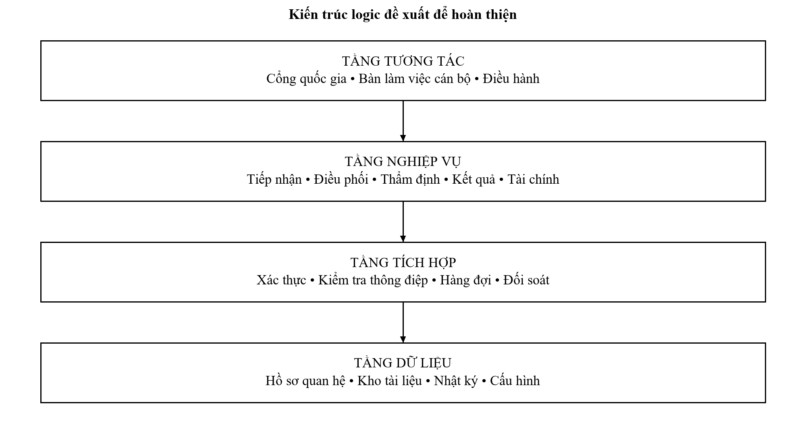
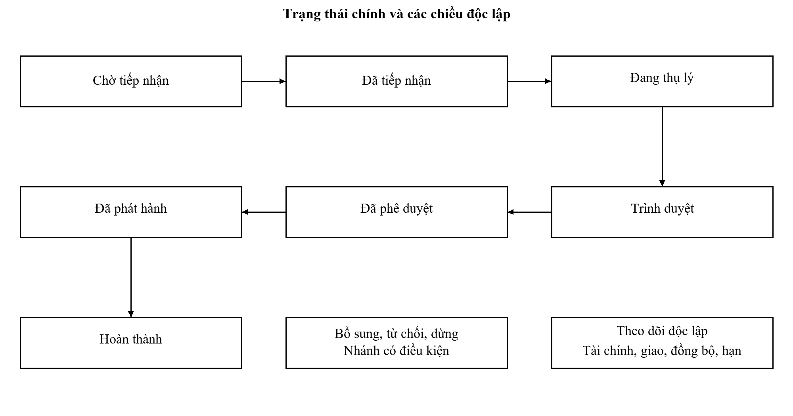
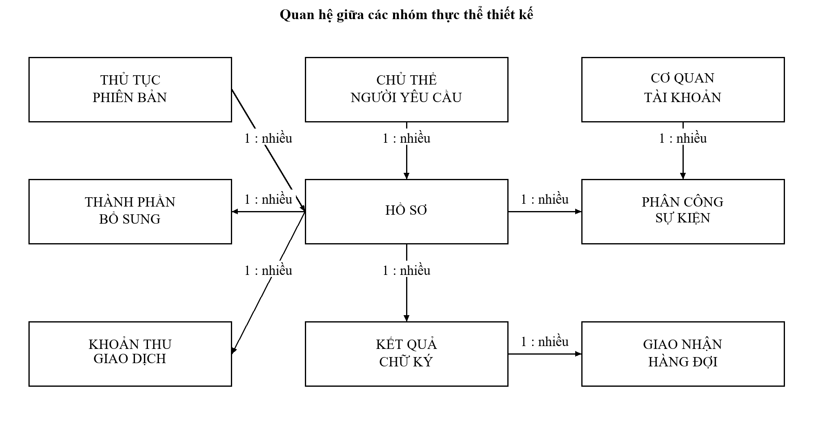
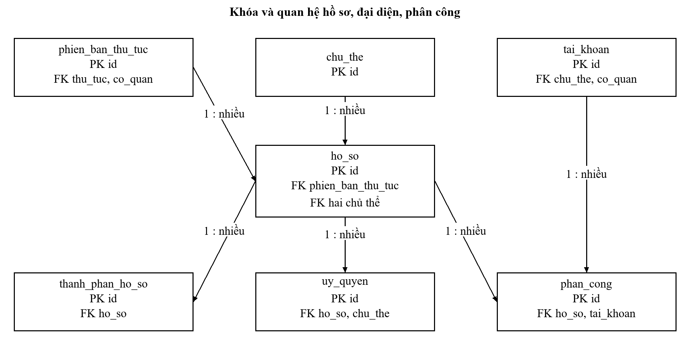
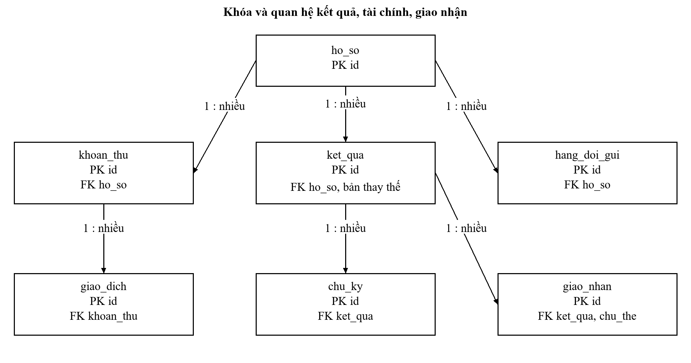
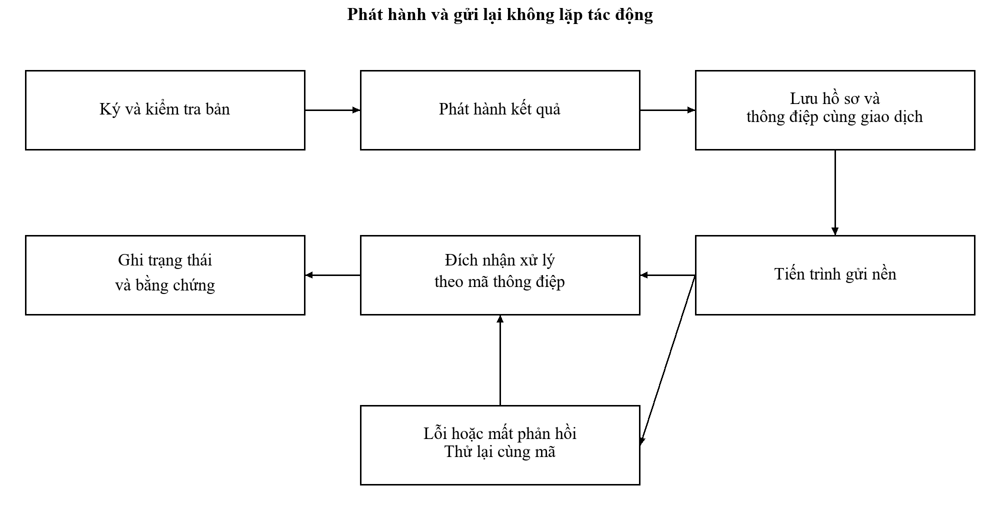
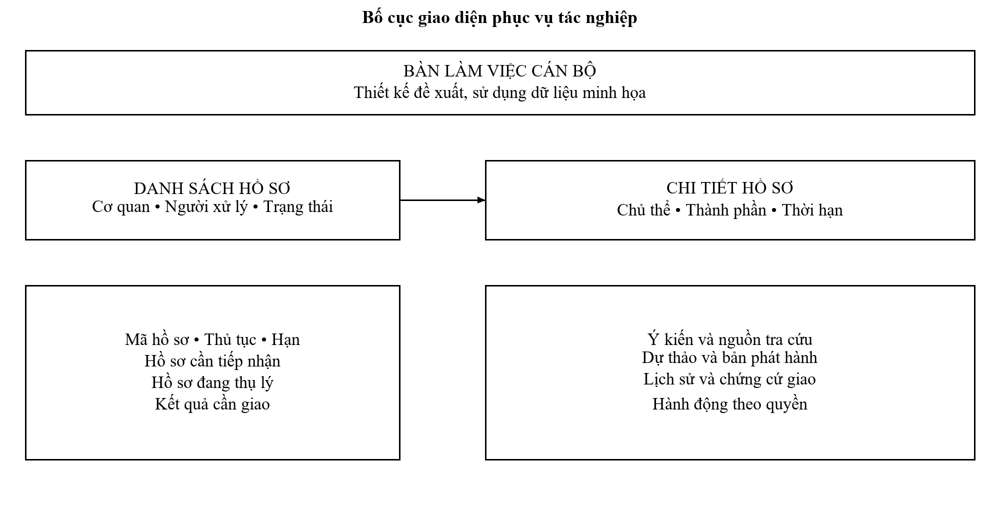
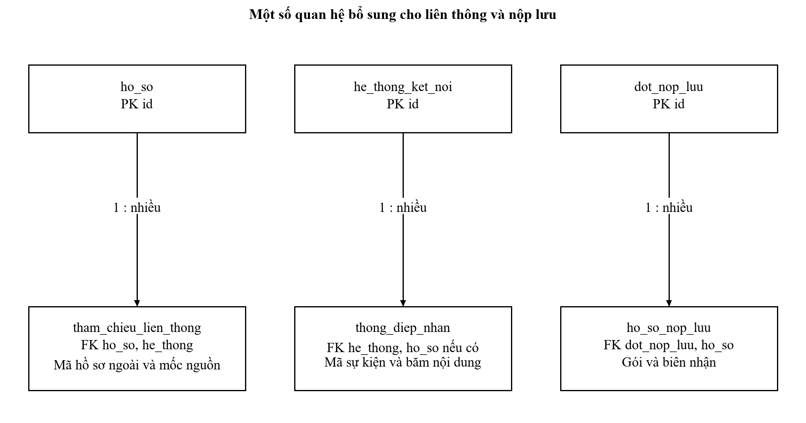
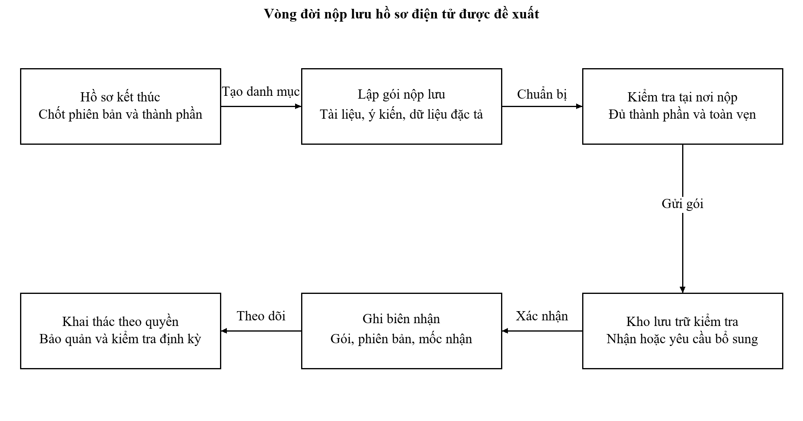

# IV. THIẾT KẾ HỆ THỐNG VÀ PHƯƠNG ÁN HOÀN THIỆN

Thiết kế gồm lõi dùng chung được đặc tả qua thủ tục hộ tịch và các thành phần mở rộng để xử lý danh mục, tuyến tác nghiệp, liên thông, phối hợp, thông báo, phản ánh và nộp lưu. Mô hình là phương án nghiên cứu xây dựng từ nghiệp vụ có nguồn; không phải sơ đồ kỹ thuật nội bộ của Hà Nội. Toàn bộ 35 bảng trong từ điển dữ liệu thuộc cùng phương án, trong đó thông tin chuyên biệt của sự kiện hộ tịch chỉ áp dụng cho hồ sơ tương ứng.

## 4.1. Nguyên tắc và lựa chọn kiến trúc

Thiết kế trong chương này là phương án nghiên cứu để đáp ứng các yêu cầu đã phân tích từ hệ thống thực tế. Các thành phần nội bộ được mô hình hóa theo trách nhiệm, không khẳng định Hà Nội đang sử dụng đúng các sản phẩm hoặc lược đồ đó. Kiến trúc ưu tiên khả năng truy vết, nhất quán dữ liệu hồ sơ và kiểm soát giao tiếp với nền tảng bên ngoài. Việc bố trí vật lý phải được thẩm định cùng đơn vị vận hành trước khi sử dụng.

### 4.1.1. Phân tách các tầng trách nhiệm

Tầng tương tác gồm kênh tiếp nhận từ cổng quốc gia, bàn làm việc cán bộ và màn hình điều hành. Tầng nghiệp vụ gồm tiếp nhận, thụ lý, thời hạn, tài chính và phát hành. Tầng tích hợp chịu trách nhiệm xác thực giao tiếp, chuẩn hóa thông điệp, kiểm soát thử lại và đối soát. Tầng dữ liệu lưu hồ sơ có cấu trúc, tài liệu và nhật ký. Các tầng chia sẻ định danh đối tượng nhưng không truy cập tùy ý vào dữ liệu của nhau.

Bảng 4.1: Thành phần logic và trách nhiệm thiết kế

| Thành phần | Trách nhiệm | Kiểm soát chính |
| --- | --- | --- |
| Bàn làm việc cán bộ | Thao tác đúng quyền và hiển thị trách nhiệm | Phiên truy cập, phạm vi hồ sơ và xác nhận thao tác |
| Tiếp nhận | Kiểm tra đầu vào, mã và chứng từ | Phiên bản thủ tục; chống tạo trùng |
| Điều phối | Phân công, chuyển bước và quản lý hạn | Điều kiện chuyển trạng thái; kiểm soát đồng thời |
| Kết quả | Dự thảo, ký, phát hành và giao | Phiên bản tài liệu; tính toàn vẹn |
| Tài chính | Khoản thu, miễn giảm và đối soát | Mã giao dịch; tách xác nhận thanh toán |
| Tích hợp | Trao đổi với nền tảng bên ngoài | Xác thực, thời gian chờ và xử lý lặp |
| Báo cáo | Tổng hợp chỉ số có công thức | Kỳ dữ liệu, phạm vi và nguồn |
| Quản trị | Danh mục, quyền và nhật ký | Phê duyệt cấu hình; phân tách nhiệm vụ |

Hình 4.1: Kiến trúc logic đề xuất

### 4.1.2. So sánh phương án triển khai thành phần

Bảng 4.2: So sánh tổ chức ứng dụng

| Tiêu chí | Ứng dụng có các mô đun | Các dịch vụ tách biệt |
| --- | --- | --- |
| Nhất quán hồ sơ | Dễ tổ chức giao dịch trong cơ sở dữ liệu | Cần điều phối và bù trừ giữa dịch vụ |
| Vận hành | Ít thành phần triển khai hơn | Nhiều cấu hình, chứng thư và điểm giám sát |
| Mở rộng | Mở rộng cả ứng dụng hoặc phần xử lý nền | Mở rộng theo dịch vụ |
| Thay đổi độc lập | Phải quản lý ranh giới mô đun chặt | Thuận lợi khi hợp đồng dữ liệu ổn định |
| Điều kiện lựa chọn | Phù hợp khi chưa có bằng chứng về tải và đội vận hành | Phù hợp khi có nhu cầu tách tải và năng lực quản lý |

Phương án cơ sở sử dụng ứng dụng có các mô đun nghiệp vụ với lớp tích hợp và tiến trình nền tách biệt. Lựa chọn này giảm độ phức tạp trong nghiên cứu và giữ giao dịch hồ sơ nhất quán. Các mô đun được thiết kế với giao tiếp rõ để có thể tách khi dữ liệu tải chứng minh nhu cầu. Số lượng dịch vụ không được dùng làm thước đo mức độ hiện đại của hệ thống.

## 4.2. Thiết kế trạng thái và kiểm soát đồng thời

### 4.2.1. Mô hình trạng thái hồ sơ

Trạng thái nghiệp vụ biểu thị vị trí hồ sơ trong quá trình ra quyết định. Trạng thái tài chính, giao nhận, đồng bộ và quá hạn được lưu riêng vì có thể diễn ra độc lập. Hồ sơ đã phát hành có thể đang chờ giao hoặc đã giao nhưng chưa đồng bộ một kho bên ngoài. Nếu gộp mọi chiều vào một danh sách trạng thái, số tổ hợp tăng nhanh và việc báo cáo dễ sai.

Bảng 4.3: Trạng thái nghiệp vụ đề xuất

| Trạng thái | Ý nghĩa | Chuyển tiếp hợp lệ |
| --- | --- | --- |
| NHAP | Người yêu cầu đang chuẩn bị | CHO_TIEP_NHAN |
| CHO_TIEP_NHAN | Yêu cầu đã gửi | CHO_BO_SUNG, DA_TIEP_NHAN, TU_CHOI |
| CHO_BO_SUNG | Chờ nội dung theo yêu cầu có căn cứ | Trở về giai đoạn yêu cầu bổ sung |
| DA_TIEP_NHAN | Đã cấp mã và hẹn trả | DANG_THU_LY, DUNG |
| DANG_THU_LY | Đã phân công và xử lý chuyên môn | CHO_BO_SUNG, TRINH_DUYET, KHONG_GIAI_QUYET, DUNG |
| TRINH_DUYET | Dự thảo đang chờ quyết định | DANG_THU_LY, DA_PHE_DUYET |
| DA_PHE_DUYET | Có kết quả ký duyệt được kiểm tra | DA_PHAT_HANH |
| DA_PHAT_HANH | Kết quả chính thức đã phát hành | HOAN_THANH |
| HOAN_THANH | Đã xác nhận giao kết quả | Chỉ sửa bằng quy trình điều chỉnh có liên kết |
| TU_CHOI | Không tiếp nhận có lý do | Kết thúc yêu cầu này |
| KHONG_GIAI_QUYET | Kết luận chuyên môn không đủ điều kiện | Phát hành thông báo theo thẩm quyền |
| DUNG | Dừng theo quyết định có căn cứ | Kết thúc, xử lý nghĩa vụ còn lại |

Bảng 4.4: Các chiều trạng thái độc lập

| Chiều | Giá trị điển hình | Điều kiện quản lý |
| --- | --- | --- |
| Tài chính | Không áp dụng, chờ thu, đã thu, chờ đối soát, hoàn | Gắn khoản thu và căn cứ; không suy ra từ chuyên môn |
| Giao nhận | Chưa gửi, đã gửi, đã giao, giao lỗi | Có mã chứng cứ và người hoặc hệ thống xác nhận |
| Đồng bộ | Chờ, thành công, lỗi, cần xử lý | Mỗi đích nhận có trạng thái riêng |
| Thời hạn | Trong hạn, sắp hạn, quá hạn | Tính từ hạn và thời điểm kiểm tra; có lịch sử điều chỉnh |

Hình 4.2: Máy trạng thái nghiệp vụ và các chiều theo dõi

### 4.2.2. Bất biến và điều kiện chuyển bước

Một chuyển bước phải đồng thời kiểm tra trạng thái hiện tại, quyền của người thao tác, phiên bản hồ sơ và dữ liệu bắt buộc. Hệ thống chỉ chấp nhận cập nhật khi số phiên bản gửi từ màn hình khớp số đang lưu. Nếu hai cán bộ cùng mở hồ sơ, người lưu sau phải nhận thông báo rằng hồ sơ đã thay đổi. Đây là biện pháp bảo vệ ý kiến xử lý và tránh ghi đè phân công.

Bảng 4.5: Các bất biến nghiệp vụ cần bảo vệ

| Mã | Bất biến | Cách kiểm soát |
| --- | --- | --- |
| BV01 | Mã hồ sơ chính thức không trùng | Ràng buộc duy nhất trong dữ liệu |
| BV02 | Hồ sơ tiếp nhận có phiên bản thủ tục | Khóa ngoại bắt buộc và chốt khi tiếp nhận |
| BV03 | Kết quả đã ký không bị sửa tại chỗ | Lưu phiên bản mới; kiểm tra giá trị băm |
| BV04 | Mỗi hồ sơ đang thụ lý có trách nhiệm hiện hành | Phân công có hiệu lực và lịch sử |
| BV05 | Giao dịch bên ngoài không được ghi nhận hai lần | Ràng buộc mã đối tác và mã giao dịch |
| BV06 | Chuyển bước và nhật ký phải cùng thành công | Giao dịch dữ liệu chung |
| BV07 | Không xác nhận giao chỉ vì gửi thông báo thành công | Kiểm tra bằng chứng giao nhận |
| BV08 | Chỉnh hạn không xóa hạn ban đầu | Lưu sự kiện điều chỉnh và căn cứ |

## 4.3. Thiết kế cơ sở dữ liệu

### 4.3.1. Thực thể và quan hệ

Mô hình dữ liệu đề xuất sử dụng cơ sở dữ liệu quan hệ cho phần nghiệp vụ có yêu cầu nhất quán. Tài liệu lớn được lưu tại kho đối tượng, còn bảng nghiệp vụ lưu khóa đối tượng, kích thước, loại tệp, giá trị băm và quyền truy cập. Biểu mẫu động được quản lý bằng cấu trúc dữ liệu có phiên bản; chưa có cơ sở để yêu cầu một hệ quản trị tài liệu riêng chỉ từ việc biểu mẫu có trường thay đổi.

Bảng 4.6: Nhóm thực thể trong mô hình dữ liệu

| Nhóm | Thực thể | Quan hệ chính |
| --- | --- | --- |
| Danh mục | co_quan, thu_tuc, phien_ban_thu_tuc | Một thủ tục có nhiều phiên bản |
| Chủ thể | chu_the, uy_quyen | Người giao dịch, căn cứ đại diện; chủ thể hộ tịch nếu áp dụng |
| Hồ sơ | ho_so, thanh_phan_ho_so | Một hồ sơ có nhiều thành phần |
| Tác nghiệp | phan_cong, su_kien_xu_ly, yeu_cau_bo_sung | Mỗi hành động gắn hồ sơ và chủ thể |
| Kết quả | ket_qua, chu_ky, giao_nhan | Một bản phát hành có nhiều chứng cứ |
| Tài chính | khoan_thu, giao_dich | Một khoản thu có lịch sử giao dịch |
| Tích hợp | hang_doi_gui | Mỗi thông điệp có mã lặp an toàn |
| Quản trị | tai_khoan, quyen_pham_vi, nhat_ky, lich_lam_viec | Quyền theo cơ quan và nhiệm vụ |

Hình 4.3: Quan hệ giữa các thực thể nghiệp vụ

### 4.3.2. Chuẩn hóa, chỉ mục và lịch sử

Hình 4.4: Quan hệ khóa của hồ sơ, đại diện và phân công

Hình 4.5: Quan hệ khóa của kết quả, tài chính và giao nhận

Tên cơ quan và thông tin thủ tục không được sao chép tùy ý vào nhiều bảng. Hồ sơ tham chiếu khóa phiên bản, nhưng chứng từ tiếp nhận phải giữ ảnh chụp dữ liệu cần chứng minh tại thời điểm phát hành. Việc giữ ảnh chụp có chủ đích để lưu bằng chứng khác với dữ liệu dư thừa không được quản lý. Khi cơ quan đổi tên, bản chứng từ cũ vẫn phản ánh đúng tên tại thời điểm lập.

Các chỉ mục phục vụ tìm hồ sơ theo mã, cơ quan và trạng thái, người phụ trách và hạn trả. Chỉ mục không được tạo cho mọi trường vì làm tăng chi phí cập nhật. Truy vấn báo cáo lớn sử dụng bảng tổng hợp hoặc bản sao đọc được kiểm soát, không chiếm tài nguyên của thao tác tiếp nhận. Trước khi tách dữ liệu, cần có số đo về thời gian truy vấn và tải thực tế.

Bảng 4.7: Chỉ mục và ràng buộc quan trọng

| Đối tượng | Ràng buộc hoặc chỉ mục | Mục đích |
| --- | --- | --- |
| ho_so.ma_ho_so | Duy nhất khi đã cấp mã | Ngăn cấp trùng |
| ho_so | cơ quan, trạng thái, hạn trả | Danh sách cần xử lý và cảnh báo |
| su_kien_xu_ly | hồ sơ, thời điểm | Dựng lại lịch sử |
| giao_dich | đối tác, mã ngoài duy nhất | Chống ghi thu lặp |
| ket_qua | hồ sơ, số phiên bản duy nhất | Phân biệt bản cũ và bản thay thế |
| hang_doi_gui | mã thông điệp duy nhất | Gửi lại an toàn |
| phien_ban_thu_tuc | thủ tục, cơ quan, phiên bản | Không nhầm thẩm quyền |

### 4.3.3. Từ điển dữ liệu chi tiết

Từ điển ở các bảng tiếp theo là đặc tả thiết kế đề xuất. Các kiểu dữ liệu được lựa chọn theo PostgreSQL để diễn đạt ràng buộc cụ thể; lựa chọn này không xác nhận Hà Nội đang dùng PostgreSQL. Thời điểm được lưu theo dạng có múi giờ và hiển thị theo giờ Việt Nam. Mã định danh cá nhân là chuỗi, không là số để tránh mất chữ số đầu và nhầm với giá trị tính toán.

[[DATA_DICTIONARY]]

### 4.3.4. Vòng đời tài liệu và dữ liệu cá nhân

Tài liệu được phân loại theo hồ sơ đang xử lý, kết quả, bằng chứng chữ ký, chứng từ tài chính và nhật ký. Mỗi nhóm có chủ thể quản lý và quy tắc lưu giữ theo danh mục được phê duyệt. Không đặt một thời hạn lưu chung cho tất cả dữ liệu. Khi hết thời hạn, cần kiểm tra nghĩa vụ lưu trữ, yêu cầu thanh tra hoặc tranh chấp trước khi hủy.

Thông tin định danh được mã hóa và che một phần khi không cần hiển thị đầy đủ. Nhật ký ghi mã hồ sơ và hành động, hạn chế sao chép nội dung tờ khai hay giấy tờ cá nhân. Truy cập phục vụ hỗ trợ kỹ thuật phải được cấp tạm thời, có mục đích, người phê duyệt và nhật ký. Bản sao dùng cho kiểm thử sử dụng dữ liệu giả lập hoặc đã xử lý để không xác định cá nhân.

## 4.4. Thiết kế giao tiếp và đồng bộ

### 4.4.1. Hợp đồng giao tiếp đề xuất

Giao tiếp trong bảng dưới là mô hình tham chiếu của nghiên cứu, không phải điểm cuối đang hoạt động của Hà Nội. Đặc tả dùng động từ và tài nguyên rõ, có mã tương quan, phiên bản hồ sơ và mã yêu cầu duy nhất. Phần xác thực được kiểm tra phía máy chủ; không coi một giá trị băm do máy khách tự tạo là bằng chứng về danh tính hoặc quyền.

Bảng 4.8: Danh mục giao tiếp thiết kế

| Thao tác | Đường dẫn đề xuất | Kiểm soát |
| --- | --- | --- |
| Tra cứu phiên bản | GET /v1/procedures/{id}/versions | Chỉ phiên bản hợp lệ; lọc cơ quan |
| Tạo yêu cầu | POST /v1/applications | Mã yêu cầu duy nhất; kiểm tra chủ thể |
| Tiếp nhận | POST /v1/cases/{id}/accept | Quyền; phiên bản; trạng thái và giấy hẹn |
| Yêu cầu bổ sung | POST /v1/cases/{id}/supplements | Giai đoạn; căn cứ và chứng từ |
| Phân công | POST /v1/cases/{id}/assignments | Phạm vi cơ quan; người có quyền |
| Trình duyệt | POST /v1/cases/{id}/approvals | Dự thảo đã chốt và trách nhiệm |
| Phát hành | POST /v1/cases/{id}/issuance | Kiểm tra ký và số văn bản |
| Giao kết quả | POST /v1/cases/{id}/deliveries | Quyền người nhận và chứng cứ |
| Nhận thông báo thu | POST /v1/payments/notifications | Chữ ký thông điệp và mã giao dịch |
| Tra cứu lịch sử | GET /v1/cases/{id}/events | Quyền theo hồ sơ; che dữ liệu |

Bảng 4.9: Cấu trúc phản hồi và lỗi nghiệp vụ

| Mã | Ý nghĩa | Cách xử lý |
| --- | --- | --- |
| 200 hoặc 201 | Thành công theo loại thao tác | Trả định danh và phiên bản mới |
| 400 | Dữ liệu không đúng cấu trúc | Chỉ ra trường sai; không ghi một phần |
| 401 | Chưa xác thực hợp lệ | Đăng nhập hoặc làm mới phiên theo quy định |
| 403 | Không đủ quyền | Ghi sự kiện và không lộ dữ liệu đối tượng |
| 404 | Đối tượng không có hoặc không được phép biết | Chính sách thống nhất tránh dò hồ sơ |
| 409 | Xung đột phiên bản hoặc trạng thái | Tải lại; không tự ghi đè |
| 422 | Không thỏa điều kiện nghiệp vụ | Trả mã quy tắc và hướng xử lý |
| 503 | Thành phần phụ thuộc chưa đáp ứng | Thông báo chờ; thử lại có kiểm soát |

### 4.4.2. Nhất quán và thử lại khi tích hợp thất bại

Thay đổi nghiệp vụ và thông điệp chờ gửi được lưu trong cùng giao dịch dữ liệu. Tiến trình nền đọc hàng đợi, gửi sang đích và ghi kết quả. Nếu mất kết nối sau khi đích đã nhận, lần gửi tiếp theo vẫn dùng cùng mã thông điệp để đích có thể nhận diện trùng. Việc đồng bộ có độ trễ cần được hiển thị riêng, tránh báo cho cán bộ rằng hồ sơ chưa được lưu chỉ vì một hệ thống khác chưa nhận.

Sau số lần thử lại đã cấu hình, thông điệp chuyển sang danh sách cần xử lý. Cán bộ kỹ thuật chỉ được thay cấu hình gửi hoặc kích hoạt gửi lại; không sửa nội dung hồ sơ đã phê duyệt để làm cho thông điệp qua được. Nếu lỗi do dữ liệu nghiệp vụ, hồ sơ được trả về quy trình sửa có thẩm quyền. Mọi lần thử đều ghi mã tương quan nhưng không ghi bí mật xác thực.

Hình 4.4: Trình tự phát hành và đồng bộ kết quả

## 4.5. Thiết kế giao diện tác nghiệp

### 4.5.1. Danh sách và chi tiết hồ sơ

Màn hình danh sách giúp cán bộ biết việc cần làm và thời hạn, không chỉ hiển thị tổng số hồ sơ. Bộ lọc gồm cơ quan, người phụ trách, trạng thái, loại hạn và khoảng tiếp nhận. Các dòng luôn có mã hồ sơ, thủ tục, thời điểm nhận, hạn trả và người chịu trách nhiệm. Tìm kiếm theo tên cá nhân được giới hạn quyền và ghi nhận khi sử dụng.

Màn hình chi tiết chia thông tin chủ thể, thành phần, xử lý, tài chính, kết quả và lịch sử thành các vùng rõ. Nút hành động được hiển thị theo quyền, nhưng việc ẩn nút không thay cho kiểm tra ở máy chủ. Trước tiếp nhận, từ chối, dừng hoặc phát hành, hệ thống nêu hậu quả và yêu cầu xác nhận dữ liệu liên quan. Lý do nghiệp vụ được lưu thành trường dữ liệu có cấu trúc, không chỉ nằm trong thông báo.

Bảng 4.10: Đặc tả màn hình tác nghiệp

| Màn hình | Nội dung | Điều kiện sử dụng |
| --- | --- | --- |
| DS01 Danh sách xử lý | Bộ lọc, mã, hạn, chủ thể đã che và việc cần làm | Cán bộ trong phạm vi cơ quan |
| CT01 Chi tiết | Thông tin chủ thể, thành phần, lịch sử và hành động | Kiểm tra quyền từng hồ sơ |
| TN01 Tiếp nhận | Kết luận kiểm tra, phiên bản và giấy hẹn | Yêu cầu chờ tiếp nhận |
| TD01 Thẩm định | Kết quả tra cứu, ý kiến và dự thảo | Người được phân công |
| KY01 Phê duyệt | Bản chốt, người ký và trạng thái chữ ký | Đúng thẩm quyền ký |
| TK01 Trả kết quả | Bản phát hành, người nhận, kênh và chứng cứ | Kết quả đã phát hành |
| QT01 Quản trị | Phiên bản cấu hình, quyền và phê duyệt | Phân tách người sửa và duyệt |

Hình 4.5: Bản thiết kế màn hình danh sách và chi tiết hồ sơ

### 4.5.2. Tiếp cận và phòng ngừa sai sót

Thiết kế lựa chọn mức AA của WCAG 2.2 làm mục tiêu kiểm tra khả năng tiếp cận; đây là tiêu chí đề xuất, không kết luận hệ thống hiện tại đã đạt. Thông báo trạng thái phải có chữ, biểu tượng và khả năng đọc bằng công cụ hỗ trợ, không chỉ dùng màu đỏ hoặc xanh. Thứ tự chuyển bằng bàn phím theo luồng công việc. Trường sai có giải thích và vẫn giữ dữ liệu người dùng đã nhập. [11]

Tệp được tải lên có thông tin loại và giới hạn dung lượng trước thao tác. Khi mất phiên trong lúc kê khai, bản nháp được bảo vệ theo chính sách và có hướng tiếp tục; không hiển thị dữ liệu cá nhân cho người đăng nhập sau trên máy dùng chung. Việc tải tài liệu xuống phải có mục đích phù hợp và đường dẫn ngắn hạn, không dùng địa chỉ công khai cố định.

## 4.6. Thiết kế an toàn và phân quyền

Bảng 4.11: Mối đe dọa và kiểm soát thiết kế

| Mối đe dọa | Điểm kiểm soát | Bằng chứng kiểm tra |
| --- | --- | --- |
| Dò mã để xem hồ sơ khác | Kiểm tra quan hệ đối tượng phía máy chủ | Ca thử đổi định danh và quyền |
| Chèn dữ liệu độc hại | Tham số hóa truy vấn; làm sạch đầu ra | Ca thử nhập nội dung đặc biệt |
| Tệp gây hại | Kiểm tra loại thực, quét và kho cách ly | Tệp thử an toàn được chặn đúng |
| Giả thông báo thanh toán | Xác thực nguồn và nội dung thông điệp | Chữ ký sai bị từ chối |
| Chiếm phiên cán bộ | Xác thực phù hợp, thời hạn và thu hồi | Phiên hết hiệu lực không dùng tiếp |
| Thay bản đã ký | Băm, phiên bản bất biến và kiểm tra chữ ký | Bản thay đổi không phát hành được |
| Lạm dụng quyền quản trị | Tách nhiệm vụ; cấp tạm; ghi nhật ký | Truy được người sửa và người duyệt |
| Mất dữ liệu | Sao lưu độc lập và diễn tập phục hồi | Biên bản phục hồi có đối chiếu |

Kiểm tra an toàn sử dụng các nhóm yêu cầu của OWASP ASVS làm danh mục tham chiếu, tập trung xác thực, phân quyền đối tượng, quản lý phiên, xử lý dữ liệu và nhật ký. Danh mục không thay thế việc xác định cấp độ an toàn và phê duyệt phương án theo quy định. Với nguồn hiện có, báo cáo chưa có đủ chứng cứ để xác nhận cấp độ an toàn đã được phê duyệt cho hệ thống Hà Nội. [12]

## 4.7. Thiết kế dùng chung trong môi trường nhiều hệ thống

### 4.7.1. Định tuyến và quyền xác nhận trạng thái

Danh mục tuyến liên kết phiên bản thủ tục với hệ thống xử lý, ngày hiệu lực, căn cứ và người phê duyệt. Khi tiếp nhận, hệ thống lấy tuyến tại mốc áp dụng, không lấy một địa chỉ được viết cố định trong màn hình. Phiên bản tương lai có thể được chuẩn bị nhưng chưa dùng cho hồ sơ trước ngày hiệu lực. Một thay đổi tuyến phải kiểm tra giao nhau của khoảng thời gian trong cùng giao dịch và khóa cấu hình đang sửa, để hai quản trị viên không cùng tạo hai tuyến có hiệu lực.

Bảng 4.12: Thành phần dữ liệu mở rộng của thiết kế

| Thành phần | Mục đích | Ràng buộc cần bảo vệ |
| --- | --- | --- |
| he_thong_ket_noi | Nhận diện nền tảng và hợp đồng | Mã nguồn duy nhất, phiên bản và trạng thái được phép |
| tuyen_xu_ly | Chọn nơi tác nghiệp theo thủ tục | Không chồng khoảng áp dụng của cùng phiên bản |
| tham_chieu_lien_thong | Liên kết mã ngoài với hồ sơ | Cặp hệ thống, mã ngoài không trỏ tới hai hồ sơ |
| thong_diep_nhan | Kiểm tra và chống áp dụng sự kiện lặp | Mã sự kiện duy nhất theo nguồn, so sánh băm nội dung |
| nhiem_vu_phoi_hop | Lưu yêu cầu và ý kiến nhiều cơ quan | Điều kiện bắt buộc, hạn và phiên bản ý kiến |
| thong_bao | Theo dõi gửi và giao thông báo | Đúng chủ thể, mẫu, kênh và quan hệ hồ sơ |
| dot_nop_luu | Quản lý đợt nộp lưu | Có đơn vị nộp và người duyệt |
| ho_so_nop_luu | Chứng cứ giao hồ sơ vào lưu trữ | Mã gói, danh mục toàn vẹn và biên nhận |
| phan_anh_kien_nghi | Theo dõi phản ánh, đánh giá | Phân loại và trả lời không thay quyết định hồ sơ |

Hình 4.8: Quan hệ bổ sung cho tham chiếu liên thông và nộp lưu

Mã hồ sơ hành chính, định danh nội bộ và mã ngoài có vai trò khác nhau. Mã ngoài chỉ có nghĩa trong hệ thống nguồn; hai nền tảng có thể cấp cùng một chuỗi. Do đó, khóa đối chiếu phải gồm mã nguồn và mã ngoài. Tham chiếu không tạo một bản sao toàn bộ dữ liệu chuyên ngành; chỉ lưu phần cần theo dõi theo hợp đồng và phạm vi được phép.

Trường chủ thể sự kiện hộ tịch trong bảng hồ sơ được để có điều kiện. Với thủ tục hộ tịch, lớp nghiệp vụ bắt buộc kiểm tra trường này; với thủ tục khác, không yêu cầu tạo một chủ thể hộ tịch giả. Biểu mẫu kê khai giữ lược đồ và phiên bản, còn các trường thường dùng để tìm kiếm, tính hạn hoặc đối soát được lưu thành trường có kiểu và ràng buộc. Không dồn toàn bộ nghiệp vụ vào một trường dữ liệu tùy ý rồi bỏ kiểm tra phía máy chủ.

### 4.7.2. Nhận sự kiện và phục hồi sau lỗi

Thành phần nhận sự kiện thực hiện xác thực nguồn, kiểm tra hợp đồng và phạm vi, kiểm tra mã sự kiện và toàn vẹn nội dung, xác định tham chiếu hồ sơ, sau đó mới xét điều kiện nghiệp vụ. Cùng mã và cùng nội dung được trả kết quả lần trước; cùng mã nhưng khác nội dung bị giữ để đối chiếu. Một trạng thái đến sau về thời điểm nhận nhưng có thứ tự cũ không được ghi đè trạng thái mới của nguồn.

Việc ghi thông điệp đã áp dụng, trạng thái hồ sơ và thông điệp cần gửi tiếp được thực hiện trong một giao dịch cơ sở dữ liệu. Nếu tiến trình dừng sau khi ghi nhận nhưng trước khi trả phản hồi, bên gửi có thể gửi lại mà không tạo hồ sơ hoặc khoản thu mới. Cơ chế này không bảo đảm mạng chỉ chuyển thông điệp một lần; nó bảo vệ tác động nghiệp vụ trước khả năng nhận nhiều lần.

Khi tuyến bộ là nơi xử lý, hệ thống Thành phố giữ trạng thái được nguồn xác nhận kèm mốc nguồn và mốc nhận. Nếu mất kết nối, giao diện thể hiện thời điểm cập nhật cuối và trạng thái chưa được xác nhận mới. Không cho phép cán bộ tự tạo kết quả thuộc thẩm quyền trên hệ thống bộ chỉ để bỏ cảnh báo. Danh sách lệch đối soát được phân công cho người phụ trách, với bằng chứng và kết luận xử lý từng mã.

### 4.7.3. Giao tiếp bổ sung và phạm vi đặc tả

Bảng 4.13: Giao tiếp bổ sung của bộ thiết kế

| Thao tác | Dữ liệu chính | Điều kiện kiểm soát |
| --- | --- | --- |
| Tra cứu tuyến | Phiên bản thủ tục, mốc áp dụng | Trả tuyến đã duyệt tại đúng thời điểm |
| Đề nghị cấu hình tuyến | Hệ thống đích, hiệu lực, căn cứ | Phân quyền, phê duyệt riêng và kiểm tra giao khoảng |
| Nhận sự kiện ngoài | Nguồn, mã sự kiện, mã hồ sơ, thứ tự | Xác thực dịch vụ, nội dung và tác động lặp |
| Tạo nhiệm vụ phối hợp | Hồ sơ, cơ quan nhận, phạm vi, hạn | Người giao có quyền; nhiệm vụ phù hợp quy trình |
| Gửi gói nộp lưu | Mã gói, danh mục và băm từng tài liệu | Đủ thành phần, phiên bản và bằng chứng kiểm tra |
| Nhận phản ánh, đánh giá | Loại, nội dung, hồ sơ nếu có | Quan hệ hồ sơ hợp lệ; chuyển đúng quy trình |
| Đối chiếu báo cáo | Nguồn, kỳ, mốc chốt | Phạm vi dữ liệu và phương pháp khử trùng |

Tệp giao tiếp gốc có 10 thao tác; tệp mở rộng bổ sung 7 thao tác. Đây là hợp đồng tham chiếu để thẩm định yêu cầu, không phải địa chỉ hiện hữu. Dữ liệu cụ thể của từng loại sự kiện ngoài phải được thống nhất với bộ hoặc nền tảng quốc gia; danh tính dịch vụ, chứng thư, cách kiểm tra chữ ký thông điệp, giới hạn kích thước và quy tắc hết hạn phải được bổ sung trước phát triển. Không để mô tả giao tiếp thay cho thỏa thuận chia sẻ dữ liệu.

## 4.8. Lưu trữ, bảo quản và bảo vệ dữ liệu trong vòng đời

### 4.8.1. Kho phục vụ công dân và lưu trữ cơ quan

Kho cá nhân, kho tài liệu tác nghiệp, bản sao lưu và hệ thống lưu trữ có mục đích khác nhau. Kho cá nhân giúp người có quyền nhận và dùng lại giấy tờ; kho tác nghiệp giữ thành phần phục vụ xử lý; bản sao lưu giúp phục hồi; hệ thống lưu trữ quản lý giá trị, bảo quản và khai thác lâu dài. Sao lưu thành công không chứng minh hồ sơ đã được nộp lưu, còn giao kết quả vào kho cá nhân không cho phép xóa hồ sơ tác nghiệp ngay lập tức. [26], [27]

Hình 4.9: Vòng đời lập gói và nộp lưu hồ sơ điện tử

Gói nộp lưu gồm tài liệu đầu vào, tài liệu hình thành trong xử lý, kết quả, ý kiến, dữ liệu đặc tả và danh mục thành phần. Mỗi mục có định danh, phiên bản, giá trị toàn vẹn và quan hệ hồ sơ; bằng chứng chữ ký được giữ theo yêu cầu bảo quản. Kho đích xác nhận đủ thành phần và đọc được định dạng mới tạo biên nhận. Gói bị trả lại phải có lý do và phiên bản sửa, không đánh dấu nộp lưu xong chỉ vì đã gửi tệp.

### 4.8.2. Phân loại và quyết định bảo quản

Bảng 4.14: Kiểm soát vòng đời dữ liệu theo mục đích

| Nhóm dữ liệu | Kiểm soát sử dụng | Quyết định kết thúc vòng đời |
| --- | --- | --- |
| Hồ sơ và kết quả | Quyền theo cơ quan, nhiệm vụ, chủ thể | Thời hạn theo loại hồ sơ và căn cứ lưu trữ |
| Bằng chứng ký | Liên kết đúng bản, bảo toàn kiểm tra | Giữ cùng thời hạn cần chứng minh giá trị văn bản |
| Dữ liệu định danh khai thác | Chỉ lấy trường cần cho mục đích hợp lệ | Hạn chế lưu bản sao nếu tham chiếu đã đáp ứng |
| Nhật ký nghiệp vụ | Không cho người xử lý xóa dấu vết | Theo chính sách kiểm tra và bảo quản được duyệt |
| Thông báo | Nội dung tối thiểu, kênh được phép | Loại bỏ dữ liệu gửi không còn cần thiết theo chính sách |
| Dữ liệu thử và báo cáo | Giảm nhận diện cá nhân, giới hạn kết xuất | Kết thúc theo mục đích, không giữ vô thời hạn |

Việc tiêu hủy cần kiểm tra hồ sơ đang tranh chấp, yêu cầu kiểm tra, nghĩa vụ bảo quản và các bản liên quan. Người quản trị kỹ thuật không tự quyết định thời hạn nghiệp vụ. Khi phải sửa dữ liệu sai, thiết kế lưu quyết định chỉnh sửa và liên kết phiên bản; không dùng xóa lịch sử để đáp ứng một yêu cầu chưa được thẩm định. Quyền và căn cứ xử lý dữ liệu được đối chiếu với Luật Bảo vệ dữ liệu cá nhân và Nghị định 356/2025/NĐ-CP. [9], [24]

### 4.8.3. Ranh giới an toàn và kiểm soát truy cập đặc quyền

Các điểm cần bảo vệ gồm thiết bị tại điểm phục vụ, phiên cán bộ, thành phần giao tiếp, cơ sở dữ liệu, kho tệp, dịch vụ ký và kênh sao lưu. Kiểm tra quyền phải thực hiện ở máy chủ và trước thao tác đọc, tải tệp, tìm kiếm, in hoặc kết xuất. Một liên kết tải tạm phải có thời hạn và không được bỏ kiểm tra quan hệ hồ sơ chỉ vì tên tệp khó đoán. Khóa bảo vệ dữ liệu được quản lý riêng khỏi nơi lưu dữ liệu và có quy trình thay, thu hồi, phục hồi.

Quyền hỗ trợ của nhà cung cấp chỉ được cấp khi có nhiệm vụ, thời hạn và người chấp thuận. Phiên hỗ trợ được theo dõi; tài khoản dùng chung và việc sao chép hồ sơ thật ra thiết bị cá nhân không được coi là cách sửa lỗi thường xuyên. Các bản cập nhật phải được kiểm tra nguồn, thành phần phụ thuộc và tác động tới dịch vụ; khả năng quay lui không cho phép làm mất bằng chứng hồ sơ mới phát sinh. Những kiểm soát này được đưa vào hồ sơ phương án an toàn và nghiệm thu, phù hợp căn cứ hiện hành về an ninh mạng. [25]

## 4.9. Thiết kế dữ liệu và cấu hình cho các nhánh chức năng

### 4.9.1. Dữ liệu quản lý nhánh và nguồn hướng dẫn

Sáu thực thể bổ sung đưa mô hình lên 35 bảng. Chúng làm rõ trách nhiệm của điểm tiếp nhận, mẫu báo cáo, nguồn trợ giúp, kho tài liệu, quyền khai thác kho và nhiệm vụ điều hành. Các bảng này được trình bày trong từ điển mục 4.3, cùng khóa, kiểu dữ liệu và điều kiện rỗng. Dữ liệu mã điểm trên hồ sơ được đối chiếu danh mục điểm tại thời điểm tiếp nhận; một mã hết phục vụ vẫn có giá trị giải thích lịch sử.

Bảng 4.15: Liên kết các nhánh với thành phần dữ liệu

| Nhánh | Thành phần dữ liệu | Quyết định thiết kế |
| --- | --- | --- |
| Tiếp nhận theo địa điểm | diem_tiep_nhan và ma_diem_tiep_nhan trong hồ sơ | Mã điểm có nguồn, hiệu lực và đơn vị quản lý; giữ kênh thực tế |
| Quy trình và biểu mẫu | cau_hinh_quy_trinh và luoc_do_mau trong phiên bản thủ tục | Cùng căn cứ phiên bản nhưng kiểm tra cấu trúc và trách nhiệm riêng |
| Báo cáo | mau_bao_cao, hồ sơ, sự kiện và tham chiếu liên thông | Mẫu chốt công thức, nguồn, thời điểm; bản báo cáo phát hành lưu định nghĩa và dữ liệu chốt |
| Trợ giúp | tai_lieu_huong_dan | Nguồn duyệt có băm, phiên bản và hiệu lực; không lấy tài liệu bất kỳ để chỉ dẫn nghiệp vụ |
| Kho cá nhân, tổ chức | tai_lieu_kho, quyen_khai_thac_kho | Tách quyền sở hữu, đại diện, mục đích và hiệu lực khỏi quyền quản trị kỹ thuật |
| Điều hành | chi_dao_dieu_hanh, phân công, sự kiện và nhiệm vụ phối hợp | Chỉ đạo có đầu mối, hạn phản hồi và chứng cứ; không tự thay hạn pháp lý hồ sơ |

Tài liệu trong kho có thể tham chiếu bản kết quả hoặc thành phần đã kiểm tra; tài liệu nhận từ một nguồn khác cần lưu nguồn, khóa bản và giá trị toàn vẹn. Trước khi dùng lại phải xác định tính hợp lệ của bản, quyền người yêu cầu và điều kiện thủ tục mới. Bảng quyền không chỉ có người được xem mà còn có mục đích, căn cứ và thời gian; thu hồi quyền không xóa lịch sử truy cập đã phát sinh.

Mẫu báo cáo lưu định nghĩa có cấu trúc, không cho người dùng nhập câu truy vấn tùy ý. Nguồn và bộ lọc được chọn từ tập được phép. Bản báo cáo đã phát hành lưu mốc chốt, phiên bản mẫu và mã tập dữ liệu kiểm chứng trong kho tài liệu; có thể đối chiếu lại công thức ngay cả khi mẫu hiện tại đã đổi.

### 4.9.2. Cấu hình quy trình có thể kiểm tra

Bảng 4.16: Thành phần cấu hình quy trình đề xuất

| Thành phần | Nội dung phải có | Điều kiện kiểm tra |
| --- | --- | --- |
| Bước | Mã, tên, loại hành động, vai trò và cơ quan | Mã không trùng; người có quyền được xác định |
| Đường chuyển | Bước nguồn, đích và điều kiện | Không có đường tới bước không tồn tại; điều kiện kiểm tra được |
| Nhánh lựa chọn | Trường quyết định và các trường hợp | Có nhánh phù hợp hoặc thông báo cần xử lý; không rơi mất hồ sơ |
| Phối hợp song song | Nhiệm vụ, bên nhận và quy tắc tổng hợp | Xác định ý kiến bắt buộc, hạn nhiệm vụ và căn cứ tiếp tục |
| Thời hạn | Loại hạn, lịch, mốc bắt đầu và điều chỉnh | Đúng phiên bản; không cộng thời lượng bước thay hạn pháp lý |
| Dữ liệu và kết quả | Thành phần phải có, mẫu và loại bản trả | Mỗi nhánh kết thúc có kết quả hoặc quyết định dừng có căn cứ |
| Hiệu lực | Phiên bản, người duyệt, ngày áp dụng và chuyển tiếp | Cấu hình nháp không được dùng cho hồ sơ chính thức |

Kiểm tra đồ thị quy trình gồm tính tới được từ bước bắt đầu, khả năng tới một kết thúc hợp lệ, bước không có người xử lý và vòng lặp thiếu điều kiện thoát. Kiểm tra điều kiện nghiệp vụ còn cần người chuyên môn: một sơ đồ hợp lệ về đường nối vẫn có thể áp sai thẩm quyền hoặc biểu mẫu. Vì vậy, phát hành cấu hình cần cả xác nhận cấu trúc và phê duyệt nghiệp vụ.

### 4.9.3. Ranh giới giao tiếp và thiết kế chức năng

Danh mục 17 thao tác giao tiếp kèm theo tập trung ở luồng hồ sơ và điểm liên thông có rủi ro nhất. Đó là đặc tả tham chiếu cho phát triển, không phải toàn bộ địa chỉ giao tiếp nội bộ của hệ thống thực tế. Ba mươi mốt chức năng được đặc tả theo hành vi, đầu vào, đầu ra và kiểm soát ở mục 3.9; cấu hình quản trị phải dùng cùng mô hình quyền, phiên bản và phê duyệt dù được triển khai qua màn hình hay giao tiếp.

Khi phát triển một nhánh, hồ sơ thiết kế chi tiết phải chốt quy tắc trường, thông báo lỗi, quyền từng thao tác, cách lưu bằng chứng và hợp đồng của bên kết nối. Bộ ca CF01 đến CF31 cùng các chuỗi ở mục 3.10 dùng để kiểm tra sự thống nhất giữa thiết kế chức năng và dữ liệu. Nghiên cứu không lấy việc có tệp đặc tả giao tiếp làm bằng chứng một kết nối đang vận hành.

