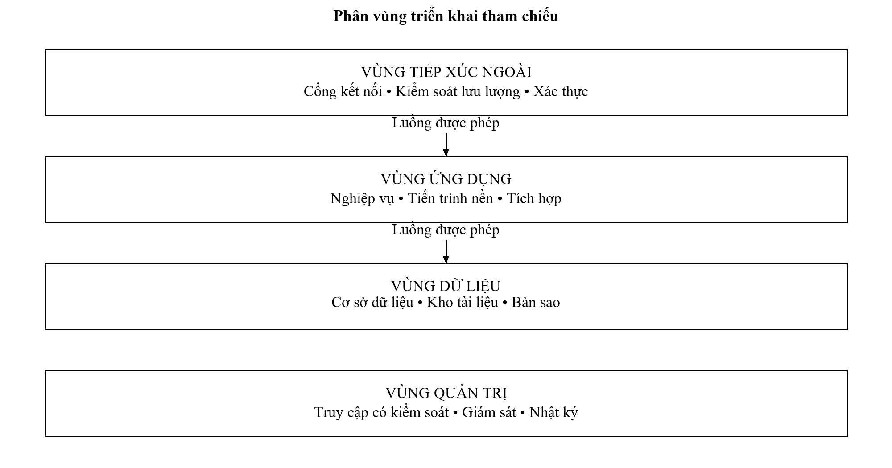
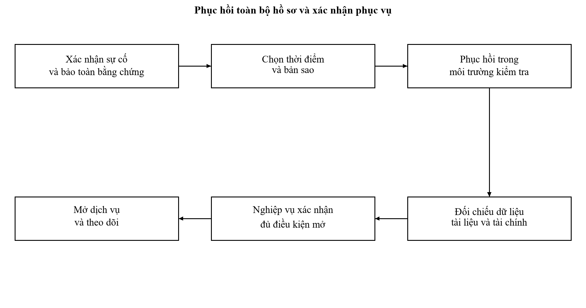

# V. TRIỂN KHAI VÀ VẬN HÀNH

## 5.1. Điều kiện và tổ chức triển khai

Triển khai là quá trình chuyển một cấu hình và quy trình đã được kiểm chứng vào sử dụng, có người chịu trách nhiệm và phương án duy trì dịch vụ. Đối với hệ thống thực tế, phương án hoàn thiện phải được phối hợp với đơn vị quản lý hiện hữu. Báo cáo đề xuất lộ trình thử nghiệm đối với nhánh thủ tục đã chọn, không thiết kế việc thay toàn bộ hệ thống Thành phố trong một lần.

Bảng 5.1: Điều kiện trước triển khai

| Điều kiện | Hồ sơ chứng minh | Trách nhiệm xác nhận |
| --- | --- | --- |
| Quy trình và thẩm quyền | Quyết định, phiên bản và sơ đồ đã duyệt | Cơ quan nghiệp vụ |
| Dữ liệu danh mục | Biên bản đối chiếu thủ tục và biểu mẫu | Kiểm soát thủ tục |
| Tích hợp | Đặc tả và tài khoản môi trường được cấp | Các đơn vị quản lý kết nối |
| An toàn | Phương án được phê duyệt và kiểm tra | Đơn vị phụ trách an toàn |
| Nhân sự | Danh sách, quyền, đào tạo và đầu mối | Đơn vị sử dụng |
| Nghiệm thu | Kết quả thử và lỗi đã xử lý | Hội đồng hoặc tổ nghiệm thu |
| Phục hồi | Bản sao và biên bản thử khôi phục | Đơn vị vận hành |

### 5.1.1. Phân chia môi trường

Môi trường phát triển sử dụng dữ liệu giả lập và dịch vụ thay thế. Môi trường kiểm thử tích hợp có kết nối thử được cấp, cấu hình gần vận hành và quyền riêng. Môi trường đào tạo sử dụng bộ tình huống, không nhận hồ sơ của người dân. Môi trường vận hành tiếp nhận dữ liệu thực và chỉ nhận phiên bản đã qua phê duyệt. Các môi trường không dùng chung khóa, mật khẩu hoặc kho tài liệu.

Bảng 5.2: Phân tách môi trường

| Môi trường | Dữ liệu | Điều kiện thay đổi |
| --- | --- | --- |
| Phát triển | Giả lập có quy tắc | Đơn vị phát triển quản lý |
| Kiểm thử | Giả lập hoặc đã xử lý bảo vệ | Có cấu hình và nhật ký thử |
| Đào tạo | Tình huống mẫu | Giới hạn quyền học viên |
| Vận hành | Dữ liệu hành chính thực | Phê duyệt, sao lưu và kế hoạch quay lui |

### 5.1.2. Phân vùng và quản lý cấu hình

Hạ tầng đề xuất chia vùng tiếp xúc ngoài, vùng ứng dụng, vùng dữ liệu và vùng quản trị. Chỉ các luồng đã khai báo mới được mở. Bàn làm việc cán bộ không trực tiếp kết nối cơ sở dữ liệu. Truy cập quản trị đi qua đầu mối được kiểm soát, có xác thực tăng cường và nhật ký. Sản phẩm tường lửa hoặc thiết bị cân bằng tải được lựa chọn qua yêu cầu kỹ thuật và mua sắm, không chỉ định nhãn hiệu khi chưa có căn cứ.

Hình 5.1: Phân vùng triển khai đề xuất

Bảng 5.3: Hồ sơ cấu hình cần quản lý

| Nhóm | Nội dung | Biện pháp |
| --- | --- | --- |
| Ứng dụng | Phiên bản, gói cài và danh mục thay đổi | Kiểm tra giá trị băm và nguồn |
| Dữ liệu | Lược đồ, tham số, chỉ mục | Kịch bản chuyển đổi và quay lui |
| Kết nối | Đích, thời gian chờ và phiên bản hợp đồng | Kiểm tra trên môi trường thử |
| Bí mật | Chứng thư, khóa và mật khẩu kỹ thuật | Kho quản lý riêng; không lưu trong mã |
| Nghiệp vụ | Lịch, biểu mẫu, phí và quyền | Phê duyệt theo phiên bản |
| Giám sát | Ngưỡng và đầu mối báo động | Thử thông báo và trách nhiệm xử lý |

## 5.2. Kế hoạch chuyển đổi và đưa vào sử dụng

### 5.2.1. Lộ trình thử nghiệm và mở rộng

Bảng 5.4: Lộ trình triển khai đề xuất

| Giai đoạn | Công việc | Điều kiện chuyển tiếp |
| --- | --- | --- |
| Chuẩn bị | Xác nhận quy trình, dữ liệu, quyền và kết nối | Có biên bản thống nhất |
| Cấu hình thử | Thiết lập phiên bản thủ tục và bộ tình huống | Danh mục được đối chiếu |
| Thử tích hợp | Kiểm tra gửi, nhận, ký và xử lý lỗi | Không còn lỗi nghiêm trọng |
| Thử nghiệp vụ | Cán bộ xử lý trọn bộ tình huống | Kết quả được cơ quan nghiệp vụ chấp nhận |
| Thí điểm | Áp dụng phạm vi được duyệt, theo dõi hằng ngày | Đạt tiêu chí và xử lý hết sai lệch |
| Mở rộng | Tăng phạm vi theo quyết định | Năng lực và hỗ trợ đáp ứng |
| Bàn giao | Hồ sơ vận hành, đào tạo và bảo trì | Đầu mối tiếp nhận có xác nhận |

Thời lượng từng giai đoạn phụ thuộc kết nối và thủ tục phê duyệt, vì vậy báo cáo không đặt lịch cam kết khi chưa có nguồn lực. Trong thí điểm, cần có danh sách hồ sơ thuộc phạm vi và cách xử lý ngoài phạm vi. Không tạo hai hồ sơ chính thức ở hai hệ thống chỉ để so sánh; nếu cần đối chiếu, một bên sử dụng dữ liệu sao chép theo mã tham chiếu và có trạng thái rõ.

### 5.2.2. Chuyển dữ liệu và kiểm tra toàn vẹn

Chuyển đổi bắt đầu từ dữ liệu danh mục, sau đó đến hồ sơ đang xử lý và lịch sử cần tra cứu. Dữ liệu được phân tích theo mã cơ quan, phiên bản, trạng thái và người chịu trách nhiệm. Không tự chuyển một hồ sơ thiếu thông tin thành hoàn thành chỉ để phù hợp lược đồ mới. Những bản ghi không ánh xạ được đưa vào danh sách cần xử lý có chủ thể xác nhận.

Bảng 5.5: Kiểm tra dữ liệu trước và sau chuyển đổi

| Đối tượng | Kiểm tra | Điều kiện đạt |
| --- | --- | --- |
| Danh mục | Mã, cơ quan, hiệu lực và mẫu | Không thiếu phiên bản đang sử dụng |
| Hồ sơ | Tổng theo trạng thái và cơ quan | Khớp tổng và danh sách ngoại lệ đã duyệt |
| Phân công | Người xử lý, phạm vi và hạn | Mọi hồ sơ đang xử lý có đầu mối |
| Tài liệu | Số tệp, kích thước và băm | Không thiếu hoặc thay nội dung |
| Tài chính | Khoản thu và giao dịch | Khớp số tiền và danh sách đối soát |
| Lịch sử | Trình tự sự kiện và thời điểm | Dựng lại được quá trình xử lý |

### 5.2.3. Quy trình quay lui

Quay lui được chuẩn bị trước mở hệ thống. Cần phân biệt quay lui ứng dụng với phục hồi dữ liệu, vì phiên bản cũ có thể không đọc được lược đồ đã thay. Trong thời gian chuyển đổi, ứng dụng được thiết kế đọc được dữ liệu theo khoảng tương thích. Nếu phát hiện lỗi sau khi đã phát sinh hồ sơ thực, không phục hồi bản sao cũ để xóa các hồ sơ đó. Đơn vị vận hành đóng băng thao tác chịu ảnh hưởng, giữ nhật ký và thực hiện phương án sửa hoặc chuyển tiếp được duyệt.

Bảng 5.6: Điều kiện và trách nhiệm quay lui

| Tình huống | Hành động | Người quyết định |
| --- | --- | --- |
| Không thể tiếp nhận liên tục | Dừng mở rộng; kích hoạt phương án phục vụ dự phòng | Chủ quản nghiệp vụ phối hợp vận hành |
| Sai dữ liệu hoặc quyền | Cô lập thao tác; bảo toàn bằng chứng; đánh giá phạm vi | Đơn vị quản lý và an toàn |
| Lỗi phiên bản ứng dụng | Quay về bản đã kiểm tra nếu lược đồ tương thích | Người phê duyệt thay đổi |
| Hỏng dữ liệu | Phục hồi trong môi trường kiểm tra; đối chiếu rồi chuyển | Đơn vị vận hành và chủ sở hữu dữ liệu |

## 5.3. Quy trình vận hành thường xuyên

### 5.3.1. Giám sát kỹ thuật và nghiệp vụ

Giám sát kỹ thuật theo dõi khả năng đáp ứng, lỗi, tài nguyên, chứng thư, hàng đợi và bản sao. Giám sát nghiệp vụ theo dõi hồ sơ chưa phân công, sắp hạn, quá hạn, kết quả chưa giao và giao dịch chưa đối soát. Hai nhóm thông tin phải được liên hệ qua mã hồ sơ hoặc mã tương quan. Một hệ thống không báo lỗi máy chủ vẫn có thể có hồ sơ mắc tại một bước nghiệp vụ.

Bảng 5.7: Danh mục giám sát đề xuất

| Chỉ báo | Tần suất hoặc điều kiện | Hướng xử lý |
| --- | --- | --- |
| Dịch vụ không đáp ứng | Kiểm tra tự động theo chu kỳ | Xác nhận, cô lập nguyên nhân và báo đầu mối |
| Tỷ lệ lỗi tăng | So sánh ngưỡng theo đường cơ sở | Kiểm tra phiên bản và thành phần phụ thuộc |
| Hồ sơ chưa phân công | Báo cáo mỗi ngày làm việc | Lãnh đạo đơn vị điều chỉnh phân công |
| Hồ sơ sắp hạn | Theo hạn và khoảng cảnh báo cấu hình | Nhắc đúng người có trách nhiệm |
| Kết quả chưa đồng bộ | Tuổi thông điệp vượt ngưỡng | Kiểm tra đích nhận và gửi lại an toàn |
| Thu chưa đối soát | Cuối kỳ đối soát | Tài chính xác minh giao dịch |
| Chứng thư sắp hết hạn | Theo ngày hết hạn | Gia hạn và thử trước thay thế |
| Sao lưu thất bại | Sau từng đợt sao lưu | Xử lý ngay và kiểm tra bản gần nhất |

### 5.3.2. Tiếp nhận và xử lý sự cố

Mỗi sự cố có số theo dõi, thời điểm, phạm vi, người phụ trách và tác động tới người dân. Đầu mối hỗ trợ thu thông tin cần thiết nhưng không yêu cầu gửi toàn bộ giấy tờ cá nhân qua kênh không được quản lý. Sự cố liên quan an toàn thông tin được bảo toàn bằng chứng trước khi sửa, đồng thời phối hợp theo phương án ứng cứu được phê duyệt.

Bảng 5.8: Phân loại sự cố và mục tiêu phản hồi đề xuất

| Mức | Tiêu chí | Phản hồi ban đầu | Điều phối |
| --- | --- | --- | --- |
| S1 | Ngừng diện rộng hoặc nguy cơ mất dữ liệu | Trong 15 phút | Vận hành, an toàn và chủ quản |
| S2 | Nhiều hồ sơ hoặc một chức năng trọng yếu bị ảnh hưởng | Trong 30 phút | Vận hành và đầu mối nghiệp vụ |
| S3 | Một nhóm thao tác có cách xử lý thay thế | Trong 4 giờ làm việc | Hỗ trợ và đơn vị phát triển |
| S4 | Yêu cầu hướng dẫn hoặc cải tiến | Trong 1 ngày làm việc | Hỗ trợ nghiệp vụ |

Các thời gian trên là mục tiêu đề xuất cho tổ chức vận hành, cần được thống nhất nguồn lực. Thời gian phản hồi là thời gian nhận trách nhiệm và thông báo bước xử lý, không bảo đảm đã sửa xong. Báo cáo sự cố ghi riêng thời điểm phát hiện, xác nhận, khôi phục và xử lý nguyên nhân để không dùng một chỉ số che phần gián đoạn còn lại.

## 5.4. Sao lưu, phục hồi và duy trì dịch vụ

### 5.4.1. Phạm vi và chiến lược sao lưu

Sao lưu bao gồm dữ liệu nghiệp vụ, kho tài liệu, cấu hình cần phục hồi và thông tin quản lý khóa theo chính sách bảo mật. Bản sao cơ sở dữ liệu thiếu tài liệu ký không đủ để khôi phục hồ sơ. Thiết kế giữ nhiều bản trên phương tiện và vị trí độc lập, có ít nhất một bản được bảo vệ khỏi sửa xóa bằng tài khoản vận hành thường ngày. Sao lưu thành công chưa chứng minh có thể phục hồi.

Bảng 5.9: Chính sách sao lưu đề xuất

| Đối tượng | Phương án | Kiểm tra |
| --- | --- | --- |
| Dữ liệu nghiệp vụ | Bản đầy đủ định kỳ và nhật ký thay đổi | Phục hồi đến thời điểm và đối chiếu giao dịch |
| Kho tài liệu | Sao lưu phiên bản và danh mục đối tượng | Băm, số lượng và quyền truy cập |
| Cấu hình | Lưu theo phiên bản trước thay đổi | Dựng lại kết nối và quyền |
| Bí mật cần phục hồi | Quy trình riêng có kiểm soát và phê duyệt | Thử khôi phục theo trách nhiệm được giao |
| Nhật ký | Bản lưu độc lập, hạn chế quyền sửa | Kiểm tra liên tục thời gian và tính toàn vẹn |

### 5.4.2. Diễn tập phục hồi

Diễn tập được thực hiện tại môi trường cách ly với dữ liệu và quyền được bảo vệ. Nhóm vận hành chọn một thời điểm phục hồi, ghi thời gian bắt đầu, kiểm tra kết thúc và lượng giao dịch phải đối chiếu. Cán bộ nghiệp vụ kiểm tra mẫu hồ sơ có tài liệu, phân công, khoản thu và kết quả. Mục tiêu đề xuất là mất dữ liệu không quá 15 phút và phục hồi trong 4 giờ; nếu diễn tập không đạt, cần giảm phạm vi cam kết hoặc bổ sung giải pháp.

Hình 5.2: Quy trình phục hồi và xác nhận dịch vụ

Bảng 5.10: Tiêu chí xác nhận sau phục hồi

| Nội dung | Bằng chứng | Người xác nhận |
| --- | --- | --- |
| Ứng dụng hoạt động | Kiểm tra truy cập và thao tác trọng yếu | Vận hành |
| Dữ liệu toàn vẹn | Tổng hồ sơ, quan hệ và mẫu đối chiếu | Chủ sở hữu dữ liệu |
| Tài liệu và ký | Tệp khớp băm và chữ ký kiểm tra được | Văn thư và nghiệp vụ |
| Tài chính | Khoản thu khớp giao dịch và sao kê | Tài chính |
| Tích hợp | Không gửi trùng tác động nghiệp vụ | Đơn vị kết nối |
| Quyền và nhật ký | Quyền đúng; truy được thao tác diễn tập | An toàn và quản trị |

## 5.5. Đào tạo, bàn giao và bảo trì

Đào tạo theo vai trò sử dụng tình huống thiếu hồ sơ, dữ liệu không khớp, ký lỗi, giao kết quả lỗi và quá hạn. Người học cần biết cách xử lý có căn cứ, không chỉ nhớ vị trí nút. Sau đào tạo, cán bộ xử lý một tình huống hoàn chỉnh và giải thích chứng từ được lập. Đơn vị quản lý tiếp nhận hướng dẫn cấu hình, danh sách quyền, quy trình thay đổi và hồ sơ phục hồi.

Bảng 5.11: Hồ sơ bàn giao

| Hồ sơ | Nội dung tối thiểu | Nơi tiếp nhận |
| --- | --- | --- |
| Nghiệp vụ | Quy trình, biểu mẫu và phiên bản | Đơn vị sử dụng |
| Thiết kế | Dữ liệu, giao tiếp và sơ đồ | Chủ quản và kỹ thuật |
| Kiểm thử | Bộ ca, kết quả, lỗi và chấp thuận | Đơn vị nghiệm thu |
| Vận hành | Cấu hình, giám sát, sao lưu và ứng cứu | Đơn vị vận hành |
| Quyền | Vai trò, phạm vi và quy trình thu hồi | Quản trị và tổ chức cán bộ |
| Bảo trì | Đầu mối, thời hạn, quy trình và trách nhiệm | Đơn vị quản lý hợp đồng |

Bảo trì phân biệt sửa lỗi, điều chỉnh theo quy định mới và cải thiện hiệu năng. Mỗi thay đổi phải có phân tích tác động tới hồ sơ đang giải quyết. Thay biểu phí hoặc biểu mẫu vào một ngày hiệu lực cần được kiểm thử tại ranh giới trước và sau ngày đó. Cập nhật kỹ thuật có thể cần kiểm thử an toàn và tích hợp dù giao diện không thay đổi.

## 5.6. Hoạch định năng lực theo dữ liệu và điểm nghẽn

### 5.6.1. Phương pháp xác định tải

Số thủ tục được công khai không phải số yêu cầu đồng thời; số hồ sơ trong tháng không mô tả các đợt tăng tải theo giờ. Để tính năng lực, đơn vị vận hành cần lấy phân bố tiếp nhận, tra cứu, tải tệp, ký, phát hành và lập báo cáo ở các giờ cao điểm; đo kích thước tài liệu, số bước mỗi hồ sơ và thời gian chờ dịch vụ ngoài. Dữ liệu đo phải phân biệt tuyến Thành phố với tuyến bộ, vì hồ sơ được thống kê tại địa phương không nhất thiết tạo cùng lượng xử lý tại máy chủ Thành phố.

Bảng 5.12: Các biến dùng trong mô hình năng lực đề xuất

| Biến | Cách thu thập | Vai trò trong quyết định |
| --- | --- | --- |
| Hồ sơ tiếp nhận theo giờ | Nhật ký tiếp nhận có khử trùng | Tải tạo và xử lý hồ sơ |
| Lượt tra cứu theo giờ | Nhật ký truy cập đã hạn chế dữ liệu cá nhân | Tải đọc và tìm kiếm |
| Dung lượng tài liệu mỗi hồ sơ | Mẫu theo lĩnh vực và kênh | Lưu trữ, sao lưu và băng thông |
| Thời gian ký và phụ thuộc | Nhật ký tương quan từ đầu đến cuối | Phân biệt chậm nội bộ với chậm bên ngoài |
| Tốc độ gửi, xử lý hàng đợi | Đếm thông điệp và tuổi thông điệp | Khả năng giải phóng tồn sau sự cố |
| Dung lượng phải phục hồi | Dữ liệu, tệp và chứng cứ ký | Khả năng đạt mục tiêu phục hồi |

Một tình huống tính toán minh họa giả định 10.000 hồ sơ trong một ngày, 20 thao tác mỗi hồ sơ, 8 giờ xử lý và hệ số cao điểm 5. Tải bình quân là 200.000 thao tác chia 28.800 giây, xấp xỉ 6,94 thao tác mỗi giây; tải minh họa cao điểm xấp xỉ 34,72. Nếu thời gian xử lý bình quân là 2 giây trong trạng thái ổn định, số thao tác đang xử lý bình quân ở mức tải đó khoảng 69,44. Các giá trị hoàn toàn là giả định phục vụ minh họa phương pháp, không phải thống kê hoặc cấu hình của Hà Nội. Không dùng độ trễ của 95% thao tác thay cho thời gian bình quân trong phép tính này.

Giả định mỗi hồ sơ có 5 tệp, trung bình 2 MB một tệp, cùng 250 ngày phát sinh trong năm, dung lượng tệp thô khoảng 25.000.000 MB theo cùng đơn vị đo, tương đương 25 TB nếu sử dụng hệ thập phân. Phải tính thêm phiên bản, nhân bản, chỉ mục, nhật ký và các thế hệ sao lưu; không coi 25 TB là dung lượng mua sắm cuối cùng. Khi thay bất kỳ giả định nào, cần tính lại và đối chiếu với mẫu đo thực tế.

### 5.6.2. Khả năng phục hồi tải và ưu tiên dịch vụ

Nếu hàng đợi nhận thêm 5 thông điệp mỗi giây trong 30 phút mất kết nối thì phát sinh 9.000 thông điệp chờ theo tình huống giả định. Sau phục hồi, khả năng xử lý 20 thông điệp mỗi giây, trong khi vẫn nhận 5, cho tốc độ giảm tồn 15 mỗi giây; thời gian giải phóng lý tưởng là 600 giây. Phép tính chưa bao gồm thử lại, lỗi định dạng và hạn mức bên nhận. Vì vậy, theo dõi tuổi thông điệp và tỷ lệ xử lý lỗi quan trọng hơn chỉ theo dõi số tiến trình đang chạy.

Khi cần hạn chế tải, ưu tiên tiếp nhận, ghi nhận quyết định và bảo vệ dữ liệu; báo cáo nặng có thể chuyển sang tác vụ nền hoặc dữ liệu đã chốt. Giới hạn phải rõ cho từng cơ quan và dịch vụ, để một lượt kết xuất lớn không làm dừng hoạt động của mọi điểm tiếp nhận. Phương án tăng tài nguyên cần được kiểm thử với cơ sở dữ liệu, kho tệp và phụ thuộc; tăng số máy ứng dụng không tự giải quyết khóa dữ liệu hoặc giới hạn dịch vụ ký.

## 5.7. Vận hành phối hợp và chuyển giao trách nhiệm

### 5.7.1. Sổ tay xử lý sự cố theo điểm phụ thuộc

Bảng 5.13: Hướng dẫn xử lý sự cố trong môi trường liên thông

| Tình huống | Xử lý ban đầu | Điều kiện xác nhận phục hồi |
| --- | --- | --- |
| Cổng quốc gia không gửi hồ sơ | Xác định phạm vi, thông báo đầu mối; không cấp hồ sơ giả | Các mã bị ảnh hưởng được đối chiếu và nhận đủ |
| Hệ thống bộ ngừng cập nhật | Hiển thị mốc nguồn cuối, lập danh sách cần đối chiếu | Trạng thái nguồn, kết quả và mã liên kết khớp |
| Định danh không đáp ứng | Hướng dẫn theo phương án tiếp nhận được duyệt | Xác minh đúng chủ thể; không bỏ điều kiện danh tính |
| Ký số lỗi hoặc tệp không đọc được | Giữ dự thảo, kiểm tra định dạng và chứng thư | Đúng người ký, đúng bản; kiểm tra được chữ ký |
| Thanh toán đã trừ nhưng chưa báo | Giữ trạng thái cần đối soát, tránh thu lại máy móc | Mã giao dịch và khoản thu khớp chứng từ |
| Kho nhận kết quả không phản hồi | Giữ bản phát hành, gửi lại với cùng mã | Có chứng cứ giao, không tạo bản kết quả mới |
| Gói nộp lưu bị từ chối | Ghi lý do, kiểm tra danh mục và phiên bản | Có biên nhận đúng gói sau khi sửa |

Một sự cố được đóng khi đã khôi phục dịch vụ và xử lý xong dữ liệu tồn, hoặc chuyển từng hồ sơ còn ảnh hưởng cho người chịu trách nhiệm có kế hoạch. Việc biểu đồ máy chủ trở lại bình thường không đủ để đóng sự cố nếu hồ sơ, giao dịch hoặc kết quả còn lệch. Bản tổng kết sự cố ghi mốc phát hiện, phạm vi, hành động, thời điểm phục hồi, hồ sơ chịu tác động và nguyên nhân cần khắc phục.

### 5.7.2. Chuyển đơn vị, tuyến và nhà cung cấp

Khi thay đổi nơi tác nghiệp hoặc nhà cung cấp, cần kiểm kê mã hồ sơ đang mở, phiên bản quy trình, quyền cán bộ, tệp, chữ ký, khoản thu, thông điệp đang chờ và đầu mối hỗ trợ. Bên nhận phải xác nhận có thể tiếp tục xử lý bằng dữ liệu được giao; việc nhận một bản xuất cơ sở dữ liệu chưa chứng minh đọc được tài liệu hoặc kiểm tra được chữ ký. Hồ sơ phát sinh trong giai đoạn chuyển cần cơ chế chốt mốc và đối chiếu chênh lệch.

Đào tạo phải kiểm tra năng lực theo việc thực tế: tiếp nhận đa kênh, nhận biết dữ liệu dùng lại, kiểm tra tệp, ký đúng bản, trả kết quả và giải thích cảnh báo lệch. Hoạt động tập huấn ngày 17/09/2026 của Hà Nội cho thấy nhu cầu đồng thời về kỹ năng số hóa, định dạng và ký số. Phương án nghiên cứu đề xuất bài thực hành sau đào tạo và người hướng dẫn tại từng điểm, thay vì chỉ ghi số người đã dự hội nghị. [23]
