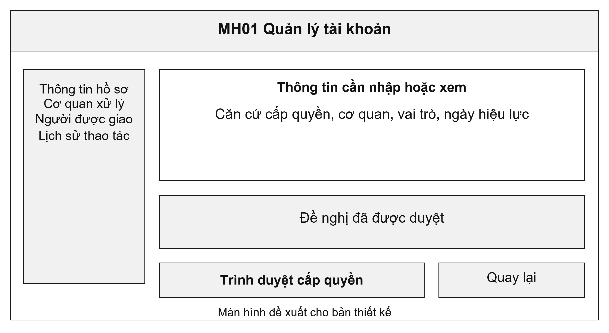
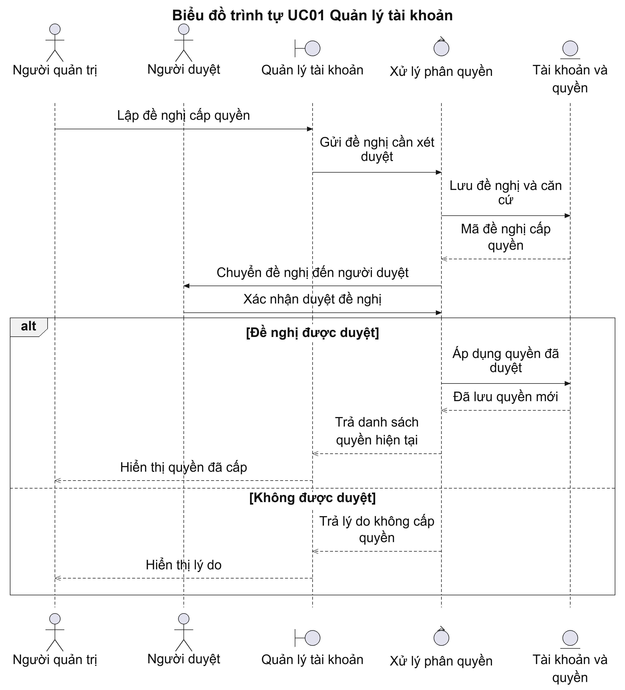
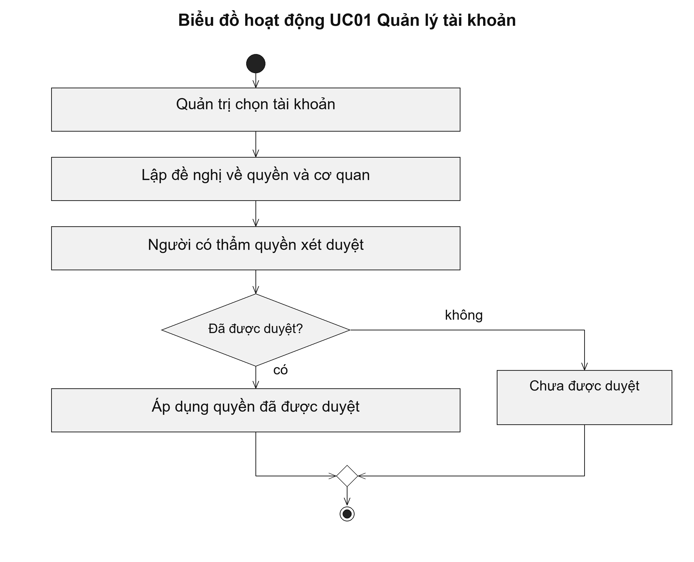

# UC01 Quản lý tài khoản

Quyền của cán bộ phải gắn với công việc và cơ quan được giao. Chẳng hạn, cán bộ tiếp nhận của một cơ quan chỉ được xem và tiếp nhận hồ sơ thuộc cơ quan đó. Khi cán bộ chuyển công tác, người quản trị thu hồi quyền cũ rồi đề nghị quyền tại cơ quan mới; việc chuyển công tác không làm mất lịch sử xử lý hồ sơ.

Điều kiện bắt đầu: Người quản trị đã đăng nhập và được giao quản lý tài khoản của cơ quan. Người duyệt quyền phải khác người đề nghị.

1. Người quản trị chọn tài khoản cần thay đổi.
2. Người quản trị khai báo vai trò, cơ quan, thời gian áp dụng và căn cứ cấp quyền.
3. Người có thẩm quyền duyệt đề nghị.
4. Hệ thống áp dụng quyền đã được duyệt và ghi lại người thực hiện.

Kết quả: Tài khoản có quyền mới trong thời gian được duyệt; lịch sử quyền cũ được giữ lại.

Trường hợp cần xử lý: Hệ thống không cấp quyền khi đề nghị chưa được duyệt hoặc thời gian áp dụng đã hết. Nếu người quản trị chọn chính mình làm người duyệt, hệ thống yêu cầu đổi người duyệt.

