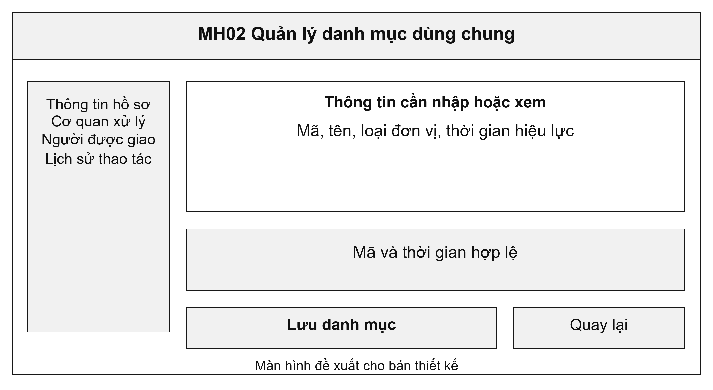
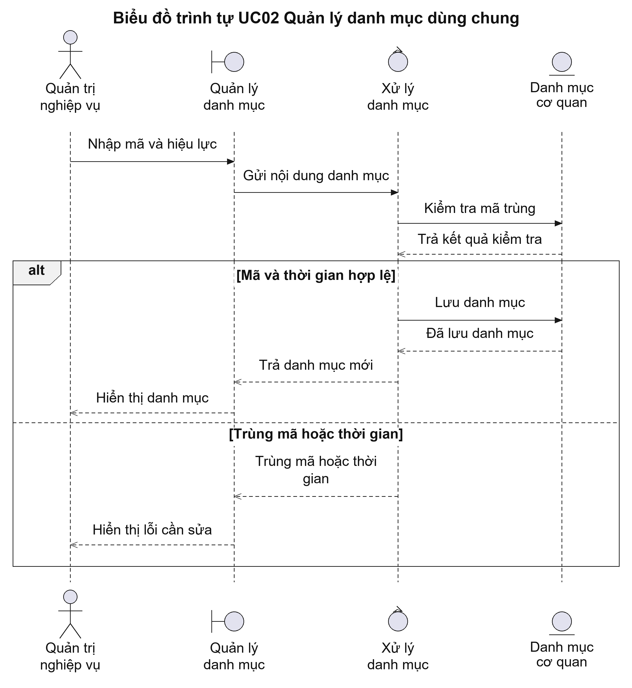
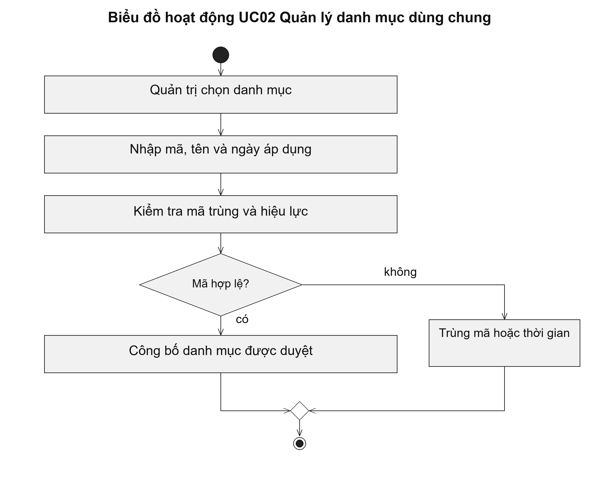

# UC02 Quản lý danh mục dùng chung

Danh mục dùng chung giúp tên cơ quan và điểm tiếp nhận được sử dụng thống nhất khi nộp, chuyển và tra cứu hồ sơ. Khi một đơn vị đổi tên, hệ thống lưu tên mới kèm ngày bắt đầu áp dụng. Nhờ vậy, người tra cứu vẫn biết hồ sơ cũ do đơn vị nào tiếp nhận, thay vì chỉ thấy tên hiện tại.

Điều kiện bắt đầu: Người quản trị được giao cập nhật danh mục và có văn bản làm căn cứ cho nội dung thay đổi.

1. Người quản trị chọn danh mục cơ quan hoặc điểm tiếp nhận.
2. Người quản trị nhập mã, tên và thời gian áp dụng.
3. Hệ thống kiểm tra mã trùng và thời gian áp dụng của các bản ghi.
4. Người quản trị công bố nội dung đã được duyệt.

Kết quả: Danh mục mới được sử dụng từ ngày có hiệu lực; hồ sơ cũ vẫn lưu thông tin cơ quan tại thời điểm tiếp nhận.

Trường hợp cần xử lý: Nếu mã đã tồn tại hoặc thời gian áp dụng bị trùng, hệ thống chỉ rõ bản ghi cần sửa. Việc đổi tên cơ quan không được xóa thông tin cơ quan trong hồ sơ đã tiếp nhận.

