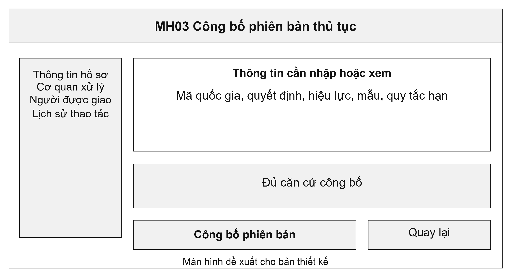
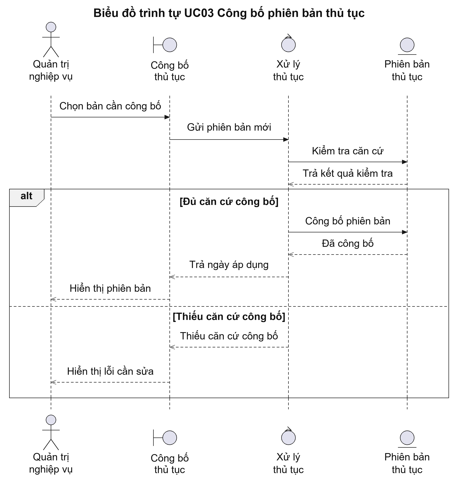
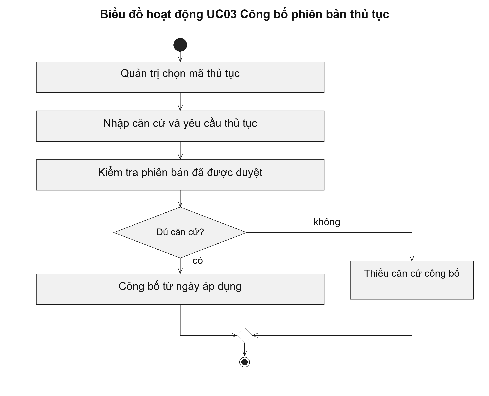

# UC03 Công bố phiên bản thủ tục

Một thủ tục có thể thay đổi biểu mẫu, thời hạn hoặc cơ quan giải quyết qua từng quyết định. Vì vậy, hệ thống cần lưu từng phiên bản thay vì sửa trực tiếp bản đang dùng. Khi tra cứu một hồ sơ, cán bộ có thể xác định được các yêu cầu đã áp dụng tại thời điểm tiếp nhận hồ sơ đó.

Điều kiện bắt đầu: Quyết định công bố thủ tục, cơ quan giải quyết và quy trình xử lý đã được người có thẩm quyền phê duyệt.

1. Người quản trị chọn mã thủ tục hành chính.
2. Người quản trị nhập quyết định, thành phần hồ sơ, biểu mẫu, thời hạn và cơ quan giải quyết.
3. Hệ thống kiểm tra nội dung bắt buộc và ngày áp dụng.
4. Người quản trị công bố phiên bản đã được duyệt.

Kết quả: Phiên bản mới được dùng đúng ngày có hiệu lực. Hồ sơ đã tiếp nhận vẫn gắn với phiên bản áp dụng trước đó.

Trường hợp cần xử lý: Hệ thống không công bố khi thiếu quyết định hoặc chưa có quy trình được duyệt. Phiên bản đã được hồ sơ sử dụng phải được giữ nguyên; nội dung thay đổi được lập thành phiên bản mới.

