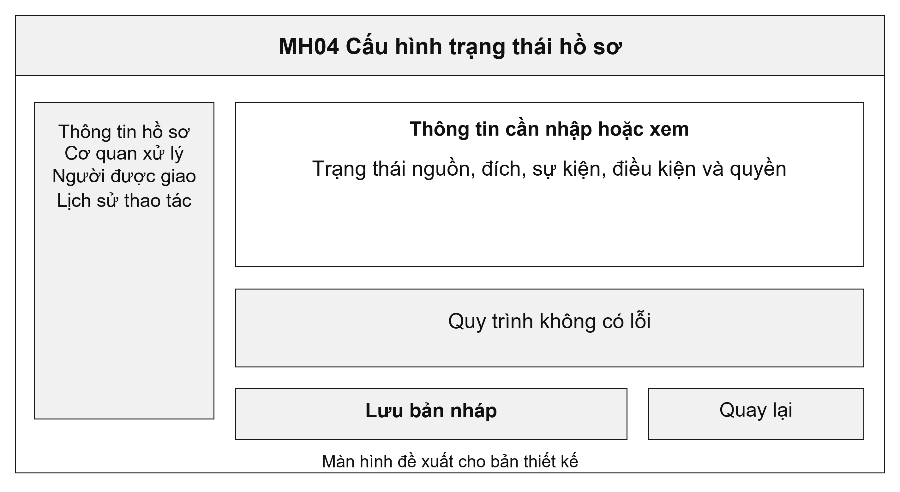
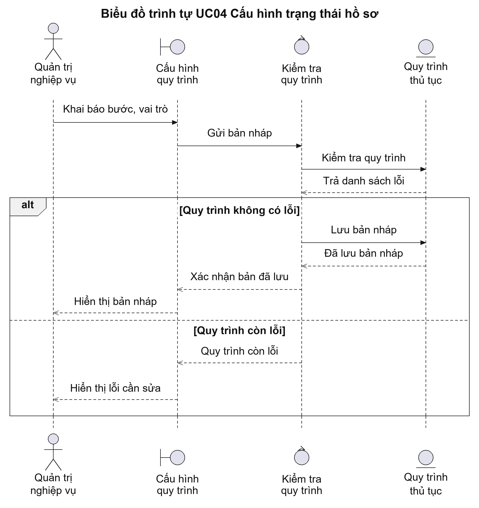
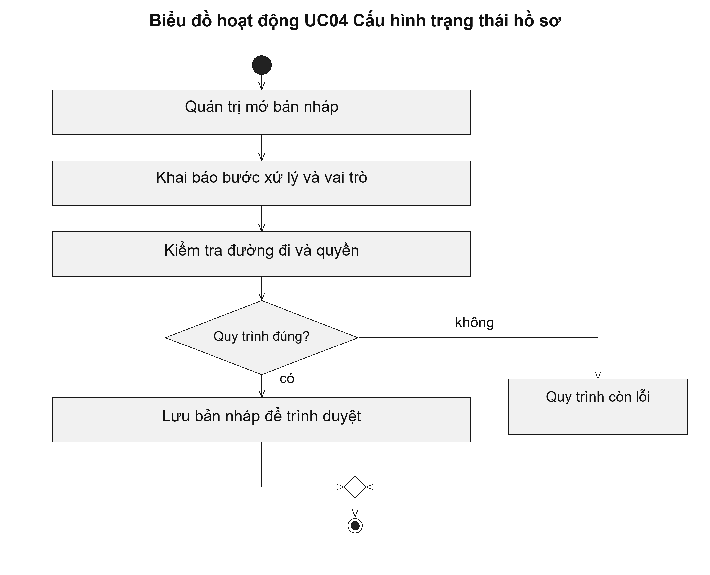

# UC04 Cấu hình trạng thái hồ sơ

UC04 trả lời hai câu hỏi: hồ sơ đang ở bước nào và ai được đưa hồ sơ sang bước tiếp theo. Ví dụ, hồ sơ đang thẩm định chỉ được trình duyệt sau khi chuyên viên đã lập dự thảo và thu đủ ý kiến bắt buộc. Người quản trị khai báo quy tắc này trên bản nháp; cán bộ xử lý hồ sơ không được tự bỏ qua bước đã quy định.

Điều kiện bắt đầu: Người quản trị được phép sửa bản nháp quy trình. Quy trình đang áp dụng cho hồ sơ thật không bị sửa trực tiếp.

1. Người quản trị mở bản nháp quy trình của một thủ tục.
2. Người quản trị khai báo các bước, trạng thái hồ sơ và vai trò được xử lý tại từng bước.
3. Hệ thống kiểm tra bước bị bỏ rơi, nhánh không có điểm kết thúc và quyền chuyển bước.
4. Người quản trị sửa các lỗi được chỉ ra rồi lưu bản nháp để trình duyệt.

Kết quả: Bản nháp quy trình được lưu cùng kết quả kiểm tra. Chỉ phiên bản được phê duyệt mới được đưa vào sử dụng.

Trường hợp cần xử lý: Nếu một bước không có đường đi đến kết thúc hoặc chưa được giao vai trò xử lý, hệ thống đánh dấu bước đó và yêu cầu sửa. Trạng thái thanh toán, giao kết quả và đồng bộ được quản lý riêng với trạng thái xử lý hồ sơ.

