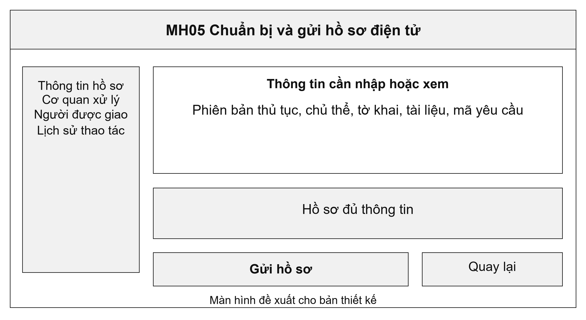
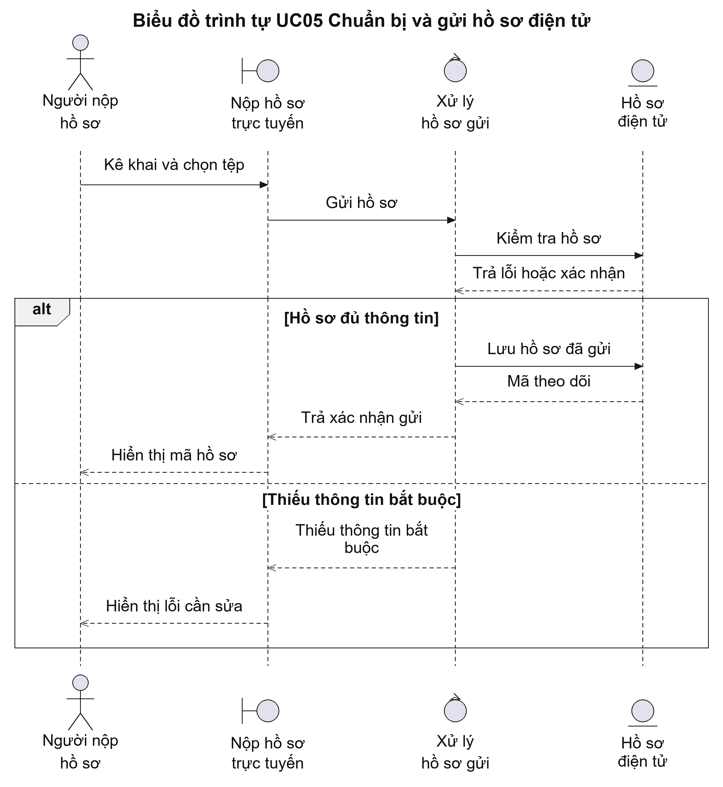
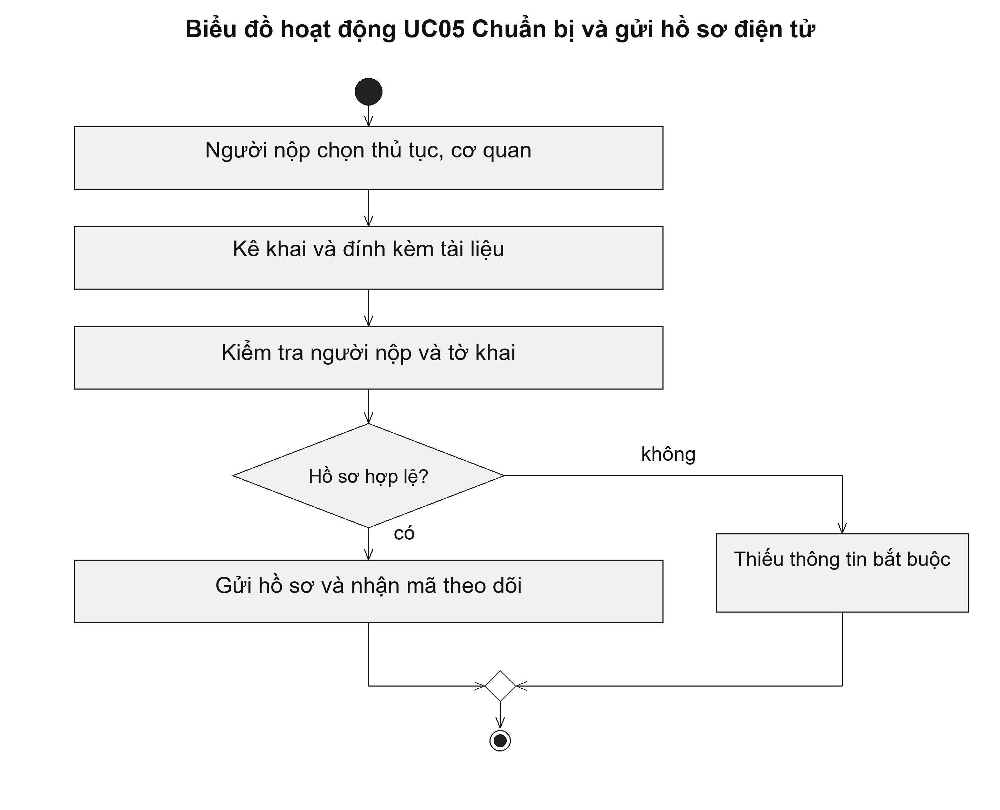

# UC05 Chuẩn bị và gửi hồ sơ điện tử

Gửi hồ sơ trực tuyến chưa có nghĩa là hồ sơ đã được cơ quan tiếp nhận chính thức. Sau khi gửi, người nộp dùng mã theo dõi để xem cán bộ đã nhận hồ sơ hay yêu cầu bổ sung. Chức năng này cần giữ lại bản nháp khi mất kết nối để người dùng không phải kê khai lại từ đầu.

Điều kiện bắt đầu: Người nộp đã xác thực tài khoản. Thủ tục và cơ quan được chọn cho phép nộp trực tuyến; người nộp có quyền nộp cho bản thân hoặc đại diện.

1. Người nộp chọn thủ tục và cơ quan có thẩm quyền.
2. Người nộp điền tờ khai, đính kèm tài liệu và khai báo thông tin đại diện nếu có.
3. Hệ thống kiểm tra trường bắt buộc, tệp đính kèm và cơ quan tiếp nhận.
4. Người nộp xem lại nội dung, xác nhận gửi và lưu mã theo dõi.

Kết quả: Hồ sơ chuyển từ bản nháp sang chờ tiếp nhận và có mã theo dõi để người nộp tra cứu.

Trường hợp cần xử lý: Nếu thiếu thông tin, hệ thống chỉ rõ trường cần bổ sung và giữ bản nháp. Nếu người nộp bấm gửi nhiều lần, hệ thống trả lại cùng mã hồ sơ, không tạo các hồ sơ trùng nhau.

