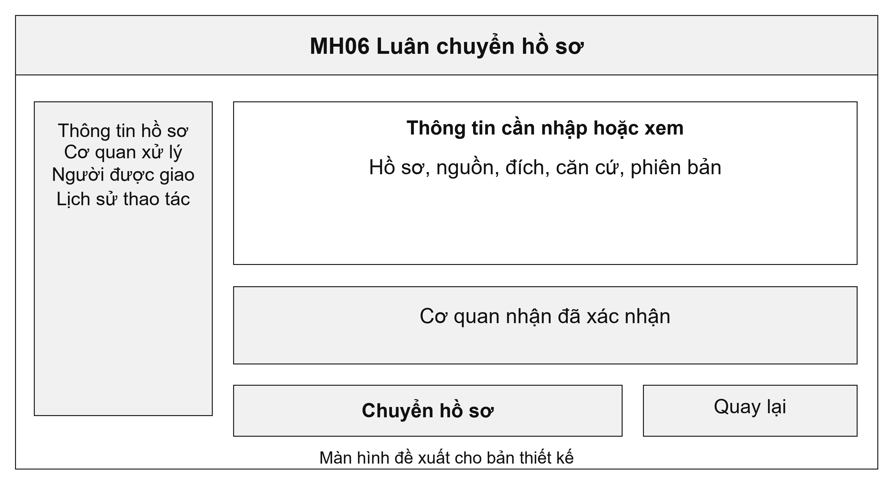
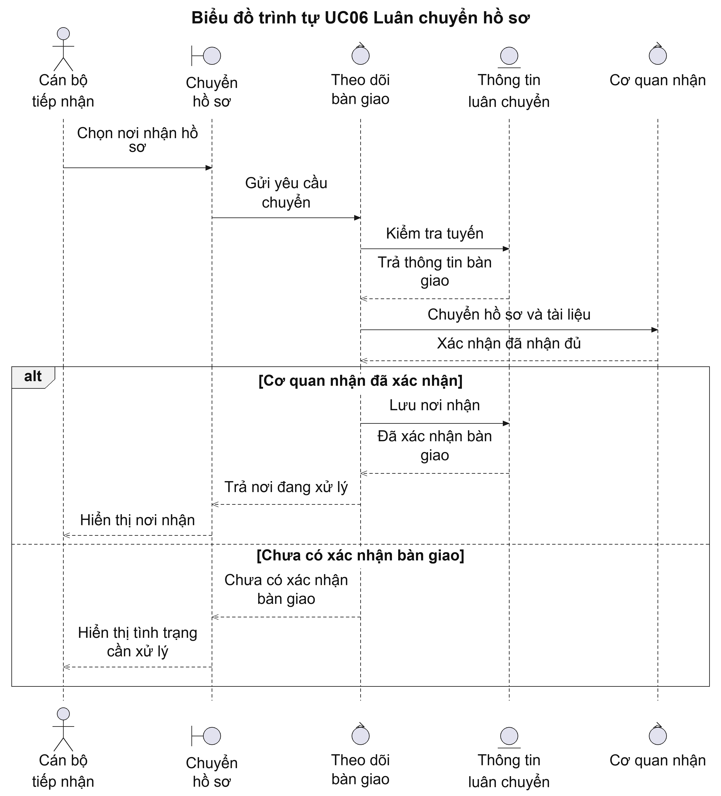
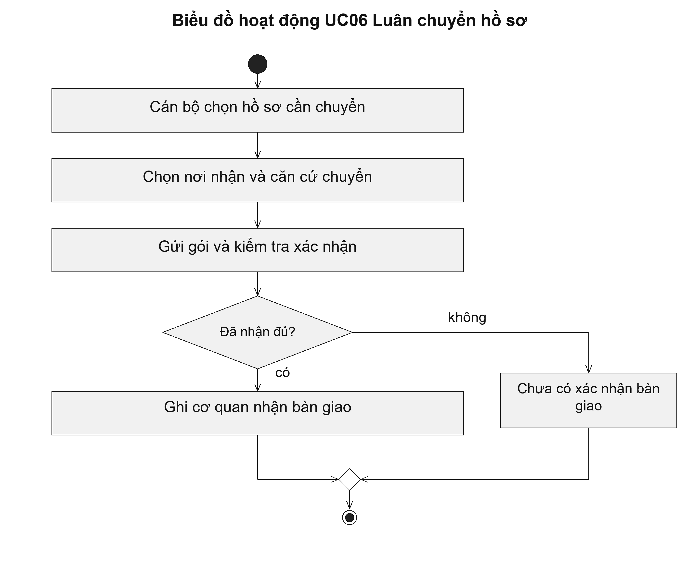

# UC06 Luân chuyển hồ sơ

Luân chuyển cần theo dõi cả việc gửi và việc nhận. Một hồ sơ chỉ được coi là bàn giao xong khi cơ quan nhận đã xác nhận đủ dữ liệu cần xử lý. Thiết kế này giúp xác định trách nhiệm khi hồ sơ đi qua nhiều cơ quan, đặc biệt khi kết nối giữa các hệ thống bị gián đoạn.

Điều kiện bắt đầu: Hồ sơ còn đang xử lý. Cán bộ được phép chuyển hồ sơ và cơ quan nhận được xác định theo quy trình của thủ tục.

1. Cán bộ chọn hồ sơ cần chuyển.
2. Cán bộ chọn cơ quan nhận và nêu căn cứ chuyển.
3. Hệ thống gửi hồ sơ cùng tài liệu và thông tin thời hạn.
4. Cơ quan nhận xác nhận bàn giao; hệ thống cập nhật cơ quan đang chịu trách nhiệm.

Kết quả: Hồ sơ ghi nhận cơ quan nhận và thời điểm bàn giao. Mã hồ sơ và lịch sử xử lý được giữ nguyên.

Trường hợp cần xử lý: Nếu chưa có xác nhận từ cơ quan nhận, cơ quan gửi vẫn phải theo dõi hồ sơ. Mất phản hồi không được tạo hồ sơ mới hoặc tự đặt lại thời hạn giải quyết.

