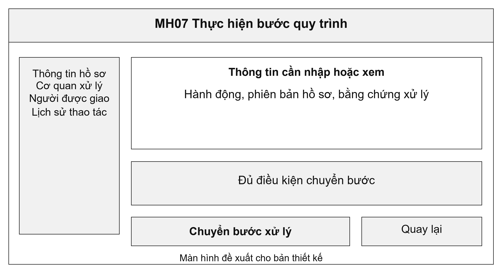
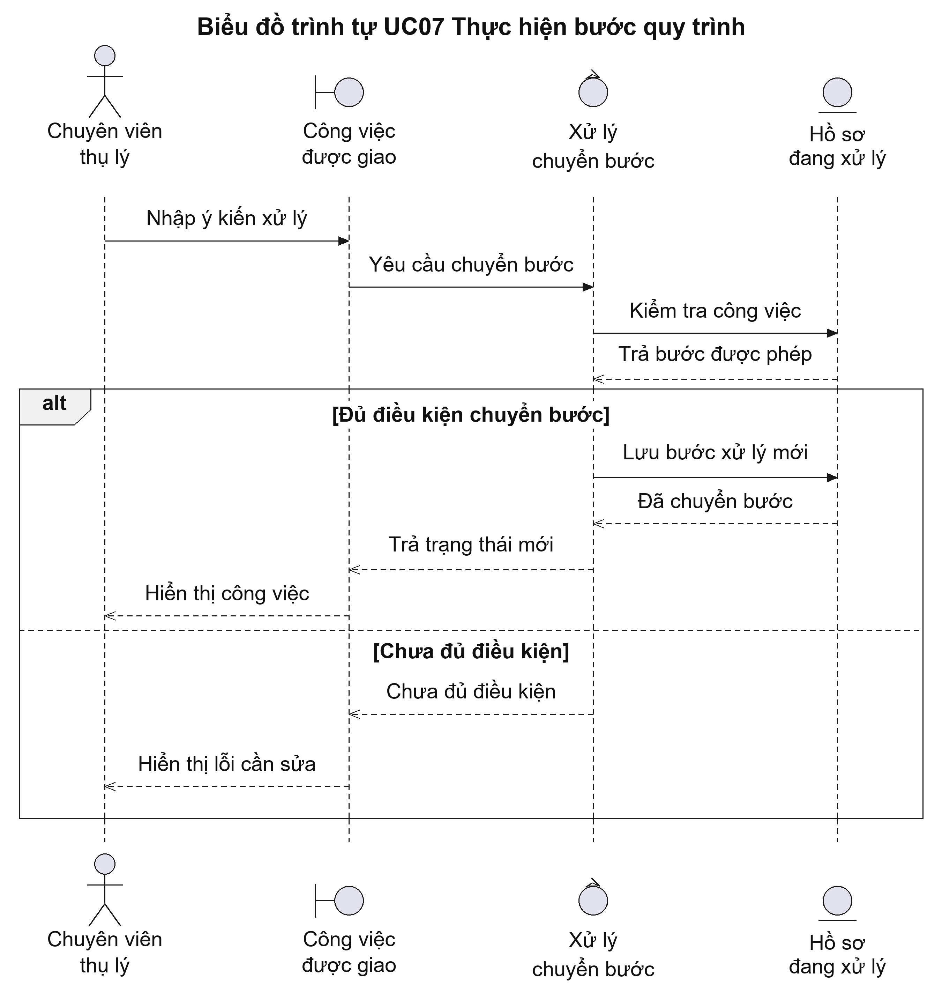
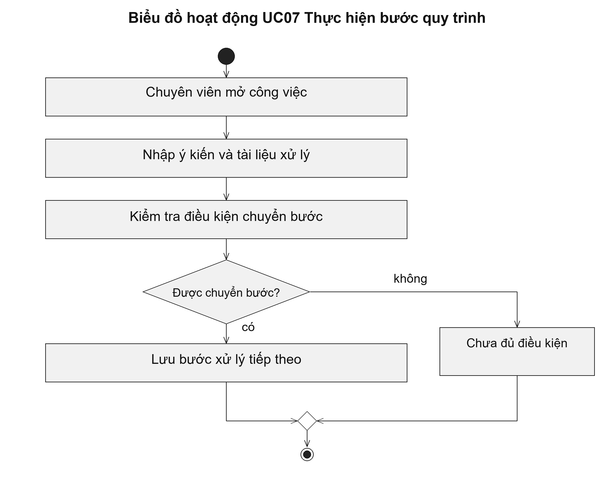

# UC07 Thực hiện bước quy trình

Mỗi lần chuyển bước phải gắn với một công việc cụ thể. Ví dụ, chuyên viên không thể chọn trình duyệt khi chưa có dự thảo kết quả. Hệ thống chỉ hiển thị các hành động phù hợp với vai trò và trạng thái hiện tại, đồng thời kiểm tra lại điều kiện trên máy chủ khi nhận yêu cầu.

Điều kiện bắt đầu: Chuyên viên được phân công xử lý hồ sơ và hồ sơ đang ở bước mà chuyên viên có quyền thực hiện.

1. Chuyên viên mở công việc được giao.
2. Chuyên viên đọc hồ sơ và yêu cầu của bước xử lý.
3. Chuyên viên nhập kết quả, ý kiến và tài liệu làm căn cứ.
4. Hệ thống kiểm tra điều kiện rồi cập nhật bước xử lý tiếp theo.

Kết quả: Hồ sơ có trạng thái mới; ý kiến, người thực hiện và thời điểm chuyển bước được lưu lại.

Trường hợp cần xử lý: Nếu người khác đã cập nhật hồ sơ trong lúc chuyên viên đang xử lý, hệ thống yêu cầu tải lại dữ liệu trước khi lưu. Ý kiến cũ không bị ghi đè.

