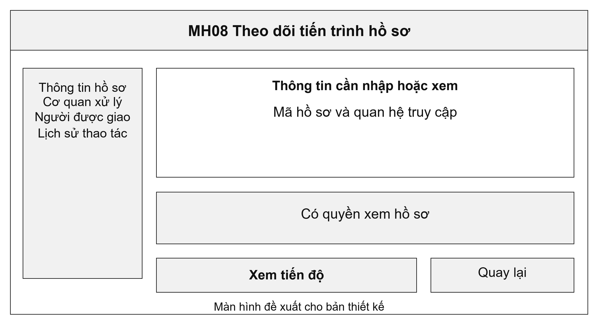
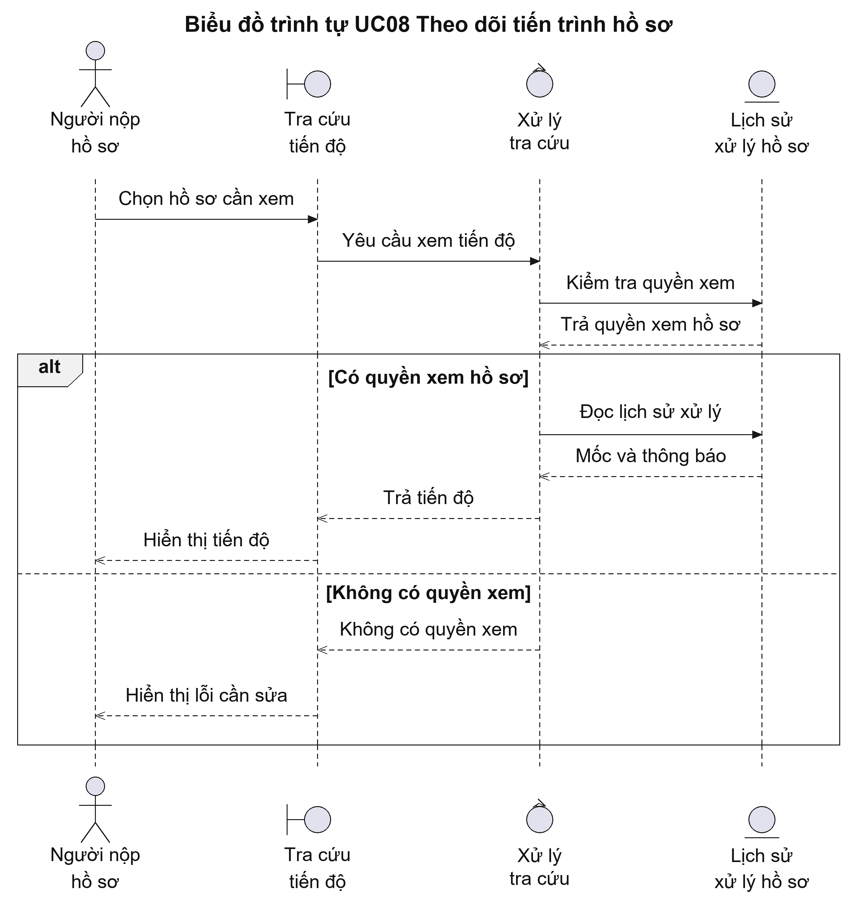
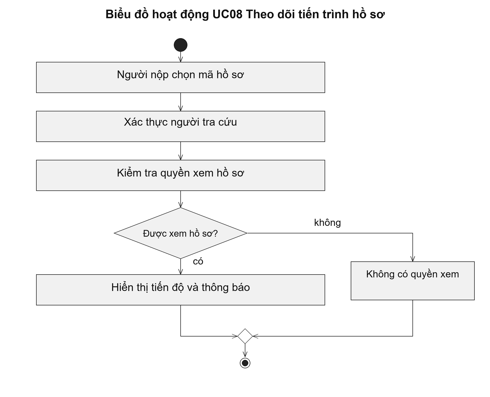

# UC08 Theo dõi tiến trình hồ sơ

Thông tin tiến độ cần diễn đạt bằng việc đã thực hiện, chẳng hạn hồ sơ đã được tiếp nhận, đang thẩm định hoặc đang chờ người nộp bổ sung. Nếu có yêu cầu bổ sung, người nộp phải đọc được nội dung cần bổ sung và cách gửi lại tài liệu, thay vì chỉ thấy một mã trạng thái.

Điều kiện bắt đầu: Người tra cứu đã xác thực và có quyền xem hồ sơ được chọn.

1. Người nộp chọn hồ sơ hoặc nhập mã theo dõi.
2. Hệ thống kiểm tra quyền xem hồ sơ.
3. Hệ thống lấy các mốc xử lý, thời hạn và thông báo được phép công khai.
4. Người nộp đọc tình trạng hồ sơ và yêu cầu cần thực hiện.

Kết quả: Người nộp xem được tiến độ và thông báo của hồ sơ; việc tra cứu không thay đổi trạng thái hồ sơ.

Trường hợp cần xử lý: Hệ thống không hiển thị hồ sơ của người khác hoặc ý kiến xử lý nội bộ. Nếu không tìm thấy hồ sơ trong phạm vi được phép xem, hệ thống thông báo không có kết quả phù hợp.

