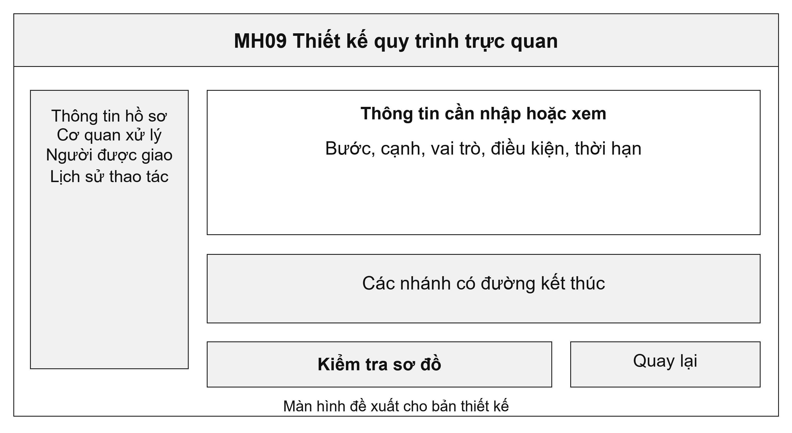
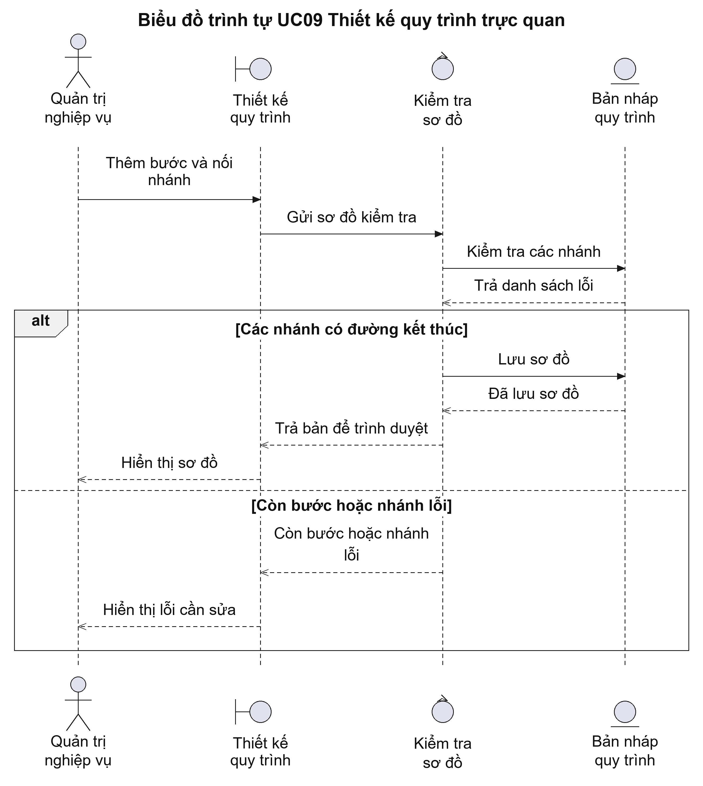
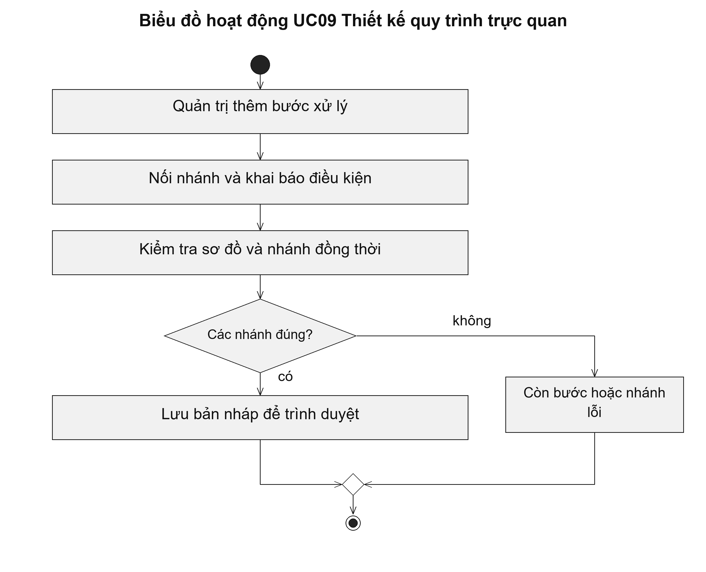

# UC09 Thiết kế quy trình trực quan

UC09 tập trung vào việc dựng và nối các bước trên sơ đồ, còn UC04 khai báo trạng thái và quyền chuyển bước. Hai chức năng cùng phục vụ thiết kế một quy trình thủ tục. Quy trình chỉ được công bố sau khi đã kiểm tra và được phê duyệt; người quản trị không áp dụng bản nháp trực tiếp cho hồ sơ của người dân.

Điều kiện bắt đầu: Người quản trị có quyền thiết kế quy trình và đang làm việc trên một bản nháp.

1. Người quản trị thêm các bước tiếp nhận, thẩm định, phê duyệt và trả kết quả.
2. Người quản trị nối các bước, khai báo vai trò, thời hạn và điều kiện rẽ nhánh.
3. Hệ thống kiểm tra bước không có đường vào hoặc đường ra và các nhánh xử lý đồng thời.
4. Người quản trị sửa lỗi, lưu bản nháp và chuyển người có thẩm quyền xem xét.

Kết quả: Bản nháp quy trình được lưu với các bước và điều kiện đầy đủ để trình duyệt.

Trường hợp cần xử lý: Nhánh xử lý đồng thời phải xác định khi nào được tổng hợp kết quả. Lưu bản nháp không làm thay đổi quy trình của hồ sơ đang xử lý.

