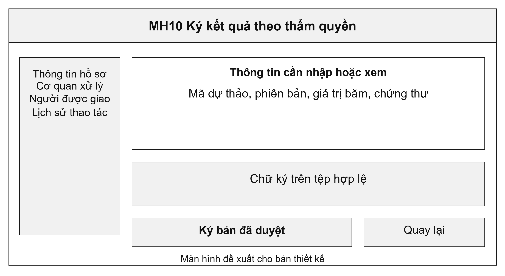
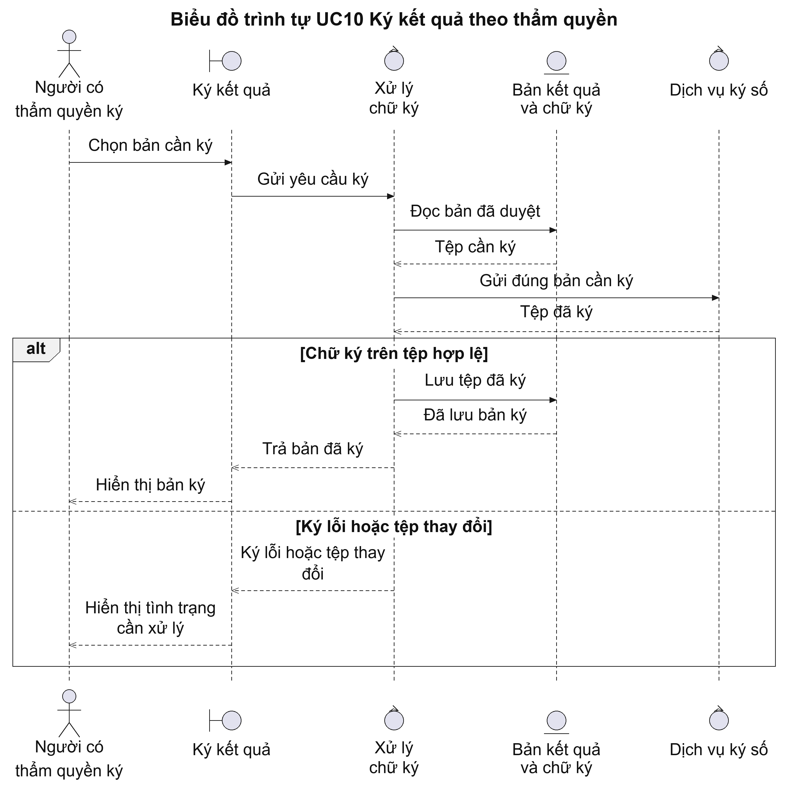
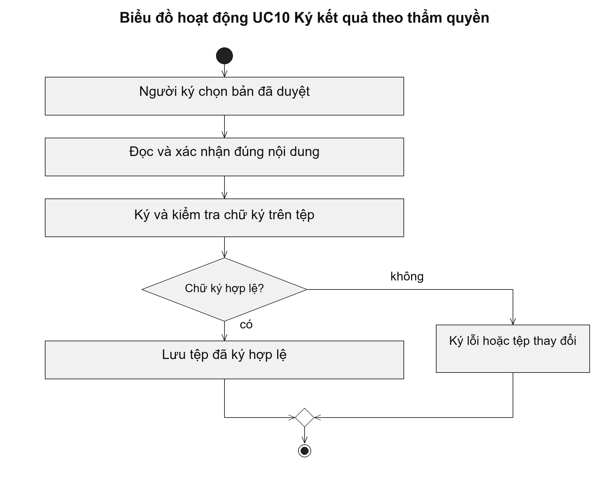

# UC10 Ký kết quả theo thẩm quyền

Chữ ký số phải gắn với chính tệp kết quả được phê duyệt. Sau khi ký, không được sửa nội dung tệp để bổ sung thông tin rồi tiếp tục coi chữ ký cũ là hợp lệ. Khi cần sửa kết quả, cán bộ phải lập bản mới và thực hiện lại việc duyệt, ký theo thẩm quyền.

Điều kiện bắt đầu: Người ký có thẩm quyền, dự thảo đã được duyệt và phương tiện ký được cấp còn sử dụng được.

1. Người ký chọn bản dự thảo cần ký.
2. Người ký đọc nội dung và xác nhận đúng phiên bản.
3. Hệ thống chuyển yêu cầu đến dịch vụ ký; người ký xác nhận trên phương tiện được cấp.
4. Hệ thống kiểm tra chữ ký trên tệp nhận lại rồi lưu bản đã ký.

Kết quả: Kết quả có tệp đã ký và thông tin kiểm tra chữ ký. Tệp đã ký được giữ nguyên nội dung.

Trường hợp cần xử lý: Nếu tệp bị thay đổi hoặc chữ ký không hợp lệ, hệ thống báo lỗi và giữ nguyên trạng thái chưa ký. Việc gửi yêu cầu ký chưa đủ để ghi nhận ký thành công.

