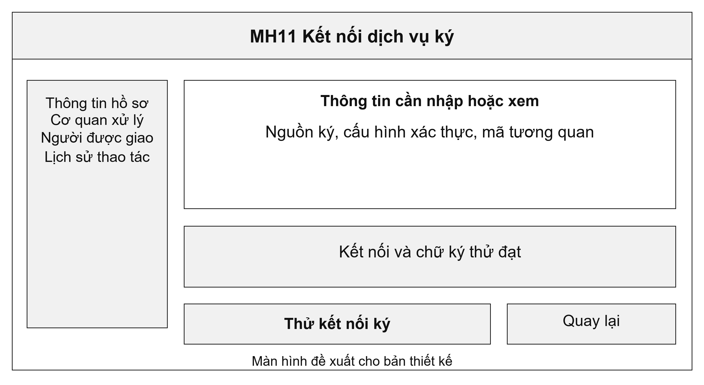
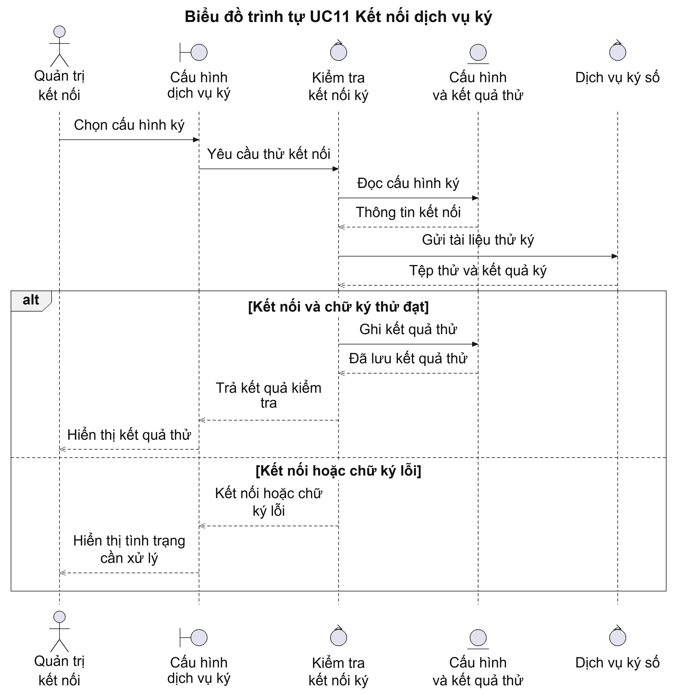
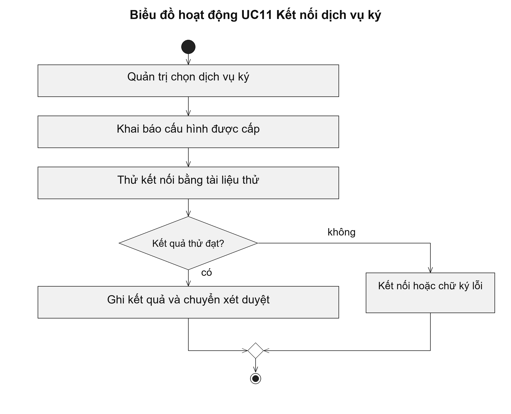

# UC11 Kết nối dịch vụ ký

Chức năng này phục vụ người quản trị kết nối, không phải người ký văn bản. Kết nối hoạt động chỉ cho biết hệ thống có thể trao đổi với dịch vụ ký; quyền ký một văn bản vẫn thuộc người được giao thẩm quyền và phải được kiểm tra riêng.

Điều kiện bắt đầu: Người quản trị được giao quản lý kết nối và đã có thông tin kết nối do đơn vị cung cấp dịch vụ ký cấp.

1. Người quản trị chọn dịch vụ ký và môi trường kiểm tra.
2. Người quản trị khai báo địa chỉ kết nối và thông tin xác thực trong nơi lưu trữ được bảo vệ.
3. Hệ thống gửi tài liệu thử được phép sử dụng.
4. Người quản trị đối chiếu phản hồi và kiểm tra chữ ký trên tài liệu thử.

Kết quả: Kết quả thử kết nối được ghi lại; cấu hình đạt yêu cầu được chuyển bước xét duyệt trước khi sử dụng.

Trường hợp cần xử lý: Nếu dịch vụ không phản hồi hoặc chữ ký thử không hợp lệ, cấu hình chưa được đưa vào dùng. Khóa bí mật và thông tin xác thực không được ghi vào hồ sơ hoặc nhật ký thông thường.

