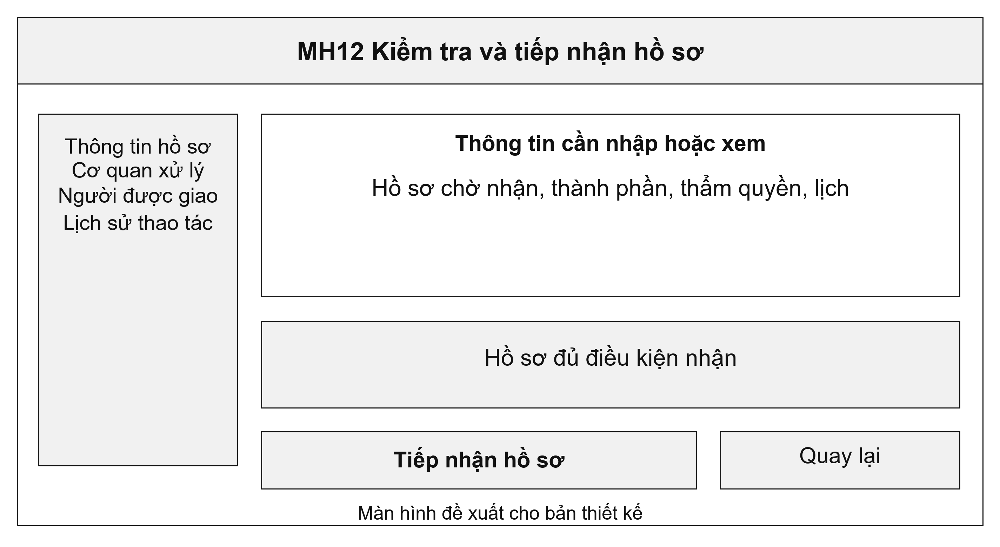
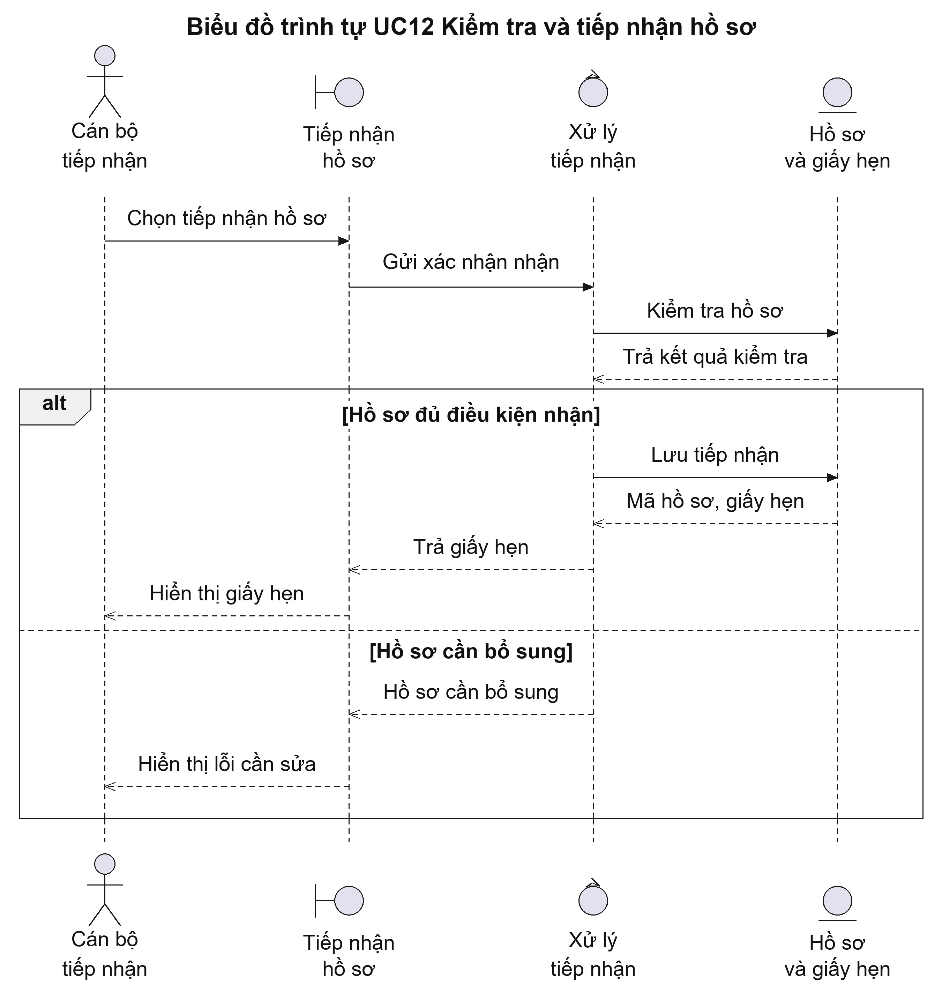
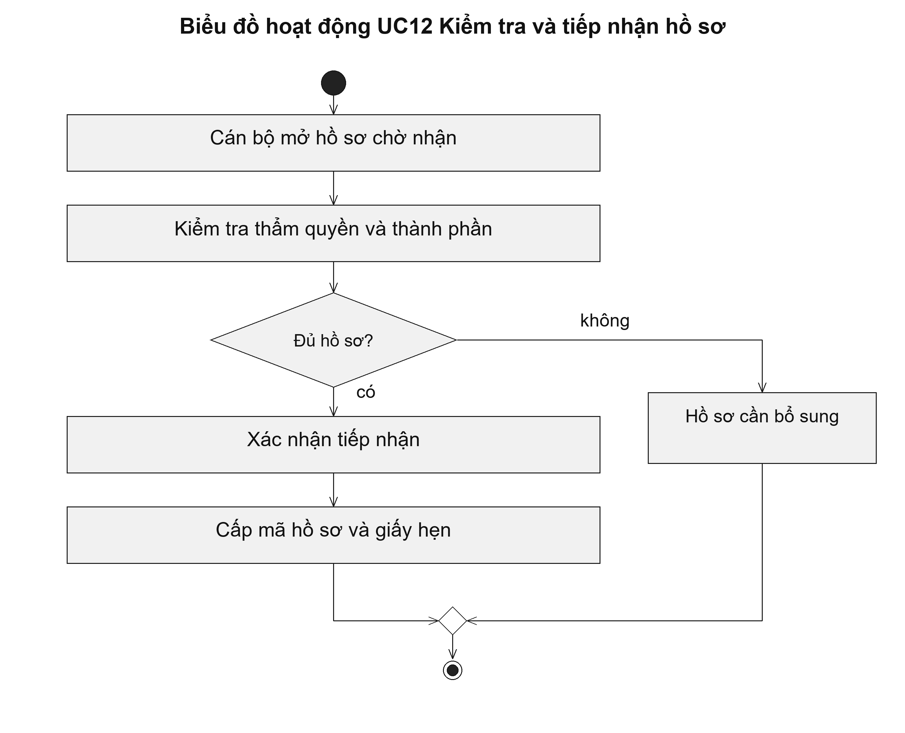

# UC12 Kiểm tra và tiếp nhận hồ sơ

Tiếp nhận là thời điểm cơ quan xác nhận hồ sơ đủ điều kiện để xử lý. Đây cũng là căn cứ xác định thời hạn theo quy định của từng thủ tục. Quy tắc nhận hồ sơ sau 15 giờ chỉ được cấu hình cho thủ tục có quy định tương ứng, không áp dụng chung cho mọi hồ sơ.

Điều kiện bắt đầu: Hồ sơ đang chờ tiếp nhận và cán bộ được giao tiếp nhận tại cơ quan được chọn.

1. Cán bộ mở hồ sơ chờ tiếp nhận.
2. Cán bộ kiểm tra người nộp, thẩm quyền và thành phần hồ sơ.
3. Nếu hồ sơ đủ điều kiện, cán bộ xác nhận tiếp nhận.
4. Hệ thống cấp mã hồ sơ chính thức, tính thời hạn theo thủ tục và lập giấy hẹn.

Kết quả: Hồ sơ chuyển sang đã tiếp nhận; người nộp nhận được mã hồ sơ và giấy hẹn.

Trường hợp cần xử lý: Nếu còn thiếu thành phần có thể bổ sung, cán bộ lập yêu cầu bổ sung và nêu căn cứ. Nếu từ chối tiếp nhận, cán bộ phải ghi lý do và thực hiện theo thẩm quyền; không dùng yêu cầu bổ sung thay cho thông báo từ chối.

