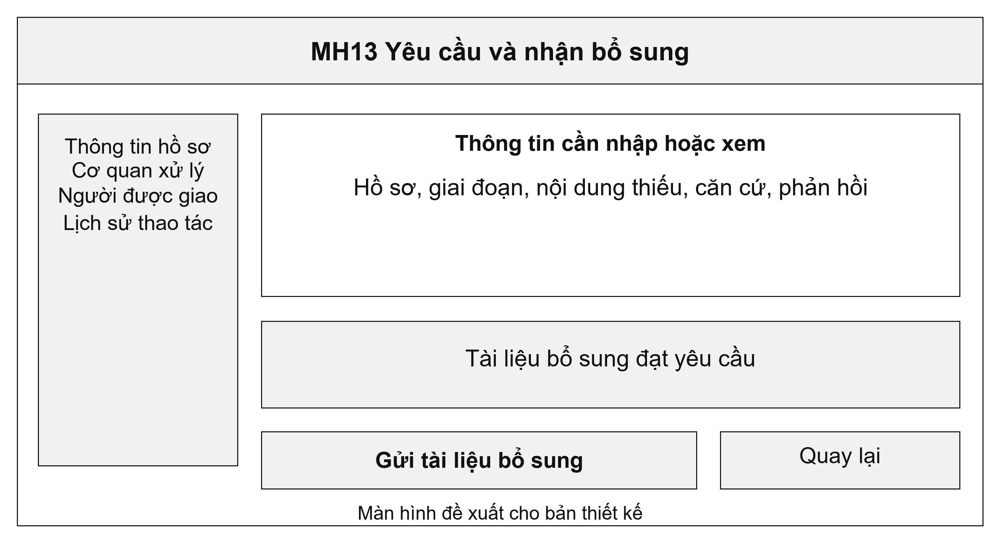
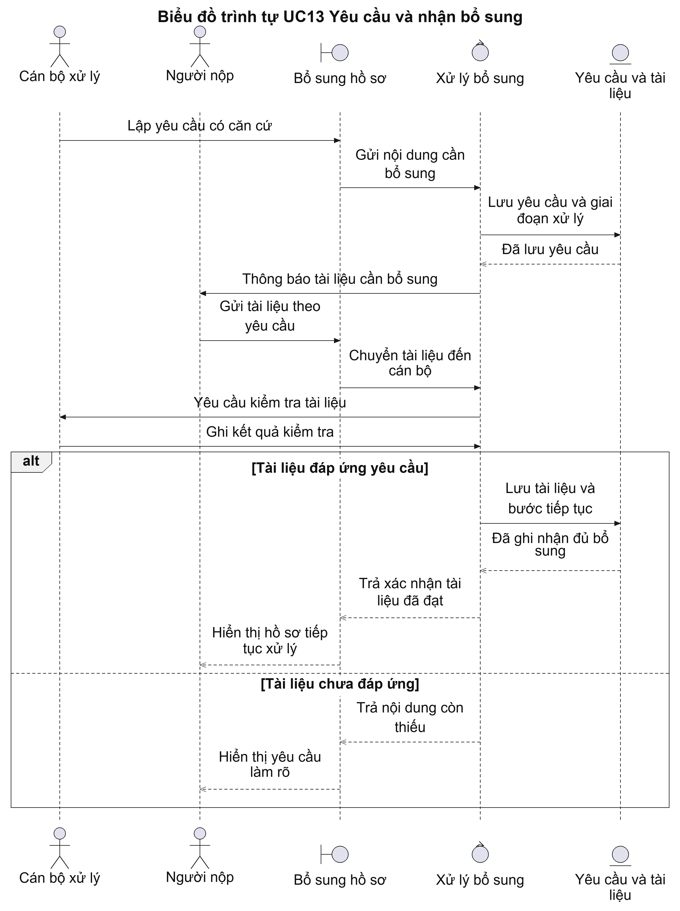
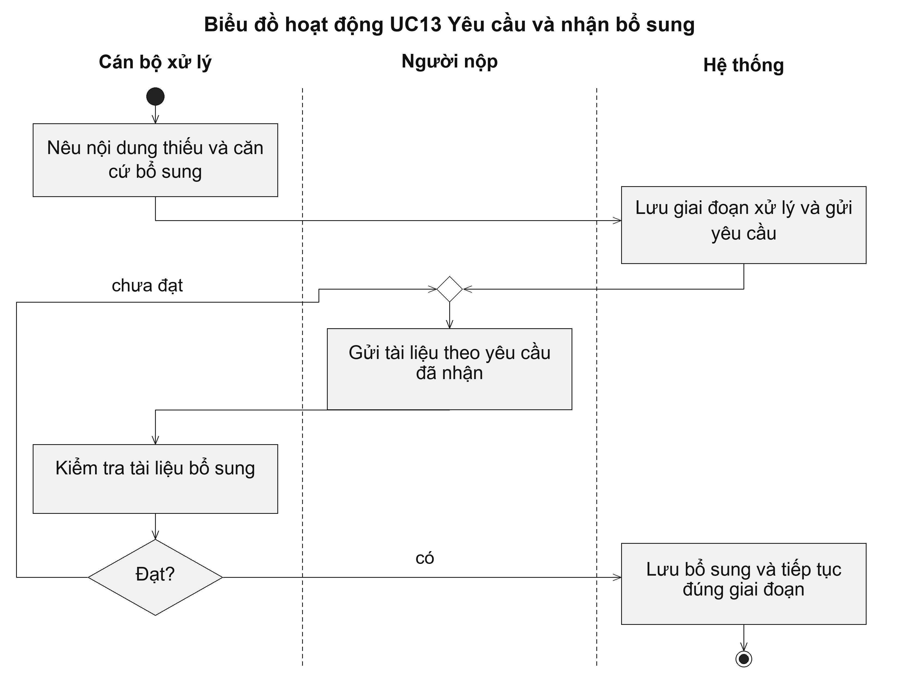

# UC13 Yêu cầu và nhận bổ sung

Hồ sơ có thể cần bổ sung ngay khi tiếp nhận hoặc trong quá trình thẩm định. Hệ thống phải ghi nhớ giai đoạn phát sinh yêu cầu để sau khi bổ sung không đưa hồ sơ về đầu quy trình. Người nộp cần xem được từng nội dung còn thiếu và biết tài liệu mình gửi đã được cán bộ kiểm tra hay chưa.

Điều kiện bắt đầu: Hồ sơ đang được kiểm tra hoặc thẩm định. Cán bộ có trách nhiệm xử lý ở giai đoạn phát hiện thiếu thông tin.

1. Cán bộ chỉ rõ nội dung còn thiếu và căn cứ yêu cầu bổ sung.
2. Hệ thống lưu giai đoạn đang xử lý và gửi thông báo cho người nộp.
3. Người nộp gửi tài liệu theo yêu cầu.
4. Cán bộ kiểm tra tài liệu bổ sung.
5. Nếu đạt yêu cầu, hệ thống đưa hồ sơ trở lại giai đoạn xử lý đã lưu; nếu chưa đạt, cán bộ nêu nội dung cần làm rõ.

Kết quả: Tài liệu bổ sung được gắn với đúng yêu cầu. Hồ sơ tiếp tục tại giai đoạn trước khi yêu cầu bổ sung.

Trường hợp cần xử lý: Hệ thống không tự đặt lại thời hạn khi nhận tài liệu bổ sung. Tài liệu chưa đáp ứng yêu cầu phải được phản hồi rõ nội dung cần sửa; hết thời gian chờ không tự động được coi là từ chối hồ sơ.

