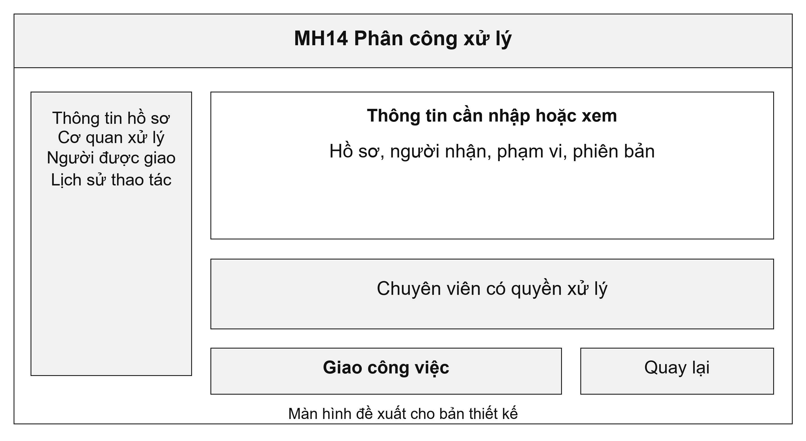
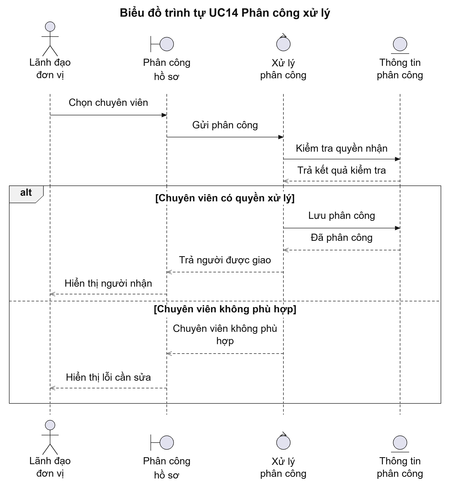
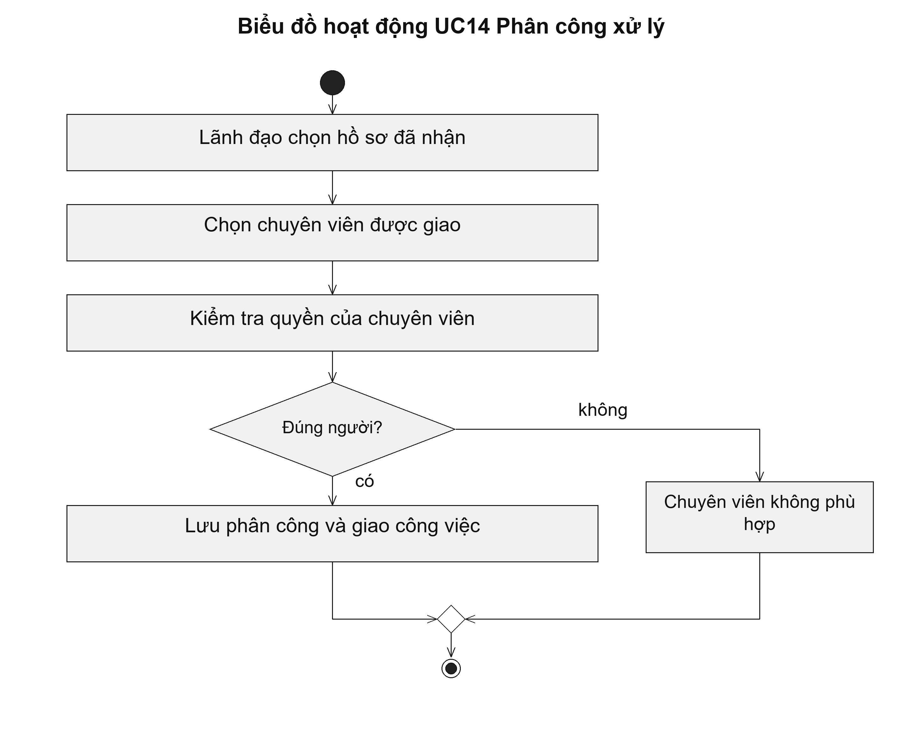

# UC14 Phân công xử lý

Phân công giúp xác định ai chịu trách nhiệm ở từng thời điểm. Khi cần chuyển việc cho chuyên viên khác, lãnh đạo phải ghi nhận việc phân công lại trên hệ thống. Cách làm này tránh tình trạng hai người cùng được coi là người xử lý chính mà không xác định được trách nhiệm.

Điều kiện bắt đầu: Hồ sơ đã được tiếp nhận và lãnh đạo có quyền phân công tại cơ quan đang giải quyết.

1. Lãnh đạo chọn hồ sơ cần phân công.
2. Lãnh đạo chọn chuyên viên còn quyền xử lý và ghi yêu cầu công việc.
3. Hệ thống kiểm tra phạm vi của chuyên viên và tình trạng hồ sơ.
4. Lãnh đạo xác nhận; hệ thống đưa hồ sơ vào danh sách công việc của chuyên viên.

Kết quả: Hồ sơ có một phân công đang có hiệu lực; người được giao nhìn thấy công việc trong danh sách của mình.

Trường hợp cần xử lý: Nếu phân công lại, hệ thống kết thúc phân công cũ và ghi phân công mới trong một lần lưu. Lịch sử người đã được giao xử lý không bị xóa.

