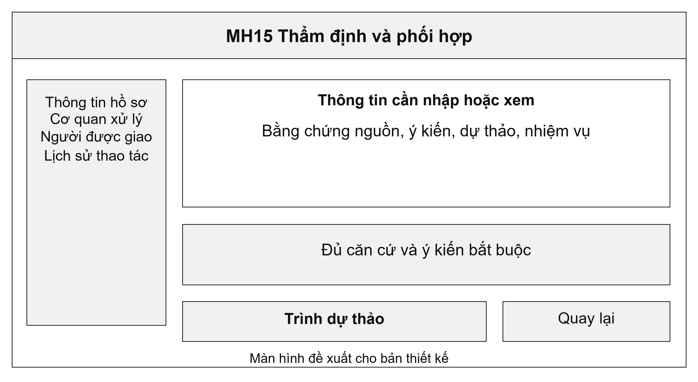
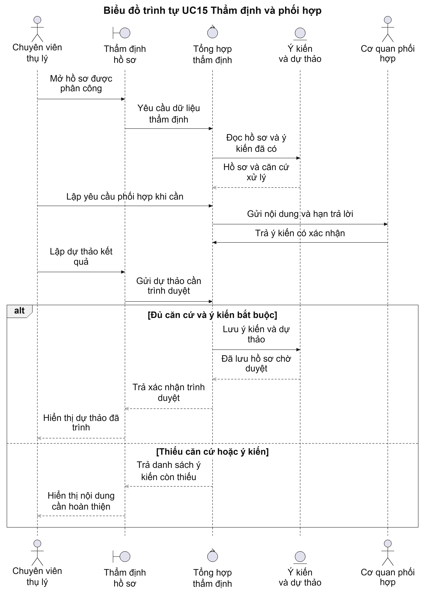
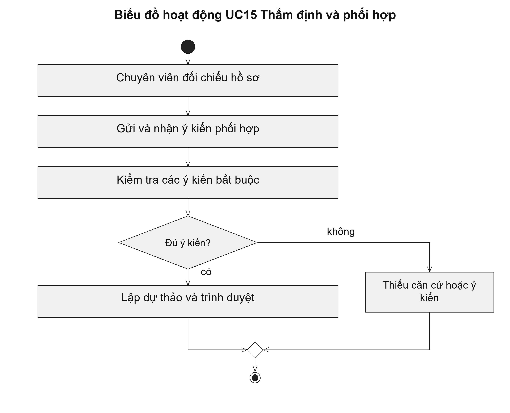

# UC15 Thẩm định và phối hợp

Thẩm định phải cho thấy chuyên viên đã kiểm tra những gì và căn cứ nào dẫn đến dự thảo kết quả. Nếu nhiều cơ quan cùng tham gia, mỗi yêu cầu phối hợp có người nhận và thời hạn riêng. Hồ sơ chỉ được trình duyệt khi đủ ý kiến bắt buộc hoặc có quyết định xử lý ngoại lệ theo thẩm quyền.

Điều kiện bắt đầu: Chuyên viên được phân công và có quyền đọc dữ liệu cần thiết. Các cơ quan phải lấy ý kiến được xác định theo quy trình thủ tục.

1. Chuyên viên đối chiếu hồ sơ với dữ liệu và quy định chuyên ngành.
2. Khi cần phối hợp, chuyên viên gửi yêu cầu đến đúng cơ quan và ghi thời hạn trả lời.
3. Chuyên viên kiểm tra các ý kiến nhận được.
4. Chuyên viên lập dự thảo kết quả và trình người có thẩm quyền khi đủ căn cứ.

Kết quả: Ý kiến phối hợp và dự thảo được lưu; hồ sơ chuyển sang chờ duyệt khi đã đáp ứng điều kiện trình.

Trường hợp cần xử lý: Nếu dữ liệu chuyên ngành không truy cập được, hệ thống ghi nhận lỗi kết nối, không kết luận dữ liệu đó không tồn tại. Ý kiến còn thiếu hoặc cần sửa phải được xử lý trước khi tổng hợp.

