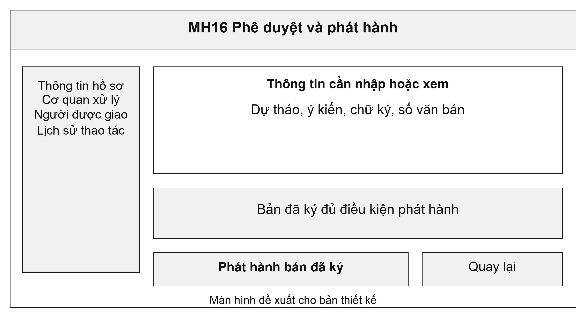
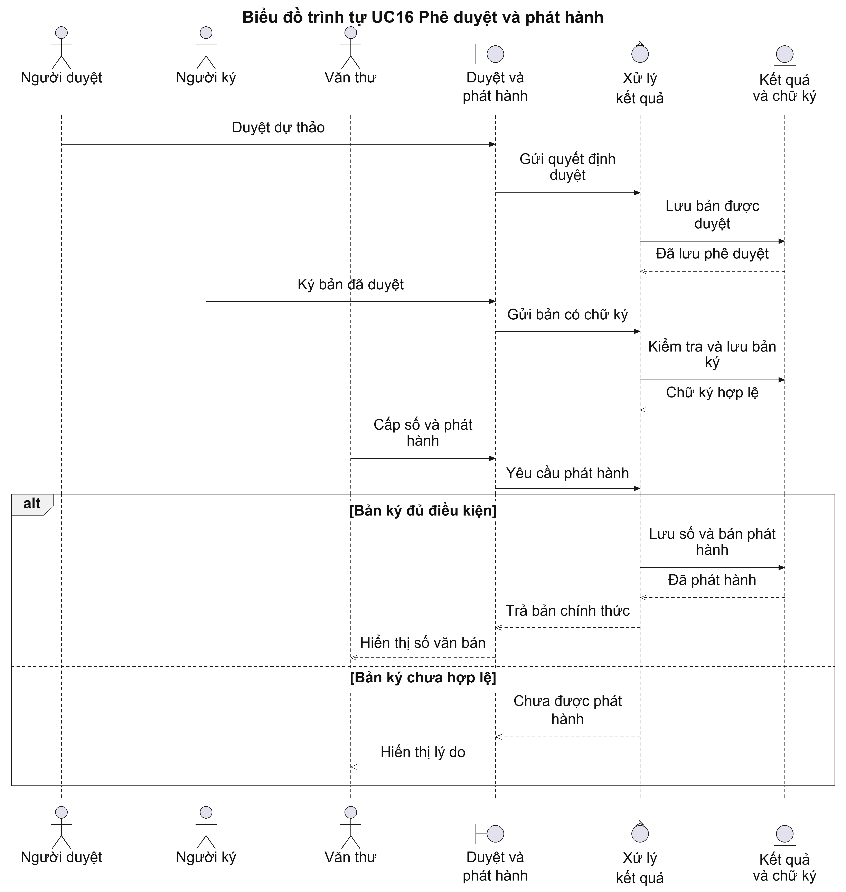
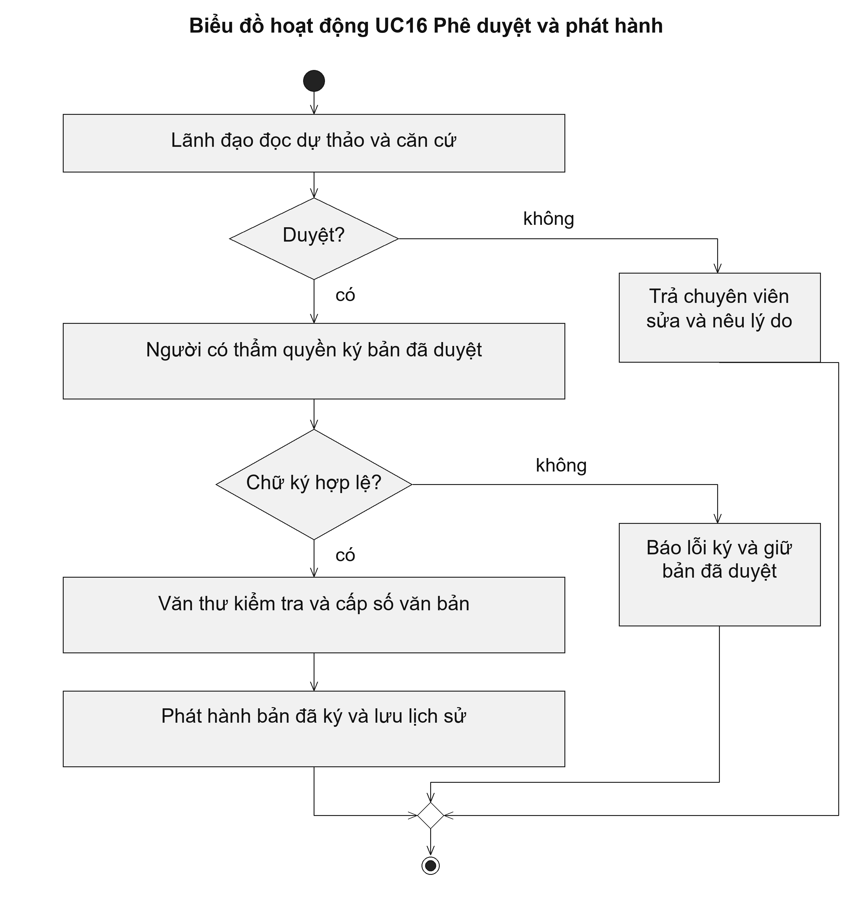

# UC16 Phê duyệt và phát hành

Phê duyệt, ký và phát hành là ba việc khác nhau. Lãnh đạo quyết định nội dung, người có thẩm quyền ký chịu trách nhiệm về bản ký, còn văn thư kiểm tra và phát hành văn bản. Sau phát hành, cán bộ trả kết quả tiếp tục thực hiện UC18 để giao kết quả và ghi nhận người nhận.

Điều kiện bắt đầu: Dự thảo đã được chuyên viên trình. Người duyệt có thẩm quyền; người ký và văn thư được giao thực hiện các bước tương ứng.

1. Lãnh đạo đọc dự thảo và căn cứ thẩm định.
2. Lãnh đạo phê duyệt hoặc trả chuyên viên chỉnh sửa.
3. Người có thẩm quyền ký bản đã được duyệt.
4. Văn thư kiểm tra chữ ký, cấp số và phát hành.
5. Hệ thống lưu bản kết quả đã phát hành và tạo thông báo trả kết quả.

Kết quả: Kết quả có bản đã ký, số văn bản và thông tin phát hành. Hồ sơ chưa được coi là đã giao cho người nộp ở bước này.

Trường hợp cần xử lý: Nếu lãnh đạo yêu cầu chỉnh sửa, dự thảo trở lại chuyên viên. Nếu chữ ký lỗi, hệ thống giữ bản đã duyệt và chưa cho phát hành. Nội dung tệp đã ký không được sửa trực tiếp.

