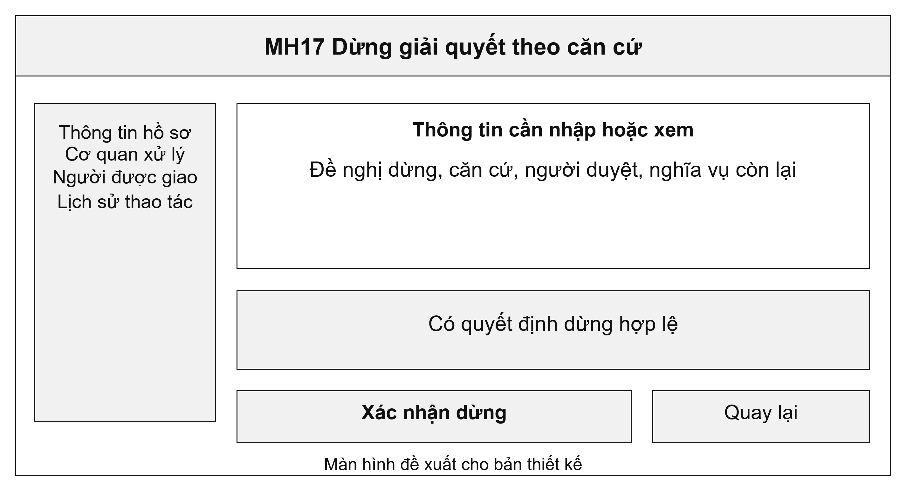
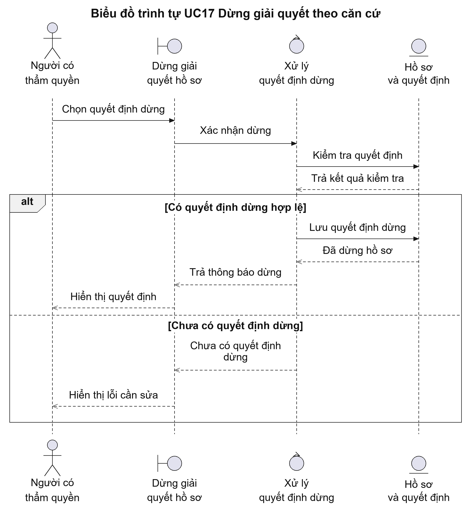
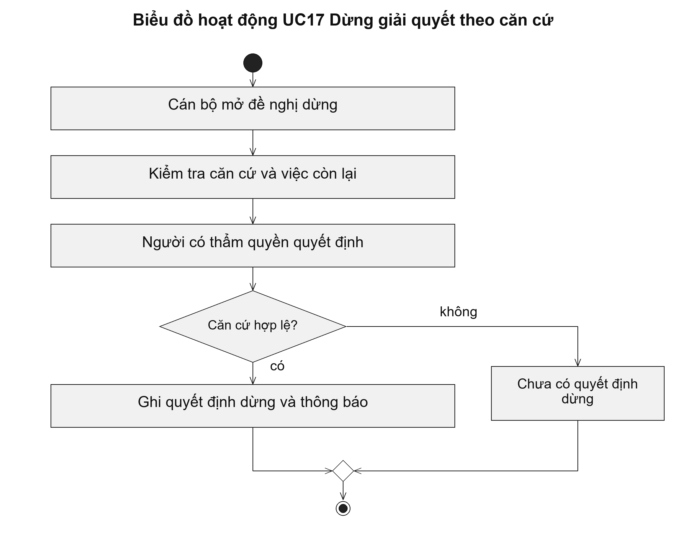

# UC17 Dừng giải quyết theo căn cứ

Dừng giải quyết cần có quyết định rõ ràng để tránh nhầm với việc người dùng thoát màn hình hoặc không tiếp tục kê khai. Hệ thống giữ lịch sử đã xử lý và chỉ dừng các công việc phù hợp với quyết định. Nếu có khoản phải hoàn, cán bộ tài chính xử lý theo UC33.

Điều kiện bắt đầu: Hồ sơ chưa kết thúc. Đề nghị dừng và người có thẩm quyền quyết định đã được xác định.

1. Cán bộ lập hoặc mở đề nghị dừng hồ sơ.
2. Người có thẩm quyền xem căn cứ và các công việc còn lại.
3. Người có thẩm quyền duyệt quyết định dừng.
4. Hệ thống cập nhật hồ sơ, gửi thông báo và chuyển xử lý khoản thu còn liên quan nếu có.

Kết quả: Hồ sơ có quyết định dừng, lý do và thời điểm dừng. Công việc xử lý tài chính còn lại được theo dõi riêng.

Trường hợp cần xử lý: Người nộp đề nghị rút hồ sơ chưa đồng nghĩa hồ sơ đã được dừng. Hồ sơ đã kết thúc không được mở lại hoặc đổi trạng thái bằng lệnh dừng thông thường.

