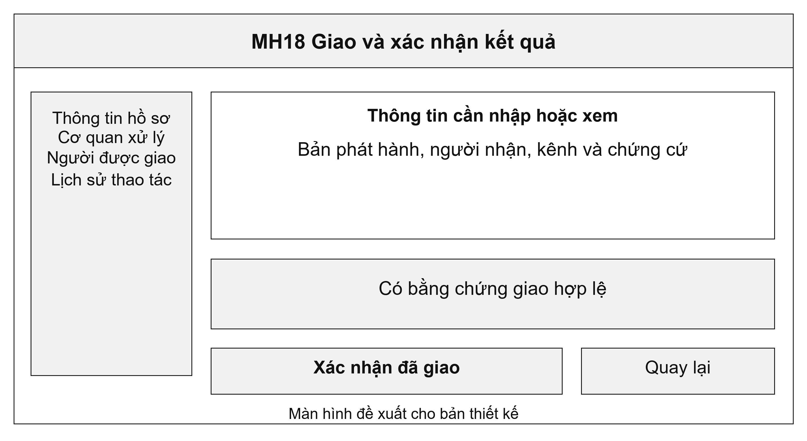
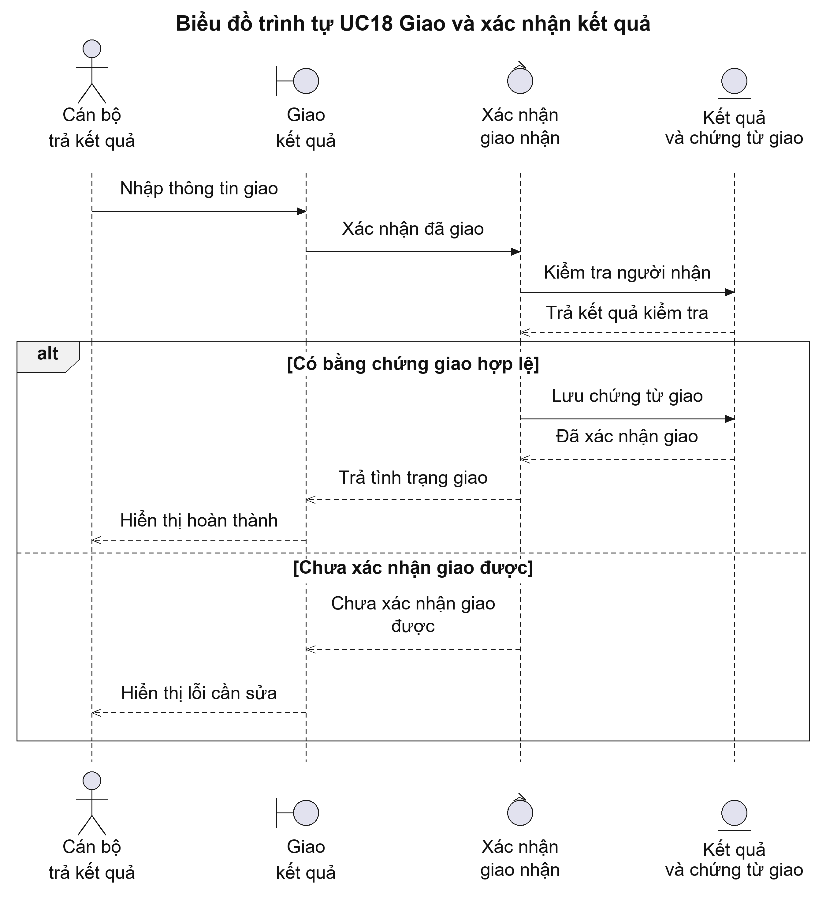
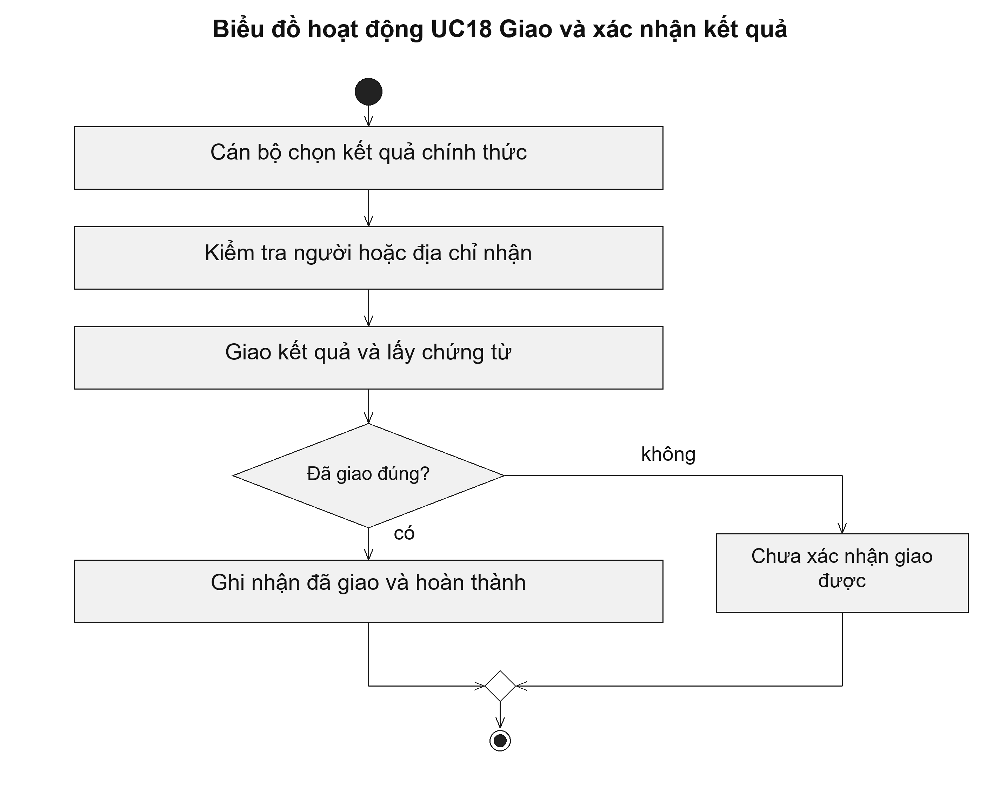

# UC18 Giao và xác nhận kết quả

Trả kết quả cần phân biệt việc thông báo với việc giao thực tế. Với bản giấy, cán bộ ghi nhận người nhận và chứng từ giao. Với bản điện tử, hệ thống ghi nhận kết quả đã được đưa đến đúng tài khoản hoặc kho được phép nhận theo quy định của kênh trả.

Điều kiện bắt đầu: Kết quả đã được phát hành. Cán bộ trả kết quả được giao xử lý và người nhận hoặc địa chỉ nhận đã được xác định.

1. Cán bộ chọn kết quả chính thức cần trả.
2. Cán bộ kiểm tra người nhận hoặc quyền nhận qua kênh điện tử.
3. Cán bộ thực hiện giao trực tiếp, qua mạng hoặc bưu chính theo thủ tục.
4. Hệ thống lưu bằng chứng giao và cập nhật việc hoàn thành.

Kết quả: Có thông tin người nhận, thời điểm và bằng chứng giao kết quả. Hồ sơ được ghi nhận hoàn thành khi đủ điều kiện.

Trường hợp cần xử lý: Nếu giao thất bại, hệ thống lưu lý do để tiếp tục xử lý. Việc gửi tin nhắn thông báo có kết quả chưa chứng minh người nộp đã nhận được kết quả.

