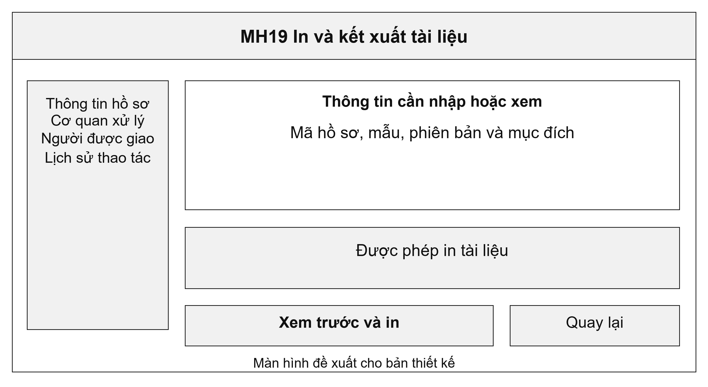
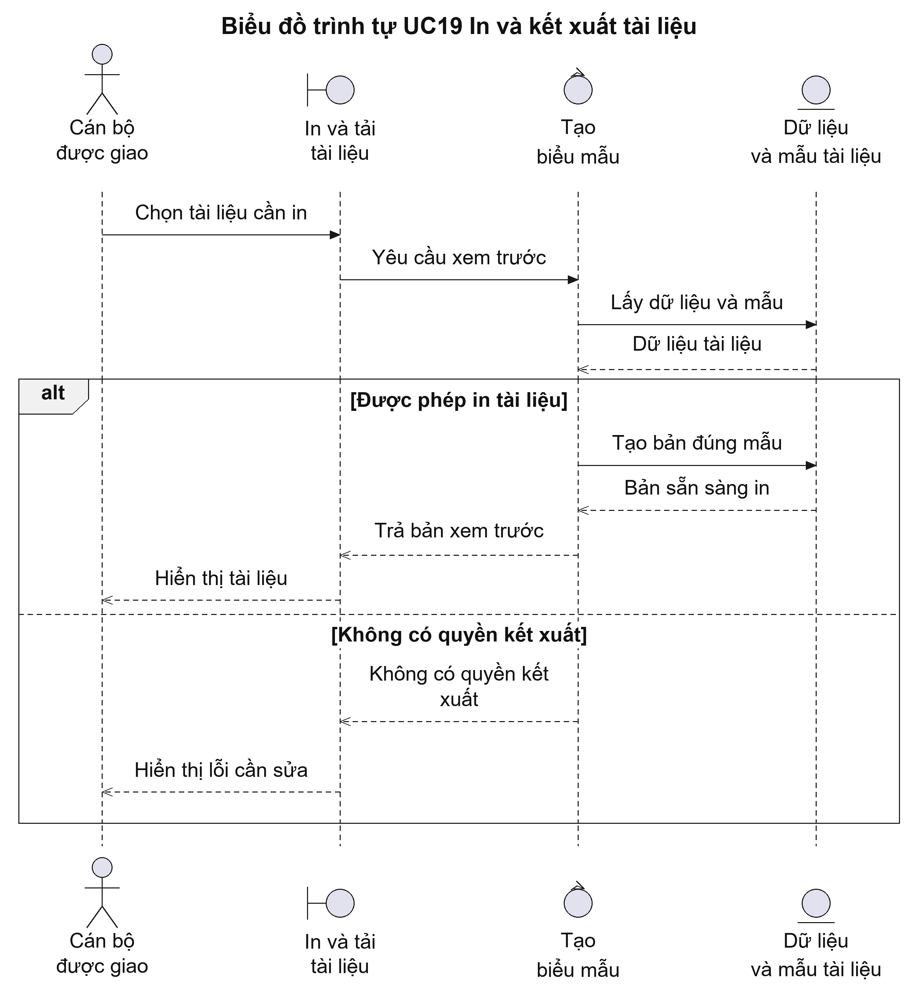
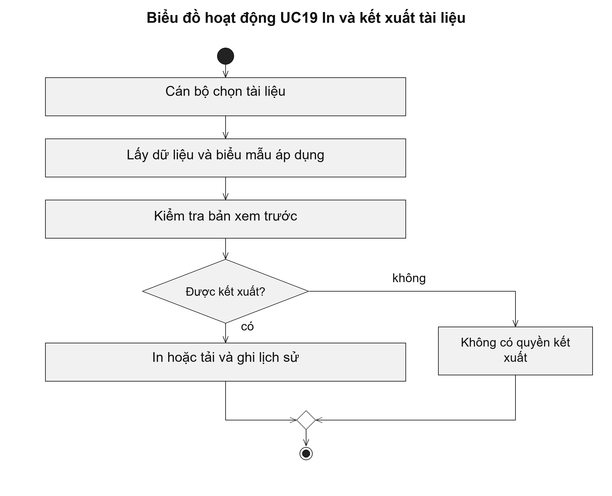

# UC19 In và kết xuất tài liệu

Chức năng in cần bảo đảm nội dung trên giấy khớp với dữ liệu của hồ sơ, gồm mã hồ sơ, người nộp và thời hạn nếu biểu mẫu có các trường này. Xem trước giúp cán bộ phát hiện thiếu nội dung hoặc lỗi bố cục trước khi giao giấy cho người dân.

Điều kiện bắt đầu: Cán bộ có quyền xem hồ sơ và quyền in hoặc tải tài liệu được chọn.

1. Cán bộ chọn giấy hẹn, phiếu hoặc kết quả cần in.
2. Hệ thống lấy dữ liệu và biểu mẫu đang áp dụng.
3. Cán bộ xem trước để kiểm tra bố cục và nội dung.
4. Cán bộ in hoặc tải tài liệu; hệ thống ghi lại việc kết xuất.

Kết quả: Tài liệu được tạo bằng đúng mẫu; hệ thống có lịch sử in hoặc tải.

Trường hợp cần xử lý: Bản dự thảo phải được phân biệt với bản đã phát hành. Người không có quyền kết xuất không được tải tài liệu qua địa chỉ trực tiếp.

