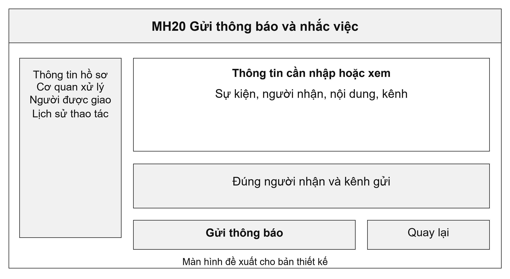
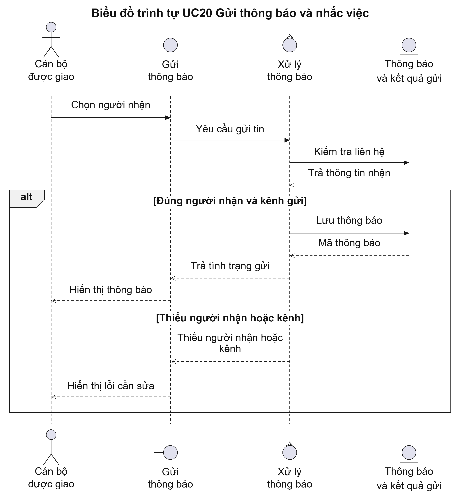
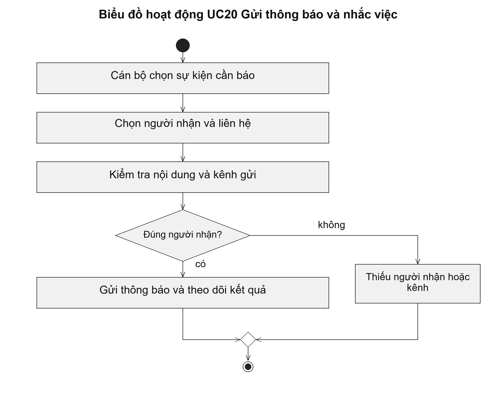

# UC20 Gửi thông báo và nhắc việc

Người nộp cần được thông báo khi hồ sơ được tiếp nhận, yêu cầu bổ sung hoặc có kết quả. Cán bộ cần được nhắc khi công việc sắp đến hạn. Nội dung thông báo nên nêu việc cần làm và cách mở hồ sơ, thay vì gửi toàn bộ dữ liệu hồ sơ qua tin nhắn.

Điều kiện bắt đầu: Người gửi hoặc tác vụ tự động được phép gửi thông báo. Người nhận và kênh liên lạc đã được xác định.

1. Cán bộ chọn sự kiện cần thông báo hoặc thiết lập lịch nhắc.
2. Hệ thống lấy người nhận và nội dung được phép gửi.
3. Hệ thống chuyển thông báo qua kênh đã được xác nhận.
4. Cán bộ theo dõi thông báo đã gửi được hay cần gửi lại.

Kết quả: Thông báo có người nhận, thời điểm gửi và kết quả gửi; lỗi gửi được theo dõi để xử lý tiếp.

Trường hợp cần xử lý: Tin nhắn không chứa nội dung hồ sơ cần bảo vệ. Khi gửi lại, hệ thống giữ mã thông báo để tránh tạo nhiều thông báo cho cùng một sự kiện.

