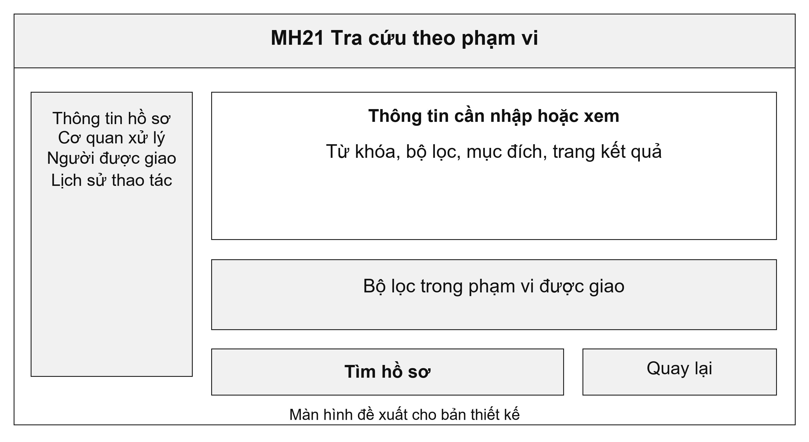
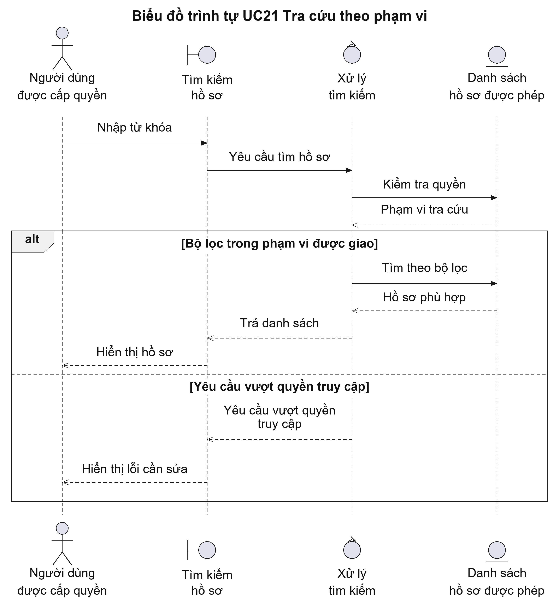
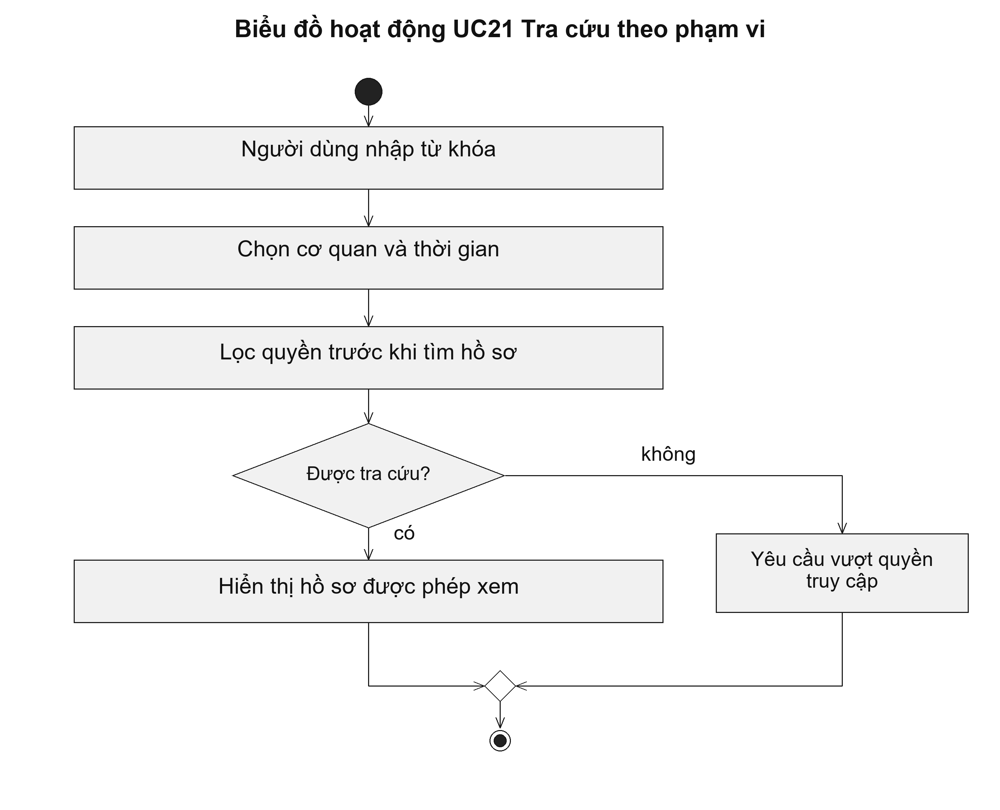

# UC21 Tra cứu theo phạm vi

Tra cứu hồ sơ phải kiểm tra quyền ngay khi lấy dữ liệu. Nếu chỉ ẩn dòng trên màn hình sau khi đã tải dữ liệu, người dùng vẫn có thể đọc thông tin không thuộc quyền của mình. Vì vậy, cả danh sách, tổng số kết quả và tệp tải về phải dùng cùng phạm vi được phép xem.

Điều kiện bắt đầu: Người dùng đã đăng nhập và được xác định quyền xem hồ sơ theo cơ quan hoặc quan hệ với hồ sơ.

1. Người dùng nhập mã hồ sơ, tên hoặc từ khóa.
2. Người dùng chọn bộ lọc về thời gian, thủ tục và cơ quan trong phạm vi được giao.
3. Hệ thống lọc quyền trước khi tìm và tính số kết quả.
4. Người dùng mở hồ sơ hoặc tải danh sách khi có quyền tương ứng.

Kết quả: Danh sách trả về chỉ gồm hồ sơ người dùng được phép xem. Việc tìm kiếm không sửa hồ sơ.

Trường hợp cần xử lý: Hệ thống không để số lượng kết quả hoặc gợi ý từ khóa làm lộ hồ sơ ngoài quyền truy cập. Không có kết quả phù hợp được thông báo rõ ràng.

