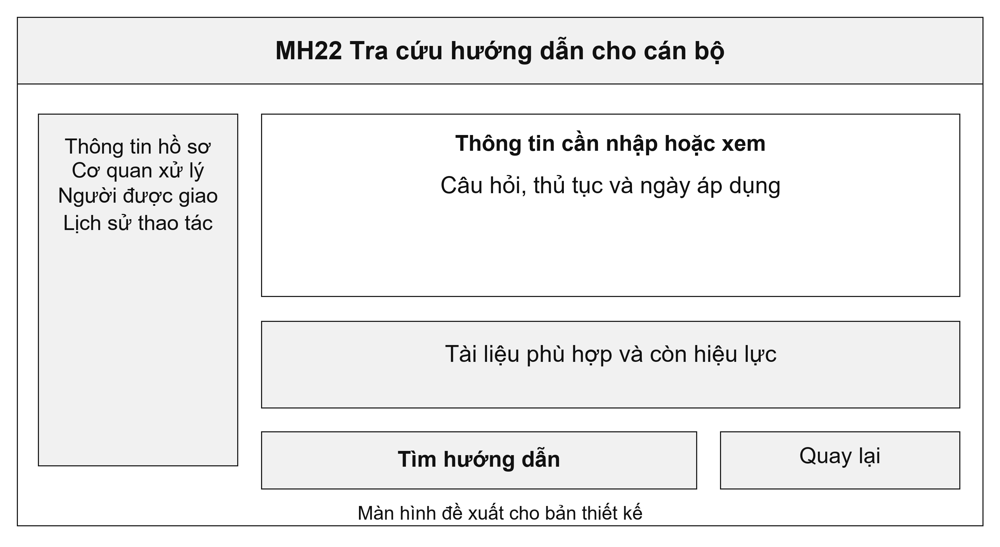
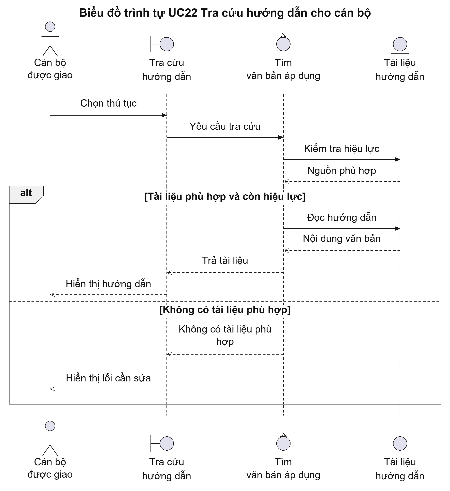
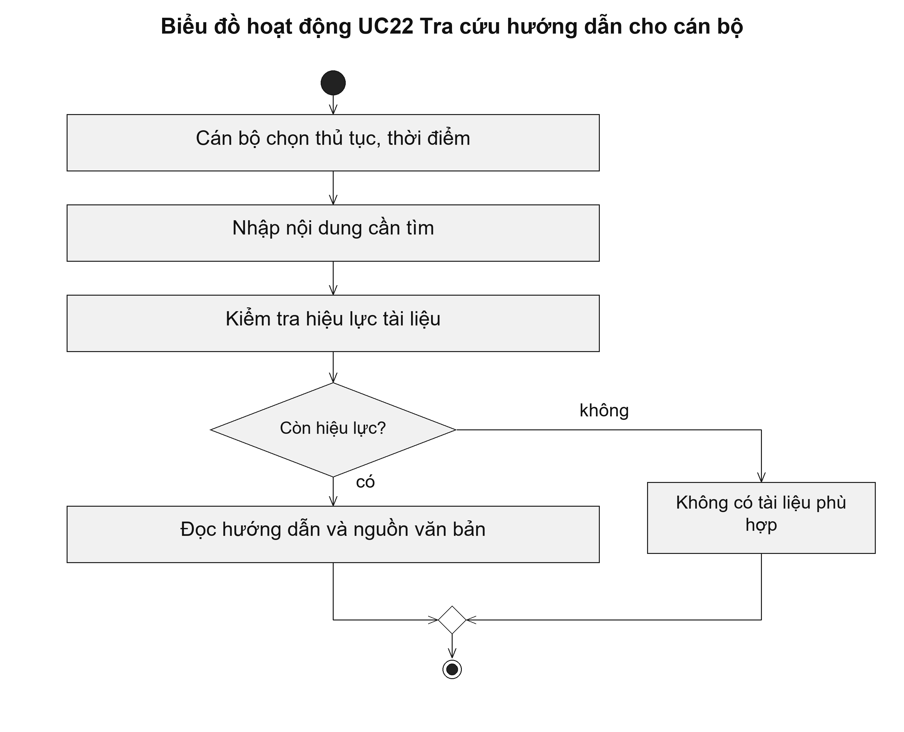

# UC22 Tra cứu hướng dẫn cho cán bộ

Hướng dẫn hỗ trợ cán bộ hiểu cách xử lý, nhưng không thay cho việc đọc văn bản áp dụng. Khi quy định thay đổi, hệ thống cần giữ tài liệu cũ để giải thích cách xử lý hồ sơ ở thời điểm trước, đồng thời chỉ rõ tài liệu nào đang được sử dụng.

Điều kiện bắt đầu: Cán bộ có quyền tra cứu tài liệu; tài liệu có nguồn và ngày bắt đầu áp dụng được xác định.

1. Cán bộ chọn thủ tục và ngày áp dụng cần tra cứu.
2. Cán bộ nhập nội dung cần tìm.
3. Hệ thống tìm tài liệu phù hợp và hiển thị nguồn, thời gian áp dụng.
4. Cán bộ đọc văn bản và đối chiếu trước khi quyết định xử lý hồ sơ.

Kết quả: Cán bộ nhận được tài liệu phù hợp với thủ tục và thời điểm cần tra cứu.

Trường hợp cần xử lý: Tài liệu hết hiệu lực phải có cảnh báo và liên kết tới tài liệu thay thế khi đã xác định. Kết quả tra cứu không tự phê duyệt hoặc từ chối hồ sơ.

