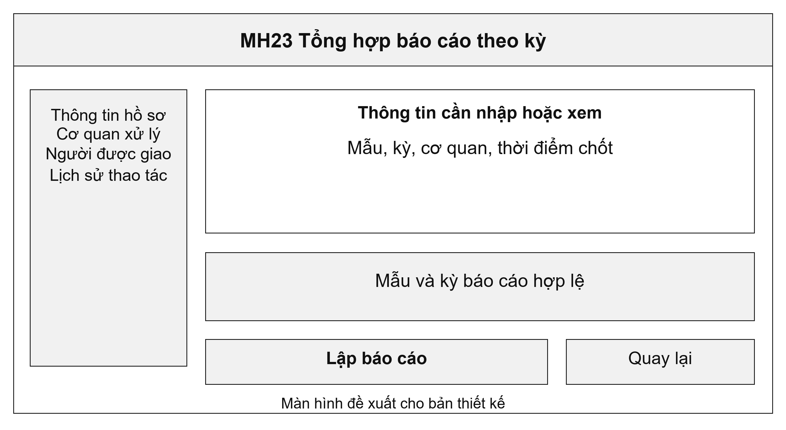
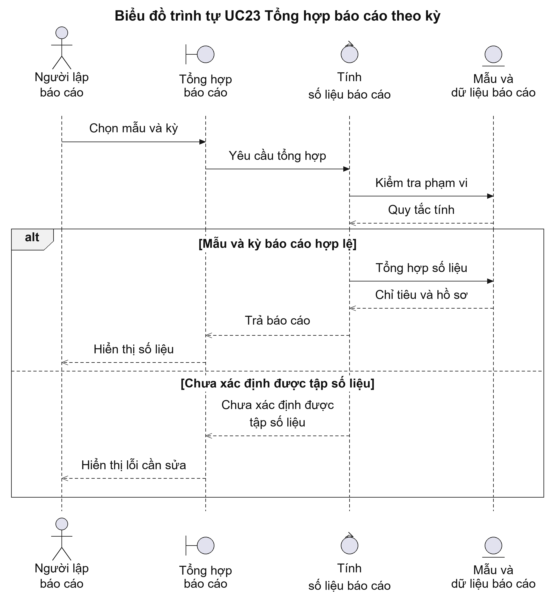
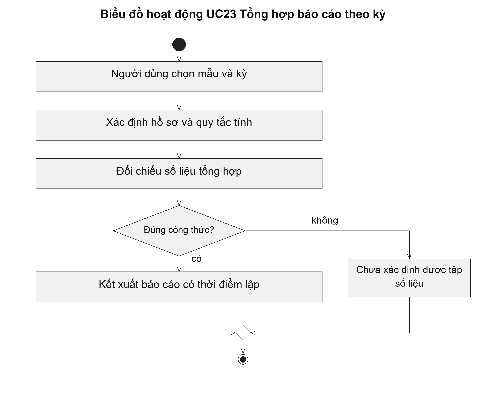

# UC23 Tổng hợp báo cáo theo kỳ

Một báo cáo cần giải thích được số liệu lấy từ những hồ sơ nào. Chẳng hạn, số hồ sơ đã giải quyết trong tháng phải dựa trên mốc hoàn thành của cùng kỳ và cùng phạm vi cơ quan. Người kiểm tra báo cáo cần mở được danh sách hồ sơ góp vào từng chỉ tiêu để đối chiếu khi phát hiện chênh lệch.

Điều kiện bắt đầu: Người lập báo cáo có quyền xem số liệu của cơ quan. Mẫu và kỳ báo cáo đã được xác định.

1. Người dùng chọn mẫu báo cáo và kỳ số liệu.
2. Hệ thống xác định tập hồ sơ, thời điểm lấy số liệu và quy tắc tính.
3. Hệ thống tổng hợp; người dùng kiểm tra các tổng và hồ sơ tạo nên số liệu.
4. Người dùng kết xuất báo cáo có thời điểm lập và phạm vi cơ quan.

Kết quả: Báo cáo có mẫu, kỳ, phạm vi và thời điểm lấy số liệu rõ ràng; hồ sơ nguồn không bị sửa.

Trường hợp cần xử lý: Hồ sơ liên thông xuất hiện ở nhiều hệ thống phải được nhận diện để không đếm trùng. Không cộng các số liệu khác kỳ hoặc khác cách tính.

