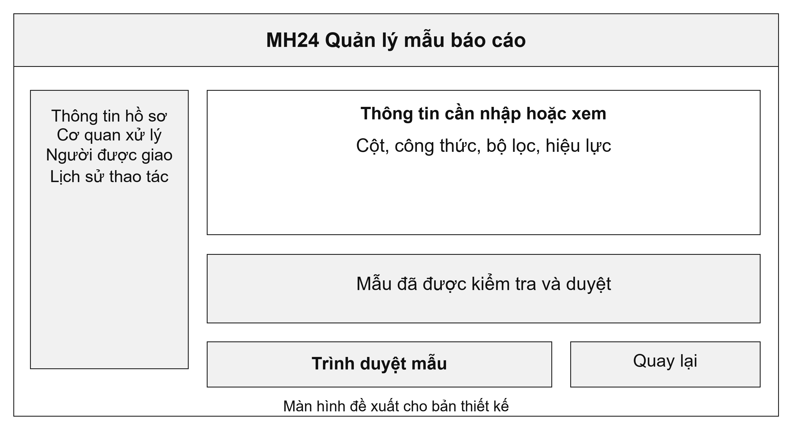
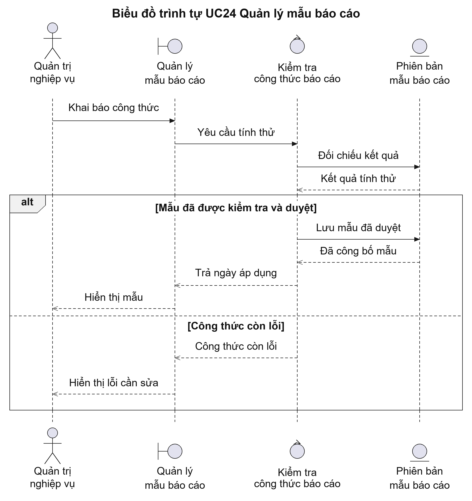
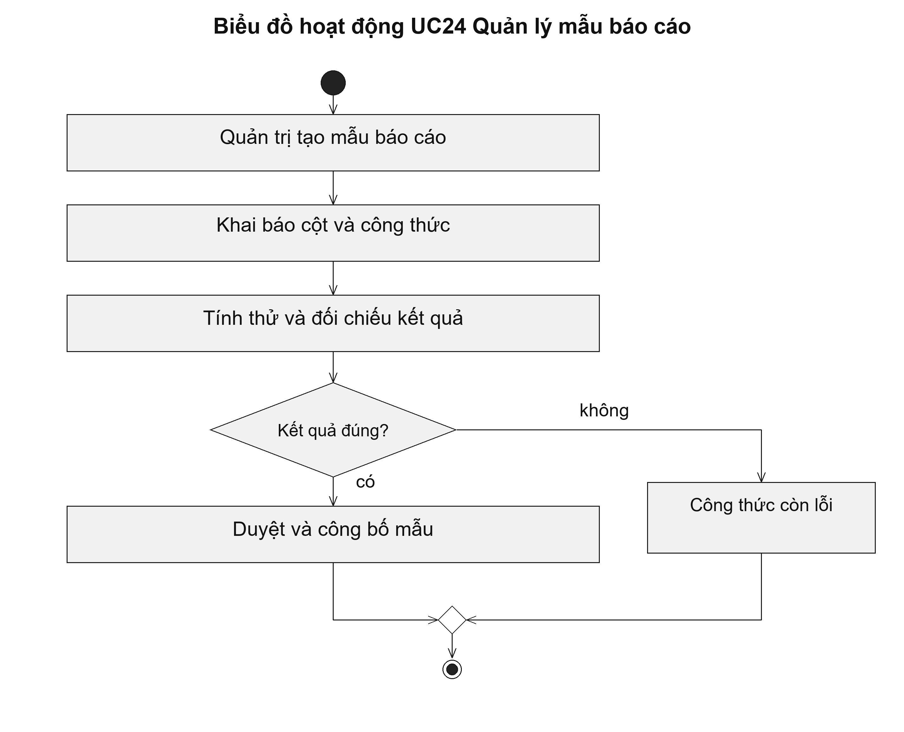

# UC24 Quản lý mẫu báo cáo

Mẫu báo cáo phải quy định rõ cách tính từng chỉ tiêu. Ví dụ, mẫu cần xác định hồ sơ đã rút có được đưa vào tổng số tiếp nhận hay không. Khi cách tính thay đổi, việc lưu phiên bản giúp người đọc hiểu vì sao hai báo cáo của các thời kỳ có số liệu khác nhau.

Điều kiện bắt đầu: Người quản trị được giao thiết lập báo cáo; người phê duyệt mẫu đã được xác định.

1. Người quản trị tạo bản nháp mẫu báo cáo.
2. Người quản trị khai báo cột, công thức, bộ lọc và thời gian áp dụng.
3. Hệ thống tính thử bằng dữ liệu đã biết để người quản trị đối chiếu.
4. Người có thẩm quyền duyệt mẫu; hệ thống công bố mẫu từ ngày áp dụng.

Kết quả: Mẫu được công bố với công thức và thời gian áp dụng. Các báo cáo đã chốt giữ mẫu đã sử dụng.

Trường hợp cần xử lý: Nếu công thức tính thử cho kết quả sai, mẫu chưa được công bố. Sửa công thức phải tạo phiên bản mới, không làm thay đổi báo cáo đã lập trước đó.

