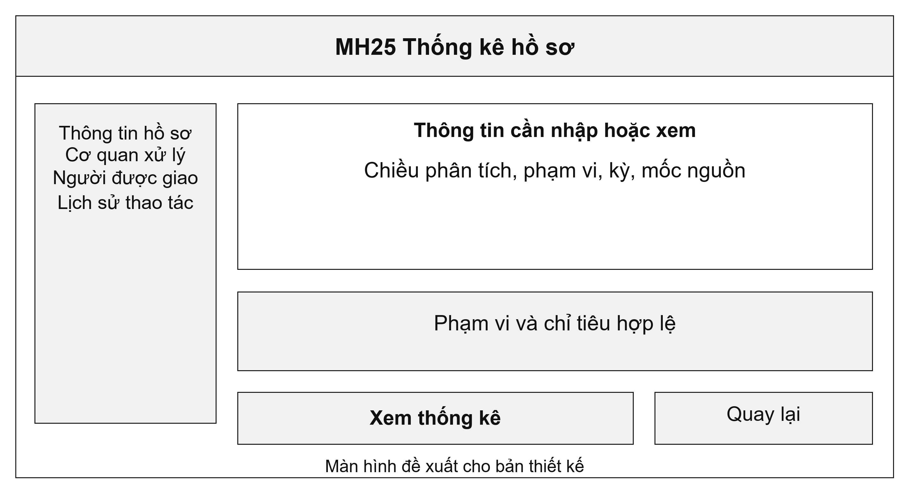
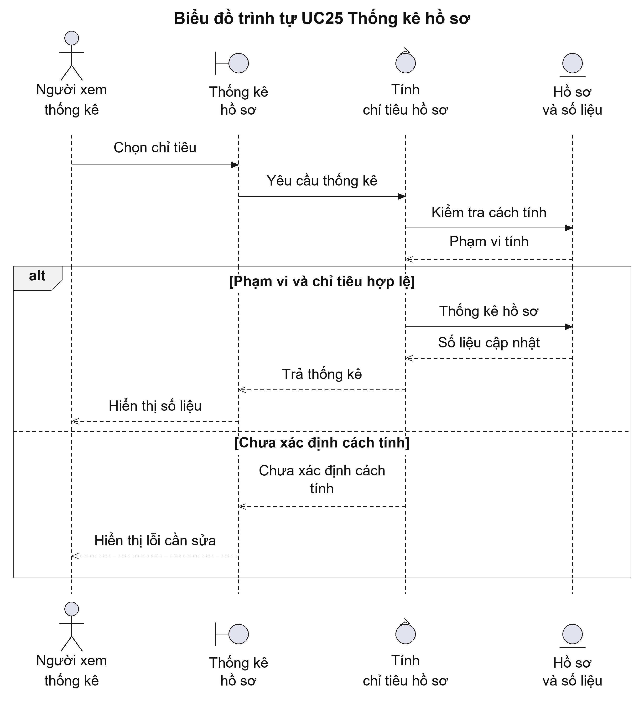
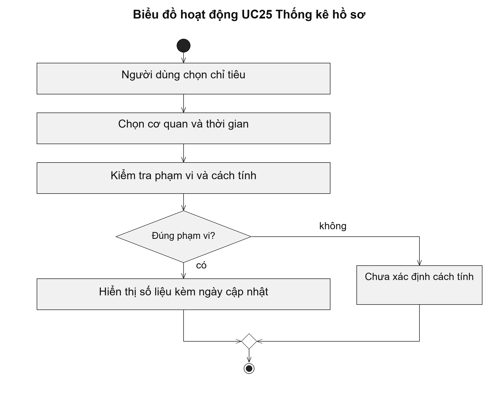

# UC25 Thống kê hồ sơ

Thống kê hỗ trợ theo dõi tình hình xử lý nhưng cần có cách tính thống nhất. Tỷ lệ đúng hạn phải nêu rõ tập hồ sơ dùng làm mẫu số và các trường hợp được loại trừ. Hệ thống cũng cần tách số hồ sơ phải bổ sung khỏi tổng số lần bổ sung để người đọc không nhầm hai chỉ tiêu.

Điều kiện bắt đầu: Người dùng được xem số liệu trong phạm vi thống kê và biết cách tính chỉ tiêu được chọn.

1. Người dùng chọn chỉ tiêu cần xem.
2. Người dùng chọn cơ quan, thủ tục và khoảng thời gian.
3. Hệ thống tính theo quy tắc của chỉ tiêu và ghi thời điểm cập nhật.
4. Người dùng xem biểu đồ, bảng số liệu và danh sách hồ sơ để đối chiếu.

Kết quả: Số liệu có phạm vi, kỳ và thời điểm cập nhật rõ ràng; người dùng mở được hồ sơ tạo nên kết quả.

Trường hợp cần xử lý: Nếu dữ liệu chưa đồng bộ đủ, hệ thống cảnh báo số liệu có thể chậm cập nhật. Lỗi đồng bộ không được dùng để kết luận hồ sơ chưa hoàn thành.

