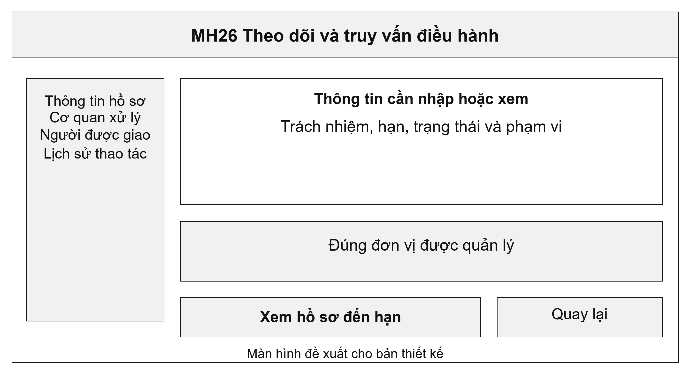
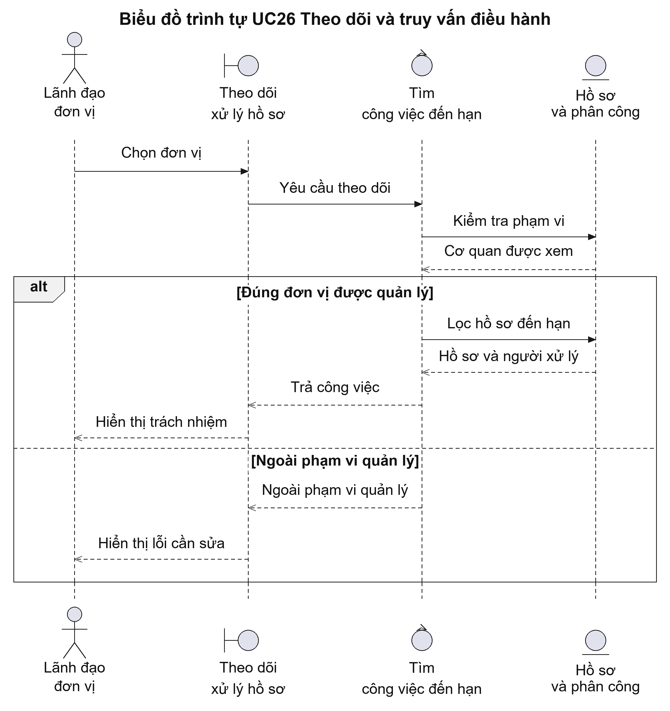
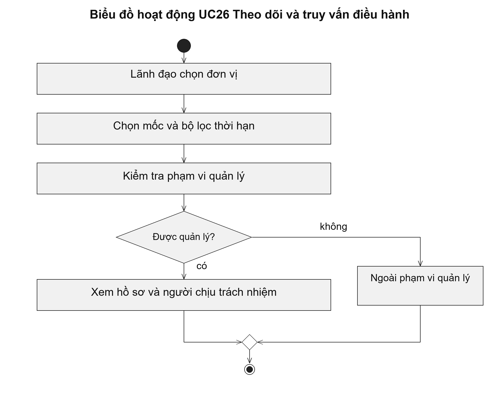

# UC26 Theo dõi và truy vấn điều hành

Màn hình điều hành nên giúp lãnh đạo tìm công việc cần can thiệp, thay vì chỉ hiển thị tổng số hồ sơ. Từng dòng cần cho biết thủ tục, hạn xử lý, người đang được giao và bước hiện tại. Chỉ đạo phát sinh từ việc theo dõi này được ghi riêng tại UC27.

Điều kiện bắt đầu: Lãnh đạo có quyền xem tình hình xử lý của đơn vị được giao quản lý.

1. Lãnh đạo chọn cơ quan và thời điểm cần theo dõi.
2. Hệ thống lọc hồ sơ sắp đến hạn hoặc quá hạn theo quy tắc của từng thủ tục.
3. Lãnh đạo xem người được giao và lý do chậm xử lý.
4. Lãnh đạo mở chức năng chỉ đạo khi cần giao việc hoặc yêu cầu giải trình.

Kết quả: Lãnh đạo xem được danh sách cần theo dõi. Việc tra cứu không tự chuyển bước hoặc thay đổi thời hạn hồ sơ.

Trường hợp cần xử lý: Cảnh báo quá hạn chỉ phản ánh kết quả tính thời gian. Cảnh báo không tự dừng thời hạn, không tự kết luận trách nhiệm và không thay quyết định xử lý.

