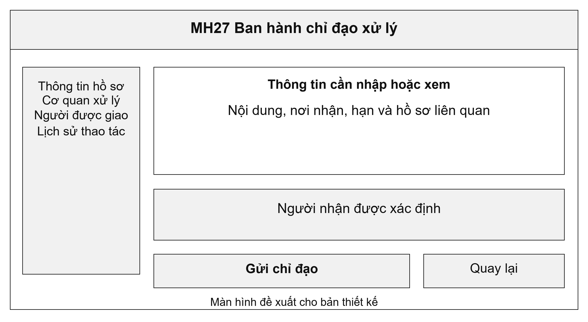
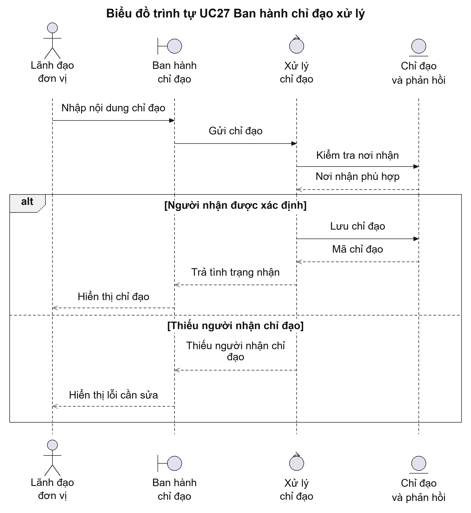
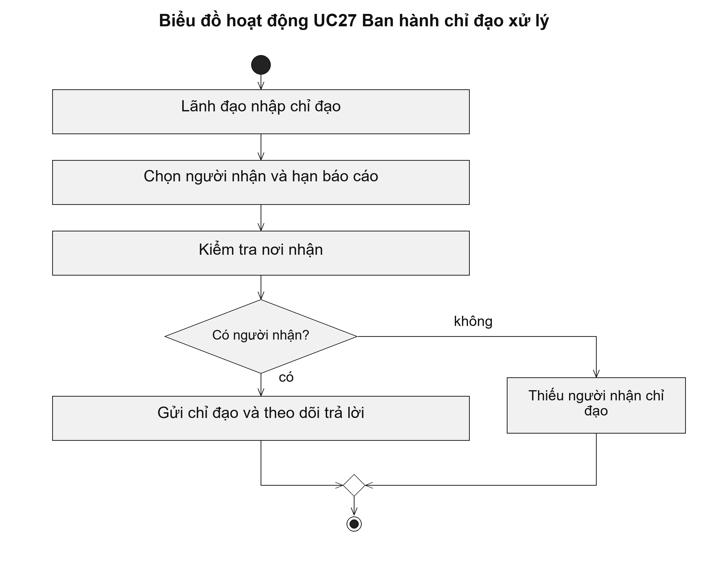

# UC27 Ban hành chỉ đạo xử lý

Chỉ đạo cần nêu việc phải làm, người chịu trách nhiệm và thời hạn trả lời. Chẳng hạn, lãnh đạo có thể yêu cầu chuyên viên làm rõ nguyên nhân hồ sơ chậm xử lý. Việc thực hiện chỉ đạo được theo dõi riêng, còn quyết định giải quyết hồ sơ vẫn tuân theo quy trình của thủ tục.

Điều kiện bắt đầu: Người chỉ đạo có quyền tại cơ quan; cán bộ nhận chỉ đạo và hồ sơ liên quan đã được xác định.

1. Lãnh đạo nhập nội dung chỉ đạo.
2. Lãnh đạo chọn người nhận, hồ sơ liên quan và hạn báo cáo.
3. Hệ thống gửi chỉ đạo và ghi nhận việc tiếp nhận.
4. Lãnh đạo theo dõi phản hồi, yêu cầu làm rõ hoặc xác nhận đã hoàn thành.

Kết quả: Chỉ đạo có người giao, người nhận, thời hạn và lịch sử phản hồi để theo dõi thực hiện.

Trường hợp cần xử lý: Chỉ đạo không cho phép cán bộ bỏ qua điều kiện của thủ tục hoặc thay người có thẩm quyền ký quyết định.

