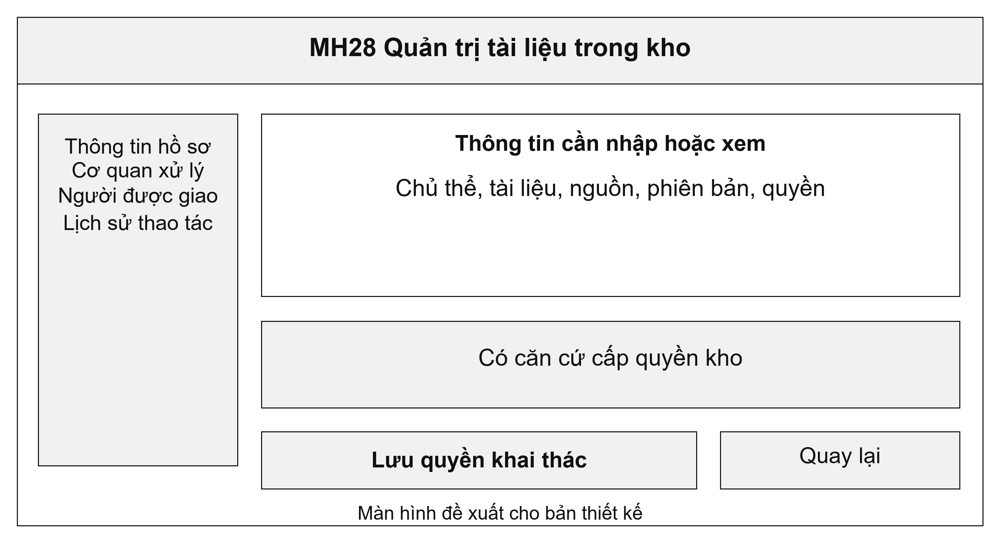
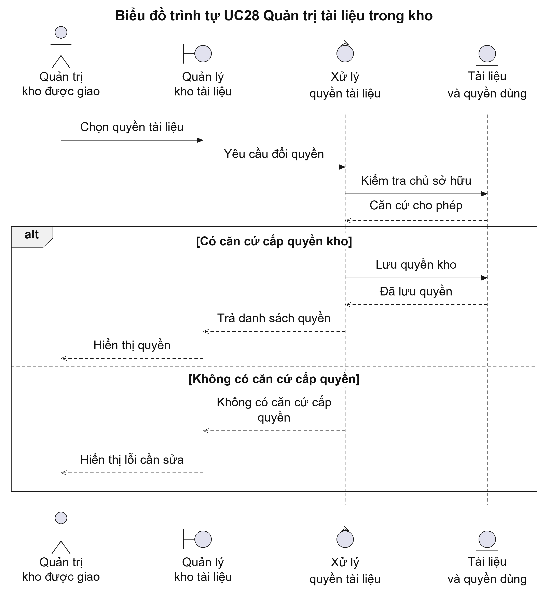
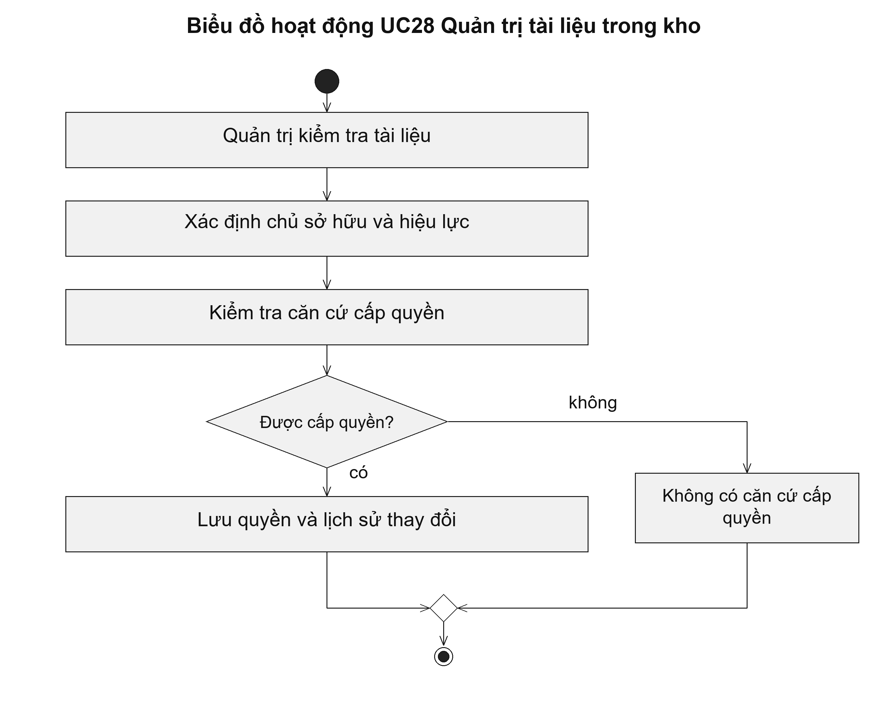

# UC28 Quản trị tài liệu trong kho

Kho tài liệu cần quản lý cả nội dung và quyền sử dụng. Người dùng có thể được phép đọc một tài liệu nhưng chưa được phép dùng tài liệu đó để nộp thay cho người khác. Thiết kế phải kiểm tra quyền theo từng tài liệu và giữ lại nguồn để cán bộ đối chiếu khi cần.

Điều kiện bắt đầu: Người quản trị kho được giao trách nhiệm; chủ sở hữu, nguồn tài liệu và thời hạn bảo quản đã được xác định.

1. Người quản trị kiểm tra nguồn và chủ sở hữu tài liệu.
2. Người quản trị phân loại, ghi thời gian áp dụng và thời hạn bảo quản.
3. Người có quyền cho phép hoặc thu hồi quyền khai thác.
4. Hệ thống ghi lịch sử quyền và giữ thông tin các phiên bản tài liệu.

Kết quả: Tài liệu có thông tin nguồn, chủ sở hữu và quyền sử dụng rõ ràng; các thay đổi quyền có lịch sử.

Trường hợp cần xử lý: Quản trị máy chủ không tự có quyền đọc toàn bộ kho tài liệu của công dân. Khi quyền bị thu hồi, tài liệu không được tiếp tục cung cấp cho người dùng đó.

