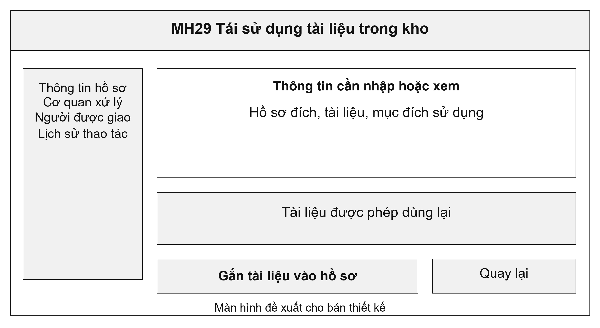
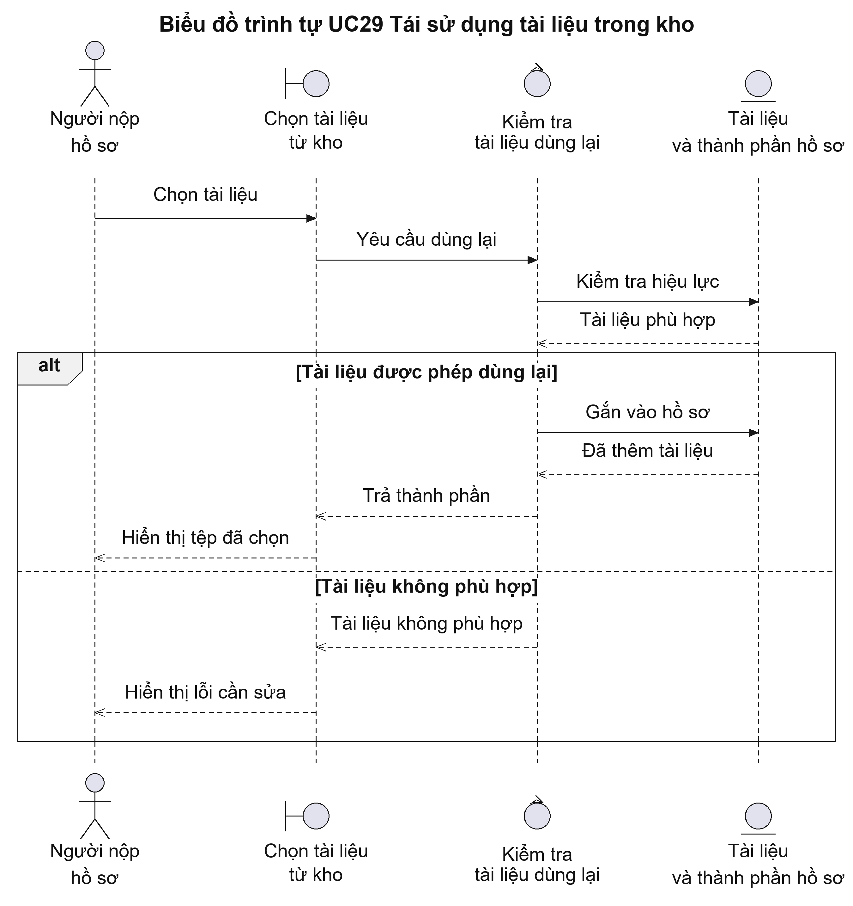
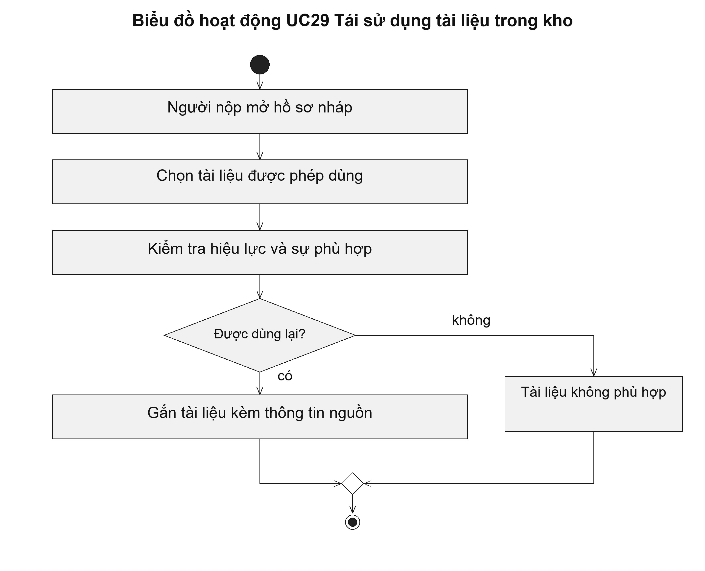

# UC29 Tái sử dụng tài liệu trong kho

Tái sử dụng giúp người dân không phải nộp lại tài liệu mà hệ thống đã có và được phép khai thác. Tuy nhiên, việc tài liệu nằm trong kho chưa chứng minh tài liệu đó đáp ứng mọi thủ tục. Hệ thống cần kiểm tra loại giấy tờ, người sở hữu và thời gian áp dụng trước khi gắn vào hồ sơ mới.

Điều kiện bắt đầu: Người nộp có quyền sử dụng tài liệu; tài liệu còn phù hợp với yêu cầu của thủ tục và hồ sơ đang kê khai.

1. Người nộp mở hồ sơ đang kê khai.
2. Người nộp chọn tài liệu được phép dùng trong kho.
3. Hệ thống kiểm tra người sở hữu, hiệu lực và yêu cầu thành phần hồ sơ.
4. Hệ thống gắn tài liệu vào hồ sơ và giữ thông tin nguồn.

Kết quả: Hồ sơ có thành phần lấy từ kho; tài liệu gốc và thông tin nguồn không bị sửa.

Trường hợp cần xử lý: Tài liệu đã hết hiệu lực, bị thay thế hoặc bị thu hồi quyền phải được báo để người nộp chọn tài liệu khác. Cán bộ vẫn kiểm tra sự phù hợp khi tiếp nhận hồ sơ.

