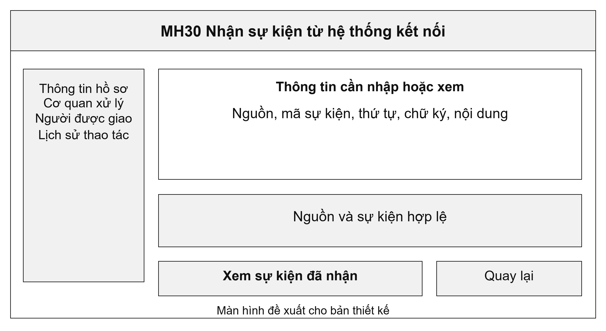
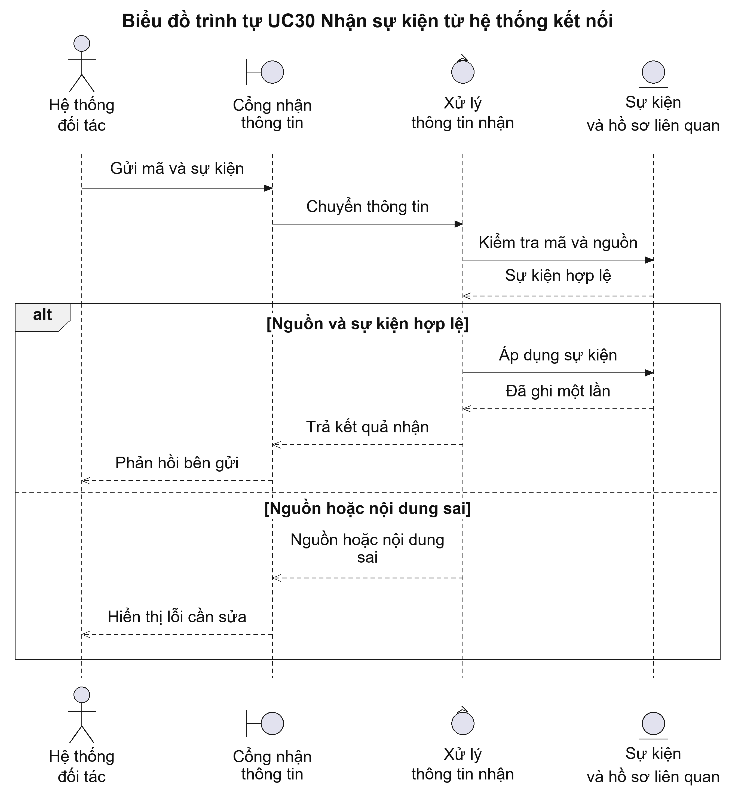
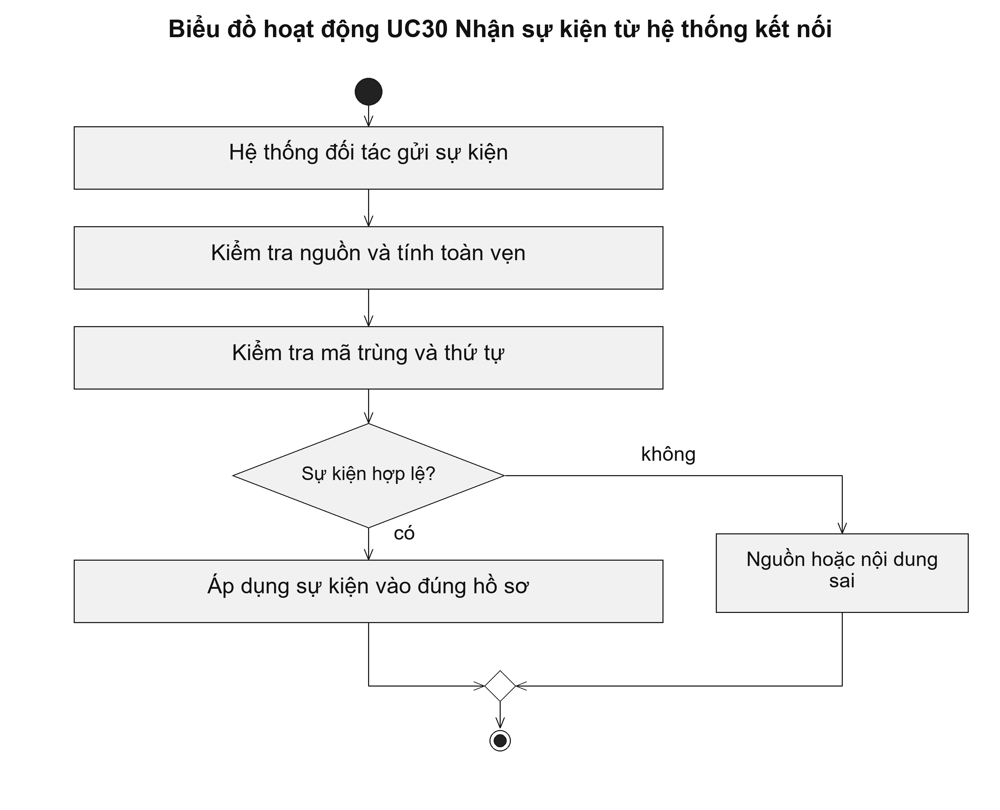

# UC30 Nhận sự kiện từ hệ thống kết nối

Trong kết nối giữa các hệ thống, một thông báo có thể được gửi lại nhiều lần khi bên gửi chưa nhận được phản hồi. Hệ thống cần nhận diện mã thông báo để cập nhật một lần. Bên vận hành cũng phải tra cứu được thông tin đã nhận, đã áp dụng hay đang chờ đối chiếu.

Điều kiện bắt đầu: Hệ thống gửi đã được cho phép kết nối; định dạng thông tin, cách xác thực và quy tắc thứ tự đã được thống nhất.

1. Hệ thống đối tác gửi thông tin cùng mã hồ sơ và mã sự kiện.
2. Hệ thống tiếp nhận kiểm tra danh tính nguồn và tính toàn vẹn dữ liệu.
3. Hệ thống kiểm tra mã đã nhận và thứ tự cập nhật.
4. Thông tin hợp lệ được áp dụng vào hồ sơ; thông tin cần đối chiếu được giữ riêng để xử lý.

Kết quả: Thông tin hợp lệ được ghi một lần, gắn đúng hồ sơ và có kết quả phản hồi cho bên gửi.

Trường hợp cần xử lý: Cùng mã sự kiện nhưng nội dung khác phải được giữ riêng để kiểm tra. Thông tin gửi đến muộn không được làm hồ sơ quay về một trạng thái cũ.

