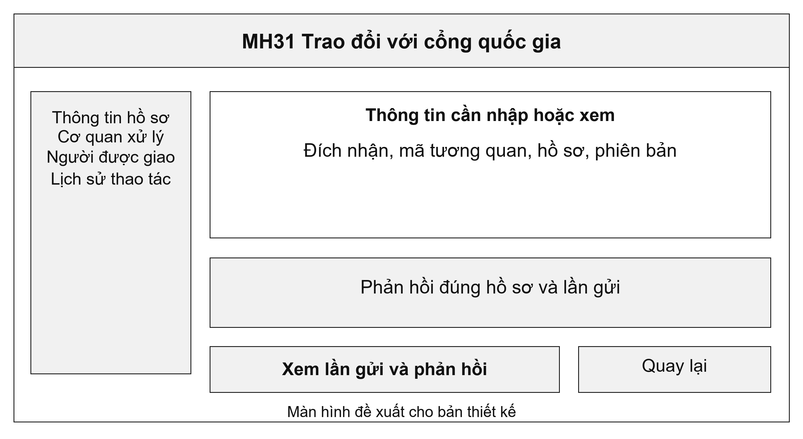
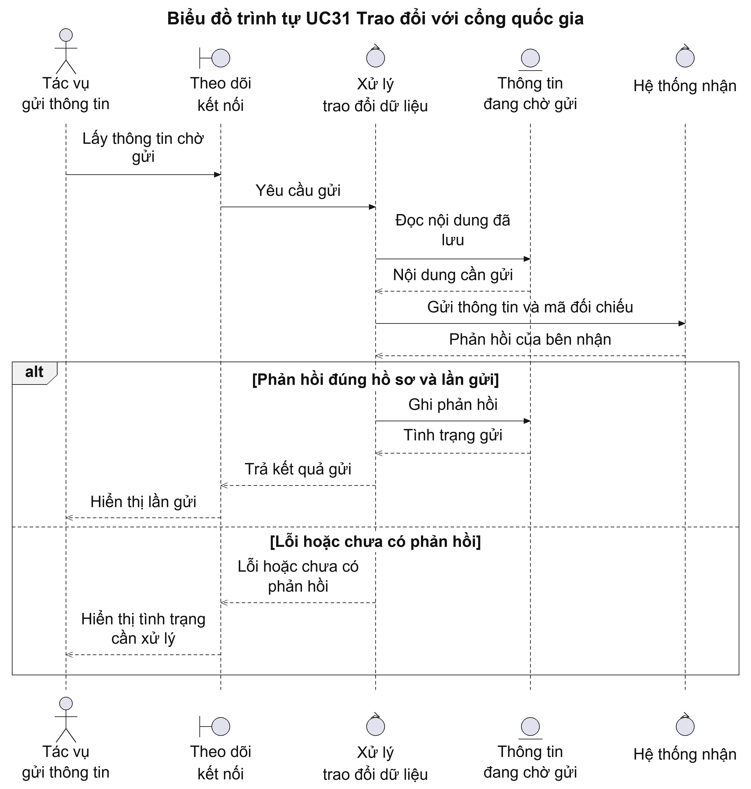
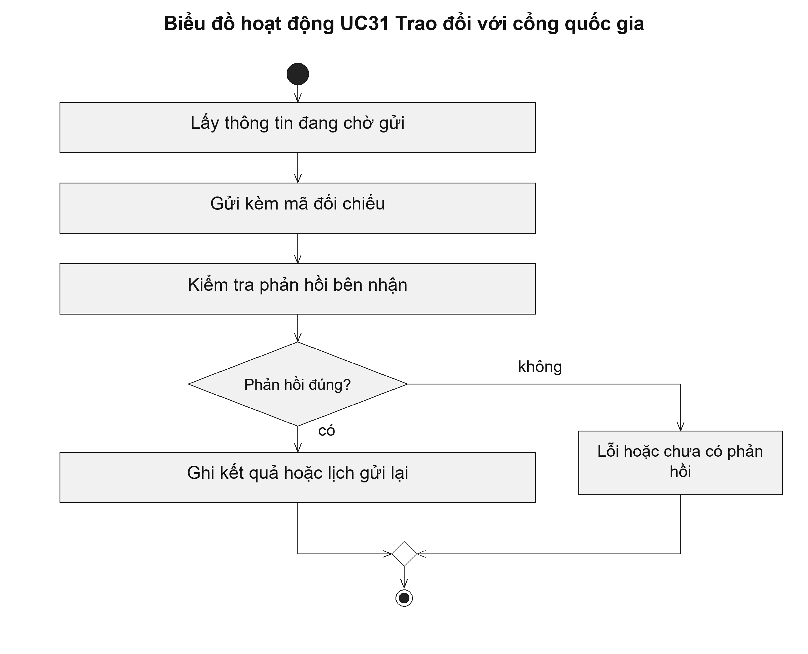

# UC31 Trao đổi với cổng quốc gia

Thông tin hồ sơ được gửi ra ngoài sau khi đã lưu thành công tại hệ thống xử lý. Cách thực hiện này giúp tránh việc bên nhận thấy một bước xử lý mà hệ thống nguồn chưa lưu được. Gửi thành công và bên nhận đã cập nhật là hai mốc cần được theo dõi riêng.

Điều kiện bắt đầu: Thông tin cần gửi đã được lưu sau một bước xử lý hợp lệ; kết nối và cơ quan nhận đã được xác định.

1. Tác vụ gửi lấy thông tin đang chờ trao đổi.
2. Hệ thống gửi thông tin kèm mã dùng để đối chiếu phản hồi.
3. Hệ thống đọc phản hồi và kiểm tra đúng hồ sơ, đúng lần gửi.
4. Hệ thống ghi nhận kết quả; nếu lỗi, lập lịch gửi lại theo quy tắc đã thống nhất.

Kết quả: Mỗi thông tin có tình trạng gửi và phản hồi rõ ràng để cán bộ vận hành theo dõi.

Trường hợp cần xử lý: Chưa nhận được phản hồi không được coi là bên nhận đã áp dụng thông tin. Khi gửi lại, hệ thống giữ mã đối chiếu và không tạo thêm hồ sơ mới.

