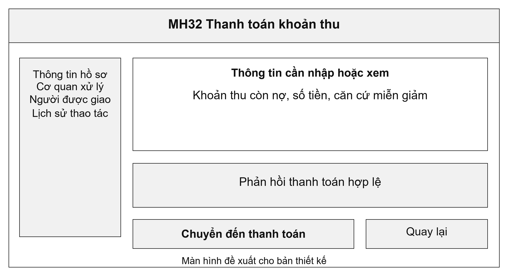
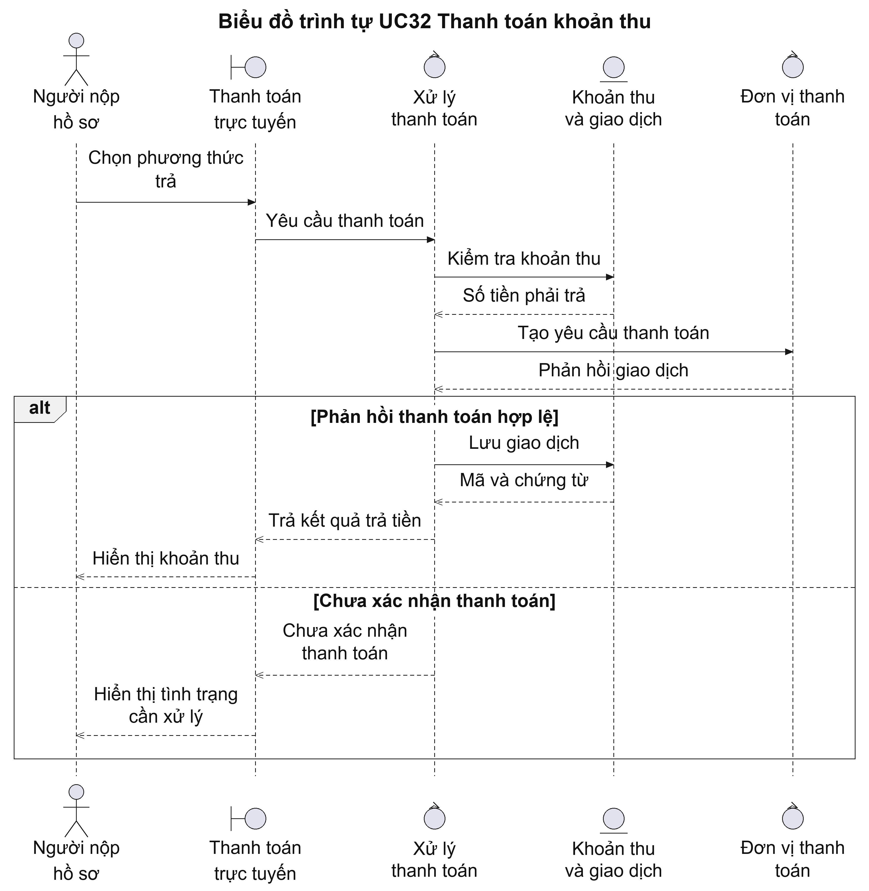
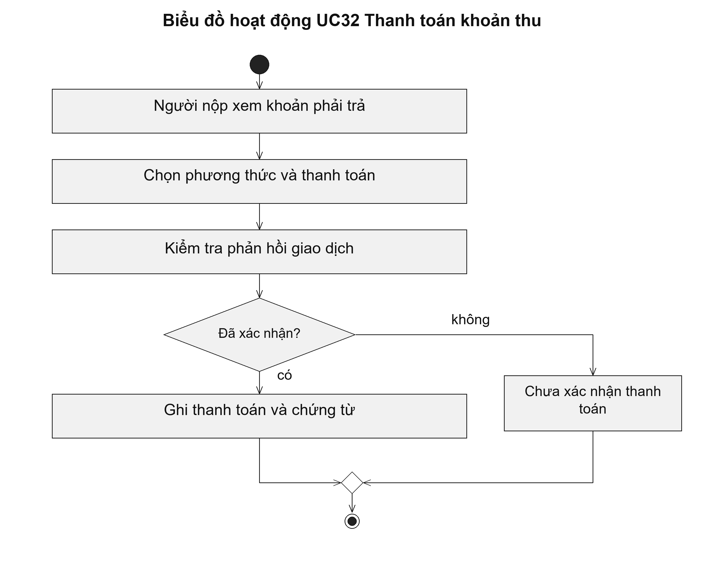

# UC32 Thanh toán khoản thu

Người nộp cần biết phải trả khoản nào, số tiền bao nhiêu và căn cứ miễn, giảm nếu có. Sau khi chuyển sang bên thanh toán, hệ thống phải theo dõi phản hồi để tránh yêu cầu người dùng thanh toán lại chỉ vì màn hình chưa cập nhật. Cán bộ tài chính đối chiếu giao dịch qua UC33.

Điều kiện bắt đầu: Hồ sơ có thông báo thu hợp lệ; số tiền và trường hợp miễn, giảm đã được xác định theo quy định áp dụng.

1. Người nộp xem khoản phải thanh toán.
2. Người nộp chọn phương thức thanh toán được hỗ trợ.
3. Người nộp xác nhận thanh toán tại đơn vị cung cấp dịch vụ.
4. Hệ thống kiểm tra phản hồi và cập nhật giao dịch; người nộp theo dõi chứng từ.

Kết quả: Giao dịch có mã, số tiền và kết quả xác nhận; khoản thu chỉ được ghi đã thanh toán khi có phản hồi hợp lệ.

Trường hợp cần xử lý: Thủ tục không thu phí bỏ qua bước thanh toán. Nếu chưa có phản hồi, giao dịch giữ trạng thái chờ xác nhận; ảnh chụp thanh toán không được dùng thay cho dữ liệu đối soát.

