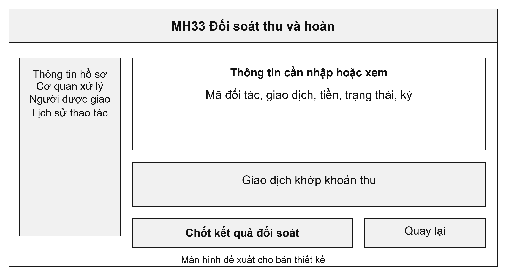
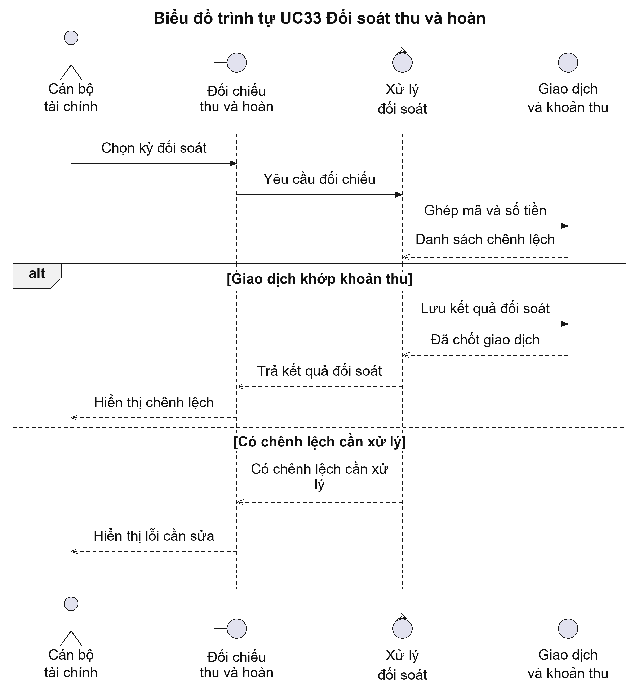
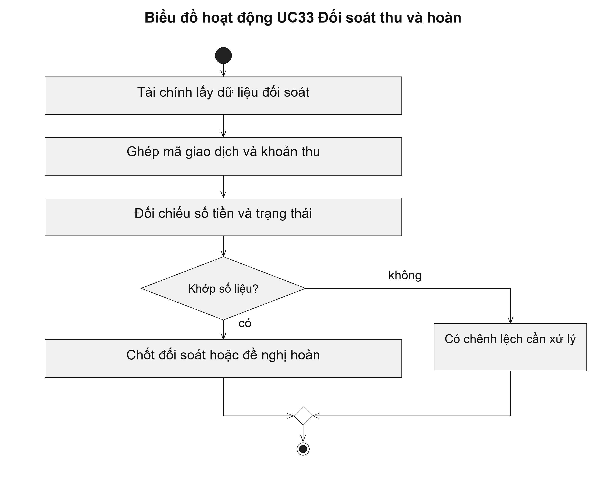

# UC33 Đối soát thu và hoàn

Đối soát kiểm tra việc ghi nhận thu có khớp với dữ liệu của đơn vị thanh toán hay không. Nếu tiền đã trả nhưng hồ sơ chưa ghi nhận, cán bộ dùng mã giao dịch để làm rõ. Nếu phát sinh hoàn, hệ thống cần theo dõi số tiền hoàn và người duyệt, tránh tính cả khoản đã hoàn vào tiền thu thực tế.

Điều kiện bắt đầu: Cán bộ tài chính có quyền đối chiếu. Dữ liệu do đơn vị thanh toán cung cấp đã được xác thực.

1. Cán bộ lấy dữ liệu giao dịch của kỳ cần đối chiếu.
2. Hệ thống ghép mã giao dịch với khoản thu và hồ sơ.
3. Cán bộ kiểm tra chênh lệch về số tiền hoặc trạng thái.
4. Cán bộ chốt kết quả đối chiếu hoặc lập đề nghị hoàn để người có thẩm quyền duyệt.

Kết quả: Giao dịch đã được đối chiếu hoặc có nội dung chênh lệch cần xử lý; đề nghị hoàn có lịch sử phê duyệt.

Trường hợp cần xử lý: Phản hồi gửi lặp không được cộng thêm tiền. Giao dịch hoàn phải được duyệt riêng và gắn với khoản thu gốc.

