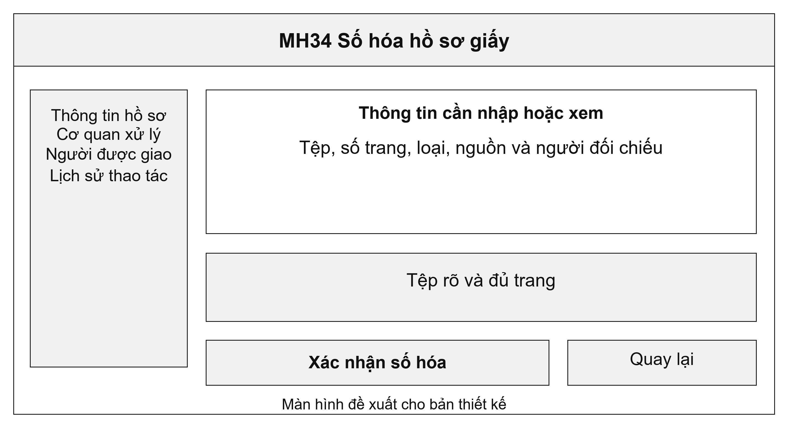
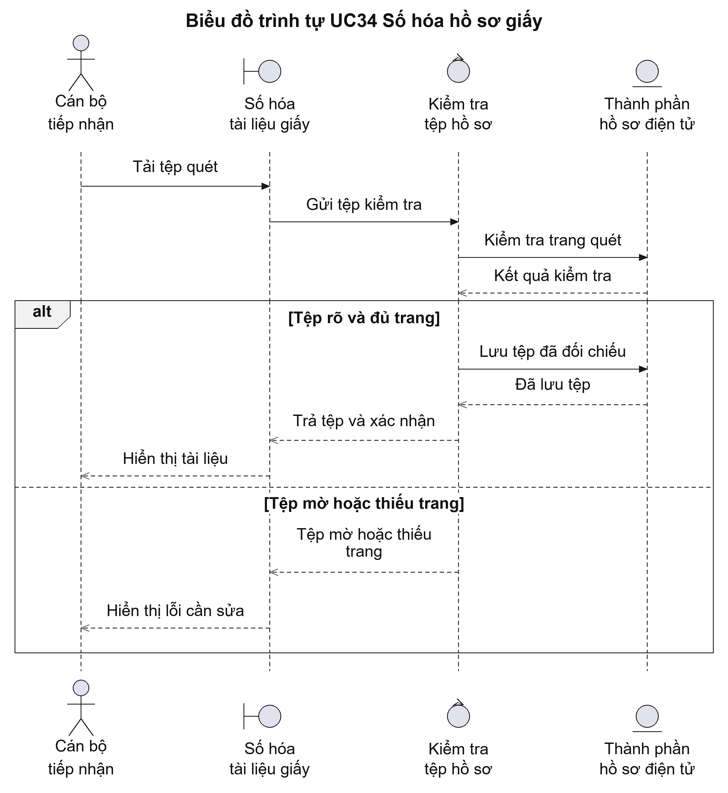
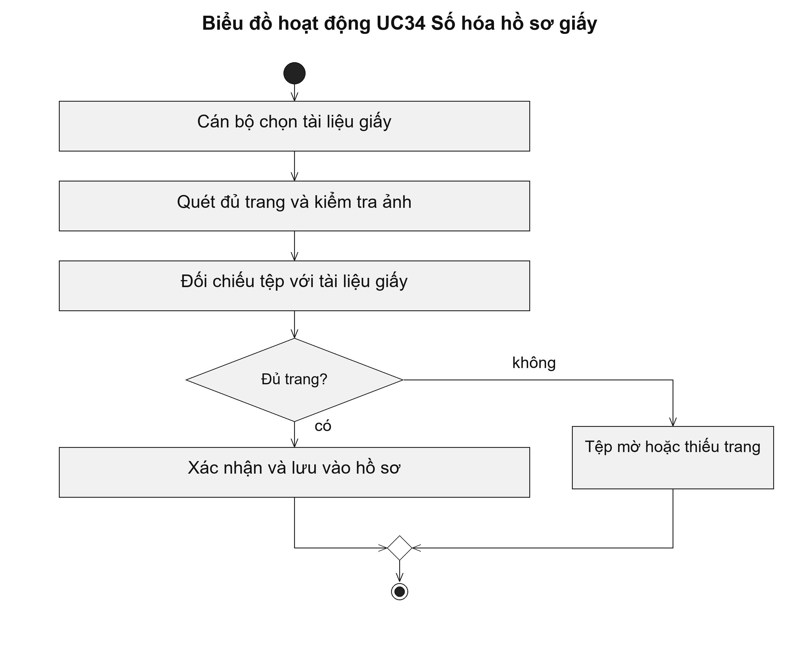

# UC34 Số hóa hồ sơ giấy

Số hóa không chỉ là quét giấy thành ảnh. Cán bộ còn phải kiểm tra đủ trang, đúng tài liệu và đúng hồ sơ. Thông tin nguồn và người đối chiếu giúp xác định bản điện tử được tạo từ tài liệu nào, phục vụ kiểm tra hoặc dùng lại về sau.

Điều kiện bắt đầu: Cán bộ được phép số hóa; tài liệu giấy và hồ sơ cần gắn tệp đã được xác định.

1. Cán bộ chọn thành phần hồ sơ cần số hóa.
2. Cán bộ quét đủ trang, kiểm tra chiều trang và độ rõ của ảnh.
3. Cán bộ đối chiếu tệp với tài liệu giấy được xuất trình.
4. Người có thẩm quyền xác nhận; hệ thống lưu tệp, số trang và nguồn tài liệu.

Kết quả: Hồ sơ có tệp điện tử đọc được, đủ trang và có thông tin xác nhận việc đối chiếu.

Trường hợp cần xử lý: Tệp mờ, thiếu trang hoặc gắn nhầm hồ sơ phải được làm lại. Cán bộ không được xác nhận thay cho người có thẩm quyền.

