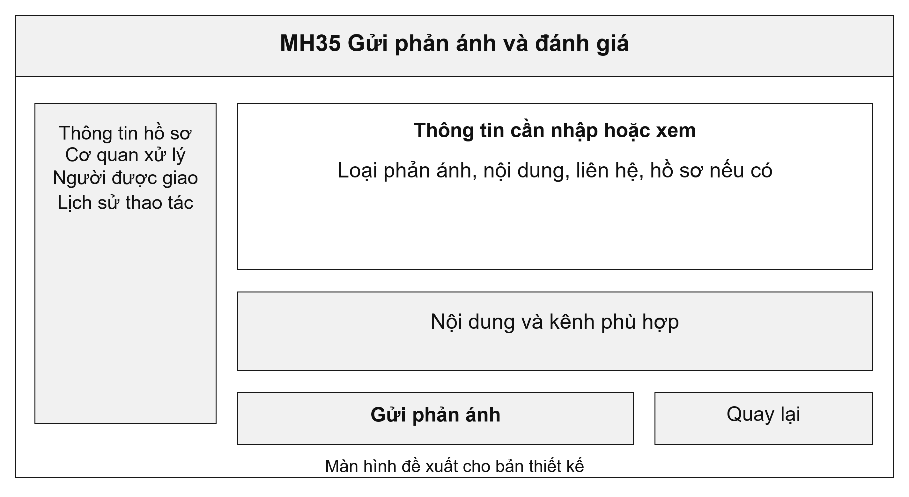
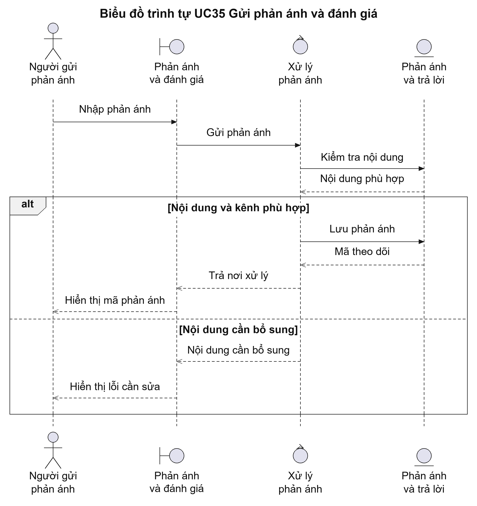
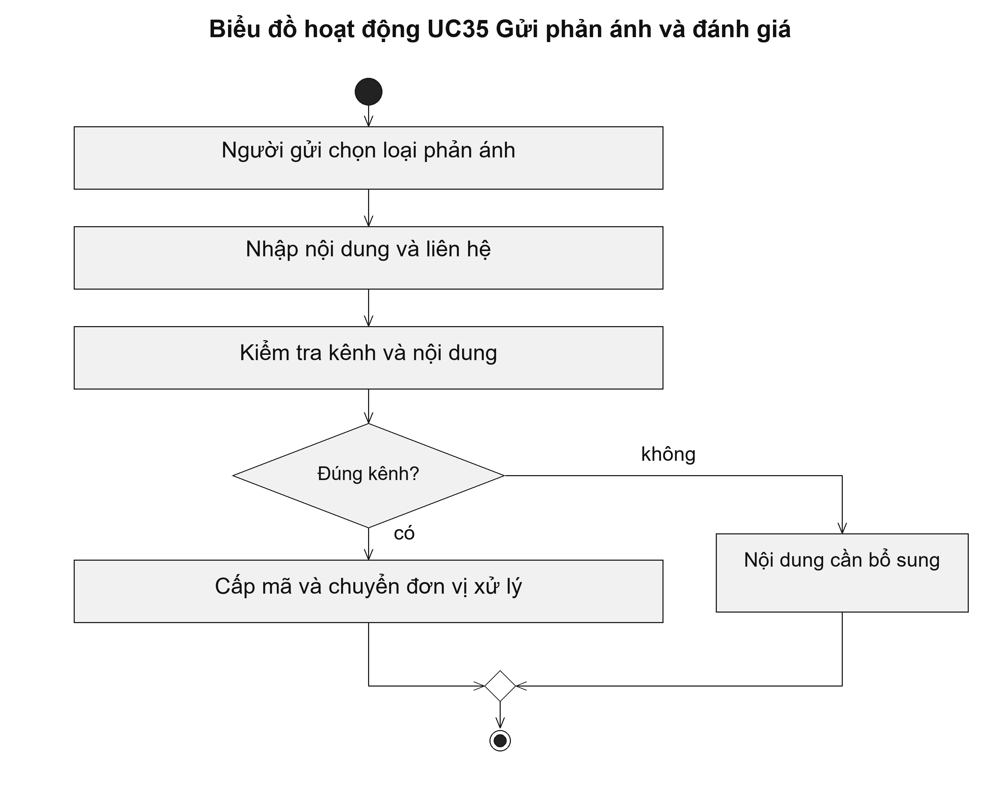

# UC35 Gửi phản ánh và đánh giá

Người dân cần theo dõi được phản ánh đã gửi, đơn vị đang xử lý và nội dung trả lời. Hệ thống phải phân biệt đánh giá chất lượng phục vụ với phản ánh cần giải quyết. Cả hai đều không thay cho việc nộp hồ sơ mới hoặc thực hiện thủ tục khiếu nại theo quy định.

Điều kiện bắt đầu: Người gửi sử dụng đúng kênh phản ánh hoặc đánh giá; thông tin liên hệ đáp ứng yêu cầu của kênh tiếp nhận.

1. Người gửi chọn loại phản ánh hoặc đánh giá.
2. Người gửi nhập nội dung, thông tin liên hệ và hồ sơ liên quan nếu có.
3. Hệ thống ghi nhận nội dung và cấp mã theo dõi.
4. Đơn vị được giao trả lời; người gửi xem kết quả hoặc yêu cầu làm rõ.

Kết quả: Phản ánh có mã, nơi xử lý và lịch sử trả lời. Đánh giá được ghi đúng hồ sơ hoặc dịch vụ liên quan.

Trường hợp cần xử lý: Phản ánh không tự thay đổi quyết định giải quyết hồ sơ. Nội dung khiếu nại phải được hướng dẫn theo quy trình tiếp nhận có thẩm quyền riêng.

