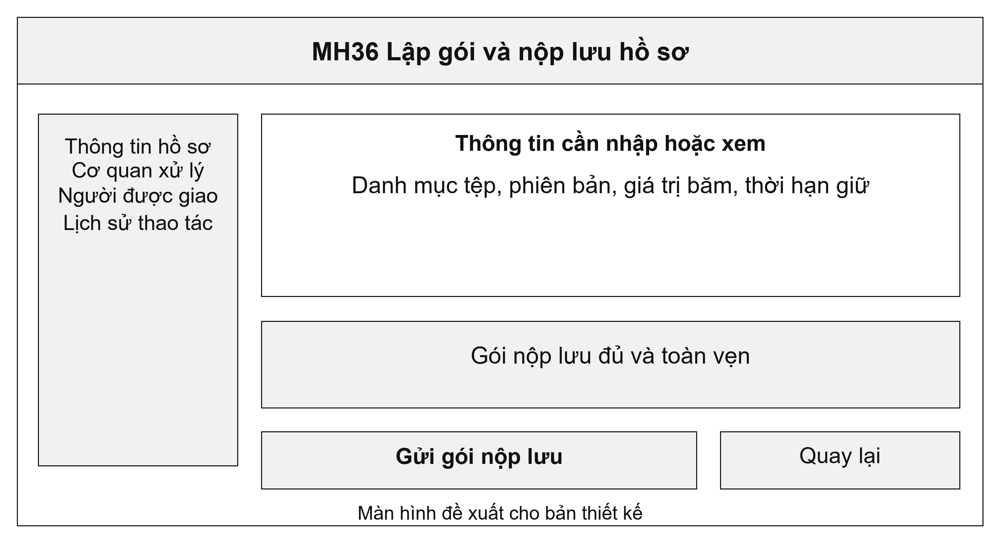
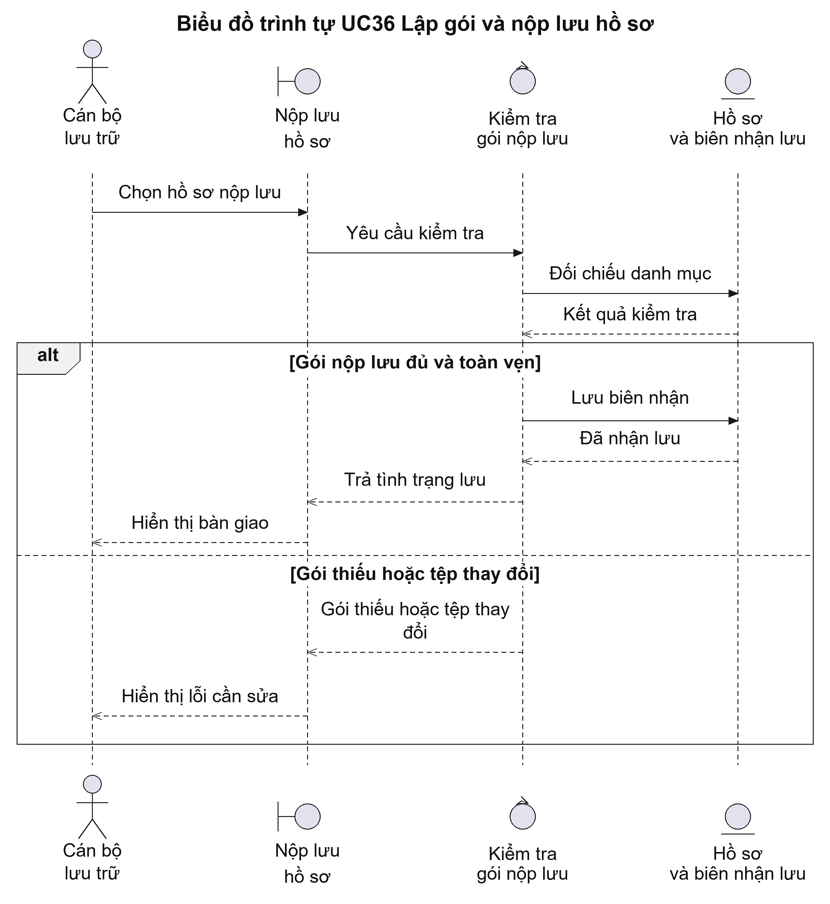
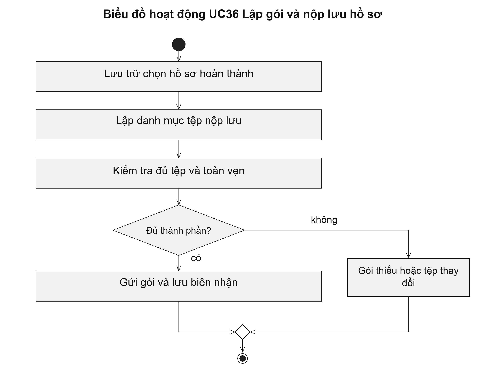

# UC36 Lập gói và nộp lưu hồ sơ

Nộp lưu kết thúc việc lập hồ sơ xử lý và chuyển sang trách nhiệm bảo quản. Danh mục phải cho biết mỗi tệp thuộc hồ sơ nào, phiên bản nào và có thời hạn giữ bao lâu. Biên nhận giúp cơ quan chứng minh đã bàn giao đủ tài liệu, thay vì chỉ biết đã gửi một thư mục tệp.

Điều kiện bắt đầu: Hồ sơ đã kết thúc; thành phần phải lưu, thời hạn bảo quản và đơn vị nhận lưu đã được xác định.

1. Cán bộ lưu trữ chốt danh sách hồ sơ và phiên bản tài liệu.
2. Cán bộ lập danh mục tệp trong gói nộp lưu.
3. Hệ thống kiểm tra đủ thành phần và tính toàn vẹn của các tệp.
4. Cán bộ gửi gói nộp lưu; hệ thống lưu biên nhận hoặc lý do bị trả lại.

Kết quả: Hồ sơ có danh mục nộp lưu và biên nhận của nơi nhận. Nếu bị trả lại, hệ thống giữ lý do và theo dõi việc bổ sung.

Trường hợp cần xử lý: Gói thiếu tệp hoặc có tệp thay đổi phải được hoàn thiện trước khi gửi lại. Kho tài liệu của công dân không thay thế kho lưu trữ hồ sơ của cơ quan.

