# HỌC VIỆN CHÍNH TRỊ QUỐC GIA HỒ CHÍ MINH

# HỌC VIỆN HÀNH CHÍNH VÀ QUẢN TRỊ CÔNG

---

# TÊN ĐỀ TÀI:

# XÂY DỰNG HỆ THỐNG THÔNG TIN QUẢN TRỊ NHÂN LỰC (HRMIS)

# CHO CÔNG TY CỔ PHẦN PHẦN MỀM SAIGON TECHNOLOGY

---

**BÁO CÁO KẾT THÚC HỌC PHẦN**

Học phần: Hệ thống thông tin quản lý nhân lực

Mã phách: ...

Hà Nội - 2026

---

# LỜI CẢM ƠN

Kính gửi:

- Lãnh đạo Khoa Khoa học Liên ngành - Ngoại ngữ - Tin học
- Thầy Hoàng Minh Ngọc - Giảng viên học phần Hệ thống thông tin quản lý nhân lực.

Để bài báo cáo này được hoàn thiện một cách chỉn chu và đạt kết quả tốt nhất, em xin gửi lời tri ân sâu sắc đến thầy Hoàng Minh Ngọc. Trong suốt quá trình học tập và thực hiện đề tài, thầy không chỉ tận tâm truyền đạt những kiến thức chuyên ngành quý báu về quản trị nhân lực và hệ thống thông tin quản trị nhân lực, mà còn luôn đồng hành, theo sát và định hướng cho em. Những lời khuyên thiết thực cùng sự góp ý chi tiết từ thầy chính là nguồn động viên to lớn, giúp em tháo gỡ nhiều khó khăn để hoàn thành tốt cả sản phẩm lẫn bài báo cáo. Em thực sự trân trọng và biết ơn sự kiên nhẫn cũng như lòng nhiệt huyết mà thầy đã dành cho em.

Đồng thời, em cũng xin bày tỏ lòng biết ơn chân thành đến Ban Giám hiệu cùng tập thể sư phạm Khoa Khoa học Liên ngành - Ngoại ngữ - Tin học. Quý thầy cô và nhà trường đã xây dựng một môi trường học tập lý tưởng, cung cấp đầy đủ cơ sở vật chất và tài liệu, giúp em tích lũy được một nền tảng kiến thức vững vàng. Đây chính là bệ phóng quan trọng để em có thể tự tin nghiên cứu, phát triển ứng dụng và hoàn thành nhiệm vụ của mình. Mặc dù đã nỗ lực và dành nhiều tâm huyết cho đề tài, nhưng do những giới hạn về mặt thời gian cũng như kinh nghiệm thực tế, bài báo cáo chắc chắn khó tránh khỏi những hạn chế và thiếu sót nhất định. Em rất mong sẽ nhận được thêm những ý kiến đóng góp, phê bình từ quý thầy cô để tiếp tục trau dồi và hoàn thiện đề tài tốt hơn trong thời gian tới.

Cuối cùng, em xin gửi lời tri ân sâu sắc đến gia đình, người thân và bạn bè - những người đã luôn động viên, hỗ trợ và tạo điều kiện tốt nhất để em có thể yên tâm học tập và hoàn thành đề tài này.

Em xin chân thành cảm ơn!

---

# LỜI CAM ĐOAN

Em xin cam đoan rằng toàn bộ nội dung được trình bày trong bài báo cáo kết thúc học phần với đề tài: "Xây dựng hệ thống thông tin quản trị nhân lực (HRMIS) cho Công ty Cổ phần Phần mềm Saigon Technology" là thành quả của quá trình nỗ lực học tập, tự nghiên cứu và làm việc một cách nghiêm túc của cá nhân em.

Đề tài này được thực hiện dựa trên nền tảng kiến thức lý thuyết đã được trang bị tại trường, kết hợp với quá trình khảo sát thực tế, phân tích và tổng hợp tài liệu một cách độc lập, khách quan dưới sự hướng dẫn khoa học và tận tình của Thầy Hoàng Minh Ngọc - Giảng viên học phần Hệ thống thông tin quản lý nhân lực, Khoa Khoa học Liên ngành - Ngoại ngữ - Tin học.

Em xin khẳng định rằng mọi số liệu, biểu đồ, hình ảnh và kết quả phân tích trong bài làm đều là hoàn toàn trung thực và chưa từng được công bố trong bất kỳ công trình nghiên cứu nào khác. Các nguồn tài liệu tham khảo, trích dẫn lý thuyết hay các thông tin kế thừa từ những nghiên cứu trước đó đều đã được em ghi chú rõ ràng, minh bạch trong danh mục tài liệu tham khảo, tuân thủ nghiêm ngặt các quy định về sở hữu trí tuệ và liêm chính học thuật của Nhà trường.

Em xin hoàn toàn chịu trách nhiệm trước Bộ môn, Khoa và Ban Giám hiệu Nhà trường về tính nguyên bản và độ chính xác của bài báo cáo này. Nếu bị phát hiện có bất kỳ dấu hiệu sao chép, đạo văn hay gian lận học thuật nào, em xin chấp nhận mọi hình thức xử lý kỷ luật theo quy chế hiện hành.

Một lần nữa, em xin cam kết về sự trung thực và tinh thần học hỏi cầu thị nghiêm túc trong suốt thời gian triển khai đề tài này.

Em xin trân trọng cam đoan!

---

# MỤC LỤC

DANH MỤC TỪ/THUẬT NGỮ VIẾT TẮT
DANH MỤC BẢNG BIỂU, SƠ ĐỒ
PHẦN MỞ ĐẦU

1. Lý do chọn đề tài
2. Tổng quan về Công ty Cổ phần Phần mềm Saigon Technology
3. Mục tiêu và nhiệm vụ
4. Đối tượng và phạm vi nghiên cứu
5. Cấu trúc của báo cáo
   PHẦN NỘI DUNG
   CHƯƠNG 1: CƠ SỞ LÝ LUẬN VỀ QUẢN TRỊ NHÂN LỰC VÀ HỆ THỐNG THÔNG TIN QUẢN TRỊ NHÂN LỰC
   1.1. Lý thuyết cơ sở
   1.2. Một số vấn đề liên quan đến chủ đề
   1.3. Phát biểu bài toán cần phân tích
   Tóm tắt chương 1
   CHƯƠNG 2: THIẾT KẾ HỆ THỐNG THÔNG TIN QUẢN TRỊ NHÂN LỰC HRMIS SAIGON TECHNOLOGY
   2.1. Phân tích các yêu cầu nghiệp vụ
   2.2. Phân tích cấu trúc hệ thống
   2.3. Phân tích hành vi của hệ thống
   2.4. Thiết kế hệ thống
   2.5. Bổ sung thiết kế: chấm công đa nguồn
   Tóm tắt chương 2
   CHƯƠNG 3: KẾT QUẢ ĐẠT ĐƯỢC VÀ ĐỀ XUẤT, KHUYẾN NGHỊ HOẶC HƯỚNG NGHIÊN CỨU PHÁT TRIỂN
   3.1. Những kết quả đạt được
   3.2. Đánh giá ưu, nhược điểm
   3.3. Hướng nghiên cứu, phát triển
   Tóm tắt chương 3
   TÀI LIỆU THAM KHẢO

---

# DANH MỤC TỪ/THUẬT NGỮ VIẾT TẮT

| STT | Từ viết tắt | Nguyên nghĩa                                                                        |
| --- | ----------- | ----------------------------------------------------------------------------------- |
| 1   | API         | Application Programming Interface (Giao diện lập trình ứng dụng)                    |
| 2   | ATS         | Applicant Tracking System (Ống dẫn quản lý ứng viên tuyển dụng)                     |
| 3   | BHXH        | Bảo hiểm xã hội                                                                     |
| 4   | BLĐ         | Bộ luật Lao động                                                                    |
| 5   | C&B         | Compensation & Benefits (Trả lương - phúc lợi)                                      |
| 6   | CSDL        | Cơ sở dữ liệu                                                                       |
| 7   | CV          | Chuyên viên                                                                         |
| 8   | ESS         | Employee Self-Service (Cổng tự phục vụ nhân viên)                                   |
| 9   | HRM         | Human Resource Management (Quản trị nhân lực)                                       |
| 10  | HRMIS       | Human Resource Management Information System (Hệ thống thông tin quản trị nhân lực) |
| 11  | ID          | Identifier (Mã định danh)                                                           |
| 12  | KPI         | Key Performance Indicator (Chỉ số đánh giá hiệu suất)                               |
| 13  | MIS         | Management Information System (Hệ thống thông tin quản lý)                          |
| 14  | MVC         | Model-View-Controller (Mô hình kiến trúc phần mềm MVC)                              |
| 15  | NV          | Nhân viên                                                                           |
| 16  | OOAD        | Object-Oriented Analysis and Design (Phân tích và thiết kế hướng đối tượng)         |
| 17  | OT          | Overtime (Làm thêm giờ)                                                             |
| 18  | PDF         | Portable Document Format (Định dạng tài liệu di động)                               |
| 19  | RBAC        | Role-Based Access Control (Phân quyền theo vai trò)                                 |
| 20  | SĐT         | Số điện thoại                                                                       |
| 21  | TNCN        | Thu nhập cá nhân                                                                    |
| 22  | UC          | Use Case (Trường hợp sử dụng)                                                       |
| 23  | UI          | User Interface (Giao diện người dùng)                                               |
| 24  | UML         | Unified Modeling Language (Ngôn ngữ mô hình hóa thống nhất)                         |
| 25  | UX          | User Experience (Trải nghiệm người dùng)                                            |
| 26  | VD          | Ví dụ                                                                               |

---

# DANH MỤC BẢNG BIỂU, SƠ ĐỒ

**DANH MỤC BẢNG BIỂU:**
- Bảng 2.1. Ánh xạ tác nhân hệ thống với cơ cấu tổ chức của Saigon Technology
- Bảng 2.2. Bảng ánh xạ ba tầng: quy trình nghiệp vụ - use case nghiệp vụ - use case hệ thống
- Bảng 2.3. Danh sách Use case của Hệ thống Quản trị nhân lực HRMIS
- Bảng 2.4. Đặc tả tổng hợp các Use case của hệ thống HRMIS
- Bảng 2.5. Đặc tả chi tiết các Use case trọng yếu
- Bảng 2.6. Danh mục tham số pháp lý của hệ thống
- Bảng 2.7. Ánh xạ lớp thực thể thiết kế với model cơ sở dữ liệu đã cài đặt
- Bảng 2.8. Mười miền dữ liệu của hệ thống đã cài đặt

**DANH MỤC SƠ ĐỒ, HÌNH VẼ:**
- Hình 1.1. Sơ đồ cơ cấu tổ chức tổng thể và mạng lưới liên kết Công ty Saigon Technology
- Hình 1.2. Cơ cấu chi tiết Ban Tổ chức - Hành chính - Nhân sự
- Hình 1.3. Cơ cấu chi tiết Khối Chuyển giao Dự án (Delivery Unit)
- Hình 1.4. Mô hình phối hợp 3 mắt xích cốt lõi và các bên liên quan (Decision-Hub-Bridge Matrix)
- Hình 2.1. Cây kế thừa tác nhân của hệ thống HRMIS
- Hình 2.2. Biểu đồ Use case tổng quan Hệ thống HRMIS
- Hình 2.3. Biểu đồ Use case nhóm B - Tuyển dụng
- Hình 2.4. Biểu đồ trình tự Use case Đăng nhập (UC01)
- Hình 2.5. Biểu đồ trình tự Use case Lập phiếu đề xuất tuyển dụng (UC04)
- Hình 2.6. Biểu đồ trình tự Use case Xử lý thôi việc (UC17)
- Hình 2.7. Biểu đồ trình tự Use case Đăng ký nghỉ phép (UC20)
- Hình 2.8. Biểu đồ trình tự Use case Tính bảng lương hằng tháng (UC23)
- Hình 2.9. Biểu đồ hoạt động Use case Đăng nhập (UC01)
- Hình 2.10. Biểu đồ hoạt động Use case Đăng ký nghỉ phép (UC20)
- Hình 2.11. Biểu đồ hoạt động Use case Chốt bảng chấm công (UC21)
- Hình 2.12. Biểu đồ trạng thái vòng đời Nhân viên
- Hình 2.13. Biểu đồ trạng thái Phiếu tuyển dụng
- Hình 2.14. Biểu đồ trạng thái Đơn nghỉ phép
- Hình 2.15. Biểu đồ trạng thái Phiếu mượn - trả hồ sơ
- Hình 2.16. Biểu đồ trạng thái Phiếu lương
- Hình 2.17. Biểu đồ gói tổng quan của hệ thống HRMIS
- Hình 2.18. Biểu đồ lớp Use case Đăng nhập (UC01)
- Hình 2.19. Biểu đồ lớp Use case Đăng ký nghỉ phép (UC20)
- Hình 2.20. Biểu đồ lớp miền cốt lõi của hệ thống
- Hình 2.21. Mô hình cơ sở dữ liệu vật lý của hệ thống
- Hình 2.22. Sơ đồ kiến trúc phần mềm 3 tầng của hệ thống
- Hình 2.23. Biểu đồ trình tự Use case Điểm danh bằng mã QR (UC26)
- Hình 2.24. Mô hình dữ liệu bổ sung cho chấm công đa nguồn

---

# PHẦN MỞ ĐẦU

## 1. Lý do chọn đề tài

Công tác quản trị con người ở nhiều doanh nghiệp vẫn dựa vào sổ sách, bảng tính Excel và email trong khi nhu cầu số hóa ngày càng cấp thiết. Hệ thống thông tin quản trị nhân lực (HRMIS) ra đời để quản lý trọn vòng đời người lao động: từ tuyển dụng, hồ sơ, hợp đồng, chấm công, tính lương đến biến động nhân sự và thôi việc, đồng thời bảo đảm tuân thủ pháp luật lao động, bảo hiểm xã hội và thuế thu nhập cá nhân.

Qua khảo sát thực tế, em chọn Công ty CP Phần mềm Saigon Technology làm đơn vị nghiên cứu tình huống vì ba căn cứ. Một là, công ty có hơn 430 nhân sự trải rộng hai thành phố, nhiều loại hợp đồng và ca làm việc, trong khi bộ phận nhân sự chỉ khoảng 18 người. Hai là, hiện trạng vận hành còn pha trộn giấy tờ và Excel nên thuận lợi cho việc khảo sát quy trình thủ công nguyên bản. Ba là, nghiệp vụ nhân sự vận dụng trọn vẹn kiến thức học phần: từ phân tích quy trình, xác định tác nhân, thiết kế cơ sở dữ liệu đến xây dựng demo tính đúng lương - bảo hiểm - thuế theo pháp luật hiện hành. Đề tài cũng giúp em rèn tư duy phân tích hệ thống trên một bài toán quản trị thực tiễn.

## 2. Tổng quan về Công ty Cổ phần Phần mềm Saigon Technology

### 2.1. Lịch sử hình thành và lĩnh vực hoạt động kinh doanh

Công ty Cổ phần Phần mềm Saigon Technology (tên pháp nhân đăng ký kinh doanh từ ngày 13/11/2015: Công ty Cổ phần Công nghệ Phần mềm STS Software, mã số thuế 0313534747) là doanh nghiệp công nghệ thông tin thuần Việt, hoạt động trong lĩnh vực phát triển phần mềm theo mô hình linh hoạt (Agile) và gia công phần mềm cho thị trường quốc tế:

- **Năm 2012:** Công ty được thành lập tại Thành phố Hồ Chí Minh, xuất phát điểm chỉ với ba kỹ sư phần mềm, tập trung phát triển ứng dụng web và ứng dụng di động;
- **Giai đoạn 2019 - 2020:** Bước ngoặt tăng trưởng quy mô - chuyển về trụ sở diện tích khoảng 2.000 mét vuông, khai trương trung tâm phát triển phần mềm tại Thành phố Đà Nẵng (Khu Phần mềm Đà Nẵng, tòa nhà ICT1, quận Hải Châu), đạt chứng nhận bảo mật thông tin ISO/IEC 27001 do tổ chức BSI cấp;
- **Hiện nay:** Công ty duy trì đội ngũ khoảng 400 đến hơn 430 cán bộ, kỹ sư và nhân viên hỗ trợ, doanh thu hằng năm ước khoảng 23 triệu đô la Mỹ, đã bàn giao hơn 850 dự án cho hơn 350 khách hàng tại Hoa Kỳ, châu Âu, Úc và Singapore; văn phòng đại diện đặt tại Hoa Kỳ, Úc, Thụy Sĩ và Singapore.

Công ty cung cấp các dịch vụ phát triển phần mềm theo yêu cầu, cho thuê đội ngũ kỹ sư theo dự án (mô hình dedicated team), trung tâm phát triển phần mềm đặt tại Việt Nam cho khách hàng quốc tế, cùng dịch vụ kiểm thử chất lượng và ứng dụng trí tuệ nhân tạo. Về chứng nhận và danh hiệu: ISO 9001, ISO/IEC 27001, Giải thưởng Sao Khuê 2020, Top 15 công ty gia công phần mềm Agile hàng đầu Việt Nam (VINASA), nhà phát triển phần mềm hàng đầu đến từ Việt Nam năm 2022 (Clutch).

Điểm khiến Saigon Technology trở thành tình huống nghiên cứu giàu tính đại diện nằm ở quy mô tổ chức công nghệ phát triển nhanh chóng: lực lượng kỹ thuật trực tiếp và sản xuất chiếm phần lớn quy mô công ty (**Khối Kỹ thuật & Sản xuất Phần mềm - DELIVERY gồm 239 nhân sự** tại hai trung tâm TP.HCM và Đà Nẵng) — trong khi **Khối Quản trị Nguồn nhân lực (HR - 44 nhân sự)** cùng **Khối Tài chính - Kế toán (FIN - 27 nhân sự)** và **Khối Vận hành & Pháp chế (OPS - 24 nhân sự)** phải quản trị, điều phối và bảo đảm tuân thủ cho toàn bộ chuỗi giá trị con người. Trước khi triển khai hệ thống, phương thức quản lý tại các mắt xích vẫn có sự phân mảnh giữa giấy tờ, sổ tay, bảng tính Excel rời rạc và các kênh trao đổi nhóm. Đứng trước yêu cầu chuyển đổi số toàn diện, Ban Giám đốc đặt ra mục tiêu thiết kế và xây dựng Hệ thống thông tin quản trị nhân lực (HRMIS) hoàn chỉnh, tự động hóa quy trình nghiệp vụ và xóa bỏ triệt để các rào cản vận hành nội bộ.

### 2.2. Cơ cấu tổ chức bộ máy quản lý và mạng lưới ODC

Cơ cấu tổ chức của Công ty Cổ phần Phần mềm Saigon Technology được thiết lập theo mô hình ma trận chức năng kết hợp phân tán địa lý (Functional Matrix & Distributed Delivery Model). Hệ thống cơ cấu tổ chức hiện thời được cấu hình đồng bộ trực tiếp trong cơ sở dữ liệu và phần mềm quản trị nhân lực HRMIS gồm **38 đơn vị phân cấp** thuộc 5 Khối chức năng ngang hàng và Ban Giám đốc.

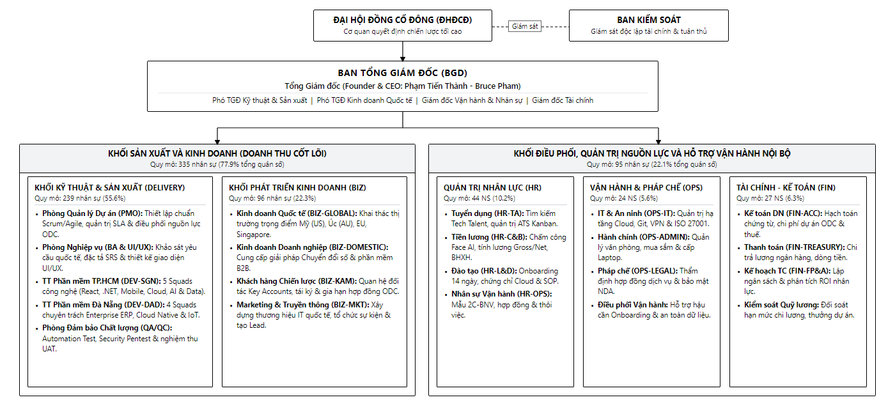

**Hình 1.1. Sơ đồ cơ cấu tổ chức tổng thể Công ty Saigon Technology**

Dưới sự chỉ đạo của Đại hội đồng Cổ đông và Ban Giám đốc, cơ cấu tổ chức được phân định rõ ràng thành 5 Khối chức năng chuyên biệt:

#### A. Cấp Quản trị Sở hữu và Ban Giám đốc Điều hành
- **Đại hội đồng Cổ đông (ĐHCĐ):** Cơ quan quyết định cao nhất của công ty cổ phần, thông qua các định hướng kinh doanh chiến lược, kế hoạch phát hành cổ phiếu thưởng ESOP và phê chuẩn ngân sách hoạt động hàng năm.
- **Ban Giám đốc Điều hành (BGD):** Gồm Tổng Giám đốc (CEO Trần Minh Hoàng), Phó Tổng Giám đốc Kinh doanh Quốc tế (Lâm Chí Cường), Giám đốc Kỹ thuật (CTO Lê Quốc Tuấn), Giám đốc Tài chính (CFO Phan Thị Mai Phương), Giám đốc Nhân sự (CHRO Hoàng Kim Dung) cùng các trợ lý điều hành. Ban Giám đốc là cấp quyết định tối cao đối với các biến động nhân sự then chốt: phê chuẩn định biên dự án, bổ nhiệm cán bộ cấp cao, phê duyệt chỉ tiêu tuyển dụng vượt khung và thực thi lệnh khóa bất biến kỳ tính lương (LOCKED).

#### B. Khối Quản trị Nguồn nhân lực & Khối Vận hành - Pháp chế (Bộ đôi điều phối & hỗ trợ)
Cơ cấu tổ chức của Saigon Technology tách bạch chuyên môn hóa cao: Khối Quản trị Nguồn nhân lực (HR) tập trung sâu vào chiến lược phát triển con người, trong khi Khối Vận hành & Pháp chế (OPS) bảo đảm nền tảng hạ tầng công nghệ và tính tuân thủ pháp luật:

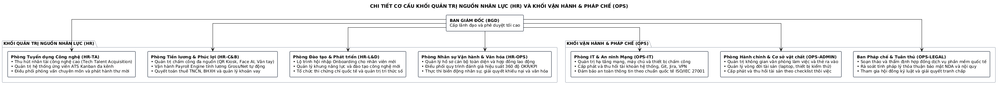

**Hình 1.2. Cơ cấu chi tiết Khối Quản trị Nguồn nhân lực (HR) và Khối Vận hành & Pháp chế (OPS)**

- **Khối Quản trị Nguồn nhân lực (HR):**
  1. *Phòng Tuyển dụng Công nghệ (HR-TA):* Thực hiện chiến dịch săn tìm nhân tài công nghệ cao (Tech Talent Acquisition), phụ trách phễu tuyển dụng ATS từ tiếp nhận hồ sơ, sàng lọc, điều phối phỏng vấn kỹ thuật đến phát hành thư mời nhận việc (Offer Letter).
  2. *Phòng Tiền lương & Phúc lợi (HR-C&B):* Quản lý dữ liệu chấm công từ các nguồn, vận hành cỗ máy tính lương tự động, trích nộp bảo hiểm xã hội, tính thuế thu nhập cá nhân lũy tiến, kiểm soát hạn mức vay phúc lợi và rà soát nâng bậc lương thường xuyên theo Nghị định 204.
  3. *Phòng Đào tạo & Phát triển (HR-L&D):* Thiết kế và điều phối lộ trình hội nhập 14 ngày cho nhân viên mới, tổ chức các khóa bồi dưỡng kỹ năng công nghệ (AI, Cloud, DevOps), tài trợ thi chứng chỉ quốc tế và quản trị hệ thống tri thức số.
  4. *Phòng Nhân sự Vận hành & Văn hóa (HR-OPS):* Chịu trách nhiệm quản trị hồ sơ cán bộ toàn diện Mẫu 2C-BNV (111 trường dữ liệu và 8 bảng diễn biến), quản lý hợp đồng lao động, chủ trì chu kỳ đánh giá hiệu suất 360 độ, thực thi các thủ tục thuyên chuyển, khen thưởng, kỷ luật, tiếp nhận và hòa giải khiếu nại của người lao động.
- **Khối Vận hành & Pháp chế (OPS):**
  1. *Phòng IT & An ninh Mạng (OPS-IT):* Đảm bảo hạ tầng công nghệ, quản trị mạng, cấp phát quyền truy cập email, máy chủ dự án; thực thi nghiêm ngặt tiêu chuẩn an toàn thông tin ISO/IEC 27001 và chính sách bảo vệ dữ liệu cá nhân (xóa dữ liệu vector sinh trắc học khi nhân sự nghỉ việc theo Nghị định 13/2023/NĐ-CP).
  2. *Phòng Hành chính & Cơ sở vật chất (OPS-ADMIN):* Quản lý cơ sở vật chất văn phòng TP.HCM và Đà Nẵng, điều phối lễ tân, mua sắm và cấp phát tài sản làm việc (laptop, màn hình), đồng thời là chốt chặn thu hồi tài sản trong quy trình thôi việc.
  3. *Ban Pháp chế & Tuân thủ (OPS-LEGAL):* Rà soát pháp lý hợp đồng cung ứng dịch vụ phần mềm quốc tế, bảo vệ quyền sở hữu trí tuệ công nghệ và thẩm định tính pháp lý trong các vụ việc xử lý kỷ luật lao động.

#### C. Khối Kỹ thuật & Sản xuất Phần mềm (DELIVERY)
Khối Delivery là "trung tâm sản xuất" tạo ra toàn bộ doanh thu của doanh nghiệp, quy tụ lực lượng kỹ sư tại hai trung tâm công nghệ TP.HCM và Đà Nẵng:

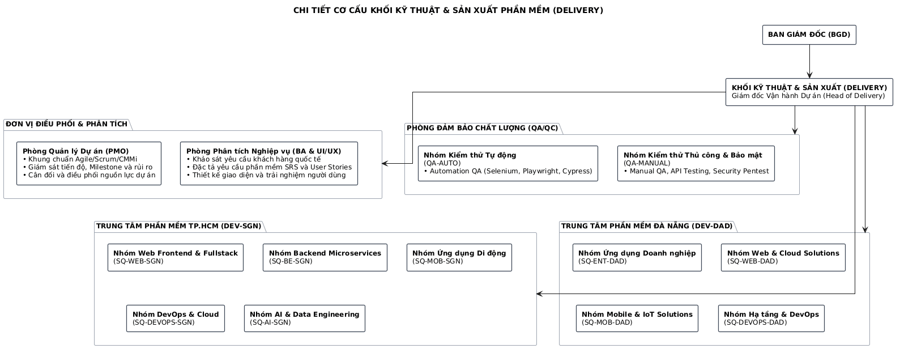

**Hình 1.3. Cơ cấu chi tiết Khối Kỹ thuật & Sản xuất Phần mềm (DELIVERY)**

- *Phòng Quản lý Dự án (PMO):* Thiết lập và giám sát chuẩn mực thực thi dự án Agile/Scrum, kiểm soát Milestone bàn giao cho khách hàng quốc tế, quản trị định biên và điều phối nhân sự kỹ thuật giữa các dự án.
- *Phòng Phân tích Nghiệp vụ (BA & UI/UX):* Khảo sát yêu cầu khách hàng, xây dựng tài liệu đặc tả chức năng (SRS) và thiết kế hệ thống giao diện người dùng tối ưu.
- *Trung tâm Phần mềm TP.HCM (DEV-SGN):* Gồm 5 Squad công nghệ chủ lực: Web Frontend & Fullstack, Backend Microservices, Ứng dụng di động, DevOps & Cloud, và AI & Data Engineering.
- *Trung tâm Phần mềm Đà Nẵng (DEV-DAD):* Gồm 4 Squad chuyên môn: Ứng dụng doanh nghiệp, Web & Cloud Solutions, Mobile & IoT Solutions, và Hạ tầng & DevOps.
- *Phòng Đảm bảo Chất lượng (QA/QC):* Gồm Nhóm Kiểm thử tự động (Automation QA) và Nhóm Kiểm thử thủ công & An toàn bảo mật (Manual & Security QA).

#### D. Khối Phát triển Kinh doanh (BIZ)
- *Phòng Kinh doanh Quốc tế (BIZ-GLOBAL):* Đàm phán và ký kết các hợp đồng gia công phần mềm với khách hàng tại thị trường trọng điểm Mỹ, Úc, Châu Âu, Nhật Bản và Singapore.
- *Phòng Kinh doanh Doanh nghiệp (BIZ-DOMESTIC):* Phát triển giải pháp chuyển đổi số cho khối doanh nghiệp và tổ chức tài chính tại Việt Nam.
- *Phòng Khách hàng Chiến lược (BIZ-KAM):* Quản lý chăm sóc và mở rộng doanh thu từ các đối tác lớn dài hạn.
- *Phòng Marketing & Truyền thông (BIZ-MKT):* Quảng bá thương hiệu công nghệ, xây dựng thương hiệu nhà tuyển dụng và tổ chức các sự kiện kết nối cộng đồng.

#### E. Khối Tài chính - Kế toán (FIN)
- *Phòng Kế toán Doanh nghiệp & Thuế (FIN-ACC):* Hạch toán chi phí tiền lương, bảo hiểm, quyết toán thuế thu nhập doanh nghiệp và thuế TNCN.
- *Phòng Thanh toán & Dòng tiền (FIN-TREASURY):* Quản lý dòng tiền, trực tiếp thực hiện lệnh chi trả lương qua ngân hàng, chi trả tạm ứng công tác phí và giải ngân khoản vay phúc lợi.
- *Phòng Kế hoạch Tài chính (FIN-FP&A):* Dự báo ngân sách tiền lương, phân tích biên lợi nhuận dự án (Project Costing) và thẩm định nguồn tài chính cho các đề xuất tuyển dụng mới.

---

### 2.3. Mối quan hệ liên kết nghiệp vụ và Mô hình phối hợp 3 mắt xích

Mọi quyết định và luồng nghiệp vụ nhân sự trong toàn công ty được vận hành theo cơ chế phối hợp ba mắt xích cốt lõi: **Ban Giám đốc (Quyết định - Decision) — Các Khối Chức năng Điều phối (Trung tâm - Hub) — Các Khối Sản xuất & Kinh doanh (Cầu nối thực thi - Bridge)**:

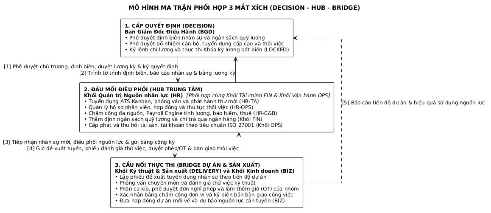

**Hình 1.4. Mô hình phối hợp 3 mắt xích cốt lõi và các bên liên quan (Decision-Hub-Bridge Matrix)**

## 3. Mục tiêu và nhiệm vụ

### 3.1. Mục tiêu

Mục tiêu cốt lõi của đề tài là xây dựng một hệ thống thông tin quản trị nhân lực hoàn chỉnh cho Saigon Technology, tự động hóa các quy trình tác nghiệp nhân sự, bảo đảm chuỗi hoạt động quản trị con người diễn ra xuyên suốt, chính xác và tuân thủ pháp luật:

- **Số hóa và cấu trúc hóa toàn bộ cơ sở dữ liệu:** Lưu trữ tập trung hồ sơ nhân sự, hợp đồng lao động, văn bằng chứng chỉ, dữ liệu chấm công, bảng lương và lịch sử biến động nhân sự trên một nguồn dữ liệu gốc dùng chung;
- **Tin học hóa quy trình vận hành:** Số hóa luồng phê duyệt ba tầng (phòng ban → Ban Tổ chức - Hành chính - Nhân sự → Ban Giám đốc), thay thế tờ trình in giấy bằng phê duyệt điện tử có dấu vết;
- **Chuẩn hóa tuân thủ pháp luật:** Mọi con số lương - bảo hiểm - thuế - phép tính theo tham số pháp lý cấu hình được theo hiệu lực ngày;
- **Hỗ trợ công tác quản trị và ra quyết định:** Cung cấp báo cáo thống kê trực quan, chính xác theo thời gian thực cho Ban Giám đốc.

### 3.2. Nhiệm vụ

Hệ thống phải bám sát và hỗ trợ tối đa các nhóm nhiệm vụ trọng tâm sau:

- **Quản lý vòng đời hồ sơ:** Lưu trữ hồ sơ gốc theo nguyên tắc "cất hồ sơ - cần tìm thì tìm ra", quản lý mượn - trả bản gốc văn bằng chứng chỉ, hợp đồng lao động với cảnh báo hạn;
- **Vận hành quy trình tuyển dụng:** Từ phiếu đề xuất của Trưởng dự án qua thẩm định, phê duyệt, tuyển đa kênh, phỏng vấn, xếp lương đến hội nhập ba bộ phận đồng loạt;
- **Quản trị biến động nhân sự:** Thuyên chuyển, tăng lương, khen thưởng - kỷ luật, nghỉ hưu, thôi việc kèm checklist bàn giao các bộ phận liên quan;
- **Chuỗi công - lương:** Chấm công đa nguồn, quản lý nghỉ phép và làm thêm giờ, tính bảng lương theo cấu trúc thành phần, khóa bảng lương bất biến, xuất báo cáo bảo hiểm - thuế;
- **Phân quyền và bảo mật:** Phân quyền theo vai trò gắn đúng bộ phận trong cơ cấu tổ chức, phạm vi dữ liệu giới hạn theo cấp quản lý, nhật ký kiểm toán mọi thao tác.

## 4. Đối tượng và phạm vi nghiên cứu

### 4.1. Đối tượng nghiên cứu

Đối tượng nghiên cứu trọng tâm của đề tài bao gồm toàn bộ các quy trình nghiệp vụ thực tế xoay quanh công tác quản trị nhân lực tại Công ty Cổ phần Phần mềm Saigon Technology: quy trình tuyển dụng, quản lý hồ sơ từ ngày vào làm đến lúc nghỉ, chấm công - tính lương hằng tháng, và các nghiệp vụ biến động nhân sự (thuyên chuyển, khen thưởng - kỷ luật, nghỉ hưu, thôi việc). Dựa trên việc bóc tách và phân tích sâu các quy trình này, em hướng tới mục tiêu xây dựng một hệ thống thông tin quản trị nhân lực thống nhất, toàn diện nhằm số hóa các hoạt động quản trị con người của doanh nghiệp.

### 4.2. Phạm vi nghiên cứu

**Về mặt ứng dụng thực tiễn:** Đề tài tập trung vào việc khảo sát, thu thập dữ liệu và phân tích quy trình quản trị nhân lực tại một công ty phần mềm quy mô vừa (trực tiếp tham chiếu từ Saigon Technology với hơn 430 nhân sự ở hai trung tâm Thành phố Hồ Chí Minh và Đà Nẵng). Hệ thống được thiết kế theo hướng mở, bảo đảm tính linh hoạt và khả năng mở rộng, có thể tùy biến cho các tổ chức khác trong tương lai.

**Về mặt giới hạn học thuật:** Dựa trên khuôn khổ và thời lượng của học phần, nội dung báo cáo giới hạn ở các giai đoạn: phân tích nghiệp vụ và yêu cầu hệ thống, thiết kế hệ thống thông tin (mô hình dữ liệu, luồng xử lý, giao diện, kiến trúc), và đặc tả hệ thống demo; tầng trí tuệ nhân tạo dự báo nhân sự chỉ trình bày như hướng phát triển.

## 5. Cấu trúc của báo cáo

Ngoài phần Mở đầu, Kết luận và Danh mục tài liệu tham khảo, cấu trúc nội dung chính của báo cáo được chia thành 3 chương như sau:

**Chương 1:** Cơ sở lý luận về quản trị nhân lực và hệ thống thông tin quản trị nhân lực. Chương này trình bày các khái niệm nền tảng về quản trị nhân lực và các chức năng của nó, khái niệm - vai trò - cấu trúc điển hình của hệ thống thông tin quản trị nhân lực, phương pháp xây dựng hệ thống, các bài học kinh nghiệm, và đưa ra phát biểu bài toán nghiệp vụ cần giải quyết tại Saigon Technology.

**Chương 2:** Thiết kế hệ thống thông tin quản trị nhân lực HRMIS Saigon Technology. Đây là chương trọng tâm, tiến hành phân tích yêu cầu nghiệp vụ (tác nhân và use case, ánh xạ quy trình nghiệp vụ), thiết kế cấu trúc và hành vi của hệ thống thông qua hệ thống biểu đồ UML, thiết kế cơ sở dữ liệu, giao diện người dùng và kiến trúc thành phần - tất cả phản ánh đúng những gì đã được cài đặt thực tế.

**Chương 3:** Kết quả đạt được và đề xuất, khuyến nghị hoặc hướng nghiên cứu phát triển. Chương cuối tổng hợp các kết quả đạt được, đánh giá những ưu nhược điểm của hệ thống, đồng thời đưa ra các khuyến nghị, định hướng phát triển và hoàn thiện trong tương lai.

---

# PHẦN NỘI DUNG

# CHƯƠNG 1: CƠ SỞ LÝ LUẬN VỀ QUẢN TRỊ NHÂN LỰC VÀ HỆ THỐNG THÔNG TIN QUẢN TRỊ NHÂN LỰC

## 1.1. Lý thuyết cơ sở

### 1.1.1. Tổng quan về quản trị nhân lực

**Quản trị nhân lực (HRM)** là hoạt động thu hút, phát triển, giữ chân và sử dụng hiệu quả nguồn nhân lực nhằm đạt mục tiêu chung của tổ chức, đồng thời bảo đảm quyền lợi hợp pháp cho người lao động. Công việc này vừa mang tính kỹ thuật (quy trình, chứng từ, con số), vừa mang tính pháp lý (luật lao động, bảo hiểm, thuế), vừa mang tính nhân văn (động lực làm việc của con người).

Quản trị nhân lực trong doanh nghiệp gồm sáu nhóm chức năng chính, mỗi nhóm tương ứng với một khối nghiệp vụ mà hệ thống thông tin sau này phải số hóa:

- **Hoạch định nguồn nhân lực:** xác định nhu cầu nhân sự (định biên, vị trí việc làm) so với hiện trạng, làm căn cứ cho tuyển dụng và kế hoạch phát triển;
- **Tuyển dụng:** từ phát hiện thiếu hụt, đề xuất tuyển, tìm kiếm ứng viên đa kênh, sàng lọc, phỏng vấn, xếp lương đến hội nhập nhân viên mới;
- **Quản lý hồ sơ và hợp đồng lao động:** lưu trữ hồ sơ gốc và hồ sơ điện tử, quản lý hợp đồng, văn bằng chứng chỉ, theo dõi kỳ thử việc;
- **Đãi ngộ - tiền lương:** chấm công, quản lý nghỉ phép và làm thêm giờ, tính lương, bảo hiểm xã hội, thuế thu nhập cá nhân, thưởng - phạt;
- **Biến động nhân sự và quan hệ lao động:** thuyên chuyển, thăng chức, khen thưởng - kỷ luật, nghỉ hưu, thôi việc kèm thủ tục bàn giao;
- **Đánh giá và phát triển:** đánh giá hiệu suất, đào tạo, kế hoạch phát triển đội ngũ và kế nhiệm.

Riêng trong ngành công nghệ thông tin, lao động trí tuệ trẻ, kỹ năng thay đổi nhanh và cạnh tranh nhân tài gay gắt khiến tỷ lệ nghỉ việc cao. Hệ thống nhân sự vì thế không chỉ phục vụ quản lý mà còn phải giúp giữ chân người tài nhờ minh bạch lương thưởng, tiện dụng và ra quyết định dựa trên dữ liệu.

### 1.1.2. Hệ thống thông tin quản trị nhân lực (HRMIS)

**Hệ thống:** là tập hợp các thành phần liên kết nhau cùng hướng tới một mục tiêu chung; dưới góc độ thông tin, hệ thống nhận dữ liệu vào, xử lý và cung cấp thông tin phục vụ điều hành.

**Hệ thống thông tin quản lý (MIS):** số hóa quy trình quản trị để thu thập, lưu trữ, xử lý và cung cấp thông tin kịp thời, chính xác cho các cấp quản lý ra quyết định.

**Hệ thống thông tin quản trị nhân lực (HRMIS):** hỗ trợ toàn bộ chức năng quản trị nhân lực của tổ chức, điển hình gồm các phân hệ:

- **Phân hệ Hồ sơ nhân sự:** hồ sơ điện tử, hợp đồng lao động, văn bằng chứng chỉ, lịch sử công tác;
- **Phân hệ Tuyển dụng:** chỉ tiêu tuyển, quản lý ứng viên, phỏng vấn, thư mời làm việc;
- **Phân hệ Chấm công:** ghi nhận giờ công đa nguồn, nghỉ phép, làm thêm giờ;
- **Phân hệ Tiền lương:** tính lương, bảo hiểm xã hội, thuế thu nhập cá nhân, phiếu lương;
- **Phân hệ Biến động nhân sự:** thuyên chuyển, khen thưởng - kỷ luật, nghỉ hưu, thôi việc;
- **Phân hệ Báo cáo - phân tích:** thống kê phục vụ điều hành và ra quyết định.

Điểm phân biệt HRMIS với các hệ thống thông tin khác nằm ở **tính pháp lý của dữ liệu**: bảng lương là căn cứ chi trả và quyết toán thuế, quyết định nhân sự là chứng từ pháp lý - vì vậy một HRMIS đúng chuẩn phải bảo đảm tính truy vết (mọi thay đổi để lại dấu vết), tính bất biến của dữ liệu đã phê duyệt, và tuân thủ quy định bảo vệ dữ liệu cá nhân.

### 1.1.3. Quy trình xây dựng và phương pháp phân tích thiết kế hệ thống

Một dự án xây dựng hệ thống thông tin đi qua các giai đoạn chuẩn: **khảo sát nghiệp vụ hiện trạng → phân tích yêu cầu → thiết kế hệ thống → cài đặt - kiểm thử → triển khai - vận hành**. Đề tài tập trung vào hai giai đoạn đầu, với phương pháp luận hướng đối tượng.

**Phân tích và thiết kế hướng đối tượng (OOAD)** quản lý độ phức tạp của hệ thống bằng cách coi thế giới thực là tập hợp các đối tượng mang dữ liệu và hành vi, tuân thủ các nguyên lý trừu tượng hóa, bao đóng, kế thừa và đa hình. Phương pháp này đặc biệt phù hợp với nghiệp vụ nhân sự, vì các thực thể cốt lõi (Nhân viên, Hợp đồng, Đơn nghỉ phép, Phiếu lương) đều có vòng đời trạng thái dài và bị ràng buộc quy tắc chuyển trạng thái.

Công cụ mô hình hóa là **Ngôn ngữ mô hình hóa thống nhất (UML)** với các biểu đồ:

- **Biểu đồ Use Case:** trả lời câu hỏi "hệ thống phải làm gì cho ai" - xác định các Tác nhân và các Trường hợp sử dụng, giúp định hình ranh giới hệ thống và thu thập yêu cầu chức năng;
- **Biểu đồ Trình tự (Sequence Diagram):** mô hình hóa cách các đối tượng trao đổi thông điệp theo trình tự thời gian để hoàn thành một kịch bản cụ thể, kết nối phân tích yêu cầu với thiết kế cài đặt;
- **Biểu đồ Cộng tác (Collaboration Diagram):** mô tả tổ chức cấu trúc liên kết giữa các đối tượng tham gia gửi - nhận thông điệp, giúp quan sát sự phân bổ trách nhiệm;
- **Biểu đồ Hoạt động (Activity Diagram):** mô tả luồng công việc, các bước rẽ nhánh hoặc tương tranh của quy trình nghiệp vụ;
- **Biểu đồ Trạng thái (State Diagram):** mô tả vòng đời đối tượng - công cụ đặc biệt quan trọng với nghiệp vụ nhân sự, nơi mỗi chuyển trạng thái (thử việc → chính thức → nghỉ việc) phải gắn bằng chứng pháp lý;
- **Biểu đồ Lớp (Class Diagram):** bản thiết kế cấu trúc tĩnh gồm tên lớp, thuộc tính, thao tác và các mối quan hệ ngữ nghĩa, làm nền tảng cho thiết kế cơ sở dữ liệu vật lý (thay thế mô hình E-R truyền thống).

### 1.1.4. Công cụ và phần mềm ứng dụng

**Công cụ mô hình hóa (Modeling Tools):** Sử dụng các phần mềm vẽ biểu đồ chuyên dụng (Draw.io, StarUML, PlantUML) để thiết kế hệ thống các biểu đồ UML bảo đảm tính chính xác về mặt ký pháp.

**Hệ quản trị cơ sở dữ liệu:** Kế thừa từ thiết kế của Biểu đồ Lớp, sử dụng **PostgreSQL 16** (quản lý qua ORM Prisma với **87 model quan hệ chia 10 miền dữ liệu nghiệp vụ**) để ánh xạ các đối tượng thành các bảng và cài đặt cơ sở dữ liệu vật lý; PostgreSQL cung cấp sẵn tìm kiếm toàn văn (tsvector + pg_trgm) phục vụ kho tri thức nội bộ và truy vấn hồ sơ cán bộ.

**Môi trường và Ngôn ngữ lập trình:** 
- Tầng nghiệp vụ máy chủ: Sử dụng **NestJS 10 trên nền tảng TypeScript** với cấu trúc phân tầng rõ ràng (Module - Controller - Service - DTO - Entity) gồm **38 module nghiệp vụ chuyên biệt** vận hành trên hai bộ máy cốt lõi: Bộ phận phê duyệt dùng chung (Approval Engine / Personnel Actions) và Bộ phận tính lương tự động (Payroll Engine).
- Tầng giao diện người dùng: Ứng dụng web hiện đại **Next.js 14 (App Router)** với **31 trang màn hình ứng dụng thực tế** phân bổ khoa học thành 6 nhóm nghiệp vụ chính và nhóm Quản trị hệ thống, kết hợp các giao diện chuyên biệt như Kiosk điểm danh mã QR xoay vòng và điểm danh khuôn mặt, cổng tự phục vụ nhân viên dạng web responsive tối ưu trên cả máy tính lẫn thiết bị di động.
- Đóng gói triển khai: Toàn bộ hệ thống được container hóa đồng bộ bằng **Docker Compose** với ba dịch vụ tiêu chuẩn: `kms-db-1` (PostgreSQL), `kms-api-1` (NestJS REST API), và `kms-web-1` (Next.js Web Frontend & Reverse Proxy).

## 1.2. Một số vấn đề liên quan đến chủ đề "Xây dựng hệ thống thông tin quản trị nhân lực cho Công ty Saigon Technology"

### 1.2.1. Ý nghĩa

Xét dưới góc độ phân tích hệ thống, quản trị nhân lực bản chất là kiểm soát vòng đời của các thực thể như Nhân viên, Hợp đồng, Chứng từ, Phiếu lương. Xây dựng HRMIS cho Saigon Technology nghĩa là số hóa trọn chuỗi giá trị này: từ ứng viên nộp hồ sơ, ký hợp đồng thử việc, chấm công, nhận lương hằng tháng cho tới nghỉ việc với đầy đủ thủ tục bàn giao. Hệ thống giúp chuẩn hóa cách xử lý dữ liệu, giảm rủi ro thao tác thủ công và tạo nền tảng phần mềm vững chắc cho doanh nghiệp.

### 1.2.2. Vai trò

**Kiểm soát trạng thái:** giám sát chặt các bước chuyển của đối tượng (hợp đồng thử việc sang chính thức, bảng lương nháp sang đã khóa) để nội quy lao động được thực thi đúng.

**Điều phối bằng thông điệp:** luồng đề xuất - thẩm định - phê duyệt - thi hành chạy liên phòng ban tự động, xóa nút nghẽn chờ tờ trình giấy.

**Bảo toàn quy tắc nghiệp vụ:** tính bao đóng ngăn những hành vi vi phạm như tính lương làm thêm chưa duyệt hay phát hành quyết định thôi việc khi thiếu xác nhận bàn giao.

**Trải nghiệm người lao động:** kênh tự phục vụ và phiếu lương điện tử tạo hình ảnh chuyên nghiệp, góp phần giữ chân nhân tài.

### 1.2.3. Tác dụng

**Tiết kiệm nguồn lực:** mười tám người nhân sự gánh được nghiệp vụ cho hơn bốn trăm người; thời gian tính lương và duyệt đề xuất rút từ nhiều ngày xuống vài giờ.

**Trải nghiệm tốt hơn:** xin phép, chấm công, tra cứu thông tin thực hiện ngay trên điện thoại, không phải ra quầy văn thư.

**Ra quyết định bằng dữ liệu:** báo cáo đa chiều (định biên so với hiện hữu, biến động vào - ra - chuyển, chi phí nhân lực) trả lời lãnh đạo trong vài giây thay vì đếm tay nửa ngày.

**Pháp lý và truy vết:** mỗi sự kiện nhân sự để lại dấu vết kèm bằng chứng (hợp đồng, phiếu đánh giá, quyết định), bảo vệ doanh nghiệp trước tranh chấp lao động và phục vụ kiểm toán.

### 1.2.4. Nhu cầu và khả năng ứng dụng

**Nhu cầu thực tiễn:** với hơn bốn trăm nhân sự phân tán hai thành phố, nhiều ca và nhiều loại hợp đồng, quản lý thủ công đã đến giới hạn; hệ thống xử lý thời gian thực là lựa chọn tất yếu để duy trì năng lực cạnh tranh về nhân tài.

**Khả năng ứng dụng:** phương pháp hướng đối tượng phân rã bài toán thành các gói độc lập (quản trị hệ thống, hồ sơ, tuyển dụng, biến động, chấm công, lương - báo cáo), nhúng trực tiếp quy trình chuẩn của tổ chức vào logic phần mềm và sẵn sàng nhận thêm module mới như kê khai bảo hiểm - thuế điện tử hay tầng dự báo nhân sự.

### 1.2.5. Bài học kinh nghiệm rút ra từ việc tiếp cận hệ thống

**Tính linh hoạt và khả năng mở rộng:** Cơ cấu tổ chức thay đổi theo chiến lược kinh doanh (mở trung tâm mới, tách nhóm dự án). Một kiến trúc tốt phải biến cây tổ chức thành dữ liệu cấu hình thay vì cài cứng vào mã nguồn, để hệ thống thích ứng mà không phá vỡ cấu trúc hiện tại.

**Tham số pháp luật phải là dữ liệu, không phải mã nguồn:** Tỷ lệ đóng bảo hiểm, biểu thuế thu nhập cá nhân, định mức làm thêm giờ thay đổi theo văn bản pháp luật. Hệ thống cài cứng con số sẽ tính sai lương ngay khi luật đổi; tham số phải lưu kèm ngày hiệu lực để kỳ lương quá khứ luôn tính đúng theo quy định tại thời điểm đó.

**Tính nhất quán là yếu tố sống còn:** Bảng lương sau phê duyệt phải bất biến; mọi điều chỉnh phải qua chứng từ riêng có truy vết. Số hóa mà cho phép sửa ngầm thì mất hết giá trị kiểm soát.

**Trao quyền thông qua cơ chế hệ thống:** Việc thiết lập các tác nhân được phân quyền hai chiều (được làm gì × thấy dữ liệu của ai) giúp quản lý dự án chủ động duyệt phép, duyệt giờ làm thêm trong phạm vi nhóm mình, nâng cao tinh thần trách nhiệm mà không phá vỡ nguyên tắc "mọi quyết định nhân sự cuối cùng thuộc về lãnh đạo".

## 1.3. Phát biểu bài toán cần phân tích

### 1.3.1. Bài toán trong thực tế tại Saigon Technology

Cơ cấu tổ chức của Saigon Technology được thiết lập theo mô hình ma trận kết hợp phân cấp chuyên môn hóa, với 38 đơn vị phân cấp thuộc 5 Khối chức năng và Ban Giám đốc. Việc phân tích rõ cơ cấu tổ chức không chỉ giúp hiểu rõ luồng vận hành thực tế mà còn là tiền đề quan trọng để xác định các Tác nhân và thiết lập cơ chế phân quyền hai chiều (phạm vi chức năng × dữ liệu đơn vị) trong hệ thống phần mềm HRMIS. Cơ cấu tổ chức gồm Ban Giám đốc và 5 Khối nghiệp vụ cốt lõi:

**Ban Giám đốc (BGD):** Cơ quan lãnh đạo tối cao gồm Tổng Giám đốc (CEO), các Phó Tổng Giám đốc (DCEO) phụ trách Sản xuất, Kinh doanh, Vận hành và Tài chính. Ban Giám đốc là cấp phê duyệt cuối cùng: phê duyệt định biên lao động, quỹ tiền lương; ký các quyết định nhân sự trọng yếu (tuyển dụng cấp cao, xếp ngạch lương, khen thưởng, kỷ luật, chấm dứt hợp đồng, bổ nhiệm). Đặc trưng tác nghiệp: không thực hiện thao tác nhập liệu chi tiết, chỉ xem xét các tờ trình tổng hợp kèm số liệu báo cáo thời gian thực để ra quyết định phê duyệt/từ chối; thường xuyên công tác đối tác toàn cầu nên yêu cầu hệ thống cung cấp khả năng điều hành và duyệt điện tử từ xa (Mobile/Web).

**Khối Kỹ thuật & Sản xuất Phần mềm (DELIVERY):** Trọng tâm tạo ra giá trị kinh tế trực tiếp của công ty. Khối được tổ chức theo cấu trúc ma trận gồm:
- *Phòng Quản lý Dự án (PMO):* Giám sát tiến độ dự án, điều phối nhân lực giữa các dự án (Resource Allocation), thẩm định tính cấp bách của đề xuất tuyển dụng và duyệt kế hoạch làm thêm giờ kỹ thuật;
- *Phòng Phân tích Nghiệp vụ (BA & UI/UX):* Phân tích yêu cầu khách hàng, thiết kế trải nghiệm người dùng và đặc tả chức năng phần mềm;
- *Trung tâm Phần mềm TP.HCM (DEV-SGN):* Tổ chức thành 5 squad chuyên trách (Web Frontend & Fullstack, Backend Microservices, Mobile Apps, DevOps & Cloud, AI & Data Engineering);
- *Trung tâm Phần mềm Đà Nẵng (DEV-DAD):* Tổ chức thành 4 squad (Ứng dụng doanh nghiệp, Web & Cloud, Mobile & IoT, Hạ tầng & DevOps);
- *Phòng Đảm bảo Chất lượng (QA/QC):* Gồm Nhóm Kiểm thử Tự động (Automation QA) và Nhóm Kiểm thử Thủ công & Bảo mật (Manual QA & Security).
Mỗi đơn vị dự án/squad do một **Trưởng dự án / Quản lý đơn vị (PM / Squad Leader)** đứng đầu - là người trực tiếp phát sinh nhu cầu nhân sự (lập phiếu đề xuất tuyển dụng), cung cấp dữ liệu thực tế (đánh giá thử việc, xác nhận công ca, đề xuất thưởng/phạt, ký biên bản bàn giao thiết bị chuyên dụng), đồng thời duyệt đơn nghỉ phép và đăng ký làm thêm giờ cho thành viên nhóm mình.

**Khối Phát triển Kinh doanh (BIZ):** Đầu mối tăng trưởng doanh thu và phát triển thị trường, gồm 4 phòng ban:
- *Phòng Kinh doanh Quốc tế (BIZ-GLOBAL):* Khai thác thị trường xuất khẩu phần mềm trọng điểm (Bắc Mỹ, Châu Âu, Nhật Bản, Úc);
- *Phòng Kinh doanh Doanh nghiệp (BIZ-DOMESTIC):* Phát triển khách hàng và dự án chuyển đổi số tại thị trường nội địa;
- *Phòng Khách hàng Chiến lược (BIZ-KAM):* Quản lý, duy trì và phát triển doanh số từ các khách hàng lớn dài hạn;
- *Phòng Marketing & Truyền thông (BIZ-MKT):* Xây dựng thương hiệu nhà tuyển dụng (Employer Branding), quảng bá dịch vụ và thu hút khách hàng tiềm năng.

**Khối Quản trị Nguồn nhân lực (HR):** "Mắt xích Hub" - cơ quan đầu mối chủ trì toàn bộ nghiệp vụ nhân sự chuyên sâu trong toàn công ty, được cơ cấu thành 4 phòng nghiệp vụ:
- *Phòng Tuyển dụng Công nghệ (HR-TA):* Quản lý đa kênh tuyển dụng, tạo nguồn hồ sơ, sàng lọc, điều phối phỏng vấn chuyên môn và đàm phán thư mời nhận việc (Offer);
- *Phòng Tiền lương & Phúc lợi (HR-C&B):* Quản trị thời công, cơ cấu lương thưởng, đóng bảo hiểm bắt buộc, thuế TNCN, tạm ứng, quyết toán và tính toán bảng lương kỳ;
- *Phòng Đào tạo & Phát triển (HR-L&D):* Quản lý ma trận năng lực, lộ trình phát triển kỹ năng cho kỹ sư phần mềm, các chương trình đào tạo nội bộ và thi chứng chỉ công nghệ quốc tế;
- *Phòng Nhân sự Vận hành & Văn hóa (HR-OPS):* Quản lý hồ sơ điện tử và kho lưu trữ vật lý, hợp đồng lao động, mượn - trả hồ sơ gốc, thủ tục hội nhập - thôi việc, tổ chức sự kiện và gắn kết văn hóa doanh nghiệp.

**Khối Tài chính - Kế toán (FIN):** Cơ quan kiểm soát và thẩm định chi phí tài chính, gồm 3 phòng:
- *Phòng Kế toán Doanh nghiệp & Thuế (FIN-ACC):* Thẩm định định biên quỹ lương, đối chiếu bảng lương định kỳ, hạch toán chi phí nhân sự và quyết toán thuế;
- *Phòng Thanh toán & Dòng tiền (FIN-TREASURY):* Thực hiện chi trả lương qua ngân hàng, chi trả tạm ứng, công tác phí và bảo hiểm;
- *Phòng Kế hoạch Tài chính (FIN-FP&A):* Lập ngân sách nhân sự hàng năm, phân tích hiệu quả chi phí lao động trên doanh thu dự án.

**Khối Vận hành & Pháp chế (OPS):** Nền tảng hạ tầng kỹ thuật và bảo đảm hành lang pháp lý, gồm 3 bộ phận:
- *Phòng IT & An ninh Mạng (OPS-IT):* Quản trị hạ tầng hệ thống thông tin, cấp phát/thu hồi tài khoản, phân quyền và đảm bảo an toàn thông tin theo chuẩn quốc tế ISO/IEC 27001;
- *Phòng Hành chính & Cơ sở vật chất (OPS-ADMIN):* Quản lý tài sản, trang thiết bị làm việc, thẻ ra vào văn phòng và vị trí chỗ ngồi tại hai chi nhánh TP.HCM và Đà Nẵng;
- *Ban Pháp chế & Tuân thủ (OPS-LEGAL):* Rà soát tính pháp lý của hợp đồng lao động, thỏa thuận bảo mật thông tin (NDA), nội quy lao động và tham gia xử lý kỷ luật/tranh chấp.

**Toàn thể người lao động:** Chủ thể trung tâm của tổ chức - nguồn phát sinh trực tiếp các nhu cầu tương tác hàng ngày: chấm công di động/vân tay, nộp đơn xin nghỉ phép, đăng ký làm thêm giờ, mượn trả hồ sơ gốc, xem phiếu lương điện tử cho đến đơn thôi việc thông qua cổng thông tin tự phục vụ (Self-Service Portal).

Quy trình vận hành được phân thành hai nhóm quy trình cốt lõi:

**Nhóm quy trình vòng đời nhân sự:** (1) Tuyển dụng - phiếu đề xuất từ Trưởng dự án → thẩm định của Ban Tổ chức kèm xác nhận quỹ của Kế toán → phê duyệt Giám đốc → tuyển đa kênh → phỏng vấn → thư mời, xếp lương; (2) Tiếp nhận hồ sơ - hội nhập - ngày nhận việc ba bộ phận đồng loạt (nhận hồ sơ gốc, chuẩn bị chỗ ngồi, cấp tài khoản); (3) Thử việc - xếp lương chính thức; (4) Các biến động - thuyên chuyển, tăng lương, khen thưởng - kỷ luật, nghỉ hưu, thôi việc kèm checklist bàn giao các bộ phận liên quan; (5) Quản lý hồ sơ xuyên suốt - quét, lưu trữ vật lý theo mã vị trí tủ, mượn - trả bản gốc.

**Nhóm quy trình công - lương - báo cáo:** Chấm công đa nguồn (máy vân tay/khuôn mặt hai văn phòng, ứng dụng di động), duyệt làm thêm giờ trước, quản lý quỹ phép năm, chu trình tính lương kỳ (khóa công ngày 25 → tính nháp → đối chiếu → phê duyệt → khóa bất biến → chi trả), xuất báo cáo bảo hiểm - thuế và thống kê quản trị.

### 1.3.2. Phạm vi hệ thống và phân loại người dùng

**Phạm vi hệ thống:** HRMIS được thiết kế như một nền tảng tích hợp nhằm chuyển đổi toàn diện mô hình quản trị nhân sự từ thủ công sang dựa trên dữ liệu, tập trung vào hai trục:

- **Quản trị vận hành số:** Hệ thống bao đóng toàn bộ quy trình quản lý các đối tượng nội bộ như Nhân viên, Hợp đồng, Văn bằng chứng chỉ, Đề xuất - Quyết định, Bảng công, Bảng lương. Mục tiêu trọng tâm là thiết lập một cơ sở dữ liệu nhất quán, loại bỏ tình trạng phân mảnh thông tin giữa các bộ phận;
- **Quản trị trải nghiệm:** Kênh tự phục vụ trên ứng dụng di động cho người lao động (chấm công, xin nghỉ phép, xem phiếu lương) và bảng điều khiển điều hành cho Ban Giám đốc.

**Phân loại người dùng:** Dựa trên mục đích sử dụng và phạm vi tương tác:

- **Nhóm Quản trị hệ thống:** Nhân viên IT - quản lý tài khoản, cây tổ chức, tham số vận hành; không có quyền xem dữ liệu lương;
- **Nhóm Điều hành:** Giám đốc (phê duyệt cuối, báo cáo điều hành); Chuyên viên nhân sự (chủ trì nghiệp vụ); Chuyên viên tiền lương (công - lương - bảo hiểm - thuế);
- **Nhóm Nghiệp vụ nội bộ:** Trưởng dự án (đề xuất, đánh giá, duyệt trong phạm vi nhóm); Kế toán (xác nhận quỹ, đối chiếu, quyết toán); Nhân viên hành chính (tài sản, chỗ ngồi); Đại diện người lao động (ý kiến quy trình kỷ luật);
- **Nhóm Tự phục vụ:** Toàn thể Nhân viên;
- **Bên ngoài:** Ứng viên (nộp hồ sơ ứng tuyển).

Trong triển khai, các nhóm người dùng trên được hiện thực gọn thành **ba vai toàn cục**: `USER` (toàn thể nhân viên và trưởng dự án - kênh tự phục vụ + quyền đề xuất/xác nhận), `KM_MANAGER` (chuyên viên nhân sự kiêm nhiệm các tổ chuyên môn - chủ trì nghiệp vụ, duyệt đơn, chạy kỳ lương), `ADMIN` (giám đốc và nhân viên IT - phê duyệt cấp cao, khóa kỳ lương, quản trị hệ thống). Riêng kho tri thức nội bộ có thêm vai theo từng không gian: MANAGER / EDITOR / CONTRIBUTOR / VIEWER.

### 1.3.3. Phát biểu bài toán và yêu cầu nghiệp vụ

Bài toán trọng tâm là xây dựng hệ thống thông tin tích hợp nhằm chuyển đổi mô hình quản trị nhân sự của Saigon Technology từ quản lý rời rạc, thủ công sang hệ thống thông tin hiện đại. Mục tiêu giải quyết hai bài toán chiến lược:

**Bài toán quản trị vận hành:** Tin học hóa toàn bộ vòng đời nhân sự, từ phiếu đề xuất tuyển dụng đến quyết định chấm dứt hợp đồng. Hệ thống phải loại bỏ tình trạng dữ liệu không đồng nhất giữa các bộ phận, xóa bỏ điểm nghẽn "chờ tờ trình giấy", và buộc tuân thủ thủ tục (không phát hành quyết định khi thiếu bằng chứng đầu vào).

**Bài toán tuân thủ pháp lý:** Mọi con số tính lương - bảo hiểm - thuế phải đúng định mức pháp luật hiện hành; mọi chuyển trạng thái nhân sự phải gắn bằng chứng; dữ liệu phải truy vết được "tại thời điểm X, người này thuộc đơn vị nào, hưởng lương bao nhiêu".

Các nhóm nghiệp vụ được phân tích chi tiết như sau:

**Nhóm nghiệp vụ Tuyển dụng và Hội nhập:** Lập phiếu đề xuất (vị trí, số lượng, lý do); thẩm định đối chiếu định biên và quỹ lương; phê duyệt chỉ tiêu; tiếp nhận hồ sơ ứng viên đa kênh (trực tuyến và trực tiếp nhập chung một nơi); sàng lọc, phỏng vấn vòng một (Trưởng dự án) và vòng hai (vị trí cao cấp); gửi thư mời, xếp lương theo thang bảng (vượt khung trình duyệt riêng); hội nhập với ba nhiệm vụ song song cho ba bộ phận.

**Nhóm nghiệp vụ Hồ sơ, Hợp đồng & Phân cấp Quản trị Dữ liệu (3-Tier Profile Governance):** Tiếp nhận, quét và cập nhật hồ sơ điện tử (họ tên, ngày sinh, quê quán, dân tộc, văn bằng chứng chỉ kèm số hiệu, nơi cấp); lưu trữ vật lý mã hóa theo vị trí tủ; mượn - trả bản gốc với nhắc hạn tự động; vòng đời hợp đồng với cảnh báo sắp hết hạn trước 45/30 ngày; đánh giá thử việc trước ngày hết hạn. Đặc biệt, hệ thống phân định ranh giới quyền hạn quản trị dữ liệu nhân thân thành ba mức độ chặt chẽ: Mức 1 (Thông tin liên lạc - nhân viên tự cập nhật); Mức 2 (Thông tin định danh pháp lý và tài chính - nhân viên không được tự sửa mà phải lập đề xuất kèm minh chứng để Phòng Nhân sự thẩm định phê duyệt); Mức 3 (Thông tin vị trí, ngạch bậc, lương, trạng thái - khóa chỉ xem, do tổ chức và cấp thẩm quyền quản lý qua quyết định hành chính).

**Nhóm nghiệp vụ Chấm công và Nghỉ phép:** Ghi nhận giờ vào/ra từ máy và ứng dụng; đăng ký - duyệt làm thêm giờ trước (chưa duyệt không tính tiền); đơn nghỉ phép kiểm quỹ trước khi trình, trừ quỹ ngay khi duyệt; chốt bảng công ngày 25 với hàng đợi xử lý bản ghi lệch.

**Nhóm nghiệp vụ Lương và Báo cáo:** Tính bảng lương từ bảng công đã khóa (lương cơ bản, phụ cấp, thưởng từ quyết định khen thưởng, trừ bảo hiểm xã hội - thuế thu nhập cá nhân - tạm ứng); đối chiếu kế toán; phê duyệt và khóa bất biến; xuất lệnh chi ngân hàng, phiếu lương điện tử, báo cáo bảo hiểm - thuế; thống kê điều hành cho Ban Giám đốc.

**Nhóm nghiệp vụ Biến động nhân sự:** Đề xuất thuyên chuyển (bàn giao hai phía), điều chỉnh lương (ngày hiệu lực), khen thưởng - kỷ luật (kỷ luật bắt buộc qua ý kiến đại diện người lao động), nghỉ hưu, thôi việc với checklist bàn giao bắt buộc (năm mục xác nhận, gồm cả xóa mẫu dữ liệu sinh trắc học).

## Tóm tắt chương 1

Chương 1 nêu cơ sở lý luận về quản trị nhân lực với sáu nhóm chức năng, khái niệm và cấu trúc điển hình của HRMIS cùng đặc thù tính pháp lý của dữ liệu; giới thiệu quy trình xây dựng hệ thống, phương pháp hướng đối tượng và bộ biểu đồ UML; đúc kết bài học về cây tổ chức là dữ liệu cấu hình, tham số pháp lý phải kèm hiệu lực ngày và tính bất biến của dữ liệu đã duyệt. Chương cũng phát biểu bài toán thực tế tại Saigon Technology qua cơ cấu tổ chức, hai nhóm quy trình cốt lõi, phạm vi hệ thống, phân loại người dùng và các nhóm yêu cầu nghiệp vụ, làm tiền đề cho thiết kế chi tiết ở Chương 2.

---

# CHƯƠNG 2: THIẾT KẾ HỆ THỐNG THÔNG TIN QUẢN TRỊ NHÂN LỰC HRMIS SAIGON TECHNOLOGY

Chương này vận dụng phương pháp phân tích thiết kế hệ thống hướng đối tượng (đã trình bày ở mục 1.1.3) để chuyển hóa các quy trình nghiệp vụ quản trị nhân lực đã khảo sát ở Chương 1 thành thiết kế hệ thống hoàn chỉnh: phân tích tác nhân và yêu cầu (mục 2.1), thiết kế cấu trúc (mục 2.2), thiết kế hành vi (mục 2.3), và thiết kế hệ thống (mục 2.4). Toàn bộ thiết kế đều bám sát nguyên tắc nghiệp vụ: mỗi use case phản ánh đúng một bước của quy trình nhân sự thực tế, mỗi chuyển trạng thái gắn với chứng từ pháp lý tương ứng.

## 2.1. Phân tích các yêu cầu nghiệp vụ

### 2.1.1. Xác định và phân loại các tác nhân

Tác nhân của hệ thống được xác định trực tiếp từ cơ cấu tổ chức đã khảo sát ở Chương 1: mỗi bộ phận tham gia quy trình nhân sự cho ra đúng một tác nhân người dùng, và mỗi tác nhân mang đúng quyền hạn của bộ phận đó. Toàn bộ tác nhân là con người và hoạt động của con người tác động vào hệ thống.

**Bảng 2.1. Ánh xạ tác nhân hệ thống với cơ cấu tổ chức của Saigon Technology**

| Tác nhân                            | Bộ phận tương ứng                                                                 | Nhiệm vụ trên hệ thống                                                                                                                                                                                           |
| ----------------------------------- | --------------------------------------------------------------------------------- | ---------------------------------------------------------------------------------------------------------------------------------------------------------------------------------------------------------------- |
| **Ứng viên**                        | Bên ngoài (Cổng tuyển dụng việc làm)                                              | Nộp hồ sơ ứng tuyển trực tuyến, nhận phản hồi phỏng vấn, nhận và xác nhận thư mời nhận việc (Offer Letter)                                                                                                       |
| **Nhân viên**                       | Toàn thể người lao động                                                           | Chấm công (di động/máy chấm công), xin nghỉ phép, đăng ký làm thêm giờ, mượn hồ sơ gốc, xem phiếu lương điện tử, nộp đơn thôi việc, tự cập nhật thông tin Mức 1 (liên lạc), gửi đề xuất điều chỉnh thông tin Mức 2 (pháp lý nhân thân) kèm minh chứng, xem thông tin Mức 3 (tổ chức quản lý) |
| **Trưởng dự án / Quản lý đơn vị**   | Khối Kỹ thuật & Sản xuất Phần mềm (PMO, Squad Leader DEV/QA), Khối BIZ             | Lập phiếu đề xuất tuyển dụng, tham gia phỏng vấn chuyên môn, đánh giá thử việc, duyệt nghỉ phép/làm thêm giờ của nhóm, đề xuất thuyên chuyển - khen thưởng - kỷ luật, xác nhận bảng công nhóm, bàn giao dự án |
| **Chuyên viên tuyển dụng**          | Khối Quản trị Nguồn nhân lực - Phòng Tuyển dụng Công nghệ (HR-TA)                 | Đăng tin đa kênh, tiếp nhận và sàng lọc CV, lập lịch và điều phối phỏng vấn, soạn thảo và gửi thư mời, đề xuất xếp lương thử việc theo thang bảng lương                                                         |
| **Chuyên viên hồ sơ & vận hành**    | Khối Quản trị Nguồn nhân lực - Phòng Nhân sự Vận hành & Văn hóa (HR-OPS)          | Quản lý hồ sơ điện tử, hợp đồng lao động, văn bằng - chứng chỉ, thẩm định và phê duyệt đề xuất điều chỉnh thông tin cá nhân Mức 2 kèm minh chứng pháp lý, duyệt mượn - trả hồ sơ bản gốc, kích hoạt quy trình hội nhập và thủ tục bàn giao thôi việc |
| **Chuyên viên tiền lương & C&B**    | Khối Quản trị Nguồn nhân lực - Phòng Tiền lương & Phúc lợi (HR-C&B)               | Đồng bộ dữ liệu máy chấm công, chốt bảng công ngày 25, cấu hình công thức lương - bảo hiểm - thuế, tính toán bảng lương kỳ, lập báo cáo BHXH và thuế TNCN                                                       |
| **Chuyên viên đào tạo & phát triển**| Khối Quản trị Nguồn nhân lực - Phòng Đào tạo & Phát triển (HR-L&D)               | Lập kế hoạch đào tạo công nghệ, theo dõi chứng chỉ chuyên môn, khảo sát nhu cầu đào tạo và cập nhật kỹ năng vào hồ sơ nhân sự                                                                                   |
| **Nhân viên hành chính**            | Khối Vận hành & Pháp chế - Phòng Hành chính & Cơ sở vật chất (OPS-ADMIN)          | Chuẩn bị chỗ ngồi, cấp phát và thu hồi tài sản, thiết bị làm việc, thẻ ra vào trong quy trình tiếp nhận và thôi việc                                                                                             |
| **Kế toán / Kiểm soát tài chính**   | Khối Tài chính - Kế toán - Phòng Kế toán & Thuế (FIN-ACC), Thanh toán (FIN-TREASURY)| Thẩm định ngân sách định biên quỹ lương khi tuyển dụng, đối chiếu bảng lương định kỳ, hạch toán chi phí và thực hiện chi trả lương qua ngân hàng                                                                |
| **Nhân viên IT / An ninh mạng**     | Khối Vận hành & Pháp chế - Phòng IT & An ninh Mạng (OPS-IT)                       | Quản trị người dùng, phân quyền truy cập, cấu hình cây cơ cấu tổ chức 38 đơn vị, cấp/thu hồi tài khoản email và quyền truy cập kho mã nguồn theo tiêu chuẩn ISO/IEC 27001                                      |
| **Chuyên viên Pháp chế**            | Khối Vận hành & Pháp chế - Ban Pháp chế & Tuân thủ (OPS-LEGAL)                    | Rà soát tính pháp lý của hợp đồng, thỏa thuận bảo mật NDA, nội quy lao động và tham gia hội đồng khen thưởng - kỷ luật                                                                                          |
| **Đại diện người lao động**         | Ban Chấp hành Công đoàn cơ sở                                                     | Đại diện tập thể người lao động tham gia và cho ý kiến bắt buộc trong quy trình xử lý kỷ luật lao động                                                                                                          |
| **Giám đốc**                        | Ban Giám đốc (BGD - Tổng Giám đốc và các Phó Tổng Giám đốc)                      | Phê duyệt chủ trương tuyển dụng, định biên và ngân sách lương, phê duyệt kết quả lương kỳ, ký ban hành mọi quyết định nhân sự trọng yếu và theo dõi báo cáo điều hành                                           |

Quan hệ kế thừa: **Nhân viên** là tác nhân gốc (Actor cha); toàn bộ các vai nội bộ còn lại đều kế thừa từ Nhân viên vì tất cả cán bộ, quản trị viên đều mang tư cách người lao động trong công ty (đều chấm công, xin nghỉ phép, tra cứu hồ sơ và phiếu lương cá nhân).

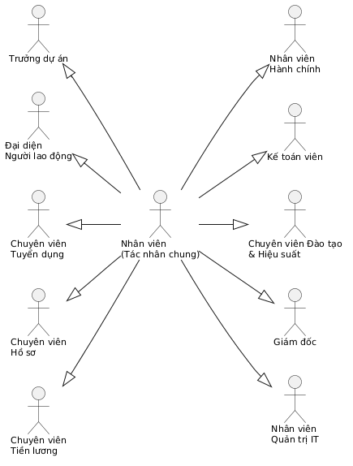

Về kiến trúc phân quyền thực tế trên phần mềm HRMIS, hệ thống nhóm các tác nhân vào **ba vai toàn cục** theo ma trận phân quyền: `USER` (toàn thể nhân viên và trưởng dự án - tự phục vụ và nghiệp vụ nhóm), `KM_MANAGER` (chuyên viên các phòng thuộc Khối HR, Kế toán Khối FIN, Nhân viên Hành chính - IT Khối OPS chủ trì nghiệp vụ vận hành), `ADMIN` (Ban Giám đốc và Quản trị IT - kiểm soát tối cao, phân quyền và khóa dữ liệu). Đồng thời, hệ thống kết hợp cơ chế kiểm soát truy cập dựa trên phạm vi dữ liệu đơn vị (Data Scope) để đảm bảo tính phân tách và bảo mật giữa 38 đơn vị tổ chức.

### 2.1.2. Danh sách Use case và phân nhóm nhiệm vụ

Hệ thống được tổ chức thành **47 Use case chia 12 nhóm** nhằm bảo đảm tính bao đóng và phân tách trách nhiệm đúng theo cơ cấu tổ chức.

**Bảng 2.3. Danh sách Use case của Hệ thống Quản trị nhân lực HRMIS**

| STT                                | Mã   | Tên Use case                  | Tác nhân chính                    |
| ---------------------------------- | ---- | ----------------------------- | --------------------------------- |
| **Nhóm A - Quản trị hệ thống**     |      |                               |                                   |
| 1                                  | UC01 | Đăng nhập                     | Tất cả nhân viên                  |
| 2                                  | UC02 | Quản lý tài khoản             | Nhân viên IT                      |
| 3                                  | UC03 | Quản lý cây tổ chức           | Nhân viên IT                      |
| **Nhóm B - Tuyển dụng**            |      |                               |                                   |
| 4                                  | UC04 | Lập phiếu đề xuất tuyển dụng  | Trưởng dự án                      |
| 5                                  | UC05 | Thẩm định chỉ tiêu tuyển dụng | CV tuyển dụng, Kế toán            |
| 6                                  | UC06 | Phê duyệt chỉ tiêu tuyển dụng | Giám đốc                          |
| 7                                  | UC07 | Quản lý hồ sơ ứng viên        | CV tuyển dụng, Ứng viên           |
| 8                                  | UC08 | Gửi thư mời và xếp lương      | CV tuyển dụng                     |
| **Nhóm C - Hồ sơ - Thử việc**      |      |                               |                                   |
| 9                                  | UC09 | Quản lý hồ sơ nhân viên       | CV hồ sơ                          |
| 10                                 | UC10 | Quản lý hợp đồng lao động     | CV hồ sơ                          |
| 11                                 | UC11 | Quản lý văn bằng - chứng chỉ  | CV hồ sơ                          |
| 12                                 | UC12 | Mượn - trả hồ sơ bản gốc | Nhân viên, CV hồ sơ   |
| 13                                 | UC13 | Đánh giá thử việc             | Trưởng dự án                      |
| **Nhóm D - Biến động nhân sự**     |      |                               |                                   |
| 14                                 | UC14 | Đề xuất thuyên chuyển         | Trưởng dự án                      |
| 15                                 | UC15 | Đề xuất điều chỉnh lương      | Trưởng dự án                      |
| 16                                 | UC16 | Đề xuất khen thưởng - kỷ luật | Trưởng dự án, ĐLNLĐ               |
| 17                                 | UC17 | Xử lý thôi việc               | Nhân viên, CV hồ sơ và các bộ phận|
| **Nhóm E - Chấm công - Nghỉ phép** |      |                               |                                   |
| 18                                 | UC18 | Ghi nhận chấm công            | Nhân viên, CV hồ sơ (đồng bộ máy) |
| 19                                 | UC19 | Đăng ký làm thêm giờ          | Nhân viên, Trưởng dự án           |
| 20                                 | UC20 | Đăng ký nghỉ phép             | Nhân viên, quản lý duyệt          |
| 21                                 | UC21 | Chốt bảng chấm công           | CV tiền lương, Trưởng dự án       |
| 26                                 | UC26 | Điểm danh bằng mã QR          | Nhân viên (kiosk xoay mã 30 giây) |
| 27                                 | UC27 | Điểm danh bằng khuôn mặt      | Nhân viên (trình duyệt, WASM)     |
| **Nhóm F - Lương - Báo cáo**       |      |                               |                                   |
| 22                                 | UC22 | Cấu hình công thức lương      | CV tiền lương                     |
| 23                                 | UC23 | Tính bảng lương hằng tháng    | CV tiền lương                     |
| 24                                 | UC24 | Duyệt bảng lương              | CV tiền lương, Quản trị viên      |
| 25                                 | UC25 | Quản lý thông tin cá nhân phân cấp 3 mức độ | Nhân viên                         |
| **Nhóm G - Cổng tự phục vụ & Ca kíp** *(bổ sung)* | |                          |                                   |
| 28                                 | UC28 | Sử dụng cổng tự phục vụ ESS   | Toàn thể nhân viên                |
| 29                                 | UC29 | Giải trình bổ sung giờ công   | Nhân viên; quản lý duyệt          |
| 30                                 | UC30 | Quản lý ca kíp & bảng phân ca | CV tiền lương/nhân sự             |
| **Nhóm H - Tiền lương & Phúc lợi mở rộng** *(bổ sung)* | |                       |                                   |
| 31                                 | UC31 | Vận hành bảng lương tự động   | CV tiền lương                     |
| 32                                 | UC32 | Quản lý khoản vay & tạm ứng   | Nhân viên; CV tiền lương duyệt    |
| 33                                 | UC33 | Quản lý công tác phí          | Nhân viên; CV tiền lương duyệt    |
| 34                                 | UC34 | Quản lý cấp phát - thu hồi tài sản | NV hành chính                |
| **Nhóm I - Tuyển dụng & Phát triển nâng cao** *(bổ sung)* | |                    |                                   |
| 35                                 | UC35 | Vận hành ATS Kanban & chuyển ứng viên thành nhân viên | CV tuyển dụng |
| 36                                 | UC36 | Đánh giá hiệu suất KRA/KPI & phản hồi 360 độ | CV nhân sự, Trưởng dự án, nhân viên |
| 37                                 | UC37 | Quản trị đào tạo & tiếp nhận khiếu nại | CV nhân sự, nhân viên     |
| **Nhóm J - Chuẩn cán bộ - công chức (BNV)** *(bổ sung)* | |                        |                                   |
| 38                                 | UC38 | Quản lý hồ sơ cán bộ toàn diện 2C-BNV | CV hồ sơ                  |
| 39                                 | UC39 | Quản lý danh mục ngạch bậc lương (NĐ 204) | CV hồ sơ                |
| 40                                 | UC40 | Quét & phê duyệt nâng bậc lương tự động | CV hồ sơ; Giám đốc duyệt |
| 41                                 | UC41 | Xuất mẫu biểu nhà nước (SYLL 2C PDF; Biểu 01-03 Excel) | CV hồ sơ  |
| **Nhóm K - Tri thức nội bộ** *(bổ sung)* | |                                |                                   |
| 42                                 | UC42 | Quản lý không gian tri thức & bài viết | Toàn bộ (soạn: CONTRIBUTOR trở lên) |
| 43                                 | UC43 | Tìm kiếm tri thức toàn văn & tìm chuyên gia | Toàn bộ                     |
| 44                                 | UC44 | Lộ trình hội nhập & bàn giao công việc | Nhân viên mới/người nghỉ; CV hồ sơ |
| **Nhóm L - Điều hành & Quản trị** *(bổ sung)* | |                             |                                   |
| 45                                 | UC45 | Xem bảng điều khiển điều hành theo vai | Toàn bộ                   |
| 46                                 | UC46 | Tra cứu nhật ký kiểm toán & cấu hình tham số | Nhân viên IT              |
| 47                                 | UC47 | Thẩm định đề xuất điều chỉnh hồ sơ Mức 2 | CV hồ sơ, Quản trị viên |

### 2.1.3. Đặc tả các Use case

**Bảng 2.4. Đặc tả tổng hợp các Use case của hệ thống HRMIS**

| Mã UC | Tác nhân chính              | Mục đích - Luồng xử lý                                                                                                                                                                                                                                                                                                                 |
| ----- | --------------------------- | ---------------------------------------------------------------------------------------------------------------------------------------------------------------------------------------------------------------------------------------------------------------------- |
| UC01  | Tất cả nhân viên            | Mục đích: Bảo mật và cấp quyền hệ thống. Luồng xử lý: Tác nhân nhập tên đăng nhập/mật khẩu. Hệ thống đối chiếu CSDL, hợp lệ thì vào giao diện theo vai trò; sai thì báo lỗi; sai 5 lần liên tiếp khóa tài khoản 15 phút.                                                                                                               |
| UC02  | Nhân viên IT                | Mục đích: Kiểm soát vòng đời tài khoản. Luồng xử lý: Thêm/sửa/khóa tài khoản, gán vai trò. Hệ thống ghi nhật ký mọi thay đổi.                                                                                                                                                                                                          |
| UC03  | Nhân viên IT                | Mục đích: Cây tổ chức là dữ liệu cấu hình. Luồng xử lý: Vẽ/sửa cây phòng ban, khai báo vị trí việc làm kèm định biên. Hệ thống tự tính số hiện hữu so định biên của từng đơn vị.                                                                                                                                                       |
| UC04  | Trưởng dự án                | Mục đích: Số hóa bước phát hiện thiếu hụt và trình duyệt chỉ tiêu. Luồng xử lý: Lập phiếu (vị trí, số lượng, lý do) → luồng duyệt ba tầng: CV tuyển dụng thẩm định → Kế toán xác nhận quỹ → Giám đốc ký. Duyệt xong tự mở kế hoạch tuyển.                                                                                              |
| UC05  | CV tuyển dụng, Kế toán      | Mục đích: Thẩm định tính hợp lệ của chỉ tiêu. Luồng xử lý: Đối chiếu nội quy, định biên; nếu có người nội bộ phù hợp → gợi ý luân chuyển, dừng luồng; yêu cầu và nhận xác nhận quỹ lương từ Kế toán.                                                                                                                                   |
| UC06  | Giám đốc                    | Mục đích: Quyết định cuối cùng. Luồng xử lý: Xem tờ trình điện tử, ký duyệt từ xa hoặc điều chỉnh/từ chối kèm ý kiến; hệ thống lưu vết và phản hồi Trưởng dự án.                                                                                                                                                                       |
| UC07  | CV tuyển dụng, Ứng viên     | Mục đích: Ống dẫn ứng viên đa kênh. Luồng xử lý: Tiếp nhận hồ sơ online/trực tiếp nhập chung một nơi → sàng lọc → phỏng vấn → lưu phiếu đánh giá có điểm số.                                                                                                                                                                           |
| UC08  | CV tuyển dụng               | Mục đích: Chốt ứng viên đạt và mức lương. Luồng xử lý: Soạn thư mời (chức danh, mức lương, ngày nhận việc); vượt khung lương → trình Giám đốc duyệt riêng; ứng viên chấp nhận → chuyển sang luồng hội nhập.                                                                                                                            |
| UC09  | CV hồ sơ                    | Mục đích: Quản lý hồ sơ điện tử. Luồng xử lý: Thêm/sửa thông tin nhân viên (họ tên, ngày sinh, quê quán, dân tộc, căn cước), đổi trạng thái làm việc; mỗi thay đổi ghi vào lịch sử công tác.                                                                                                                                           |
| UC10  | CV hồ sơ                    | Mục đích: Vòng đời hợp đồng. Luồng xử lý: Ký mới, gia hạn, ký phụ lục; hệ thống lưu đầy đủ ngày hiệu lực/hết hạn phục vụ theo dõi vòng đời.                                                                                                                                  |
| UC11  | CV hồ sơ                    | Mục đích: Kho lưu trữ kép. Luồng xử lý: Lưu văn bằng chứng chỉ kèm bản quét, số hiệu, nơi cấp, vị trí tủ lưu trữ vật lý.                                                                                                                                                                                                               |
| UC12  | Nhân viên, CV hồ sơ         | Mục đích: Mượn - trả bản gốc không thất lạc. Luồng xử lý: Nhân viên gửi yêu cầu mượn → CV hồ sơ duyệt → hệ thống nhắc hạn trả → trả xong xác nhận; đang mượn thì giấy tờ tô đỏ trên hồ sơ.                                                                                                           |
| UC13  | Trưởng dự án                | Mục đích: Kết thúc kỳ thử việc đúng hạn. Luồng xử lý: Trước ngày hết hạn thử việc, Trưởng dự án điền phiếu đánh giá; đạt → sinh nhiệm vụ ký hợp đồng chính thức + xếp lương (≥85% lương thử việc); không đạt → sinh nhiệm vụ chấm dứt hợp đồng thử việc.                                   |
| UC14  | Trưởng dự án                | Mục đích: Điều chuyển nhân sự giữa các nhóm/trung tâm. Luồng xử lý: Đề xuất kèm xác nhận bàn giao hai phía → duyệt → hệ thống tự đổi đơn vị - chức danh và quyền truy cập.                                                                                                                                                             |
| UC15  | Trưởng dự án                | Mục đích: Điều chỉnh lương theo hiệu lực. Luồng xử lý: Đề xuất mức mới + ngày hiệu lực → duyệt → hệ thống ghi lịch sử lương; hiệu lực giữa tháng tự tính ghép theo tỷ lệ ngày.                                                                                                                                                         |
| UC16  | Trưởng dự án, ĐLNLĐ         | Mục đích: Khen thưởng - kỷ luật đúng thủ tục. Luồng xử lý: Đề xuất kèm minh chứng; kỷ luật bắt buộc qua bước ý kiến đại diện người lao động; quyết định có hiệu lực được lưu vết bất biến kèm mức thưởng/khấu trừ để chuyển xuống chu kỳ lương.                                                                              |
| UC17  | Nhân viên và các bộ phận    | Mục đích: Thôi việc đúng checklist. Luồng xử lý: Đơn thôi việc → duyệt → **tự sinh checklist 5 mục xác nhận** (bàn giao việc - thu hồi tài sản - thu hồi tài khoản IT - quyết toán kế toán - xóa mẫu khuôn mặt) → đủ 5 mục mới cho phát hành quyết định chấm dứt hợp đồng và đóng hồ sơ.                                                |
| UC18  | Nhân viên, CV hồ sơ         | Mục đích: Ghi nhận giờ công đa nguồn. Luồng xử lý: Nhân viên check-in/out trên ứng dụng; quét mã QR tại kiosk (UC26); điểm danh khuôn mặt trên trình duyệt (UC27); CV hồ sơ đồng bộ dữ liệu máy chấm công qua webhook/CSV. Hệ thống ghép ca, tính đi muộn/về sớm, sinh bảng công ngày; bản ghi thiếu vào/ra đánh dấu "lệch" chờ xử lý. |
| UC19  | Nhân viên, Trưởng dự án     | Mục đích: Kiểm soát giờ làm thêm. Luồng xử lý: Nhân viên đăng ký kèm lý do → quản lý duyệt. Chưa duyệt thì giờ làm thêm không được tính tiền. Hệ số 150%/200%/300%; giám sát trần ≤ 40h/tháng, ≤ 200h/năm.                                                                                                                              |
| UC20  | Nhân viên, quản lý duyệt    | Mục đích: Quản lý quỹ phép minh bạch. Luồng xử lý: Tạo đơn → hệ thống kiểm quỹ (chặn đơn vượt quỹ ngay khi gửi) → chuyên viên nhân sự duyệt → **trừ quỹ NGAY** và tự ghi công phép vào bảng công. Quỹ không đủ thì chặn đơn.                                    |
| UC21  | CV tiền lương, Trưởng dự án | Mục đích: Chốt công chuẩn xác. Luồng xử lý: Hợp nhất bảng công tháng, xử lý bản ghi lệch, trình Trưởng dự án xác nhận theo nhóm, chốt ngày 25 và khóa bảng công.                                                                           |
| UC22  | CV tiền lương               | Mục đích: Cấu trúc lương linh hoạt. Luồng xử lý: Định nghĩa thành phần lương (cơ bản, phụ cấp, BHXH, thuế TNCN) kèm công thức và thứ tự tính; chạy thử trên nhân viên mẫu trước khi lưu.                                                                                                                                               |
| UC23  | CV tiền lương               | Mục đích: Tính lương đúng, có vết. Luồng xử lý: Nạp lương cơ bản từ hợp đồng ACTIVE + giờ OT đã duyệt → tính BHXH 10,5%, thuế TNCN lũy tiến 7 bậc (giảm trừ 11 triệu + 4,4 triệu/người phụ thuộc), trừ góp vay EMI → sinh phiếu lương từng nhân viên. *(Thưởng/phạt từ quyết định và tạm ứng chưa tự nạp - hạn chế đã biết.)*             |
| UC24  | CV tiền lương, Quản trị viên| Mục đích: Kiểm soát và khóa bất biến. Luồng xử lý: Chu trình kỳ `OPEN → CALCULATED → REVIEWED → LOCKED`; sau khóa, mọi lời gọi tính lại bị chặn (lỗi 409); xuất phiếu lương điện tử, bảng kê chi lương ngân hàng.                                                                                                                      |
| UC25  | Nhân viên                   | Mục đích: Quản trị thông tin cá nhân phân cấp 3 mức độ (3-Tier Profile Governance). Luồng xử lý: Nhân viên xem toàn bộ hồ sơ; tự sửa thông tin liên lạc (Mức 1); gửi đề xuất điều chỉnh thông tin định danh pháp lý và tài chính (CCCD, ngày sinh, quê quán, số tài khoản ngân hàng, mã số thuế - Mức 2) kèm lý do và tài liệu minh chứng đính kèm; hệ thống khóa chỉ xem đối với thông tin vị trí và pháp lý lao động (Mức 3). |
| UC28  | Toàn thể nhân viên          | Mục đích: Siêu ứng dụng cá nhân. Luồng xử lý: Trên một màn hình ESS: điểm danh nhanh, gửi giải trình công, tra cứu quỹ phép năm, phiếu lương điện tử, tài sản đang giữ, khoản vay & tiến độ trả nợ.                                                                                                                                     |
| UC29  | Nhân viên; quản lý duyệt    | Mục đích: Xử lý bản ghi công lệch. Luồng xử lý: Nhân viên chọn ngày thiếu công, nhập giờ vào/ra thực tế + lý do (quên quẹt, công tác ngoài) → quản lý duyệt → hệ thống bù công vào bảng chấm công.                                                                                                                                      |
| UC30  | CV tiền lương/nhân sự       | Mục đích: Quản lý giờ làm theo ca. Luồng xử lý: Định nghĩa loại ca + dung sai đi trễ; phân ca tuần/tháng cho từng nhân sự; theo dõi chuyên cần.                                                                                                                                                                                        |
| UC31  | CV tiền lương               | Mục đích: Bảng lương tự động đa thành phần. Luồng xử lý: Định nghĩa thành phần thu nhập/khấu trừ + cấu trúc lương gán nhân viên → chạy kỳ 1-click sinh phiếu cho toàn bộ nhân sự kèm breakdown từng khoản → xuất bảng kê chi lương ngân hàng.                                                                                           |
| UC32  | Nhân viên; CV tiền lương    | Mục đích: Phúc lợi vay/tạm ứng an toàn. Luồng xử lý: Tạo đơn (số tiền, kỳ hạn 1-24 tháng) → hệ thống kiểm **EMI ≤ 30% lương thực lĩnh** → duyệt giải ngân → EMI tự nạp vào bảng lương đến hết nợ.                                                                                                                                       |
| UC33  | Nhân viên; CV tiền lương    | Mục đích: Chi phí công tác minh bạch. Luồng xử lý: Đề xuất chuyến đi → duyệt lịch trình → tạm ứng kinh phí → lập bảng kê chi phí + chứng từ → duyệt quyết toán.                                                                                                                                                                        |
| UC34  | NV hành chính               | Mục đích: Kiểm soát tài sản theo BLLĐ 129-130. Luồng xử lý: Đăng ký tài sản → cấp phát kèm biên bản bàn giao → trạng thái đang sử dụng → thu hồi về kho khi chuyển vị trí/thôi việc.                                                                                                                                                    |
| UC35  | CV tuyển dụng               | Mục đích: Ống dẫn tuyển trực quan. Luồng xử lý: Quản lý vị trí mở; kéo-thả ứng viên qua pipeline Sàng lọc → PV vòng 1 → PV vòng 2 → Offer → Nhận việc; nút "Chuyển thành nhân viên" tự sinh hồ sơ + hợp đồng thử việc.                                                                                                                  |
| UC36  | CV nhân sự, Trưởng dự án, nhân viên | Mục đích: Đánh giá minh bạch đa chiều. Luồng xử lý: Tạo kỳ đánh giá → gán mục tiêu KRA/KPI theo trọng số % → nhân viên tự đánh giá + phản hồi 360 độ → quản lý chấm điểm → nhân viên xác nhận.                                                                                                                          |
| UC37  | CV nhân sự, nhân viên       | Mục đích: Phát triển đội ngũ & bảo vệ quyền lợi. Luồng xử lý: Lập chương trình đào tạo → ghi danh (chặn khi hết chỗ) → hoàn thành + khảo sát; kênh khiếu nại OPEN → RESOLVED có hồ sơ.                                                                                                                                                  |
| UC38  | CV hồ sơ                    | Mục đích: Hồ sơ lý lịch chuẩn nhà nước. Luồng xử lý: Quản lý 111 thuộc tính Mẫu 2C-BNV/2008 + 8 bảng quá trình lịch sử (lương, bổ nhiệm, đào tạo, công tác, khen thưởng - kỷ luật, gia đình, đánh giá, hoạt động xã hội) gắn 1-1 với tài khoản nhân viên.                                                                                |
| UC39  | CV hồ sơ                    | Mục đích: Thang lương chuẩn NĐ 204. Luồng xử lý: Quản lý danh mục 184 ngạch (A3/A2/A1/B/C), số bậc 6-16, hệ số từng bậc, chu kỳ giữ bậc 24/36 tháng.                                                                                                                                                                                   |
| UC40  | CV hồ sơ; Giám đốc duyệt    | Mục đích: Không sót người đủ điều kiện. Luồng xử lý: Quét tự động người đủ thời gian giữ bậc → sinh danh sách đề nghị → duyệt → cập nhật ngạch/bậc/hệ số; bậc trần tính vượt khung 5% + 1%/năm.                                                                                                                                         |
| UC41  | CV hồ sơ                    | Mục đích: Xuất biểu mẫu chuẩn quốc gia. Luồng xử lý: Kết xuất Sơ yếu lý lịch Mẫu 2C-BNV/2008 PDF 4 trang; Biểu 01 (tuổi × ngạch), Biểu 02 (ngoại ngữ), Biểu 03 (trình độ × đơn vị) dạng Excel.                                                                                                                                          |
| UC42  | Toàn bộ (soạn: CONTRIBUTOR trở lên) | Mục đích: Chống thất thoát tri thức. Luồng xử lý: Space phân cấp visibility; bài viết Markdown + đính kèm chạy luồng DRAFT → CHỜ DUYỆT → ĐÃ XUẤT BẢN/LƯU TRỮ; sửa bài sinh phiên bản mới bất biến + khôi phục được; bình luận hỏi-đáp.                                                                                           |
| UC43  | Toàn bộ                     | Mục đích: "Cần tìm thì tìm ra". Luồng xử lý: Tìm kiếm toàn văn (tiêu đề + nội dung + tag) lọc phạm vi quyền ngay trong SQL; directory "ai biết về X" theo hồ sơ chuyên môn.                                                                                                                                                             |
| UC44  | Nhân viên mới/người nghỉ; CV hồ sơ | Mục đích: Vào - ra không sót việc. Luồng xử lý: Lộ trình đọc bắt buộc + tick tiến độ cho nhân viên mới; khi duyệt thôi việc tự sinh checklist bàn giao 5 mục, đủ xác nhận mới đóng hồ sơ.                                                                                                                                        |
| UC45  | Toàn bộ (theo vai)          | Mục đích: Điều hành dựa trên dữ liệu. Luồng xử lý: Dashboard hiển thị tổng nhân sự, có mặt hôm nay, quỹ lương kỳ gần nhất, các đơn chờ duyệt.                                                                                                                                                                                           |
| UC46  | Nhân viên IT                | Mục đích: Truy vết và cấu hình. Luồng xử lý: Tra cứu audit log append-only (ai, làm gì, lúc nào, trước/sau); chỉnh tham số key-value không cần triển khai lại.                                                                                                          |
| UC47  | CV hồ sơ, Quản trị viên     | Mục đích: Thẩm định và phê duyệt đề xuất điều chỉnh hồ sơ Mức 2. Luồng xử lý: Tiếp nhận đề xuất từ hàng đợi thẩm định; đối chiếu thông tin hiện tại với thông tin đề xuất và tài liệu minh chứng đính kèm; phê duyệt (APPROVED - hệ thống tự động cập nhật vào CSDL và ghi AuditLog) hoặc từ chối (REJECTED) kèm lý do phản hồi cho nhân viên. |

**Bảng 2.5. Đặc tả chi tiết các Use case trọng yếu** (khuôn hai cột Người dùng - Hệ thống)

**UC04 - Lập phiếu đề xuất tuyển dụng** (số hóa Quy trình Tuyển dụng)

| #   | Người dùng                                                   | Hệ thống                                                              |
| --- | ------------------------------------------------------------ | --------------------------------------------------------------------- |
| 1   | Trưởng dự án chọn "Đề xuất tuyển dụng"                       | Hiển thị form kèm định biên - số hiện hữu của nhóm                    |
| 2   | Chọn vị trí, nhập số lượng, lý do, thời gian cần người; gửi  | Lưu phiếu "Chờ thẩm định", thông báo CV tuyển dụng                    |
| 3   | CV tuyển dụng rà đối chiếu nội quy, định biên                | Nếu có người nội bộ phù hợp → gợi ý luân chuyển, dừng luồng           |
| 4   | CV tuyển dụng yêu cầu xác nhận quỹ                           | Gửi yêu cầu song song tới Kế toán                                     |
| 5   | Kế toán xác nhận khả năng chi                                | Chuyển phiếu "Chờ phê duyệt", thông báo Giám đốc                      |
| 6   | Giám đốc ký duyệt từ xa (hoặc điều chỉnh/từ chối kèm ý kiến) | "Đã duyệt" → tự kích hoạt kế hoạch tuyển; trả kết quả về Trưởng dự án |

**UC08 - Gửi thư mời và xếp lương**

| #   | Người dùng                                                                | Hệ thống                                                                  |
| --- | ------------------------------------------------------------------------- | ------------------------------------------------------------------------- |
| 1   | CV tuyển dụng soạn thư mời (chức danh, mức lương đề nghị, ngày nhận việc) | Đối chiếu mức lương với thang bảng                                        |
| 2   | -                                                                         | Vượt khung → tự chuyển trình Giám đốc duyệt riêng; trong khung → gửi ngay |
| 3   | Ứng viên nhận và chấp nhận thư mời                                        | Cập nhật "Đã nhận việc", chuyển ứng viên sang luồng hội nhập (UC09)       |

**UC13 - Đánh giá thử việc** (số hóa Quy trình Thử việc - xếp lương chính thức)

| #   | Người dùng                                                           | Hệ thống                                                                                                                             |
| --- | -------------------------------------------------------------------- | ------------------------------------------------------------------------------------------------------------------------------------ |
| 1   | -                                                                    | Trước ngày hết hạn thử việc 7 ngày, tự nhắc Trưởng dự án đánh giá                               |
| 2   | Trưởng dự án điền phiếu đánh giá (chuyên môn, thái độ, tiến độ); gửi | Đạt → sinh nhiệm vụ ký hợp đồng chính thức + quyết định xếp lương cho CV hồ sơ; không đạt → sinh nhiệm vụ chấm dứt hợp đồng thử việc |
| 3   | CV hồ sơ thực hiện nhiệm vụ, trình Giám đốc ký                       | Cập nhật trạng thái nhân viên: Thử việc → Chính thức (hoặc Dừng)                                                                     |

**UC17 - Xử lý thôi việc** (số hóa Quy trình Thôi việc)

| #   | Người dùng                                        | Hệ thống                                                                   |
| --- | ------------------------------------------------- | -------------------------------------------------------------------------- |
| 1   | Nhân viên nộp đơn thôi việc (ngày hiệu lực)      | Lưu "Chờ duyệt", thông báo quản lý                                         |
| 2   | Quản trị viên duyệt đơn                          | **Tự sinh checklist bàn giao 5 mục**, thông báo các bên liên quan          |
| 3   | Trưởng dự án xác nhận đã bàn giao công việc      | Đánh dấu (1/5)                                                             |
| 4   | Nhân viên hành chính xác nhận thu hồi tài sản    | (2/5)                                                                      |
| 5   | Nhân viên IT xác nhận thu hồi tài khoản          | (3/5) - ngày làm cuối, tài khoản tự khóa                                   |
| 6   | Kế toán xác nhận quyết toán                      | (4/5)                                                                      |
| 7   | Xác nhận xóa mẫu khuôn mặt (dữ liệu sinh trắc học)| (5/5) - nút "Phát hành quyết định" mới bật                                 |
| 8   | CV hồ sơ phát hành quyết định, trình Giám đốc ký | Hồ sơ chuyển "Lưu trữ - đã nghỉ"                                           |

**UC20 - Đăng ký nghỉ phép**

| #   | Người dùng                                    | Hệ thống                                                                                                                                               |
| --- | --------------------------------------------- | ------------------------------------------------------------------------------------------------------------------------------------------------------ |
| 1   | Nhân viên chọn "Xin nghỉ phép"                | Hiển thị số dư phép và form tạo đơn                                                                                                                    |
| 2   | Nhập loại phép, từ ngày, đến ngày, lý do; gửi | Kiểm tra số dư quỹ phép theo ngày nghỉ                                                                                                                 |
| 3   | -                                             | Quỹ đủ → lưu "Đã trình", thông báo quản lý; quỹ không đủ → từ chối kèm số dư còn lại       |
| 4   | Quản lý duyệt/từ chối                         | Duyệt → **trừ quỹ NGAY**, tự ghi công phép vào bảng công các ngày nghỉ; từ chối → lưu lý do. Thông báo kết quả cho nhân viên                            |

**UC23 - Tính bảng lương hằng tháng** (số hóa Quy trình Chu kỳ lương hàng tháng)

| #   | Người dùng                           | Hệ thống                                                                                                                            |
| --- | ------------------------------------ | ----------------------------------------------------------------------------------------------------------------------------------- |
| 1   | CV tiền lương chuẩn bị dữ liệu công  | Bảng công + OT đã duyệt + đơn phép là đầu vào                                                                                        |
| 2   | Bấm "Tính lương" / "1-Click Xử lý"   | Tính gross từ cấu trúc lương + OT (hệ số 150/200/300%) → khấu trừ BHXH 10,5% → thuế TNCN lũy tiến 7 bậc (giảm trừ 11 triệu + 4,4 triệu/người phụ thuộc) → trừ EMI vay → sinh phiếu lương từng nhân viên |
| 3   | CV tiền lương đối chiếu              | Khớp → chuyển "REVIEWED"; lệch → ghi chú, tính lại (giữ vết audit)                                                                    |
| 4   | ADMIN duyệt và **khóa kỳ**           | Trạng thái LOCKED - **mọi lời gọi tính lại bị chặn lỗi 409**; xuất bảng kê chi lương ngân hàng; nhân viên xem phiếu lương điện tử      |

**UC26 - Điểm danh bằng mã QR** (bổ sung kênh đa nguồn cho UC18)

| #   | Người dùng                                                             | Hệ thống                                                                                                                  |
| --- | ---------------------------------------------------------------------- | ------------------------------------------------------------------------------------------------------------------------- |
| 1   | -                                                                      | Kiosk gọi endpoint **công khai** sinh token ký HMAC {kiosk_id, iat, jti} hết hạn 30 giây; hiển thị mã QR và tự xoay mã mới mỗi 30 giây |
| 2   | Nhân viên quét mã bằng camera điện thoại, xác nhận trên trang check-in | Kiểm tra chữ ký, thời hạn ≤ 60 giây, jti chỉ dùng một lần (chặn chụp ảnh tái sử dụng), chưa check-in trong khoảng ±2 phút |
| 3   | -                                                                      | Hợp lệ → ghi sự kiện điểm danh thô (bất biến, nguồn = QR) → tự tổng hợp bảng công ngày (giờ vào, phút đi muộn)            |
| 4   | Nhân viên nhận phản hồi "Chấm công 08:02 ✓"                            | Thiếu giờ ra cuối ngày hoặc trùng lặp → đánh dấu "lệch" đưa vào hàng đợi xử lý                                            |

**UC27 - Điểm danh bằng khuôn mặt** (bổ sung kênh đa nguồn cho UC18)

| #   | Người dùng                                                          | Hệ thống                                                                                                                    |
| --- | ------------------------------------------------------------------- | --------------------------------------------------------------------------------------------------------------------------- |
| 1   | Nhân viên đăng ký mẫu: tick đồng thuận thu thập dữ liệu sinh trắc học | Trình duyệt trích vector đặc trưng từ 3-5 ảnh quay mặt (không gửi ảnh gốc); vector mã hóa AES-256-GCM trước khi lưu (FaceEmbedding) |
| 2   | Nhân viên chọn "Điểm danh khuôn mặt" trên trình duyệt tại văn phòng | Trích vector thời gian thực, so khớp cosine similarity với các mẫu đã mã hóa; vượt ngưỡng → ghi sự kiện (nguồn = khuôn mặt) |
| 3   | -                                                                   | Không khớp / chưa đăng ký → từ chối rõ ràng; giới hạn số lần thử để chống dò; nhật ký chỉ ghi kết quả, không ghi vector     |

**UC32 - Quản lý khoản vay & tạm ứng** *(use case bổ sung khi cài đặt)*

| #   | Người dùng                                        | Hệ thống                                                                                     |
| --- | ------------------------------------------------- | ---------------------------------------------------------------------------------------------- |
| 1   | Nhân viên tạo đơn (loại vay/tạm ứng, số tiền, kỳ hạn 1-24 tháng) | Hệ thống tính EMI hàng tháng và **kiểm tra EMI ≤ 30% lương thực lĩnh** (Điều 102 BLĐ 2019) |
| 2   | -                                                 | Vượt trần → chặn kèm thông báo; đạt → chuyển "Chờ thẩm định"                                  |
| 3   | KM_MANAGER duyệt giải ngân                        | Trạng thái APPROVED; EMI **tự nạp vào bảng lương** hàng tháng (LOAN_EMI)                       |
| 4   | Nhân viên xem tiến độ                             | Hiển thị dư nợ còn lại, số kỳ đã trả trên `/loans` và `/ess`                                   |

**UC40 - Quét & phê duyệt nâng bậc lương tự động** *(use case bổ sung - chuẩn NĐ 204)*

| #   | Người dùng                                        | Hệ thống                                                                                     |
| --- | ------------------------------------------------- | ---------------------------------------------------------------------------------------------- |
| 1   | KM_MANAGER bấm "Quét nâng bậc"                    | Hệ thống đối chiếu ngày hưởng bậc với chu kỳ giữ bậc: **36 tháng** (ngạch A1/A2/A3) hoặc **24 tháng** (ngạch B/C) |
| 2   | -                                                 | Sinh danh sách đề nghị nâng bậc thường xuyên; với bậc trần tính phụ cấp thâm niên vượt khung **5% + 1%/năm** |
| 3   | ADMIN duyệt danh sách                             | Cập nhật ngạch/bậc/hệ số + ghi PersonnelSalaryHistory (diễn biến tiền lương)                   |

**UC41 - Xuất mẫu biểu nhà nước** *(use case bổ sung)*

| #   | Người dùng                                        | Hệ thống                                                                                     |
| --- | ------------------------------------------------- | ---------------------------------------------------------------------------------------------- |
| 1   | KM_MANAGER chọn nhân viên → "Xuất 2C PDF"         | Kết xuất Sơ yếu lý lịch **Mẫu 2C-BNV/2008 chuẩn 4 trang** từ 111 thuộc tính + 8 bảng quá trình |
| 2   | KM_MANAGER chọn tab Biểu thống kê                 | Xuất **Biểu 01** (tuổi × ngạch), **Biểu 02** (ngoại ngữ), **Biểu 03** (trình độ × đơn vị) dạng Excel |

**UC25 - Quản lý thông tin cá nhân phân cấp 3 mức độ** (số hóa Quản trị Hồ sơ Nhân sự)

| #   | Người dùng                                                   | Hệ thống                                                              |
| --- | ------------------------------------------------------------ | --------------------------------------------------------------------- |
| 1   | Nhân viên truy cập trang Hồ sơ cá nhân (`/profile`)          | Hiển thị toàn diện hồ sơ chia 3 khối phân cấp: Mức 1 (Tự phục vụ), Mức 2 (Pháp lý nhân thân), Mức 3 (Tổ chức quản lý) |
| 2   | Nhân viên chỉnh sửa thông tin liên lạc Mức 1 (SĐT, tạm trú...) | Kiểm tra định dạng; lưu trực tiếp vào CSDL và cập nhật hiển thị ngay lập tức |
| 3   | Nhân viên chọn "Đề xuất thay đổi thông tin" (Mức 2)          | Mở modal đề xuất; cung cấp danh mục trường chuẩn hệ thống (Select) kèm badge phân nhóm và ô tìm kiếm |
| 4   | Chọn trường cần sửa, nhập giá trị mới, lý do và đính kèm tệp minh chứng (ảnh CCCD, bằng cấp...) | Kiểm tra điều kiện tiên quyết: bắt buộc có lý do và ít nhất một tệp minh chứng đính kèm (Hard stop) |
| 5   | Bấm "Gửi đề xuất"                                            | Tạo bản ghi `ProfileChangeRequest` trạng thái `PENDING`, gửi vào hàng đợi thẩm định của HR-OPS, thông báo gửi thành công |
| 6   | Nhân viên xem dữ liệu Mức 3 (chức vụ, ngạch bậc, lương...)   | Hiển thị chế độ chỉ xem (Disabled/Read-only); có nhãn giải thích rõ "Dữ liệu do tổ chức quản lý độc quyền" |

**UC47 - Thẩm định và phê duyệt đề xuất điều chỉnh hồ sơ Mức 2** (số hóa Kiểm soát Hồ sơ Pháp lý)

| #   | Người dùng                                                   | Hệ thống                                                              |
| --- | ------------------------------------------------------------ | --------------------------------------------------------------------- |
| 1   | CV hồ sơ (HR-OPS) hoặc ADMIN mở tab "Hàng đợi thẩm định hồ sơ" | Tải danh sách các đề xuất trạng thái `PENDING` kèm số lượng chờ duyệt |
| 2   | Chọn xem chi tiết một đề xuất                                | Hiển thị bảng đối chiếu trực quan: Thông tin nhân sự, Tên trường, Giá trị hiện tại ➡️ Giá trị mới đề xuất, Lý do thay đổi |
| 3   | Bấm xem tệp minh chứng pháp lý đính kèm                      | Mở xem trực tiếp tài liệu minh chứng (ảnh CCCD, văn bằng...) để kiểm tra tính xác thực |
| 4   | CV hồ sơ bấm "Chấp thuận" (Approve)                          | Thực thi atomic transaction: cập nhật trường tương ứng trên `User` / `PersonnelComprehensiveProfile`, đổi trạng thái yêu cầu sang `APPROVED`, ghi nhật ký kiểm toán bất biến `AuditLog` |
| 5   | (Hoặc) CV hồ sơ bấm "Từ chối" (Reject) kèm lý do giải trình | Bắt buộc nhập lý do từ chối; cập nhật trạng thái `REJECTED`, ghi `reviewerNote` và gửi thông báo phản hồi cho nhân viên |

**UC35 - Đăng tin tuyển dụng & Vận hành ATS Pipeline** (số hóa Tuyển dụng & Quản lý Ứng viên ATS)

| #   | Người dùng                                                   | Hệ thống                                                              |
| --- | ------------------------------------------------------------ | --------------------------------------------------------------------- |
| 1   | CV tuyển dụng (HR-TA) truy cập trang Quản trị Tuyển dụng ATS (`/recruitment-ats`) | Hiển thị Bảng Kanban ứng viên 6 giai đoạn, danh sách vị trí đang tuyển và các chỉ số KPI tuyển dụng |
| 2   | CV tuyển dụng bấm **"+ Đăng tin tuyển dụng"** (trên thanh tiêu đề hoặc tab "Tin Tuyển Dụng") | Mở modal portal Đăng tin tuyển dụng mới với các trường: Tiêu đề vị trí, Phòng ban, Chức danh, Chỉ tiêu số lượng, Kinh nghiệm tối thiểu, Khung lương, Hạn nhận hồ sơ, Mô tả công việc (JD), Yêu cầu ứng viên |
| 3   | Nhập thông tin và bấm **"Đăng tin tuyển dụng"**              | Kiểm tra tính hợp lệ; tạo bản ghi `JobOpening` (trạng thái OPEN), tự động đồng bộ vào bộ lọc và thẻ thống kê chỉ tiêu tuyển dụng |
| 4   | CV tuyển dụng bấm **"+ Tiếp nhận ứng viên"** (hoặc nhận CV nộp trực tuyến) | Mở modal tiếp nhận hồ sơ; nhập họ tên, email, SĐT, đường dẫn CV và chọn vị trí tuyển dụng tương ứng |
| 5   | Tiếp nhận ứng viên vào hệ thống                              | Tạo bản ghi `JobApplicant` gắn với `JobOpening`; tự động đưa thẻ ứng viên vào cột "Ứng tuyển mới" (APPLIED) trên bảng Kanban |
| 6   | CV tuyển dụng / Tech Lead kéo - thả thẻ ứng viên qua các cột quy trình ATS | Hệ thống cập nhật trạng thái `stage` thời gian thực (APPLIED ➡️ SCREENING ➡️ INTERVIEW_ROUND_1 ➡️ INTERVIEW_ROUND_2 ➡️ OFFER_SENT ➡️ HIRED) |
| 7   | Tại vòng phỏng vấn, chọn "Chấm điểm phỏng vấn"               | Mở Phiếu phỏng vấn điện tử (Scorecard); nhập vòng PV, người phỏng vấn, điểm số (thang 100) và nhận xét năng lực chi tiết |
| 8   | Tại vòng Đề xuất, chọn "Tạo Thư Mời (Offer)"                | Mở form tạo Offer; xác định chức danh công việc, mức lương thỏa thuận và ngày dự kiến nhận việc |
| 9   | Khi ứng viên đồng ý Offer, bấm **"1-Click Nhận việc"**       | Chuyển giai đoạn sang HIRED, tự động khởi tạo Hồ sơ nhân viên mới (`User`, `PersonnelComprehensiveProfile`), tạo hợp đồng thử việc và gán Lộ trình hội nhập (Onboarding) |

**Bảng 2.6. Danh mục tham số pháp lý của hệ thống**

| Tham số                  | Giá trị hiện hành                                      | Căn cứ             |
| ------------------------ | ------------------------------------------------------ | ------------------ |
| BHXH doanh nghiệp đóng   | 21,5%                                                  | Luật BHXH          |
| BHXH người lao động đóng | 10,5% (8% BHXH + 1,5% BHYT + 1% BHTN)                  | Luật BHXH          |
| Trần lương đóng bảo hiểm | 20 lần lương cơ sở                                     | Quy định hiện hành |
| Giảm trừ thuế TNCN       | 11 triệu/năm bản thân; 4,4 triệu/tháng người phụ thuộc | NQ 954/2020        |
| Biểu thuế lũy tiến       | 7 bậc: 5% → 35%                                        | Luật Thuế TNCN     |
| Lương làm thêm giờ       | 150% ngày thường; 200% ngày nghỉ tuần; 300% ngày lễ    | Điều 98 BLĐ 2019   |
| Trần giờ làm thêm        | ≤40 giờ/tháng; ≤200 giờ/năm                            | Điều 107 BLĐ 2019  |
| Phép năm                 | 12 ngày; +1 ngày/5 năm công tác                        | Điều 113-114 BLĐ 2019 |
| Lương thử việc           | Không thấp hơn 85% lương chính thức                    | Điều 26 BLĐ 2019   |
| Báo trước thôi việc      | 45 ngày (không xác định hạn); 30 ngày (xác định hạn)   | Điều 35 BLĐ 2019   |
| Trần khấu trừ nợ vay     | ≤ 30% lương thực lĩnh/tháng                            | Điều 102 BLĐ 2019  |
| Chu kỳ giữ bậc lương     | 36 tháng (ngạch A); 24 tháng (ngạch B, C)              | NĐ 204/2004/NĐ-CP  |
| Phụ cấp vượt khung       | 5% tại bậc trần; +1%/năm giữ bậc tiếp theo             | TT 08/2013/TT-BNV  |

### 2.1.4. Xây dựng biểu đồ Use case

**Biểu đồ Use case tổng quan:**

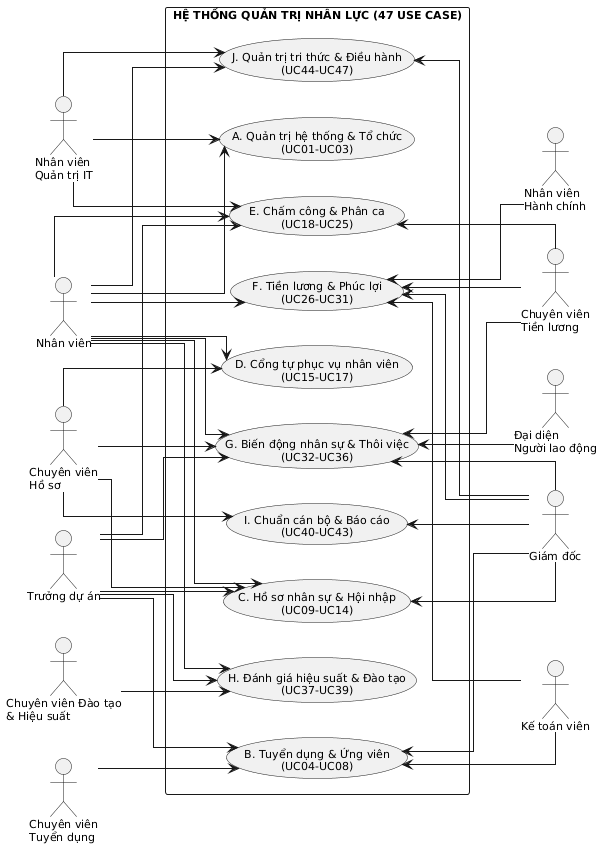

**Biểu đồ Use case nhóm B - Tuyển dụng** (đại diện cho cách vẽ chi tiết một nhóm; các nhóm còn lại nhân bản theo cùng khuôn):

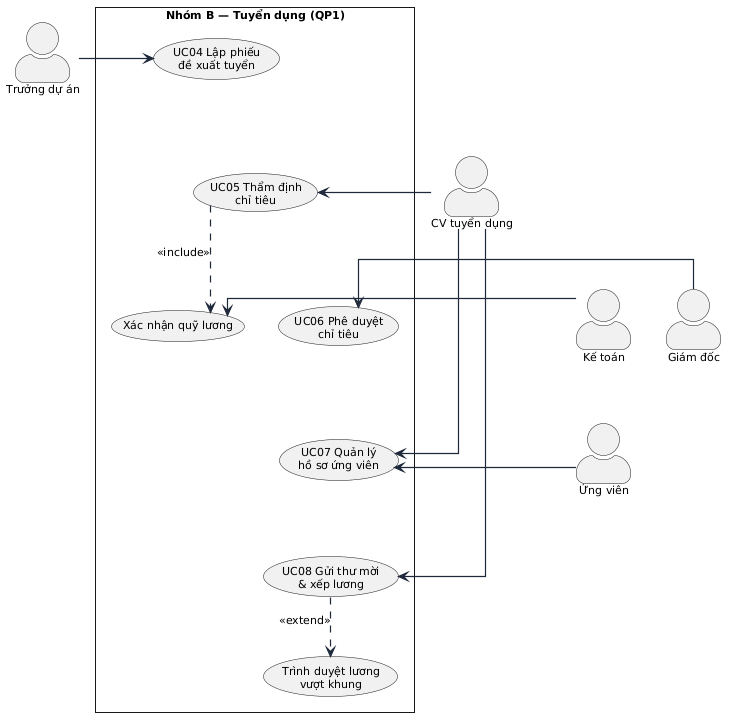

_Hình 2.3. Biểu đồ Use case nhóm B - Tuyển dụng. Quan hệ include/extend phản ánh đúng trình tự nghiệp vụ: lập phiếu tất yếu dẫn tới thẩm định, thẩm định tất yếu có xác nhận quỹ; chỉ khi mức lương vượt khung mới phát sinh bước trình duyệt riêng._

Toàn bộ mã PlantUML của hệ thống biểu đồ cho 47 use case (use case tổng quát và theo từng nhóm, trình tự, hoạt động, trạng thái, luồng dữ liệu liên phân hệ, gói tổng quan và gói theo từng use case, lớp theo nhóm gán rõ use case) được sinh thống nhất trong tài liệu kèm theo [`doc/PTTK_OOP_HR_DIAGRAMS.md`](PTTK_OOP_HR_DIAGRAMS.md); mọi biểu đồ đều khai báo `skinparam linetype ortho` để các đường nối kẻ thẳng vuông góc.

### 2.1.5. Phân tầng yêu cầu: từ quy trình nghiệp vụ đến use case hệ thống

Để bảo đảm tính minh bạch, nhất quán và chặt chẽ của hệ thống thông tin quản trị nhân lực, yêu cầu được phân rã khoa học theo mô hình ba tầng (Three-Tier Requirements Architecture):

- **Tầng 1 - Quy trình nghiệp vụ (Business Process):** Là chuỗi hoạt động của tổ chức doanh nghiệp được mô tả bằng ngôn ngữ quản trị (đã phân tích ở Chương 1). Tầng này phản ánh cách thức vận hành thực tế của Saigon Technology, giải quyết các mục tiêu kinh doanh độc lập với công nghệ phần mềm;
- **Tầng 2 - Use case nghiệp vụ (Business Use Case):** Phân rã mỗi quy trình thành chuỗi các bước tác nghiệp chuẩn mực: xác định rõ ai làm (vai trò), làm việc gì, căn cứ vào đâu, luân chuyển biểu mẫu/chứng từ pháp lý gì và các điểm kiểm soát rủi ro (Validation / Hard stop);
- **Tầng 3 - Use case hệ thống (System Use Case - UC):** Số hóa từng bước tác nghiệp nghiệp vụ thành các giao dịch cụ thể trên phần mềm do các tác nhân kích hoạt qua giao diện. Tầng này được chuẩn hóa thành 47 use case hệ thống biểu diễn bằng ngôn ngữ mô hình hóa UML và cài đặt thành các màn hình, API tương ứng.

Dưới đây là đặc tả chi tiết **18 quy trình nghiệp vụ cốt lõi** của Công ty Cổ phần Phần mềm Saigon Technology đang được vận hành và số hóa hoàn chỉnh trên hệ thống phần mềm:

---

#### 1. Quy trình Tuyển dụng nhân sự & Quản lý ứng viên (Recruitment & Applicant Tracking)
- **Bối cảnh & Căn cứ:** Phát sinh khi các dự án phần mềm ký thêm hợp đồng với khách hàng quốc tế (Mỹ, Úc, Nhật Bản, Singapore) hoặc cần bổ sung nhân sự kỹ thuật bù đắp hao hụt tự nhiên. Trong ngành gia công phần mềm, việc tuyển dụng chậm trễ sẽ dẫn tới nguy cơ phạt vi phạm cam kết tiến độ (SLA/Milestone). Căn cứ định biên nhân sự dự án, kế hoạch ngân sách và bản mô tả công việc (JD).
- **Phối hợp thực tế (Tam giác 3 mắt xích):** 
  - *Bridge (Khối Dự án/Kỹ thuật):* Trưởng dự án (PM) hoặc Giám đốc Khối Công nghệ (Delivery Director) lập phiếu đề xuất tuyển dụng.
  - *Hub (Ban TC-HC-NS):* Chuyên viên Tuyển dụng thẩm định định biên nhân sự, năng lực thị trường, khung lương đề xuất; Tổ Tiền lương & Kế toán xác nhận khả năng đáp ứng của quỹ lương.
  - *Decision (Ban Giám đốc):* Giám đốc điều hành hoặc Giám đốc Vận hành (COO) phê duyệt phiếu yêu cầu tuyển dụng.
- **Chuỗi tác nghiệp chi tiết & Kiểm soát:**
  1. *Khởi tạo phiếu tuyển dụng:* PM nhập thông tin vị trí, số lượng, cấp bậc kỹ năng, mức lương kỳ vọng và ngày cần nhân sự trên hệ thống.
  2. *Thẩm định & Kiểm soát định biên (Hard stop):* Hệ thống tự động kiểm tra số lượng nhân sự hiện tại so với định biên phòng ban/dự án đã được duyệt. Nếu vượt định biên mà không có phê chuẩn ngoại lệ của Ban Giám đốc, hệ thống chặn gửi phiếu. Kế toán xác nhận nguồn ngân sách chi trả.
  3. *Phê duyệt tuyển dụng:* Giám đốc duyệt điện tử phiếu tuyển dụng, kích hoạt trạng thái mở tuyển (Open Requisition).
  4. *Đăng tin tuyển dụng & Tiếp nhận hồ sơ (Job Opening & Candidate Intake):* Trên giao diện Tuyển dụng ATS (`/recruitment-ats`), Chuyên viên Tuyển dụng bấm nút **"+ Đăng tin tuyển dụng"** để tạo vị trí mới (nhập tiêu đề, phòng ban, chức danh, chỉ tiêu tuyển, khung lương, yêu cầu kinh nghiệm, JD chi tiết) hoặc quản lý các tin đã đăng tại tab "Tin Tuyển Dụng". Đồng thời, HR tiếp nhận hồ sơ ứng viên đa kênh (bấm nút **"+ Tiếp nhận ứng viên"** hoặc ứng viên nộp qua cổng tuyển dụng trực tuyến) để tự động đưa vào giai đoạn đầu tiên (APPLIED) trên bảng Kanban ATS.
  5. *Sàng lọc & Phỏng vấn 2 vòng:* Vòng 1 phỏng vấn năng lực kỹ thuật và tiếng Anh (do Technical Lead phụ trách); Vòng 2 phỏng vấn độ phù hợp văn hóa và định hướng phát triển (do HR & Delivery Director phụ trách). Các đánh giá viên nhập điểm số, nhận xét trực tiếp vào Phiếu phỏng vấn điện tử (Scorecard).
  6. *Thương lượng, Gửi Thư mời nhận việc (Offer) & 1-Click Nhận việc:* Chuyên viên Tuyển dụng lập đề xuất xếp lương dựa trên khung lương bậc công nghệ của công ty và gửi Offer. Khi ứng viên chấp thuận, HR bấm nút **"1-Click Nhận việc"** để tự động chuyển ứng viên thành Nhân viên chính thức, tự sinh tài khoản và hợp đồng thử việc.
- **Ánh xạ Use Case & Màn hình:** UC04, UC05, UC06, UC07, UC08, UC35. Giao diện: Tuyển dụng ATS Kanban (`/recruitment-ats`), Cấu hình vị trí tuyển dụng (`/admin/catalogs`).

---

#### 2. Quy trình Tiếp nhận hồ sơ & Hội nhập nhân viên mới (Onboarding & Integration)
- **Bối cảnh & Căn cứ:** Ngày làm việc đầu tiên (Day 1) của nhân viên là điểm chạm quan trọng quyết định trải nghiệm gắn kết. Đặc thù công ty CNTT yêu cầu tuân thủ nghiêm ngặt chuẩn An ninh thông tin ISO/IEC 27001 và Thỏa thuận bảo mật thông tin (NDA) của khách hàng.
- **Phối hợp thực tế (Tam giác 3 mắt xích):**
  - *Hub (Ban TC-HC-NS):* Tổ Hồ sơ tiếp nhận, kiểm tra tính pháp lý của hồ sơ gốc, hướng dẫn ký HĐLĐ thử việc và cam kết bảo mật.
  - *Bridge (Hành chính & IT Support):* Tổ Hành chính cấp phát chỗ ngồi, thẻ từ ra vào văn phòng; Tổ IT tiếp nhận thông báo, kích hoạt tài khoản hệ thống (Email, Slack, Jira, GitLab) và thiết lập môi trường máy trạm.
  - *Bridge (Dự án tiếp nhận):* Trưởng dự án cử cán bộ kèm cặp (Mentor) hướng dẫn quy trình kỹ thuật.
- **Chuỗi tác nghiệp chi tiết & Kiểm soát:**
  1. *Chuyển đổi hồ sơ ứng viên thành nhân viên:* Sau khi ứng viên đồng ý Offer, chuyên viên tuyển dụng ấn nút "Chuyển thành nhân viên" trên hệ thống, tự động sinh Mã nhân viên (Employee Code) duy nhất và kích hoạt trạng thái chuẩn bị tiếp nhận.
  2. *Đối chiếu hồ sơ gốc & Ký hợp đồng:* Nhân viên nộp bản quét hoặc bản công chứng các giấy tờ: CCCD gắn chip, Bằng tốt nghiệp đại học, Chứng chỉ chuyên môn, Giấy khám sức khỏe, Bản cam kết bảo mật thông tin. Chuyên viên hồ sơ kiểm tra tính hợp lệ và tạo Hợp đồng lao động thử việc điện tử.
  3. *Cấp phát tài nguyên tự động:* Khi trạng thái nhân viên chuyển sang "Active (Probation)", hệ thống tự động sinh tài khoản cổng thông tin nội bộ và gửi thông báo qua webhook tới bộ phận IT để cấp quyền mạng LAN/VPN.
  4. *Khởi tạo lộ trình hội nhập (Onboarding Checklist):* Hệ thống tự động gán Lộ trình hội nhập 14 ngày gồm các nhiệm vụ: hoàn thành đào tạo chính sách công ty, ký cam kết ISO 27001, thiết lập môi trường phát triển (IDE), gặp gỡ Mentor. Nhân viên tích chọn hoàn thành từng bước dưới sự xác nhận của Mentor.
- **Ánh xạ Use Case & Màn hình:** UC09, UC10, UC11, UC44. Giao diện: Hồ sơ nhân viên (`/employees`, `/employees/[id]`), Tài liệu & Lộ trình hội nhập (`/documents`), Quản trị người dùng (`/admin/users`).

---

#### 3. Quy trình Đánh giá Thử việc & Ký Hợp đồng chính thức (Probation Assessment & Contract Signing)
- **Bối cảnh & Căn cứ:** Căn cứ Điều 24 đến Điều 27 Bộ luật Lao động 2019 về thử việc (thời gian thử việc 60 ngày đối với công việc có chức danh nghề nghiệp cần trình độ chuyên môn kỹ thuật từ cao đẳng trở lên). Doanh nghiệp phải thông báo kết quả thử việc trước khi hết thời hạn để tránh rủi ro tự động chuyển hóa thành hợp đồng lao động theo án lệ lao động.
- **Phối hợp thực tế (Tam giác 3 mắt xích):**
  - *Bridge (Quản lý trực tiếp):* Trưởng dự án/Trưởng bộ phận đánh giá kết quả công việc thực tế, thái độ và năng lực kỹ thuật của nhân viên sau thời gian thử việc.
  - *Hub (Ban TC-HC-NS):* Chuyên viên theo dõi hợp đồng rà soát tiêu chí đánh giá, đối chiếu khung lương ngạch bậc và soạn thảo HĐLĐ chính thức.
  - *Decision (Ban Giám đốc):* Giám đốc ký Quyết định công nhận kết quả thử việc và ký kết Hợp đồng lao động chính thức.
- **Chuỗi tác nghiệp chi tiết & Kiểm soát:**
  1. *Hệ thống cảnh báo tự động:* Trước ngày kết thúc thử việc 15 ngày, hệ thống tự động quét và gửi thông báo cho PM trực tiếp và Chuyên viên nhân sự về việc đến hạn đánh giá thử việc.
  2. *Thực hiện đánh giá thử việc:* PM mở Phiếu đánh giá thử việc trên phần mềm, chấm điểm theo các tiêu chí: năng suất viết code/kiểm thử, chất lượng sản phẩm (tỷ lệ bug), tinh thần kỷ luật và khả năng làm việc nhóm; đưa ra kết luận: "Đạt yêu cầu - Ký HĐ chính thức", "Kéo dài thử việc (nếu luật cho phép)" hoặc "Không đạt yêu cầu".
  3. *Xếp lương chính thức:* Chuyên viên tiền lương căn cứ đề xuất của PM và kết quả phỏng vấn ban đầu, đối chiếu thang bảng lương của Saigon Technology để xác định mức lương đóng bảo hiểm và tổng thu nhập chính thức.
  4. *Phê duyệt & Ký kết:* Giám đốc phê duyệt phiếu đánh giá. Hệ thống sinh Hợp đồng lao động có thời hạn (12 hoặc 36 tháng). Chuyên viên nhân sự chuyển trạng thái hợp đồng sang "Active", đồng thời kích hoạt việc đăng ký tham gia BHXH bắt buộc từ tháng ký hợp đồng chính thức.
- **Ánh xạ Use Case & Màn hình:** UC10, UC13. Giao diện: Hồ sơ nhân viên - Tab Hợp đồng (`/employees/[id]`), Biến động nhân sự (`/personnel`), Khung bậc lương (`/salary-ranks`).

---

#### 4. Quy trình Phân ca, Chấm công & Điểm danh đa nguồn (Shift Scheduling & Multi-source Attendance)
- **Bối cảnh & Căn cứ:** Saigon Technology có hơn 430 kỹ sư làm việc tại hai trụ sở (TP.HCM, Đà Nẵng) và triển khai dự án cho khách hàng toàn cầu thuộc nhiều múi giờ khác nhau. Hệ thống phải quản lý các hình thức: ca hành chính (8h30 - 17h30), ca lệch giờ theo khách hàng (US/EU shift), và chế độ làm việc linh hoạt kết hợp từ xa (Hybrid/Remote). Bảng công là căn cứ pháp lý số một để tính tiền lương hàng tháng theo quy định tại Điều 97 BLLĐ 2019.
- **Phối hợp thực tế (Tam giác 3 mắt xích):**
  - *Bridge (Quản lý dự án & Kỹ sư):* PM lập lịch phân ca tuần/tháng cho các thành viên dự án; Kỹ sư chủ động điểm danh hàng ngày qua các phương thức được cấp phép.
  - *Hub (Ban TC-HC-NS):* Tổ Chấm công & Phúc lợi giám sát luồng dữ liệu sự kiện điểm danh thô từ các điểm tập trung, xử lý các ngoại lệ (quên quẹt thẻ, lỗi thiết bị, đi công tác).
  - *Decision (Ban Giám đốc):* Phê chuẩn bảng tổng hợp công tháng làm căn cứ chi trả lương.
- **Chuỗi tác nghiệp chi tiết & Kiểm soát:**
  1. *Phân ca làm việc:* PM hoặc Chuyên viên nhân sự gán ca làm việc cho từng nhân viên hoặc nhóm dự án trên giao diện Phân ca. Mỗi loại ca quy định rõ: giờ bắt đầu, giờ kết thúc, thời gian nghỉ giữa ca, dung sai đi muộn cho phép (grace period, ví dụ 15 phút).
  2. *Ghi nhận sự kiện điểm danh đa nguồn (Multi-source Event Ingestion):*
     - *Kênh máy chấm công truyền thống:* Máy quẹt thẻ/vân tay tại cửa văn phòng gửi bản tin HTTP POST có chữ ký bảo mật HMAC vào webhook endpoint `/api/attendance-devices/webhook`, ghi nhận ngay vào bảng sự kiện bất biến `AttendanceEvent`.
     - *Kênh Kiosk mã QR động:* Màn hình Kiosk tại sảnh lễ tân hiển thị mã QR tự động làm mới mỗi 30 giây (mã hóa HMAC kèm token chống chụp ảnh màn hình gian lận). Nhân viên dùng điện thoại quét mã trên cổng web để xác thực vị trí hiện diện.
     - *Kênh nhận diện khuôn mặt (Face Recognition):* Nhân viên check-in qua camera web/mobile. Hệ thống đối sánh vector đặc trưng khuôn mặt (đã mã hóa bảo mật theo Nghị định 13/2023/NĐ-CP, không lưu ảnh gốc) với độ chính xác cao.
     - *Kênh Web Check-in:* Áp dụng cho trường hợp nhân viên làm việc tại văn phòng hoặc được duyệt WFH (Work From Home).
  3. *Tự động ghép ca & Tổng hợp ngày công:* Tiến trình ngầm (Background Job) chạy định kỳ đối chiếu các cặp sự kiện Check-in/Check-out sớm nhất và muộn nhất trong ngày của từng nhân sự với ca được gán, tự động tính toán: số giờ làm việc thực tế, thời gian đi muộn, về sớm, và xác định trạng thái ngày công (Đủ công, Nửa công, Vắng không phép).
  4. *Giải trình & Hiệu chỉnh công (Attendance Regularization):* Nếu phát sinh chênh lệch (quên điểm danh, đi công tác đột xuất), nhân viên gửi đơn "Giải trình điểm danh" kèm lý do và bằng chứng qua cổng ESS. Quản lý trực tiếp phê duyệt; Chuyên viên nhân sự kiểm tra và ghi nhận hiệu chỉnh (mọi thao tác sửa đổi công đều lưu vết kiểm toán bắt buộc lý do tại `AttendanceCorrection`).
  5. *Chốt bảng công kỳ lương:* Vào ngày 25 hàng tháng, Tổ Chấm công khóa toàn bộ dữ liệu chấm công của tháng (từ 26 tháng trước đến 25 tháng này), xuất bảng tổng hợp công chuẩn bị cho kỳ tính lương.
- **Ánh xạ Use Case & Màn hình:** UC18, UC26, UC27, UC29, UC30. Giao diện: Bảng chấm công tổng hợp (`/attendance`), Phân ca làm việc (`/shifts`), Giao diện Kiosk QR & Khuôn mặt (`/check-in`), Quản trị máy chấm công & Ngoại lệ (`/admin/attendance`).

---

#### 5. Quy trình Quản lý Nghỉ phép (Leave Management)
- **Bối cảnh & Căn cứ:** Căn cứ Điều 113 đến Điều 115 Bộ luật Lao động 2019 quy định về chế độ nghỉ phép hàng năm (12 ngày làm việc cho người làm việc đủ 12 tháng, cứ 5 năm làm việc được cộng thêm 1 ngày phép thâm niên) cùng các chế độ nghỉ việc riêng có lương, nghỉ không lương, nghỉ ốm đau - thai sản theo Luật Bảo hiểm xã hội. Trong môi trường dự án Agile/Scrum, việc nghỉ phép cần được lập kế hoạch trước để tránh thiếu hụt nhân sự chủ chốt trong các đợt chạy nước rút (Sprint release).
- **Phối hợp thực tế (Tam giác 3 mắt xích):**
  - *Bridge (Người lao động & Quản lý):* Kỹ sư kiểm tra số dư phép trên cổng tự phục vụ ESS và nộp đơn; Scrum Master / PM thẩm định mức độ ảnh hưởng đến dự án để phê duyệt hoặc thương lượng dời lịch.
  - *Hub (Ban TC-HC-NS):* Chuyên viên Nhân sự giám sát việc tuân thủ quy chế, theo dõi các chế độ nghỉ bảo hiểm (ốm đau, thai sản) để lập hồ sơ thanh toán trợ cấp với cơ quan BHXH.
- **Chuỗi tác nghiệp chi tiết & Kiểm soát:**
  1. *Khởi tạo quỹ phép năm:* Đầu mỗi năm tài chính, hệ thống tự động khởi tạo bản ghi `LeaveBalance` cho toàn bộ nhân viên: 12 ngày phép tiêu chuẩn + ngày phép thâm niên (tính tự động dựa trên ngày gia nhập công ty) + phép tồn năm cũ được chuyển giao (nếu có chính sách).
  2. *Tra cứu & Nộp đơn nghỉ phép:* Nhân viên mở giao diện Nghỉ phép trên ESS, chọn loại nghỉ (Phép năm, Nghỉ ốm đau, Nghỉ thai sản, Việc riêng có lương, Nghỉ không hưởng lương), chọn khoảng thời gian và người tạm bàn giao công việc.
  3. *Kiểm soát số dư khả dụng (Hard stop):* Hệ thống tự động kiểm tra: nếu số ngày xin nghỉ lớn hơn số dư phép năm còn lại (`available = entitled - used`), hệ thống lập tức chặn nộp đơn và thông báo chuyển sang loại nghỉ không hưởng lương hoặc thương lượng lại.
  4. *Phê duyệt đa cấp:* Đơn nghỉ được tự động định tuyến đến PM trực tiếp. Nếu thời gian nghỉ dài ngày (từ 3 ngày trở lên), hệ thống tự động kích hoạt thêm bước phê duyệt của Delivery Director.
  5. *Cập nhật quỹ phép & Bảng công:* Ngay khi người quản lý bấm "Phê duyệt", hệ thống lập tức khóa và trừ số ngày phép vào trường `used` của bảng `LeaveBalance`, đồng thời cập nhật ký hiệu nghỉ phép (P) vào Bảng chấm công của các ngày tương ứng, ngăn ngừa việc ghi nhận nhầm lẫn là ngày công làm việc.
- **Ánh xạ Use Case & Màn hình:** UC20. Giao diện: Quản lý nghỉ phép (`/leave`), Cổng thông tin nhân viên (`/ess`).

---

#### 6. Quy trình Quản lý Làm thêm giờ (Overtime Management - OT)
- **Bối cảnh & Căn cứ:** Căn cứ Điều 107 Bộ luật Lao động 2019 và Nghị định 145/2020/NĐ-CP về tổ chức làm thêm giờ: phải có sự đồng ý của người lao động, bảo đảm không quá 40 giờ trong một tháng và không quá 200 giờ trong một năm (hoặc 300 giờ trong một số trường hợp đặc biệt). Tiền lương làm thêm giờ được tính theo Điều 98 BLLĐ: ngày thường ít nhất bằng 150%, ngày nghỉ hàng tuần ít nhất 200%, ngày nghỉ lễ tết ít nhất 300%.
- **Phối hợp thực tế (Tam giác 3 mắt xích):**
  - *Bridge (Dự án & Kỹ sư):* PM lập kế hoạch OT khi dự án gặp sự cố khẩn cấp (Hotfix/Production Issue) hoặc bàn giao giai đoạn; Kỹ sư xác nhận tự nguyện tham gia.
  - *Hub (Ban TC-HC-NS):* Chuyên viên tiền lương rà soát tính hợp pháp về thời lượng làm thêm, bảo đảm an toàn sức khỏe lao động và đối soát chi phí.
  - *Decision (Ban Giám đốc):* Ban Giám đốc hoặc Delivery Director phê duyệt ngân sách OT dự án.
- **Chuỗi tác nghiệp chi tiết & Kiểm soát:**
  1. *Đăng ký kế hoạch làm thêm giờ:* PM hoặc nhân viên tạo đơn Đăng ký OT trước thời điểm diễn ra ca làm việc tối thiểu 4 giờ, nêu rõ mã dự án (Billable/Non-billable), lý do cấp bách, danh sách nhân sự, khung giờ dự kiến và địa điểm (Onsite hay Remote).
  2. *Kiểm soát trần làm thêm giờ luật định (Hard stop):* Hệ thống tự động cộng dồn số giờ OT đã thực hiện trong tháng của từng nhân viên. Nếu ca đăng ký mới khiến tổng giờ OT vượt quá 40 giờ/tháng, hệ thống sẽ chặn gửi đơn và cảnh báo nguy cơ vi phạm pháp luật lao động, yêu cầu bố trí nhân sự thay thế.
  3. *Phê duyệt làm thêm giờ:* Quản lý dự án thẩm định tính cần thiết và ký duyệt đơn. Đơn duyệt là căn cứ duy nhất để ghi nhận tính lương làm thêm.
  4. *Ghi nhận & Đối soát công OT thực tế:* Kỹ sư thực hiện chấm công tại khung giờ làm thêm. Hệ thống tự động đối chiếu giữa giờ đăng ký được duyệt và giờ check-in/out thực tế; chỉ ghi nhận thời gian làm thêm bằng giá trị nhỏ hơn giữa thời gian đăng ký và thời gian thực tế để tránh lãng phí ngân sách.
  5. *Tổng hợp chuyển kỳ lương:* Dữ liệu giờ OT phân theo hệ số (150%, 200%, 300%) được tự động chuyển vào phân hệ tính lương hàng tháng.
- **Ánh xạ Use Case & Màn hình:** UC19. Giao diện: Quản lý làm thêm giờ (`/overtime`), Cổng thông tin nhân viên (`/ess`).

---

#### 7. Quy trình Chu kỳ Tính & Khóa Bảng lương hàng tháng (Monthly Payroll Cycle)
- **Bối cảnh & Căn cứ:** Căn cứ Điều 90 đến Điều 104 Bộ luật Lao động 2019, Luật Bảo hiểm xã hội 2014, Luật Thuế thu nhập cá nhân và Nghị quyết 954/2020/UBTVQH14 về mức giảm trừ gia cảnh. Lương là nghĩa vụ cốt lõi, nhạy cảm hàng đầu trong quan hệ lao động. Tại Saigon Technology, cơ cấu thu nhập gồm: Lương cơ bản theo ngạch bậc + Phụ cấp trách nhiệm/kỹ năng + Lương làm thêm giờ + Thưởng dự án - Các khoản trích nộp theo lương (BHXH 8%, BHYT 1.5%, BHTN 1%) - Thuế TNCN lũy tiến 7 bậc - Các khoản khấu trừ nội bộ (trả nợ vay phúc lợi, tạm ứng, hoàn ứng).
- **Phối hợp thực tế (Tam giác 3 mắt xích):**
  - *Hub (Ban TC-HC-NS - Tổ Tiền lương & Phúc lợi):* Đầu mối vận hành cỗ máy tính lương tự động (Payroll Engine), thu thập dữ liệu từ các bộ phận, chạy tính toán và kiểm tra tính chính xác.
  - *Hub (Bộ phận Kế toán - Tài chính):* Kiểm tra chéo bảng tổng hợp chi phí lương, đối chiếu số dư tài khoản ngân hàng và kiểm soát nguồn quỹ chi trả.
  - *Decision (Ban Giám đốc):* Tổng Giám đốc (CEO) phê duyệt bảng thanh toán tiền lương và ký lệnh chi.
- **Chuỗi tác nghiệp chi tiết & Kiểm soát:**
  1. *Khóa kỳ công và tổng hợp số liệu đầu vào (Ngày 25):* Tổ Chấm công chốt dữ liệu công, phép, OT. Dữ liệu được đóng băng làm đầu vào bất biến cho kỳ lương.
  2. *Khởi tạo Kỳ lương (Payroll Period):* Chuyên viên tiền lương tạo kỳ lương mới trên phần mềm (ví dụ: `PAY-2026-03`), chọn danh sách đối tượng chi trả.
  3. *Khởi chạy cỗ máy tính lương (Run Payroll Engine):* Hệ thống tự động quét toàn bộ nhân viên và thực thi tuần tự các công thức tính toán:
     - Tính ngày công thực tế, tính lương thời gian: `Lương cơ bản × (Ngày công thực tế / Ngày công chuẩn)`.
     - Tính tiền làm thêm giờ theo các hệ số đã ghi nhận ở phân hệ OT.
     - Nạp các khoản thưởng dự án, phụ cấp thâm niên, phụ cấp ăn trưa.
     - Tính các khoản trích BHXH, BHYT, BHTN theo mức trần quy định của Nhà nước (20 lần lương tối thiểu vùng / lương cơ sở).
     - Tính thuế TNCN: Tự động trừ mức giảm trừ gia cảnh bản thân (11 triệu đồng/tháng) và số lượng người phụ thuộc đã đăng ký (4.4 triệu đồng/người/tháng), áp dụng biểu thuế suất lũy tiến từng phần.
     - Khấu trừ nợ vay phúc lợi và tạm ứng lương (hệ thống tự động kiểm soát tổng số tiền khấu trừ không vượt quá 30% lương thực lĩnh Net để bảo đảm đời sống nhân viên).
  4. *Đối soát & Thẩm tra bảng lương:* Chuyên viên tiền lương kiểm tra các trường hợp bất thường (lương Net âm, biến động lớn so với tháng trước) trên giao diện phân tích `breakdown`. Kế toán trưởng đối chiếu tổng quỹ chi.
  5. *Phê duyệt & Khóa bất biến bảng lương (LOCKED - Hard stop):* Sau khi Giám đốc ký phê duyệt điện tử, Chuyên viên lương chuyển trạng thái kỳ lương sang `LOCKED`. Khi đã ở trạng thái LOCKED, hệ thống kích hoạt cơ chế bảo vệ bất biến ở tầng ứng dụng và cơ sở dữ liệu: chặn hoàn toàn các thao tác sửa đổi, xóa bỏ hoặc chạy tính toán lại (trả về lỗi HTTP 409 Conflict). Mọi chênh lệch hoặc sai sót phát sinh sau thời điểm này bắt buộc phải giải quyết bằng bút toán điều chỉnh bổ sung ở kỳ lương kế tiếp.
  6. *Phát hành Phiếu lương điện tử (Payslip):* Hệ thống tự động tách và gửi phiếu lương bảo mật tới từng nhân viên qua cổng ESS. Nhân viên chỉ xem được phiếu lương của chính mình bằng mật khẩu cá nhân.
- **Ánh xạ Use Case & Màn hình:** UC21, UC22, UC23, UC24, UC31. Giao diện: Cỗ máy tính lương tự động (`/payroll-engine`), Cổng thông tin nhân viên - Phiếu lương (`/ess`), Báo cáo tiền lương (`/personnel-reports`).

---

#### 8. Quy trình Tạm ứng Lương & Khoản vay phúc lợi (Advance & Welfare Loans)
- **Bối cảnh & Căn cứ:** Căn cứ Điều 101 Bộ luật Lao động 2019 về tạm ứng tiền lương và chính sách Quỹ phúc lợi nội bộ của Saigon Technology nhằm hỗ trợ kỹ sư giải quyết khó khăn tài chính đột xuất, mua sắm trang thiết bị làm việc cá nhân hoặc vay ưu đãi dài hạn.
- **Phối hợp thực tế (Tam giác 3 mắt xích):**
  - *Bridge (Người lao động):* Kỹ sư nộp đơn đề nghị vay/tạm ứng nêu rõ lý do và kế hoạch trả góp trên ESS.
  - *Hub (Ban TC-HC-NS & Kế toán):* Chuyên viên rà soát điều kiện thâm niên, lịch sử cống hiến, kiểm tra hạn mức vay cho phép; Kế toán kiểm soát khả năng giải ngân tiền mặt.
  - *Decision (Ban Giám đốc):* Phê duyệt quyết định cho vay phúc lợi.
- **Chuỗi tác nghiệp chi tiết & Kiểm soát:**
  1. *Nộp đơn đề nghị:* Nhân viên mở giao diện Khoản vay trên ESS, nhập số tiền vay, mục đích sử dụng, số kỳ hạn mong muốn trả góp (ví dụ 3, 6 hoặc 12 tháng).
  2. *Kiểm soát ngưỡng an toàn tài chính (Hard stop):* Hệ thống tự động tính toán số tiền gốc và lãi trả góp hàng tháng (EMI). Nếu số tiền khấu trừ dự kiến vượt quá **30% mức lương thực lĩnh (Net income)** trung bình 3 tháng gần nhất của nhân viên, hệ thống sẽ từ chối tạo đơn để tránh rủi ro vỡ nợ cá nhân và vi phạm quy định bảo vệ người lao động.
  3. *Thẩm định & Phê duyệt:* Đơn được gửi qua Chuyên viên nhân sự để xác nhận hợp đồng lao động còn hiệu lực dài hơn thời hạn trả nợ. Giám đốc duyệt cho vay; Bộ phận Kế toán thực hiện chuyển khoản giải ngân.
  4. *Tự động nạp vào kỳ lương:* Sau khi giải ngân, hệ thống tự động sinh lịch trả nợ gắn với mã nhân viên. Hàng tháng, khi cỗ máy tính lương chạy, số tiền khấu trừ trả nợ sẽ tự động trích từ lương của nhân viên cho đến khi tất toán khoản vay.
- **Ánh xạ Use Case & Màn hình:** UC32. Giao diện: Quản lý Khoản vay & Phúc lợi (`/loans`), Cổng thông tin nhân viên (`/ess`).

---

#### 9. Quy trình Đề xuất công tác & Quyết toán chi phí (Travel & Expense Claims)
- **Bối cảnh & Căn cứ:** Đặc thù công ty dịch vụ phần mềm thường xuyên cử chuyên gia, kỹ sư đi công tác tại các văn phòng chi nhánh (Hà Nội, Đà Nẵng, TP.HCM) hoặc làm việc trực tiếp tại văn phòng khách hàng ở nước ngoài (Onsite Assignment). Mọi chi phí phải tuân thủ Quy chế tài chính nội bộ và quy định về chứng từ thuế hợp lệ của Bộ Tài chính.
- **Phối hợp thực tế (Tam giác 3 mắt xích):**
  - *Bridge (Kỹ sư đi công tác & PM):* Nhân viên lập kế hoạch chuyến đi, dự toán kinh phí; PM thẩm tra tính cấp thiết phục vụ dự án.
  - *Hub (Hành chính & Kế toán):* Tổ Hành chính hỗ trợ đặt vé máy bay, khách sạn theo định mức; Bộ phận Kế toán kiểm tra hóa đơn tài chính (e-invoice, VAT), đối soát chi phí.
  - *Decision (Ban Giám đốc):* Phê duyệt lệnh điều động công tác và dự toán chi tiêu.
- **Chuỗi tác nghiệp chi tiết & Kiểm soát:**
  1. *Lập đề xuất công tác (Travel Request):* Kỹ sư nhập mục đích, địa điểm, thời gian dự kiến và dự toán chi phí (vé máy bay, khách sạn, công tác phí hàng ngày - per diem).
  2. *Duyệt lệnh công tác:* PM và Ban Giám đốc phê duyệt đề xuất. Kế toán tạm ứng kinh phí công tác (nếu có yêu cầu).
  3. *Thực hiện chuyến đi & Thu thập hóa đơn:* Kỹ sư tiến hành công việc công tác và thu thập đầy đủ hóa đơn điện tử hợp lệ (tên công ty, mã số thuế).
  4. *Lập bảng kê quyết toán chi phí (Expense Claim):* Trong vòng 5 ngày làm việc sau khi kết thúc chuyến đi, nhân viên tải ảnh chứng từ, hóa đơn lên hệ thống, phân loại theo danh mục: đi lại, lưu trú, tiếp khách kỹ thuật.
  5. *Hậu kiểm & Thanh quyết toán (Validation Check):* Hệ thống tự động so sánh chi phí từng hạng mục với định mức quy định (ví dụ định mức khách sạn chuyên viên không quá 1.000.000 đ/đêm). Nếu chi vượt định mức mà không có văn bản giải trình được duyệt trước, hệ thống sẽ cắt giảm khoản vượt. Sau khi kế toán kiểm tra hợp lệ, số tiền chênh lệch sẽ được thanh toán hoàn ứng cho nhân viên.
- **Ánh xạ Use Case & Màn hình:** UC33. Giao diện: Quản lý Chi phí & Công tác (`/expense-claims`), Cổng thông tin nhân viên (`/ess`).

---

#### 10. Quy trình Quản lý Cấp phát & Thu hồi Tài sản, Thiết bị làm việc (Asset Allocation & Handover)
- **Bối cảnh & Căn cứ:** Tài sản công nghệ thông tin (Laptop cấu hình cao, màn hình đồ họa, điện thoại kiểm thử phần mềm - test device, thẻ khóa bảo mật YubiKey) là tài nguyên làm việc thiết yếu và có giá trị lớn. Việc quản lý tài sản gắn liền với trách nhiệm bảo vệ dữ liệu khách hàng theo chứng chỉ ISO/IEC 27001.
- **Phối hợp thực tế (Tam giác 3 mắt xích):**
  - *Hub (Ban TC-HC-NS - Tổ Hành chính):* Đầu mối nhập kho, dán mã định danh tài sản (Asset Tag), theo dõi vòng đời bảo hành, sửa chữa, cấp phát và thu hồi.
  - *Bridge (Bộ phận IT Support):* Cài đặt cấu hình máy, cài phần mềm bảo mật diệt virus và mã hóa ổ cứng trước khi giao cho kỹ sư.
  - *Bridge (Người lao động sử dụng):* Kỹ sư tiếp nhận, ký biên bản bàn giao điện tử và chịu trách nhiệm bảo quản tài sản.
- **Chuỗi tác nghiệp chi tiết & Kiểm soát:**
  1. *Khởi tạo tài sản trong kho:* Tổ Hành chính ghi nhận tài sản mới vào hệ thống với đầy đủ thông tin: Mã tài sản, Số serial, Dòng máy, Cấu hình, Ngày mua, Thời gian bảo hành, Giá trị nguyên giá.
  2. *Cấp phát tài sản cho nhân viên:* Căn cứ đề xuất tiếp nhận nhân sự mới hoặc yêu cầu nâng cấp máy của dự án, Hành chính lập Phiếu cấp phát tài sản (`Asset Allocation`) gắn với Mã nhân viên.
  3. *Xác nhận bàn giao điện tử:* Nhân viên nhận máy, kiểm tra hiện trạng vật lý và thực hiện bấm nút "Xác nhận nhận tài sản" trên cổng ESS. Việc này thay thế hoàn toàn việc ký biên bản giấy truyền thống và có giá trị ràng buộc trách nhiệm vật chất.
  4. *Theo dõi & Kiểm kê định kỳ:* Hệ thống hiển thị danh sách tài sản từng nhân viên đang nắm giữ tại trang hồ sơ chi tiết (`/employees/[id]`). Định kỳ hàng năm, Hành chính thực hiện đối soát mã tài sản qua hệ thống.
  5. *Thu hồi tài sản khi luân chuyển hoặc thôi việc (Hard stop):* Khi nhân viên chuyển dự án hoặc nghỉ việc, Hành chính kiểm tra tình trạng máy, phụ kiện và ký biên bản thu hồi trên phần mềm. Đây là điều kiện tiên quyết bắt buộc phải hoàn thành trước khi hệ thống cho phép hoàn tất thủ tục thôi việc.
- **Ánh xạ Use Case & Màn hình:** UC34. Giao diện: Quản lý Tài sản (`/assets`), Hồ sơ nhân viên - Tab Tài sản (`/employees/[id]`).

---

#### 11. Quy trình Đánh giá Hiệu suất 360 độ & Mục tiêu OKR/KPI (Performance Appraisal 360)
- **Bối cảnh & Căn cứ:** Nhằm duy trì năng lực cạnh tranh và văn hóa hiệu suất cao trong ngành công nghệ, Saigon Technology tổ chức chu kỳ đánh giá hiệu suất định kỳ 6 tháng một lần (vào tháng 6 và tháng 12 hàng năm). Kết quả đánh giá là cơ sở trực tiếp để xét duyệt tiền thưởng thành tích, điều chỉnh lương và cơ cấu nhân sự.
- **Phối hợp thực tế (Tam giác 3 mắt xích):**
  - *Hub (Ban TC-HC-NS):* Thiết kế khung năng lực, tiêu chí đánh giá KRA/KPI cho từng vai trò (Developer, QA, BA, PM), khởi tạo chu kỳ đánh giá và giám sát tiến độ hoàn thành.
  - *Bridge (Kỹ sư & Quản lý dự án):* Nhân viên tự đánh giá; đồng nghiệp trong nhóm đánh giá chéo (Peer-review); Quản lý dự án đánh giá trực tiếp và phản hồi hiệu chuẩn.
  - *Decision (Ban Giám đốc):* Chủ trì phiên hiệu chuẩn điểm số toàn công ty (Calibration Meeting) và công bố xếp loại cuối cùng.
- **Chuỗi tác nghiệp chi tiết & Kiểm soát:**
  1. *Thiết lập mục tiêu đầu kỳ:* Vào đầu mỗi chu kỳ đánh giá, nhân viên thiết lập các mục tiêu OKR/KPI (ví dụ: hoàn thành đúng hạn các module sprint, tỷ lệ code coverage > 80%, đạt chứng chỉ AWS/Azure) dưới sự thống nhất của người quản lý.
  2. *Mở chu kỳ đánh giá & Tự đánh giá (Self-review):* Ban TC-HC-NS mở chu kỳ đánh giá trên hệ thống. Nhân viên truy cập phân hệ Hiệu suất 360, tự chấm điểm theo từng tiêu chí kèm theo các dẫn chứng kết quả công việc thực tế.
  3. *Thu thập đánh giá đa chiều (360 Degree Feedback):* Hệ thống tự động gửi yêu cầu đánh giá ẩn danh tới 2-3 đồng nghiệp cùng dự án (Peer review) và cấp dưới (nếu là cấp quản lý).
  4. *Quản lý trực tiếp chấm điểm (Manager Review):* PM tổng hợp các nguồn ý kiến, chấm điểm năng lực kỹ thuật và thái độ, viết nhận xét điểm mạnh và điểm cần cải thiện, đề xuất xếp loại (A - Xuất sắc, B - Tốt, C - Đạt, D - Không đạt).
  5. *Hiệu chuẩn & Phê duyệt kết quả:* Ban Giám đốc cùng Trưởng các khối họp đối soát phân bổ tỷ lệ xếp hạng hình chuông (Bell curve) để bảo đảm tính công bằng giữa các phòng ban. Sau khi duyệt, kết quả được gửi bảo mật về cho từng cá nhân và tự động kết nối sang phân hệ tăng lương.
- **Ánh xạ Use Case & Màn hình:** UC36. Giao diện: Đánh giá Hiệu suất 360 (`/performance-360`), Cổng thông tin nhân viên (`/ess`).

---

#### 12. Quy trình Rà soát Tăng lương định kỳ & Nâng bậc lương chuẩn Nghị định 204 (Salary Review & Rank Promotion)
- **Bối cảnh & Căn cứ:** Căn cứ Quy chế trả lương của doanh nghiệp và Nghị định 204/2004/NĐ-CP (kèm Thông tư 08/2013/TT-BNV) về chế độ nâng bậc lương thường xuyên và nâng bậc lương trước thời hạn. Việc nâng lương định kỳ giúp giữ chân nhân tài công nghệ và bảo đảm tính tuân thủ quy định tiêu chuẩn ngạch bậc chuyên môn.
- **Phối hợp thực tế (Tam giác 3 mắt xích):**
  - *Hub (Ban TC-HC-NS):* Sử dụng công cụ quét tự động của hệ thống để sàng lọc danh sách nhân sự đủ điều kiện về thâm niên giữ bậc và kết quả hiệu suất; lập hồ sơ đề xuất nâng ngạch bậc.
  - *Bridge (Trưởng bộ phận):* Cho ý kiến đề xuất đối với các trường hợp xuất sắc được xét nâng bậc trước thời hạn.
  - *Decision (Ban Giám đốc & Kế toán):* Cân đối hạn mức quỹ tiền lương và ký ban hành Quyết định nâng bậc lương.
- **Chuỗi tác nghiệp chi tiết & Kiểm soát:**
  1. *Quét tự động dữ liệu giữ bậc (System Automation Scan):* Hệ thống chạy thuật toán rà soát toàn bộ hồ sơ cán bộ: xác định những nhân viên có thời gian giữ bậc hiện tại đạt mốc 36 tháng (đối với ngạch chuyên viên cao cấp, chuyên viên chính) hoặc 24 tháng (đối với ngạch cán sự, kỹ thuật viên) tính đến kỳ xét lương.
  2. *Kiểm tra điều kiện tiêu chuẩn (Hard check):* Hệ thống kiểm tra hai điều kiện cần: (i) trong suốt thời gian giữ bậc không bị xử lý kỷ luật lao động từ hình thức khiển trách trở lên; (ii) có kết quả đánh giá hiệu suất 360 đạt từ loại "Đạt" trở lên. Các trường hợp đạt danh hiệu thi đua xuất sắc sẽ được gắn cờ (flag) gợi ý nâng bậc trước thời hạn.
  3. *Lập danh sách & Thẩm định ngân sách:* Chuyên viên tiền lương lập bảng dự toán chi phí lương tăng thêm, gửi Kế toán trưởng đối chiếu với quỹ tiền lương dự phòng.
  4. *Phê duyệt & Sinh quyết định tăng lương:* Giám đốc phê duyệt danh sách. Hệ thống tự động sinh Quyết định nâng bậc/tăng lương điện tử, lưu trữ vào hồ sơ nhân sự và tự động cập nhật mức lương mới vào bảng phân bổ cấu trúc lương (`HrmsSalaryStructureAssignment`) để áp dụng ngay từ kỳ lương tiếp theo.
- **Ánh xạ Use Case & Màn hình:** UC15, UC40. Giao diện: Khung ngạch bậc lương (`/salary-ranks`), Biến động nhân sự (`/personnel`), Hồ sơ cán bộ BNV (`/personnel-reports`).

---

#### 13. Quy trình Điều chuyển, Luân chuyển & Bổ nhiệm vị trí công tác (Transfer & Promotion)
- **Bối cảnh & Căn cứ:** Do tính chất linh hoạt của các dự án phần mềm, kỹ sư thường xuyên được điều chuyển giữa các nhóm dự án, luân chuyển giữa chi nhánh TP.HCM và Đà Nẵng, hoặc được bổ nhiệm lên các vị trí quản lý (Team Lead, Technical Lead, Solution Architect). Mọi biến động phải được chuẩn hóa bằng quyết định hành chính để xác định quyền hạn và trách nhiệm pháp lý.
- **Phối hợp thực tế (Tam giác 3 mắt xích):**
  - *Bridge (Đơn vị chuyển đi & Đơn vị tiếp nhận):* PM hai dự án bàn bạc, thống nhất kế hoạch chuyển giao công việc và thời điểm bàn giao nhân sự.
  - *Hub (Ban TC-HC-NS):* Chuyên viên Nhân sự lập Phiếu đề xuất biến động nhân sự (`Personnel Action`), xác minh cấu trúc tổ chức và định biên đơn vị mới.
  - *Decision (Ban Giám đốc):* Ký Quyết định điều chuyển hoặc Quyết định bổ nhiệm chức vụ.
- **Chuỗi tác nghiệp chi tiết & Kiểm soát:**
  1. *Tạo đề xuất biến động nhân sự:* Chuyên viên nhân sự tạo phiếu đề xuất trên hệ thống, chọn hình thức (Điều chuyển dự án, Thăng chức/Bổ nhiệm, Thay đổi địa điểm làm việc), nhập phòng ban đích, chức danh mới, cấp quản lý trực tiếp mới và ngày có hiệu lực.
  2. *Thẩm định luồng duyệt:* Phiếu được tự động gửi qua Trưởng bộ phận hiện tại để xác nhận kế hoạch chuyển giao và gửi Trưởng bộ phận mới để chấp thuận tiếp nhận.
  3. *Phê duyệt của Ban Giám đốc:* Giám đốc ký duyệt điện tử đề xuất điều chuyển.
  4. *Đồng bộ dữ liệu tự động (Automated Sync):* Đến ngày hiệu lực của quyết định, hệ thống tự động:
     - Cập nhật mối quan hệ phòng ban trên cây Cơ cấu tổ chức (`OrgUnit`).
     - Điều chỉnh lại cây phân cấp phê duyệt (Approval Matrix), chuyển cấp duyệt đơn phép/OT sang người quản lý mới.
     - Phân lại ca làm việc và vị trí chấm công tương ứng tại địa điểm mới.
     - Ghi nhận một sự kiện biến động vào lịch sử công tác của nhân viên mà không làm đứt đoạn thâm niên tích lũy.
- **Ánh xạ Use Case & Màn hình:** UC14. Giao diện: Biến động nhân sự (`/personnel`), Sơ đồ cơ cấu tổ chức (`/org-chart`), Hồ sơ nhân viên (`/employees/[id]`).

---

#### 14. Quy trình Quản lý Đào tạo nội bộ & Giải quyết Khiếu nại (Training & Grievance Handling)
- **Bối cảnh & Căn cứ:** Phát triển nguồn nhân lực là chiến lược sống còn của công ty công nghệ; công ty tổ chức thường xuyên các khóa đào tạo công nghệ mới (Cloud Computing, Generative AI, Cyber Security). Đồng thời, theo quy chế dân chủ ở cơ sở tại nơi làm việc và Bộ luật Lao động, công ty phải duy trì kênh tiếp nhận và xử lý thỏa đáng mọi thắc mắc, khiếu nại của người lao động.
- **Phối hợp thực tế (Tam giác 3 mắt xích):**
  - *Hub (Ban TC-HC-NS):* Lập kế hoạch đào tạo, tổ chức lớp học, theo dõi ngân sách đào tạo; tiếp nhận đơn khiếu nại, tổ chức điều tra xác minh độc lập.
  - *Bridge (Người lao động & Giảng viên nội bộ):* Học viên tham gia lớp học, làm bài kiểm tra cuối khóa; Nhân viên có vướng mắc gửi ý kiến phản ánh.
  - *Decision (Ban Giám đốc & Đại diện tập thể NLĐ):* Phê duyệt ngân sách đào tạo; Chủ trì phiên đối thoại giải quyết khiếu nại.
- **Chuỗi tác nghiệp chi tiết & Kiểm soát:**
  1. *Tổ chức đào tạo:* Chuyên viên nhân sự lập Chương trình đào tạo (`Training Program`), công bố danh sách học viên, lịch học và tài liệu. Sau khóa học, học viên làm bài đánh giá thu hoạch trên hệ thống. Khi đạt yêu cầu, hệ thống tự động ghi nhận chứng chỉ hoàn thành vào hồ sơ cá nhân của nhân viên (`Certificate`).
  2. *Tiếp nhận khiếu nại bảo mật (Grievance Submission):* Nhân viên gửi đơn khiếu nại trên hệ thống (về môi trường làm việc, tính công lương, hành vi ứng xử). Hệ thống hỗ trợ chế độ "Gửi ẩn danh" nhằm bảo vệ tối đa danh tính người phản ánh trước sự trù dập.
  3. *Phân công thụ lý & Đối thoại:* Chuyên viên nhân sự độc lập tiếp nhận vụ việc, cập nhật tiến trình điều tra thực địa. Trong thời hạn tối đa 15 ngày làm việc, tổ chức phiên đối thoại hòa giải giữa các bên liên quan.
  4. *Kết luận giải quyết:* Ban Giám đốc ban hành Thông báo giải quyết khiếu nại chính thức. Hệ thống lưu trữ hồ sơ vụ việc trong trạng thái bảo mật cao (chỉ cấp quyền xem cho ADMIN và Giám đốc).
- **Ánh xạ Use Case & Màn hình:** UC37. Giao diện: Đào tạo & Khiếu nại (`/training-grievance`), Quản lý tài liệu (`/documents`).

---

#### 15. Quy trình Khen thưởng, Kỷ luật & Xử lý vi phạm lao động (Reward & Disciplinary Action)
- **Bối cảnh & Căn cứ:** Căn cứ Điều 117 đến Điều 132 Bộ luật Lao động 2019 về kỷ luật lao động và trách nhiệm vật chất. Việc xử lý kỷ luật lao động đòi hỏi tuân thủ tuyệt đối trình tự pháp lý (thông báo bằng văn bản, có sự tham gia của tổ chức đại diện người lao động tại cơ sở, lập biên bản vi phạm, bảo đảm quyền tự bào chữa). Khen thưởng nhằm động viên kịp thời các cá nhân, tập thể có đóng góp xuất sắc.
- **Phối hợp thực tế (Tam giác 3 mắt xích):**
  - *Bridge (Cấp quản lý trực tiếp & Đại diện NLĐ):* Lập biên bản ghi nhận hành vi vi phạm hoặc lập hồ sơ đề nghị khen thưởng; Đại diện tổ chức công đoàn tham gia họp xét kỷ luật.
  - *Hub (Ban TC-HC-NS):* Thẩm định tính pháp lý của hồ sơ, kiểm tra thời hiệu xử lý kỷ luật (không quá 6 tháng hoặc 12 tháng theo luật định), chuẩn bị thủ tục họp hội đồng.
  - *Decision (Hội đồng Kỷ luật / Ban Giám đốc):* Bỏ phiếu quyết nghị hình thức xử lý; Tổng Giám đốc ký Quyết định khen thưởng hoặc Quyết định xử lý kỷ luật.
- **Chuỗi tác nghiệp chi tiết & Kiểm soát:**
  1. *Lập biên bản sự việc:* Khi phát sinh vi phạm (ví dụ vi phạm an toàn thông tin, bỏ việc không có lý do chính đáng) hoặc thành tích nổi bật, quản lý lập biên bản sự việc và tải tài liệu chứng minh lên hệ thống.
  2. *Thẩm tra & Họp hội đồng:* Chuyên viên nhân sự kiểm tra hồ sơ, gửi giấy mời họp xử lý kỷ luật lao động tới các thành phần bắt buộc (người lao động, người đại diện theo pháp luật, đại diện công đoàn) trước phiên họp tối thiểu 5 ngày làm việc theo quy định.
  3. *Ban hành quyết định:* Căn cứ biên bản họp hội đồng, Giám đốc ký Quyết định kỷ luật (Khiển trách, Kéo dài thời hạn nâng lương, Cách chức, Sa thải) hoặc Quyết định khen thưởng.
  4. *Thi hành quyết định & Đồng bộ tài chính:*
     - Quyết định khen thưởng: Số tiền thưởng được tự động đẩy vào kỳ tính lương kế tiếp của nhân viên.
     - Quyết định kỷ luật: Hệ thống ghi nhận tiền án kỷ luật vào hồ sơ cán bộ, tự động chặn việc xét nâng bậc lương thường xuyên trong thời gian chấp hành kỷ luật; nếu là hình thức sa thải, lập tức chuyển tiếp sang Quy trình thôi việc và khóa quyền truy cập hệ thống.
- **Ánh xạ Use Case & Màn hình:** UC16. Giao diện: Biến động nhân sự (`/personnel`), Quản trị tài liệu (`/documents`), Hồ sơ nhân viên (`/employees/[id]`).

---

#### 16. Quy trình Quản lý Hồ sơ Cán bộ Toàn diện & Báo cáo chuẩn Mẫu 2C-BNV/2008 (Personnel Comprehensive Profile & BNV Reporting)
- **Bối cảnh & Căn cứ:** Căn cứ Quyết định 06/2007/QĐ-BNV và Thông tư 11/2012/TT-BNV của Bộ Nội vụ ban hành Quy chế quản lý hồ sơ cán bộ, công chức, viên chức (Mẫu 2C-BNV/2008). Saigon Technology chuẩn hóa toàn bộ dữ liệu cán bộ quản lý và nhân sự chủ chốt theo tiêu chuẩn quốc gia phục vụ công tác quy hoạch, báo cáo cơ quan nhà nước, Sở Lao động - Thương binh và Xã hội và phục vụ các đợt kiểm tra thanh tra chuyên ngành.
- **Phối hợp thực tế (Tam giác 3 mắt xích):**
  - *Hub (Ban TC-HC-NS - Tổ Hồ sơ & Cán bộ):* Đầu mối thu thập, chuẩn hóa, số hóa và lưu trữ toàn bộ dữ liệu hồ sơ cá nhân và 8 bảng quá trình lịch sử của người lao động.
  - *Bridge (Người lao động):* Tự tra cứu, cập nhật thông tin nhân thân, kê khai biến động gia cảnh trên cổng cá nhân.
  - *Decision (Ban Giám đốc):* Thẩm duyệt hồ sơ cán bộ điện tử và ký duyệt các báo cáo thống kê gửi cơ quan quản lý nhà nước.
- **Chuỗi tác nghiệp chi tiết & Kiểm soát:**
  1. *Số hóa hồ sơ cán bộ toàn diện:* Hệ thống thiết lập bảng dữ liệu `PersonnelComprehensiveProfile` gồm **111 trường thông tin chuẩn hóa** bao quát: Thông tin định danh cá nhân (CCCD, ngày cấp, nơi cấp), Lịch sử bản thân, Trình độ học vấn, Trình độ chuyên môn cao nhất, Trình độ lý luận chính trị, Quản lý nhà nước, Ngoại ngữ, Tin học, Ngạch bậc công chức/viên chức tương đương, Tình trạng sức khỏe, Nhóm máu, và Hoàn cảnh gia đình (quan hệ thân tộc).
  2. *Quản lý 8 bảng diễn biến quá trình (Process Tables):* Hệ thống duy trì các bảng lịch sử liên kết chặt chẽ với từng hồ sơ: (1) Quá trình đào tạo bồi dưỡng; (2) Quá trình công tác; (3) Quá trình đóng BHXH; (4) Quá trình lương phụ cấp; (5) Diễn biến khen thưởng; (6) Diễn biến kỷ luật; (7) Quan hệ gia đình bản thân; (8) Quan hệ gia đình bên vợ/chồng.
  3. *Kiểm soát toàn vẹn dữ liệu:* Khi nhân viên hoặc chuyên viên nhập liệu, hệ thống tự động kiểm tra định dạng dữ liệu (mã số định danh, ngày tháng logic, kiểm tra chéo ngày gia nhập và ngày đóng BHXH).
  4. *Kết xuất báo cáo tự động chuẩn A4:* Khi cần nộp hồ sơ hoặc báo cáo thanh tra, hệ thống cho phép xuất toàn bộ dữ liệu ra biểu mẫu Sơ yếu lý lịch Mẫu 2C-BNV/2008 chuẩn định dạng in ấn A4 (thông qua engine PrintFrame tích hợp sẵn CSS `@media print`), bảo đảm đúng quy cách thể thức văn bản hành chính nhà nước.
  5. *Tổng hợp báo cáo số liệu nhân sự:* Kết xuất nhanh các báo cáo phân tích: Cơ cấu nhân sự theo trình độ/độ tuổi/giới tính, Báo cáo tình hình biến động lao động 6 tháng và hàng năm gửi cơ quan quản lý lao động địa phương.
- **Ánh xạ Use Case & Màn hình:** UC38, UC39, UC40, UC41. Giao diện: Hồ sơ cán bộ BNV (`/personnel-reports`), Báo cáo & Tài liệu (`/documents`).

---

#### 17. Quy trình Thôi việc, Nghỉ việc & Bàn giao Đa bộ phận (Offboarding & Handover Checklist)
- **Bối cảnh & Căn cứ:** Căn cứ Điều 34 đến Điều 48 Bộ luật Lao động 2019 về chấm dứt hợp đồng lao động và trách nhiệm của hai bên khi chấm dứt HĐLĐ (thời hạn báo trước 45 ngày đối với HĐ không xác định thời hạn, 30 ngày đối với HĐ xác định thời hạn; thanh toán toàn bộ tiền lương, trợ cấp thôi việc và trả lại sổ BHXH trong vòng 14 ngày). Trong doanh nghiệp phần mềm, đây là quy trình tiềm ẩn rủi ro cao nhất về thất thoát mã nguồn dự án, dữ liệu khách hàng và tài sản cố định.
- **Phối hợp thực tế (Tam giác 3 mắt xích):**
  - *Bridge (Người lao động):* Nộp đơn xin thôi việc trên cổng tự phục vụ ESS đúng thời hạn báo trước quy định; thực hiện bàn giao đầy đủ công việc.
  - *Bridge (Trưởng dự án & IT Support):* PM nghiệm thu việc chuyển giao mã nguồn, tài liệu dự án; IT Support lập tức thu hồi quyền truy cập hệ thống, khóa tài khoản email/code repository.
  - *Hub (Tổ Hành chính & Kế toán):* Hành chính thu hồi laptop, màn hình, thẻ từ ra vào; Kế toán tất toán toàn bộ công nợ vay, tạm ứng.
  - *Hub & Decision (Ban TC-HC-NS & Ban Giám đốc):* Chốt ngày công cuối cùng, tính trợ cấp và tiền phép năm chưa sử dụng; Giám đốc ký Quyết định chấm dứt hợp đồng lao động; Chuyên viên nhân sự chốt sổ BHXH và bàn giao hồ sơ.
- **Chuỗi tác nghiệp chi tiết & Kiểm soát:**
  1. *Nộp & Phê duyệt đơn thôi việc:* Nhân viên gửi đơn xin thôi việc trên ESS nêu rõ lý do và ngày làm việc cuối cùng (Last Working Day). PM trực tiếp và Giám đốc phê duyệt ngày nghỉ chính thức.
  2. *Tự động khởi tạo Danh mục bàn giao 5 bên (Offboarding Checklist - Hard stop):* Ngay khi đơn được duyệt, hệ thống tự động sinh bản ghi `HandoverChecklist` gồm 5 nhóm công việc độc lập tương ứng 5 bên xác nhận:
     - *Bước 1 (Quản lý dự án):* Kiểm tra và xác nhận nhân viên đã bàn giao toàn bộ mã nguồn, tài liệu thiết kế, mật khẩu quản trị dự án cho người thay thế.
     - *Bước 2 (Tổ IT):* Thu hồi tài khoản máy chủ, email công ty, Slack, tài khoản Git; **thực hiện xóa hoàn toàn dữ liệu vector sinh trắc học khuôn mặt** của nhân viên trên hệ thống chấm công nhằm tuân thủ Điều 17 Nghị định 13/2023/NĐ-CP về quyền được xóa dữ liệu cá nhân.
     - *Bước 3 (Tổ Hành chính):* Kiểm tra hiện trạng và thu hồi laptop, phụ kiện, thẻ từ ra vào tòa nhà, thẻ bảo hiểm sức khỏe tự nguyện.
     - *Bước 4 (Bộ phận Kế toán):* Đối soát công nợ, xác nhận nhân viên đã tất toán toàn bộ các khoản tạm ứng công tác phí và khoản vay phúc lợi (nếu còn nợ, khấu trừ trực tiếp vào kỳ lương cuối).
     - *Bước 5 (Tổ Tiền lương & BHXH):* Chốt bảng công những ngày làm việc cuối cùng; tính tiền bồi thường ngày phép năm chưa nghỉ hết (theo Điều 113 BLLĐ 2019); in tờ rời chốt sổ BHXH.
  3. *Chốt chặn phê duyệt quyết định (Strict Validation Gate):* Hệ thống áp dụng quy tắc kiểm soát tuyệt đối: **Nếu 1 trong 5 hạng mục checklist bàn giao chưa được người phụ trách bấm xác nhận DONE trên phần mềm, hệ thống sẽ khóa chức năng ban hành Quyết định chấm dứt hợp đồng lao động**. Điều này ngăn chặn hoàn toàn tình trạng nhân sự nghỉ việc khi chưa hoàn tất công nợ hoặc chưa thu hồi tài sản.
  4. *Ban hành Quyết định & Đóng tài khoản:* Sau khi checklist hoàn thành 100%, Giám đốc ký Quyết định chấm dứt hợp đồng lao động. Hệ thống tự động chuyển trạng thái nhân viên sang `Terminated`, vô hiệu hóa vĩnh viễn tài khoản đăng nhập trên cổng thông tin, và lưu trữ hồ sơ vào kho dữ liệu lưu trữ lịch sử.
- **Ánh xạ Use Case & Màn hình:** UC17, UC44. Giao diện: Biến động nhân sự (`/personnel`), Hồ sơ nhân viên (`/employees/[id]`), Quản trị người dùng (`/admin/users`).

---

#### 18. Quy trình Phân cấp Quản trị Dữ liệu Cá nhân & Thẩm định Điều chỉnh Hồ sơ Nhân sự (Profile Data Governance & Change Verification Flow)
- **Bối cảnh & Căn cứ:** Căn cứ Nghị định 13/2023/NĐ-CP về bảo vệ dữ liệu cá nhân, Thông tư 11/2012/TT-BNV về quản lý hồ sơ cán bộ, và yêu cầu bảo toàn tính pháp lý của dữ liệu nhân sự tại Saigon Technology. Thực tế quản trị chỉ ra rằng nhiều trường dữ liệu cá nhân gắn liền với nghĩa vụ thuế, bảo hiểm và tư cách pháp nhân (số CCCD, ngày cấp, nơi cấp, họ tên, ngày sinh, số tài khoản ngân hàng nhận lương, mã số thuế TNCN) hoặc là dữ liệu thuộc quyền quản lý định chế của tổ chức (mã nhân viên, chức danh, ngạch bậc, mức lương, phòng ban, trạng thái làm việc). Nếu để người lao động tự do sửa đổi tùy tiện sẽ gây sai lệch nghiêm trọng báo cáo cơ quan nhà nước, rủi ro gian lận chi trả lương và vi phạm nguyên tắc kiểm soát nội bộ. Do đó, hệ thống thiết lập Mô hình phân cấp dữ liệu nhân sự 3 mức độ (3-Tier Profile Data Governance):
  - *Mức 1 (Tier 1 - Tự phục vụ / Self-service):* Thông tin liên lạc, sinh hoạt hàng ngày (Số điện thoại cá nhân, địa chỉ tạm trú, liên hệ khẩn cấp). Nhân viên được tự do chỉnh sửa trực tiếp và lưu tức thời vào cơ sở dữ liệu.
  - *Mức 2 (Tier 2 - Thông tin pháp lý nhân thân / Xét duyệt có minh chứng - Approval Required):* Thông tin định danh công dân và tài chính (Số CCCD/CMND, ngày cấp, nơi cấp, họ và tên, ngày sinh, giới tính, quê quán, số tài khoản ngân hàng, mã số thuế cá nhân, văn bằng chứng chỉ). Nhân viên **tuyệt đối không được sửa trực tiếp**, mà phải lập "Phiếu đề xuất điều chỉnh thông tin cá nhân" (`ProfileChangeRequest`), nhập giá trị mới, nêu rõ lý do và tải lên tài liệu minh chứng pháp lý (bản quét/ảnh chụp CCCD gắn chip mới, chứng nhận tài khoản ngân hàng, văn bằng tốt nghiệp...). Đề xuất được chuyển vào Hàng đợi thẩm định của Phòng Nhân sự Vận hành (HR-OPS) để kiểm tra tính hợp lệ trước khi phê duyệt.
  - *Mức 3 (Tier 3 - Dữ liệu tổ chức & Pháp lý lao động / Khóa chỉ xem - Organization Managed):* Mã nhân viên, email công vụ STS, đơn vị/phòng ban trực thuộc, chức danh chuyên môn, chức vụ quản lý, loại hợp đồng, ngạch bậc lương, hệ số lương, lương cơ bản, ngày vào cơ quan, trạng thái làm việc (`employmentStatus`). Nhân viên **chỉ có quyền xem (Read-only)**, hoàn toàn không có quyền sửa hay gửi đề xuất trực tiếp từ trang cá nhân. Mọi điều chỉnh bắt buộc phải xuất phát từ các quy trình quyết định nhân sự chính thức của tổ chức (Quyết định bổ nhiệm, điều chuyển, nâng bậc lương, kỷ luật - UC14, UC15, UC16, UC40) do Ban Giám đốc và Ban TC-HC-NS ban hành.
- **Phối hợp thực tế (Tam giác 3 mắt xích):**
  - *Bridge (Người lao động / Cán bộ):* Truy cập trang Hồ sơ cá nhân (`/profile`), tự sửa thông tin Mức 1; khi có thay đổi thông tin Mức 2 (làm lại CCCD, đổi tài khoản ngân hàng), mở modal đề xuất, chọn trường cần sửa, tải minh chứng pháp lý và theo dõi tiến độ thẩm định.
  - *Hub (Ban TC-HC-NS - Tổ Hồ sơ & Vận hành HR-OPS):* Tiếp nhận đề xuất từ Hàng đợi thẩm định hồ sơ (`ProfileChangeReviewQueue`), đối chiếu giá trị cũ ➡️ mới, xem xét tài liệu minh chứng đính kèm, thực hiện Chấp thuận (Approve) hoặc Từ chối (Reject) kèm lý do phản hồi cho nhân viên.
  - *Decision (Ban Giám đốc):* Ban hành các quyết định thay đổi đối với toàn bộ dữ liệu Mức 3.
- **Chuỗi tác nghiệp chi tiết & Kiểm soát (Hard stop):**
  1. *Phân quyền trường dữ liệu (System Field-level Protection):* Trên giao diện `/profile`, hệ thống hiển thị rõ 3 nhóm phân cấp: Mức 1 mở form chỉnh sửa trực tiếp; Mức 2 ở chế độ bảo vệ kèm nút "Đề xuất thay đổi"; Mức 3 khóa cứng (disabled) với nhãn chỉ định "Dữ liệu do tổ chức quản lý".
  2. *Lập đề xuất Mức 2 kèm minh chứng bắt buộc (Validation Gate):* Nhân viên mở modal "Đề xuất thay đổi thông tin", chọn trường cần cập nhật qua component Select chuẩn hệ thống, nhập giá trị mới, ghi lý do và đính kèm ít nhất một tệp tài liệu minh chứng (ảnh/PDF). Hệ thống chặn gửi đơn nếu thiếu tài liệu minh chứng hoặc không có lý do.
  3. *Hàng đợi thẩm định tập trung (Review Queue):* Đề xuất lưu vào bảng `ProfileChangeRequest` ở trạng thái `PENDING`. Chuyên viên HR-OPS truy cập hàng đợi, xem bảng đối chiếu trực quan "Giá trị hiện tại" đối chiếu với "Giá trị đề xuất mới" và mở xem trực tiếp bản quét tài liệu minh chứng.
  4. *Phê duyệt & Tự động đồng bộ (Atomic Sync & Audit Trail):* Khi chuyên viên HR bấm "Chấp thuận" (Approve), hệ thống thực thi transaction nguyên tử (atomic transaction): cập nhật trực tiếp giá trị mới vào bảng `User` và `PersonnelComprehensiveProfile`, chuyển trạng thái yêu cầu sang `APPROVED`, đồng thời tự động ghi nhận một bản ghi nhật ký kiểm toán bất biến (`AuditLog`) ghi rõ: ai duyệt, thời điểm duyệt, giá trị cũ, giá trị mới, URL minh chứng. Trường hợp từ chối, chuyên viên bắt buộc nhập lý do (Reject note) để phản hồi minh bạch cho nhân viên.
- **Ánh xạ Use Case & Màn hình:** UC25, UC47. Giao diện: Hồ sơ cá nhân (`/profile`), Hồ sơ nhân viên (`/employees/[id]`), Hàng đợi thẩm định hồ sơ (`ProfileChangeReviewQueue`).

---

Bên cạnh 18 quy trình nghiệp vụ cốt lõi trên, hệ thống vận hành nền tảng đồng bộ với **Hệ thống Tri thức số nội bộ** (UC42, UC43 tại `/documents` cho phép toàn thể nhân viên đóng góp tài liệu kỹ thuật, quy trình công nghệ theo cơ chế bình duyệt và quản lý phiên bản bất biến) và **Nền tảng Quản trị hệ thống** (UC01, UC02, UC03, UC25, UC28, UC45, UC46, UC47 phục vụ đăng nhập xác thực JWT hai lớp, cấp phát phân quyền RBAC hai chiều, giám sát nhật ký kiểm toán Append-only tại `/admin/audit`, quản trị danh mục dùng chung tại `/admin/catalogs` và cấu hình tham số tại `/admin/settings`).

---

**Bảng 2.2. Bảng ánh xạ ba tầng: từ Quy trình nghiệp vụ đến Use Case hệ thống và Màn hình thực tế**

| STT & Quy trình nghiệp vụ (Tầng 1) | Đặc tả chuỗi tác nghiệp & Chứng từ luân chuyển (Tầng 2) | Use Case hệ thống UML (Tầng 3) | Màn hình phần mềm thực tế (URL & Tên giao diện) | Tác nhân thực thi & Phối hợp (3 mắt xích) |
| :--- | :--- | :--- | :--- | :--- |
| **1. Tuyển dụng nhân sự & ATS** | Lập phiếu YC tuyển dụng → Thẩm định định biên & quỹ lương → Duyệt mở tuyển → Đăng tin đa kênh → Sàng lọc hồ sơ → Phỏng vấn 2 vòng → Duyệt Offer letter → Tiếp nhận ứng viên.  *Chứng từ: Phiếu yêu cầu tuyển dụng, Bản đánh giá phỏng vấn, Thư mời nhận việc.* | **UC04 → UC05 → UC06 → UC07 → UC08**; mở rộng **UC35** (Kanban ATS) | `/recruitment-ats` (Tuyển dụng ATS)  `/admin/catalogs` (Danh mục chức danh) | Trưởng dự án (Bridge), CV Tuyển dụng (Hub), Kế toán (Hub), Giám đốc (Decision), Ứng viên. |
| **2. Tiếp nhận & Hội nhập (Onboarding)** | Chuyển ứng viên thành nhân viên → Tiếp nhận hồ sơ gốc → Ký HĐLĐ thử việc → Cấp phát tài khoản IT, bàn làm việc → Thực hiện lộ trình hội nhập 14 ngày.  *Chứng từ: Hồ sơ cá nhân, Cam kết bảo mật NDA, HĐLĐ thử việc, Onboarding Checklist.* | **UC09, UC10, UC11**; mở rộng **UC44** (Lộ trình hội nhập) | `/employees` (Danh sách nhân sự)  `/employees/[id]` (Hồ sơ chi tiết)  `/documents` (Tài liệu hội nhập) | CV Hồ sơ (Hub), NV Hành chính (Bridge), NV IT (Bridge), Mentor (Bridge), Nhân viên mới. |
| **3. Đánh giá thử việc & Ký HĐ chính thức** | Cảnh báo hết hạn thử việc → PM lập phiếu đánh giá thử việc → Thẩm định khung bậc lương → Duyệt ký HĐLĐ chính thức → Kích hoạt đóng BHXH bắt buộc.  *Chứng từ: Phiếu đánh giá thử việc, HĐLĐ chính thức, Quyết định tiếp nhận.* | **UC10, UC13** | `/employees/[id]` (Hồ sơ nhân sự)  `/personnel` (Biến động nhân sự)  `/salary-ranks` (Khung ngạch bậc lương) | Trưởng dự án (Bridge), CV Nhân sự (Hub), CV Tiền lương (Hub), Giám đốc (Decision). |
| **4. Phân ca & Chấm công đa nguồn** | Lập lịch phân ca dự án → Thu thập sự kiện check-in qua 4 kênh (Máy quét HMAC, Kiosk QR xoay 30s, Khuôn mặt sinh trắc học, Web) → Tự động ghép ca → Giải trình lệch công → Khóa công tháng.  *Chứng từ: Bảng phân ca, Sự kiện điểm danh, Đơn giải trình chấm công.* | **UC18** (kèm **UC26** QR, **UC27** Face); **UC29** (Giải trình); **UC30** (Phân ca) | `/attendance` (Bảng chấm công)  `/shifts` (Ca làm việc)  `/check-in` (Giao diện Kiosk QR/Face)  `/admin/attendance` (Quản trị chấm công) | Toàn thể nhân viên, Trưởng dự án (Bridge), CV Chấm công (Hub), Quản trị viên (ADMIN). |
| **5. Quản lý Nghỉ phép** | Tra cứu số dư phép năm → Nộp đơn xin nghỉ trên ESS → Tự động kiểm tra quỹ phép khả dụng (Hard stop) → Quản lý dự án phê duyệt → Tự động trừ quỹ phép và cập nhật bảng công.  *Chứng từ: Đơn xin nghỉ phép điện tử, Giấy ra viện/chứng nhận y tế.* | **UC20** | `/leave` (Quản lý nghỉ phép)  `/ess` (Cổng tự phục vụ nhân viên) | Nhân viên nộp đơn (Bridge), Quản lý dự án duyệt (Bridge), CV Nhân sự (Hub). |
| **6. Quản lý Làm thêm giờ (OT)** | Lập kế hoạch OT trước ca → Kiểm soát trần luật định ≤ 40h/tháng (Hard stop) → Quản lý phê duyệt → Điểm danh giờ OT thực tế → Đối soát giờ công và tính tiền làm thêm.  *Chứng từ: Đơn đăng ký làm thêm giờ, Bảng đối soát giờ OT.* | **UC19** | `/overtime` (Quản lý làm thêm giờ)  `/ess` (Cổng tự phục vụ nhân viên) | Trưởng dự án (Bridge), Nhân viên tham gia (Bridge), CV Tiền lương (Hub), Giám đốc (Decision). |
| **7. Chu kỳ tính lương & Khóa bảng lương** | Khóa dữ liệu công ngày 25 → Chạy Payroll Engine tính lương Gross-Net → Trích nộp BHXH & Thuế TNCN lũy tiến → Khấu trừ nợ vay (≤ 30% Net) → Đối chiếu quỹ chi → Khóa bảng lương bất biến (LOCKED) → Gửi Payslip bảo mật.  *Chứng từ: Bảng tính lương tổng hợp, Phiếu lương cá nhân (Payslip).* | **UC21 → UC22 → UC23 → UC24**; **UC31** (Bảng lương tự động) | `/payroll-engine` (Cỗ máy tính lương)  `/ess` (Phiếu lương cá nhân)  `/personnel-reports` (Báo cáo chi phí lương) | CV Tiền lương (Hub), Kế toán trưởng (Hub), Giám đốc (Decision), Toàn thể nhân viên. |
| **8. Tạm ứng lương & Khoản vay phúc lợi** | Nộp đơn vay/tạm ứng trên ESS → Kiểm soát mức trả nợ hàng tháng EMI ≤ 30% lương Net (Hard stop) → Thẩm định hợp đồng → Phê duyệt giải ngân → Tự động trừ nợ vào kỳ lương hàng tháng.  *Chứng từ: Đơn đề nghị vay/tạm ứng, Khế ước nhận nợ, Lịch trả nợ.* | **UC32** | `/loans` (Quản lý khoản vay & phúc lợi)  `/ess` (Cổng tự phục vụ nhân viên) | Nhân viên nộp đơn (Bridge), CV Nhân sự (Hub), Kế toán (Hub), Giám đốc (Decision). |
| **9. Đề xuất công tác & Quyết toán chi phí** | Tạo đề xuất công tác & dự toán → Duyệt lệnh công tác → Tạm ứng công tác phí → Đi công tác thu thập e-invoice → Nộp bảng kê chi phí → Hậu kiểm định mức quy chế → Quyết toán hoàn ứng.  *Chứng từ: Lệnh điều động công tác, Hóa đơn tài chính VAT, Bảng kê thanh toán.* | **UC33** | `/expense-claims` (Quản lý chi phí công tác)  `/ess` (Cổng tự phục vụ nhân viên) | Kỹ sư đi công tác (Bridge), Trưởng dự án (Bridge), Kế toán thanh toán (Hub), Giám đốc. |
| **10. Quản lý Tài sản & Thiết bị làm việc** | Nhập kho & dán mã Asset Tag → Lập phiếu cấp phát laptop/màn hình → Nhân viên ký nhận điện tử trên ESS → Theo dõi hiện trạng bảo dưỡng → Thu hồi tài sản khi thôi việc (Hard stop).  *Chứng từ: Phiếu cấp phát tài sản, Biên bản bàn giao điện tử, Biên bản thu hồi.* | **UC34** | `/assets` (Quản lý tài sản)  `/employees/[id]` (Tab Tài sản hồ sơ) | NV Hành chính (Hub), NV IT Support (Bridge), Kỹ sư sử dụng (Bridge). |
| **11. Đánh giá Hiệu suất 360 độ** | Giao mục tiêu OKR/KPI đầu kỳ → Mở đợt đánh giá định kỳ 6 tháng → Nhân viên tự đánh giá → Đồng nghiệp đánh giá chéo (Peer-review) → Quản lý trực tiếp chấm điểm → Hiệu chuẩn xếp loại.  *Chứng từ: Bản đăng ký mục tiêu OKR, Phiếu đánh giá hiệu suất 360, Bảng xếp loại.* | **UC36** | `/performance-360` (Hiệu suất 360 & OKR)  `/ess` (Cổng tự phục vụ nhân viên) | Toàn thể nhân viên, Đồng nghiệp (Bridge), Quản lý dự án (Bridge), Ban Giám đốc (Decision). |
| **12. Tăng lương định kỳ & Nâng bậc NĐ 204** | Hệ thống quét tự động cán bộ đủ thâm niên giữ bậc 24/36 tháng → Kiểm tra tiêu chuẩn kỷ luật và hiệu suất (Hard check) → Lập danh sách dự toán quỹ lương → Phê duyệt → Sinh Quyết định nâng bậc.  *Chứng từ: Danh sách đề xuất nâng ngạch bậc, Quyết định nâng bậc lương.* | **UC15, UC40** | `/salary-ranks` (Khung ngạch bậc lương)  `/personnel` (Biến động nhân sự)  `/personnel-reports` (Báo cáo cán bộ) | Hệ thống tự động quét, CV Nhân sự (Hub), Kế toán (Hub), Giám đốc (Decision). |
| **13. Điều chuyển & Bổ nhiệm vị trí** | Tạo đề xuất biến động nhân sự → Quản lý cũ và mới phê chuẩn kế hoạch bàn giao → Giám đốc ký Quyết định điều chuyển → Hệ thống tự động cập nhật OrgUnit, cây phê duyệt và phân ca.  *Chứng từ: Phiếu đề xuất biến động nhân sự, Quyết định điều chuyển/bổ nhiệm.* | **UC14** | `/personnel` (Biến động nhân sự)  `/org-chart` (Sơ đồ cơ cấu tổ chức)  `/employees/[id]` (Hồ sơ nhân viên) | Trưởng dự án cũ/mới (Bridge), CV Nhân sự (Hub), Giám đốc (Decision). |
| **14. Đào tạo nội bộ & Giải quyết Khiếu nại** | Lập chương trình đào tạo công nghệ → Tổ chức học và thi đánh giá → Cập nhật chứng chỉ hồ sơ; Tiếp nhận đơn khiếu nại (hỗ trợ ẩn danh) → Điều tra đối thoại 15 ngày → Ban hành thông báo kết luận.  *Chứng từ: Kế hoạch đào tạo, Chứng chỉ hoàn thành, Đơn khiếu nại, Biên bản đối thoại.* | **UC37** | `/training-grievance` (Đào tạo & Khiếu nại)  `/documents` (Tài liệu & Quy trình) | Toàn thể nhân viên, Giảng viên (Bridge), CV Nhân sự (Hub), Giám đốc & Đại diện NLĐ. |
| **15. Khen thưởng & Kỷ luật lao động** | Lập biên bản sự việc vi phạm/thành tích → Thẩm định hồ sơ và thời hiệu → Họp hội đồng kỷ luật có đại diện công đoàn → Ký quyết định → Đồng bộ nạp tiền thưởng/phạt vào kỳ lương và hồ sơ lý lịch.  *Chứng từ: Biên bản vi phạm nội quy, Giấy mời họp hội đồng, Quyết định kỷ luật/khen thưởng.* | **UC16** | `/personnel` (Biến động nhân sự)  `/documents` (Tài liệu lưu trữ)  `/employees/[id]` (Quá trình khen thưởng/kỷ luật) | Quản lý trực tiếp (Bridge), Đại diện Công đoàn (Bridge), CV Nhân sự (Hub), Giám đốc (Decision). |
| **16. Hồ sơ Cán bộ toàn diện & Mẫu 2C-BNV** | Thu thập và số hóa 111 trường dữ liệu nhân thân cán bộ → Theo dõi cập nhật 8 bảng diễn biến quá trình (công tác, lương, đào tạo, gia đình) → Kiểm tra tính hợp lệ → Kết xuất sơ yếu lý lịch Mẫu 2C in A4.  *Chứng từ: Sơ yếu lý lịch cán bộ Mẫu 2C-BNV/2008, Báo cáo biến động lao động.* | **UC38 → UC39 → UC40 → UC41** | `/personnel-reports` (Hồ sơ cán bộ BNV)  `/documents` (Báo cáo hành chính) | Cán bộ/Kỹ sư tự kê khai, CV Hồ sơ cán bộ (Hub), Giám đốc (Decision). |
| **17. Thôi việc & Bàn giao đa bộ phận (Offboarding)** | Nộp đơn xin thôi việc trên ESS → Giám đốc duyệt ngày làm việc cuối → Hệ thống sinh Checklist 5 bước độc lập (Dự án bàn giao code, IT thu hồi tài khoản & xóa vector khuôn mặt, Hành chính thu máy, Kế toán chốt nợ, HR chốt bảo hiểm) → Chặn ban hành quyết định nếu checklist chưa đủ 100% (Hard stop) → Giám đốc ký Quyết định chấm dứt HĐLĐ → Chuyển trạng thái Terminated, khóa tài khoản vĩnh viễn.  *Chứng từ: Đơn xin thôi việc, Handover Checklist 5 bên, Quyết định chấm dứt HĐLĐ, Tờ rời chốt sổ BHXH.* | **UC17, UC44** | `/personnel` (Biến động nhân sự)  `/employees/[id]` (Hồ sơ nhân viên)  `/admin/users` (Quản trị tài khoản) | Nhân viên thôi việc (Bridge), Trưởng dự án (Bridge), NV IT (Bridge), NV Hành chính (Hub), Kế toán (Hub), Giám đốc. |
| **18. Phân cấp dữ liệu cá nhân & Thẩm định hồ sơ** | Phân loại 3 mức độ (Mức 1 tự sửa, Mức 2 đề xuất kèm minh chứng, Mức 3 khóa tổ chức) → Nhân viên gửi đề xuất thay đổi Mức 2 kèm file chứng minh → HR-OPS thẩm định đối chiếu cũ/mới → Duyệt tự động cập nhật và ghi vết AuditLog hoặc từ chối kèm lý do.  *Chứng từ: Phiếu đề xuất điều chỉnh thông tin cá nhân, Bản quét CCCD/văn bằng chứng chỉ minh chứng, Quyết định nhân sự (cho Mức 3).* | **UC25, UC47** | `/profile` (Hồ sơ cá nhân)  `/employees/[id]` (Hồ sơ chi tiết) | Toàn thể nhân viên (Bridge), CV Hồ sơ HR-OPS (Hub), Ban Giám đốc (Decision). |
| **Nền tảng vận hành & Tri thức số** | Xác thực JWT kép, kiểm soát truy cập phân quyền hai chiều RBAC, quản trị cây danh mục dùng chung (Master Catalogs), thiết lập tham số hệ thống, quản lý nhật ký kiểm toán Append-only, đóng góp và xuất bản bài viết tri thức nội bộ có phiên bản bất biến.  *Chứng từ: Nhật ký hệ thống AuditLog, Bản thảo bài viết tri thức.* | **UC01, UC02, UC03, UC25, UC28, UC42, UC43, UC45, UC46, UC47** | `/dashboard` (Tổng quan)  `/documents` (Kho tri thức số)  `/admin/users` (Người dùng)  `/admin/catalogs` (Danh mục dùng chung)  `/admin/audit` (Nhật ký kiểm toán)  `/admin/settings` (Cấu hình) | Toàn thể nhân viên, Chuyên viên quản trị nội dung (KM_MANAGER), Quản trị viên hệ thống (ADMIN). |

Bảng ánh xạ ba tầng trên là minh chứng cho thấy sự tương thích tuyệt đối giữa quy trình nghiệp vụ thực tế của doanh nghiệp và thiết kế phần mềm: Mỗi bước tác nghiệp đều được quy định rõ tác nhân thực hiện, liên kết trực tiếp tới mã Use Case chuẩn hóa, được hỗ trợ bởi các chứng từ pháp lý cụ thể và thao tác trên đúng màn hình chức năng của hệ thống.

## 2.2. Phân tích cấu trúc hệ thống

### 2.2.1. Định nghĩa và biểu diễn đối tượng, lớp

Trong phương pháp phân tích và thiết kế hướng đối tượng, kiến trúc tĩnh của hệ thống được mô hình hóa thông qua các "Lớp" (Class) và "Đối tượng" (Object).

**Đối tượng (Object):** Là một thực thể cụ thể tồn tại trong hệ thống, bao gồm trạng thái (dữ liệu/thuộc tính) và hành vi (phương thức/thao tác). Ví dụ: Nhân viên "Nguyễn Văn A", Phiếu tuyển dụng "PTD2026-015".

**Lớp (Class):** Là một khuôn mẫu hay bản thiết kế trừu tượng để tạo ra các đối tượng có chung tập hợp thuộc tính và hành vi.

Để tổ chức kiến trúc hệ thống chặt chẽ và tuân thủ mô hình MVC, các lớp trong hệ thống HRMIS được phân chia thành ba loại cơ bản:

**Lớp Thực thể (Entity Class):** Đại diện cho các đối tượng mang dữ liệu bền vững của hệ thống, chịu trách nhiệm lưu trữ thông tin nghiệp vụ - trong cài đặt thật là các **model Prisma** ánh xạ trực tiếp thành bảng PostgreSQL.

**Lớp Biên / Giao diện (Boundary/Interface Class):** Đóng vai trò cầu nối giao tiếp giữa các Tác nhân và bên trong hệ thống - trong cài đặt thật là các **trang Next.js và component** (form, bảng DataTable, modal).

**Lớp Điều khiển (Control Class):** Đóng vai trò bộ não xử lý logic nghiệp vụ trung tâm - trong cài đặt thật là các **service NestJS** (Controller chỉ tiếp nhận request, Service thực thi quy tắc nghiệp vụ).

### 2.2.2. Xác định các đối tượng, lớp từ đặc tả yêu cầu

Các lớp được đặt tên nghiệp vụ tiếng Việt để dễ đọc; ánh xạ sang tên model trong schema cơ sở dữ liệu trình bày tại Bảng 2.7.

Để xác định các lớp thực thể cho hệ thống HRMIS, em tiến hành phân tích ngôn ngữ tự nhiên từ tài liệu mô tả yêu cầu nghiệp vụ và đặc tả Use Case. Bằng cách sàng lọc các danh từ và cụm danh từ chỉ người, sự vật, sự việc, chứng từ có ý nghĩa quan trọng trong việc lưu trữ và quản lý, hệ thống được xác định gồm các lớp thực thể cốt lõi sau:

**Nhóm Đối tượng Con người / Tổ chức / Tài khoản:**

- **NguoiDung:** Lớp cơ sở lưu trữ thông tin định danh chung (Mã, Họ tên, Ngày sinh, Quê quán, Dân tộc, Số căn cước, SĐT);
- **NhanVien:** Kế thừa từ NguoiDung, lưu trữ thông tin nhân sự (Mã nhân viên tự sinh NV0001…, Ngày vào, Đơn vị, Vị trí, Trạng thái vòng đời PROBATION/ACTIVE/RESIGNED/RETIRED);
- **DonVi:** Đơn vị trong cây tổ chức, tự tham chiếu cha - con, gắn định biên;
- **VaiTro:** Vai trò phân quyền (quyền chức năng × phạm vi dữ liệu);
- **TaiKhoan:** Định danh truy cập (Tên đăng nhập, Mật khẩu mã hóa bcrypt, Trạng thái khóa);
- **KhongGianTriThuc** *(bổ sung khi cài đặt)*: Space phân cấp với visibility PUBLIC/RESTRICTED/PRIVATE và vai theo Space MANAGER/EDITOR/CONTRIBUTOR/VIEWER.

**Nhóm Đối tượng Tuyển dụng:**

- **PhieuTuyenDung:** Phiếu đề xuất - chỉ tiêu (Vị trí, Số lượng, Lý do, Trạng thái luồng ba tầng);
- **UngVien:** Hồ sơ ứng viên (Nguồn kênh, CV, Trạng thái ống dẫn, Điểm phỏng vấn);
- **VongPhongVan:** Vòng phỏng vấn (Người phỏng vấn, Điểm, Nhận xét);
- **ThuMoi:** Thư mời làm việc (Mức lương đề nghị, Ngày nhận việc, Trạng thái).

**Nhóm Đối tượng Hồ sơ:**

- **HopDong:** Hợp đồng lao động (Loại, Ngày hiệu lực/hết hạn, Lương cơ bản, Lương đóng bảo hiểm, Trạng thái);
- **VanBang:** Văn bằng chứng chỉ (Loại, Số hiệu, Nơi cấp, Ngày cấp, Bản quét, Vị trí tủ lưu trữ vật lý);
- **PhieuMuonTra:** Phiếu mượn - trả bản gốc (Ngày mượn, Hạn trả, Ngày trả, Trạng thái);
- **DeXuatThayDoiThongTin:** Đề xuất điều chỉnh thông tin nhân sự Mức 2 (Mã nhân viên, Danh sách trường thay đổi kèm giá trị cũ - mới, Lý do, Tệp minh chứng pháp lý, Trạng thái PENDING/APPROVED/REJECTED/CANCELLED, Cán bộ thẩm định, Ý kiến phê duyệt, Ngày thẩm định - hiện thực: `ProfileChangeRequest`).

**Nhóm Đối tượng Biến động nhân sự:**

- **DeXuat:** Đề xuất tổng quát dùng chung cho thuyên chuyển/tăng lương/khen thưởng/kỷ luật/thôi việc (Loại, Dữ liệu nội dung, Trạng thái, Ngày hiệu lực);
- **BuocDuyet:** Bước duyệt của đề xuất (Thứ tự, Vai duyệt, Người xử lý, Hành động, Ý kiến);
- **QuyetDinh:** Quyết định/sự kiện vòng đời nhân sự (Loại, Ngày hiệu lực, Người ký);
- **NhiemVuBangGiao** *(bổ sung)*: Checklist bàn giao khi thôi việc (5 mục mặc định, đủ xác nhận mới đóng).

**Nhóm Đối tượng Chấm công - Nghỉ phép:**

- **SuKienDiemDanh:** Sự kiện điểm danh thô, bất biến (Thời điểm, Nguồn: máy/web/mã QR/khuôn mặt, Cờ lệch);
- **ThietBiChamCong:** Thiết bị thu nhận sự kiện (Loại: kiosk QR / máy webhook / máy CSV / mô phỏng, Vị trí, Khóa HMAC);
- **MauKhuonMat:** Mẫu khuôn mặt của người lao động (Vector đã mã hóa AES-256-GCM, Thời điểm đồng thuận, Trạng thái);
- **CaLamViec:** Khung ca làm việc kèm dung sai đi trễ;
- **BangCongNgay:** Bảng công từng ngày (Giờ vào/ra, Phút đi muộn/về sớm, Loại nghỉ, Cờ lệch);
- **VetHieuChinh** *(bổ sung)*: Vết hiệu chỉnh bảng công (Trường, Giá trị cũ/mới, Lý do, Người sửa);
- **DonNghiPhep:** Đơn nghỉ phép (Loại, Từ ngày, Đến ngày, Trạng thái);
- **SoDuPhep:** Quỹ phép theo năm (Được hưởng = 12 + thâm niên 1 ngày/5 năm, Đã dùng);
- **GiaiTrinhCong** *(bổ sung)*: Đơn giải trình bổ sung giờ công (Ngày, Giờ mong muốn, Lý do, Trạng thái duyệt).

**Nhóm Đối tượng Lương - Phúc lợi:**

- **ThanhPhanLuong:** Thành phần lương (Công thức, Thứ tự tính, Chiều thu nhập/khấu trừ);
- **CauTrucLuong:** Cấu trúc lương gắn nhân viên theo khoảng hiệu lực;
- **KyLuong:** Kỳ lương (Tháng, Trạng thái chu trình OPEN → CALCULATED → REVIEWED → LOCKED);
- **PhieuLuong:** Phiếu lương từng nhân viên (Chi tiết thành phần, Thực lĩnh, Trạng thái);
- **KhoanVay** *(bổ sung)*: Vay/tạm ứng phúc lợi (Số tiền, Lãi suất, Kỳ hạn, EMI hàng tháng ≤ 30% thực lĩnh, Dư nợ);
- **CongTacPhi** *(bổ sung)*: Chuyến công tác - tạm ứng - bảng kê quyết toán chi phí;
- **TaiSan** *(bổ sung)*: Tài sản cấp phát/thu hồi kèm biên bản bàn giao (Trạng thái ALLOCATED/IN_STOCK/MAINTENANCE/DECOMMISSIONED).

**Nhóm Đối tượng Hiệu suất - Đào tạo** *(bổ sung khi cài đặt)*:

- **KyDanhGia:** Chu kỳ đánh giá 6 tháng; MucTieu KRA/KPI theo trọng số %; PhanHoi360 đa chiều; kết quả nhân viên xác nhận;
- **KhoaDaoTao:** Chương trình đào tạo giới hạn chỗ; GhiDanh; KhaoSat hài lòng;
- **KhieuNai:** Kiến nghị/khiếu nại với trạng thái OPEN → RESOLVED.

**Nhóm Đối tượng Cán bộ chuẩn BNV** *(bổ sung khi cài đặt)*:

- **NgachLuong:** Danh mục 184 ngạch NĐ 204 (Nhóm A3/A2/A1/B/C, Số bậc 6-16, Hệ số từng bậc, Chu kỳ giữ bậc 24/36 tháng);
- **HoSoCanBo:** Hồ sơ lý lịch Mẫu 2C-BNV/2008 gồm 111 thuộc tính gắn 1-1 với nhân viên;
- **8 bảng quá trình lịch sử:** Diễn biến lương, Bổ nhiệm, Đào tạo, Công tác, Khen thưởng - kỷ luật, Gia đình, Đánh giá phân loại, Hoạt động xã hội.

**Nhóm Đối tượng Tri thức nội bộ** *(bổ sung khi cài đặt)*:

- **BaiViet:** Bài viết (Space, Trạng thái DRAFT/PENDING_REVIEW/PUBLISHED/ARCHIVED); **PhienBan:** phiên bản bất biến chỉ INSERT + rollback;
- **LuongDuyet:** Event-log luồng duyệt bản thảo (SUBMIT/APPROVE/REQUEST_CHANGES/REJECT + ý kiến);
- **TuongTac:** Bình luận hỏi-đáp, Đánh giá hữu ích, Lượt xem, Bookmark, Theo dõi Space;
- **LoTrinhHoiNhap:** Lộ trình đọc bắt buộc + tiến độ nhân viên mới.

**Nhóm Đối tượng Hệ thống:**

- **ThamSo:** Tham số pháp lý kèm ngày hiệu lực;
- **ThongBao:** Thông báo luồng duyệt và cảnh báo;
- **NhatKy:** Nhật ký kiểm toán bất biến (append-only, before/after).

Tầng điều khiển gồm các lớp điều khiển theo từng nhóm UC (AuthService, LeaveService, PayrollService, RecruitmentService…), cộng **Bộ phận phê duyệt (ApprovalEngine)** dùng chung - hiện thực là `PersonnelActionsService` phục vụ cả 5 loại đề xuất biến động - và **Bộ phận tính lương (PayrollEngine)** dùng chung - hiện thực là `PayrollService` + `HrmsPayrollService` cho chu trình kỳ lương.

**Bảng 2.7. Ánh xạ lớp thực thể thiết kế ↔ model dữ liệu** *(trích tiêu biểu)*

| Lớp thiết kế | Model thật | Quan hệ chính | Trách nhiệm lưu trữ |
| --- | --- | --- | --- |
| NguoiDung / NhanVien | `User` | 1-1 `PersonnelComprehensiveProfile`; 1-N Contract, LeaveRequest… | Định danh + trạng thái vòng đời nhân sự |
| TaiKhoan / VaiTro | `Role`, `UserRole`, `RefreshToken` | N-N User↔Role | Phân quyền 3 vai + thu hồi phiên |
| DonVi | `OrgUnit` | Tự tham chiếu parentId | Cây tổ chức là dữ liệu cấu hình |
| HopDong / VanBang | `Contract` / `Certificate` | N-1 User | Vòng đời hợp đồng; kho lưu trữ kép |
| PhieuTuyenDung / UngVien | `JobRequisition` / `Candidate` (+ `HrmsJobOpening/Applicant/InterviewRound/Offer`) | 1-N | Ống dẫn tuyển dụng hai thế hệ |
| DeXuat | `PersonnelAction` | N-1 User (subject) | ApprovalEngine dùng chung 5 loại |
| DeXuatThayDoiThongTin | `ProfileChangeRequest` | N-1 User | Đề xuất điều chỉnh thông tin Mức 2 kèm minh chứng & hàng đợi thẩm định |
| QuyetDinh | `HrmsLifecycleEvent` | N-1 User | Sự kiện vòng đời kèm ngày hiệu lực |
| NhiemVuBangGiao | `HandoverChecklist` / `HandoverItem` | 1-N | Checklist 5 mục, đủ DONE mới đóng |
| SuKienDiemDanh | `AttendanceEvent` | N-1 User, N-1 Device | Append-only |
| BangCongNgay / VetHieuChinh | `AttendanceDay` / `AttendanceCorrection` | Composite key user+ngày | Tổng hợp 1 dòng/người/ngày; hiệu chỉnh có lý do |
| DonNghiPhep / SoDuPhep | `LeaveRequest` / `LeaveBalance` | N-1 User; composite userId+year | Duyệt = trừ quỹ NGAY |
| KyLuong / PhieuLuong | `PayrollPeriod` / `Payslip` (+ `HrmsPayrollRun/Slip`) | unique(period,user) | LOCKED chặn tính lại (409) |
| HoSoCanBo | `PersonnelComprehensiveProfile` | 1-1 User | 111 thuộc tính 2C-BNV |
| BaiViet / PhienBan | `Article` / `ArticleVersion` | unique(article, versionNo) | Phiên bản bất biến chỉ INSERT |
| NhatKy | `AuditLog` | - | Append-only, before/after jsonb |

## 2.3. Phân tích hành vi của hệ thống

### 2.3.1. Xây dựng biểu đồ trình tự (Sequence Diagram)

**Biểu đồ trình tự Use case Đăng nhập (UC01):**

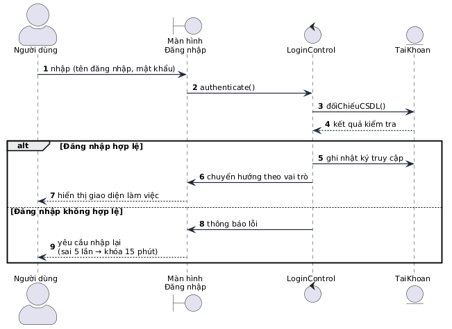

**Tác nhân:** Người dùng. **Các đối tượng:** Màn hình Đăng nhập (Boundary) - AuthService (Control) - User / RefreshToken (Entity). **Luồng sự kiện chính:** Tác nhân nhập thông tin và gửi yêu cầu qua Boundary; AuthService so khớp bcrypt; hợp lệ thì cấp access token 15 phút + refresh token 7 ngày (lưu hash DB) và chuyển hướng theo vai; không hợp lệ thì báo lỗi, quá 5 lần thì khóa tạm 15 phút.

**Biểu đồ trình tự Use case Lập phiếu đề xuất tuyển dụng (UC04):**

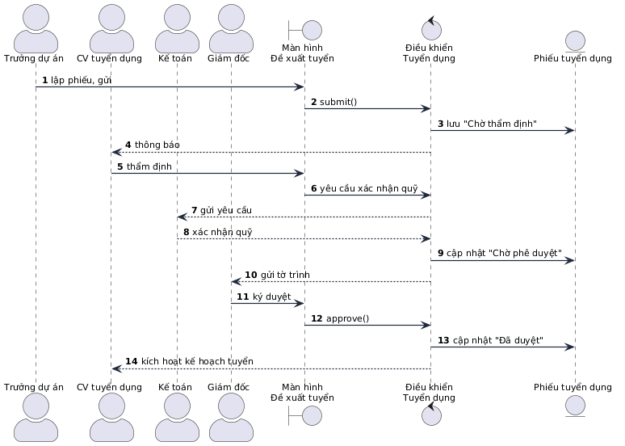

**Tác nhân:** Trưởng dự án, CV tuyển dụng, Kế toán, Giám đốc. **Các đối tượng:** Màn hình Đề xuất tuyển (Boundary) - RecruitmentService (Control) - JobRequisition (Entity). **Luồng sự kiện chính:** Trưởng dự án lập phiếu và gửi; hệ thống lưu với trạng thái "Chờ thẩm định" và thông báo CV tuyển dụng; sau thẩm định, hệ thống gửi yêu cầu xác nhận quỹ song song tới Kế toán; đủ điều kiện thì chuyển "Chờ phê duyệt" và gửi tờ trình điện tử tới Giám đốc; Giám đốc ký từ xa, hệ thống cập nhật "Đã duyệt" và kích hoạt kế hoạch tuyển đa kênh.

**Biểu đồ trình tự Use case Xử lý thôi việc (UC17):**

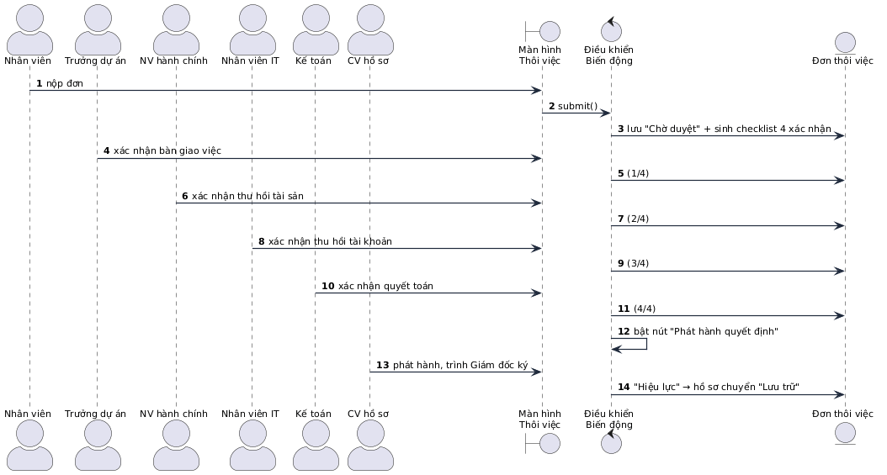

**Tác nhân:** Nhân viên và các bộ phận liên quan. **Luồng sự kiện chính:** Đơn thôi việc khi được duyệt phát sinh **checklist bàn giao 5 xác nhận** theo đúng ma trận tác động của tổ chức; từng bộ phận lần lượt xác nhận; chỉ khi đủ xác nhận, nút "Phát hành quyết định" mới được bật - đây là cách phần mềm cưỡng chế tuân thủ thủ tục. Ngày làm việc cuối, tài khoản tự khóa.

**Biểu đồ trình tự Use case Đăng ký nghỉ phép (UC20):**

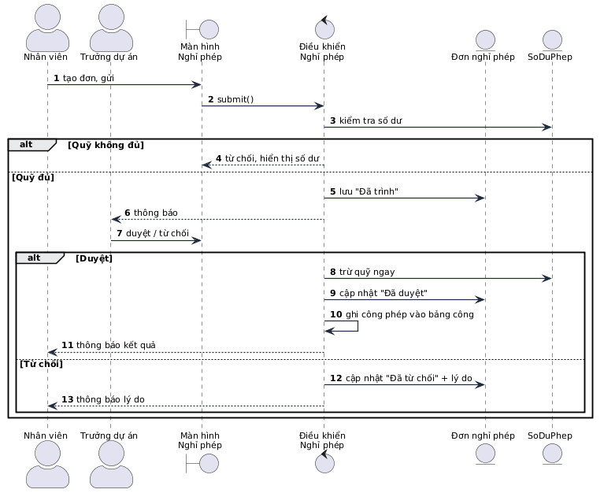

**Biểu đồ trình tự Use case Tính bảng lương hằng tháng (UC23):**

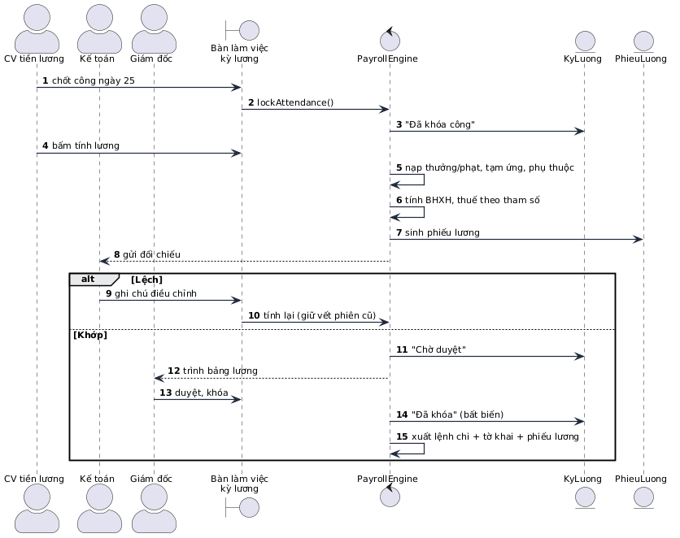

Sau khi duyệt, kỳ lương chuyển trạng thái **LOCKED** - mọi lời gọi tính lại bị chặn bằng lỗi HTTP 409; hành vi này đã được kiểm chứng bằng kịch bản kiểm thử end-to-end.

Các Use case còn lại được xây dựng theo **hai khuôn mẫu lặp lại**: (1) **khuôn quản lý danh mục** cho UC02, UC03, UC09, UC10, UC11, UC22, UC25 - mở màn hình → hiển thị danh sách (DataTable) → khung phân nhánh alt Thêm/Sửa/Xóa → lưu và ghi audit log → làm mới giao diện; (2) **khuôn luồng duyệt ngắn một bước** cho UC12, UC13, UC14, UC15, UC16, UC19, UC29, UC32, UC33 - tạo đề xuất → duyệt → hiệu lực. Các use case bổ sung UC28-UC46 cũng tuân theo hai khuôn này, cộng thêm **khuôn bảng Kanban kéo-thả** (UC35) và **khuôn xuất biểu mẫu** (UC41).

### 2.3.2. Xây dựng biểu đồ hoạt động (Activity Diagram)

**Biểu đồ hoạt động Use case Đăng nhập (UC01):**

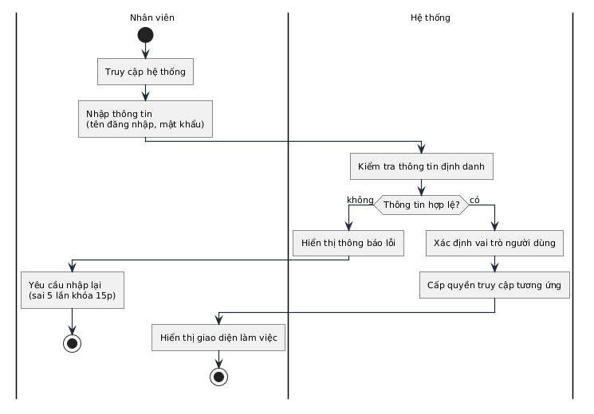

**Phân làn tác nhân:** Nhân viên, Hệ thống. **Luồng hoạt động chính:** Tại làn Nhân viên, quá trình bắt đầu khi truy cập hệ thống và nhập thông tin; dữ liệu được đẩy sang làn Hệ thống để kiểm tra định danh; rẽ nhánh theo tính hợp lệ - nhánh không hợp lệ hiển thị lỗi và kết thúc luồng phụ; nhánh hợp lệ tiếp tục xác định vai trò, cấp quyền và hiển thị giao diện làm việc.

**Biểu đồ hoạt động Use case Đăng ký nghỉ phép (UC20):**

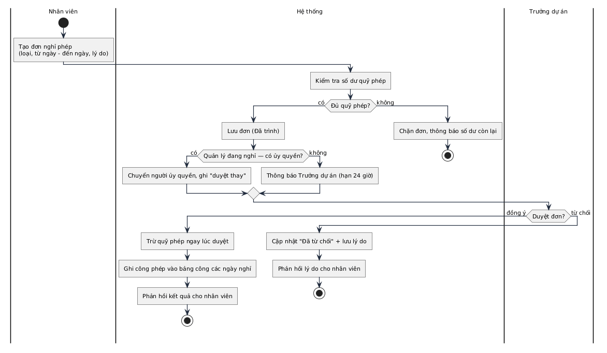

**Biểu đồ hoạt động Use case Chốt bảng chấm công (UC21)** (có nhánh song song hợp nhất dữ liệu đa nguồn):

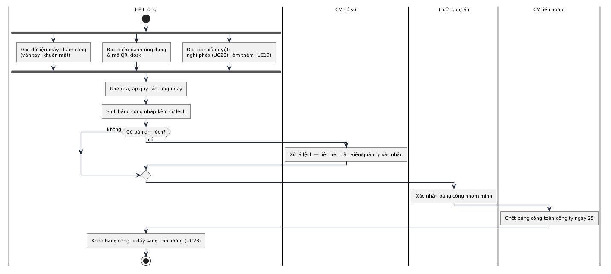

**Phân làn tác nhân:** Hệ thống, CV hồ sơ, Trưởng dự án, CV tiền lương. **Luồng hoạt động chính:** Bốn nguồn dữ liệu (máy chấm công webhook/CSV, web, QR kiosk, khuôn mặt) được hợp nhất song song vào bảng sự kiện thô; hệ thống ghép ca và áp quy tắc sinh bảng công ngày kèm cờ lệch; các bản ghi lệch được xử lý qua giải trình của nhân viên (UC29) hoặc hiệu chỉnh có lý do của ADMIN; cuối kỳ dữ liệu công khóa lại để chuyển sang tính lương.

### 2.3.3. Xây dựng biểu đồ trạng thái (State Diagram)

Nhóm biểu đồ trọng tâm của đề tài - mô tả vòng đời các đối tượng nhân sự có ràng buộc bằng chứng:

**Biểu đồ trạng thái vòng đời Nhân viên:**

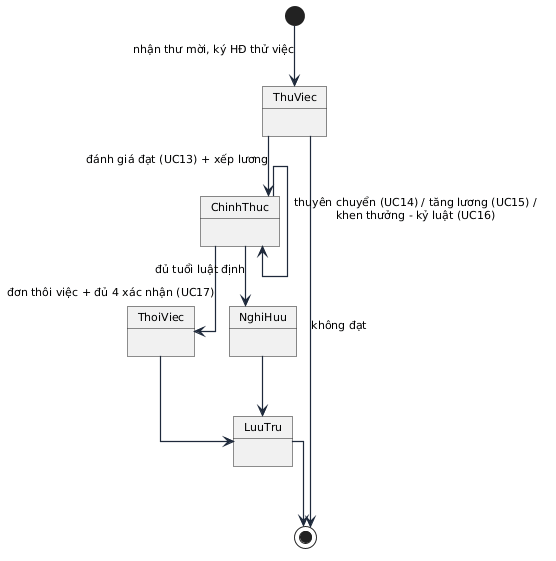

**Khởi tạo:** Khi ứng viên nhận thư mời và ký hợp đồng thử việc, bản ghi nhân viên sinh ra ở trạng thái Thử việc. **Vòng đời chuyển đổi:** Qua đánh giá thử việc đạt và quyết định xếp lương, chuyển sang Chính thức; trong quá trình công tác có các chuyển tự tham chiếu (thuyên chuyển, tăng lương, khen thưởng - kỷ luật); rời trạng thái Chính thức theo hai nhánh nghỉ hưu (đủ tuổi luật định) hoặc thôi việc (bắt buộc đủ checklist bàn giao). **Kết thúc:** Toàn bộ hồ sơ chuyển sang trạng thái Lưu trữ - dữ liệu đóng băng nhưng lịch sử vẫn tra cứu được. Trường `employmentStatus` trên model User hiện thực đúng máy trạng thái này, và phần mềm cấm chuyển nếu thiếu bằng chứng đầu vào.

**Biểu đồ trạng thái Phiếu tuyển dụng:**

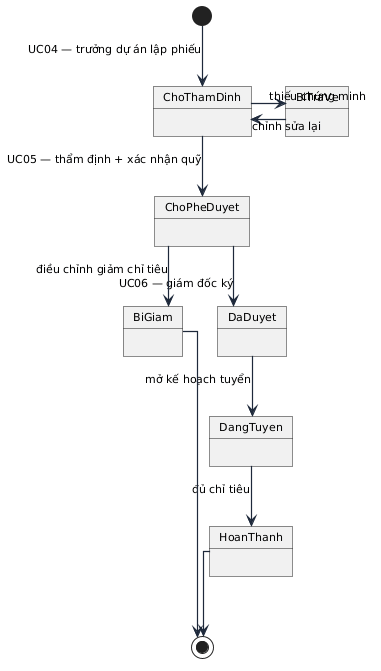

_Trạng thái thật trên `JobRequisition`: DRAFT → PENDING_REVIEW → APPROVED / REJECTED / CLOSED._

**Biểu đồ trạng thái Đơn nghỉ phép:**

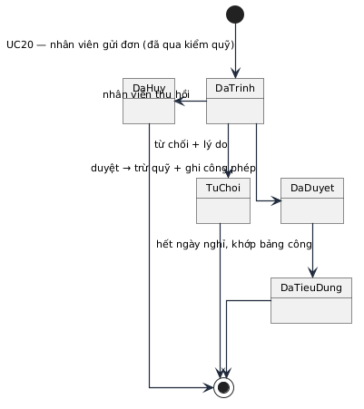

**Biểu đồ trạng thái Phiếu mượn - trả hồ sơ:**

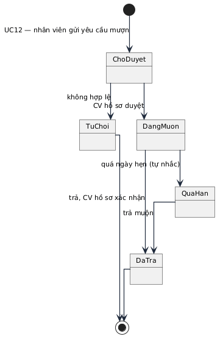

**Biểu đồ trạng thái Phiếu lương:**

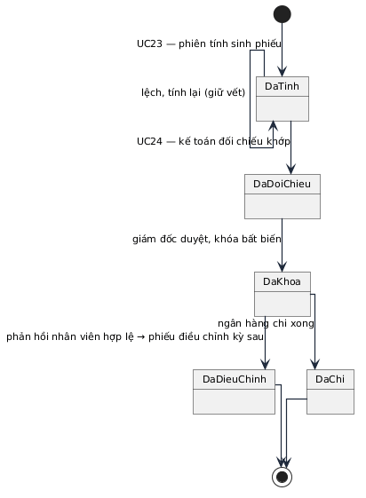

**Kết thúc:** Từ trạng thái Đã khóa (LOCKED), đối tượng phiếu lương trở nên bất biến - mọi sửa sau này chỉ có thể qua phiếu của kỳ sau, bảo đảm tính toàn vẹn của dữ liệu tiền lương. Máy trạng thái kỳ lương thật: `OPEN → CALCULATED → REVIEWED → LOCKED`.

### 2.3.4. Xây dựng biểu đồ cộng tác (Collaboration Diagram)

Mỗi biểu đồ trình tự ở mục 2.3.1 được chuyển sang biểu đồ cộng tác bằng lệnh chuyển đổi của công cụ vẽ (StarUML/Draw.io), giữ nguyên các đối tượng và thông điệp, chỉ thêm số thứ tự thông điệp. Dưới đây là mô tả văn bản cho bốn Use case trọng yếu, đã hiệu chỉnh khớp tên service thật:

**Use case Đăng nhập (UC01):** Người dùng tương tác trực tiếp bằng cách nhập thông tin đăng nhập qua phương thức `inputCredentials()` trên đối tượng **LoginForm**. Đối tượng này gọi `authenticate()` gửi sang **AuthService**. Khi nhận được yêu cầu, AuthService phát đi thông điệp tới thực thể **User** để so khớp bcrypt, rồi `issueTokens()` cấp access/refresh token. Cuối cùng, phương thức `display()` được thực thi trên LoginForm - hiển thị màn hình chính nếu đăng nhập thành công hoặc báo lỗi để nhập lại.

**Use case Lập phiếu đề xuất tuyển dụng (UC04):** Trưởng dự án khởi tạo luồng bằng `inputData()` trên **RecruitmentForm**; form gọi `submitRequest()` chuyển sang **RecruitmentService**; bộ điều khiển gọi `checkHeadcount()` đối chiếu định biên, rồi `save()` trên **JobRequisition** với trạng thái "Chờ thẩm định" và `notify()` đến vai KM_MANAGER. Sau chuỗi duyệt (`approve()` của ADMIN), bộ điều khiển gọi `updateStatus("APPROVED")` và `activateOpening()`, kết thúc bằng `display()` làm mới danh sách.

**Use case Đăng ký nghỉ phép (UC20):** Nhân viên gọi `submit()` trên **LeaveForm** → **LeaveService** gọi `checkBalance()` trên **LeaveBalance** → `save()` trên **LeaveRequest** → `notify()` tới KM_MANAGER → khi duyệt, `deductBalance()` trên LeaveBalance (trừ NGAY), `updateStatus()` trên LeaveRequest, `display()` trên LeaveForm.

**Use case Tính bảng lương (UC23):** CV tiền lương gọi `lockAttendance()` trên **PayrollPeriodForm** → **PayrollService** gọi `aggregate()` trên **AttendanceDay**, `loadStructure()` trên **HrmsSalaryStructure**, `calculate()` sinh **Payslip** từng nhân viên → `submitForReview()` thông báo đối chiếu → khi duyệt, `lock()` trên PayrollPeriod (LOCKED, chặn 409) và `exportBankFile()` sinh bảng kê chi lương.

## 2.4. Thiết kế hệ thống

### 2.4.1. Xây dựng biểu đồ lớp (Class Diagram)

**Biểu đồ gói tổng quan của hệ thống HRMIS:**

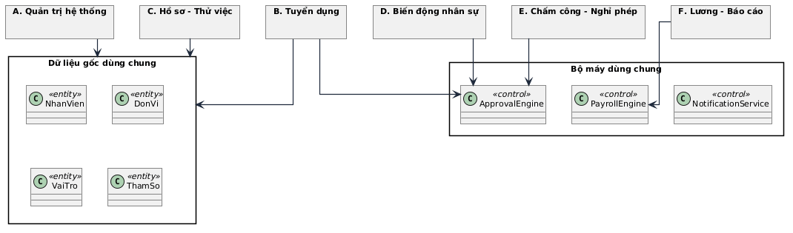

**Biểu đồ lớp Use case Đăng nhập (UC01):**

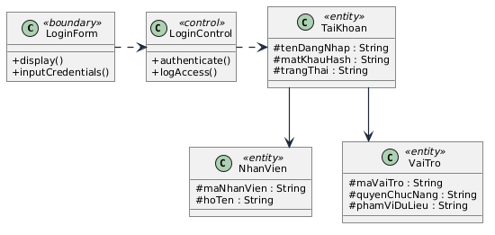

**Lớp «Boundary» LoginForm (Lớp giao diện Đăng nhập)**

- Phương thức:
  - `+display()`: Có chức năng hiển thị form đăng nhập lên màn hình để người dùng tương tác.
  - `+inputCredentials()`: Có chức năng tiếp nhận dữ liệu xác thực (tên đăng nhập và mật khẩu) mà người dùng nhập vào form.
- Mối quan hệ: Có mũi tên nét đứt phụ thuộc vào AuthService (giao diện gọi tới lớp điều khiển để xử lý thông tin vừa nhập).
- Cài đặt thật: trang `/login` (Next.js Client Component) - hỗ trợ tham số `?next=` quay lại mã QR đang dở.

**Lớp «Control» AuthService (Lớp điều khiển Đăng nhập)**

- Phương thức:
  - `+login(email, password)`: So khớp bcrypt; sai thì tăng `failedLoginAttempts`, đủ 5 lần khóa 15 phút; đúng thì reset bộ đếm và cấp access token 15 phút + refresh token 7 ngày.
  - `+refresh(refreshToken)`: Xoay vòng refresh token (hash cũ bị revoked, cấp hash mới).
  - `+logout(refreshToken)` / `+logoutAll()`: Thu hồi một phiên / toàn bộ phiên.
  - `+logAccess()`: Ghi audit log truy cập phục vụ kiểm toán bảo mật.
- Mối quan hệ: Nhận yêu cầu từ LoginForm và phụ thuộc vào thực thể User, RefreshToken.

**Lớp «Entity» TaiKhoan (hiện thực: `User` + `RefreshToken`)**

- Thuộc tính:
  - `#email: String`: Định danh duy nhất để đăng nhập.
  - `#passwordHash: String`: Mật khẩu đã băm một chiều (bcrypt cost 12).
  - `#status: String`: ACTIVE / LOCKED / DISABLED; `#failedLoginAttempts: Int`; `#lockedUntil: DateTime`.
  - `#tokenHash: String` (RefreshToken): Hash refresh token kèm `expiresAt`, `revokedAt`.

**Biểu đồ lớp Use case Đăng ký nghỉ phép (UC20):**

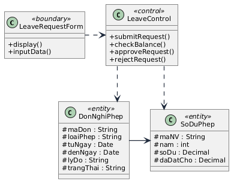

**Lớp «Boundary» LeaveRequestForm**

- Phương thức:
  - `+display()`: Hiển thị danh sách đơn xin nghỉ và form tạo đơn kèm số dư phép.
  - `+inputData()`: Nhận thông tin lý do, thời gian nghỉ từ nhân viên hoặc nhận thao tác duyệt/từ chối từ quản lý.
- Cài đặt thật: trang `/leave` với tab cá nhân/toàn công ty (tab toàn công ty chỉ hiện với KM_MANAGER).

**Lớp «Control» LeaveService**

- Phương thức:
  - `+submitRequest()`: Kiểm tra quỹ phép trước khi lưu đơn với trạng thái "Đã trình" - quỹ không đủ chặn bằng lỗi nghiệp vụ 400.
  - `+checkBalance()`: Đối chiếu số ngày nghỉ với số dư quỹ phép (entitled = 12 + thâm niên).
  - `+approveRequest()`: Xử lý chấp thuận - trừ quỹ ngay, ghi công phép vào bảng công.
  - `+rejectRequest()`: Xử lý từ chối kèm lưu lý do.

**Lớp «Entity» DonNghiPhep (hiện thực: `LeaveRequest`)**

- Thuộc tính:
  - `#id: UUID`: Mã đơn xin nghỉ.
  - `#type: String`: ANNUAL / SICK / UNPAID / MATERNITY.
  - `#startDate, #endDate: Date`; `#days: Decimal`: Khoảng thời gian nghỉ theo ngày làm việc.
  - `#status: String`: PENDING / APPROVED / REJECTED / CANCELLED.

**Lớp «Entity» SoDuPhep (hiện thực: `LeaveBalance`)**

- Thuộc tính:
  - `#userId + #year`: Composite key - quỹ phép theo năm.
  - `#entitled: Decimal`: Được hưởng = 12 + thâm niên (1 ngày/5 năm).
  - `#used: Decimal`: Đã duyệt tiêu dụng.

**Biểu đồ lớp Use case Quản lý thông tin cá nhân phân cấp 3 mức độ (UC25) & Thẩm định đề xuất (UC47):**

**Lớp «Boundary» ProfileForm, ProfileChangeRequestModal, ProfileChangeReviewQueue**
- Phương thức:
  - `+displayProfile()`: Hiển thị hồ sơ cá nhân chia 3 phân cấp (Mức 1, 2, 3) với kiểu dáng và trạng thái trường tương ứng.
  - `+openChangeRequestModal()`: Mở modal đề xuất điều chỉnh thông tin Mức 2 với component Select chuẩn hệ thống, tìm kiếm và upload minh chứng.
  - `+displayReviewQueue()`: Hiển thị hàng đợi thẩm định đề xuất chờ duyệt đối chiếu trực quan cũ/mới và xem tệp minh chứng.
- Cài đặt thật: trang `/profile` (Next.js Client Component), component `ProfileChangeRequestModal.tsx` và `ProfileChangeReviewQueue.tsx`.

**Lớp «Control» ProfileChangeRequestsService**
- Phương thức:
  - `+createRequest(userId, dto)`: Kiểm tra trường thuộc Mức 2, bắt buộc có lý do và tệp đính kèm; lưu yêu cầu trạng thái `PENDING`.
  - `+listPending()` / `+listMyRequests(userId)`: Lấy danh sách đề xuất chờ duyệt (cho HR) hoặc lịch sử đề xuất của bản thân.
  - `+approveRequest(id, dto, reviewer)`: Thực thi atomic transaction cập nhật bảng User/ComprehensiveProfile, chuyển `APPROVED` và ghi `AuditLog`.
  - `+rejectRequest(id, dto, reviewer)`: Bắt buộc nhập lý do; chuyển `REJECTED` và thông báo phản hồi.
- Cài đặt thật: `backend/src/modules/profile-change-requests/profile-change-requests.module.ts`.

**Lớp «Entity» DeXuatThayDoiThongTin (hiện thực: `ProfileChangeRequest`)**
- Thuộc tính:
  - `#id: UUID`: Định danh duy nhất đề xuất.
  - `#userId: UUID`: Mã cán bộ/nhân viên đề xuất.
  - `#changes: Json`: Chi tiết các trường xin sửa kèm giá trị cũ và mới.
  - `#reason: String`: Lý do đề xuất điều chỉnh.
  - `#attachmentUrls: String[]`: Danh sách đường dẫn tệp minh chứng pháp lý.
  - `#status: ProfileChangeStatus`: PENDING / APPROVED / REJECTED / CANCELLED.
  - `#reviewerId: UUID`; `#reviewerNote: String`; `#reviewedAt: DateTime`.

Các Use case còn lại được xây dựng biểu đồ lớp theo **khuôn chuẩn ba lớp**: mỗi UC có đúng một lớp Biên (trang Next.js với `display()` và `inputData()`), một lớp Điều khiển (service NestJS với các phương thức nghiệp vụ đặc thù) và một đến hai lớp Thực thể (model Prisma với các thuộc tính đã liệt kê ở mục 2.2.2) - nhân bản từ Hình 2.18 và 2.19.

**Biểu đồ lớp miền cốt lõi của hệ thống:**

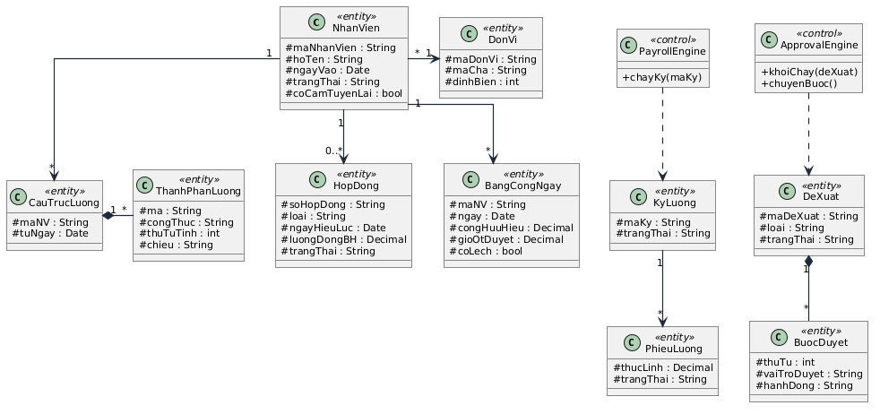

**Nhận xét:** Quan hệ tụ hợp (composition) giữa CauTrucLuong - ThanhPhanLuong (hiện thực: `HrmsSalaryStructure` - `HrmsSalaryStructureItem`) và DeXuat - BuocDuyet (hiện thực: `PersonnelAction` với payload + status) thể hiện tính bao đóng: thành phần lương không tồn tại ngoài cấu trúc lương, bước duyệt không tồn tại ngoài đề xuất. Hai lớp điều khiển dùng chung PayrollEngine và ApprovalEngine được nhiều phân hệ tái sử dụng - đây là quyết định thiết kế giúp hệ thống có chất lượng sản phẩm thật: thêm một loại đề xuất mới chỉ cần thêm giá trị enum + nhánh hiệu lực trong `personnel-actions.service.ts`, không phải viết thêm luồng duyệt.

### 2.4.2. Thiết kế lưu trữ dữ liệu

Hệ thống sử dụng **PostgreSQL 16** với **87 model Prisma chia 10 miền nghiệp vụ**; toàn bộ được quản lý versioned bằng Prisma migration tự chạy khi container khởi động.

Thiết kế lưu trữ dữ liệu là quá trình chuyển đổi các Lớp Thực thể thành các bảng trong cơ sở dữ liệu quan hệ.

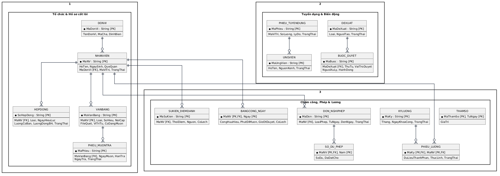

_Hình 2.21. Mô hình cơ sở dữ liệu vật lý (phần lõi)._

**Bảng 2.8. Mười miền dữ liệu của hệ thống đã cài đặt**

| Miền | Model tiêu biểu | Số lượng | Ràng buộc đáng nhớ |
| --- | --- | --- | --- |
| ① Định danh & tổ chức | User, Role, UserRole, RefreshToken, OrgUnit | 5 | OrgUnit cây tự tham chiếu; employeeCode tự sinh |
| ② Space & nội dung | Space, SpaceMember, Category, Tag, Article, ArticleVersion, ArticleTag, Attachment | 8 | ArticleVersion **bất biến chỉ INSERT** |
| ③ Xuất bản & tương tác | ArticleReview, Comment, Reaction, ArticleView, Bookmark, SpaceFollow | 6 | Event-log timeline luồng duyệt |
| ④ Vòng đời con người - tri thức | OnboardingPath/_Items/_Assignments/_Progress, HandoverChecklist/_Items | 6 | Checklist đủ DONE mới đóng |
| ⑤ Hệ thống | Notification, AuditLog, Setting | 3 | AuditLog **APPEND-ONLY** |
| ⑥ Chấm công | AttendanceDevice, AttendanceEvent, AttendanceDay, AttendanceCorrection, FaceEmbedding | 5 | Sự kiện thô append-only; hiệu chỉnh bắt buộc ghi lý do |
| ⑦ Nhân sự lõi | Contract, Certificate, LeaveRequest, LeaveBalance, OvertimeRequest, PayrollPeriod, Payslip, JobRequisition, Candidate, PerformanceReview, TrainingCourse/_Enrollment, PersonnelAction, HrDocument, ProfileChangeRequest | 15 | Payslip khóa bất biến; duyệt phép trừ quỹ NGAY; ProfileChangeRequest thẩm định Mức 2 có minh chứng |
| ⑧ Cán bộ chuẩn BNV | PersonnelRank, PersonnelComprehensiveProfile + 8 bảng quá trình | 10 | Profile 111 trường 1-1 User |
| ⑨ Frappe v16 | HrmsShiftType/_Assignment, HrmsSalaryComponent/Structure(+Item,+Assignment), HrmsPayrollRun/Slip, HrmsJobOpening/Applicant/InterviewRound/Offer, HrmsLifecycleEvent, HrmsOnboardingTask, HrmsAppraisalCycle/Goal/Review, HrmsTravelRequest, HrmsEmployeeAdvance, HrmsExpenseClaim, HrmsTrainingProgram/Feedback, HrmsGrievance | 23 | ATS Kanban, KRA/KPI, chi phí, đào tạo |
| ⑩ Phúc lợi, danh mục & tuân thủ | HrmsEmployeeLoan, HrmsAssetAllocation, HrmsAttendanceRegularization, MasterCatalogGroup, MasterCatalog, MasterCatalogItem | 6 | EMI ≤ 30% net kiểm ở tầng service; 3 model Master Catalogs chuẩn hóa toàn bộ danh mục dùng chung |

**Phân quyền hai chiều:** bảng `Role` (ADMIN/KM_MANAGER/USER) nối `User` qua `UserRole`; quyền hiệu lực = vai toàn cục × phạm vi dữ liệu (bản thân / nhóm / Space / toàn công ty). Đã kiểm chứng trong mã nguồn: endpoint bảng công toàn công ty gắn `@Roles('ADMIN','KM_MANAGER')`; hiệu chỉnh bản ghi công và quản lý thiết bị chỉ `@Roles('ADMIN')`.

**Ba ràng buộc kỹ thuật bắt buộc (đã cài đặt):** (i) bảng `AuditLog` và `AttendanceEvent` **chỉ thêm, không sửa xóa** - bảo đảm truy vết tuyệt đối; (ii) `Payslip`/`PayrollPeriod` ở trạng thái LOCKED bị chặn UPDATE/tính lại ở tầng ứng dụng (lỗi 409) - mọi điều chỉnh qua kỳ sau; (iii) mọi bảng nghiệp vụ có trường kiểm toán (createdAt/createdBy/updatedAt), tập tin đính kèm lưu volume riêng với whitelist loại tệp và checksum.

### 2.4.3. Thiết kế giao diện người dùng

Thiết kế giao diện người dùng đóng vai trò là cầu nối tương tác trực tiếp giữa người sử dụng và hệ thống. Nguyên tắc thiết kế dựa trên tiêu chí đồng bộ hóa về hình ảnh, tối giản hóa thao tác và tối ưu hóa luồng công việc cho từng vai. Menu chính được tổ chức khoa học thành **6 nhóm phân hệ nghiệp vụ chính và nhóm Quản trị hệ thống** với tổng cộng **31 trang màn hình ứng dụng thực tế** (cài đặt tại `frontend/src/app/(app)/*` theo cấu trúc App Router của Next.js 14); mọi màn hình đều tích hợp thanh tìm kiếm thông minh **Command Palette (Ctrl+K)** điều hướng nhanh; trên thiết bị di động hỗ trợ thanh điều hướng đáy (bottom-nav) tiện dụng; mọi trang quản trị đều tích hợp nút **in ấn chuẩn A4** (thông qua component PrintFrame và CSS `@media print`).

Cấu trúc 6 nhóm giao diện nghiệp vụ và nhóm Quản trị bao gồm:

1. **Nhóm Cổng Tự phục vụ & Tổng quan (Self-Service & Overview):**
   - `/ess`: Cổng thông tin nhân viên tự phục vụ tập trung (ESS - Employee Self-Service) - tích hợp điểm danh một chạm, nộp đơn nghỉ phép, đăng ký làm thêm giờ, tra cứu phiếu lương cá nhân bảo mật, theo dõi tiến độ trả nợ vay phúc lợi và danh sách tài sản đang bàn giao.
   - `/profile`: Trang quản lý hồ sơ cá nhân và phân cấp quản trị dữ liệu 3 mức độ (3-Tier Profile Governance) - cho phép nhân viên tự sửa thông tin liên lạc Mức 1; mở modal đề xuất điều chỉnh thông tin pháp lý nhân thân Mức 2 với component Select chuẩn hệ thống, nhập lý do và tải file minh chứng; khóa hiển thị dữ liệu tổ chức Mức 3; tích hợp tab Hàng đợi thẩm định hồ sơ (`ProfileChangeReviewQueue`) dành riêng cho chuyên viên HR-OPS và Quản trị viên đối chiếu cũ - mới và duyệt 1-click.
   - `/dashboard`: Bảng điều khiển phân tích tổng quan nhân sự toàn công ty, biểu đồ cơ cấu nhân lực, biến động lao động và các lối tắt tác nghiệp nhanh.

2. **Nhóm Nhân sự & Cơ cấu tổ chức (Personnel & Organization):**
   - `/org-chart`: Sơ đồ cây cơ cấu tổ chức tương tác đa cấp, hiển thị trực quan mối quan hệ báo cáo và định biên phòng ban.
   - `/employees`: Danh bạ nhân sự toàn công ty hỗ trợ lọc đa tiêu chí, tìm kiếm nhanh và xuất danh sách.
   - `/employees/[id]`: Trang hồ sơ nhân sự chi tiết thiết kế dạng thẻ tab đa năng (Thông tin cá nhân, Hợp đồng lao động, Văn bằng chứng chỉ, Tài sản bàn giao, Quá trình công tác).
   - `/assets`: Phân hệ quản lý vòng đời tài sản làm việc, theo dõi lịch sử cấp phát và thu hồi thiết bị.
   - `/personnel`: Phân hệ quản lý các quyết định biến động nhân sự (điều chuyển, thăng chức, khen thưởng, kỷ luật, thôi việc).
   - `/salary-ranks`: Bảng quản lý khung ngạch bậc lương theo tiêu chuẩn Nghị định 204/2004/NĐ-CP và hệ số thâm niên.

3. **Nhóm Ca kíp & Chấm công (Shifts & Attendance):**
   - `/shifts`: Phân ca làm việc linh hoạt, thiết lập giờ chuẩn và thời gian ân hạn đi muộn/về sớm.
   - `/attendance`: Bảng tổng hợp chấm công tháng dạng lưới lịch đa màu sắc, phân biệt rõ công chuẩn, nghỉ phép, đi muộn, làm thêm giờ.
   - `/leave`: Phân hệ nộp đơn và phê duyệt nghỉ phép trực tuyến với cơ chế trừ quỹ phép tự động.
   - `/overtime`: Phân hệ đăng ký và phê duyệt làm thêm giờ, tự động kiểm soát trần thời gian luật định 40 giờ/tháng.

4. **Nhóm Tiền lương & Chi phí (Compensation & Expenses):**
   - `/payroll-engine`: Cỗ máy tính lương tự động thế hệ mới, hỗ trợ cấu hình thành phần lương Gross-Net, tính thuế TNCN, BHXH và thực thi cơ chế khóa bất biến (LOCKED).
   - `/loans`: Phân hệ quản lý các khoản vay phúc lợi nhân viên, tự động tính lịch trả nợ trả góp EMI bảo đảm trần an toàn khấu trừ ≤ 30% lương thực lĩnh.
   - `/expense-claims`: Phân hệ đề xuất lệnh công tác và thanh quyết toán chi phí công tác phí kèm hóa đơn tài chính điện tử.

5. **Nhóm Tuyển dụng & Đánh giá hiệu suất (Recruitment & Performance):**
   - `/recruitment-ats`: Hệ thống quản trị tuyển dụng ứng viên ATS với bảng điều khiển Kanban trực quan kéo-thả qua 6 vòng tuyển chọn, tích hợp nút chuyển đổi ứng viên thành nhân viên mới.
   - `/performance-360`: Phân hệ đánh giá hiệu suất đa chiều 360 độ (tự đánh giá, đồng nghiệp, quản lý) và quản trị mục tiêu OKR/KPI.
   - `/training-grievance`: Phân hệ quản lý các khóa đào tạo công nghệ nội bộ và kênh tiếp nhận, giải quyết khiếu nại bảo mật của người lao động.

6. **Nhóm Báo cáo & Kho tài liệu số (Reports & Documents):**
   - `/personnel-reports`: Phân hệ hồ sơ cán bộ toàn diện 111 thuộc tính và kết xuất biểu mẫu Sơ yếu lý lịch Mẫu 2C-BNV/2008 chuẩn A4 cùng các báo cáo thống kê nhân sự.
   - `/documents`: Kho tri thức số nội bộ lưu trữ quy trình, chính sách công ty và tài liệu dự án với cơ chế quản lý phiên bản bất biến.

7. **Nhóm Quản trị hệ thống (System Administration):**
   - Gồm 6 màn hình quản trị chuyên sâu dành cho vai trò ADMIN: `/admin/users` (Quản trị tài khoản và phân quyền người dùng), `/admin/org-units` (Quản trị cơ cấu phòng ban), `/admin/catalogs` (Quản trị danh mục dùng chung Master Catalogs), `/admin/attendance` (Quản trị thiết bị máy chấm công và xử lý ngoại lệ lệch công), `/admin/settings` (Cấu hình tham số vận hành), `/admin/audit` (Nhật ký kiểm toán hệ thống Append-only).

8. **Giao diện Điểm danh chuyên biệt:**
   - `/check-in`: Giao diện Kiosk đa năng hỗ trợ điểm danh bằng mã QR xoay vòng tự động mỗi 30 giây (kèm token mã hóa HMAC chống chụp ảnh giả mạo) và nhận diện khuôn mặt sinh trắc học tuân thủ Nghị định 13/2023/NĐ-CP.

### 2.4.4. Thiết kế mô hình thành phần

Kiến trúc phần mềm của dự án được thiết kế dựa trên mô hình ba tầng tiêu chuẩn:

**Tầng giao diện người dùng:** Ứng dụng web **Next.js 14 standalone** - vừa phục vụ UI cho mọi vai vừa làm reverse proxy `/api/* → api:3001` (không cần nginx riêng); gồm **31 trang màn hình ứng dụng thực tế** phân theo 6 nhóm menu chính và nhóm Quản trị, cùng giao diện điểm danh kiosk `/check-in` và đăng nhập `/login`; thiết kế đáp ứng đa thiết bị (mobile-responsive) với bottom-nav.

**Tầng xử lý nghiệp vụ:** **NestJS API** chứa toàn bộ quy tắc và logic cốt lõi: validation DTO toàn cục, JwtAuthGuard → RolesGuard, **38 module nghiệp vụ chuyên sâu** hoạt động trên hai bộ phận dùng chung - **Bộ phận phê duyệt (ApprovalEngine → PersonnelActionsModule)** và **Bộ phận tính lương (PayrollEngine → PayrollModule + HrmsPayrollModule)** - cùng dịch vụ thông báo (NotificationsService), kiểm toán (AuditService) và danh mục dùng chung (CatalogsModule). Các khối giao tiếp bằng cơ chế truyền thông điệp (event): khi khối Biến động nhân sự duyệt đơn khen thưởng, số thưởng chuyển xuống khối Lương nạp vào kỳ kế tiếp; khi khối Chấm công ghi sự kiện, event handler tự tổng hợp bảng công ngày.

**Tầng lưu trữ dữ liệu:** **PostgreSQL 16** cho **87 model nghiệp vụ** (FTS tsvector + pg_trgm cho miền tri thức) và volume riêng cho tập tin đính kèm/bản quét. Migration versioned tự chạy khi container khởi động.

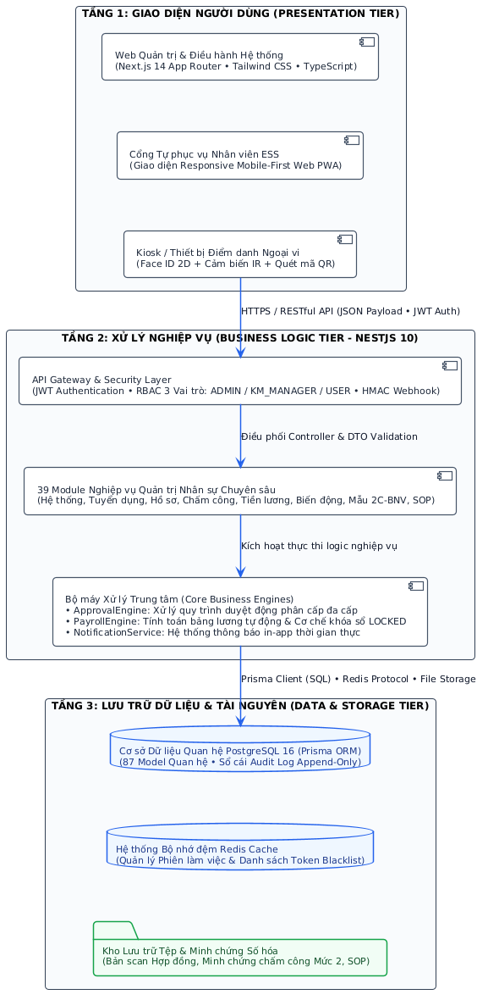

Sự phân chia kiến trúc thành các tầng và khối thành phần riêng biệt giúp hệ thống sở hữu nền tảng vận hành linh hoạt. Trong tương lai, nếu công ty muốn thay đổi giao diện hoặc bổ sung phân hệ mới (ví dụ tầng trí tuệ nhân tạo dự báo nhân sự), lập trình viên chỉ cần can thiệp vào một thành phần cụ thể mà không làm ảnh hưởng đến cấu trúc lưu trữ hay các quy trình đang diễn ra bình thường.

## 2.5. Bổ sung thiết kế: chấm công đa nguồn (mã QR - khuôn mặt - máy chấm công)

Phân hệ chấm công (UC18) hỗ trợ **bốn kênh** thu nhận giờ công: máy chấm công (webhook HMAC / CSV), điểm danh web, **mã QR xoay vòng tại kiosk** và **nhận diện khuôn mặt ngay trên trình duyệt**. Hai use case UC26, UC27 quan hệ <<extend>> với UC18 - chúng là các kênh đầu vào thay thế, không làm thay đổi luồng ghép ca - tổng hợp bảng công phía sau.

Nguyên tắc thiết kế an toàn cho các kênh mới (đã cài đặt đúng):

- **Mã QR chống giả mạo:** kiosk gọi endpoint công khai sinh token ký HMAC chứa {kiosk_id, iat, jti}, tự xoay mỗi 30 giây, hiệu lực chấp nhận ≤ 60 giây, jti chỉ dùng một lần - chặn hoàn toàn việc chụp ảnh màn hình để tái sử dụng; hệ thống từ chối check-in trùng trong khoảng ±2 phút;
- **Khuôn mặt bảo vệ dữ liệu cá nhân:** tuân thủ Nghị định 13/2023/NĐ-CP - chỉ lưu vector đặc trưng đã mã hóa AES-256-GCM (model `FaceEmbedding`, không lưu ảnh gốc), thu thập sau khi người lao động tick đồng thuận rõ ràng, giới hạn số lần thử khớp, và xóa toàn bộ mẫu khi hoàn tất thủ tục thôi việc (mục mặc định trong checklist bàn giao của UC17).
- **Máy chấm công kết nối chuẩn hóa:** thiết bị đẩy sự kiện vào API qua webhook kèm chữ ký HMAC theo thiết bị (`DeviceWebhookController`), hoặc nhập tập tin CSV; khi chưa có phần cứng thật, bộ mô phỏng thiết bị sinh dữ liệu kiểm thử (bao gồm cả bản ghi lệch) - kiến trúc adapter cho phép gắn SDK hãng (ZKTeco…) sau này mà không phải đổi luồng tổng hợp.

Biểu đồ trình tự kênh QR (đại diện cho các kênh mới):

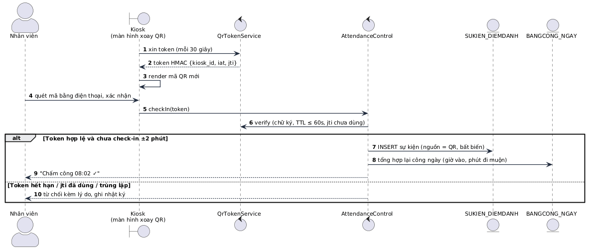

Phần mô hình dữ liệu bổ sung cho các kênh mới:

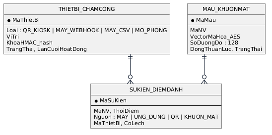

_Hình 2.24. Mô hình dữ liệu bổ sung cho chấm công đa nguồn_ (AttendanceEvent giữ nguyên tính bất biến, trường source mở rộng; token QR xác minh trạng thái nên không cần bảng lưu - jti kiểm tra bằng bộ nhớ đệm có hạn đời 60 giây)

## Tóm tắt chương 2

Chương 2 trình bày chi tiết quá trình thiết kế hệ thống thông tin quản trị nhân lực HRMIS cho Saigon Technology trên nền khảo sát mã nguồn đã cài đặt (38 module backend, 31 trang màn hình ứng dụng frontend, 87 model dữ liệu).

Tiếp đó, chương xác định 11 tác nhân nghiệp vụ ánh xạ vào ba vai phân quyền; phân tầng yêu cầu từ quy trình nghiệp vụ xuống use case hệ thống với bảng nối thẳng tới màn hình thật; đặc tả 47 use case chia 12 nhóm kèm đặc tả chi tiết các use case trọng yếu và bảng tham số pháp lý; thiết lập mô hình phân cấp quản trị dữ liệu nhân sự 3 mức độ (Tier 1: Tự phục vụ, Tier 2: Đề xuất có minh chứng pháp lý, Tier 3: Khóa chỉ xem do tổ chức quản trị). Cấu trúc tĩnh gồm ba loại lớp Biên - Điều khiển - Thực thể và hai bộ phận dùng chung; hành vi động mô hình hóa bằng biểu đồ Use case, Trình tự, Hoạt động, Trạng thái và Cộng tác. Thiết kế lưu trữ gồm 10 miền - 87 model với ba ràng buộc bất biến; giao diện mô tả theo 31 trang màn hình ứng dụng thực tế phân thành 6 nhóm phân hệ chính; kiến trúc triển khai là ba service Docker (web - api - db).

---

# CHƯƠNG 3: KẾT QUẢ ĐẠT ĐƯỢC VÀ ĐỀ XUẤT, KHUYẾN NGHỊ HOẶC HƯỚNG NGHIÊN CỨU PHÁT TRIỂN

## 3.1. Những kết quả đạt được

Sau quá trình khảo sát nghiệp vụ quản trị nhân lực tại Saigon Technology, vận dụng phương pháp phân tích thiết kế hệ thống và **cài đặt thật toàn bộ hệ thống**, đề tài đã đạt được các kết quả đo đếm được:

- **Về chức năng:** hệ thống vận hành **47 use case chia 12 nhóm** trên **31 trang màn hình ứng dụng thực tế** (cùng các giao diện chuyên biệt như Kiosk điểm danh QR/Face), phục vụ **11 tác nhân nghiệp vụ gói gọn trong 3 vai**, phủ kín vòng đời nhân sự từ tuyển dụng ATS, hồ sơ - hợp đồng, phân cấp dữ liệu nhân sự 3 mức độ (Mức 1 tự sửa, Mức 2 thẩm định có minh chứng, Mức 3 khóa tổ chức), chấm công đa nguồn bốn kênh (web, QR kiosk, khuôn mặt, máy chấm công), nghỉ phép, làm thêm giờ, chu kỳ lương có khóa bất biến, phúc lợi (vay/tạm ứng, công tác phí, tài sản), hiệu suất 360, đào tạo - khiếu nại, biến động nhân sự với checklist bàn giao tự sinh, đến kho tri thức nội bộ và bộ hồ sơ cán bộ chuẩn Bộ Nội Vụ;
- **Về cơ sở dữ liệu:** **87 model quan hệ chia 10 miền** trên PostgreSQL 16, quản lý versioned bằng Prisma migration tự chạy khi khởi động container; ba ràng buộc bất biến đã cài và kiểm chứng: audit log + sự kiện điểm danh chỉ thêm, phiếu lương đã khóa chặn tính lại (409), phiên bản bài viết chỉ INSERT;
- **Về chất lượng:** build + lint + type-check **0 lỗi** cả backend và frontend; kịch bản kiểm thử end-to-end trên Docker chạy thật (`backend/scripts/verify-hr.mjs`) đạt **39 PASS / 0 FAIL**, phủ các luồng: đăng nhập/đăng xuất thu hồi token, phân cấp dữ liệu cá nhân và duyệt đề xuất thay đổi Mức 2, chặn đơn phép vượt quỹ, duyệt phép trừ quỹ ngay, chu kỳ lương khóa bất biến, thôi việc tự sinh checklist bàn giao, xuất bản tri thức có phiên bản;
- **Về khả năng lan tỏa:** hệ thống clone-and-run bằng một lệnh `docker compose up -d` với 5 tài khoản demo tương ứng từng vai.

## 3.2. Đánh giá ưu, nhược điểm

**Ưu điểm nổi bật:** Điểm mạnh lớn nhất nằm ở kiến trúc ba tầng và tính đóng gói cao của phương pháp hướng đối tượng - được kiểm chứng bằng chính mã nguồn: cây cơ cấu tổ chức là dữ liệu cấu hình (`OrgUnit` tự tham chiếu) nên mở phòng ban không cần sửa code; mọi loại đề xuất biến động dùng một bộ máy phê duyệt chung (`PersonnelAction`) nên thêm loại mới chỉ là cấu hình enum; mô hình quản trị dữ liệu nhân thân 3 phân cấp (3-Tier Profile Governance) ngăn ngừa triệt để tình trạng nhân viên tùy ý sửa dữ liệu pháp lý đồng thời số hóa hàng đợi thẩm định đề xuất có minh chứng tài liệu; cơ chế khóa bảng lương bất biến và checklist thôi việc 5 xác nhận là ví dụ điển hình của việc phần mềm _cưỡng chế tuân thủ thủ tục_; chấm công đa nguồn với token HMAC one-time chống giả mạo; phân quyền hai chiều bảo vệ dữ liệu nhạy cảm (đã kiểm chứng: bảng công toàn công ty chỉ ADMIN/KM_MANAGER xem được dù gọi thẳng API).

**Nhược điểm và thách thức:** (1) tham số pháp lý chưa chuyển hết sang bảng THAMSO theo hiệu lực ngày - đang neo hằng số trong module lương; (2) một số chức năng chưa đưa vào bản demo: mượn - trả hồ sơ bản gốc, nhắc đánh giá thử việc, ủy quyền duyệt phép, tự nạp thưởng/phạt và tạm ứng vào phiếu lương, cảnh báo hạn hợp đồng 45/30 ngày; (3) kênh khuôn mặt dùng vector demo rút gọn, chưa có liveness detection; chưa kết nối phần cứng máy chấm công thật qua SDK hãng (dùng bộ mô phỏng); chưa ký số với cơ quan bảo hiểm - thuế; (4) khối lượng nhập liệu gốc cho hơn bốn trăm hồ sơ ban đầu rất lớn, đòi hỏi giai đoạn chạy song song với sổ giấy; (5) việc cấu hình đúng công thức lương đòi hỏi người vận hành hiểu thuế và bảo hiểm xã hội.

## 3.3. Hướng nghiên cứu, phát triển

Để hệ thống phát huy tối đa giá trị khi ứng dụng vào môi trường thực tế, đề tài đưa ra các khuyến nghị sau:

**Về hoàn thiện chức năng:** chuyển tham số pháp lý (BHXH, biểu thuế, lương cơ sở, chu kỳ giữ bậc) sang bảng THAMSO theo hiệu lực ngày; cài bổ sung mượn - trả hồ sơ bản gốc, nhắc đánh giá thử việc, ủy quyền duyệt phép, tự nạp thưởng/phạt - tạm ứng vào phiếu lương, cảnh báo hạn hợp đồng.

**Về tích hợp công nghệ:** hoàn thiện adapter kết nối máy chấm công thật qua SDK hãng (ZKTeco…) qua LAN; bổ sung liveness detection chống giả mạo khuôn mặt và geofencing Wi-Fi nội bộ; tích hợp chữ ký số để Giám đốc ký quyết định có giá trị pháp lý đầy đủ; kênh truyền dữ liệu điện tử với cơ quan BHXH và thuế.

**Về định hướng phát triển phần mềm:** sau mười tám đến hai mươi bốn tháng vận hành khi dữ liệu tích lũy đủ dày, bổ sung tầng trí tuệ nhân tạo - hệ chuyên gia dự báo nhân sự: quét định biên so với pipeline dự án để cảnh báo thiếu hụt kỹ năng; mô hình học máy tính điểm rủi ro nghỉ việc; sinh kế hoạch đào tạo và kế nhiệm; trả kết quả dạng thẻ khuyến nghị kèm lý do suy diễn - với nguyên tắc bất di bất dịch: máy chỉ khuyến nghị, con người quyết định.

**Về con người và quy trình:** tổ chức đào tạo theo vai (nhân viên tự phục vụ trước, quản lý hộp phê duyệt sau); ban hành quy định nội bộ bắt buộc mọi nghiệp vụ nhân sự qua hệ thống, cấm chia sẻ tài khoản cá nhân; thực hiện giai đoạn chạy song song hai kỳ lương đối chiếu khớp tuyệt đối trước khi ngừng phương án giấy.

**Về tài chính:** phân bổ ngân sách cho hạ tầng máy chủ, sao lưu và bảo trì định kỳ; tận dụng bộ báo cáo chi phí nhân lực từ phần mềm để tối ưu quỹ lương và đánh giá hiệu quả các chính sách đãi ngộ dựa trên dữ liệu thay vì cảm tính.

## Tóm tắt chương 3

Chương 3 tổng kết và định hướng chiến lược sau khi hệ thống đã được cài đặt hoàn chỉnh và kiểm thử. Kết quả đo đếm được: 47 use case trên 31 trang màn hình ứng dụng thực tế, 87 model dữ liệu chia 10 miền, 38 module backend, kiểm thử E2E 39/39 PASS với build 0 lỗi. Chương cũng đánh giá thẳng thắn các hạn chế còn lại - tham số pháp lý chưa theo hiệu lực ngày, một số chức năng chưa đưa vào bản demo, kênh khuôn mặt còn ở mức demo - và đề xuất lộ trình khắc phục đồng bộ trên các phương diện: hoàn thiện chức năng, tích hợp công nghệ (adapter máy chấm công, liveness, chữ ký số, kênh điện tử cơ quan nhà nước), tầng trí tuệ nhân tạo dự báo nhân sự, đào tạo con người theo vai, và phân bổ ngân sách vận hành - nhằm giúp doanh nghiệp chuyển hẳn sang mô hình quản trị nhân sự dựa trên dữ liệu, tuyển đúng người trước khi thiếu, giữ người trước khi đơn thôi việc đặt lên bàn.

---

# TÀI LIỆU THAM KHẢO

1. TS. Trần Kim Dung. _Quản trị nguồn nhân lực_. Hà Nội: NXB Lao động - Xã hội.
2. Nguyễn Vân Điềm, Nguyễn Ngọc Quân. _Giáo trình Quản trị nhân lực_. Trường Đại học Kinh tế Quốc dân.
3. PGS.TS. Đặng Văn Đức. _Phân tích thiết kế hướng đối tượng_. Hà Nội: NXB Giáo dục, 2002.
4. Bộ luật Lao động số 45/2019/QH14.
5. Luật Bảo hiểm xã hội và các văn bản hướng dẫn hiện hành.
6. Luật Thuế thu nhập cá nhân; Nghị quyết 954/2020/UBTVQH14 về mức giảm trừ gia cảnh.
7. Nghị định 13/2023/NĐ-CP về bảo vệ dữ liệu cá nhân.
8. Nghị định 204/2004/NĐ-CP về chế độ tiền lương đối với cán bộ, công chức, viên chức và lực lượng vũ trang; Thông tư 08/2013/TT-BNV.
9. Quyết định 06/2007/QĐ-BNV; Thông tư 11/2012/TT-BNV về quản lý hồ sơ cán bộ, công chức, viên chức (Mẫu 2C-BNV/2008).
10. Tài liệu đặc tả nghiệp vụ HRMIS - Công ty Cổ phần Phần mềm Saigon Technology (khảo sát của đề tài).
11. Frappe HRMS - giải pháp mã nguồn mở quản trị nhân lực (github.com/frappe/hrms) - tham chiếu đối chiếu phân hệ.
12. Cổng thông tin sản phẩm Base.vn - bộ giải pháp quản trị nhân sự HRM+; tài liệu giới thiệu MISA AMIS HRM.

---

**Hướng dẫn sử dụng bản tài liệu:** (1) Hoàn thiện trang bìa, Mục lục và đánh số trang theo mẫu trường; (2) mã Mermaid của các hình trong báo cáo nằm trực tiếp dưới từng hình; toàn bộ mã PlantUML của bộ biểu đồ 47 use case nằm tại [`doc/PTTK_OOP_HR_DIAGRAMS.md`](PTTK_OOP_HR_DIAGRAMS.md) với `linetype ortho` (nét kẻ thẳng vuông góc) - dán vào mermaid.live hoặc plantuml.com để xuất ảnh chất lượng cao chèn vào báo cáo; (3) các biểu đồ của các UC còn lại vẽ theo hai khuôn mẫu đã nêu ở mục 2.3.1 và khuôn lớp ba lớp ở mục 2.4.1; (4) phần giao diện (mục 2.4.3) chèn ảnh chụp màn hình demo (31 trang thật) để thay thế mô tả, đánh số hình tiếp theo Hình 2.25

