# HỌC VIỆN CHÍNH TRỊ QUỐC GIA HỒ CHÍ MINH

# HỌC VIỆN HÀNH CHÍNH VÀ QUẢN TRỊ CÔNG

---

# TÊN ĐỀ TÀI:

# XÂY DỰNG HỆ THỐNG THÔNG TIN QUẢN TRỊ NHÂN LỰC
# CHO CÔNG TY CỔ PHẦN PHẦN MỀM SAIGON TECHNOLOGY

---

**BÁO CÁO KẾT THÚC HỌC PHẦN**

Học phần: Hệ thống thông tin quản lý nhân lực

Giảng viên hướng dẫn: Thầy Hoàng Minh Ngọc
Sinh viên thực hiện: Lê Quốc Huy
Mã sinh viên: 2305HTTB011
Lớp chuyên ngành: HTTT Quản lý B - K23

Hà Nội, 2026

---

# LỜI CẢM ƠN

Kính gửi: Lãnh đạo Khoa Khoa học Liên ngành - Ngoại ngữ - Tin học; Thầy Hoàng Minh Ngọc - Giảng viên học phần Hệ thống thông tin quản lý nhân lực.

Để bài báo cáo bài tập lớn kết thúc học phần này được hoàn thiện một cách chỉn chu, khoa học và đạt kết quả tốt nhất, em xin bày tỏ lòng biết ơn sâu sắc đến Thầy Hoàng Minh Ngọc. Thầy đã dành nhiều thời gian, tâm huyết để tận tình hướng dẫn, truyền đạt những kiến thức chuyên môn quý báu về phương pháp phân tích thiết kế hệ thống hướng đối tượng và quản trị nhân lực hiện đại, đồng thời đưa ra những đóng góp, định hướng xác đáng giúp em tháo gỡ các vướng mắc nghiệp vụ trong suốt quá trình nghiên cứu.

Đồng thời, em cũng xin bày tỏ lòng biết ơn chân thành đến Ban Giám hiệu cùng tập thể quý Thầy, Cô giáo tại Học viện Hành chính và Quản trị công đã không ngừng tạo mọi điều kiện thuận lợi nhất về cơ sở vật chất, môi trường học thuật chất lượng cao để chúng em được trau dồi tri thức, rèn luyện kỹ năng tư duy hệ thống và phương pháp luận giải quyết vấn đề thực tiễn.

Cuối cùng, em xin gửi lời tri ân sâu sắc đến gia đình, người thân và bạn bè – những người luôn là điểm tựa tinh thần vững chắc, không ngừng động viên, hỗ trợ và đồng hành cùng em trong suốt chặng đường học tập và rèn luyện vừa qua.

Em xin chân thành cảm ơn!

---

# LỜI CAM ĐOAN

Em xin cam đoan rằng toàn bộ nội dung được trình bày trong bài báo cáo bài tập lớn kết thúc học phần với đề tài "Xây dựng hệ thống thông tin quản trị nhân lực cho Công ty Cổ phần Phần mềm Saigon Technology" là công trình nghiên cứu độc lập, nghiêm túc của riêng bản thân em dưới sự hướng dẫn chuyên môn của Thầy Hoàng Minh Ngọc.

Đề tài này được thực hiện dựa trên nền tảng kiến thức lý thuyết đã được trang bị trong học phần, kết hợp chặt chẽ với quá trình tìm hiểu thực tế về mô hình tổ chức, quy trình sản xuất phần mềm và hiện trạng quản trị nhân lực tại Công ty Cổ phần Phần mềm Saigon Technology.

Em xin khẳng định rằng mọi số liệu, biểu đồ, hình ảnh và kết quả phân tích trong báo cáo là trung thực, rõ ràng và có trích dẫn nguồn gốc đầy đủ theo đúng quy định học thuật. Các sơ đồ kỹ thuật UML đều được tự xây dựng dựa trên đặc tả bài toán thực tế của doanh nghiệp.

Em xin hoàn toàn chịu trách nhiệm trước Bộ môn, Khoa và Ban Giám hiệu Nhà trường về tính trung thực và sự chuẩn mực của nội dung được trình bày trong toàn bộ tài liệu này.

Em xin trân trọng cam đoan!

---

# MỤC LỤC

DANH MỤC TỪ/ THUẬT NGỮ VIẾT TẮT
DANH MỤC BẢNG BIỂU, SƠ ĐỒ
PHẦN MỞ ĐẦU
1. Lý do chọn đề tài
2. Tổng quan về Công ty Cổ phần Phần mềm Saigon Technology
3. Mục tiêu và nhiệm vụ
4. Đối tượng và phạm vi nghiên cứu
5. Cấu trúc của báo cáo
PHẦN NỘI DUNG
CHƯƠNG 1: CƠ SỞ LÝ LUẬN VỀ QUẢN TRỊ NHÂN LỰC VÀ HỆ THỐNG THÔNG TIN QUẢN TRỊ NHÂN LỰC
1.1. Lý thuyết cơ sở
1.2. Một số vấn đề liên quan đến chủ đề
1.3. Phát biểu bài toán cần giải quyết
Tóm tắt chương 1
CHƯƠNG 2: THIẾT KẾ HỆ THỐNG THÔNG TIN QUẢN TRỊ NHÂN LỰC CHO CÔNG TY CỔ PHẦN PHẦN MỀM SAIGON TECHNOLOGY
2.1. Phân tích các yêu cầu nghiệp vụ
2.2. Phân tích cấu trúc hệ thống
2.3. Phân tích hành vi của hệ thống
2.4. Thiết kế hệ thống
Tóm tắt chương 2
CHƯƠNG 3: KẾT QUẢ ĐẠT ĐƯỢC VÀ ĐỀ XUẤT, KHUYẾN NGHỊ HOẶC HƯỚNG NGHIÊN CỨU PHÁT TRIỂN
3.1. Những kết quả đạt được
3.2. Đánh giá ưu, nhược điểm
3.3. Hướng nghiên cứu, phát triển
Tóm tắt chương 3
TÀI LIỆU THAM KHẢO

---

# DANH MỤC TỪ/ THUẬT NGỮ VIẾT TẮT

| STT | Từ viết tắt | Thuật ngữ đầy đủ và Diễn giải |
| :---: | :---: | :--- |
| 1 | OOAD | Object-Oriented Analysis and Design (Phân tích và thiết kế hướng đối tượng) |
| 2 | OOP | Object-Oriented Programming (Lập trình hướng đối tượng) |
| 3 | UML | Unified Modeling Language (Ngôn ngữ mô hình hóa thống nhất) |
| 4 | STS | STS Software Technology JSC (Công ty Cổ phần Phần mềm Saigon Technology) |
| 5 | ODC | Offshore Development Center (Trung tâm phát triển phần mềm chuyên trách) |
| 6 | BGD | Board of Directors / Executive Board (Ban Giám đốc Điều hành) |
| 7 | PM | Project Manager (Quản trị viên Dự án phần mềm) |
| 8 | C&B | Compensation & Benefits (Bộ phận Chế độ Đãi ngộ, Tiền lương và Phúc lợi) |
| 9 | KPI / OKR | Key Performance Indicator / Objectives and Key Results (Chỉ số hiệu suất & Mục tiêu) |
| 10 | CRUD | Create, Read, Update, Delete (Bốn thao tác dữ liệu cơ bản) |
| 11 | RBAC | Role-Based Access Control (Kiểm soát truy cập dựa trên vai trò) |
| 12 | ERD | Entity-Relationship Diagram (Sơ đồ quan hệ thực thể cơ sở dữ liệu) |
| 13 | RESTful API | Representational State Transfer API (Giao diện lập trình ứng dụng chuẩn REST) |
| 14 | JSON | JavaScript Object Notation (Định dạng trao đổi dữ liệu tiêu chuẩn) |

---

# DANH MỤC BẢNG BIỂU, SƠ ĐỒ

**Danh mục Bảng biểu:**
- Bảng 1.1. Hồ sơ định danh pháp lý Công ty Cổ phần Phần mềm Saigon Technology
- Bảng 1.2. Mạng lưới văn phòng và chi nhánh toàn cầu của Saigon Technology
- Bảng 1.3. Tổng hợp chứng nhận quốc tế và giải thưởng tiêu biểu của Saigon Technology
- Bảng 1.4. Cơ cấu nguồn nhân lực theo khối chức năng và trình độ tại Saigon Technology
- Bảng 1.5. Ma trận phân định trách nhiệm liên phòng ban trong các quy trình quản trị nhân sự
- Bảng 2.1. Ánh xạ tác nhân hệ thống với cơ cấu tổ chức của Saigon Technology
- Bảng 2.2. Danh sách 47 Use case của Hệ thống Quản trị nhân lực
- Bảng 2.3. Đặc tả tổng hợp 47 Use case của hệ thống
- Bảng 2.4. Đặc tả chi tiết các Use case trọng yếu
- Bảng 2.5. Bảng ánh xạ ba tầng: từ Quy trình nghiệp vụ đến Use Case và Màn hình thực tế
- Bảng 2.6. Ma trận phân quyền truy cập chức năng
- Bảng 2.7. Đặc tả cấu trúc lược đồ Cơ sở dữ liệu quan hệ
- Bảng 2.8. So sánh các phương thức điểm danh trong hệ thống

**Danh mục Sơ đồ, Hình ảnh:**
- Hình 1.1. Sơ đồ cơ cấu tổ chức tổng thể Công ty Saigon Technology
- Hình 1.2. Cơ cấu chi tiết Khối Quản trị Nguồn nhân lực và Khối Vận hành & Pháp chế
- Hình 1.3. Cơ cấu chi tiết Khối Kỹ thuật & Sản xuất Phần mềm
- Hình 1.4. Mô hình phối hợp giữa các đơn vị trong quản trị nhân lực
- Hình 2.1. Biểu đồ cây phân cấp Tác nhân
- Hình 2.2. Biểu đồ Use case tổng quan Hệ thống Quản trị nhân lực
- Hình 2.3. Biểu đồ Use case nhóm B - Tuyển dụng
- Hình 2.4. Biểu đồ trình tự Use case Đăng nhập & Xác thực hệ thống (UC01)
- Hình 2.5. Biểu đồ trình tự Use case Quản trị người dùng & Phân quyền RBAC (UC02)
- Hình 2.6. Biểu đồ trình tự Use case Quản trị cơ cấu tổ chức & Cây phòng ban (UC03)
- Hình 2.7. Biểu đồ trình tự Use case Lập phiếu đề xuất tuyển dụng nhân sự (UC04)
- Hình 2.8. Biểu đồ trình tự Use case Thẩm định chỉ tiêu & Kiểm soát định biên tuyển dụng (UC05)
- Hình 2.9. Biểu đồ trình tự Use case Phê duyệt chỉ tiêu tuyển dụng (UC06)
- Hình 2.10. Biểu đồ trình tự Use case Quản lý hồ sơ ứng viên & Tuyển dụng ATS Kanban (UC07)
- Hình 2.11. Biểu đồ trình tự Use case Gửi thư mời nhận việc & Thỏa thuận mức lương (UC08)
- Hình 2.12. Biểu đồ trình tự Use case Quản lý hồ sơ nhân viên toàn diện (UC09)
- Hình 2.13. Biểu đồ trình tự Use case Quản lý hợp đồng lao động & Phụ lục hợp đồng (UC10)
- Hình 2.14. Biểu đồ trình tự Use case Quản lý văn bằng, chứng chỉ chuyên môn (UC11)
- Hình 2.15. Biểu đồ trình tự Use case Mượn - trả hồ sơ, chứng chỉ bản gốc (UC12)
- Hình 2.16. Biểu đồ trình tự Use case Đánh giá kết quả thử việc & Ký HĐLĐ chính thức (UC13)
- Hình 2.17. Biểu đồ trình tự Use case Lộ trình hội nhập nhân viên mới (UC14)
- Hình 2.18. Biểu đồ trình tự Use case Cổng tự phục vụ nhân viên tập trung (UC15)
- Hình 2.19. Biểu đồ trình tự Use case Quản lý thông tin cá nhân phân cấp 3 mức độ (UC16)
- Hình 2.20. Biểu đồ trình tự Use case Thẩm định & Phê duyệt đề xuất điều chỉnh hồ sơ Mức 2 (UC17)
- Hình 2.21. Biểu đồ trình tự Use case Ghi nhận sự kiện chấm công & Điểm danh vào/ra ca (UC18)
- Hình 2.22. Biểu đồ trình tự Use case Điểm danh sinh trắc học khuôn mặt & Cảm biến IR (UC19)
- Hình 2.23. Biểu đồ trình tự Use case Quản trị kết nối thiết bị máy chấm công (UC20)
- Hình 2.24. Biểu đồ trình tự Use case Đăng ký & Xét duyệt nghỉ phép trực tuyến (UC21)
- Hình 2.25. Biểu đồ trình tự Use case Đăng ký & Phê duyệt làm thêm giờ (OT) (UC22)
- Hình 2.26. Biểu đồ trình tự Use case Lập lịch và phân ca làm việc (UC23)
- Hình 2.27. Biểu đồ trình tự Use case Giải trình bổ sung giờ công & Xử lý lệch công (UC24)
- Hình 2.28. Biểu đồ trình tự Use case Tổng hợp & Chốt bảng chấm công tháng (UC25)
- Hình 2.29. Biểu đồ trình tự Use case Cấu hình công thức và ngạch bậc lương (UC26)
- Hình 2.30. Biểu đồ trình tự Use case Vận hành chức năng tính lương tự động (UC27)
- Hình 2.31. Biểu đồ trình tự Use case Phê duyệt & Khóa bất biến kỳ lương (UC28)
- Hình 2.32. Biểu đồ trình tự Use case Quản lý tạm ứng & Khoản vay phúc lợi nhân viên (UC29)
- Hình 2.33. Biểu đồ trình tự Use case Quản lý đề xuất công tác & Quyết toán chi phí (UC30)
- Hình 2.34. Biểu đồ trình tự Use case Quản lý cấp phát & Thu hồi tài sản làm việc (UC31)
- Hình 2.35. Biểu đồ trình tự Use case Đề xuất & Phê duyệt điều chuyển công tác nội bộ (UC32)
- Hình 2.36. Biểu đồ trình tự Use case Đề xuất & Phê duyệt điều chỉnh bậc lương (UC33)
- Hình 2.37. Biểu đồ trình tự Use case Đề xuất & Phê duyệt khen thưởng nhân sự (UC34)
- Hình 2.38. Biểu đồ trình tự Use case Xử lý kỷ luật & Vi phạm nội quy lao động (UC35)
- Hình 2.39. Biểu đồ trình tự Use case Tiếp nhận, Xử lý thôi việc & Bàn giao đa bộ phận (UC36)
- Hình 2.40. Biểu đồ trình tự Use case Đánh giá hiệu suất 360 độ & Mục tiêu OKR/KPI (UC37)
- Hình 2.41. Biểu đồ trình tự Use case Quản trị chương trình đào tạo nội bộ (UC38)
- Hình 2.42. Biểu đồ trình tự Use case Tiếp nhận & Giải quyết khiếu nại lao động bảo mật (UC39)
- Hình 2.43. Biểu đồ trình tự Use case Quản lý hồ sơ cán bộ toàn diện theo Mẫu 2C-BNV (UC40)
- Hình 2.44. Biểu đồ trình tự Use case Quản trị danh mục ngạch bậc lương chuẩn NĐ 204 (UC41)
- Hình 2.45. Biểu đồ trình tự Use case Tự động rà soát & Phê duyệt nâng bậc lương định kỳ (UC42)
- Hình 2.46. Biểu đồ trình tự Use case Kết xuất biểu mẫu báo cáo nhà nước (SYLL 2C, Biểu 01-03) (UC43)
- Hình 2.47. Biểu đồ trình tự Use case Quản lý không gian tri thức số & Tài liệu quy trình SOP (UC44)
- Hình 2.48. Biểu đồ trình tự Use case Tìm kiếm tri thức toàn văn & Danh bạ chuyên gia (UC45)
- Hình 2.49. Biểu đồ trình tự Use case Bảng điều khiển phân tích & Thống kê nhân sự (UC46)
- Hình 2.50. Biểu đồ trình tự Use case Nhật ký kiểm toán hệ thống & Cấu hình tham số (UC47)
- Hình 2.51. Biểu đồ hoạt động Use case Đăng nhập & Xác thực hệ thống (UC01)
- Hình 2.52. Biểu đồ hoạt động Use case Quản trị người dùng & Phân quyền RBAC (UC02)
- Hình 2.53. Biểu đồ hoạt động Use case Quản trị cơ cấu tổ chức & Cây phòng ban (UC03)
- Hình 2.54. Biểu đồ hoạt động Use case Lập phiếu đề xuất tuyển dụng nhân sự (UC04)
- Hình 2.55. Biểu đồ hoạt động Use case Thẩm định chỉ tiêu & Kiểm soát định biên tuyển dụng (UC05)
- Hình 2.56. Biểu đồ hoạt động Use case Phê duyệt chỉ tiêu tuyển dụng (UC06)
- Hình 2.57. Biểu đồ hoạt động Use case Quản lý hồ sơ ứng viên & Tuyển dụng ATS Kanban (UC07)
- Hình 2.58. Biểu đồ hoạt động Use case Gửi thư mời nhận việc & Thỏa thuận mức lương (UC08)
- Hình 2.59. Biểu đồ hoạt động Use case Quản lý hồ sơ nhân viên toàn diện (UC09)
- Hình 2.60. Biểu đồ hoạt động Use case Quản lý hợp đồng lao động & Phụ lục hợp đồng (UC10)
- Hình 2.61. Biểu đồ hoạt động Use case Quản lý văn bằng, chứng chỉ chuyên môn (UC11)
- Hình 2.62. Biểu đồ hoạt động Use case Mượn - trả hồ sơ, chứng chỉ bản gốc (UC12)
- Hình 2.63. Biểu đồ hoạt động Use case Đánh giá kết quả thử việc & Ký HĐLĐ chính thức (UC13)
- Hình 2.64. Biểu đồ hoạt động Use case Lộ trình hội nhập nhân viên mới (UC14)
- Hình 2.65. Biểu đồ hoạt động Use case Cổng tự phục vụ nhân viên tập trung (UC15)
- Hình 2.66. Biểu đồ hoạt động Use case Quản lý thông tin cá nhân phân cấp 3 mức độ (UC16)
- Hình 2.67. Biểu đồ hoạt động Use case Thẩm định & Phê duyệt đề xuất điều chỉnh hồ sơ Mức 2 (UC17)
- Hình 2.68. Biểu đồ hoạt động Use case Ghi nhận sự kiện chấm công & Điểm danh vào/ra ca (UC18)
- Hình 2.69. Biểu đồ hoạt động Use case Điểm danh sinh trắc học khuôn mặt & Cảm biến IR (UC19)
- Hình 2.70. Biểu đồ hoạt động Use case Quản trị kết nối thiết bị máy chấm công (UC20)
- Hình 2.71. Biểu đồ hoạt động Use case Đăng ký & Xét duyệt nghỉ phép trực tuyến (UC21)
- Hình 2.72. Biểu đồ hoạt động Use case Đăng ký & Phê duyệt làm thêm giờ (OT) (UC22)
- Hình 2.73. Biểu đồ hoạt động Use case Lập lịch và phân ca làm việc (UC23)
- Hình 2.74. Biểu đồ hoạt động Use case Giải trình bổ sung giờ công & Xử lý lệch công (UC24)
- Hình 2.75. Biểu đồ hoạt động Use case Tổng hợp & Chốt bảng chấm công tháng (UC25)
- Hình 2.76. Biểu đồ hoạt động Use case Cấu hình công thức và ngạch bậc lương (UC26)
- Hình 2.77. Biểu đồ hoạt động Use case Vận hành chức năng tính lương tự động (UC27)
- Hình 2.78. Biểu đồ hoạt động Use case Phê duyệt & Khóa bất biến kỳ lương (UC28)
- Hình 2.79. Biểu đồ hoạt động Use case Quản lý tạm ứng & Khoản vay phúc lợi nhân viên (UC29)
- Hình 2.80. Biểu đồ hoạt động Use case Quản lý đề xuất công tác & Quyết toán chi phí (UC30)
- Hình 2.81. Biểu đồ hoạt động Use case Quản lý cấp phát & Thu hồi tài sản làm việc (UC31)
- Hình 2.82. Biểu đồ hoạt động Use case Đề xuất & Phê duyệt điều chuyển công tác nội bộ (UC32)
- Hình 2.83. Biểu đồ hoạt động Use case Đề xuất & Phê duyệt điều chỉnh bậc lương (UC33)
- Hình 2.84. Biểu đồ hoạt động Use case Đề xuất & Phê duyệt khen thưởng nhân sự (UC34)
- Hình 2.85. Biểu đồ hoạt động Use case Xử lý kỷ luật & Vi phạm nội quy lao động (UC35)
- Hình 2.86. Biểu đồ hoạt động Use case Tiếp nhận, Xử lý thôi việc & Bàn giao đa bộ phận (UC36)
- Hình 2.87. Biểu đồ hoạt động Use case Đánh giá hiệu suất 360 độ & Mục tiêu OKR/KPI (UC37)
- Hình 2.88. Biểu đồ hoạt động Use case Quản trị chương trình đào tạo nội bộ (UC38)
- Hình 2.89. Biểu đồ hoạt động Use case Tiếp nhận & Giải quyết khiếu nại lao động bảo mật (UC39)
- Hình 2.90. Biểu đồ hoạt động Use case Quản lý hồ sơ cán bộ toàn diện theo Mẫu 2C-BNV (UC40)
- Hình 2.91. Biểu đồ hoạt động Use case Quản trị danh mục ngạch bậc lương chuẩn NĐ 204 (UC41)
- Hình 2.92. Biểu đồ hoạt động Use case Tự động rà soát & Phê duyệt nâng bậc lương định kỳ (UC42)
- Hình 2.93. Biểu đồ hoạt động Use case Kết xuất biểu mẫu báo cáo nhà nước (SYLL 2C, Biểu 01-03) (UC43)
- Hình 2.94. Biểu đồ hoạt động Use case Quản lý không gian tri thức số & Tài liệu quy trình SOP (UC44)
- Hình 2.95. Biểu đồ hoạt động Use case Tìm kiếm tri thức toàn văn & Danh bạ chuyên gia (UC45)
- Hình 2.96. Biểu đồ hoạt động Use case Bảng điều khiển phân tích & Thống kê nhân sự (UC46)
- Hình 2.97. Biểu đồ hoạt động Use case Nhật ký kiểm toán hệ thống & Cấu hình tham số (UC47)
- Hình 2.98. Biểu đồ trạng thái vòng đời Nhân viên
- Hình 2.99. Biểu đồ trạng thái Phiếu tuyển dụng
- Hình 2.100. Biểu đồ trạng thái Đơn nghỉ phép
- Hình 2.101. Biểu đồ trạng thái Phiếu mượn - trả hồ sơ
- Hình 2.102. Biểu đồ trạng thái Phiếu lương
- Hình 2.103. Biểu đồ gói tổng quan của hệ thống
- Hình 2.104. Biểu đồ lớp Use case Đăng nhập (UC01)
- Hình 2.105. Biểu đồ lớp Use case Đăng ký nghỉ phép (UC21)
- Hình 2.106. Biểu đồ lớp miền cốt lõi của hệ thống
- Hình 2.107. Mô hình cơ sở dữ liệu vật lý của hệ thống
- Hình 2.108. Mô hình dữ liệu mở rộng cho chấm công đa nguồn
- Hình 2.109. Sơ đồ kiến trúc phần mềm 3 tầng của hệ thống

# PHẦN MỞ ĐẦU

## 1. Lý do chọn đề tài

Trong bối cảnh nền kinh tế số và xu thế toàn cầu hóa hiện nay, ngành công nghệ thông tin tại Việt Nam đang có những bước phát triển vượt bậc. Đối với các doanh nghiệp hoạt động trong lĩnh vực xuất khẩu dịch vụ phần mềm, nguồn nhân lực kỹ thuật chất lượng cao chính là tài sản chiến lược cốt lõi, quyết định trực tiếp đến năng lực cạnh tranh và sự phát triển bền vững của tổ chức. Việc quản lý hiệu quả một đội ngũ nhân sự tri thức đông đảo, đa dạng về chuyên môn, phân tán tại nhiều chi nhánh và làm việc theo các múi giờ quốc tế đặt ra bài toán quản trị vô cùng phức tạp.

Công ty Cổ phần Phần mềm Saigon Technology là một trong những doanh nghiệp gia công và xuất khẩu phần mềm uy tín hàng đầu tại Việt Nam với hơn 430 kỹ sư công nghệ làm việc tại các văn phòng ở Thành phố Hồ Chí Minh, Đà Nẵng cùng các văn phòng đại diện quốc tế tại Hoa Kỳ, Úc, Thụy Sĩ và Singapore. Sự mở rộng quy mô kinh doanh nhanh chóng đã dẫn đến khối lượng dữ liệu nhân sự tăng vọt, trong khi phương thức quản trị bán thủ công trước đây bắt đầu bộc lộ nhiều hạn chế: dữ liệu bị phân mảnh trên các bảng tính riêng lẻ, quy trình đề xuất và phê duyệt thủ tục hành chính còn phụ thuộc vào giấy tờ, công tác tổng hợp ngày công và tính lương tốn nhiều thời gian và dễ phát sinh sai sót, thiếu cơ chế theo dõi lịch sử biến động nhân sự và khó khăn trong việc kết xuất báo cáo nhanh cho Ban Giám đốc.

Xuất phát từ thực tiễn trên, việc nghiên cứu, phân tích và xây dựng một hệ thống thông tin quản trị nhân lực tích hợp, vận dụng phương pháp phân tích thiết kế hướng đối tượng (OOAD) kết hợp ngôn ngữ mô hình hóa thống nhất (UML) trở thành một yêu cầu cấp bách. Hệ thống phần mềm được thiết kế nhằm chuẩn hóa toàn diện cơ sở dữ liệu nhân sự, tự động hóa chuỗi quy trình tác nghiệp từ tuyển dụng, quản lý hồ sơ, chấm công đa nguồn, xét duyệt nghỉ phép đến tính lương và đánh giá hiệu suất, bảo đảm tuân thủ các quy chuẩn pháp lý lao động hiện hành. Đó chính là lý do em lựa chọn đề tài: "Xây dựng hệ thống thông tin quản trị nhân lực cho Công ty Cổ phần Phần mềm Saigon Technology" cho bài báo cáo kết thúc học phần.

## 2. Tổng quan về Công ty Cổ phần Phần mềm Saigon Technology

### 2.1. Thông tin chung và Hồ sơ pháp lý doanh nghiệp

Công ty Cổ phần Phần mềm Saigon Technology (tên đăng ký pháp nhân chính thức theo Giấy chứng nhận đăng ký doanh nghiệp: **Công ty Cổ phần Công nghệ Phần mềm STS**; tên giao dịch quốc tế: **STS SOFTWARE TECHNOLOGY JOINT STOCK COMPANY**, thường được nhận diện trên thị trường công nghệ toàn cầu dưới thương hiệu **Saigon Technology** hoặc **STS Software**) là doanh nghiệp công nghệ thông tin chuyên cung cấp dịch vụ gia công và phát triển phần mềm theo tiêu chuẩn quốc tế hàng đầu tại Việt Nam.

**Bảng 1.1. Hồ sơ định danh pháp lý Công ty Cổ phần Phần mềm Saigon Technology**

| Tiêu chí định danh | Thông tin chi tiết xác thực |
| :--- | :--- |
| **Tên tiếng Việt đầy đủ** | CÔNG TY CỔ PHẦN CÔNG NGHỆ PHẦN MỀM STS |
| **Tên tiếng Anh quốc tế** | STS SOFTWARE TECHNOLOGY JOINT STOCK COMPANY |
| **Tên thương hiệu giao dịch** | Saigon Technology / STS Software |
| **Mã số thuế (Doanh nghiệp)** | **0313534747** |
| **Ngày cấp ĐKKD đầu tiên** | **13/11/2015** (khởi nguồn sáng lập kỹ thuật từ năm 2012) |
| **Cơ quan cấp phép** | Sở Kế hoạch và Đầu tư Thành phố Hồ Chí Minh |
| **Người đại diện theo pháp luật**| **Ông Phạm Tiến Thành** (Chức danh: Tổng Giám đốc / Founder & CEO - "Bruce" Pham) |
| **Loại hình doanh nghiệp** | Công ty cổ phần ngoài nhà nước |
| **Ngành nghề kinh doanh chính** | Lập trình máy vi tính, dịch vụ phần mềm, tư vấn quản trị CNTT (Mã ngành VSIC: 6201, 6202) |
| **Website chính thức** | [https://saigontechnology.com](https://saigontechnology.com) & [https://saigontechnology.com.vn](https://saigontechnology.com.vn) |
| **Hộp thư điện tử liên hệ** | `sales@saigontechnology.com` / `hr@saigontechnology.com` |
| **Đường dây nóng** | (+84) 767 496 612 / (+84) 28 3620 0214 |

Nhằm phục vụ tốt nhất khách hàng quốc tế tại các thị trường trọng điểm và tối ưu hóa nguồn lực kỹ sư chất lượng cao trong nước, Saigon Technology đã xây dựng mạng lưới hiện diện đa quốc gia với 2 trung tâm phát triển phần mềm lớn tại Việt Nam và 4 văn phòng đại diện quốc tế:

**Bảng 1.2. Mạng lưới văn phòng và chi nhánh toàn cầu của Saigon Technology**

| Khu vực / Quốc gia | Địa chỉ trụ sở & Văn phòng đại diện | Vai trò chức năng |
| :--- | :--- | :--- |
| **Trụ sở chính (TP.HCM)** | Tầng 3, Tòa nhà Orchard Parkview, số 130-132 Hồng Hà, Phường 9, Quận Phú Nhuận, TP. Hồ Chí Minh *(và cơ sở Tòa nhà Aloha, số 68 Hồng Hà, Phường 2, Tân Bình)* | Trung tâm điều hành chiến lược, R&D và khối sản xuất phần mềm chủ lực phía Nam |
| **Chi nhánh Đà Nẵng** | Tầng 5 (Block B & Lot A2), Tòa nhà ICT1, Khu Công viên Phần mềm số 2, Đường Như Nguyệt, Phường Thuận Phước, Quận Hải Châu, TP. Đà Nẵng | Trung tâm phát triển phần mềm khu vực miền Trung, chuyên trách các dự án Cloud & Enterprise |
| **Văn phòng Hoa Kỳ (USA)** | 12110 Sunset Hills Rd, Suite 600, Reston, VA 20190, United States | Văn phòng đại diện thương mại, kết nối và quản lý dự án với khách hàng thị trường Bắc Mỹ |
| **Văn phòng Australia** | Level 45, 680 George Street, Sydney, NSW 2000, Australia | Văn phòng đại diện kinh doanh và hỗ trợ khách hàng khu vực Châu Đại Dương (Úc - New Zealand) |
| **Văn phòng Singapore** | 20 Cecil Street, #14-00 & #15-00 PLUS, Singapore 049705 | Cửa ngõ tài chính, điều phối dịch vụ phần mềm cho thị trường Đông Nam Á và Châu Á - TBD |
| **Văn phòng Thụy Sĩ** | Zurich, Switzerland | Kết nối thị trường tài chính công nghệ cao và khối khách hàng khu vực Tây Âu |

---

### 2.2. Lịch sử hình thành và các mốc phát triển chiến lược

Quá trình phát triển của Saigon Technology từ khi khởi đầu đến nay:

- **Giai đoạn 2012 - 2014 (Khởi nghiệp và tạo dựng nền tảng):** Tiền thân của Saigon Technology xuất phát điểm từ năm 2012 tại TP. Hồ Chí Minh với nhóm sáng lập chỉ gồm 3 kỹ sư phần mềm xuất sắc. Giai đoạn đầu tập trung nghiên cứu, phát triển các giải pháp phần mềm trên nền tảng Web và ứng dụng di động cho thị trường trong nước và khu vực.
- **Năm 2015 (Chính thức xác lập pháp nhân và định hướng gia công quốc tế):** Ngày 13/11/2015, Công ty Cổ phần Công nghệ Phần mềm STS chính thức được cấp Giấy phép ĐKKD. Công ty xác định định hướng chiến lược: tập trung nguồn lực phát triển dịch vụ xuất khẩu phần mềm theo quy trình linh hoạt Agile/Scrum.
- **Giai đoạn 2018 - 2019 (Mở rộng quy mô và Trung tâm Đà Nẵng):** Quy mô công ty vượt mốc 100 nhân sự. Khai trương Trung tâm phát triển phần mềm tại Thành phố Đà Nẵng (Khu Phần mềm Đà Nẵng, tòa nhà ICT1), mở rộng không gian nghiên cứu phát triển và tiếp cận nguồn nhân tài kỹ thuật dồi dào của miền Trung.
- **Năm 2020 (Chuẩn hóa hệ thống quản lý quốc tế):** Chuyển trụ sở chính tại TP.HCM về khu phức hợp Hồng Hà diện tích hơn 2.000m². Đạt chứng nhận Hệ thống quản lý chất lượng **ISO 9001:2015** và Hệ thống quản lý an toàn thông tin **ISO/IEC 27001:2013** do tổ chức BSI (Vương quốc Anh) và DAS đánh giá cấp chứng chỉ. Được Hiệp hội Phần mềm và Dịch vụ CNTT Việt Nam (VINASA) vinh danh tại **Giải thưởng Sao Khuê**.
- **Giai đoạn 2021 - 2023 (Khẳng định vị thế toàn cầu):** Đạt chứng nhận quốc tế danh giá *"Great Place to Work"* (Môi trường làm việc lý tưởng); lọt Top 15 Doanh nghiệp gia công phần mềm Agile hàng đầu Việt Nam do VINASA bình chọn; liên tục dẫn đầu bảng xếp hạng nhà phát triển phần mềm uy tín tại Việt Nam trên nền tảng quốc tế Clutch (điểm xếp hạng 4.8/5 sao). Thiết lập mạng lưới văn phòng đại diện thương mại tại Mỹ, Úc, Singapore và Thụy Sĩ.
- **Giai đoạn 2024 - 2026:** Quy mô công ty đạt hơn 430 nhân sự, hoàn thành hơn 850 dự án cho hơn 350 khách hàng doanh nghiệp. Công ty mở rộng năng lực sang mảng Trí tuệ nhân tạo và Điện toán đám mây, đồng thời triển khai Hệ thống thông tin quản trị nhân lực để chuẩn hóa công tác quản lý nội bộ.

---

### 2.3. Tầm nhìn chiến lược, Sứ mệnh phát triển và Hệ giá trị cốt lõi

Định hướng hoạt động và các giá trị văn hóa của Saigon Technology được xác định cụ thể như sau:

#### A. Tầm nhìn chiến lược
*"To be Vietnam's trusted software outsourcing company where clients can find the most affordable and high quality software development services."*  
(Trở thành công ty gia công phần mềm đáng tin cậy nhất của Việt Nam, nơi khách hàng toàn cầu luôn tìm thấy các giải pháp phát triển phần mềm chất lượng cao với chi phí tối ưu và cạnh tranh nhất).

#### B. Sứ mệnh phát triển
*"To offer the best and the most effective software outsourcing services to our customers."*  
(Cung cấp dịch vụ phát triển phần mềm chất lượng cao và hiệu quả cho khách hàng; xây dựng môi trường làm việc chuyên nghiệp, tạo điều kiện thuận lợi để nhân viên phát huy năng lực chuyên môn).

#### C. Khẩu hiệu hành động
**"Your success is our mission"** (Thành công của bạn là sứ mệnh của chúng tôi).

#### D. Hệ thống 5 Giá trị cốt lõi
1. **Hướng tới kết quả:** Đặt mục tiêu rõ ràng, tập trung giải quyết các yêu cầu kỹ thuật để bàn giao sản phẩm phần mềm đúng tiến độ và chất lượng cam kết với khách hàng.
2. **Tập trung vào khách hàng:** Lắng nghe nhu cầu của đối tác, lấy sự hài lòng và hiệu quả công việc của khách hàng làm mục tiêu trọng tâm.
3. **Chính trực và minh bạch:** Giữ sự trung thực trong mọi cam kết, minh bạch về chi phí, tiến độ công việc và tuân thủ các chuẩn mực đạo đức nghề nghiệp.
4. **Empowerment (Trao quyền & Khuyến khích đổi mới):** Tin tưởng, trao quyền tự chủ chuyên môn cho các kỹ sư và quản trị viên, khuyến khích tư duy đổi mới sáng tạo và tạo không gian phát triển nghề nghiệp công bằng.
5. **Hợp tác và tinh thần đồng đội:** Đề cao sức mạnh tập thể, thúc đẩy sự chia sẻ tri thức liên phòng ban và tương tác cởi mở, không rào cản giữa các thành viên.

---

### 2.4. Lĩnh vực hoạt động kinh doanh, Dịch vụ phần mềm và Nền tảng công nghệ

#### A. Các dịch vụ chuyên môn cốt lõi
Saigon Technology cung cấp giải pháp gia công phần mềm toàn diện vận hành theo phương pháp luận Agile/Scrum:
- **Phát triển phần mềm tùy chỉnh theo yêu cầu:** Thiết kế, kiến trúc và xây dựng các hệ thống quản trị doanh nghiệp (ERP, CRM, HRM, DMS) và nền tảng kinh doanh trực tuyến SaaS theo yêu cầu chuyên biệt.
- **Phát triển ứng dụng Web và Di động:** Xây dựng các ứng dụng Web hiện đại chịu tải cao và ứng dụng di động đa nền tảng (iOS & Android) với trải nghiệm người dùng tối ưu.
- **Trung tâm phát triển phần mềm chuyên trách:** Cung ứng các đội ngũ kỹ sư phần mềm chuyên biệt toàn thời gian, phối hợp ăn khớp theo múi giờ và văn hóa của khách hàng quốc tế.
- **Dịch vụ Điện toán đám mây và DevOps:** Tư vấn kiến trúc Cloud-Native, di chuyển hạ tầng lên đám mây (AWS, Microsoft Azure, Google Cloud Platform) và thiết lập đường ống CI/CD tự động hóa kiểm thử, triển khai.
- **Kỹ nghệ Trí tuệ nhân tạo và Dữ liệu lớn:** Xây dựng các mô hình học máy (Machine Learning), xử lý ngôn ngữ tự nhiên (NLP), thị giác máy tính (Computer Vision) và nhận diện sinh trắc học ứng dụng vào chuyển đổi số.
- **Kiểm thử chất lượng và An toàn bảo mật phần mềm:** Cung cấp dịch vụ kiểm thử tự động (Automation Testing), kiểm thử chức năng, tải trọng và đánh giá an toàn thông tin theo chuẩn quốc tế.

#### B. Nền tảng công nghệ chủ lực
- *Backend & Hệ thống phân tán:* .NET Core / C#, Java Spring Boot, Node.js (NestJS, Express), Python (Django, FastAPI), Golang, PHP (Laravel).
- *Frontend & Di động:* React.js, Next.js, Angular, Vue.js, TypeScript, Flutter, React Native, iOS Swift, Android Kotlin.
- *Cơ sở dữ liệu & Dữ liệu lớn:* PostgreSQL, MySQL, Microsoft SQL Server, MongoDB, Redis, Elasticsearch.
- *Hạ tầng & Đám mây:* Docker, Kubernetes, AWS, Microsoft Azure, Google Cloud, Terraform, Jenkins, GitHub Actions.

#### C. Cơ cấu thị trường và khách hàng quốc tế
Doanh thu của Saigon Technology đến từ các thị trường phát triển hàng đầu thế giới:
- **Hoa Kỳ & Canada (~45%):** Thị trường lớn nhất với các dự án phần mềm tài chính, y tế và nền tảng SaaS khởi nghiệp.
- **Australia & New Zealand (~25%):** Các dự án ODC dài hạn trong lĩnh vực quản lý bất động sản, logistics và giáo dục trực tuyến.
- **Tây Âu & Thụy Sĩ (~20%):** Hợp tác với các tập đoàn và viện nghiên cứu trong lĩnh vực FinTech, chuỗi cung ứng và ngân hàng số.
- **Singapore & Châu Á (~10%):** Các giải pháp thương mại điện tử và thành phố thông minh.

---

### 2.5. Hệ thống chứng nhận quốc tế và Giải thưởng thành tựu

Uy tín của doanh nghiệp được khẳng định qua hệ thống chứng nhận chất lượng và các giải thưởng chuyên ngành:

**Bảng 1.3. Tổng hợp chứng nhận quốc tế và giải thưởng tiêu biểu của Saigon Technology**

| Nhóm chứng nhận / Giải thưởng | Tên danh hiệu / Tiêu chuẩn | Tổ chức đánh giá & Cấp phép | Năm đạt được / Hiệu lực |
| :--- | :--- | :--- | :--- |
| **Quản lý chất lượng** | **ISO 9001:2015** | BSI (Vương quốc Anh) & DAS Certification | Đạt năm 2020, duy trì thường niên |
| **An toàn thông tin** | **ISO/IEC 27001:2013** | BSI (Vương quốc Anh) & DAS Certification | Đạt năm 2020, duy trì nghiêm ngặt |
| **Môi trường làm việc** | **Great Place to Work Certification** | Great Place to Work® Institute (Hoa Kỳ) | Vinh danh liên tiếp 2021, 2022, 2023 |
| **Giải thưởng ngành CNTT Việt Nam** | **Giải thưởng Sao Khuê** (Hạng mục Xuất khẩu phần mềm) | Hiệp hội Phần mềm và Dịch vụ CNTT Việt Nam (VINASA) | Đạt giải các năm 2020, 2021, 2022 |
| **Xếp hạng doanh nghiệp Agile** | **Top 15 Doanh nghiệp gia công phần mềm Agile hàng đầu** | VINASA bình chọn | Vinh danh liên tục |
| **Bảng xếp hạng B2B quốc tế** | **Top 1 Software Development Company in Vietnam / Top 100 Global** | Clutch.co (Nền tảng đánh giá B2B uy tín của Mỹ) | 2021, 2022, 2023 (Rating: 4.8/5.0) |
| **Đối tác công nghệ toàn cầu** | **Microsoft Solutions Partner & AWS Partner** | Microsoft Corporation & Amazon Web Services | Ký kết hợp tác chính thức |

---

### 2.6. Cơ cấu tổ chức bộ máy quản lý và Mạng lưới ODC

Cơ cấu tổ chức của Công ty Cổ phần Phần mềm Saigon Technology được thiết lập theo mô hình ma trận chức năng kết hợp phân tán địa lý (Functional Matrix & Distributed Delivery Model). Hệ thống cơ cấu tổ chức hiện thời được cấu hình đồng bộ trực tiếp trong cơ sở dữ liệu và phần mềm quản trị nhân lực hệ thống quản trị nhân lực gồm **38 đơn vị phân cấp** thuộc 5 Khối chức năng ngang hàng và Ban Giám đốc.

Dưới sự chỉ đạo của Đại hội đồng Cổ đông và Ban Giám đốc, cơ cấu tổ chức được phân định rõ ràng thành 5 Khối chức năng chuyên biệt:

#### A. Cấp Quản trị Sở hữu và Ban Giám đốc Điều hành
- **Đại hội đồng Cổ đông (ĐHCĐ):** Cơ quan quyết định cao nhất của công ty cổ phần, thông qua các định hướng kinh doanh chiến lược, kế hoạch phát hành cổ phiếu thưởng ESOP và phê chuẩn ngân sách hoạt động hàng năm.
- **Ban Giám đốc Điều hành (BGD):** Đứng đầu là **Tổng Giám đốc (CEO Phạm Tiến Thành - "Bruce" Pham)**, cùng các Phó Giám đốc điều hành phụ trách Sản xuất kỹ thuật, Kinh doanh quốc tế, Tài chính và Khối nhân sự. Ban Giám đốc là cấp quyết định tối cao đối với các biến động nhân sự then chốt: phê chuẩn định biên dự án, bổ nhiệm cán bộ cấp cao, phê duyệt chỉ tiêu tuyển dụng vượt khung và thực thi lệnh khóa bất biến kỳ tính lương (LOCKED).

#### B. Khối Quản trị Nguồn nhân lực & Khối Vận hành - Pháp chế (Bộ đôi điều phối & hỗ trợ)
Cơ cấu tổ chức của Saigon Technology tách bạch chuyên môn hóa cao: Khối Quản trị Nguồn nhân lực (HR) tập trung sâu vào chiến lược phát triển con người, trong khi Khối Vận hành & Pháp chế (OPS) bảo đảm nền tảng hạ tầng công nghệ và tính tuân thủ pháp luật:

- **Khối Quản trị Nguồn nhân lực (HR):**
  1. *Phòng Tuyển dụng Công nghệ (HR-TA):* Thực hiện chiến dịch săn tìm nhân tài công nghệ cao, phụ trách phễu tuyển dụng ATS từ tiếp nhận hồ sơ, sàng lọc, điều phối phỏng vấn kỹ thuật đến phát hành thư mời nhận việc.
  2. *Phòng Tiền lương & Phúc lợi (HR-C&B):* Quản lý dữ liệu chấm công đa nguồn, vận hành chức năng tính lương tự động, trích nộp bảo hiểm xã hội bắt buộc, tính thuế thu nhập cá nhân theo biểu lũy tiến từng phần, kiểm soát hạn mức trích nợ vay phúc lợi theo Điều 102 BLLĐ 2019 và rà soát nâng bậc lương thường xuyên theo Nghị định 204/2004/NĐ-CP.
  3. *Phòng Đào tạo & Phát triển (HR-L&D):* Thiết kế và điều phối lộ trình hội nhập 14 ngày cho nhân viên mới, tổ chức các khóa bồi dưỡng kỹ năng công nghệ (AI, Cloud, DevOps), tài trợ thi chứng chỉ quốc tế và quản trị hệ thống tri thức số.
  4. *Phòng Nhân sự Vận hành & Văn hóa (HR-OPS):* Chịu trách nhiệm quản trị hồ sơ cán bộ toàn diện Mẫu 2C-BNV (111 trường dữ liệu và 8 bảng diễn biến), quản lý hợp đồng lao động, chủ trì chu kỳ đánh giá hiệu suất 360 độ, thực thi các thủ tục thuyên chuyển, khen thưởng, kỷ luật, tiếp nhận và hòa giải khiếu nại của người lao động.
- **Khối Vận hành & Pháp chế (OPS):**
  1. *Phòng IT & An ninh Mạng (OPS-IT):* Đảm bảo hạ tầng công nghệ, quản trị mạng, cấp phát quyền truy cập email, máy chủ dự án; thực thi nghiêm ngặt tiêu chuẩn an toàn thông tin ISO/IEC 27001 và chính sách bảo vệ dữ liệu cá nhân (xóa dữ liệu vector sinh trắc học khi nhân sự nghỉ việc theo Nghị định 13/2023/NĐ-CP).
  2. *Phòng Hành chính & Cơ sở vật chất (OPS-ADMIN):* Quản lý cơ sở vật chất văn phòng TP.HCM và Đà Nẵng, điều phối lễ tân, mua sắm và cấp phát tài sản làm việc (laptop, màn hình), đồng thời là chốt chặn thu hồi tài sản trong quy trình thôi việc.
  3. *Ban Pháp chế & Tuân thủ (OPS-LEGAL):* Rà soát pháp lý hợp đồng cung ứng dịch vụ phần mềm quốc tế, bảo vệ quyền sở hữu trí tuệ công nghệ và thẩm định tính pháp lý trong các vụ việc xử lý kỷ luật lao động.

#### C. Khối Kỹ thuật & Sản xuất Phần mềm (DELIVERY)
Khối Delivery là "trung tâm sản xuất" tạo ra toàn bộ doanh thu của doanh nghiệp, quy tụ lực lượng kỹ sư tại hai trung tâm công nghệ TP.HCM và Đà Nẵng:

- *Phòng Quản lý Dự án (PMO):* Thiết lập và giám sát chuẩn mực thực thi dự án Agile/Scrum, kiểm soát Milestone bàn giao cho khách hàng quốc tế, quản trị định biên và điều phối nhân sự kỹ thuật giữa các dự án.
- *Phòng Phân tích Nghiệp vụ (BA & UI/UX):* Khảo sát yêu cầu khách hàng, xây dựng tài liệu đặc tả chức năng (SRS) và thiết kế hệ thống giao diện người dùng tối ưu.
- *Trung tâm Phần mềm TP.HCM (DEV-SGN):* Gồm 5 Squad công nghệ chủ lực: Web Frontend & Fullstack, Backend Microservices, Ứng dụng di động, DevOps & Cloud, và AI & Data Engineering.
- *Trung tâm Phần mềm Đà Nẵng (DEV-DAD):* Gồm 4 Squad chuyên môn: Ứng dụng doanh nghiệp, Web & Cloud Solutions, Mobile & IoT Solutions, và Hạ tầng & DevOps.
- *Phòng Đảm bảo Chất lượng (QA/QC):* Gồm Nhóm Kiểm thử tự động và Nhóm Kiểm thử thủ công & An toàn bảo mật.

#### D. Khối Phát triển Kinh doanh (BIZ)
- *Phòng Kinh doanh Quốc tế (BIZ-GLOBAL):* Đàm phán và ký kết các hợp đồng gia công phần mềm với khách hàng tại thị trường trọng điểm Mỹ, Úc, Châu Âu, Nhật Bản và Singapore.
- *Phòng Kinh doanh Doanh nghiệp (BIZ-DOMESTIC):* Phát triển giải pháp chuyển đổi số cho khối doanh nghiệp và tổ chức tài chính tại Việt Nam.
- *Phòng Khách hàng Chiến lược (BIZ-KAM):* Quản lý chăm sóc và mở rộng doanh thu từ các đối tác lớn dài hạn.
- *Phòng Marketing & Truyền thông (BIZ-MKT):* Quảng bá thương hiệu công nghệ, xây dựng thương hiệu nhà tuyển dụng và tổ chức các sự kiện kết nối cộng đồng.

#### E. Khối Tài chính - Kế toán (FIN)
- *Phòng Kế toán Doanh nghiệp & Thuế (FIN-ACC):* Hạch toán chi phí tiền lương, bảo hiểm, quyết toán thuế thu nhập doanh nghiệp và thuế TNCN.
- *Phòng Thanh toán & Dòng tiền (FIN-TREASURY):* Quản lý dòng tiền, trực tiếp thực hiện lệnh chi trả lương qua ngân hàng, chi trả tạm ứng công tác phí và giải ngân khoản vay phúc lợi.
- *Phòng Kế hoạch Tài chính (FIN-FP&A):* Dự báo ngân sách tiền lương, phân tích biên lợi nhuận dự án và thẩm định nguồn tài chính cho các đề xuất tuyển dụng mới.

---

### 2.7. Đặc điểm cơ cấu nguồn nhân lực của doanh nghiệp

Nguồn nhân lực là tài sản quý giá nhất tại một doanh nghiệp xuất khẩu phần mềm. Việc phân tích đặc điểm nhân sự là cơ sở thực tiễn để thiết kế chính xác các phân hệ trong hệ thống:

**Bảng 1.4. Cơ cấu nguồn nhân lực theo khối chức năng và trình độ tại Saigon Technology**

| Khối chức năng | Số lượng nhân sự | Tỷ lệ (%) | Trình độ Đại học / Thạc sĩ | Ngoại ngữ (Tiếng Anh lưu loát) | Địa bàn làm việc chính |
| :--- | :---: | :---: | :---: | :---: | :--- |
| **Khối Kỹ thuật & Sản xuất (DELIVERY)** | **239** | 55.6% | 100% (Kỹ sư CNTT) | 100% (IELTS 6.0+ / TOEIC 750+) | TP.HCM (60%) & Đà Nẵng (40%) |
| **Khối Quản trị Nhân lực (HR)** | **44** | 10.2% | 100% (Cử nhân QTNL/Luật/Kinh tế)| 85% | TP.HCM & Đà Nẵng |
| **Khối Vận hành & Pháp chế (OPS)** | **24** | 5.6% | 100% (Cử nhân Luật/CNTT) | 80% | TP.HCM & Đà Nẵng |
| **Khối Phát triển Kinh doanh (BIZ)** | **96** | 22.3% | 100% (Cử nhân Kinh tế/QTKD) | 100% (IELTS 7.0+ / Bản ngữ) | TP.HCM, Mỹ, Úc, Singapore |
| **Khối Tài chính - Kế toán (FIN)** | **27** | 6.3% | 100% (Cử nhân Tài chính/Kế toán)| 75% | TP.HCM |
| **Tổng toàn công ty** | **430+** | **100.0%** | **100%** | **~95%** | **TP.HCM, Đà Nẵng & Quốc tế** |

Các đặc thù nổi bật của lực lượng lao động tại Saigon Technology:
1. *Độ tuổi trẻ trung và tốc độ thích ứng công nghệ cao:* Độ tuổi bình quân của nhân viên là 27.5 tuổi. Đây là lực lượng lao động tri thức năng động, có năng lực tự học cao, kỳ vọng môi trường làm việc số hóa, minh bạch về thông tin và tương tác nhanh qua các ứng dụng trực tuyến.
2. *Đặc thù làm việc linh hoạt:* Để đáp ứng yêu cầu phối hợp với khách hàng tại các múi giờ khác nhau (Bắc Mỹ lệch 12-14 giờ, Úc lệch 3-4 giờ, Châu Âu lệch 5-6 giờ), doanh nghiệp áp dụng chế độ làm việc linh hoạt, kết hợp làm việc tại văn phòng và làm việc từ xa. Điều này đặt ra bài toán phức tạp cho phân hệ chấm công và ca kíp.
3. *Chính sách phát triển nhân tài và giữ chân nhân sự:* Do áp lực cạnh tranh nhân tài gay gắt trong ngành CNTT, công ty chú trọng chính sách đãi ngộ toàn diện: tài trợ 100% chi phí thi chứng chỉ công nghệ quốc tế (AWS, Microsoft, PMP, Scrum Master), duy trì Quỹ phúc lợi 2 tỷ VNĐ hỗ trợ nhân viên vay mua thiết bị và nhà ở với lãi suất ưu đãi, chu kỳ đánh giá hiệu suất 360 độ và rà soát lương định kỳ.

---

### 2.8. Thực trạng quản trị nhân lực và ứng dụng CNTT trước khi triển khai hệ thống quản trị nhân lực

Trước khi đề tài nghiên cứu và xây dựng hệ thống thông tin quản trị nhân lực, phương thức quản lý tại Saigon Technology bộc lộ nhiều điểm nghẽn nghiêm trọng:
- **Phân mảnh dữ liệu:** Hồ sơ nhân sự lưu rải rác trên các tệp Excel cá nhân của từng chuyên viên; thông tin hợp đồng và văn bằng lưu bản cứng tại kho văn phòng; dữ liệu chấm công nằm cô lập tại các đầu đọc thẻ máy chấm công chi nhánh; dữ liệu biến động nhân sự trao đổi qua email và ứng dụng Slack/Teams.
- **Rủi ro sai lệch trong tính toán tiền lương và tuân thủ pháp luật:** Việc tính lương hàng tháng cho hơn 430 nhân viên với nhiều loại hợp đồng, nhiều mức trợ cấp, khấu trừ bảo hiểm xã hội và thuế thu nhập cá nhân lũy tiến được thực hiện thủ công bằng công thức bảng tính Excel. Quá trình này mất từ 4-6 ngày làm việc của toàn bộ tổ C&B, tiềm ẩn nguy cơ sai sót số liệu và vi phạm quy định pháp lý (như trích nợ vượt quá 30% lương thực lĩnh theo Điều 102 BLLĐ 2019).
- **Quy trình phê duyệt giấy tờ cồng kềnh, thiếu minh bạch:** Đơn xin nghỉ phép, đăng ký làm thêm giờ và đề xuất tuyển dụng phải in tờ trình giấy hoặc gửi email chờ ký duyệt qua 3 cấp, dẫn đến độ trễ cao và hoàn toàn thiếu nhật ký kiểm toán để truy vết trách nhiệm.
- **Thiếu cổng tự phục vụ cho nhân viên:** Nhân viên không thể chủ động kiểm tra số ngày phép còn lại, không xem được chi tiết phiếu lương bảo mật và phải liên hệ trực tiếp với bộ phận nhân sự để tra cứu thông tin cơ bản, gây quá tải cho đội ngũ HR-OPS.

Trước thực trạng trên, Ban Giám đốc Saigon Technology đã quyết định triển khai đề tài xây dựng Hệ thống thông tin quản trị nhân lực nhằm tin học hóa các quy trình quản lý, giải quyết tình trạng phân tán dữ liệu và nâng cao hiệu quả vận hành doanh nghiệp.

---

### 2.9. Mối quan hệ liên kết nghiệp vụ giữa các bộ phận

Hoạt động quản trị nhân lực tại Saigon Technology được vận hành thông qua sự phối hợp chặt chẽ giữa ba nhóm bộ phận chính: **Ban Giám đốc (định hướng và phê duyệt) — Khối Quản trị Nguồn nhân lực và Vận hành (tham mưu và điều phối) — Khối Kỹ thuật và Kinh doanh (đề xuất và thực thi)**:

## 3. Mục tiêu và nhiệm vụ

Mục tiêu tổng quát của đề tài là ứng dụng phương pháp luận phân tích thiết kế hệ thống hướng đối tượng để xây dựng một giải pháp phần mềm quản trị nhân lực toàn diện, hiện đại, đáp ứng đầy đủ các yêu cầu nghiệp vụ thực tế tại Công ty Cổ phần Phần mềm Saigon Technology.

Để hoàn thành mục tiêu tổng quát nêu trên, đề tài tập trung giải quyết các nhiệm vụ cụ thể sau:

Một là, khảo sát và phân tích toàn diện hiện trạng tổ chức, mô hình sản xuất phần mềm và các quy trình nghiệp vụ nhân sự thực tế tại Saigon Technology; làm rõ các điểm nghẽn trong công tác quản lý hiện hữu.

Hai là, tổng hợp cơ sở lý luận về quản trị nhân lực hiện đại và phương pháp phân tích thiết kế hướng đối tượng (OOAD) sử dụng ngôn ngữ mô hình hóa UML; nghiên cứu các chuẩn mực pháp lý về lao động, tiền lương, bảo hiểm xã hội, thuế thu nhập cá nhân và quy định bảo vệ dữ liệu cá nhân theo Nghị định 13/2023/NĐ-CP.

Ba là, xác định các tác nhân và xây dựng danh mục 47 Use Case hoàn chỉnh theo vòng đời nhân sự; phân tích các mô hình hành vi động (biểu đồ trình tự, biểu đồ hoạt động, biểu đồ trạng thái) và mô hình cấu trúc tĩnh (biểu đồ lớp, mô hình dữ liệu quan hệ, kiến trúc phần mềm 3 tầng).

Bốn là, hiện thực hóa các giải pháp thiết kế vào mã nguồn cài đặt thực tế với công nghệ hiện đại (Next.js 14, NestJS 10, PostgreSQL 16, Prisma ORM, Docker); tổ chức kiểm thử chức năng và đánh giá hiệu quả vận hành của hệ thống.

Năm là, đánh giá ưu điểm, hạn chế và đề xuất định hướng phát triển, nâng cấp hệ thống trong các giai đoạn tiếp theo.

## 4. Đối tượng và phạm vi nghiên cứu

Đối tượng nghiên cứu của đề tài là các quy trình nghiệp vụ quản trị nguồn nhân lực trong doanh nghiệp phần mềm và phương pháp luận phân tích thiết kế hệ thống thông tin hướng đối tượng (OOAD) sử dụng UML.

Phạm vi nghiên cứu:
- Về nội dung: Nghiên cứu trọn vẹn vòng đời quản trị nhân sự tại Saigon Technology, bao gồm: tuyển dụng ứng viên (ATS), tiếp nhận hồ sơ và hội nhập, phân ca và điểm danh đa nguồn, quản lý nghỉ phép và làm thêm giờ, chu kỳ tính lương và phúc lợi (tạm ứng, khoản vay), biến động nhân sự và thôi việc bàn giao, đánh giá hiệu suất 360 độ, quản lý tri thức nội bộ và báo cáo hồ sơ cán bộ theo chuẩn Mẫu 2C-BNV/2008.
- Về không gian: Tập trung khảo sát và áp dụng tại hai trung tâm sản xuất phần mềm chính của Công ty Cổ phần Phần mềm Saigon Technology tại Thành phố Hồ Chí Minh và thành phố Đà Nẵng.
- Về thời gian: Số liệu khảo sát và các quy định pháp luật được cập nhật tính đến năm 2026.

## 5. Cấu trúc của báo cáo

Nội dung báo cáo kết thúc học phần được bố cục thành ba phần chính:

Phần Mở đầu: Trình bày lý do chọn đề tài, giới thiệu tổng quan về Công ty Cổ phần Phần mềm Saigon Technology, mục tiêu, nhiệm vụ, đối tượng, phạm vi nghiên cứu và cấu trúc của báo cáo.

Phần Nội dung: Gồm ba chương:
- Chương 1: Cơ sở lý luận về quản trị nhân lực và hệ thống thông tin quản trị nhân lực. Trình bày lý thuyết nền tảng, các công cụ, phương pháp mô hình hóa và phát biểu bài toán nghiệp vụ cần giải quyết tại doanh nghiệp.
- Chương 2: Thiết kế hệ thống thông tin quản trị nhân lực cho Công ty Cổ phần Phần mềm Saigon Technology. Đây là chương trọng tâm, thể hiện chi tiết phân tích yêu cầu, xác định tác nhân, danh sách 47 use case, đặc tả nghiệp vụ, biểu đồ trình tự, biểu đồ hoạt động, biểu đồ trạng thái, biểu đồ lớp, thiết kế cơ sở dữ liệu, giao diện người dùng và kiến trúc hệ thống 3 tầng.
- Chương 3: Kết quả đạt được và đề xuất, khuyến nghị hoặc hướng nghiên cứu phát triển. Tổng kết các kết quả định lượng, đánh giá ưu nhược điểm và vạch ra lộ trình hoàn thiện hệ thống trong tương lai.

Tài liệu tham khảo: Danh mục các giáo trình, văn bản quy phạm pháp luật và tài liệu kỹ thuật được sử dụng trong quá trình nghiên cứu.

---

# PHẦN NỘI DUNG

# CHƯƠNG 1: CƠ SỞ LÝ LUẬN VỀ QUẢN TRỊ NHÂN LỰC VÀ HỆ THỐNG THÔNG TIN QUẢN TRỊ NHÂN LỰC

## 1.1. Lý thuyết cơ sở

### 1.1.1. Tổng quan về quản trị nhân lực

Quản trị nhân lực là hệ thống các triết lý, chính sách và hoạt động chức năng nhằm thu hút, đào tạo, phát triển và duy trì đội ngũ người lao động, bảo đảm tổ chức đạt được các mục tiêu chiến lược đề ra. Trong các doanh nghiệp sản xuất phần mềm như Saigon Technology, nguồn nhân lực kỹ thuật giữ vị trí quan trọng, trực tiếp tạo ra giá trị qua các sản phẩm và dịch vụ công nghệ.

Quản trị nhân lực hiện đại bao gồm sáu nhóm chức năng cốt lõi: hoạch định nguồn nhân lực và tuyển dụng; đào tạo và phát triển năng lực chuyên môn; quản lý hiệu suất và đánh giá thành tích; đãi ngộ, tiền lương và phúc lợi (C&B); quan hệ lao động và tuân thủ pháp lý; quản lý thông tin và hồ sơ nhân sự. Sự phối hợp đồng bộ giữa các chức năng này tạo nên một môi trường làm việc chuyên nghiệp, khích lệ tinh thần đổi mới sáng tạo và giảm thiểu tỷ lệ biến động nhân sự.

### 1.1.2. Hệ thống thông tin quản trị nhân lực

Hệ thống thông tin quản trị nhân lực là sự kết hợp giữa quy trình quản trị nhân sự với công nghệ thông tin và truyền thông. Hệ thống thu thập, lưu trữ, xử lý và phân phối thông tin liên quan đến nguồn nhân lực, đóng vai trò là xương sống vận hành số của doanh nghiệp.

Khác với các hệ thống thông tin thông thường, hệ thống thông tin nhân sự mang tính ràng buộc pháp lý rất cao. Mọi dữ liệu về hợp đồng lao động, thời gian làm việc, mức trích nộp bảo hiểm xã hội hay khấu trừ thuế thu nhập cá nhân đều phải tuân thủ nghiêm ngặt theo các quy định của Bộ luật Lao động, Luật Bảo hiểm xã hội và Luật Thuế. Do đó, hệ thống không chỉ thuần túy thực hiện các tác vụ lưu trữ dữ liệu (CRUD) mà còn phải cài đặt các quy tắc kiểm soát nghiệp vụ chặt chẽ, bảo đảm tính toàn vẹn và khả năng truy vết lịch sử dữ liệu.

### 1.1.3. Quy trình xây dựng và phương pháp phân tích thiết kế hệ thống

Quy trình phát triển hệ thống phần mềm trải qua các giai đoạn chính: khảo sát hiện trạng, phân tích yêu cầu nghiệp vụ, thiết kế hệ thống, lập trình cài đặt, kiểm thử và chuyển giao vận hành. Trong đó, giai đoạn phân tích và thiết kế giữ vai trò quyết định đến độ tin cậy, tính linh hoạt và khả năng mở rộng của phần mềm.

Phương pháp phân tích và thiết kế hướng đối tượng (OOAD) tiếp cận bài toán thực tế bằng cách mô hình hóa hệ thống thành tập hợp các đối tượng tương tác với nhau, mang đầy đủ thuộc tính (dữ liệu) và phương thức (hành vi). OOAD vận dụng triệt để bốn nguyên lý trụ cột của lập trình hướng đối tượng: trừu tượng hóa, bao đóng, kế thừa và đa hình.

Ngôn ngữ mô hình hóa thống nhất (UML) được sử dụng làm phương tiện trực quan để đặc tả, thiết kế và tài liệu hóa các thành phần của hệ thống thông qua các sơ đồ tiêu chuẩn:
- Biểu đồ Use Case: Mô tả ranh giới hệ thống, xác định các tác nhân và các chức năng mà hệ thống cung cấp;
- Biểu đồ Trình tự: Mô hình hóa sự tương tác và truyền thông điệp giữa các đối tượng theo dòng thời gian để hoàn thành một kịch bản nghiệp vụ cụ thể;
- Biểu đồ Hoạt động: Trực quan hóa luồng điều khiển, các bước xử lý tuần tự, rẽ nhánh hoặc song song trong quy trình;
- Biểu đồ Trạng thái: Mô tả các trạng thái khác nhau của một đối tượng quan trọng trong suốt vòng đời của nó và các sự kiện kích hoạt chuyển trạng thái;
- Biểu đồ Lớp: Thể hiện cấu trúc tĩnh của hệ thống, bao gồm các lớp, thuộc tính, phương thức và các mối quan hệ (kế thừa, liên kết, phụ thuộc, hợp thành) giữa chúng.

### 1.1.4. Công cụ và phần mềm ứng dụng

Trong đề tài này, các công cụ và nền tảng công nghệ hiện đại được lựa chọn nhằm bảo đảm tính chuyên nghiệp và khả năng triển khai thực tế:
- Công cụ mô hình hóa: Sử dụng PlantUML và Draw.io để xây dựng các biểu đồ UML chuẩn mực;
- Hệ quản trị cơ sở dữ liệu: Sử dụng PostgreSQL 16 kết hợp với Prisma ORM, quản trị 87 model quan hệ chia thành 10 miền dữ liệu nghiệp vụ, hỗ trợ tìm kiếm toàn văn (FTS) và lưu trữ nhật ký kiểm toán bất biến;
- Tầng máy chủ nghiệp vụ: Xây dựng trên nền tảng NestJS 10 (TypeScript) với 39 module nghiệp vụ chuyên sâu, phân tầng rõ ràng theo mô hình Controller - Service - DTO - Entity, tích hợp hai bộ phận dùng chung: Quy trình phê duyệt biến động nhân sự và Chức năng tính toán tiền lương tự động;
- Tầng giao diện người dùng: Xây dựng bằng Next.js 14 (App Router) với 31 màn hình ứng dụng thực tế phân bổ thành 7 phân hệ nghiệp vụ chuẩn hóa, thiết kế đáp ứng đa thiết bị và tuân thủ các quy chuẩn hiển thị doanh nghiệp;
- Đóng gói và triển khai: Toàn bộ hệ thống được container hóa bằng Docker Compose với ba dịch vụ độc lập: cơ sở dữ liệu, máy chủ API và máy chủ Web.

## 1.2. Một số vấn đề liên quan đến chủ đề "Xây dựng hệ thống thông tin quản trị nhân lực cho Công ty Cổ phần Phần mềm Saigon Technology"

### 1.2.1. Ý nghĩa

Xây dựng hệ thống thông tin quản trị nhân lực cho Saigon Technology đồng nghĩa với việc số hóa trọn vẹn vòng đời lao động: từ thời điểm ứng viên nộp hồ sơ, tham gia phỏng vấn, ký hợp đồng thử việc, điểm danh làm việc hàng ngày, đăng ký nghỉ phép, nhận lương định kỳ cho đến khi hoàn tất các thủ tục bàn giao thôi việc. Hệ thống giúp doanh nghiệp nâng cao tính chuẩn hóa dữ liệu, xóa bỏ rủi ro sai sót thủ công và thiết lập một hạ tầng quản trị nhân sự số hóa vững chắc.

### 1.2.2. Vai trò

Hệ thống đóng vai trò kiểm soát trạng thái các thực thể nhân sự, bảo đảm mọi bước chuyển đổi trạng thái (như chuyển từ thử việc sang chính thức, khóa bảng lương, ban hành quyết định thôi việc) đều phải có đầy đủ chứng từ và phê chuẩn pháp lý đi kèm. Đồng thời, hệ thống tự động hóa chuỗi quy trình đề xuất - thẩm định - phê duyệt liên phòng ban, loại bỏ hoàn toàn các nút thắt chờ đợi tờ trình giấy, góp phần nâng cao năng suất vận hành và gia tăng mức độ hài lòng của nhân viên.

### 1.2.3. Tác dụng

Ứng dụng phần mềm giúp tối ưu hóa nguồn lực quản lý: đội ngũ nhân sự gồm 18 chuyên viên có thể quản trị thông suốt dữ liệu cho hơn 430 nhân viên; thời gian tổng hợp chấm công và tính lương hàng tháng được rút ngắn từ 4-5 ngày xuống còn vài giờ làm việc. Người lao động có thể chủ động điểm danh, tra cứu phiếu lương và gửi đơn từ trực tiếp trên máy tính hoặc điện thoại thông minh. Đồng thời, Ban Giám đốc được cung cấp các báo cáo trực quan, đa chiều theo thời gian thực để đưa ra các quyết định chiến lược kịp thời.

### 1.2.4. Nhu cầu và khả năng ứng dụng

Với tốc độ phát triển mạnh mẽ và tính chất dự án phân tán tại nhiều thành phố và quốc gia, nhu cầu tin học hóa toàn diện công tác quản trị nhân lực tại Saigon Technology là hết sức cấp thiết. Kiến trúc hướng đối tượng cho phép phân chia bài toán thành các phân hệ độc lập, có tính đóng gói cao, giúp hệ thống dễ dàng thích ứng với sự thay đổi của cơ cấu tổ chức cũng như sẵn sàng tích hợp thêm các công nghệ mới trong tương lai.

### 1.2.5. Bài học kinh nghiệm rút ra từ việc tiếp cận hệ thống

Thứ nhất, cơ cấu tổ chức doanh nghiệp luôn vận động và biến đổi theo chiến lược kinh doanh. Do đó, cây tổ chức phòng ban phải được thiết kế dưới dạng dữ liệu cấu hình phân cấp linh hoạt, tuyệt đối không cài cứng vào mã nguồn.

Thứ hai, các tham số pháp lý về tiền lương, thuế và bảo hiểm xã hội thường xuyên thay đổi theo các chính sách của Nhà nước. Hệ thống cần quản lý các tham số này gắn liền với ngày hiệu lực để bảo đảm tính chính xác khi truy xuất lịch sử.

Thứ ba, dữ liệu tài chính và nhân sự sau khi đã phê duyệt phải tuân thủ nguyên tắc bất biến. Cơ chế khóa kỳ lương hoặc nhật ký kiểm toán chỉ thêm (Append-Only) là bắt buộc để ngăn ngừa mọi hành vi sửa đổi trái phép.

## 1.3. Phát biểu bài toán cần giải quyết

### 1.3.1. Bối cảnh hoạt động và đặc thù quản lý nhân lực tại Saigon Technology

Công ty Cổ phần Phần mềm Saigon Technology là doanh nghiệp công nghệ thông tin chuyên cung cấp dịch vụ gia công và xuất khẩu phần mềm. Với quy mô hơn 430 nhân sự làm việc tại hai trung tâm sản xuất ở Thành phố Hồ Chí Minh, Đà Nẵng cùng các văn phòng đại diện tại nước ngoài, hoạt động của công ty phục vụ nhiều khách hàng quốc tế tại các múi giờ khác nhau.

Đặc thù hoạt động trong lĩnh vực sản xuất phần mềm đặt ra những yêu cầu quản lý nhân sự cụ thể:

Biến động nhân sự gắn liền với tiến độ dự án: Nhu cầu nhân sự kỹ thuật gồm lập trình viên, kỹ sư kiểm thử, kiến trúc sư giải pháp thay đổi linh hoạt theo từng giai đoạn triển khai dự án. Điều này đòi hỏi công tác tuyển dụng và bố trí nhân sự phải kịp thời, bám sát kế hoạch chi phí đã thỏa thuận với khách hàng.

Hình thức làm việc linh hoạt: Nhằm phối hợp hiệu quả với các đối tác nước ngoài lệch múi giờ, công ty áp dụng thời gian làm việc linh hoạt kết hợp giữa làm việc tại văn phòng và làm việc từ xa. Do đó, việc theo dõi thời gian làm việc, phân chia ca kíp và điểm danh cần phương thức quản lý khoa học, tạo thuận lợi tối đa cho nhân viên.

Yêu cầu cao về bảo mật và quy trình bàn giao: Do áp dụng các tiêu chuẩn an toàn thông tin quốc tế ISO 27001 và SOC 2, mọi việc cấp phát tài khoản, quyền truy cập tài nguyên máy chủ cũng như việc thu hồi thiết bị, bàn giao mã nguồn khi nhân viên nghỉ việc đều phải được kiểm soát chặt chẽ, ngăn ngừa triệt để nguy cơ rò rỉ dữ liệu của khách hàng.

Trong thực tế, công tác nhân sự tại Saigon Technology có sự phối hợp thường xuyên giữa nhiều đơn vị gồm Khối Kỹ thuật và Sản xuất, Khối Quản trị Nguồn nhân lực, Khối Vận hành và Pháp chế, Khối Tài chính - Kế toán cùng Ban Giám đốc Điều hành.

### 1.3.2. Thực trạng các quy trình quản lý nhân sự tại doanh nghiệp

Khảo sát thực tế tại Saigon Technology cho thấy công tác quản lý nhân lực hiện nay bao gồm 9 quy trình nghiệp vụ chính:

#### 1. Quy trình tuyển dụng và thu hút nhân sự

Mục đích: Bổ sung kịp thời kỹ sư phần mềm cho các dự án mới thành lập hoặc thay thế các vị trí nhân sự biến động, bảo đảm đúng định biên và kế hoạch chi phí dự án.

Trình tự thực hiện tại doanh nghiệp:
1. Lập đề xuất tuyển dụng: Trưởng dự án lập phiếu đề xuất tuyển dụng, nêu rõ vị trí công nghệ, số lượng, yêu cầu kinh nghiệm và khung lương dự kiến.
2. Thẩm định định biên: Chuyên viên tuyển dụng kiểm tra đối chiếu nhu cầu với cơ cấu tổ chức và chỉ tiêu nhân sự của bộ phận.
3. Kiểm tra ngân sách: Kế toán viên đối chiếu hợp đồng dự án để xác nhận nguồn kinh phí chi trả lương.
4. Phê duyệt đề xuất: Ban Giám đốc xem xét nhu cầu thực tế và ký duyệt chỉ tiêu tuyển dụng.
5. Tìm kiếm và phỏng vấn: Chuyên viên tuyển dụng đăng tin, tiếp nhận hồ sơ, sàng lọc ứng viên và sắp xếp lịch phỏng vấn. Trưởng dự án phỏng vấn chuyên môn kỹ thuật; Chuyên viên tuyển dụng phỏng vấn về mức độ phù hợp văn hóa và ngoại ngữ; kết quả được ghi nhận vào phiếu đánh giá.
6. Gửi thư mời nhận việc: Chuyên viên tuyển dụng trao đổi mức lương, trình Giám đốc phê duyệt và gửi thư mời nhận việc chính thức cho ứng viên.

Phân công trách nhiệm và các đơn vị liên quan: Đơn vị chủ trì là Phòng Tuyển dụng, chịu trách nhiệm sàng lọc hồ sơ, điều phối phỏng vấn và gửi thư mời nhận việc. Đơn vị đề xuất và đánh giá chuyên môn là Khối Kỹ thuật và Sản xuất. Phòng Kế toán kiểm soát ngân sách lương dự án và Phòng Công nghệ thông tin hỗ trợ môi trường kiểm tra kỹ thuật. Cấp phê duyệt cuối cùng là Ban Giám đốc.

Khó khăn và tồn tại thực tế: Việc gửi và duyệt phiếu đề xuất qua thư điện tử hoặc bản giấy mất từ 3 đến 5 ngày làm việc; hồ sơ ứng viên lưu rải rác trên máy tính cá nhân của từng chuyên viên gây trùng lặp dữ liệu và dễ thất lạc khi có sự thay đổi người phụ trách.

#### 2. Quy trình tiếp nhận nhân sự mới và quản lý hợp đồng lao động

Mục đích: Thiết lập quan hệ lao động hợp pháp, chuẩn bị điều kiện làm việc, tài sản, tài khoản hệ thống và hướng dẫn nhân viên mới hòa nhập văn hóa doanh nghiệp.

Trình tự thực hiện tại doanh nghiệp:
1. Tiếp nhận hồ sơ: Ứng viên nộp hồ sơ cá nhân gồm căn cước công dân, sơ yếu lý lịch, văn bằng và chứng chỉ chuyên môn. Chuyên viên hồ sơ kiểm tra tính hợp lệ và thực hiện lưu trữ.
2. Ký hợp đồng thử việc: Chuyên viên hồ sơ soạn hợp đồng thử việc thời hạn 60 ngày theo Điều 25 Bộ luật Lao động 2019 với mức lương thử việc theo quy định, sau đó trình Giám đốc ký kết.
3. Chuẩn bị tiếp nhận: Bộ phận nhân sự thông báo trước ngày làm việc đầu tiên. Phòng Hành chính sắp xếp chỗ ngồi, cấp thẻ ra vào văn phòng; Phòng Công nghệ thông tin tạo hòm thư điện tử nội bộ, cấp máy tính làm việc và thiết lập quyền truy cập mạng.
4. Đón tiếp ngày đầu tiên: Chuyên viên hồ sơ đón tiếp nhân viên mới, phổ biến nội quy lao động, ký cam kết bảo mật thông tin và bàn giao thiết bị làm việc.
5. Quá trình thử việc: Nhân viên tham gia các buổi giới thiệu quy trình làm việc của công ty, sau đó về nhóm dự án dưới sự hướng dẫn của người kèm cặp.
6. Đánh giá thử việc và ký hợp đồng chính thức: Trước khi hết hạn thử việc 7 ngày, Trưởng dự án đánh giá kết quả công việc. Nếu đạt yêu cầu, Chuyên viên hồ sơ soạn hợp đồng lao động xác định thời hạn trình Giám đốc ký và làm thủ tục báo tăng bảo hiểm xã hội.

Phân công trách nhiệm và các đơn vị liên quan: Phòng Nhân sự vận hành giữ vai trò chủ trì tiếp nhận và quản lý hồ sơ nhân viên; Người lao động mới thực hiện nghĩa vụ nộp hồ sơ và ký hợp đồng. Các đơn vị phối hợp gồm Phòng Hành chính bố trí cơ sở vật chất, Phòng Công nghệ thông tin cấp tài khoản và thiết bị, Nhóm dự án hướng dẫn công việc. Ban Giám đốc ký kết hợp đồng lao động chính thức.

Khó khăn và tồn tại thực tế: Việc trao đổi thông tin giữa các phòng ban qua thư điện tử đôi khi bị chậm trễ khiến nhân viên mới chưa có ngay thiết bị làm việc trong ngày đầu tiên; việc theo dõi thời hạn thử việc bằng bảng tính thủ công dễ dẫn đến quên thời hạn đánh giá và ký hợp đồng chính thức.

#### 3. Quy trình quản lý thời gian làm việc và chấm công

Mục đích: Ghi nhận chính xác ngày công thực tế của nhân viên, bảo đảm kỷ luật lao động, làm cơ sở tính lương và phục vụ nghiệm thu dự án với khách hàng.

Trình tự thực hiện tại doanh nghiệp:
1. Thiết lập ca làm việc: Đầu tháng hoặc theo từng giai đoạn dự án, Trưởng dự án xếp lịch làm việc cho các thành viên theo ca hành chính chuẩn, ca linh hoạt hoặc ca trực hỗ trợ đối tác nước ngoài.
2. Ghi nhận giờ làm: Hàng ngày, nhân viên thực hiện điểm danh qua các hình thức nhận diện khuôn mặt, quẹt thẻ từ tại cửa văn phòng hoặc điểm danh trực tuyến trên hệ thống nội bộ khi làm việc từ xa.
3. Tổng hợp dữ liệu: Dữ liệu điểm danh từ các cơ sở tại Thành phố Hồ Chí Minh và Đà Nẵng được ghi nhận tự động về máy chủ trung tâm.
4. Xử lý giải trình công: Nếu quên điểm danh, gặp sự cố thiết bị hoặc đi công tác ngoài, nhân viên gửi phiếu giải trình kèm lý do để Trưởng dự án phê duyệt.
5. Đối soát bảng công: Cuối tháng, Chuyên viên tiền lương rà soát các trường hợp đi muộn, về sớm, tổng hợp số giờ làm thực tế và khóa sổ dữ liệu chấm công.

Phân công trách nhiệm và các đơn vị liên quan: Toàn thể nhân viên có trách nhiệm điểm danh đúng quy định và gửi phiếu giải trình khi có phát sinh; Trưởng dự án thực hiện xếp ca và phê duyệt giải trình công; Phòng Công nghệ thông tin duy trì đường truyền và hạ tầng máy móc; Phòng Tiền lương và Phúc lợi chịu trách nhiệm tổng hợp, đối soát và khóa sổ bảng công.

Khó khăn và tồn tại thực tế: Thiết bị chấm công ở các văn phòng lưu trữ dữ liệu riêng rẽ, cuối tháng nhân sự phải xuất file ra ghép nối thủ công; mất nhiều thời gian rà soát từng trường hợp quên quẹt thẻ hoặc giải trình trễ hạn.

#### 4. Quy trình quản lý nghỉ phép và làm thêm giờ

Mục đích: Đảm bảo quyền nghỉ ngơi của người lao động theo luật định, đồng thời kiểm soát giờ làm thêm nhằm bảo vệ sức khỏe nhân viên và tuân thủ đúng quy định pháp luật.

Trình tự thực hiện tại doanh nghiệp:
1. Nghỉ phép: Nhân viên kiểm tra số ngày phép còn lại, gửi đơn xin nghỉ phép năm, nghỉ ốm hoặc thai sản trước từ 1 đến 3 ngày. Trưởng dự án duyệt theo tiến độ công việc; trường hợp nghỉ dài ngày từ 3 ngày trở lên chuyển tiếp Giám đốc phê duyệt; bộ phận nhân sự kiểm tra chế độ bảo hiểm xã hội nếu là nghỉ ốm đau, thai sản.
2. Làm thêm giờ: Khi dự án cần đẩy nhanh tiến độ bàn giao, Trưởng dự án lập kế hoạch làm thêm giờ, nêu rõ lý do kỹ thuật, danh sách kỹ sư tham gia và thời gian dự kiến. Chuyên viên tiền lương kiểm tra số giờ làm thêm lũy kế của từng người để bảo đảm không vượt quá 40 giờ trong một tháng và 200 giờ trong một năm theo quy định tại Điều 107 Bộ luật Lao động 2019. Ban Giám đốc phê duyệt kế hoạch trước khi thực hiện. Sau khi kết thúc, Trưởng dự án xác nhận số giờ làm thêm thực tế để làm căn cứ chi trả thù lao.

Phân công trách nhiệm và các đơn vị liên quan: Nhân viên chủ động gửi đơn phép và ghi nhận giờ làm thêm; Trưởng dự án lập kế hoạch làm thêm, duyệt đơn phép và xác nhận giờ thực tế; Phòng Tiền lương và Phúc lợi kiểm tra quỹ phép và kiểm soát trần giờ làm thêm; Ban Giám đốc phê duyệt các kế hoạch làm thêm giờ và đơn nghỉ dài ngày; Phòng Kế toán ghi nhận chi phí dự án.

Khó khăn và tồn tại thực tế: Đơn xin nghỉ phép và thông báo làm thêm giờ thường trao đổi qua ứng dụng nhắn tin hoặc thư điện tử, dễ bị sót khi tổng hợp công; thiếu hệ thống cảnh báo tự động khi nhân viên sắp chạm trần giờ làm thêm theo luật định.

#### 5. Quy trình tính toán và chi trả tiền lương

Mục đích: Tính toán chính xác, minh bạch thu nhập hàng tháng của người lao động, đồng thời trích nộp bảo hiểm bắt buộc và khấu trừ thuế thu nhập cá nhân theo đúng luật định.

Trình tự thực hiện tại doanh nghiệp:
1. Chốt dữ liệu công: Ngày 25 hàng tháng, Chuyên viên tiền lương chốt bảng chấm công, phân loại ngày công thực tế, ngày nghỉ phép, ngày nghỉ không lương và số giờ làm thêm.
2. Tập hợp các khoản thu nhập và giảm trừ: Lấy dữ liệu lương cơ bản theo hợp đồng, phụ cấp vị trí, thưởng dự án; các khoản trích nộp gồm bảo hiểm xã hội 8%, bảo hiểm y tế 1.5%, bảo hiểm thất nghiệp 1%, tiền tạm ứng trong kỳ, khoản trả nợ vay phúc lợi và giảm trừ gia cảnh.
3. Tính toán lương thực lĩnh: Thực hiện tính toán thu nhập chịu thuế, khấu trừ thuế thu nhập cá nhân theo biểu lũy tiến từng phần, kiểm soát trích nợ vay theo Điều 102 Bộ luật Lao động 2019 không quá 30% lương thực lĩnh để xác định số tiền thực trả.
4. Đối soát tài chính: Chuyên viên tiền lương chuyển bảng thanh toán lương cho Kế toán trưởng đối chiếu với số dư tài khoản ngân hàng và định mức chi phí.
5. Phê duyệt bảng lương: Giám đốc ký duyệt bảng thanh toán tiền lương toàn công ty.
6. Chi trả lương và gửi phiếu lương: Vào ngày 05 hàng tháng, Kế toán thực hiện lệnh chuyển khoản qua ngân hàng cho nhân viên; Chuyên viên tiền lương xuất và gửi phiếu lương điện tử có mật khẩu đến từng cá nhân, đồng thời làm hồ sơ khai báo với cơ quan bảo hiểm xã hội.

Phân công trách nhiệm và các đơn vị liên quan: Phòng Tiền lương và Phúc lợi chủ trì tổng hợp công, tính toán lương và gửi phiếu lương; Khối Tài chính - Kế toán kiểm tra đối soát nguồn tiền và thực hiện chuyển khoản; Ban Giám đốc phê duyệt bảng lương toàn công ty; Nhân viên tiếp nhận lương và tra cứu phiếu lương.

Khó khăn và tồn tại thực tế: Việc tính toán lương bằng bảng tính thủ công cho hơn 430 nhân sự với nhiều mức phụ cấp và loại hợp đồng khác nhau mất từ 4 đến 5 ngày làm việc; chia sẻ file qua mạng nội bộ tiềm ẩn rủi ro lộ bí mật thông tin thu nhập; thiếu cơ chế khóa dữ liệu kỳ lương sau khi đã được duyệt.

#### 6. Quy trình tạm ứng lương, vay phúc lợi và thanh toán công tác phí

Mục đích: Thực hiện chế độ phúc lợi nội bộ, hỗ trợ tài chính kịp thời cho người lao động và quyết toán nhanh chóng các khoản chi phí phát sinh khi đi công tác.

Trình tự thực hiện tại doanh nghiệp:
1. Tạm ứng lương: Nhân viên có nhu cầu nộp đơn xin tạm ứng giữa tháng tối đa 50% lương cơ bản. Trưởng dự án xác nhận; Chuyên viên tiền lương kiểm tra số ngày công đã làm; Kế toán trưởng duyệt chi; số tiền này được tự động trừ vào kỳ lương gần nhất.
2. Vay vốn phúc lợi: Nhân viên làm việc từ 12 tháng trở lên có nhu cầu vay vốn ưu đãi từ quỹ phúc lợi công ty nộp hồ sơ. Trưởng dự án xác nhận thời gian gắn bó; Chuyên viên tiền lương thẩm định lịch trả góp hàng tháng bảo đảm tiền trả nợ mỗi tháng không quá 30% lương thực lĩnh; Kế toán kiểm tra số dư quỹ; Giám đốc duyệt hợp đồng vay; Kế toán giải ngân; hàng tháng trích trừ dần tiền trả nợ vào bảng lương.
3. Thanh toán công tác phí: Nhân viên được cử đi công tác tại các văn phòng trong và ngoài nước lập dự toán chi phí. Khi hoàn thành chuyến công tác, nhân viên gửi giấy đề nghị thanh toán kèm hóa đơn chứng từ hợp lệ gồm vé máy bay, phòng nghỉ, đi lại để kế toán kiểm tra và chuyển khoản thanh toán.

Phân công trách nhiệm và các đơn vị liên quan: Nhân viên lập hồ sơ đề xuất và cung cấp đầy đủ hóa đơn chứng từ; Trưởng dự án xác nhận nhu cầu; Phòng Tiền lương và Phúc lợi kiểm tra điều kiện khấu trừ lương; Phòng Kế toán thẩm định chứng từ, kiểm tra nguồn quỹ và thực hiện giải ngân; Ban Giám đốc phê duyệt hợp đồng vay vốn; Ban Chấp hành Công đoàn giám sát tính công khai của quỹ phúc lợi.

Khó khăn và tồn tại thực tế: Việc theo dõi danh sách vay và lịch thu hồi nợ bằng sổ theo dõi thủ công dễ dẫn đến sai sót hoặc bỏ quên việc khấu trừ khi nhân viên chuyển dự án; việc duyệt công tác phí bằng hồ sơ giấy mất nhiều thời gian luân chuyển giữa các phòng ban.

#### 7. Quy trình đánh giá hiệu suất công việc và đào tạo phát triển

Mục đích: Đánh giá khách quan kết quả công việc và năng lực chuyên môn của nhân viên, làm cơ sở xét thưởng hiệu suất, tăng lương và xây dựng kế hoạch bồi dưỡng nâng cao tay nghề.

Trình tự thực hiện tại doanh nghiệp:
1. Đăng ký mục tiêu đầu kỳ: Định kỳ 6 tháng một lần, Trưởng dự án cùng nhân viên thống nhất các chỉ số công việc gồm năng suất hoàn thành mã nguồn, tỷ lệ lỗi, tiến độ công việc và kỹ năng cộng tác nhóm.
2. Thu thập kết quả đánh giá: Đến kỳ đánh giá, nhân viên tự nhận xét kết quả của bản thân; đồng thời 2 đến 3 đồng nghiệp cùng dự án thực hiện đánh giá chéo khách quan về kỹ năng phối hợp và chuyên môn.
3. Phỏng vấn đánh giá trực tiếp: Trưởng dự án tổng hợp các nguồn ý kiến, chấm điểm chính thức và trao đổi trực tiếp với nhân viên để chỉ ra điểm mạnh cũng như các nội dung cần cải thiện.
4. Xếp loại toàn công ty: Chuyên viên đào tạo tổng hợp kết quả toàn bộ các dự án, xếp loại nhân viên thành 4 nhóm gồm Xuất sắc khoảng 15%, Tốt khoảng 60%, Đạt khoảng 20% và Cần cải thiện khoảng 5%.
5. Phê chuẩn và xây dựng kế hoạch đào tạo: Ban Giám đốc phê duyệt danh sách xếp loại. Kết quả được chuyển sang bộ phận tiền lương để xét thưởng; đồng thời bộ phận đào tạo lập danh sách tài trợ kinh phí học và thi các chứng chỉ quốc tế chuyên ngành về kiến trúc điện toán đám mây và quản lý dự án.

Phân công trách nhiệm và các đơn vị liên quan: Nhân viên tự đánh giá và tham gia đánh giá chéo đồng nghiệp; Trưởng dự án chấm điểm chuyên môn và trao đổi trực tiếp; Phòng Đào tạo và Phát triển chịu trách nhiệm tổng hợp, xếp loại và lập kế hoạch đào tạo; Ban Giám đốc phê chuẩn kết quả xếp loại và ngân sách đào tạo; Phòng Tiền lương và Phúc lợi căn cứ kết quả để chi trả tiền thưởng hiệu suất.

Khó khăn và tồn tại thực tế: Việc thu thập phiếu đánh giá qua biểu mẫu trực tuyến rời rạc thường bị chậm tiến độ; dữ liệu đánh giá qua các năm không được lưu trữ tập trung nên khó theo dõi lộ trình phát triển năng lực của nhân sự; kết quả đánh giá chưa liên kết tự động với khâu tính tiền thưởng.

#### 8. Quy trình điều chuyển, bổ nhiệm, khen thưởng và kỷ luật

Mục đích: Quản lý các biến động về vị trí công tác, điều chỉnh ngạch bậc lương, ghi nhận đóng góp nổi bật và thực hiện xử lý kỷ luật theo đúng trình tự pháp luật lao động.

Trình tự thực hiện tại doanh nghiệp:
1. Bổ nhiệm và nâng bậc lương: Khi nhân viên đạt thành tích tốt hoặc đến kỳ rà soát, Trưởng dự án lập đề xuất; Chuyên viên hồ sơ đối chiếu tiêu chuẩn chức danh; Ban Giám đốc ký quyết định; Chuyên viên hồ sơ soạn phụ lục hợp đồng, cập nhật chức danh trên sơ đồ tổ chức và điều chỉnh phân quyền hệ thống.
2. Khen thưởng: Khi dự án hoàn thành vượt tiến độ hoặc được khách hàng khen ngợi, Trưởng dự án gửi đề xuất khen thưởng; Hội đồng thi đua khen thưởng thẩm định; Giám đốc ký quyết định và chuyển Kế toán chi trả tiền thưởng.
3. Xử lý kỷ luật lao động: Khi phát hiện nhân viên vi phạm nội quy lao động như vi phạm quy định bảo mật thông tin hoặc tự ý bỏ việc nhiều ngày, Trưởng bộ phận lập biên bản; Chuyên viên hồ sơ thu thập chứng cứ và gửi thông báo mời họp xử lý kỷ luật trước ít nhất 5 ngày làm việc theo quy định tại Điều 122 Bộ luật Lao động 2019; cuộc họp xử lý kỷ luật bắt buộc có sự tham gia của Người lao động và Đại diện Ban Chấp hành Công đoàn; các bên ký biên bản cuộc họp; Giám đốc ban hành quyết định kỷ luật gồm khiển trách, kéo dài thời hạn nâng lương, cách chức hoặc sa thải.

Phân công trách nhiệm và các đơn vị liên quan: Trưởng bộ phận lập đề xuất bổ nhiệm hoặc biên bản vi phạm kỷ luật; Phòng Nhân sự vận hành chuẩn bị thủ tục, đối chiếu tiêu chuẩn chức danh và thu thập chứng cứ; Đại diện Ban Chấp hành Công đoàn tham gia bảo vệ quyền lợi người lao động trong các cuộc họp kỷ luật; Ban Giám đốc ký quyết định chính thức; Phòng Công nghệ thông tin điều chỉnh quyền truy cập hệ thống; Phòng Kế toán điều chỉnh mức lương hoặc chi tiền thưởng.

Khó khăn và tồn tại thực tế: Các văn bản quyết định lưu trữ bản cứng dễ thất lạc; nếu quy trình xử lý kỷ luật không chặt chẽ về thời hạn thông báo và thành phần tham dự sẽ tiềm ẩn nguy cơ khiếu nại lao động; việc bổ nhiệm chức danh mới chưa đồng bộ tự động với quyền truy cập trên các phần mềm quản lý công việc.

#### 9. Quy trình thôi việc và bàn giao công việc

Mục đích: Thực hiện thủ tục chấm dứt hợp đồng lao động đúng quy định pháp luật, bảo đảm thu hồi đầy đủ tài sản làm việc, bàn giao mã nguồn và tài liệu dự án, ngăn ngừa nguy cơ rò rỉ dữ liệu của khách hàng.

Trình tự thực hiện tại doanh nghiệp:
1. Nộp đơn thôi việc: Nhân viên gửi đơn xin thôi việc, bảo đảm thời hạn báo trước theo Điều 35 Bộ luật Lao động 2019 gồm 30 ngày đối với hợp đồng xác định thời hạn và 45 ngày đối với hợp đồng không xác định thời hạn.
2. Trao đổi nguyện vọng và phê duyệt: Trưởng dự án và đại diện nhân sự gặp gỡ trao đổi để tìm hiểu lý do; trường hợp nhân viên giữ nguyên nguyện vọng thôi việc, Giám đốc ký duyệt ngày làm việc cuối cùng.
3. Thực hiện bàn giao qua 5 khâu độc lập: Nhân viên hoàn tất xác nhận bàn giao tại 5 bộ phận:
   - Khâu bàn giao kỹ thuật: Bàn giao mã nguồn dự án, tài liệu thiết kế và tài khoản máy chủ thử nghiệm cho Trưởng dự án nghiệm thu.
   - Khâu bàn giao tài sản: Trả lại máy tính xách tay, màn hình phụ, thẻ ra vào văn phòng và chìa khóa tủ cá nhân cho Phòng Hành chính.
   - Khâu thu hồi quyền truy cập: Phòng Công nghệ thông tin khóa hòm thư điện tử nội bộ, ngắt quyền kết nối mạng từ xa và các công cụ quản lý dự án.
   - Khâu chốt chế độ chính sách: Phòng Tiền lương chốt ngày công tháng cuối, tính tiền những ngày phép năm chưa nghỉ, tính trợ cấp thôi việc nếu đủ điều kiện và hoàn tất thủ tục báo giảm bảo hiểm xã hội.
   - Khâu quyết toán tài chính: Phòng Kế toán đối chiếu thu hồi các khoản tiền tạm ứng chưa thanh toán và số dư nợ vay phúc lợi còn lại, thực hiện khấu trừ trực tiếp vào kỳ lương cuối cùng.
4. Ký quyết định thôi việc: Sau khi đủ chữ ký xác nhận của 5 bộ phận trên phiếu bàn giao, Giám đốc ban hành quyết định chấm dứt hợp đồng lao động.
5. Thanh toán quyền lợi và trả hồ sơ: Trong thời hạn 14 ngày làm việc theo Điều 48 Bộ luật Lao động 2019, Phòng Kế toán chi trả toàn bộ tiền lương và trợ cấp cho nhân viên; Chuyên viên hồ sơ hoàn tất trả sổ bảo hiểm xã hội và hồ sơ cá nhân.

Phân công trách nhiệm và các đơn vị liên quan: Nhân viên thôi việc có trách nhiệm thực hiện đầy đủ nghĩa vụ bàn giao và nhận quyết toán; Trưởng dự án nghiệm thu bàn giao kỹ thuật; Phòng Hành chính thu hồi tài sản; Phòng Công nghệ thông tin khóa tài khoản và ngắt quyền truy cập; Phòng Tiền lương và Phúc lợi chốt ngày công và chế độ chính sách; Phòng Kế toán thực hiện quyết toán chi trả tài chính; Ban Giám đốc ký quyết định chấm dứt hợp đồng lao động; Cơ quan Bảo hiểm xã hội chốt sổ và giải quyết chế độ cho người lao động.

Khó khăn và tồn tại thực tế: Phiếu bàn giao bằng giấy chuyển qua 5 bộ phận thường bị kéo dài từ 1 đến 2 tuần, làm chậm tiến độ thanh toán lương và trả sổ bảo hiểm xã hội; việc chậm khóa tài khoản truy cập máy chủ dự án tiềm ẩn rủi ro về an toàn thông tin theo tiêu chuẩn ISO 27001.

### 1.3.3. Ma trận phân định trách nhiệm liên phòng ban trong các quy trình quản trị nhân sự

Để làm rõ trách nhiệm của các bộ phận trong toàn bộ hoạt động quản lý nhân lực tại Saigon Technology, ma trận phân định trách nhiệm RACI gồm bốn vai trò: R - Thực hiện, A - Phê duyệt, C - Phối hợp hoặc Tham vấn, I - Nhận thông tin được tổng hợp như sau:

**Bảng 1.5. Ma trận phân định trách nhiệm liên phòng ban trong các quy trình quản trị nhân sự**

| STT | Quy trình Quản trị Nhân sự | Khối Kỹ thuật | Phòng Tuyển dụng | Phòng Nhân sự vận hành | Phòng Tiền lương và Phúc lợi | Khối Vận hành | Khối Tài chính - Kế toán | Ban Giám đốc |
| :---: | :--- | :---: | :---: | :---: | :---: | :---: | :---: | :---: |
| 1 | Tuyển dụng và thu hút nhân sự | **R** | **R** | **I** | **I** | **C** | **C** | **A** |
| 2 | Tiếp nhận nhân sự mới và hợp đồng lao động | **C** | **I** | **R** | **I** | **R** | **I** | **A** |
| 3 | Phân ca và chấm công | **R** | **I** | **C** | **R** | **R** | **I** | **I** |
| 4 | Xét duyệt nghỉ phép và làm thêm giờ | **R** | **I** | **C** | **R** | **I** | **C** | **A** |
| 5 | Tính toán và chi trả tiền lương | **I** | **I** | **C** | **R** | **I** | **C** | **A** |
| 6 | Tạm ứng lương và vay phúc lợi | **C** | **I** | **I** | **R** | **I** | **R** | **A** |
| 7 | Đánh giá hiệu suất và đào tạo | **R** | **I** | **C** | **C** | **I** | **C** | **A** |
| 8 | Bổ nhiệm, khen thưởng và kỷ luật | **R** | **I** | **R** | **C** | **C** | **C** | **A** |
| 9 | Thôi việc và bàn giao công việc | **R** | **I** | **R** | **R** | **R** | **R** | **A** |

*Ghi chú: **R** - Bộ phận trực tiếp thực hiện; **A** - Cấp phê duyệt và chịu trách nhiệm cao nhất; **C** - Bộ phận phối hợp, tham gia ý kiến chuyên môn; **I** - Bộ phận nhận thông tin để theo dõi.*

### 1.3.4. Phát biểu bài toán tổng quát và yêu cầu hệ thống hóa

Từ thực trạng phân tán và các khó khăn gặp phải trong công tác quản lý thực tế, bài toán đặt ra cho Saigon Technology là: **Xây dựng một hệ thống thông tin quản trị nhân lực thống nhất, quản lý toàn diện vòng đời làm việc của nhân viên, liên thông các khâu phê duyệt giữa các bộ phận, tuân thủ đúng các quy định pháp luật lao động và bảo mật thông tin, đồng thời cung cấp cổng thông tin tự phục vụ thuận tiện cho hơn 430 nhân sự.**

Để giải quyết bài toán trên, hệ thống cần đáp ứng bốn nhóm yêu cầu cụ thể:

1. Quản lý dữ liệu tập trung và liên thông quy trình: Xây dựng cơ sở dữ liệu dùng chung, thay thế các bảng tính thủ công rời rạc; tự động hóa việc luân chuyển và phê duyệt hồ sơ trực tuyến giữa các bộ phận từ Dự án, Nhân sự, Công nghệ thông tin đến Kế toán và Ban Giám đốc, bảo đảm lưu lại lịch sử xử lý của từng người dùng.
2. Tự động hóa các nghiệp vụ chính: Hỗ trợ theo dõi ứng viên tuyển dụng theo từng vòng; tự động tổng hợp dữ liệu chấm công từ các máy chấm công tại văn phòng và điểm danh trực tuyến; tự động tính toán tiền lương, các khoản bảo hiểm bắt buộc và thuế thu nhập cá nhân theo biểu thuế lũy tiến từng phần.
3. Đảm bảo tuân thủ pháp luật và an toàn thông tin: Cảnh báo kịp thời khi số giờ làm thêm giờ của nhân viên vượt quá 40 giờ trong một tháng hoặc 200 giờ trong một năm theo Điều 107 Bộ luật Lao động 2019; khống chế mức trích trừ các khoản nợ vay và tạm ứng không vượt quá 30% tiền lương thực lĩnh hàng tháng theo Điều 102 Bộ luật Lao động 2019; khóa dữ liệu bảng lương sau khi đã được Ban Giám đốc phê duyệt nhằm ngăn chặn việc sửa đổi số liệu tùy tiện; bảo mật thông tin cá nhân và dữ liệu thu nhập theo quy định bảo vệ dữ liệu cá nhân (Nghị định 13/2023/NĐ-CP) và tiêu chuẩn an toàn thông tin ISO 27001.
4. Cung cấp cổng thông tin tự phục vụ và phân quyền rõ ràng: Cung cấp cổng thông tin để nhân viên chủ động điểm danh, tra cứu phiếu lương cá nhân, theo dõi số ngày phép còn lại, gửi đơn xin nghỉ phép và đăng ký làm thêm giờ; phân định quyền hạn rõ ràng giữa các nhóm người dùng gồm nhân viên thông thường, cán bộ phụ trách nghiệp vụ nhân sự và ban giám đốc hoặc quản trị hệ thống, bảo đảm đúng chức năng và bảo mật dữ liệu.

Các yêu cầu nghiệp vụ và kỹ thuật trên là cơ sở định hướng cho việc phân tích tác nhân, xác định use case và thiết kế chi tiết hệ thống ở Chương 2.

## Tóm tắt chương 1

Chương 1 đã trình bày có hệ thống cơ sở lý luận về quản trị nhân lực và hệ thống thông tin nhân sự trong doanh nghiệp công nghệ cao; giới thiệu phương pháp phân tích thiết kế hướng đối tượng (OOAD) cùng bộ công cụ mô hình hóa UML; đúc kết các bài học kinh nghiệm về tính cấu hình của cây tổ chức và tính bất biến của dữ liệu tài chính. Đồng thời, chương đã phát biểu rõ nét bài toán thực tế tại Saigon Technology, phân loại người dùng và xác định các yêu cầu nghiệp vụ cốt lõi, tạo nền tảng trực tiếp cho công tác phân tích và thiết kế chi tiết ở Chương 2.

---

# CHƯƠNG 2: THIẾT KẾ HỆ THỐNG THÔNG TIN QUẢN TRỊ NHÂN LỰC CHO CÔNG TY CỔ PHẦN PHẦN MỀM SAIGON TECHNOLOGY

## 2.1. Phân tích các yêu cầu nghiệp vụ

### 2.1.1. Xác định và phân loại các tác nhân

Tác nhân trong phân tích hệ thống hướng đối tượng là bất kỳ thực thể nào bên ngoài (con người, phòng ban hoặc hệ thống khác) có tương tác trực tiếp và trao đổi thông tin với phần mềm. Dựa trên kết quả khảo sát cơ cấu tổ chức và quy trình nghiệp vụ thực tế tại Công ty Cổ phần Phần mềm Saigon Technology, hệ thống xác định 11 tác nhân nghiệp vụ cụ thể. Để tối ưu hóa việc phân quyền truy cập trên hệ thống phần mềm, 11 tác nhân này được phân loại và kế thừa vào ba nhóm vai trò người dùng chính: Toàn thể Nhân viên (USER), Cán bộ Nghiệp vụ Nhân sự (KM_MANAGER) và Quản trị viên Cấp cao (ADMIN).

**Bảng 2.1. Ánh xạ tác nhân hệ thống với cơ cấu tổ chức của Saigon Technology**

| STT | Tác nhân nghiệp vụ | Bộ phận / Vị trí thực tế tương ứng | Vai trò hệ thống | Trách nhiệm và quyền hạn chính trên phần mềm |
| :---: | :--- | :--- | :---: | :--- |
| 1 | Nhân viên | Toàn thể kỹ sư, lập trình viên, chuyên viên tại các dự án, chi nhánh và phòng ban | USER | Sử dụng cổng tự phục vụ ESS: điểm danh, nộp đơn nghỉ phép, đăng ký làm thêm giờ, tra cứu phiếu lương cá nhân, cập nhật thông tin liên lạc (Mức 1). |
| 2 | Trưởng dự án | Quản lý dự án phần mềm, Trưởng nhóm kỹ thuật | USER | Lập phiếu đề xuất tuyển dụng, phân ca làm việc cho thành viên dự án, duyệt đơn nghỉ phép, xác nhận giờ làm thêm, đánh giá thử việc và đánh giá KPI thành viên. |
| 3 | Chuyên viên Tuyển dụng | Phòng Tuyển dụng Công nghệ (HR-TA) - Khối Quản trị Nguồn nhân lực | KM_MANAGER | Quản lý tin tuyển dụng, tiếp nhận và sàng lọc hồ sơ ứng viên trên pipeline ATS Kanban, lên lịch phỏng vấn, lập tờ trình tuyển dụng và gửi thư mời nhận việc. |
| 4 | Chuyên viên Hồ sơ | Phòng Nhân sự Vận hành & Văn hóa (HR-OPS) - Khối Quản trị Nguồn nhân lực | KM_MANAGER | Tiếp nhận nhân viên mới, lập hợp đồng lao động, số hóa văn bằng chứng chỉ, quản lý mượn trả hồ sơ gốc, thẩm định đề xuất thay đổi thông tin định danh (Mức 2). |
| 5 | Chuyên viên Tiền lương | Phòng Tiền lương & Phúc lợi (HR-C&B) - Khối Quản trị Nguồn nhân lực | KM_MANAGER | Giám sát dữ liệu chấm công, xử lý ngoại lệ lệch công, cấu hình công thức lương, chạy chức năng tính lương tự động, quản lý tạm ứng và khoản vay phúc lợi. |
| 6 | Chuyên viên Đào tạo & Hiệu suất | Phòng Đào tạo & Phát triển (HR-L&D) - Khối Quản trị Nguồn nhân lực | KM_MANAGER | Tổ chức khóa đào tạo nội bộ, điều phối kỳ đánh giá hiệu suất 360 độ, theo dõi mục tiêu OKR/KPI và tiếp nhận giải quyết khiếu nại lao động. |
| 7 | Nhân viên Hành chính | Phòng Hành chính & Cơ sở vật chất (OPS-ADMIN) - Khối Vận hành & Pháp chế | KM_MANAGER | Quản lý cấp phát, thu hồi tài sản làm việc (laptop, màn hình), bàn giao chỗ ngồi và thẻ từ ra vào văn phòng tại các cơ sở/chi nhánh. |
| 8 | Kế toán viên | Phòng Kế toán Doanh nghiệp & Thuế (FIN-ACC) - Khối Tài chính - Kế toán | KM_MANAGER | Xác nhận ngân sách quỹ lương, đối chiếu bảng thanh toán tiền lương, tạm ứng và thanh quyết toán các khoản chi phí công tác. |
| 9 | Đại diện Người lao động | Ban Chấp hành Công đoàn cơ sở | USER | Tham gia đóng góp ý kiến và giám sát trong quy trình xử lý kỷ luật lao động và giải quyết khiếu nại theo quy định pháp luật. |
| 10 | Giám đốc | Ban Giám đốc Điều hành (BGD) - Tổng Giám đốc (CEO Phạm Tiến Thành) | ADMIN | Phê duyệt kế hoạch tuyển dụng, ký duyệt hợp đồng lao động, phê duyệt bảng lương tháng, phê duyệt bổ nhiệm, nâng bậc lương và khen thưởng, kỷ luật. |
| 11 | Nhân viên Quản trị IT | Phòng IT & An ninh Mạng (OPS-IT) - Khối Vận hành & Pháp chế | ADMIN | Quản trị tài khoản người dùng, phân quyền RBAC, cấu hình tham số hệ thống, giám sát kết nối máy chấm công và tra cứu nhật ký kiểm toán (Audit Log). |

Sơ đồ thể hiện quan hệ kế thừa và phân cấp giữa tác nhân chung "Nhân viên" và 10 tác nhân vai trò chuyên biệt hóa trong hệ thống.

### 2.1.2. Danh sách Use case và phân nhóm nhiệm vụ

Dựa trên kết quả phân tích quy trình nghiệp vụ và các tác nhân tương tác, hệ thống thông tin quản trị nhân lực được chuẩn hóa thành 47 Use Case hoàn chỉnh, phân bổ vào 10 nhóm nghiệp vụ bám sát theo vòng đời nhân sự của tổ chức.

**Bảng 2.2. Danh sách 47 Use case của Hệ thống Quản trị nhân lực**

| STT | Mã Use case | Tên Use case nghiệp vụ | Tác nhân chính | Nhóm phân hệ chức năng |
| :---: | :---: | :--- | :--- | :--- |
| 1 | UC01 | Đăng nhập & Xác thực hệ thống | Toàn thể nhân viên | Nhóm A: Quản trị hệ thống & Tổ chức |
| 2 | UC02 | Quản trị người dùng & Phân quyền RBAC | Nhân viên Quản trị IT | Nhóm A: Quản trị hệ thống & Tổ chức |
| 3 | UC03 | Quản trị cơ cấu tổ chức & Cây phòng ban | Nhân viên Quản trị IT | Nhóm A: Quản trị hệ thống & Tổ chức |
| 4 | UC04 | Lập phiếu đề xuất tuyển dụng nhân sự | Trưởng dự án | Nhóm B: Tuyển dụng & Ứng viên |
| 5 | UC05 | Thẩm định chỉ tiêu & Kiểm soát định biên tuyển dụng | Chuyên viên Tuyển dụng, Kế toán | Nhóm B: Tuyển dụng & Ứng viên |
| 6 | UC06 | Phê duyệt chỉ tiêu tuyển dụng | Giám đốc | Nhóm B: Tuyển dụng & Ứng viên |
| 7 | UC07 | Quản lý hồ sơ ứng viên & Tuyển dụng ATS Kanban | Chuyên viên Tuyển dụng | Nhóm B: Tuyển dụng & Ứng viên |
| 8 | UC08 | Gửi thư mời nhận việc & Thỏa thuận mức lương | Chuyên viên Tuyển dụng, Ứng viên | Nhóm B: Tuyển dụng & Ứng viên |
| 9 | UC09 | Quản lý hồ sơ nhân viên toàn diện | Chuyên viên Hồ sơ | Nhóm C: Hồ sơ nhân sự & Hội nhập |
| 10 | UC10 | Quản lý hợp đồng lao động & Phụ lục hợp đồng | Chuyên viên Hồ sơ | Nhóm C: Hồ sơ nhân sự & Hội nhập |
| 11 | UC11 | Quản lý văn bằng, chứng chỉ chuyên môn | Chuyên viên Hồ sơ | Nhóm C: Hồ sơ nhân sự & Hội nhập |
| 12 | UC12 | Mượn - trả hồ sơ, chứng chỉ bản gốc | Nhân viên, Chuyên viên Hồ sơ | Nhóm C: Hồ sơ nhân sự & Hội nhập |
| 13 | UC13 | Đánh giá kết quả thử việc & Ký HĐLĐ chính thức | Trưởng dự án, Chuyên viên Hồ sơ, Giám đốc | Nhóm C: Hồ sơ nhân sự & Hội nhập |
| 14 | UC14 | Lộ trình hội nhập nhân viên mới | Nhân viên mới, Chuyên viên Hồ sơ, Mentor | Nhóm C: Hồ sơ nhân sự & Hội nhập |
| 15 | UC15 | Cổng tự phục vụ nhân viên tập trung | Toàn thể nhân viên | Nhóm D: Cổng tự phục vụ nhân viên |
| 16 | UC16 | Quản lý thông tin cá nhân phân cấp 3 mức độ | Toàn thể nhân viên | Nhóm D: Cổng tự phục vụ nhân viên |
| 17 | UC17 | Thẩm định & Phê duyệt đề xuất điều chỉnh hồ sơ Mức 2 | Chuyên viên Hồ sơ, Quản trị viên | Nhóm D: Cổng tự phục vụ nhân viên |
| 18 | UC18 | Ghi nhận sự kiện chấm công & Điểm danh vào/ra ca | Toàn thể nhân viên | Nhóm E: Chấm công & Phân ca |
| 19 | UC19 | Điểm danh sinh trắc học khuôn mặt & Cảm biến IR | Nhân viên, Kiosk điểm danh | Nhóm E: Chấm công & Phân ca |
| 20 | UC20 | Quản trị kết nối thiết bị máy chấm công | Chuyên viên Hồ sơ, Quản trị IT | Nhóm E: Chấm công & Phân ca |
| 21 | UC21 | Đăng ký & Xét duyệt nghỉ phép trực tuyến | Nhân viên, Trưởng dự án, Chuyên viên Hồ sơ | Nhóm E: Chấm công & Phân ca |
| 22 | UC22 | Đăng ký & Phê duyệt làm thêm giờ (OT) | Nhân viên, Trưởng dự án, Chuyên viên Tiền lương | Nhóm E: Chấm công & Phân ca |
| 23 | UC23 | Lập lịch và phân ca làm việc | Trưởng dự án, Chuyên viên Tiền lương | Nhóm E: Chấm công & Phân ca |
| 24 | UC24 | Giải trình bổ sung giờ công & Xử lý lệch công | Nhân viên, Trưởng dự án, Chuyên viên Tiền lương | Nhóm E: Chấm công & Phân ca |
| 25 | UC25 | Tổng hợp & Chốt bảng chấm công tháng | Chuyên viên Tiền lương, Trưởng dự án | Nhóm E: Chấm công & Phân ca |
| 26 | UC26 | Cấu hình công thức và ngạch bậc lương | Chuyên viên Tiền lương | Nhóm F: Tiền lương & Phúc lợi |
| 27 | UC27 | Vận hành chức năng tính lương tự động | Chuyên viên Tiền lương | Nhóm F: Tiền lương & Phúc lợi |
| 28 | UC28 | Phê duyệt & Khóa bất biến kỳ lương | Chuyên viên Tiền lương, Giám đốc | Nhóm F: Tiền lương & Phúc lợi |
| 29 | UC29 | Quản lý tạm ứng & Khoản vay phúc lợi nhân viên | Nhân viên, Chuyên viên Tiền lương, Giám đốc | Nhóm F: Tiền lương & Phúc lợi |
| 30 | UC30 | Quản lý đề xuất công tác & Quyết toán chi phí | Nhân viên, Trưởng dự án, Kế toán | Nhóm F: Tiền lương & Phúc lợi |
| 31 | UC31 | Quản lý cấp phát & Thu hồi tài sản làm việc | Nhân viên Hành chính, Nhân viên | Nhóm F: Tiền lương & Phúc lợi |
| 32 | UC32 | Đề xuất & Phê duyệt điều chuyển công tác nội bộ | Trưởng dự án, Giám đốc, Chuyên viên Hồ sơ | Nhóm G: Biến động nhân sự & Thôi việc |
| 33 | UC33 | Đề xuất & Phê duyệt điều chỉnh bậc lương | Trưởng dự án, Giám đốc, Chuyên viên Tiền lương | Nhóm G: Biến động nhân sự & Thôi việc |
| 34 | UC34 | Đề xuất & Phê duyệt khen thưởng nhân sự | Trưởng dự án, Giám đốc, Chuyên viên Tiền lương | Nhóm G: Biến động nhân sự & Thôi việc |
| 35 | UC35 | Xử lý kỷ luật & Vi phạm nội quy lao động | Trưởng dự án, Đại diện NLĐ, Giám đốc | Nhóm G: Biến động nhân sự & Thôi việc |
| 36 | UC36 | Tiếp nhận, Xử lý thôi việc & Bàn giao đa bộ phận | Nhân viên, Chuyên viên Hồ sơ, Các bộ phận | Nhóm G: Biến động nhân sự & Thôi việc |
| 37 | UC37 | Đánh giá hiệu suất 360 độ & Mục tiêu OKR/KPI | Chuyên viên nhân sự, Trưởng dự án, Nhân viên | Nhóm H: Đánh giá hiệu suất & Đào tạo |
| 38 | UC38 | Quản trị chương trình đào tạo nội bộ | Chuyên viên nhân sự, Nhân viên | Nhóm H: Đánh giá hiệu suất & Đào tạo |
| 39 | UC39 | Tiếp nhận & Giải quyết khiếu nại lao động bảo mật | Chuyên viên nhân sự, Nhân viên | Nhóm H: Đánh giá hiệu suất & Đào tạo |
| 40 | UC40 | Quản lý hồ sơ cán bộ toàn diện theo Mẫu 2C-BNV | Chuyên viên Hồ sơ | Nhóm I: Chuẩn cán bộ & Báo cáo |
| 41 | UC41 | Quản trị danh mục ngạch bậc lương chuẩn NĐ 204 | Chuyên viên Hồ sơ | Nhóm I: Chuẩn cán bộ & Báo cáo |
| 42 | UC42 | Tự động rà soát & Phê duyệt nâng bậc lương định kỳ | Chuyên viên Hồ sơ, Giám đốc | Nhóm I: Chuẩn cán bộ & Báo cáo |
| 43 | UC43 | Kết xuất biểu mẫu báo cáo nhà nước (SYLL 2C, Biểu 01-03) | Chuyên viên Hồ sơ | Nhóm I: Chuẩn cán bộ & Báo cáo |
| 44 | UC44 | Quản lý không gian tri thức số & Tài liệu quy trình SOP | Toàn thể nhân viên (theo quyền không gian) | Nhóm J: Quản trị tri thức & Điều hành |
| 45 | UC45 | Tìm kiếm tri thức toàn văn & Danh bạ chuyên gia | Toàn thể nhân viên | Nhóm J: Quản trị tri thức & Điều hành |
| 46 | UC46 | Bảng điều khiển phân tích & Thống kê nhân sự | Ban Giám đốc, Quản lý, Nhân viên | Nhóm J: Quản trị tri thức & Điều hành |
| 47 | UC47 | Nhật ký kiểm toán hệ thống & Cấu hình tham số | Nhân viên Quản trị IT | Nhóm J: Quản trị tri thức & Điều hành |

### 2.1.3. Đặc tả chi tiết các Use case của hệ thống

Dưới đây là đặc tả kịch bản tác nghiệp chi tiết của toàn bộ 47 Use Case trong hệ thống Quản trị nhân lực, được chuẩn hóa theo đúng trình tự nghiệp vụ và tương tác thực tế giữa người dùng và phần mềm:

**UC01 - Đăng nhập & Xác thực hệ thống**

- **Tác nhân chính:** Toàn thể nhân viên
- **Mục đích / Mô tả:** Xác thực định danh người dùng bằng email công vụ và mật khẩu, phân bổ phiên làm việc bảo mật với JWT.
- **Điều kiện tiên quyết:** Người dùng đã được cấp tài khoản hoạt động (ACTIVE) trong cơ sở dữ liệu.
- **Hậu điều kiện:** Hệ thống cấp phát JWT token hợp lệ và điều hướng người dùng tới Dashboard tương ứng với vai trò.

| Bước | Tác nhân (Người dùng) | Hệ thống phần mềm |
| :---: | :--- | :--- |
| 1 | Truy cập giao diện `/login`, nhập email công vụ và mật khẩu; bấm "Đăng nhập". | Tiếp nhận thông tin, kiểm tra tính hợp lệ của định dạng dữ liệu đầu vào. |
| 2 | - | Truy vấn CSDL tìm tài khoản; đối chiếu mã băm mật khẩu bằng thuật toán bcrypt. |
| 3 | - | Nếu hợp lệ: Cấp Access Token (JWT thời hạn 15 phút) và Refresh Token (thời hạn 7 ngày); lưu hash Refresh Token vào CSDL; điều hướng người dùng tới giao diện làm việc. |
| 4 | - | Nếu không hợp lệ: Thông báo lỗi "Tài khoản hoặc mật khẩu không chính xác"; tăng biến đếm số lần thất bại (nếu nhập sai quá 5 lần liên tiếp, tự động khóa tài khoản trong 15 phút để chống tấn công Brute-Force). |

**UC02 - Quản trị người dùng & Phân quyền RBAC**

- **Tác nhân chính:** Nhân viên Quản trị IT
- **Mục đích / Mô tả:** Khởi tạo, chỉnh sửa tài khoản người dùng, gán vai trò RBAC hai chiều (vai trò hệ thống × vai trò theo Space) và quản lý trạng thái tài khoản.
- **Điều kiện tiên quyết:** Quản trị viên IT đã đăng nhập với vai trò ADMIN.
- **Hậu điều kiện:** Tài khoản người dùng được cập nhật, quyền hạn mới có hiệu lực ngay lập tức; ghi vết kiểm toán hệ thống.

| Bước | Tác nhân (Người dùng) | Hệ thống phần mềm |
| :---: | :--- | :--- |
| 1 | Truy cập giao diện `/admin/users`, chọn "Thêm người dùng mới" hoặc chọn tài khoản cần phân quyền. | Hiển thị biểu mẫu thông tin tài khoản và ma trận quyền hạn RBAC. |
| 2 | Nhập họ tên, email công vụ, mã nhân viên; lựa chọn vai trò (USER, KM_MANAGER, ADMIN) và gán quyền truy cập các không gian Space. | Kiểm tra tính duy nhất của email và mã nhân viên trong hệ thống. |
| 3 | Bấm "Lưu thông tin". | Cập nhật bảng `User` và bảng quan hệ vai trò; tự động sinh mật khẩu tạm thời mã hóa gửi tới email nhân viên; ghi nhật ký kiểm toán `AuditLog`. |

**UC03 - Quản trị cơ cấu tổ chức & Cây phòng ban**

- **Tác nhân chính:** Nhân viên Quản trị IT / Ban Giám đốc
- **Mục đích / Mô tả:** Thiết lập và quản lý cấu trúc cây phòng ban phân cấp đa tầng, định biên nhân sự và chỉ định trưởng đơn vị.
- **Điều kiện tiên quyết:** Người dùng có quyền quản trị tổ chức.
- **Hậu điều kiện:** Cơ cấu tổ chức mới được lưu trữ; sơ đồ cây phòng ban được cập nhật hiển thị theo thời gian thực.

| Bước | Tác nhân (Người dùng) | Hệ thống phần mềm |
| :---: | :--- | :--- |
| 1 | Truy cập giao diện `/org-chart`, chọn thao tác thêm mới phòng ban hoặc kéo-thả đơn vị con trên cây tổ chức. | Hiển thị sơ đồ phân cấp trực quan dạng cây (Tree-view). |
| 2 | Nhập mã đơn vị, tên đơn vị, chọn phòng ban cha (`parentId`), nhập chỉ tiêu định biên nhân sự và chỉ định Trưởng đơn vị (`headId`). | Kiểm tra quan hệ cha-con chống tạo vòng lặp vô hạn (Cycle detection). |
| 3 | Bấm "Xác nhận cập nhật". | Cập nhật bảng `Department` trong CSDL; đồng bộ phạm vi quản lý duyệt đơn cho Trưởng đơn vị mới. |

**UC04 - Lập phiếu đề xuất tuyển dụng nhân sự**

- **Tác nhân chính:** Trưởng dự án (PM)
- **Mục đích / Mô tả:** Khởi tạo nhu cầu bổ sung nhân sự cho dự án/phòng ban kèm yêu cầu chuyên môn, số lượng và khung lương đề xuất.
- **Điều kiện tiên quyết:** Trưởng dự án có tài khoản hoạt động và thuộc đơn vị có nhu cầu nhân sự.
- **Hậu điều kiện:** Phiếu đề xuất được tạo với trạng thái `PENDING_REVIEW` và gửi tới bộ phận Tuyển dụng.

| Bước | Tác nhân (Người dùng) | Hệ thống phần mềm |
| :---: | :--- | :--- |
| 1 | Truy cập `/recruitment-ats`, chọn "Lập đề xuất tuyển dụng"; điền chức danh, số lượng, cấp bậc (Junior/Senior), khung lương và mô tả công việc (JD). | Kiểm tra chỉ tiêu đề xuất với định biên còn trống của phòng ban. |
| 2 | - | Nếu vượt định biên: Hiển thị cảnh báo yêu cầu bổ sung tờ trình giải trình đặc biệt gửi Giám đốc. |
| 3 | Bấm "Gửi đề xuất". | Lưu bản ghi `Requisition` với trạng thái `PENDING_REVIEW`; gửi thông báo tới Chuyên viên tuyển dụng. |

**UC05 - Thẩm định chỉ tiêu & Kiểm soát định biên tuyển dụng**

- **Tác nhân chính:** Chuyên viên Tuyển dụng, Kế toán
- **Mục đích / Mô tả:** Rà soát tính khả thi về nguồn ứng viên trên thị trường và thẩm định ngân sách quỹ lương phục vụ tuyển dụng.
- **Điều kiện tiên quyết:** Tồn tại phiếu đề xuất tuyển dụng ở trạng thái `PENDING_REVIEW`.
- **Hậu điều kiện:** Phiếu đề xuất chuyển sang trạng thái `PENDING_APPROVAL` hoặc bị từ chối/yêu cầu hiệu chỉnh.

| Bước | Tác nhân (Người dùng) | Hệ thống phần mềm |
| :---: | :--- | :--- |
| 1 | Chuyên viên tuyển dụng mở phiếu đề xuất, rà soát mô tả công việc, khảo sát nguồn ứng viên nội bộ và ngoài thị trường; ghi nhận ý kiến thẩm định. | Cập nhật ý kiến thẩm định chuyên môn vào phiếu. |
| 2 | Kế toán viên kiểm tra ngân sách quỹ lương và chi phí dự kiến cho vị trí tuyển dụng. | Ghi nhận xác nhận ngân sách hợp lệ. |
| 3 | Chuyên viên tuyển dụng bấm "Chuyển phê duyệt". | Cập nhật trạng thái phiếu thành `PENDING_APPROVAL`; tạo thông báo tới Giám đốc điều hành. |

**UC06 - Phê duyệt chỉ tiêu tuyển dụng**

- **Tác nhân chính:** Giám đốc
- **Mục đích / Mô tả:** Xem xét toàn diện phiếu đề xuất đã qua thẩm định và ban hành quyết định phê duyệt mở đợt tuyển dụng.
- **Điều kiện tiên quyết:** Phiếu đề xuất ở trạng thái `PENDING_APPROVAL`.
- **Hậu điều kiện:** Phiếu đề xuất chuyển sang trạng thái `OPEN` (Mở đợt tuyển dụng).

| Bước | Tác nhân (Người dùng) | Hệ thống phần mềm |
| :---: | :--- | :--- |
| 1 | Giám đốc đăng nhập, xem danh sách phiếu chờ duyệt trên Dashboard điều hành. | Hiển thị chi tiết đề xuất, ý kiến thẩm định của Tuyển dụng và Kế toán. |
| 2 | Lựa chọn "Phê duyệt" (hoặc "Từ chối" kèm lý do phản hồi). | Hệ thống cập nhật trạng thái phiếu thành `OPEN`; phát sinh sự kiện thông báo cho bộ phận Tuyển dụng kích hoạt chiến dịch tìm kiếm ứng viên. |

**UC07 - Quản lý hồ sơ ứng viên & Tuyển dụng ATS Kanban**

- **Tác nhân chính:** Chuyên viên Tuyển dụng
- **Mục đích / Mô tả:** Tiếp nhận CV, đánh giá và điều phối ứng viên qua các vòng phỏng vấn trên bảng Kanban trực quan.
- **Điều kiện tiên quyết:** Đợt tuyển dụng đang ở trạng thái `OPEN`.
- **Hậu điều kiện:** Trạng thái ứng viên được cập nhật liên tục qua các vòng; lịch phỏng vấn được đồng bộ.

| Bước | Tác nhân (Người dùng) | Hệ thống phần mềm |
| :---: | :--- | :--- |
| 1 | Truy cập bảng Kanban `/recruitment-ats`, chọn đợt tuyển dụng; tải lên CV ứng viên hoặc tiếp nhận CV từ cổng ứng tuyển. | Tự động bóc tách thông tin ứng viên, tạo thẻ ứng viên ở cột `APPLIED`. |
| 2 | Kéo-thả thẻ ứng viên qua các cột: Sàng lọc (`SCREENING`) -> Phỏng vấn 1 (`INTERVIEW_1`) -> Phỏng vấn 2 (`INTERVIEW_2`). | Mở popup thiết lập lịch phỏng vấn, chọn người phỏng vấn (Interviewer) và phòng họp. |
| 3 | Nhập điểm đánh giá phỏng vấn sau buổi họp. | Lưu trữ phiếu đánh giá năng lực ứng viên; cập nhật điểm số bình quân vào hồ sơ. |

**UC08 - Gửi thư mời nhận việc & Thỏa thuận mức lương**

- **Tác nhân chính:** Chuyên viên Tuyển dụng, Ứng viên
- **Mục đích / Mô tả:** Lập thư mời làm việc kèm thỏa thuận lương, gửi cho ứng viên và ghi nhận kết quả phản hồi.
- **Điều kiện tiên quyết:** Ứng viên đã vượt qua các vòng phỏng vấn (cột `OFFER_PENDING`).
- **Hậu điều kiện:** Ứng viên chấp nhận offer; hệ thống sẵn sàng chuyển đổi hồ sơ sang quy trình tiếp nhận.

| Bước | Tác nhân (Người dùng) | Hệ thống phần mềm |
| :---: | :--- | :--- |
| 1 | Chuyên viên tuyển dụng chọn ứng viên đạt yêu cầu, nhập thông tin mức lương đề xuất, ngày bắt đầu đi làm và thời gian thử việc; bấm "Tạo thư mời". | Hệ thống áp mẫu Offer Letter chuẩn của công ty, kiểm tra mức lương đề xuất có nằm trong khung lương đã duyệt. |
| 2 | Bấm "Gửi thư mời nhận việc". | Hệ thống gửi email tự động kèm Offer Letter có chữ ký số tới ứng viên và tạo đường dẫn xác nhận trực tuyến. |
| 3 | Ứng viên truy cập đường dẫn, bấm "Đồng ý nhận việc" (hoặc từ chối/thỏa thuận lại). | Cập nhật trạng thái ứng viên sang `OFFER_ACCEPTED`; tự động kích hoạt luồng hội nhập Onboarding. |

**UC09 - Quản lý hồ sơ nhân viên toàn diện**

- **Tác nhân chính:** Chuyên viên Hồ sơ
- **Mục đích / Mô tả:** Quản trị hồ sơ lý lịch trích ngang của toàn thể nhân viên, bao gồm thông tin cá nhân, phòng ban, quá trình công tác.
- **Điều kiện tiên quyết:** Chuyên viên hồ sơ có quyền quản trị dữ liệu nhân sự.
- **Hậu điều kiện:** Hồ sơ nhân viên được lưu trữ đầy đủ trong CSDL, phục vụ cho mọi phân hệ khác.

| Bước | Tác nhân (Người dùng) | Hệ thống phần mềm |
| :---: | :--- | :--- |
| 1 | Truy cập `/employees`, tra cứu nhân viên theo tên, mã NV hoặc phòng ban. | Hiển thị danh sách nhân viên kèm ảnh, chức danh, trạng thái làm việc. |
| 2 | Mở chi tiết hồ sơ; cập nhật thông tin cá nhân, số CCCD, hộ khẩu, người phụ thuộc giảm trừ gia cảnh. | Kiểm tra tính hợp lệ dữ liệu (độ dài CCCD, định dạng ngày sinh, mã số thuế). |
| 3 | Bấm "Lưu thay đổi". | Cập nhật bản ghi `Employee`; lưu lịch sử thay đổi vào bảng kiểm toán. |

**UC10 - Quản lý hợp đồng lao động & Phụ lục hợp đồng**

- **Tác nhân chính:** Chuyên viên Hồ sơ
- **Mục đích / Mô tả:** Khởi tạo, gia hạn, ký kết HĐLĐ (thử việc, xác định thời hạn, không xác định thời hạn) và cảnh báo hợp đồng sắp hết hạn.
- **Điều kiện tiên quyết:** Nhân viên đã có hồ sơ trong hệ thống.
- **Hậu điều kiện:** HĐLĐ được ban hành; ngày hết hạn được đưa vào hàng đợi cảnh báo tự động.

| Bước | Tác nhân (Người dùng) | Hệ thống phần mềm |
| :---: | :--- | :--- |
| 1 | Vào mục Hợp đồng trong hồ sơ nhân viên, chọn "Tạo mới hợp đồng". | Hiển thị form nhập: Loại hợp đồng, thời hạn, mức lương đóng BHXH, chức danh công việc. |
| 2 | Điền thông tin và đính kèm bản quét hợp đồng đã ký; bấm "Lưu hợp đồng". | Lưu bản ghi `Contract`; cập nhật mức lương cơ bản hiện tại của nhân viên. |
| 3 | - | Hệ thống tự động kích hoạt tiến trình định kỳ quét các HĐLĐ còn hiệu lực dưới 45 ngày để cảnh báo cho HR gia hạn. |

**UC11 - Quản lý văn bằng, chứng chỉ chuyên môn**

- **Tác nhân chính:** Chuyên viên Hồ sơ
- **Mục đích / Mô tả:** Lưu trữ, phân loại văn bằng đại học, chứng chỉ kỹ thuật quốc tế (AWS, PMP, Scrum Master...) và theo dõi hạn sử dụng.
- **Điều kiện tiên quyết:** Nhân viên đã nộp văn bằng chứng chỉ cho phòng nhân sự.
- **Hậu điều kiện:** Dữ liệu bằng cấp được chuẩn hóa và gắn liền với hồ sơ năng lực nhân viên.

| Bước | Tác nhân (Người dùng) | Hệ thống phần mềm |
| :---: | :--- | :--- |
| 1 | Tại hồ sơ nhân viên, chuyển sang tab "Bằng cấp & Chứng chỉ", chọn "Thêm mới". | Hiển thị form khai báo: Tên chứng chỉ, tổ chức cấp, ngày cấp, ngày hết hạn, bản mềm scan. |
| 2 | Nhập thông tin và bấm "Lưu". | Kiểm tra tính hợp lệ của thời hạn chứng chỉ, cập nhật bảng `Certificate`. |
| 3 | - | Hệ thống tự động cập nhật ma trận kỹ năng của nhân viên phục vụ điều phối dự án. |

**UC12 - Mượn - trả hồ sơ, chứng chỉ bản gốc**

- **Tác nhân chính:** Nhân viên, Chuyên viên Hồ sơ
- **Mục đích / Mô tả:** Quy trình tiếp nhận đề xuất mượn hồ sơ gốc (bằng tốt nghiệp, sổ bảo hiểm) từ nhân viên và quản lý việc hoàn trả đúng hạn.
- **Điều kiện tiên quyết:** Phòng nhân sự đang lưu giữ bản gốc hồ sơ của nhân viên.
- **Hậu điều kiện:** Phiếu mượn được tạo; trạng thái vị trí hồ sơ vật lý được cập nhật.

| Bước | Tác nhân (Người dùng) | Hệ thống phần mềm |
| :---: | :--- | :--- |
| 1 | Nhân viên gửi yêu cầu mượn hồ sơ gốc qua cổng ESS, nêu rõ lý do và ngày cam kết hoàn trả. | Tạo phiếu mượn ở trạng thái `PENDING` gửi tới Chuyên viên hồ sơ. |
| 2 | Chuyên viên hồ sơ kiểm tra vị trí tủ lưu trữ, bàn giao hồ sơ vật lý và bấm "Xác nhận bàn giao". | Chuyển trạng thái phiếu mượn sang `BORROWED`; lưu ngày giờ bàn giao thực tế. |
| 3 | Khi nhân viên trả hồ sơ, Chuyên viên hồ sơ kiểm tra tính nguyên vẹn và bấm "Xác nhận đã trả". | Chuyển trạng thái sang `RETURNED`; lưu vết đóng phiếu mượn. |

**UC13 - Đánh giá kết quả thử việc & Ký HĐLĐ chính thức**

- **Tác nhân chính:** Trưởng dự án, Chuyên viên Hồ sơ, Giám đốc
- **Mục đích / Mô tả:** Tự động kích hoạt quy trình đánh giá kết thúc thời gian thử việc và ban hành HĐLĐ chính thức nếu đạt yêu cầu.
- **Điều kiện tiên quyết:** Nhân viên có hợp đồng thử việc sắp kết thúc trong vòng 15 ngày tới.
- **Hậu điều kiện:** Kết quả thử việc được phê duyệt; tự động sinh hợp đồng lao động chính thức.

| Bước | Tác nhân (Người dùng) | Hệ thống phần mềm |
| :---: | :--- | :--- |
| 1 | Hệ thống tự động gửi thông báo nhắc đánh giá thử việc tới Trưởng dự án quản lý trực tiếp. | Tạo mẫu đánh giá thử việc trên hệ thống. |
| 2 | Trưởng dự án truy cập hệ thống, chấm điểm mức độ hoàn thành công việc, tinh thần kỷ luật và chọn kết luận: "Đạt" hoặc "Không đạt". | Lưu kết quả đánh giá, gửi thông báo tới Giám đốc phê duyệt. |
| 3 | Giám đốc ký duyệt kết quả đánh giá. | Hệ thống chuyển trạng thái nhân viên sang chính thức (`OFFICIAL`); tự động sinh bản thảo Hợp đồng xác định thời hạn 1 năm. |

**UC14 - Lộ trình hội nhập nhân viên mới**

- **Tác nhân chính:** Nhân viên mới, Chuyên viên Hồ sơ, Mentor
- **Mục đích / Mô tả:** Quản trị danh sách các đầu việc hội nhập trong 14 ngày đầu tiên của nhân viên mới (cấp email, máy tính, học văn hóa doanh nghiệp).
- **Điều kiện tiên quyết:** Nhân viên mới nhận việc vào ngày đầu tiên (Day-1).
- **Hậu điều kiện:** Toàn bộ các nhiệm vụ trong checklist hoàn thành; nhân viên hòa nhập môi trường làm việc.

| Bước | Tác nhân (Người dùng) | Hệ thống phần mềm |
| :---: | :--- | :--- |
| 1 | Vào ngày nhận việc, hệ thống tự động khởi tạo danh sách Onboarding Checklist gồm các mục: IT cấp máy tính/tài khoản, HR phổ biến nội quy, Mentor hướng dẫn dự án. | Hiển thị bảng tiến độ hội nhập trên trang cá nhân của nhân viên mới. |
| 2 | Mỗi bên liên quan (IT, Mentor, HR, Nhân viên) hoàn thành công việc nào thì bấm tick chọn mục đó. | Hệ thống cập nhật phần trăm tiến độ hoàn thành theo thời gian thực. |
| 3 | Khi đủ 100% mục hoàn tất, Mentor và HR bấm "Xác nhận hoàn thành hội nhập". | Đóng quy trình hội nhập, ghi nhận nhân viên sẵn sàng nhận bàn giao công việc chính thức. |

**UC15 - Cổng tự phục vụ nhân viên tập trung**

- **Tác nhân chính:** Toàn thể nhân viên
- **Mục đích / Mô tả:** Cung cấp trang tổng quan tập trung cho nhân viên xem số dư phép, thông tin chấm công hàng ngày, phiếu lương và nộp đơn từ trực tuyến.
- **Điều kiện tiên quyết:** Nhân viên đã đăng nhập tài khoản vào hệ thống.
- **Hậu điều kiện:** Mọi thông tin cá nhân liên quan được hiển thị bảo mật, đầy đủ và trực quan.

| Bước | Tác nhân (Người dùng) | Hệ thống phần mềm |
| :---: | :--- | :--- |
| 1 | Nhân viên truy cập `/ess`. | Hệ thống tải dữ liệu tổng hợp: Thống kê giờ công tháng này, số ngày phép còn lại, thông báo đơn từ và liên kết nhanh tới các biểu mẫu. |
| 2 | Nhân viên chọn xem Phiếu lương điện tử gần nhất. | Yêu cầu nhập lại mật khẩu hoặc mã PIN bảo mật; hiển thị chi tiết thu nhập, thuế TNCN và thực lĩnh. |

**UC16 - Quản lý thông tin cá nhân phân cấp 3 mức độ**

- **Tác nhân chính:** Toàn thể nhân viên
- **Mục đích / Mô tả:** Cho phép nhân viên tự xem và sửa đổi thông tin cá nhân theo cơ chế phân quyền bảo vệ 3 mức (Mức 1 tự sửa, Mức 2 phải duyệt, Mức 3 khóa).
- **Điều kiện tiên quyết:** Nhân viên đang truy cập trang thông tin cá nhân `/profile`.
- **Hậu điều kiện:** Thông tin Mức 1 được cập nhật tức thì; thông tin Mức 2 sinh phiếu đề xuất chờ thẩm định.

| Bước | Tác nhân (Người dùng) | Hệ thống phần mềm |
| :---: | :--- | :--- |
| 1 | Nhân viên truy cập `/profile`, xem các trường thông tin được chia theo 3 nhóm màu sắc nhận diện. | Phân định quyền: Mức 1 (SĐT, nơi ở hiện tại, liên hệ khẩn cấp) cho phép sửa; Mức 2 (CCCD, STK ngân hàng) cho phép đề xuất; Mức 3 (Lương, Chức danh) chỉ đọc. |
| 2 | Nhân viên thay đổi SĐT (Mức 1) và bấm "Cập nhật". | Hệ thống lưu ngay vào CSDL mà không cần phê duyệt. |
| 3 | Nhân viên sửa số tài khoản ngân hàng (Mức 2), tải ảnh thẻ ATM minh chứng và bấm "Gửi đề xuất". | Hệ thống sinh bản ghi `ProfileChangeRequest` ở trạng thái `PENDING` và đẩy vào hàng đợi của bộ phận nhân sự. |

**UC17 - Thẩm định & Phê duyệt đề xuất điều chỉnh hồ sơ Mức 2**

- **Tác nhân chính:** Chuyên viên Hồ sơ, Quản trị viên
- **Mục đích / Mô tả:** Kiểm tra tính xác thực của đề xuất thay đổi thông tin quan trọng (CCCD, ngân hàng) kèm ảnh minh chứng trước khi áp dụng vào hồ sơ gốc.
- **Điều kiện tiên quyết:** Tồn tại yêu cầu thay đổi thông tin ở trạng thái `PENDING`.
- **Hậu điều kiện:** Hồ sơ nhân viên được cập nhật dữ liệu mới nếu được duyệt; hoặc bị từ chối kèm lý do.

| Bước | Tác nhân (Người dùng) | Hệ thống phần mềm |
| :---: | :--- | :--- |
| 1 | Chuyên viên hồ sơ mở danh sách phê duyệt hồ sơ. | Hiển thị bảng so sánh đối chiếu: Giá trị cũ (Old Value) vs Giá trị mới đề xuất (New Value) cùng hình ảnh đính kèm. |
| 2 | Chuyên viên đối chiếu tính hợp lệ của giấy tờ minh chứng. | Kích hoạt nút phê duyệt. |
| 3 | Bấm "Duyệt yêu cầu". | Thực thi giao dịch CSDL nguyên tử: Cập nhật thông tin vào bảng `Employee`, đổi trạng thái yêu cầu sang `APPROVED`, gửi thông báo kết quả tới nhân viên. |

**UC18 - Ghi nhận sự kiện chấm công & Điểm danh vào/ra ca**

- **Tác nhân chính:** Toàn thể nhân viên
- **Mục đích / Mô tả:** Thu thập sự kiện Check-in / Check-out từ nhiều kênh (Web Portal, Ứng dụng di động, Máy chấm công) vào bảng sự kiện bất biến.
- **Điều kiện tiên quyết:** Nhân viên có mặt tại điểm làm việc hoặc trong khung giờ quy định.
- **Hậu điều kiện:** Sự kiện chấm công thô được ghi nhận kèm dấu vết thời gian bất biến.

| Bước | Tác nhân (Người dùng) | Hệ thống phần mềm |
| :---: | :--- | :--- |
| 1 | Nhân viên thực hiện thao tác Check-in trên Web hoặc quẹt thẻ tại cổng. | Tiếp nhận sự kiện; ghi nhận thời gian máy chủ (Server Timestamp), mã thiết bị và tọa độ GPS (nếu qua mobile). |
| 2 | - | Ghi bản ghi bất biến vào bảng `AttendanceEvent`. |
| 3 | - | Khớp giờ check-in với ca làm việc được phân bổ để xác định trạng thái ban đầu: Đúng giờ, Đi muộn (Late). Hiển thị phản hồi tức thì cho nhân viên. |

**UC19 - Điểm danh sinh trắc học khuôn mặt & Cảm biến IR**

- **Tác nhân chính:** Nhân viên, Kiosk điểm danh
- **Mục đích / Mô tả:** Nhận diện khuôn mặt thời gian thực kết hợp cảm biến hồng ngoại chống giả mạo tại các điểm Kiosk văn phòng.
- **Điều kiện tiên quyết:** Nhân viên đã được đăng ký vector đặc trưng khuôn mặt (mã hóa AES-256-GCM) trong CSDL.
- **Hậu điều kiện:** Nhân diện thành công và sinh sự kiện chấm công tự động.

| Bước | Tác nhân (Người dùng) | Hệ thống phần mềm |
| :---: | :--- | :--- |
| 1 | Nhân viên đứng trước camera Kiosk điểm danh tại cửa ra vào văn phòng. | Camera thu nhận luồng hình ảnh; cảm biến hồng ngoại (IR) kiểm tra độ sống (Liveness detection) để chống dùng ảnh chụp/màn hình điện thoại. |
| 2 | - | Trích xuất vector khuôn mặt 512 chiều, đối chiếu với cơ sở dữ liệu vector bằng thuật toán Cosine Similarity. |
| 3 | - | Nếu độ tương đồng >= 0.85: Xác định danh tính nhân viên, phát âm thanh "Xin chào [Tên NV] - Điểm danh thành công", ghi nhận sự kiện Check-in vào CSDL. |
| 4 | - | Nếu thất bại: Thông báo "Không nhận diện được, vui lòng thử lại". |

**UC20 - Quản trị kết nối thiết bị máy chấm công**

- **Tác nhân chính:** Chuyên viên Hồ sơ, Quản trị IT
- **Mục đích / Mô tả:** Cấu hình kết nối mạng, quản lý webhook đồng bộ dữ liệu thời gian thực từ các máy chấm công vân tay/thẻ từ tại các chi nhánh.
- **Điều kiện tiên quyết:** Máy chấm công vật lý được kết nối mạng nội bộ công ty.
- **Hậu điều kiện:** Dữ liệu chấm công từ thiết bị được đồng bộ tự động và an toàn vào CSDL.

| Bước | Tác nhân (Người dùng) | Hệ thống phần mềm |
| :---: | :--- | :--- |
| 1 | Quản trị IT vào mục Quản trị thiết bị, khai báo thông số máy: IP, Serial Number, vị trí văn phòng và khóa bảo mật HMAC. | Hệ thống kiểm tra kết nối mạng (Ping / Handshake) tới thiết bị. |
| 2 | Thiết lập endpoint tiếp nhận Webhook sự kiện. | Hệ thống sẵn sàng lắng nghe các HTTP POST webhook gửi từ thiết bị. |
| 3 | Khi máy chấm công gửi dữ liệu thô, hệ thống kiểm tra chữ ký số HMAC-SHA256. | Nếu chữ ký hợp lệ: Giải nén gói tin và ghi nhận hàng loạt sự kiện vào CSDL. |

**UC21 - Đăng ký & Xét duyệt nghỉ phép trực tuyến**

- **Tác nhân chính:** Nhân viên, Trưởng dự án, Chuyên viên Hồ sơ
- **Mục đích / Mô tả:** Nộp đơn xin nghỉ phép (phép năm, phép ốm, việc riêng), tự động kiểm tra quỹ phép khả dụng và luồng phê duyệt trực tuyến.
- **Điều kiện tiên quyết:** Nhân viên có tài khoản và còn số dư phép khả dụng trong năm.
- **Hậu điều kiện:** Đơn phép được duyệt; quỹ phép của nhân viên được trừ tự động; dữ liệu nạp vào bảng công.

| Bước | Tác nhân (Người dùng) | Hệ thống phần mềm |
| :---: | :--- | :--- |
| 1 | Nhân viên vào `/leave`, chọn "Tạo đơn xin nghỉ phép"; chọn loại phép, khoảng ngày nghỉ và lý do. | Hệ thống kiểm tra số dư phép (`LeaveBalance`) và kiểm tra trùng lịch với các đơn phép đã nộp trước đó. |
| 2 | Bấm "Gửi đơn". | Tạo đơn trạng thái `PENDING`, gửi email thông báo kèm link phê duyệt nhanh cho Trưởng dự án (PM). |
| 3 | Trưởng dự án mở đơn, xem xét phân bổ công việc của nhóm và bấm "Duyệt". | Hệ thống trừ ngay số ngày nghỉ vào quỹ phép của nhân viên; ghi chú ngày nghỉ vào bảng chấm công tháng; gửi thông báo hoàn tất cho nhân viên. |

**UC22 - Đăng ký & Phê duyệt làm thêm giờ (OT)**

- **Tác nhân chính:** Nhân viên, Trưởng dự án, Chuyên viên Tiền lương
- **Mục đích / Mô tả:** Đăng ký kế hoạch làm thêm giờ ngoài giờ tiêu chuẩn, kiểm soát trần thời gian OT theo luật và phê duyệt ghi nhận.
- **Điều kiện tiên quyết:** Có nhu cầu làm thêm giờ do tiến độ dự án yêu cầu.
- **Hậu điều kiện:** Giờ làm thêm được duyệt và tự động đưa vào bảng công tháng phục vụ tính lương hệ số cao.

| Bước | Tác nhân (Người dùng) | Hệ thống phần mềm |
| :---: | :--- | :--- |
| 1 | Nhân viên lập phiếu đăng ký OT trên hệ thống: Chọn dự án, ngày làm thêm, khung giờ (từ mấy giờ đến mấy giờ), lý do. | Hệ thống kiểm tra trần OT: Đảm bảo không quá 4h/ngày và không vượt trần 40h/tháng theo quy định Bộ luật Lao động. |
| 2 | Bấm "Nộp phiếu OT". | Chuyển đơn tới Trưởng dự án phụ trách. |
| 3 | Trưởng dự án duyệt phiếu. | Hệ thống lưu trạng thái `APPROVED`; nạp kế hoạch OT vào cơ chế đối soát chấm công để tính hệ số lương OT (150%, 200%, 300%). |

**UC23 - Lập lịch và phân ca làm việc**

- **Tác nhân chính:** Trưởng dự án, Chuyên viên Tiền lương
- **Mục đích / Mô tả:** Thiết lập danh mục ca làm việc (ca hành chính, ca hỗ trợ khách hàng, ca đêm) và gán lịch ca cho nhân viên theo tuần/tháng.
- **Điều kiện tiên quyết:** Danh mục ca làm việc đã được khai báo khung giờ chuẩn.
- **Hậu điều kiện:** Lịch ca được công bố; làm căn cứ tự động so khớp giờ check-in/out.

| Bước | Tác nhân (Người dùng) | Hệ thống phần mềm |
| :---: | :--- | :--- |
| 1 | Người quản lý truy cập `/shifts`, chọn phòng ban hoặc dự án và chọn tuần làm việc. | Hiển thị ma trận phân ca dạng lưới (Lịch tuần/tháng). |
| 2 | Gán ca làm việc (Ca Sáng 8h-12h, Ca Chiều 13h30-17h30, Ca Tối) cho từng nhân sự hoặc áp dụng lịch mẫu cho cả nhóm. | Kiểm tra thời gian nghỉ ngơi tối thiểu giữa hai ca liên tiếp của nhân viên. |
| 3 | Bấm "Công bố lịch ca". | Lưu bản ghi phân ca; gửi thông báo lịch làm việc mới tới ứng dụng di động/web của từng nhân viên. |

**UC24 - Giải trình bổ sung giờ công & Xử lý lệch công**

- **Tác nhân chính:** Nhân viên, Trưởng dự án, Chuyên viên Tiền lương
- **Mục đích / Mô tả:** Cho phép nhân viên gửi đơn giải trình khi quên quẹt thẻ hoặc đi công tác đột xuất kèm minh chứng để hiệu chỉnh dữ liệu chấm công.
- **Điều kiện tiên quyết:** Bảng chấm công có bản ghi ghi nhận đi muộn/về sớm hoặc thiếu lượt quẹt thẻ.
- **Hậu điều kiện:** Dữ liệu công được điều chỉnh về trạng thái hợp lệ có lưu vết kiểm toán đầy đủ.

| Bước | Tác nhân (Người dùng) | Hệ thống phần mềm |
| :---: | :--- | :--- |
| 1 | Nhân viên xem bảng công cá nhân, bấm vào ngày bị thiếu công để tạo "Đơn giải trình quên quẹt thẻ / Công tác". | Hiển thị form giải trình: Chọn loại lý do (quên thẻ, hỏng máy, gặp khách hàng), nhập giờ vào/ra thực tế, tải tài liệu/ảnh minh chứng. |
| 2 | Bấm "Gửi giải trình". | Gửi đơn tới Quản lý trực tiếp. |
| 3 | Quản lý xác nhận và bấm "Chấp thuận". | Hệ thống cập nhật lại ngày công trong bảng tổng hợp `AttendanceDay`; lưu lại lý do và danh tính người duyệt vào lịch sử kiểm toán. |

**UC25 - Tổng hợp & Chốt bảng chấm công tháng**

- **Tác nhân chính:** Chuyên viên Tiền lương, Trưởng dự án
- **Mục đích / Mô tả:** Khóa dữ liệu chấm công định kỳ ngày 25 hàng tháng, giải quyết toàn bộ sai lệch công và tổng hợp bảng công chuẩn bị tính lương.
- **Điều kiện tiên quyết:** Đến kỳ chốt công tháng (thường là ngày 25 của tháng làm việc).
- **Hậu điều kiện:** Bảng công tháng được chốt ở trạng thái `LOCKED`, chuyển giao toàn bộ số liệu công cho phân hệ tính lương.

| Bước | Tác nhân (Người dùng) | Hệ thống phần mềm |
| :---: | :--- | :--- |
| 1 | Chuyên viên tiền lương chọn kỳ công (Tháng/Năm), bấm "Khóa dữ liệu thô". | Ngăn chặn nhân viên nộp thêm đơn giải trình hoặc đơn phép cho kỳ công đó. |
| 2 | Hệ thống chạy batch job tổng hợp dữ liệu: | Tự động tính: Tổng ngày công chuẩn, ngày công thực tế, số ngày nghỉ hưởng lương/không lương, tổng số giờ OT theo từng hệ số. |
| 3 | Chuyên viên rà soát các bản ghi cảnh báo lệch công còn tồn đọng và xử lý triệt để. | Hiển thị bảng tổng hợp công toàn công ty. |
| 4 | Bấm "Chốt bảng công". | Chuyển trạng thái bảng công sang `FINALIZED`, gửi tín hiệu sẵn sàng sang phân hệ tính lương. |

**UC26 - Cấu hình công thức và ngạch bậc lương**

- **Tác nhân chính:** Chuyên viên Tiền lương
- **Mục đích / Mô tả:** Thiết lập các thành phần thu nhập (lương cứng, phụ cấp ăn trưa, xăng xe, trách nhiệm), định mức đóng bảo hiểm và biểu thuế TNCN lũy tiến.
- **Điều kiện tiên quyết:** Chuyên viên tiền lương có quyền quản trị phân hệ đãi ngộ.
- **Hậu điều kiện:** Quy tắc tính lương mới được lưu lại, áp dụng tự động cho các chu kỳ tính lương tiếp theo.

| Bước | Tác nhân (Người dùng) | Hệ thống phần mềm |
| :---: | :--- | :--- |
| 1 | Truy cập `/payroll-engine`, chọn "Cấu hình thành phần lương". | Hiển thị danh mục phụ cấp, khoản khấu trừ và công thức tính. |
| 2 | Thiết lập mức giảm trừ gia cảnh bản thân (11 triệu/tháng) và người phụ thuộc (4.4 triệu/người/tháng); cập nhật tỷ lệ đóng BHXH (8%), BHYT (1.5%), BHTN (1%) và mức lương cơ sở trần. | Kiểm tra tính hợp lệ về mặt pháp luật của các tỷ lệ phần trăm. |
| 3 | Bấm "Lưu cấu hình". | Lưu phiên bản cấu hình lương mới có ghi nhận ngày bắt đầu hiệu lực. |

**UC27 - Vận hành chức năng tính lương tự động**

- **Tác nhân chính:** Chuyên viên Tiền lương
- **Mục đích / Mô tả:** Khởi chạy tiến trình tính toán tiền lương tự động cho toàn thể nhân viên dựa trên bảng công đã chốt, hợp đồng lao động và thuế/bảo hiểm.
- **Điều kiện tiên quyết:** Bảng chấm công kỳ này đã được chốt (`FINALIZED`) và hợp đồng còn hiệu lực.
- **Hậu điều kiện:** Bảng thanh toán tiền lương và phiếu lương điện tử của toàn bộ nhân viên được tạo lập ở trạng thái `DRAFT`.

| Bước | Tác nhân (Người dùng) | Hệ thống phần mềm |
| :---: | :--- | :--- |
| 1 | Chuyên viên tiền lương truy cập `/payroll-engine`, chọn kỳ lương cần tính và bấm "Khởi chạy tính lương tự động". | Hệ thống hiển thị thanh tiến trình xử lý theo lô (Batch processing). |
| 2 | - | Hệ thống tự động thực thi các phép tính song song cho từng nhân viên:  1. Lương thời gian = (Lương cơ bản / Ngày công chuẩn) * Ngày công thực tế;  2. Tiền OT = Giờ OT * Đơn giá giờ * Hệ số (1.5 / 2.0 / 3.0);  3. Tổng phụ cấp + Thưởng;  4. Trừ BHXH (10.5% lương đóng BH, áp dụng mức trần 20 lần lương cơ sở);  5. Tính thuế TNCN lũy tiến từng phần 7 bậc sau khi giảm trừ gia cảnh;  6. Tự động khấu trừ nợ vay phúc lợi / tạm ứng (đảm bảo tổng trừ <= 30% lương Net). |
| 3 | - | Sinh tự động bảng tổng hợp tiền lương và các phiếu lương chi tiết (`SalarySlip`). Hiển thị cảnh báo đối với các trường hợp lương âm hoặc bất thường để HR kiểm tra. |

**UC28 - Phê duyệt & Khóa bất biến kỳ lương**

- **Tác nhân chính:** Chuyên viên Tiền lương, Giám đốc
- **Mục đích / Mô tả:** Trình duyệt bảng lương lên Ban Giám đốc và thực hiện khóa kỳ lương bất biến, xuất file ủy nhiệm chi ngân hàng.
- **Điều kiện tiên quyết:** Bảng lương đã được tính toán hoàn chỉnh ở trạng thái `DRAFT`.
- **Hậu điều kiện:** Kỳ lương chuyển sang `LOCKED`; kích hoạt chặn mọi hành vi chỉnh sửa (HTTP 409 Conflict); phát hành phiếu lương bảo mật.

| Bước | Tác nhân (Người dùng) | Hệ thống phần mềm |
| :---: | :--- | :--- |
| 1 | Chuyên viên tiền lương rà soát bảng tổng kết quỹ lương, bấm "Trình ký phê duyệt". | Đóng gói báo cáo quỹ lương, gửi thông báo phê duyệt tới Ban Giám đốc. |
| 2 | Giám đốc đăng nhập, kiểm tra báo cáo tổng quỹ lương và ký phê duyệt điện tử. | Cập nhật trạng thái bảng lương thành `APPROVED`. |
| 3 | Chuyên viên tiền lương bấm "Khóa kỳ lương". | Chuyển trạng thái kỳ lương sang `LOCKED` bất biến; kích hoạt cơ chế chặn hoàn toàn mọi thao tác tính lại; tự động xuất file chi lương theo định dạng ngân hàng (VBB, Vietcombank...); phát hành phiếu lương tới cổng ESS của từng nhân viên. |

**UC29 - Quản lý tạm ứng & Khoản vay phúc lợi nhân viên**

- **Tác nhân chính:** Nhân viên, Chuyên viên Tiền lương, Giám đốc
- **Mục đích / Mô tả:** Quy trình nhân viên nộp đơn vay phúc lợi công ty hoặc tạm ứng lương; tự động thẩm định định mức khấu trừ hàng tháng qua bảng lương.
- **Điều kiện tiên quyết:** Nhân viên chính thức có thời gian công tác từ 6 tháng trở lên.
- **Hậu điều kiện:** Khoản vay được giải ngân; lịch hoàn nợ tự động được tích hợp vào các kỳ lương kế tiếp.

| Bước | Tác nhân (Người dùng) | Hệ thống phần mềm |
| :---: | :--- | :--- |
| 1 | Nhân viên truy cập `/loans`, nhập số tiền cần vay/tạm ứng, mục đích và chọn kỳ hạn trả nợ (3 - 12 tháng). | Hệ thống mô phỏng lịch trả góp, tự động kiểm tra số tiền trả hàng tháng không được vượt quá 30% mức lương thực lĩnh bình quân. |
| 2 | Bấm "Gửi đơn vay". | Gửi đơn tới Chuyên viên tiền lương và Giám đốc phê duyệt. |
| 3 | Giám đốc duyệt khoản vay. | Hệ thống tạo hợp đồng vay phúc lợi; kích hoạt thông báo sang Kế toán giải ngân; đưa các kỳ trả góp vào danh sách khấu trừ tự động của bảng lương. |

**UC30 - Quản lý đề xuất công tác & Quyết toán chi phí**

- **Tác nhân chính:** Nhân viên, Trưởng dự án, Kế toán
- **Mục đích / Mô tả:** Lập kế hoạch đi công tác, tạm ứng công tác phí và kê khai hóa đơn điện tử quyết toán chi phí sau chuyến đi.
- **Điều kiện tiên quyết:** Có phát sinh nhu cầu đi công tác phục vụ dự án.
- **Hậu điều kiện:** Chi phí công tác được quyết toán minh bạch; hoàn ứng hoặc chi trả bổ sung cho nhân viên.

| Bước | Tác nhân (Người dùng) | Hệ thống phần mềm |
| :---: | :--- | :--- |
| 1 | Nhân viên vào `/expense-claims`, tạo "Đề xuất công tác": Điền điểm đến, thời gian, dự toán vé máy bay/khách sạn/công tác phí. | Gửi đề xuất tới Trưởng dự án và Kế toán thẩm định. |
| 2 | Sau khi chuyến công tác hoàn thành, nhân viên tải lên các hóa đơn điện tử (vé máy bay, khách sạn, tiếp khách) để quyết toán. | Kế toán đối soát tính hợp lệ của hóa đơn theo quy chuẩn thuế. |
| 3 | Kế toán bấm "Phê duyệt quyết toán". | Hệ thống đối trừ với số tiền đã tạm ứng, xuất phiếu thanh toán phần chênh lệch cho nhân viên. |

**UC31 - Quản lý cấp phát & Thu hồi tài sản làm việc**

- **Tác nhân chính:** Nhân viên Hành chính, Nhân viên
- **Mục đích / Mô tả:** Theo dõi vòng đời tài sản làm việc (laptop, màn hình, thẻ từ) từ khi bàn giao cho nhân viên đến bảo dưỡng và thu hồi khi thôi việc.
- **Điều kiện tiên quyết:** Tài sản đã được nhập kho hành chính kèm mã định danh QR/Serial.
- **Hậu điều kiện:** Biên bản bàn giao điện tử được xác nhận; tài sản được ghi nhận gắn với trách nhiệm của nhân viên.

| Bước | Tác nhân (Người dùng) | Hệ thống phần mềm |
| :---: | :--- | :--- |
| 1 | Nhân viên hành chính vào `/assets`, chọn tài sản trong kho và chọn nhân viên tiếp nhận. | Hệ thống hiển thị thông số thiết bị và tình trạng hiện tại. |
| 2 | Bấm "Tạo biên bản bàn giao". | Gửi thông báo xác nhận tới tài khoản ESS của nhân viên kèm cam kết giữ gìn thiết bị. |
| 3 | Nhân viên kiểm tra thiết bị thực tế và bấm "Xác nhận nhận tài sản". | Cập nhật trạng thái tài sản sang `ASSIGNED`; gắn mã tài sản vào hồ sơ nhân viên phục vụ kiểm kê. |

**UC32 - Đề xuất & Phê duyệt điều chuyển công tác nội bộ**

- **Tác nhân chính:** Trưởng dự án, Giám đốc, Chuyên viên Hồ sơ
- **Mục đích / Mô tả:** Thực hiện quy trình điều chuyển nhân viên giữa các dự án hoặc giữa các phòng ban chức năng.
- **Điều kiện tiên quyết:** Nhân viên đang làm việc chính thức tại một đơn vị.
- **Hậu điều kiện:** Phòng ban/dự án mới của nhân viên được cập nhật; quyền hạn truy cập tài nguyên tự động chuyển đổi.

| Bước | Tác nhân (Người dùng) | Hệ thống phần mềm |
| :---: | :--- | :--- |
| 1 | Trưởng dự án lập phiếu đề xuất điều chuyển nhân sự trên hệ thống, nêu rõ đơn vị tiếp nhận và ngày hiệu lực. | Hệ thống chuyển phiếu tới Quản lý đơn vị tiếp nhận để lấy ý kiến đồng thuận. |
| 2 | Quản lý đơn vị mới bấm "Đồng ý tiếp nhận". | Chuyển hồ sơ đề xuất lên Giám đốc điều hành phê duyệt. |
| 3 | Giám đốc ký duyệt quyết định điều chuyển. | Cập nhật trường `departmentId` của nhân viên; tự động điều chỉnh phân quyền dữ liệu và quyền duyệt đơn sang đơn vị mới. |

**UC33 - Đề xuất & Phê duyệt điều chỉnh bậc lương**

- **Tác nhân chính:** Trưởng dự án, Giám đốc, Chuyên viên Tiền lương
- **Mục đích / Mô tả:** Quy trình đề xuất tăng lương định kỳ hoặc đột xuất căn cứ trên hiệu suất công việc và sự phát triển năng lực của nhân viên.
- **Điều kiện tiên quyết:** Nhân viên đạt thành tích xuất sắc hoặc đến kỳ đánh giá tăng lương định kỳ.
- **Hậu điều kiện:** Mức lương mới được cập nhật vào hợp đồng/phụ lục hợp đồng, có hiệu lực từ chu kỳ lương kế tiếp.

| Bước | Tác nhân (Người dùng) | Hệ thống phần mềm |
| :---: | :--- | :--- |
| 1 | Quản lý lập phiếu đề xuất tăng lương cho nhân viên: Nhập mức lương đề xuất mới, kèm đánh giá kết quả đóng góp. | Hệ thống đối chiếu mức lương mới với khung lương của chức danh đó. |
| 2 | Chuyên viên tiền lương thẩm định quỹ lương và trình Giám đốc. | Hiển thị tỷ lệ tăng lương và tác động tới tổng quỹ lương. |
| 3 | Giám đốc phê duyệt quyết định tăng lương. | Tự động tạo phụ lục hợp đồng mới; cập nhật mức lương mới vào hồ sơ nhân sự và áp dụng cho kỳ tính lương tiếp theo. |

**UC34 - Đề xuất & Phê duyệt khen thưởng nhân sự**

- **Tác nhân chính:** Trưởng dự án, Giám đốc, Chuyên viên Tiền lương
- **Mục đích / Mô tả:** Lập danh sách khen thưởng cho cá nhân hoặc tập thể có thành tích đột xuất (như hoàn thành dự án lớn trước hạn, sáng kiến cải tiến).
- **Điều kiện tiên quyết:** Có thành tích xuất sắc được ghi nhận trong hoạt động dự án.
- **Hậu điều kiện:** Quyết định khen thưởng được ban hành; tiền thưởng được tự động nạp vào kỳ lương kế tiếp.

| Bước | Tác nhân (Người dùng) | Hệ thống phần mềm |
| :---: | :--- | :--- |
| 1 | Người đề xuất tạo phiếu khen thưởng: Chọn cá nhân/nhóm, hình thức khen thưởng (bằng khen, tiền mặt, cổ phiếu thưởng) và số tiền. | Gửi phiếu tới Hội đồng thi đua khen thưởng và Giám đốc. |
| 2 | Giám đốc ký duyệt quyết định khen thưởng. | Ban hành thông báo vinh danh trên bảng tin nội bộ. |
| 3 | - | Hệ thống tự động đồng bộ số tiền thưởng vào bảng tính lương tháng kế tiếp của nhân viên được khen thưởng. |

**UC35 - Xử lý kỷ luật & Vi phạm nội quy lao động**

- **Tác nhân chính:** Trưởng dự án, Đại diện NLĐ, Giám đốc
- **Mục đích / Mô tả:** Quy trình lập biên bản vi phạm, tổ chức họp hội đồng kỷ luật có sự tham gia của Công đoàn và ban hành quyết định xử lý đúng luật.
- **Điều kiện tiên quyết:** Phát sinh hành vi vi phạm nội quy lao động hoặc thỏa ước lao động tập thể.
- **Hậu điều kiện:** Quyết định kỷ luật được lưu vào hồ sơ nhân sự; ảnh hưởng tới việc xét tăng lương/khen thưởng.

| Bước | Tác nhân (Người dùng) | Hệ thống phần mềm |
| :---: | :--- | :--- |
| 1 | Cán bộ quản lý lập biên bản vi phạm kỷ luật trên hệ thống (đi muộn nhiều lần, vi phạm bảo mật...), đính kèm bằng chứng. | Gửi thông báo triệu tập họp hội đồng kỷ luật tới các bên liên quan (đương sự, HR, Đại diện công đoàn). |
| 2 | Sau cuộc họp, thư ký nhập biên bản họp và hình thức xử lý được thống nhất (Khiển trách, Kéo dài thời hạn nâng lương, Sa thải). | Trình quyết định kỷ luật lên Giám đốc. |
| 3 | Giám đốc ký ban hành quyết định kỷ luật. | Lưu quyết định vào hồ sơ nhân sự; tự động đóng băng quyền nâng bậc lương định kỳ trong thời gian thi hành kỷ luật. |

**UC36 - Tiếp nhận, Xử lý thôi việc & Bàn giao đa bộ phận**

- **Tác nhân chính:** Nhân viên, Chuyên viên Hồ sơ, Các bộ phận liên quan
- **Mục đích / Mô tả:** Quy trình xử lý đơn xin thôi việc, tự động sinh Checklist bàn giao 5 bên (Dự án, IT, Hành chính, Kế toán, HR) và khóa tài khoản đúng ngày nghỉ việc.
- **Điều kiện tiên quyết:** Nhân viên nộp đơn xin thôi việc tuân thủ thời hạn báo trước theo luật định (30 ngày đối với HĐ xác định thời hạn, 45 ngày đối với HĐ không xác định thời hạn).
- **Hậu điều kiện:** Hoàn tất bàn giao tài sản và công việc; phát hành quyết định chấm dứt HĐLĐ; khóa tài khoản truy cập hệ thống.

| Bước | Tác nhân (Người dùng) | Hệ thống phần mềm |
| :---: | :--- | :--- |
| 1 | Nhân viên nộp đơn xin thôi việc qua cổng ESS, nêu lý do và ngày mong muốn nghỉ việc. | Hệ thống kiểm tra thời hạn báo trước theo loại hợp đồng hiện hành. |
| 2 | Trưởng phòng và Giám đốc duyệt đơn xin thôi việc. | Tự động sinh ma trận Checklist bàn giao đa bộ phận gồm 5 đầu mối:  - Dự án: Bàn giao tài liệu, mã nguồn và chuyển giao task còn dở dang;  - IT: Thu hồi quyền truy cập mã nguồn Git, tài khoản email công vụ, thu hồi máy tính;  - Hành chính: Thu hồi thẻ từ, chìa khóa tủ cá nhân;  - Kế toán: Quyết toán các khoản tạm ứng công tác, đối soát số dư nợ vay phúc lợi;  - Nhân sự: Chốt ngày làm việc cuối cùng, tính số ngày phép còn tồn chưa nghỉ để thanh toán tiền phép thừa. |
| 3 | Đại diện từng bộ phận đăng nhập hệ thống để bấm xác nhận hoàn tất nội dung bàn giao phụ trách. | Khi đủ 5/5 bộ phận xác nhận, hệ thống cho phép Chuyên viên nhân sự phát hành Quyết định chấm dứt hợp đồng lao động. |
| 4 | Vào 23:59:59 của ngày làm việc cuối cùng. | Hệ thống tự động vô hiệu hóa tài khoản người dùng (`User.isActive = false`), chuyển trạng thái nhân viên sang `TERMINATED` và lưu vết thời điểm khóa tài khoản vào Audit Log. |

**UC37 - Đánh giá hiệu suất 360 độ & Mục tiêu OKR/KPI**

- **Tác nhân chính:** Chuyên viên nhân sự, Trưởng dự án, Nhân viên
- **Mục đích / Mô tả:** Khởi tạo kỳ đánh giá định kỳ, nhân viên tự đánh giá, lấy ý kiến đánh giá chéo từ đồng nghiệp và quản lý chấm điểm chung cuộc.
- **Điều kiện tiên quyết:** Đến chu kỳ đánh giá hiệu suất (quý hoặc năm).
- **Hậu điều kiện:** Điểm hiệu suất tổng hợp được chốt, làm cơ sở xếp loại và xét thưởng.

| Bước | Tác nhân (Người dùng) | Hệ thống phần mềm |
| :---: | :--- | :--- |
| 1 | Chuyên viên nhân sự tạo kỳ đánh giá `/performance-360`, thiết lập bộ tiêu chí và tỷ trọng điểm (Tự đánh giá 20%, Đồng nghiệp 30%, Quản lý 50%). | Gửi biểu mẫu đánh giá tới toàn thể nhân viên. |
| 2 | Nhân viên hoàn thành bản tự đánh giá kết quả OKR/KPI và chọn đồng nghiệp đánh giá chéo. | Hệ thống phân phối phiếu đánh giá ẩn danh cho đồng nghiệp. |
| 3 | Trưởng dự án xem xét điểm tổng hợp và thực hiện phỏng vấn đánh giá trực tiếp, đưa ra xếp loại cuối cùng (A/B/C/D). | Lưu điểm hiệu suất vào hồ sơ nhân viên phục vụ xét tăng lương. |

**UC38 - Quản trị chương trình đào tạo nội bộ**

- **Tác nhân chính:** Chuyên viên nhân sự, Nhân viên
- **Mục đích / Mô tả:** Lập kế hoạch khóa học nâng cao kỹ thuật/quy trình, cho phép nhân viên ghi danh, điểm danh lớp học và đánh giá chất lượng đào tạo.
- **Điều kiện tiên quyết:** Kế hoạch đào tạo năm đã được duyệt ngân sách.
- **Hậu điều kiện:** Khóa học được tổ chức; kết quả đào tạo và chứng chỉ nội bộ được ghi nhận vào hồ sơ học viên.

| Bước | Tác nhân (Người dùng) | Hệ thống phần mềm |
| :---: | :--- | :--- |
| 1 | Chuyên viên nhân sự tạo khóa học trên hệ thống: Tên khóa học, giảng viên, thời gian, địa điểm, giới hạn sĩ số. | Đăng tải khóa học lên danh mục đào tạo nội bộ. |
| 2 | Nhân viên quan tâm bấm "Đăng ký tham gia". | Hệ thống kiểm tra số lượng đăng ký còn trống, gửi xác nhận và lịch học vào lịch cá nhân. |
| 3 | Sau khóa học, giảng viên điểm danh và chấm điểm kiểm tra cuối khóa. | Hệ thống cập nhật chứng chỉ hoàn thành khóa học vào hồ sơ của nhân viên. |

**UC39 - Tiếp nhận & Giải quyết khiếu nại lao động bảo mật**

- **Tác nhân chính:** Chuyên viên nhân sự, Nhân viên
- **Mục đích / Mô tả:** Kênh tiếp nhận khiếu nại hoặc phản ánh bảo mật từ nhân viên về môi trường làm việc, xung đột lợi ích và quy trình hòa giải độc lập.
- **Điều kiện tiên quyết:** Nhân viên có vấn đề cần khiếu nại chính thức.
- **Hậu điều kiện:** Khiếu nại được xác minh, đối thoại và ban hành kết luận giải quyết minh bạch.

| Bước | Tác nhân (Người dùng) | Hệ thống phần mềm |
| :---: | :--- | :--- |
| 1 | Nhân viên gửi đơn khiếu nại qua kênh bảo mật trên hệ thống, có thể chọn chế độ ẩn danh người gửi với bên ngoài. | Hệ thống mã hóa nội dung khiếu nại, chỉ phân quyền cho Cán bộ phụ trách quan hệ lao động được đọc. |
| 2 | Cán bộ nhân sự tiến hành xác minh thông tin, tổ chức phiên đối thoại hòa giải giữa các bên liên quan. | Ghi nhận biên bản làm việc vào hồ sơ vụ việc. |
| 3 | Ban hành văn bản kết luận giải quyết khiếu nại. | Thông báo kết quả tới người khiếu nại và lưu trữ bảo mật trong hệ thống. |

**UC40 - Quản lý hồ sơ cán bộ toàn diện theo Mẫu 2C-BNV**

- **Tác nhân chính:** Chuyên viên Hồ sơ
- **Mục đích / Mô tả:** Quản lý và cập nhật 111 thuộc tính thông tin cán bộ chuẩn hóa theo quy định Mẫu 2C-BNV/2008 của Bộ Nội vụ kèm 8 bảng lịch sử quá trình.
- **Điều kiện tiên quyết:** Cán bộ/nhân viên thuộc diện theo dõi hồ sơ chuẩn hóa nhà nước.
- **Hậu điều kiện:** Dữ liệu cán bộ được lưu trữ chuẩn mực, sẵn sàng xuất file báo cáo theo đúng quy chuẩn Bộ Nội vụ.

| Bước | Tác nhân (Người dùng) | Hệ thống phần mềm |
| :---: | :--- | :--- |
| 1 | Chuyên viên hồ sơ truy cập phân hệ Quản lý hồ sơ 2C-BNV. | Hiển thị giao diện 111 trường thông tin: Thành phần gia đình, ngày vào Đảng, ngạch bậc, trình độ lý luận chính trị, quá trình lương, đào tạo, công tác... |
| 2 | Cập nhật thông tin chi tiết và lưu lịch sử quá trình. | Hệ thống kiểm tra tính tương thích chuẩn mã hóa dữ liệu theo chuẩn Bộ Nội vụ. |
| 3 | Bấm "Lưu hồ sơ 2C". | Dữ liệu được lưu trữ an toàn, phục vụ công tác kết xuất báo cáo thống kê định kỳ. |

**UC41 - Quản trị danh mục ngạch bậc lương chuẩn NĐ 204**

- **Tác nhân chính:** Chuyên viên Hồ sơ
- **Mục đích / Mô tả:** Thiết lập danh mục ngạch công chức, viên chức (A3, A2, A1, B, C), hệ số lương theo từng bậc và thời gian giữ bậc quy định (24 hoặc 36 tháng).
- **Điều kiện tiên quyết:** Chuyên viên hồ sơ có quyền quản trị danh mục chính sách tiền lương nhà nước.
- **Hậu điều kiện:** Bảng ngạch bậc chuẩn được áp dụng làm căn cứ cho việc xếp lương và nâng lương định kỳ.

| Bước | Tác nhân (Người dùng) | Hệ thống phần mềm |
| :---: | :--- | :--- |
| 1 | Truy cập danh mục ngạch bậc `/salary-ranks`. | Hiển thị bảng phân ngạch: Nhóm ngạch, tên ngạch (Chuyên viên chính, Chuyên viên, Cán sự...), các bậc lương từ 1 đến 9 hoặc 12 kèm hệ số tương ứng. |
| 2 | Cấu hình thời gian giữ bậc tiêu chuẩn (3 năm cho ngạch loại A, 2 năm cho ngạch loại B, C). | Kiểm tra tính nhất quán của thang bảng lương theo Nghị định 204/2004/NĐ-CP. |
| 3 | Bấm "Cập nhật danh mục ngạch bậc". | Hệ thống áp dụng bảng ngạch bậc làm căn cứ quét nâng lương tự động. |

**UC42 - Tự động rà soát & Phê duyệt nâng bậc lương định kỳ**

- **Tác nhân chính:** Chuyên viên Hồ sơ, Giám đốc
- **Mục đích / Mô tả:** Tiến trình tự động quét hồ sơ cán bộ đủ điều kiện về thời gian giữ bậc để lập danh sách đề nghị nâng bậc lương thường xuyên trình duyệt.
- **Điều kiện tiên quyết:** Đến kỳ rà soát nâng bậc lương (thường diễn ra hàng quý).
- **Hậu điều kiện:** Quyết định nâng bậc lương được ban hành; hệ số lương mới được cập nhật vào hồ sơ cán bộ.

| Bước | Tác nhân (Người dùng) | Hệ thống phần mềm |
| :---: | :--- | :--- |
| 1 | Định kỳ hàng quý, Chuyên viên hồ sơ kích hoạt chức năng rà soát nâng bậc lương theo chuẩn Nghị định 204/2004/NĐ-CP. | Tự động quét CSDL quá trình lương (`SalaryProgress`), lọc các cán bộ có thời gian giữ bậc đạt đủ chu kỳ quy định (24 tháng đối với ngạch B, C; 36 tháng đối với ngạch A1 trở lên). |
| 2 | - | Sinh danh sách cán bộ đủ điều kiện nâng bậc lương thường xuyên; đối với cán bộ đã kịch khung, tự động tính tỷ lệ hưởng phụ cấp thâm niên vượt khung (5% cho năm đầu tiên, mỗi năm sau thêm 1%). |
| 3 | Chuyên viên hồ sơ rà soát danh sách, loại trừ các trường hợp bị kỷ luật kéo dài thời hạn nâng bậc (nếu có); lập tờ trình nâng bậc lương. | Đóng gói danh sách đề xuất thành hồ sơ trình ký điện tử gửi tới Giám đốc. |
| 4 | Giám đốc xem xét và ký Quyết định nâng bậc lương hàng loạt. | Hệ thống cập nhật ngạch, bậc và hệ số lương mới vào hồ sơ cán bộ; tự động áp dụng hệ số mới vào chu kỳ tính lương tiếp theo. |

**UC43 - Kết xuất biểu mẫu báo cáo nhà nước (SYLL 2C, Biểu 01-03)**

- **Tác nhân chính:** Chuyên viên Hồ sơ
- **Mục đích / Mô tả:** Tự động kết xuất Sơ yếu lý lịch Mẫu 2C-BNV/2008 khổ in PDF chuẩn và xuất khẩu các Biểu 01, 02, 03 định dạng Excel phục vụ báo cáo cơ quan chủ quản.
- **Điều kiện tiên quyết:** Dữ liệu hồ sơ cán bộ đã được nhập đầy đủ trong hệ thống.
- **Hậu điều kiện:** Tập tin PDF/Excel chuẩn được tạo lập, sẵn sàng in ấn nộp cơ quan cấp trên.

| Bước | Tác nhân (Người dùng) | Hệ thống phần mềm |
| :---: | :--- | :--- |
| 1 | Chuyên viên hồ sơ chọn cán bộ cần xuất hồ sơ, chọn chức năng "Xuất Sơ yếu lý lịch Mẫu 2C". | Hệ thống nạp 111 trường dữ liệu vào mẫu in chuẩn theo Quyết định 02/2008/QĐ-BNV; xuất ra file PDF có căn lề và định dạng chuẩn trang. |
| 2 | Để báo cáo định kỳ, chọn "Xuất báo cáo thống kê": Biểu 01 (Cơ cấu độ tuổi x Ngạch), Biểu 02 (Trình độ ngoại ngữ), Biểu 03 (Trình độ chuyên môn). | Hệ thống tự động tổng hợp toàn bộ cán bộ trong cơ quan và trích xuất file Excel có cấu trúc và công thức chuẩn theo quy định. |

**UC44 - Quản lý không gian tri thức số & Tài liệu quy trình SOP**

- **Tác nhân chính:** Toàn thể nhân viên (theo quyền không gian)
- **Mục đích / Mô tả:** Quản trị các bài viết hướng dẫn, quy trình vận hành tiêu chuẩn (SOP), tài liệu kỹ thuật được phân loại theo từng Không gian tri thức (Space).
- **Điều kiện tiên quyết:** Nhân viên có quyền đóng góp nội dung vào Space tương ứng.
- **Hậu điều kiện:** Tài liệu SOP được lưu trữ, kiểm soát phiên bản bất biến và phê duyệt xuất bản.

| Bước | Tác nhân (Người dùng) | Hệ thống phần mềm |
| :---: | :--- | :--- |
| 1 | Nhân viên truy cập `/documents`, chọn Không gian tri thức (Công nghệ, Nhân sự, Quy trình dự án) và bấm "Viết bài mới". | Hiển thị trình soạn thảo bài viết hỗ trợ định dạng Markdown và chèn tài liệu đính kèm. |
| 2 | Soạn thảo nội dung quy trình, gắn thẻ phân loại (tags) và bấm "Gửi duyệt xuất bản". | Lưu bản thảo ở trạng thái chờ duyệt, gửi thông báo tới Trưởng không gian (KM_MANAGER). |
| 3 | KM_MANAGER rà soát nội dung và bấm "Xuất bản". | Bài viết được công bố công khai cho các thành viên trong Space; hệ thống lưu trữ lịch sử phiên bản (`ArticleVersion`) để tra cứu lại khi cần. |

**UC45 - Tìm kiếm tri thức toàn văn & Danh bạ chuyên gia**

- **Tác nhân chính:** Toàn thể nhân viên
- **Mục đích / Mô tả:** Công cụ tìm kiếm thông minh hỗ trợ tìm kiếm toàn văn tài liệu và tra cứu danh bạ nhân sự theo chuyên môn kỹ thuật.
- **Điều kiện tiên quyết:** Nhân viên đã đăng nhập vào hệ thống.
- **Hậu điều kiện:** Trả về các tài liệu phù hợp quyền hạn và danh sách nhân sự có chuyên môn tương ứng.

| Bước | Tác nhân (Người dùng) | Hệ thống phần mềm |
| :---: | :--- | :--- |
| 1 | Nhân viên nhập từ khóa tìm kiếm (ví dụ: "Quy trình xin visa", "Chuyên gia NestJS") vào thanh tìm kiếm toàn cục. | Hệ thống thực thi thuật toán tìm kiếm toàn văn FTS trên PostgreSQL kết hợp lọc quyền truy cập bài viết. |
| 2 | Hiển thị kết quả chia làm 2 tab: "Tài liệu / Bài viết" và "Chuyên gia nội bộ". | Nhân viên có thể mở trực tiếp bài viết hướng dẫn hoặc bấm vào thẻ nhân sự để xem liên hệ và kinh nghiệm của chuyên gia. |

**UC46 - Bảng điều khiển phân tích & Thống kê nhân sự**

- **Tác nhân chính:** Ban Giám đốc, Quản lý các cấp
- **Mục đích / Mô tả:** Trực quan hóa các chỉ số nhân lực theo thời gian thực (tỷ lệ đi làm hôm nay, tháp tuổi, biến động nhân sự, tiến độ tuyển dụng, tổng quỹ lương).
- **Điều kiện tiên quyết:** Người dùng có quyền xem báo cáo phân tích quản trị.
- **Hậu điều kiện:** Các biểu đồ trực quan được cập nhật thời gian thực, hỗ trợ ra quyết định điều hành.

| Bước | Tác nhân (Người dùng) | Hệ thống phần mềm |
| :---: | :--- | :--- |
| 1 | Ban Giám đốc truy cập trang `/dashboard`. | Hệ thống tổng hợp dữ liệu từ tất cả các phân hệ và kết xuất các biểu đồ trực quan: |
| 2 | - | 1. Tỷ lệ đi làm hôm nay (Biểu đồ tròn: Đúng giờ, Đi muộn, Nghỉ phép, Chưa chấm công);  2. Cơ cấu nhân lực theo kỹ năng và phòng ban (Biểu đồ cột);  3. Biến động nhân sự và tỷ lệ nghỉ việc;  4. Thống kê tiến độ tuyển dụng ATS;  5. Báo cáo so sánh quỹ lương thực tế so với ngân sách kế hoạch. |
| 3 | Người dùng chọn bộ lọc thời gian hoặc chi nhánh. | Hệ thống tự động tính toán lại các chỉ số KPI theo bộ lọc tức thì. |

**UC47 - Nhật ký kiểm toán hệ thống & Cấu hình tham số**

- **Tác nhân chính:** Nhân viên Quản trị IT
- **Mục đích / Mô tả:** Truy vấn nhật ký kiểm toán bất biến (Audit Log) ghi lại mọi thao tác quan trọng trên hệ thống và cấu hình các tham số vận hành chung.
- **Điều kiện tiên quyết:** Quản trị viên IT đăng nhập với quyền ADMIN.
- **Hậu điều kiện:** Mọi hoạt động khả nghi được giám sát; các tham số vận hành hệ thống được cập nhật an toàn.

| Bước | Tác nhân (Người dùng) | Hệ thống phần mềm |
| :---: | :--- | :--- |
| 1 | Quản trị viên truy cập `/admin/audit-log`, nhập tiêu chí tìm kiếm: Khoảng thời gian, người thực hiện, loại thao tác (CREATE/UPDATE/DELETE/LOGIN), đối tượng bị tác động. | Hệ thống truy vấn bảng `AuditLog` lưu trữ bất biến (Append-only). |
| 2 | Hiển thị chi tiết bản ghi kiểm toán: | Xem rõ địa chỉ IP, User-Agent, thời điểm chính xác và dữ liệu thay đổi trước/sau (Diff JSON: Old Values vs New Values). |
| 3 | Quản trị viên chuyển sang tab Cấu hình hệ thống `/admin/settings`, cập nhật các tham số vận hành (Thời gian hết hạn JWT, dung lượng tệp tải lên tối đa, email nhận cảnh báo). | Hệ thống áp dụng cấu hình mới vào bộ nhớ đệm ứng dụng và ghi lại sự kiện thay đổi cấu hình vào Audit Log. |

### 2.1.4. Xây dựng biểu đồ Use case

Biểu đồ Use case tổng quan thể hiện các tương tác giữa các nhóm tác nhân nghiệp vụ và 10 phân hệ chức năng bao quát toàn bộ 47 Use Case trong Hệ thống thông tin Quản trị nhân lực STS HRMIS.

Để làm rõ chi tiết quan hệ giữa các Use Case trong từng phân hệ, hệ thống được phân rã thành 10 biểu đồ Use Case nghiệp vụ chuyên biệt, mô hình hóa đầy đủ 47 Use Case từ UC01 đến UC47:

#### A. Nhóm A - Quản trị hệ thống & Tổ chức (UC01 - UC03)
Biểu đồ mô tả tương tác đăng nhập, phân quyền RBAC và cấu hình cây phòng ban doanh nghiệp.
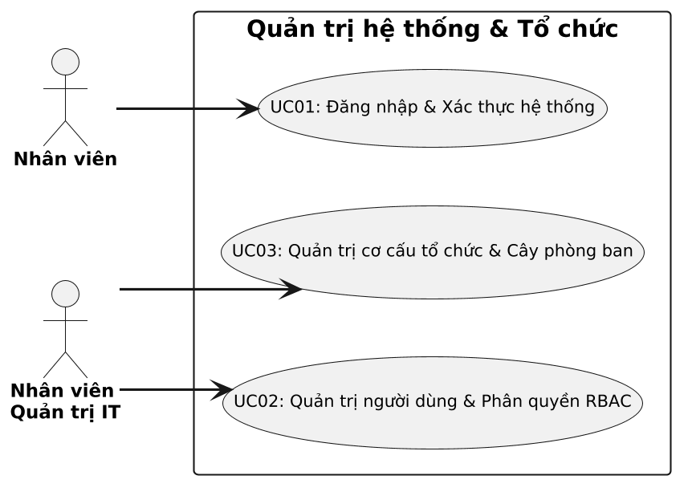

#### B. Nhóm B - Tuyển dụng & Ứng viên (UC04 - UC08)
Biểu đồ mô tả chu trình tuyển dụng từ đề xuất nhu cầu, kiểm soát định biên, duyệt chỉ tiêu, sàng lọc ứng viên ATS Kanban đến phát hành thư mời làm việc.
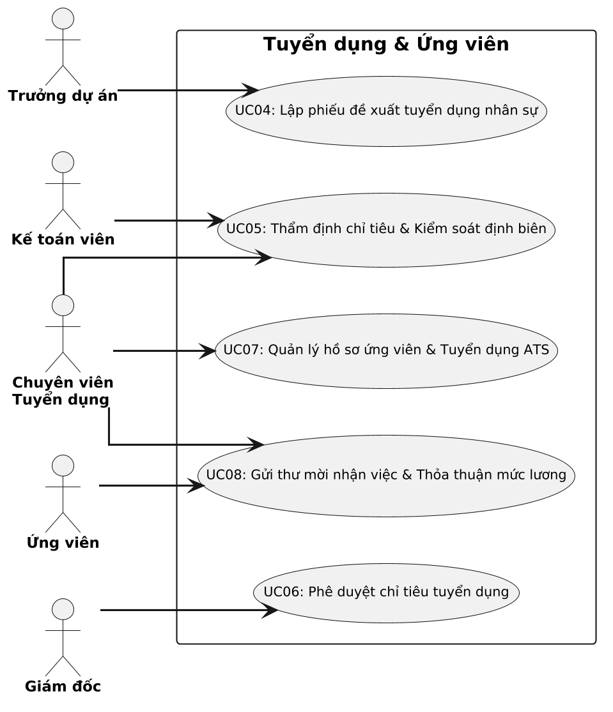

#### C. Nhóm C - Hồ sơ nhân sự & Hội nhập (UC09 - UC14)
Biểu đồ mô tả quản lý hồ sơ nhân viên toàn diện, hợp đồng lao động, bằng cấp chứng chỉ, mượn trả hồ sơ gốc, đánh giá thử việc và lộ trình hội nhập Onboarding.
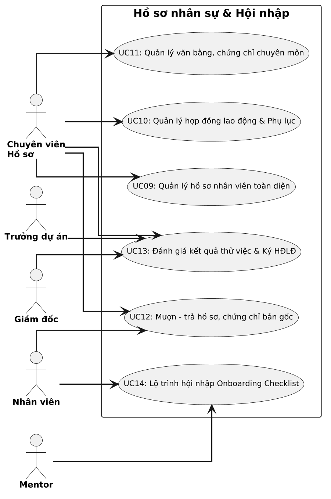

#### D. Nhóm D - Cổng tự phục vụ nhân viên (UC15 - UC17)
Biểu đồ mô tả cổng tự phục vụ tập trung của nhân viên, cơ chế quản lý thông tin phân cấp 3 mức độ và luồng thẩm định điều chỉnh hồ sơ.
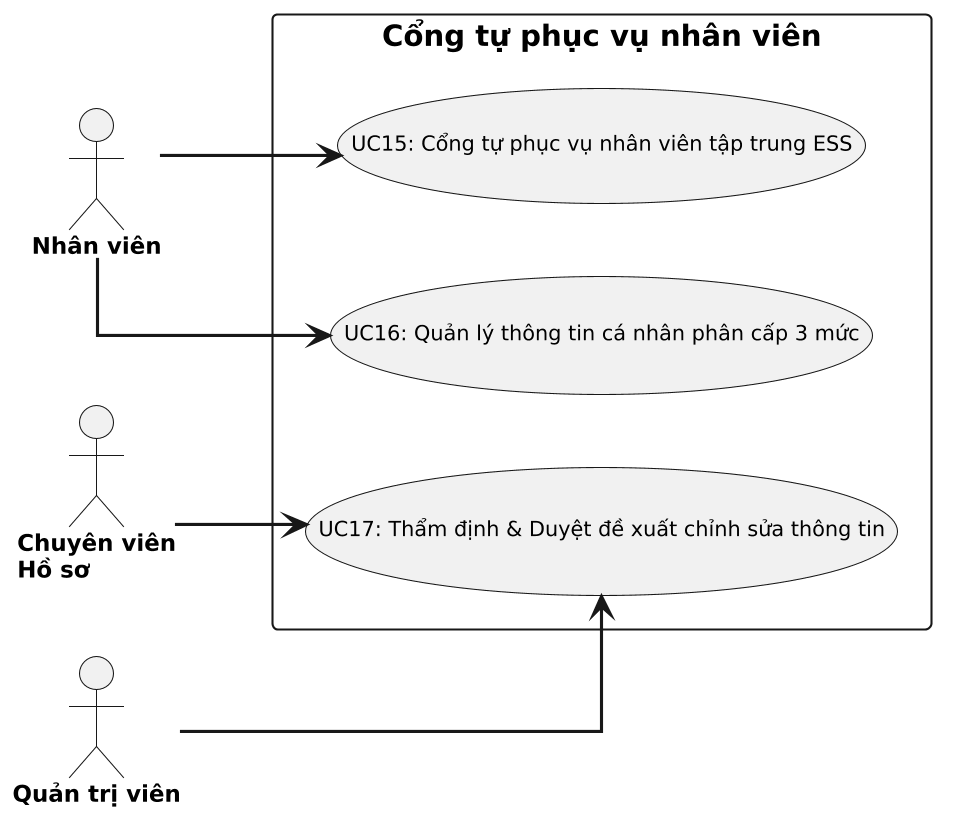

#### E. Nhóm E - Chấm công & Phân ca (UC18 - UC25)
Biểu đồ mô tả chu trình ghi nhận sự kiện điểm danh đa nguồn (Khuôn mặt IR, Web, Máy chấm công), đăng ký nghỉ phép, OT, phân ca, giải trình lệch công và chốt bảng công tháng.
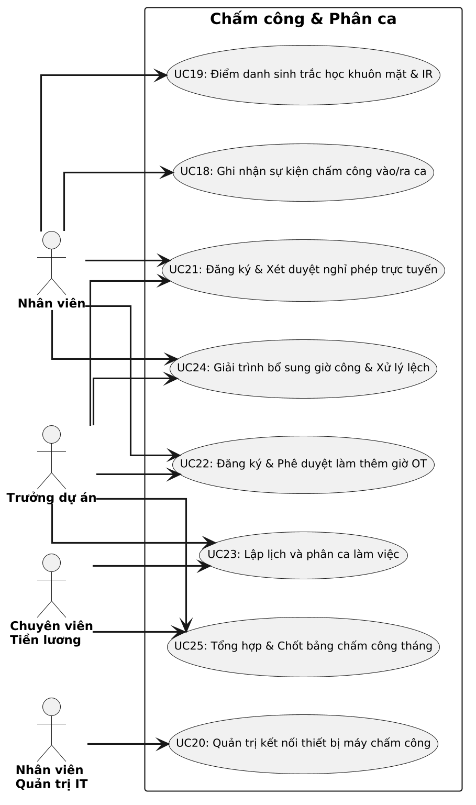

#### F. Nhóm F - Tiền lương & Phúc lợi (UC26 - UC31)
Biểu đồ mô tả cấu hình công thức lương, vận hành chức năng tính lương tự động, khóa kỳ lương bất biến LOCKED, quản lý khoản vay phúc lợi, quyết toán công tác phí T&E và cấp phát tài sản.
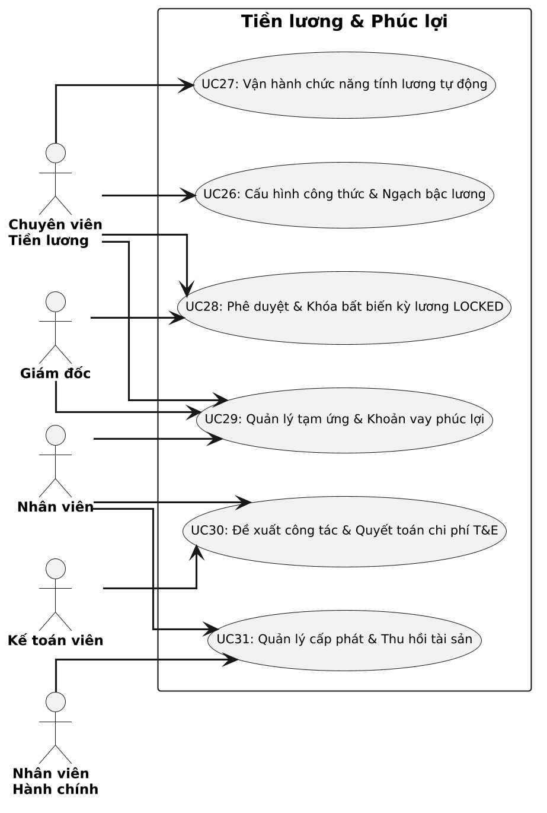

#### G. Nhóm G - Biến động nhân sự & Thôi việc (UC32 - UC36)
Biểu đồ mô tả quy trình điều chuyển nội bộ, điều chỉnh bậc lương, khen thưởng, kỷ luật lao động và tiếp nhận xử lý thôi việc bàn giao 5 bên.
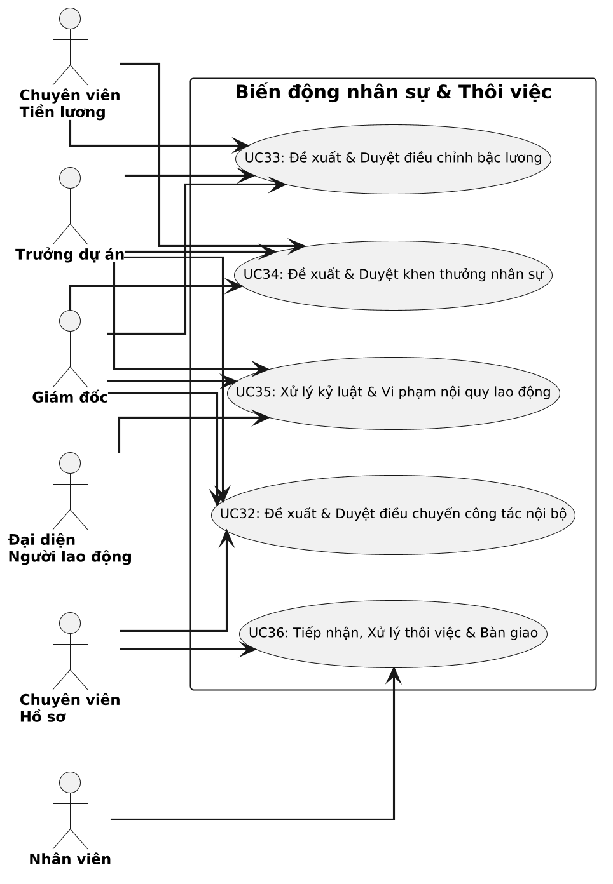

#### H. Nhóm H - Đánh giá hiệu suất & Đào tạo (UC37 - UC39)
Biểu đồ mô tả quy trình đánh giá hiệu suất 360 độ OKR/KPI, tổ chức đào tạo nội bộ và tiếp nhận giải quyết khiếu nại lao động bảo mật.
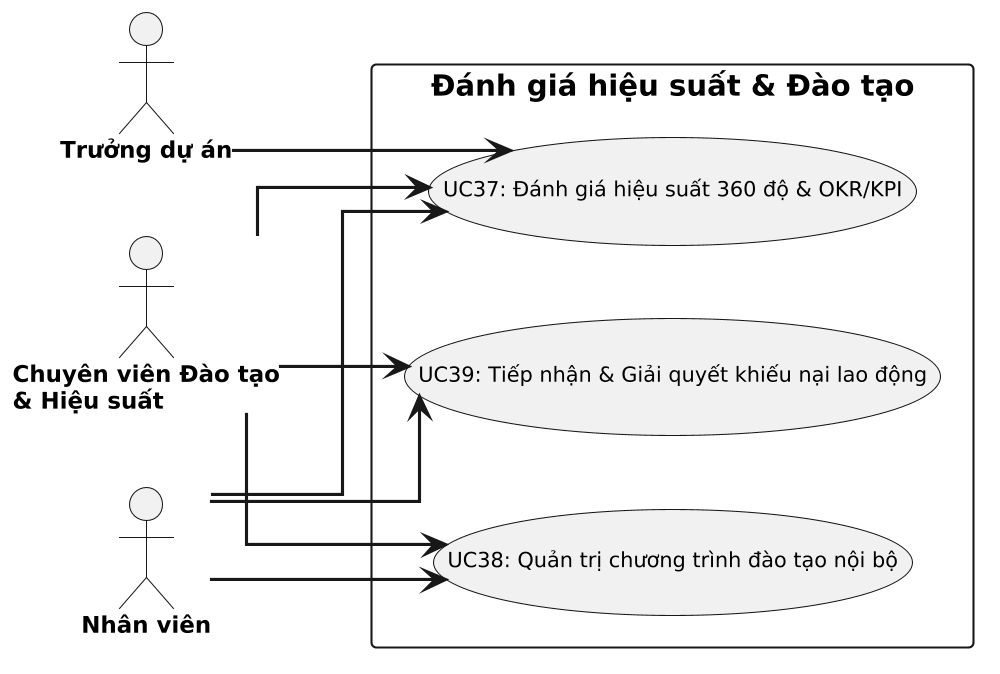

#### I. Nhóm I - Chuẩn cán bộ & Báo cáo (UC40 - UC43)
Biểu đồ mô tả quản lý hồ sơ cán bộ theo chuẩn Mẫu 2C-BNV, danh mục ngạch bậc lương NĐ 204, tự động rà soát nâng bậc lương và kết xuất biểu mẫu báo cáo nhà nước.
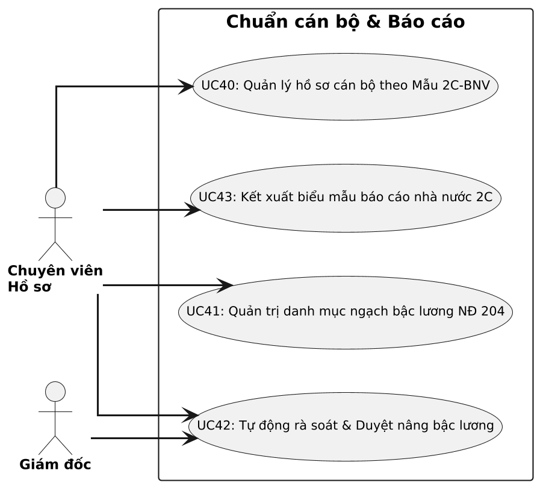

#### J. Nhóm J - Quản trị tri thức & Điều hành (UC44 - UC47)
Biểu đồ mô tả quản trị kho tri thức số SOP, tìm kiếm toàn văn FTS & danh bạ chuyên gia, bảng điều khiển phân tích số Dashboard và nhật ký kiểm toán hệ thống.
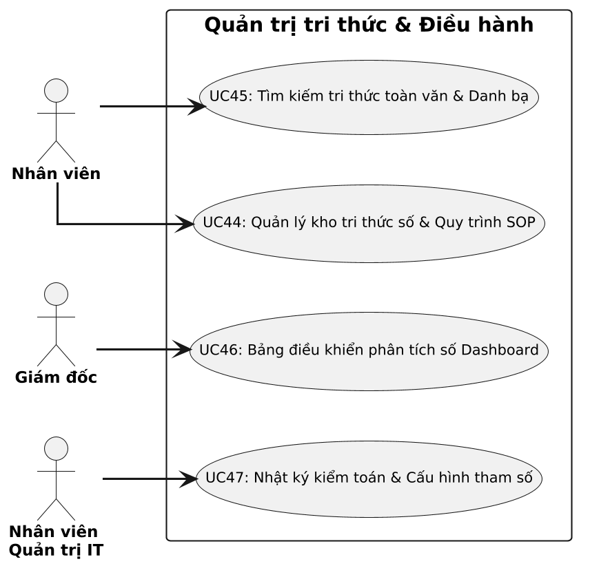

### 2.1.5. Phân tầng yêu cầu: từ quy trình nghiệp vụ đến use case hệ thống

Để đảm bảo hệ thống phần mềm đáp ứng chuẩn xác nhu cầu vận hành thực tế của Công ty Cổ phần Phần mềm Saigon Technology, kiến trúc phân tích thực hiện chuyển hóa yêu cầu qua 3 tầng: Tầng quy trình nghiệp vụ thực tế doanh nghiệp -> Tầng Use case nghiệp vụ -> Tầng Use case hệ thống cài đặt trên phần mềm.

Dưới đây là mô tả chi tiết 18 quy trình nghiệp vụ cốt lõi đang được vận hành và số hóa hoàn chỉnh trên hệ thống:

**1. Quy trình Tuyển dụng nhân sự & Quản lý ứng viên:**
- Bối cảnh & Căn cứ: Áp dụng khi các dự án phần mềm ký thêm hợp đồng với khách hàng quốc tế hoặc cần bổ sung nhân lực thay thế hao hụt tự nhiên. Căn cứ vào định biên dự án, ngân sách và bản mô tả công việc (JD).
- Trình tự thực hiện: Trưởng dự án lập phiếu đề xuất tuyển dụng trên hệ thống; Hệ thống kiểm tra định biên nhân sự phòng ban và gửi chuyên viên tuyển dụng thẩm định; Kế toán trưởng xác nhận khả năng chi trả của quỹ ngân sách; Giám đốc duyệt mở vị trí tuyển dụng. Chuyên viên tuyển dụng đăng tin trên bảng Kanban ATS (`/recruitment-ats`), tiếp nhận hồ sơ ứng viên, điều phối phỏng vấn 2 vòng (năng lực kỹ thuật và văn hóa), chấm điểm Scorecard. Khi đạt yêu cầu, HR gửi thư mời nhận việc (Offer) và bấm "1-Click Nhận việc" để tự động chuyển ứng viên thành nhân viên chính thức.
- Ánh xạ Use case & Giao diện: UC04, UC05, UC06, UC07, UC08. Giao diện: Tuyển dụng ATS (`/recruitment-ats`), Danh mục vị trí (`/admin/catalogs`).

**2. Quy trình Tiếp nhận hồ sơ & Hội nhập nhân viên mới:**
- Bối cảnh & Căn cứ: Áp dụng trong ngày đầu tiên tiếp nhận nhân sự, bảo đảm tuân thủ quy chuẩn An ninh thông tin ISO/IEC 27001 và Thỏa thuận bảo mật thông tin khách hàng (NDA).
- Trình tự thực hiện: Sau khi ứng viên đồng ý nhận việc, chuyên viên hồ sơ đối chiếu văn bằng gốc, CCCD gắn chip và ký hợp đồng thử việc; Hệ thống tự động sinh Mã nhân viên duy nhất và kích hoạt tài khoản cổng thông tin nội bộ; Bộ phận Hành chính cấp phát chỗ ngồi, thẻ từ; Bộ phận IT kích hoạt tài khoản hệ thống (Email, Slack, Jira, VPN) và máy trạm làm việc; Hệ thống tự động gán Lộ trình hội nhập 14 ngày gồm các nhiệm vụ đào tạo chính sách và thiết lập môi trường phát triển dưới sự hướng dẫn của Mentor.
- Ánh xạ Use case & Giao diện: UC09, UC10, UC11, UC14. Giao diện: Hồ sơ nhân viên (`/employees`, `/employees/[id]`), Tài liệu hội nhập (`/documents`), Quản trị người dùng (`/admin/users`).

**3. Quy trình Đánh giá Thử việc & Ký Hợp đồng chính thức:**
- Bối cảnh & Căn cứ: Căn cứ Điều 24 đến Điều 27 Bộ luật Lao động 2019 về thời hạn thử việc (tối đa 60 ngày đối với công việc kỹ thuật chuyên môn).
- Trình tự thực hiện: Trước ngày kết thúc thử việc 15 ngày, hệ thống tự động gửi thông báo nhắc nhở Trưởng dự án và HR; Trưởng dự án thực hiện chấm điểm đánh giá thử việc về năng suất code, tỷ lệ lỗi và thái độ làm việc; Chuyên viên tiền lương đối chiếu thang bảng lương để xác định mức thu nhập chính thức; Giám đốc phê duyệt kết quả; Hệ thống sinh Hợp đồng lao động có thời hạn và kích hoạt việc tham gia BHXH bắt buộc từ ngày ký hợp đồng chính thức.
- Ánh xạ Use case & Giao diện: UC10, UC13. Giao diện: Hồ sơ nhân viên - Tab Hợp đồng (`/employees/[id]`), Biến động nhân sự (`/personnel`), Khung bậc lương (`/salary-ranks`).

**4. Quy trình Phân ca, Chấm công & Điểm danh đa nguồn:**
- Bối cảnh & Căn cứ: Phục vụ hơn 430 kỹ sư làm việc tại TP.HCM và Đà Nẵng theo nhiều ca: hành chính, lệch giờ (US/EU shift) và làm việc từ xa (Remote/Hybrid). Căn cứ Điều 97 Bộ luật Lao động 2019 về ghi nhận thời gian làm việc.
- Trình tự thực hiện: Trưởng dự án hoặc HR lập lịch phân ca cho từng nhân sự hoặc nhóm dự án; Hàng ngày, nhân viên thực hiện điểm danh qua một trong các kênh chuẩn hóa: (a) Máy chấm công vân tay/thẻ từ đẩy dữ liệu qua webhook có chữ ký HMAC-SHA256, (b) Kiosk nhận diện khuôn mặt sinh trắc học kết hợp cảm biến hồng ngoại IR chống giả mạo tại sảnh (`/check-in`), (c) Web Check-in trên cổng ESS; Hệ thống tự động ghép ca, tính toán giờ làm việc thực tế, thời gian đi muộn, về sớm và xác định trạng thái ngày công; Trường hợp quên điểm danh, nhân viên nộp đơn giải trình kèm minh chứng để quản lý phê duyệt hiệu chỉnh; Đến ngày 25 hàng tháng, chuyên viên nhân sự chốt bảng chấm công chuẩn bị cho kỳ tính lương.
- Ánh xạ Use case & Giao diện: UC18, UC19, UC20, UC23, UC24, UC25. Giao diện: Bảng chấm công (`/attendance`), Phân ca (`/shifts`), Kiosk điểm danh (`/check-in`), Quản trị máy chấm công (`/admin/attendance`).

**5. Quy trình Quản lý Nghỉ phép:**
- Bối cảnh & Căn cứ: Căn cứ Điều 113 đến Điều 115 Bộ luật Lao động 2019 về chế độ nghỉ phép năm (12 ngày phép cơ bản, cộng thêm 1 ngày sau mỗi 5 năm thâm niên) và các chế độ nghỉ việc riêng, nghỉ bảo hiểm (ốm đau, thai sản).
- Trình tự thực hiện: Nhân viên tra cứu số dư phép khả dụng trên cổng ESS (`/leave`) và tạo đơn xin nghỉ phép; Hệ thống tự động kiểm tra số dư: nếu quỹ phép còn đủ, chuyển đơn tới Trưởng dự án phê duyệt; Trưởng dự án cân đối tiến độ chạy nước rút (Sprint) để phê duyệt hoặc từ chối; Khi đơn được duyệt, hệ thống tự động trừ quỹ phép ngay lập tức và nạp ngày nghỉ vào bảng chấm công tháng; Bộ phận C&B theo dõi các chứng từ nghỉ ốm đau, thai sản để làm thủ tục trợ cấp BHXH.
- Ánh xạ Use case & Giao diện: UC15, UC21. Giao diện: Quản lý nghỉ phép (`/leave`), Cổng thông tin nhân viên (`/ess`).

**6. Quy trình Quản lý Làm thêm giờ:**
- Bối cảnh & Căn cứ: Căn cứ Điều 107 Bộ luật Lao động 2019 và Nghị định 145/2020/NĐ-CP về giới hạn làm thêm giờ (tối đa không quá 40 giờ/tháng và 200 giờ/năm).
- Trình tự thực hiện: Khi dự án cần huy động làm thêm giờ để kịp tiến độ bàn giao sản phẩm, Trưởng dự án lập kế hoạch OT hoặc nhân viên nộp đơn đăng ký trước; Hệ thống tự động kiểm tra số giờ lũy kế trong tháng và trong năm: nếu vượt trần quy định, tự động chặn đăng ký; Sau khi hoàn thành ca làm thêm, nhân viên điểm danh xác nhận và nộp bảng kê khối lượng công việc; Quản lý dự án phê duyệt nghiệm thu giờ công; Hệ thống tự động tính hệ số lương làm thêm (150% ngày thường, 200% ngày nghỉ cuối tuần, 300% ngày lễ) nạp vào bảng lương tháng.
- Ánh xạ Use case & Giao diện: UC15, UC22. Giao diện: Quản lý làm thêm giờ (`/overtime`), Bảng chấm công (`/attendance`).

**7. Quy trình Chu kỳ Tính & Khóa Bảng lương hàng tháng:**
- Bối cảnh & Căn cứ: Căn cứ Điều 90 đến Điều 104 Bộ luật Lao động 2019, Luật Thuế TNCN và Luật Bảo hiểm xã hội hiện hành.
- Trình tự thực hiện: Vào ngày 25 hàng tháng, bộ phận nhân sự khóa dữ liệu chấm công; Chuyên viên tiền lương kích hoạt Chức năng tính lương tự động (`/payroll-engine`); Hệ thống tự động tính toán chi tiết: lương thời gian theo ngày công thực tế, lương làm thêm giờ, phụ cấp, thưởng dự án, trích nộp bảo hiểm xã hội (10.5%), giảm trừ gia cảnh, tính thuế TNCN theo biểu lũy tiến và khấu trừ nợ vay phúc lợi (đảm bảo tổng khấu trừ không vượt quá 30% lương Net); Kế toán trưởng đối soát tổng quỹ lương; Giám đốc phê duyệt điện tử; Chuyên viên nhân sự chuyển trạng thái kỳ lương sang LOCKED (kích hoạt cơ chế bất biến, chặn hoàn toàn mọi thao tác tính lại với lỗi HTTP 409); Hệ thống kết xuất lệnh chi ngân hàng và phát hành Phiếu lương điện tử (ePayslip) bảo mật tới từng nhân viên qua cổng ESS.
- Ánh xạ Use case & Giao diện: UC25, UC26, UC27, UC28. Giao diện: Chức năng tính lương tự động (`/payroll-engine`), Phiếu lương cá nhân (`/ess`), Báo cáo nhân sự (`/personnel-reports`).

**8. Quy trình Tạm ứng Lương & Khoản vay phúc lợi:**
- Bối cảnh & Căn cứ: Căn cứ Điều 101 và Điều 102 Bộ luật Lao động 2019 về tạm ứng tiền lương, giới hạn khấu trừ lương (không quá 30% thực lĩnh) và Quy chế Quỹ phúc lợi nội bộ của Saigon Technology (hạn mức luân chuyển 2 tỷ VNĐ).
- Trình tự thực hiện: Nhân viên sử dụng công cụ mô phỏng tài chính trên giao diện `/loans` kéo chọn số tiền và thời hạn vay (6-36 tháng); Hệ thống tự động tính số tiền trích nợ mỗi kỳ (EMI) và kiểm tra ngưỡng an toàn thu nhập theo Điều 102 (nếu tỷ lệ khấu trừ > 30% lương Net, hệ thống cảnh báo và yêu cầu kéo dài kỳ hạn); Nhân viên nộp hồ sơ theo các gói mục tiêu; Chuyên viên C&B sử dụng công cụ phê duyệt nhanh 1-chạm hoặc trình Giám đốc phê duyệt; Sau khi giải ngân, hệ thống tự động sinh lịch trình hoàn nợ và tự động nạp khoản trích trừ vào phiếu lương hàng tháng; Nhân viên có thể thực hiện tất toán sớm bất kỳ lúc nào trực tiếp trên giao diện mà không chịu phí phạt.
- Ánh xạ Use case & Giao diện: UC15, UC29. Giao diện: Quản trị Phúc lợi & Khoản vay (`/loans`), Cổng ESS (`/ess`), Chức năng tính lương tự động (`/payroll-engine`).

**9. Quy trình Đề xuất công tác & Quyết toán chi phí:**
- Bối cảnh & Căn cứ: Phục vụ các đợt cử chuyên gia, kỹ sư đi công tác tại các chi nhánh (Hà Nội, Đà Nẵng, TP.HCM) hoặc làm việc trực tiếp tại văn phòng khách hàng quốc tế (Onsite). Căn cứ Quy chế tài chính nội bộ và quy định về chứng từ thuế hợp lệ.
- Trình tự thực hiện: Kỹ sư lập đề xuất công tác trên hệ thống, nêu rõ địa điểm, thời gian và dự toán kinh phí; Quản lý dự án và Giám đốc phê duyệt; Kế toán giải ngân tạm ứng; Sau chuyến công tác, nhân viên đính kèm các hóa đơn điện tử hợp lệ (vé máy bay, khách sạn, công tác phí theo ngày) lập bảng thanh quyết toán chi phí; Kế toán thẩm tra hóa đơn và chi trả phần chênh lệch hoặc thu hồi tạm ứng thừa.
- Ánh xạ Use case & Giao diện: UC15, UC30. Giao diện: Quản lý công tác phí (`/expense-claims`), Cổng ESS (`/ess`).

**10. Quy trình Quản lý Cấp phát & Thu hồi Tài sản, Thiết bị:**
- Bối cảnh & Căn cứ: Quản lý vòng đời tài sản kỹ thuật cao (laptop, màn hình phụ, thiết bị kiểm thử) theo tiêu chuẩn bảo mật ISO 27001.
- Trình tự thực hiện: Căn cứ đề xuất của dự án hoặc tiếp nhận nhân sự mới, bộ phận Hành chính lập phiếu bàn giao tài sản, ghi nhận số seri, cấu hình và trạng thái thiết bị; Nhân viên ký nhận bàn giao điện tử trên cổng ESS; Hệ thống theo dõi lịch sử luân chuyển, bảo dưỡng định kỳ và cảnh báo thiết bị đến hạn khấu hao; Khi nhân viên chuyển dự án hoặc thôi việc, bộ phận Hành chính thực hiện kiểm kê, thu hồi tài sản và xác nhận hoàn tất nghĩa vụ trên hệ thống.
- Ánh xạ Use case & Giao diện: UC15, UC31. Giao diện: Quản lý tài sản (`/assets`), Cổng thông tin cá nhân (`/ess`).

**11. Quy trình Đánh giá Hiệu suất 360 độ & Quản trị Mục tiêu OKR/KPI:**
- Bối cảnh & Căn cứ: Đánh giá năng lực chuyên môn và mức độ đóng góp định kỳ 6 tháng một lần làm căn cứ xét thưởng, tăng lương và quy hoạch cán bộ.
- Trình tự thực hiện: Đầu chu kỳ, nhân viên cùng Trưởng dự án thiết lập mục tiêu KRA/KPI với tỷ trọng % cụ thể; Cuối chu kỳ, nhân viên thực hiện tự đánh giá thành tích; Hệ thống điều phối đánh giá chéo đồng cấp từ các đồng nghiệp cùng dự án; Trưởng dự án tổng hợp kết quả, thực hiện phỏng vấn đánh giá và chấm điểm tổng kết; Nhân viên xem kết quả và ký xác nhận điện tử; Kết quả xếp loại (A, B, C, D) được lưu trữ vào hồ sơ năng lực và tự động chuyển sang phân hệ lương để xét thưởng.
- Ánh xạ Use case & Giao diện: UC15, UC37. Giao diện: Đánh giá hiệu suất 360 (`/performance-360`), Hồ sơ nhân viên (`/employees/[id]`).

**12. Quy trình Rà soát Tăng lương định kỳ & Nâng bậc lương chuẩn Nghị định 204:**
- Bối cảnh & Căn cứ: Căn cứ quy chế tiền lương của doanh nghiệp và hệ thống ngạch bậc lương chuẩn Nghị định 204/2004/NĐ-CP (áp dụng cho khối chuyên gia và cán bộ nòng cốt).
- Trình tự thực hiện: Định kỳ hàng quý, hệ thống tự động quét dữ liệu diễn biến lương (`SalaryProgress`), lập danh sách nhân sự đủ thời gian giữ bậc (24 tháng đối với ngạch B, C; 36 tháng đối với ngạch A1 trở lên); Chuyên viên tiền lương rà soát, đối chiếu với kết quả đánh giá KPI và năng lực thực tế; Lập tờ trình nâng bậc lương kèm hệ số mới hoặc phụ cấp thâm niên vượt khung; Giám đốc xem xét và ký Quyết định nâng bậc lương; Hệ thống tự động cập nhật hệ số mới vào hợp đồng và áp dụng cho kỳ lương tiếp theo.
- Ánh xạ Use case & Giao diện: UC33, UC41, UC42. Giao diện: Bảng bậc lương (`/salary-ranks`), Biến động nhân sự (`/personnel`), Chức năng tính lương tự động (`/payroll-engine`).

**13. Quy trình Điều chuyển, Luân chuyển & Bổ nhiệm vị trí công tác:**
- Bối cảnh & Căn cứ: Thực hiện khi điều động nhân sự giữa các dự án phần mềm, bổ nhiệm cán bộ quản lý hoặc luân chuyển giữa các chi nhánh TP.HCM - Đà Nẵng.
- Trình tự thực hiện: Trưởng dự án lập đề xuất điều chuyển nhân viên; Quản lý đơn vị tiếp nhận và chuyên viên nhân sự kiểm tra năng lực và sự phù hợp; Giám đốc phê duyệt lệnh điều chuyển; Hệ thống tự động cập nhật lại cơ cấu tổ chức phòng ban, chức danh công tác và quyền hạn dự án của nhân viên trên hệ thống phần mềm.
- Ánh xạ Use case & Giao diện: UC09, UC32. Giao diện: Biến động nhân sự (`/personnel`), Sơ đồ tổ chức (`/org-chart`), Hồ sơ nhân sự (`/employees/[id]`).

**14. Quy trình Quản lý Đào tạo nội bộ & Giải quyết Khiếu nại:**
- Bối cảnh & Căn cứ: Nâng cao năng lực kỹ thuật công nghệ mới cho kỹ sư và duy trì môi trường làm việc minh bạch, tuân thủ pháp luật lao động.
- Trình tự thực hiện: Bộ phận Đào tạo xây dựng chương trình đào tạo kỹ thuật, công bố lịch học và giới hạn sĩ số trên hệ thống; Nhân viên chủ động đăng ký tham gia; Sau khóa đào tạo, hệ thống ghi nhận kết quả hoàn thành vào hồ sơ cán bộ và thực hiện khảo sát chất lượng; Đối với khiếu nại lao động, nhân viên gửi ý kiến bảo mật qua kênh chuyên biệt; Chuyên viên nhân sự tiếp nhận, tổ chức xác minh và theo dõi xử lý từ trạng thái OPEN đến RESOLVED.
- Ánh xạ Use case & Giao diện: UC15, UC38, UC39. Giao diện: Đào tạo & Khiếu nại (`/training-grievance`), Hồ sơ nhân viên (`/employees/[id]`).

**15. Quy trình Khen thưởng, Kỷ luật & Xử lý vi phạm lao động:**
- Bối cảnh & Căn cứ: Căn cứ Điều 117 đến Điều 132 Bộ luật Lao động 2019 về kỷ luật lao động, trách nhiệm vật chất và Quy chế thi đua khen thưởng của công ty.
- Trình tự thực hiện: Khi có thành tích xuất sắc, quản lý dự án lập đề xuất khen thưởng; Giám đốc duyệt và hệ thống tự động nạp tiền thưởng vào kỳ tính lương tiếp theo; Khi phát sinh hành vi vi phạm kỷ luật (vi phạm bảo mật thông tin, nghỉ làm không phép kéo dài), bộ phận nhân sự lập biên bản vi phạm; Tổ chức phiên họp xử lý kỷ luật có sự tham gia bắt buộc của Đại diện người lao động (Công đoàn); Giám đốc ký Quyết định kỷ luật; Hệ thống ghi nhận tiền án kỷ luật vào hồ sơ nhân sự và thực hiện tạm dừng nâng lương hoặc chấm dứt hợp đồng theo đúng quy định.
- Ánh xạ Use case & Giao diện: UC34, UC35. Giao diện: Biến động nhân sự (`/personnel`), Hồ sơ cán bộ (`/personnel-reports`).

**16. Quy trình Quản lý Hồ sơ Cán bộ Toàn diện & Báo cáo chuẩn Mẫu 2C-BNV/2008:**
- Bối cảnh & Căn cứ: Căn cứ Quyết định 06/2007/QĐ-BNV và Thông tư 11/2012/TT-BNV về quản lý hồ sơ cán bộ, công chức, viên chức.
- Trình tự thực hiện: Hệ thống quản lý toàn diện 111 thuộc tính thông tin cán bộ theo chuẩn Mẫu 2C-BNV/2008 kết hợp 8 bảng quá trình lịch sử (diễn biến lương, đào tạo, khen thưởng, kỷ luật, gia đình...); Chuyên viên hồ sơ tra cứu, cập nhật dữ liệu; Khi có yêu cầu báo cáo cho cơ quan quản lý nhà nước hoặc lưu trữ hành chính, hệ thống tự động kết xuất Sơ yếu lý lịch Mẫu 2C-BNV định dạng PDF khổ in A4 4 trang và các Biểu 01, 02, 03 định dạng bảng tính Excel.
- Ánh xạ Use case & Giao diện: UC40, UC43. Giao diện: Báo cáo nhân sự & Cán bộ (`/personnel-reports`), Danh mục dùng chung (`/admin/catalogs`).

**17. Quy trình Thôi việc, Nghỉ việc & Bàn giao Đa bộ phận (Offboarding & Handover Checklist):**
- Bối cảnh & Căn cứ: Căn cứ Điều 34 đến Điều 48 Bộ luật Lao động 2019 về chấm dứt hợp đồng lao động và nghĩa vụ của các bên khi chấm dứt HĐLĐ.
- Trình tự thực hiện: Nhân viên gửi đơn xin thôi việc trên hệ thống; Quản lý dự án và Giám đốc phê duyệt; Hệ thống tự động khởi tạo Danh mục bàn giao trách nhiệm 5 bước độc lập (`HandoverChecklist`); Lần lượt từng bộ phận kiểm tra và bấm xác nhận bàn giao điện tử (PM xác nhận mã nguồn, Hành chính thu hồi tài sản, IT thu hồi tài khoản và quyền truy cập, C&B quyết toán công nợ và ngày phép, Hệ thống tự động xóa vector khuôn mặt sinh trắc học theo Nghị định 13); Chỉ khi 5/5 hạng mục được xác nhận đầy đủ, Giám đốc mới ký Quyết định thôi việc; Đến ngày làm việc cuối cùng, tài khoản của nhân viên tự động bị khóa vĩnh viễn.
- Ánh xạ Use case & Giao diện: UC36. Giao diện: Biến động nhân sự (`/personnel`), Danh mục bàn giao (`/documents`), Quản trị người dùng (`/admin/users`).

**18. Quy trình Phân cấp Quản trị Dữ liệu Cá nhân & Thẩm định Điều chỉnh Hồ sơ Nhân sự:**
- Bối cảnh & Căn cứ: Căn cứ Nghị định 13/2023/NĐ-CP về bảo vệ dữ liệu cá nhân, nhằm ngăn ngừa việc tự ý chỉnh sửa các thông tin định danh pháp lý và tài chính.
- Trình tự thực hiện: Dữ liệu hồ sơ nhân sự được phân định thành 3 phân cấp: Mức 1 (Thông tin liên lạc như SĐT, địa chỉ - nhân viên tự sửa trên ESS); Mức 2 (Thông tin định danh pháp lý và tài chính như CCCD, số tài khoản ngân hàng, bằng cấp - nhân viên lập đề xuất thay đổi kèm hình ảnh chứng từ minh chứng hợp lệ); Mức 3 (Vị trí, ngạch bậc, mức lương - khóa cố định chỉ xem, chỉ thay đổi qua quyết định hành chính); Chuyên viên hồ sơ tiếp nhận yêu cầu Mức 2 tại Hàng đợi thẩm định (`ProfileChangeReviewQueue`), đối soát ảnh chụp minh chứng với dữ liệu đề xuất; Bấm phê duyệt để hệ thống cập nhật nguyên tử vào CSDL và lưu vết kiểm toán, hoặc từ chối kèm lý do phản hồi cho nhân viên.
- Ánh xạ Use case & Giao diện: UC16, UC17. Giao diện: Cổng ESS (`/ess`), Hồ sơ cá nhân (`/profile`), Quản lý nhân viên (`/employees`).

**Bảng 2.5. Bảng ánh xạ ba tầng: từ Quy trình nghiệp vụ đến Use Case và Màn hình thực tế**

| STT | Tên Quy trình nghiệp vụ thực tế | Tác nhân chính | Mã Use Case hệ thống tương ứng | Giao diện màn hình thực tế trong ứng dụng |
| :---: | :--- | :--- | :--- | :--- |
| 1 | Quản trị hệ thống, Định danh & Phân quyền RBAC | Quản trị viên IT, Toàn thể nhân viên | UC01, UC02, UC03 | `/login`, `/admin/users`, `/admin/org-units`, `/org-chart` |
| 2 | Tuyển dụng & Quản trị ứng viên | Trưởng dự án, CV Tuyển dụng, Giám đốc | UC04, UC05, UC06, UC07, UC08 | `/recruitment-ats`, `/admin/catalogs` |
| 3 | Tiếp nhận hồ sơ, Văn bằng & Hội nhập | Nhân viên mới, CV Hồ sơ, IT | UC09, UC10, UC11, UC12, UC14 | `/employees`, `/documents`, `/admin/users`, `/employees/[id]` |
| 4 | Đánh giá thử việc & Ký hợp đồng | Trưởng dự án, CV Hồ sơ, Giám đốc | UC10, UC13 | `/employees/[id]`, `/personnel`, `/salary-ranks` |
| 5 | Cổng tự phục vụ & Dữ liệu cá nhân 3 mức độ | Toàn thể nhân viên, CV Hồ sơ | UC15, UC16, UC17 | `/ess`, `/profile`, `/notifications`, `/employees` |
| 6 | Phân ca & Điểm danh đa nguồn | Toàn thể nhân viên, Kiosk, CV Hồ sơ | UC18, UC19, UC20, UC23, UC24, UC25 | `/shifts`, `/check-in`, `/attendance`, `/admin/attendance` |
| 7 | Quản lý Nghỉ phép | Nhân viên, Trưởng dự án, CV Hồ sơ | UC15, UC21 | `/leave`, `/ess` |
| 8 | Quản lý Làm thêm giờ (OT) | Nhân viên, Trưởng dự án, CV Tiền lương | UC15, UC22 | `/overtime`, `/attendance` |
| 9 | Chu kỳ Tính & Khóa Bảng lương | CV Tiền lương, Kế toán, Giám đốc | UC25, UC26, UC27, UC28 | `/payroll-engine`, `/ess`, `/personnel-reports` |
| 10 | Tạm ứng & Khoản vay phúc lợi | Nhân viên, CV Tiền lương, Giám đốc | UC15, UC29 | `/loans`, `/ess`, `/payroll-engine` |
| 11 | Đề xuất & Quyết toán công tác | Nhân viên, Trưởng dự án, Kế toán | UC15, UC30 | `/expense-claims`, `/ess` |
| 12 | Quản lý Cấp phát & Thu hồi tài sản | Nhân viên Hành chính, Nhân viên | UC15, UC31 | `/assets`, `/ess` |
| 13 | Điều chuyển & Bổ nhiệm vị trí | Trưởng dự án, Giám đốc, CV Hồ sơ | UC09, UC32 | `/personnel`, `/org-chart`, `/employees/[id]` |
| 14 | Rà soát & Nâng bậc lương NĐ 204 | CV Hồ sơ, Giám đốc | UC33, UC41, UC42 | `/salary-ranks`, `/personnel`, `/payroll-engine` |
| 15 | Khen thưởng & Kỷ luật lao động | Trưởng dự án, Đại diện NLĐ, Giám đốc | UC34, UC35 | `/personnel`, `/personnel-reports` |
| 16 | Thôi việc & Bàn giao đa bộ phận | Nhân viên, CV Hồ sơ, Các bộ phận | UC36 | `/personnel`, `/documents`, `/admin/users` |
| 17 | Đánh giá Hiệu suất 360 & OKR/KPI | Nhân viên, Trưởng dự án, CV Nhân sự | UC15, UC37 | `/performance-360`, `/employees/[id]` |
| 18 | Đào tạo nội bộ & Khiếu nại lao động | CV Nhân sự, Nhân viên | UC15, UC38, UC39 | `/training-grievance`, `/employees/[id]` |
| 19 | Hồ sơ cán bộ & Báo cáo Mẫu 2C-BNV | CV Hồ sơ | UC40, UC43 | `/personnel-reports`, `/admin/catalogs` |
| 20 | Quản lý tri thức số & Tìm kiếm toàn văn | Toàn thể nhân viên, Quản lý nội dung | UC44, UC45 | `/documents`, `/employees` |
| 21 | Bảng điều khiển phân tích & Kiểm toán hệ thống | Ban Giám đốc, Quản lý, Quản trị IT | UC46, UC47 | `/dashboard`, `/admin/audit`, `/admin/settings` |

---

## 2.2. Phân tích cấu trúc hệ thống

### 2.2.1. Định nghĩa và biểu diễn đối tượng, lớp

Trong phương pháp phân tích thiết kế hướng đối tượng (OOAD), đối tượng đại diện cho một thực thể cụ thể trong bài toán, bao gồm dữ liệu (thuộc tính) và các hành vi xử lý (phương thức). Lớp là bản thiết kế trừu tượng định nghĩa tập hợp các thuộc tính và hành vi chung cho một nhóm đối tượng.

Để phân tách trách nhiệm rõ ràng theo mẫu kiến trúc BCE, các lớp trong hệ thống được phân thành ba nhóm chính:

Lớp Thực thể: Đại diện cho các đối tượng lưu trữ dữ liệu bền vững của doanh nghiệp, ánh xạ trực tiếp thành các model trong ORM Prisma và các bảng dữ liệu quan hệ trong PostgreSQL 16. Các lớp này chịu trách nhiệm duy trì tính toàn vẹn của dữ liệu nghiệp vụ (ví dụ: NhanVien, HopDong, PhieuLuong, DonNghiPhep).

Lớp Biên / Giao diện: Đóng vai trò là cổng giao tiếp tương tác giữa tác nhân bên ngoài với hệ thống bên trong, bao gồm các trang màn hình tác nghiệp Next.js, biểu mẫu nhập liệu, bảng hiển thị dữ liệu và các hộp thoại tương tác.

Lớp Điều khiển: Đảm nhiệm xử lý các logic nghiệp vụ và điều phối dữ liệu giữa tầng giao diện và cơ sở dữ liệu, được hiện thực hóa bằng các dịch vụ NestJS Service (như AuthService, RecruitmentService, AttendanceService, PayrollService).

### 2.2.2. Xác định các đối tượng, lớp từ đặc tả yêu cầu

Bằng phương pháp phân tích ngôn ngữ tự nhiên từ tài liệu khảo sát hiện trạng và đặc tả các ca sử dụng, hệ thống xác định các lớp thực thể cốt lõi tương ứng với các phân hệ chức năng:

Nhóm Đối tượng Con người & Tổ chức:
- NguoiDung (User): Lưu trữ thông tin định danh cơ bản (Mã, Họ tên, Ngày sinh, CCCD, Email, SĐT, Địa chỉ);
- NhanVien: Kế thừa từ NguoiDung, bổ sung thông tin nhân sự (Mã NV, Ngày vào công ty, Vị trí, Đơn vị trực thuộc, Trạng thái PROBATION/ACTIVE/RESIGNED);
- DonVi (OrgUnit): Cấu trúc phòng ban và chi nhánh theo mô hình cây tự tham chiếu, quản lý định biên nhân sự;
- VaiTro (Role): Vai trò phân quyền (USER, KM_MANAGER, ADMIN);
- TaiKhoan (Account): Định danh xác thực, mật khẩu băm bcrypt, mã token JWT và trạng thái khóa tài khoản.

Nhóm Đối tượng Tuyển dụng & Đào tạo:
- PhieuTuyenDung (JobRequisition): Đề xuất tuyển dụng, vị trí, số lượng cần tuyển, trạng thái phê duyệt;
- UngVien (Candidate): Hồ sơ ứng viên, CV đính kèm, trạng thái trên pipeline ATS;
- VongPhongVan (InterviewStage): Thông tin vòng phỏng vấn, người phỏng vấn, nhận xét và điểm số Scorecard;
- ThuMoi (JobOffer): Thư mời nhận việc, mức lương thỏa thuận, ngày nhận việc;
- KhoaDaoTao (TrainingCourse): Chương trình đào tạo kỹ thuật, số lượng chỗ, giảng viên và kết quả đánh giá;
- KhieuNai (Grievance): Đơn phản ánh, khiếu nại bảo mật và tiến độ giải quyết.

Nhóm Đối tượng Hồ sơ, Hợp đồng & Biến động:
- HopDong (Contract): Hợp đồng thử việc, hợp đồng xác định thời hạn (12-36 tháng), lương cơ bản, lương đóng BHXH;
- VanBang (Certificate): Bằng tốt nghiệp đại học, chứng chỉ công nghệ, số hiệu, nơi cấp, bản quét lưu trữ;
- PhieuMuonTra (DocumentLending): Phiếu mượn - trả bằng cấp bản gốc, ngày mượn, hạn trả, ngày thu hồi;
- DeXuatBienDong (PersonnelAction): Đề xuất dùng chung cho các luồng thuyên chuyển, tăng lương, khen thưởng, kỷ luật, thôi việc;
- NhiemVuBanGiao: Danh mục kiểm tra trách nhiệm bàn giao 5 bước độc lập khi thôi việc.

Nhóm Đối tượng Chấm công, Nghỉ phép & Điểm danh:
- SuKienDiemDanh: Sự kiện điểm danh bất biến (Thời điểm, Nguồn: MACHINE/WEB/FACE/SIMULATOR, Cờ lệch);
- ThietBiChamCong: Cấu hình máy chấm công phần cứng, vị trí lắp đặt, khóa xác thực HMAC;
- MauKhuonMat: Vector đặc trưng khuôn mặt 128 chiều đã mã hóa AES-256-GCM (không lưu ảnh gốc);
- CaLamViec: Khung giờ làm việc chuẩn, thời gian nghỉ giữa ca, dung sai ân hạn đi muộn;
- BangCongNgay: Tổng hợp ngày công, giờ vào/ra thực tế, phút đi muộn, về sớm, giờ làm thêm;
- DonNghiPhep: Đơn xin nghỉ phép, loại phép, khoảng thời gian, trạng thái phê duyệt;
- SoDuPhep: Quỹ phép năm của nhân viên (12 ngày chuẩn + thâm niên 1 ngày/5 năm).

Nhóm Đối tượng Tiền lương, Phúc lợi & Tài sản:
- ThanhPhanLuong: Thành phần lương Gross, phụ cấp, thưởng, các khoản khấu trừ;
- KyLuong: Kỳ lương tháng, trạng thái chu kỳ (OPEN -> REVIEWED -> LOCKED);
- PhieuLuong: Phiếu lương điện tử chi tiết từng cá nhân;
- KhoanVay: Khoản vay phúc lợi, lãi suất ưu đãi, thời hạn, số tiền khấu trừ mỗi kỳ (EMI <= 30% lương Net);
- CongTacPhi: Đề xuất công tác, tạm ứng và bảng thanh quyết toán chi phí kèm hóa đơn điện tử;
- TaiSan: Quản lý vòng đời tài sản thiết bị kỹ thuật (laptop, màn hình), trạng thái bàn giao và thu hồi.

Nhóm Đối tượng Quản trị & Tri thức:
- HoSoCanBo: Hồ sơ lý lịch 111 thuộc tính theo Mẫu 2C-BNV/2008 và 8 bảng diễn biến lịch sử;
- NgachLuong: Khung 184 ngạch bậc lương chuẩn Nghị định 204/2004/NĐ-CP;
- BaiViet: Bài viết quy trình SOP, phiên bản nội dung bất biến (ArticleVersion);
- NhatKyKiemToan: Nhật ký kiểm toán hệ thống ghi vết chỉ thêm (Append-Only) cho mọi giao dịch dữ liệu.

## 2.3. Phân tích hành vi của hệ thống

### 2.3.1. Xây dựng biểu đồ trình tự

Biểu đồ trình tự mô tả chi tiết chuỗi tương tác theo thứ tự thời gian giữa các tác nhân người dùng, lớp biên giao diện, lớp điều khiển nghiệp vụ và các thực thể dữ liệu trong hệ thống. Dưới đây là đầy đủ 47 biểu đồ trình tự tương ứng với 47 Use Case nghiệp vụ của toàn bộ hệ thống quản trị nhân lực:

#### 2.3.1.1. Biểu đồ trình tự Use case Đăng nhập & Xác thực hệ thống (UC01)

Kịch bản tương tác Use Case UC01: Tác nhân Toàn thể nhân viên tương tác với giao diện hệ thống; tầng điều khiển tiếp nhận và xác thực nghiệp vụ, thực hiện truy vấn và cập nhật trạng thái dữ liệu trên cơ sở dữ liệu, đồng thời tự động ghi nhận nhật ký kiểm toán hệ thống.

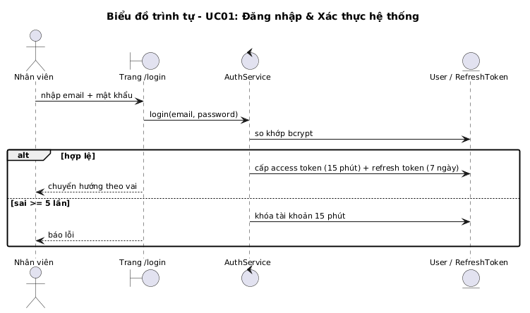

#### 2.3.1.2. Biểu đồ trình tự Use case Quản trị người dùng & Phân quyền RBAC (UC02)

Kịch bản tương tác Use Case UC02: Tác nhân Nhân viên Quản trị IT tương tác với giao diện hệ thống; tầng điều khiển tiếp nhận và xác thực nghiệp vụ, thực hiện truy vấn và cập nhật trạng thái dữ liệu trên cơ sở dữ liệu, đồng thời tự động ghi nhận nhật ký kiểm toán hệ thống.

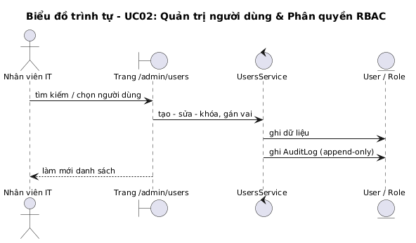

#### 2.3.1.3. Biểu đồ trình tự Use case Quản trị cơ cấu tổ chức & Cây phòng ban (UC03)

Kịch bản tương tác Use Case UC03: Tác nhân Nhân viên Quản trị IT tương tác với giao diện hệ thống; tầng điều khiển tiếp nhận và xác thực nghiệp vụ, thực hiện truy vấn và cập nhật trạng thái dữ liệu trên cơ sở dữ liệu, đồng thời tự động ghi nhận nhật ký kiểm toán hệ thống.

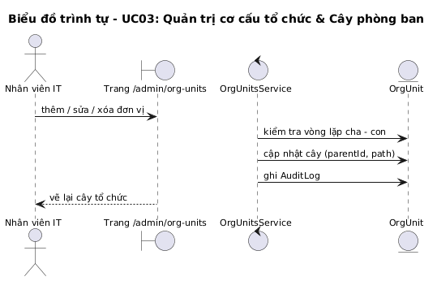

#### 2.3.1.4. Biểu đồ trình tự Use case Lập phiếu đề xuất tuyển dụng nhân sự (UC04)

Kịch bản tương tác Use Case UC04: Tác nhân Trưởng dự án tương tác với giao diện hệ thống; tầng điều khiển tiếp nhận và xác thực nghiệp vụ, thực hiện truy vấn và cập nhật trạng thái dữ liệu trên cơ sở dữ liệu, đồng thời tự động ghi nhận nhật ký kiểm toán hệ thống.

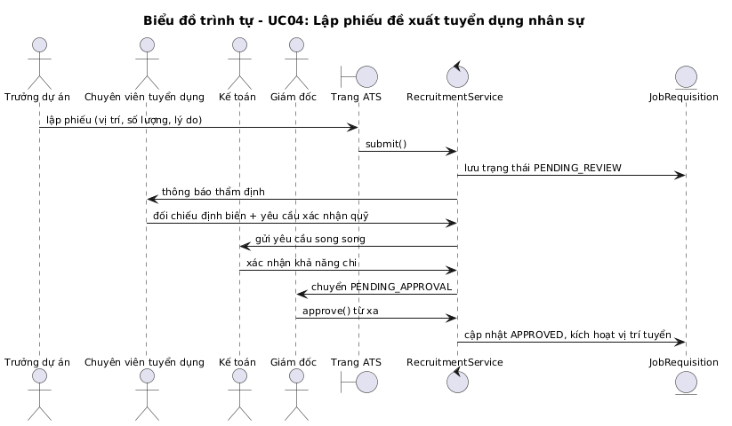

#### 2.3.1.5. Biểu đồ trình tự Use case Thẩm định chỉ tiêu & Kiểm soát định biên tuyển dụng (UC05)

Kịch bản tương tác Use Case UC05: Tác nhân Chuyên viên Tuyển dụng, Kế toán tương tác với giao diện hệ thống; tầng điều khiển tiếp nhận và xác thực nghiệp vụ, thực hiện truy vấn và cập nhật trạng thái dữ liệu trên cơ sở dữ liệu, đồng thời tự động ghi nhận nhật ký kiểm toán hệ thống.

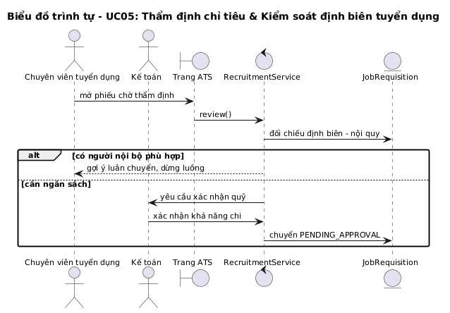

#### 2.3.1.6. Biểu đồ trình tự Use case Phê duyệt chỉ tiêu tuyển dụng (UC06)

Kịch bản tương tác Use Case UC06: Tác nhân Giám đốc tương tác với giao diện hệ thống; tầng điều khiển tiếp nhận và xác thực nghiệp vụ, thực hiện truy vấn và cập nhật trạng thái dữ liệu trên cơ sở dữ liệu, đồng thời tự động ghi nhận nhật ký kiểm toán hệ thống.

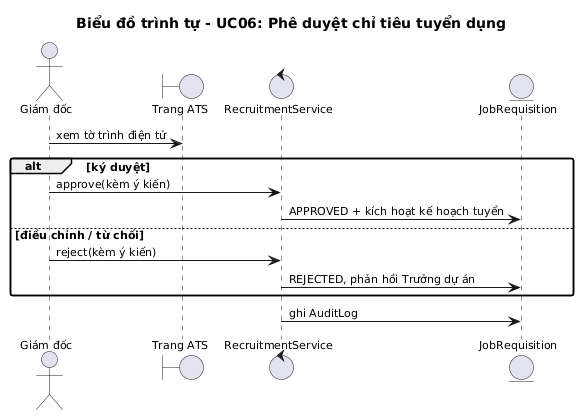

#### 2.3.1.7. Biểu đồ trình tự Use case Quản lý hồ sơ ứng viên & Tuyển dụng ATS Kanban (UC07)

Kịch bản tương tác Use Case UC07: Tác nhân Chuyên viên Tuyển dụng tương tác với giao diện hệ thống; tầng điều khiển tiếp nhận và xác thực nghiệp vụ, thực hiện truy vấn và cập nhật trạng thái dữ liệu trên cơ sở dữ liệu, đồng thời tự động ghi nhận nhật ký kiểm toán hệ thống.

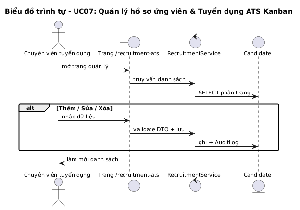

#### 2.3.1.8. Biểu đồ trình tự Use case Gửi thư mời nhận việc & Thỏa thuận mức lương (UC08)

Kịch bản tương tác Use Case UC08: Tác nhân Chuyên viên Tuyển dụng, Ứng viên tương tác với giao diện hệ thống; tầng điều khiển tiếp nhận và xác thực nghiệp vụ, thực hiện truy vấn và cập nhật trạng thái dữ liệu trên cơ sở dữ liệu, đồng thời tự động ghi nhận nhật ký kiểm toán hệ thống.

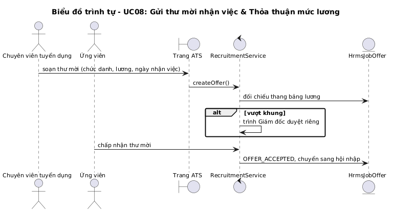

#### 2.3.1.9. Biểu đồ trình tự Use case Quản lý hồ sơ nhân viên toàn diện (UC09)

Kịch bản tương tác Use Case UC09: Tác nhân Chuyên viên Hồ sơ tương tác với giao diện hệ thống; tầng điều khiển tiếp nhận và xác thực nghiệp vụ, thực hiện truy vấn và cập nhật trạng thái dữ liệu trên cơ sở dữ liệu, đồng thời tự động ghi nhận nhật ký kiểm toán hệ thống.

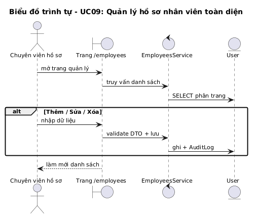

#### 2.3.1.10. Biểu đồ trình tự Use case Quản lý hợp đồng lao động & Phụ lục hợp đồng (UC10)

Kịch bản tương tác Use Case UC10: Tác nhân Chuyên viên Hồ sơ tương tác với giao diện hệ thống; tầng điều khiển tiếp nhận và xác thực nghiệp vụ, thực hiện truy vấn và cập nhật trạng thái dữ liệu trên cơ sở dữ liệu, đồng thời tự động ghi nhận nhật ký kiểm toán hệ thống.

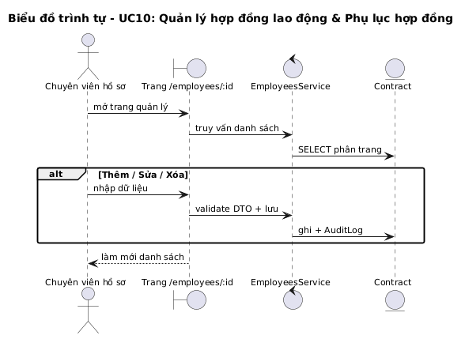

#### 2.3.1.11. Biểu đồ trình tự Use case Quản lý văn bằng, chứng chỉ chuyên môn (UC11)

Kịch bản tương tác Use Case UC11: Tác nhân Chuyên viên Hồ sơ tương tác với giao diện hệ thống; tầng điều khiển tiếp nhận và xác thực nghiệp vụ, thực hiện truy vấn và cập nhật trạng thái dữ liệu trên cơ sở dữ liệu, đồng thời tự động ghi nhận nhật ký kiểm toán hệ thống.

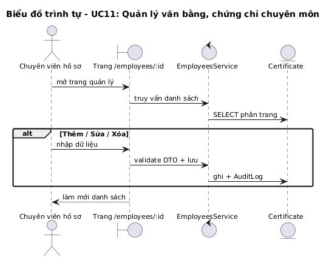

#### 2.3.1.12. Biểu đồ trình tự Use case Mượn - trả hồ sơ, chứng chỉ bản gốc (UC12)

Kịch bản tương tác Use Case UC12: Tác nhân Nhân viên, Chuyên viên Hồ sơ tương tác với giao diện hệ thống; tầng điều khiển tiếp nhận và xác thực nghiệp vụ, thực hiện truy vấn và cập nhật trạng thái dữ liệu trên cơ sở dữ liệu, đồng thời tự động ghi nhận nhật ký kiểm toán hệ thống.

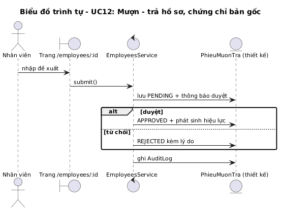

#### 2.3.1.13. Biểu đồ trình tự Use case Đánh giá kết quả thử việc & Ký HĐLĐ chính thức (UC13)

Kịch bản tương tác Use Case UC13: Tác nhân Trưởng dự án, Chuyên viên Hồ sơ, Giám đốc tương tác với giao diện hệ thống; tầng điều khiển tiếp nhận và xác thực nghiệp vụ, thực hiện truy vấn và cập nhật trạng thái dữ liệu trên cơ sở dữ liệu, đồng thời tự động ghi nhận nhật ký kiểm toán hệ thống.

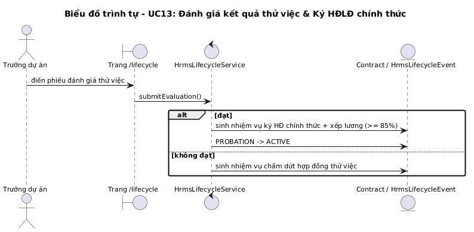

#### 2.3.1.14. Biểu đồ trình tự Use case Lộ trình hội nhập nhân viên mới (UC14)

Kịch bản tương tác Use Case UC14: Tác nhân Nhân viên mới, Chuyên viên Hồ sơ, Mentor tương tác với giao diện hệ thống; tầng điều khiển tiếp nhận và xác thực nghiệp vụ, thực hiện truy vấn và cập nhật trạng thái dữ liệu trên cơ sở dữ liệu, đồng thời tự động ghi nhận nhật ký kiểm toán hệ thống.

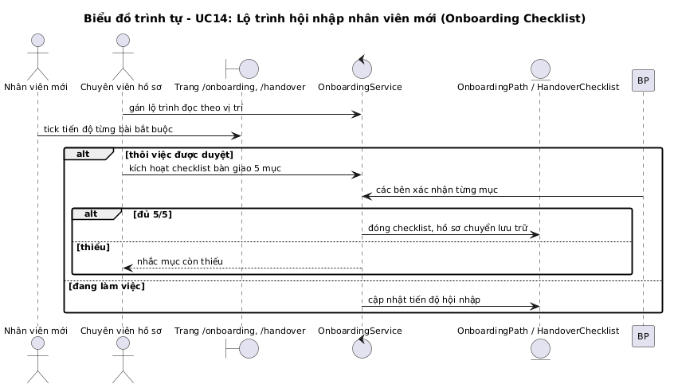

#### 2.3.1.15. Biểu đồ trình tự Use case Cổng tự phục vụ nhân viên tập trung (UC15)

Kịch bản tương tác Use Case UC15: Tác nhân Toàn thể nhân viên tương tác với giao diện hệ thống; tầng điều khiển tiếp nhận và xác thực nghiệp vụ, thực hiện truy vấn và cập nhật trạng thái dữ liệu trên cơ sở dữ liệu, đồng thời tự động ghi nhận nhật ký kiểm toán hệ thống.

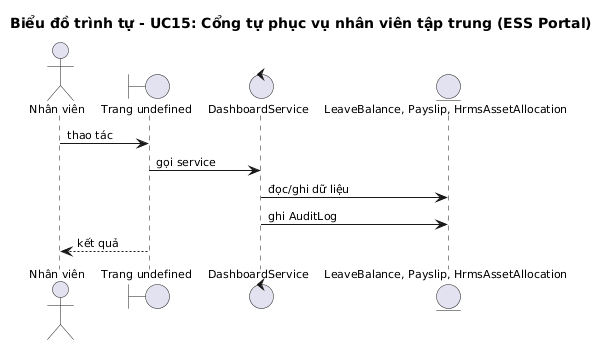

#### 2.3.1.16. Biểu đồ trình tự Use case Quản lý thông tin cá nhân phân cấp 3 mức độ (UC16)

Kịch bản tương tác Use Case UC16: Tác nhân Toàn thể nhân viên tương tác với giao diện hệ thống; tầng điều khiển tiếp nhận và xác thực nghiệp vụ, thực hiện truy vấn và cập nhật trạng thái dữ liệu trên cơ sở dữ liệu, đồng thời tự động ghi nhận nhật ký kiểm toán hệ thống.

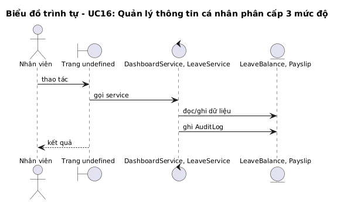

#### 2.3.1.17. Biểu đồ trình tự Use case Thẩm định & Phê duyệt đề xuất điều chỉnh hồ sơ Mức 2 (UC17)

Kịch bản tương tác Use Case UC17: Tác nhân Chuyên viên Hồ sơ, Quản trị viên tương tác với giao diện hệ thống; tầng điều khiển tiếp nhận và xác thực nghiệp vụ, thực hiện truy vấn và cập nhật trạng thái dữ liệu trên cơ sở dữ liệu, đồng thời tự động ghi nhận nhật ký kiểm toán hệ thống.

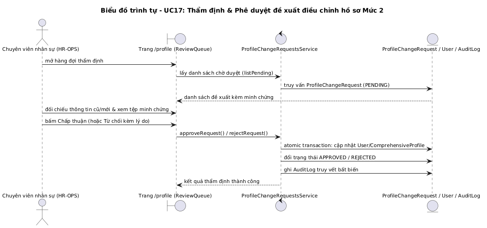

#### 2.3.1.18. Biểu đồ trình tự Use case Ghi nhận sự kiện chấm công & Điểm danh vào/ra ca (UC18)

Kịch bản tương tác Use Case UC18: Tác nhân Toàn thể nhân viên tương tác với giao diện hệ thống; tầng điều khiển tiếp nhận và xác thực nghiệp vụ, thực hiện truy vấn và cập nhật trạng thái dữ liệu trên cơ sở dữ liệu, đồng thời tự động ghi nhận nhật ký kiểm toán hệ thống.

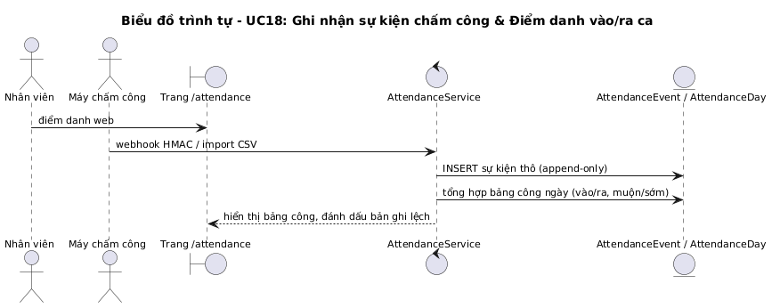

#### 2.3.1.19. Biểu đồ trình tự Use case Điểm danh sinh trắc học khuôn mặt & Cảm biến IR (UC19)

Kịch bản tương tác Use Case UC19: Tác nhân Nhân viên, Kiosk điểm danh tương tác với giao diện hệ thống; tầng điều khiển tiếp nhận và xác thực nghiệp vụ, thực hiện truy vấn và cập nhật trạng thái dữ liệu trên cơ sở dữ liệu, đồng thời tự động ghi nhận nhật ký kiểm toán hệ thống.

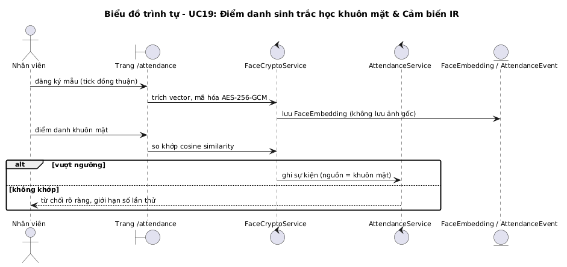

#### 2.3.1.20. Biểu đồ trình tự Use case Quản trị kết nối thiết bị máy chấm công (UC20)

Kịch bản tương tác Use Case UC20: Tác nhân Chuyên viên Hồ sơ, Quản trị IT tương tác với giao diện hệ thống; tầng điều khiển tiếp nhận và xác thực nghiệp vụ, thực hiện truy vấn và cập nhật trạng thái dữ liệu trên cơ sở dữ liệu, đồng thời tự động ghi nhận nhật ký kiểm toán hệ thống.

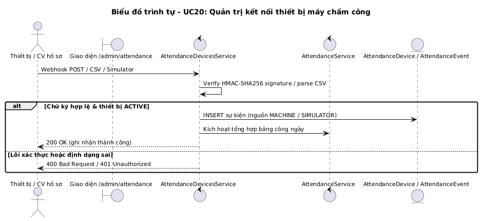

#### 2.3.1.21. Biểu đồ trình tự Use case Đăng ký & Xét duyệt nghỉ phép trực tuyến (UC21)

Kịch bản tương tác Use Case UC21: Tác nhân Nhân viên, Trưởng dự án, Chuyên viên Hồ sơ tương tác với giao diện hệ thống; tầng điều khiển tiếp nhận và xác thực nghiệp vụ, thực hiện truy vấn và cập nhật trạng thái dữ liệu trên cơ sở dữ liệu, đồng thời tự động ghi nhận nhật ký kiểm toán hệ thống.

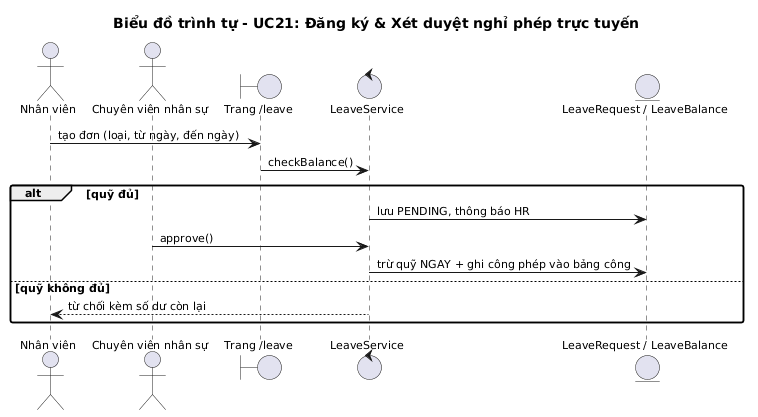

#### 2.3.1.22. Biểu đồ trình tự Use case Đăng ký & Phê duyệt làm thêm giờ (OT) (UC22)

Kịch bản tương tác Use Case UC22: Tác nhân Nhân viên, Trưởng dự án, Chuyên viên Tiền lương tương tác với giao diện hệ thống; tầng điều khiển tiếp nhận và xác thực nghiệp vụ, thực hiện truy vấn và cập nhật trạng thái dữ liệu trên cơ sở dữ liệu, đồng thời tự động ghi nhận nhật ký kiểm toán hệ thống.

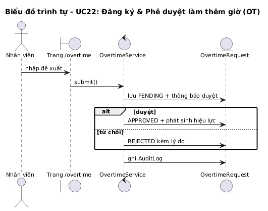

#### 2.3.1.23. Biểu đồ trình tự Use case Lập lịch và phân ca làm việc (UC23)

Kịch bản tương tác Use Case UC23: Tác nhân Trưởng dự án, Chuyên viên Tiền lương tương tác với giao diện hệ thống; tầng điều khiển tiếp nhận và xác thực nghiệp vụ, thực hiện truy vấn và cập nhật trạng thái dữ liệu trên cơ sở dữ liệu, đồng thời tự động ghi nhận nhật ký kiểm toán hệ thống.

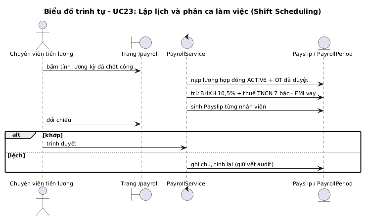

#### 2.3.1.24. Biểu đồ trình tự Use case Giải trình bổ sung giờ công & Xử lý lệch công (UC24)

Kịch bản tương tác Use Case UC24: Tác nhân Nhân viên, Trưởng dự án, Chuyên viên Tiền lương tương tác với giao diện hệ thống; tầng điều khiển tiếp nhận và xác thực nghiệp vụ, thực hiện truy vấn và cập nhật trạng thái dữ liệu trên cơ sở dữ liệu, đồng thời tự động ghi nhận nhật ký kiểm toán hệ thống.

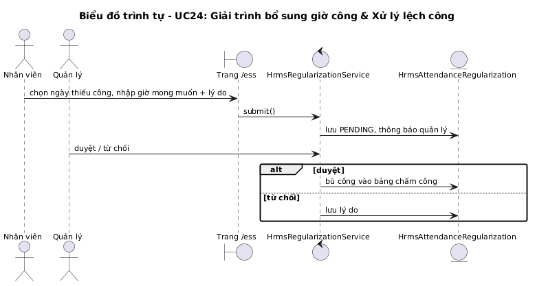

#### 2.3.1.25. Biểu đồ trình tự Use case Tổng hợp & Chốt bảng chấm công tháng (UC25)

Kịch bản tương tác Use Case UC25: Tác nhân Chuyên viên Tiền lương, Trưởng dự án tương tác với giao diện hệ thống; tầng điều khiển tiếp nhận và xác thực nghiệp vụ, thực hiện truy vấn và cập nhật trạng thái dữ liệu trên cơ sở dữ liệu, đồng thời tự động ghi nhận nhật ký kiểm toán hệ thống.

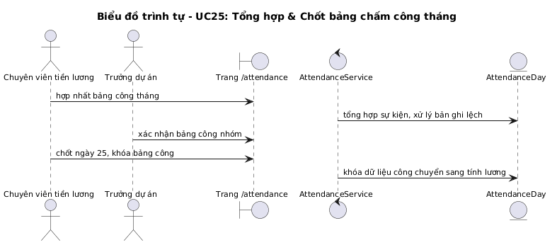

#### 2.3.1.26. Biểu đồ trình tự Use case Cấu hình công thức và ngạch bậc lương (UC26)

Kịch bản tương tác Use Case UC26: Tác nhân Chuyên viên Tiền lương tương tác với giao diện hệ thống; tầng điều khiển tiếp nhận và xác thực nghiệp vụ, thực hiện truy vấn và cập nhật trạng thái dữ liệu trên cơ sở dữ liệu, đồng thời tự động ghi nhận nhật ký kiểm toán hệ thống.

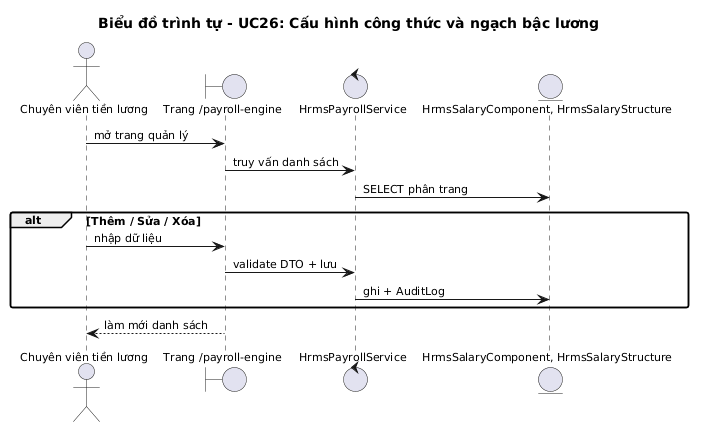

#### 2.3.1.27. Biểu đồ trình tự Use case Vận hành chức năng tính lương tự động (UC27)

Kịch bản tương tác Use Case UC27: Tác nhân Chuyên viên Tiền lương tương tác với giao diện hệ thống; tầng điều khiển tiếp nhận và xác thực nghiệp vụ, thực hiện truy vấn và cập nhật trạng thái dữ liệu trên cơ sở dữ liệu, đồng thời tự động ghi nhận nhật ký kiểm toán hệ thống.

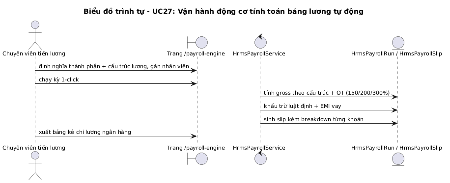

#### 2.3.1.28. Biểu đồ trình tự Use case Phê duyệt & Khóa bất biến kỳ lương (UC28)

Kịch bản tương tác Use Case UC28: Tác nhân Chuyên viên Tiền lương, Giám đốc tương tác với giao diện hệ thống; tầng điều khiển tiếp nhận và xác thực nghiệp vụ, thực hiện truy vấn và cập nhật trạng thái dữ liệu trên cơ sở dữ liệu, đồng thời tự động ghi nhận nhật ký kiểm toán hệ thống.

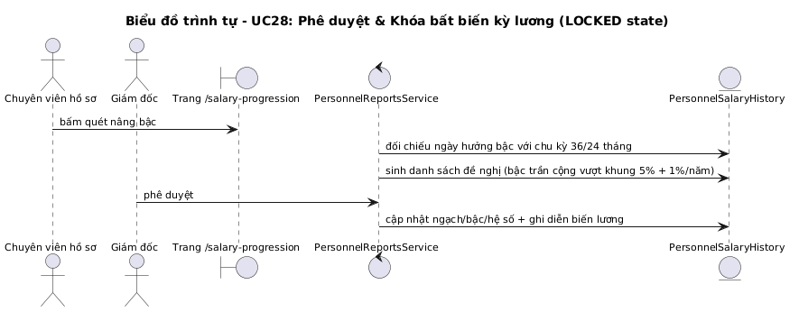

#### 2.3.1.29. Biểu đồ trình tự Use case Quản lý tạm ứng & Khoản vay phúc lợi nhân viên (UC29)

Kịch bản tương tác Use Case UC29: Tác nhân Nhân viên, Chuyên viên Tiền lương, Giám đốc tương tác với giao diện hệ thống; tầng điều khiển tiếp nhận và xác thực nghiệp vụ, thực hiện truy vấn và cập nhật trạng thái dữ liệu trên cơ sở dữ liệu, đồng thời tự động ghi nhận nhật ký kiểm toán hệ thống.

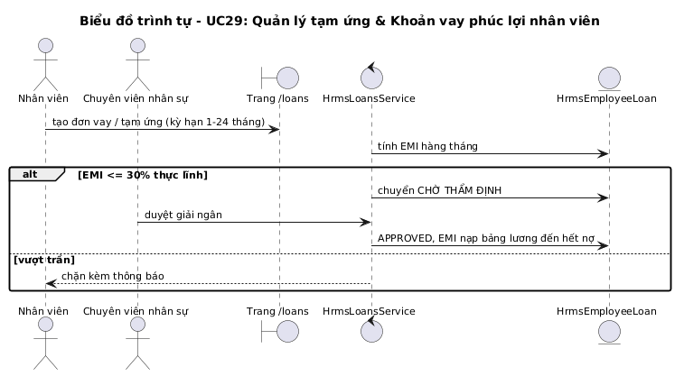

#### 2.3.1.30. Biểu đồ trình tự Use case Quản lý đề xuất công tác & Quyết toán chi phí (UC30)

Kịch bản tương tác Use Case UC30: Tác nhân Nhân viên, Trưởng dự án, Kế toán tương tác với giao diện hệ thống; tầng điều khiển tiếp nhận và xác thực nghiệp vụ, thực hiện truy vấn và cập nhật trạng thái dữ liệu trên cơ sở dữ liệu, đồng thời tự động ghi nhận nhật ký kiểm toán hệ thống.

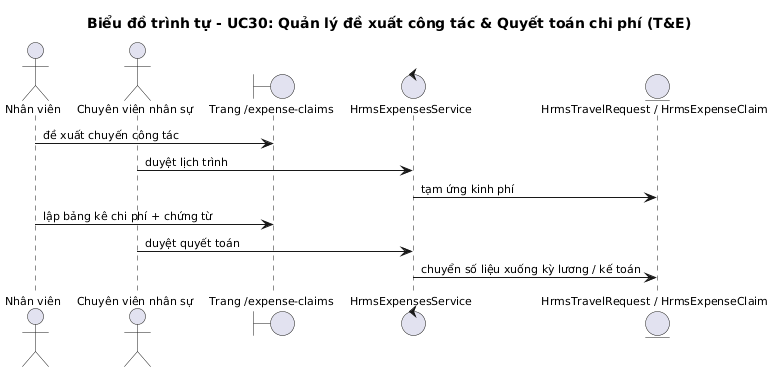

#### 2.3.1.31. Biểu đồ trình tự Use case Quản lý cấp phát & Thu hồi tài sản làm việc (UC31)

Kịch bản tương tác Use Case UC31: Tác nhân Nhân viên Hành chính, Nhân viên tương tác với giao diện hệ thống; tầng điều khiển tiếp nhận và xác thực nghiệp vụ, thực hiện truy vấn và cập nhật trạng thái dữ liệu trên cơ sở dữ liệu, đồng thời tự động ghi nhận nhật ký kiểm toán hệ thống.

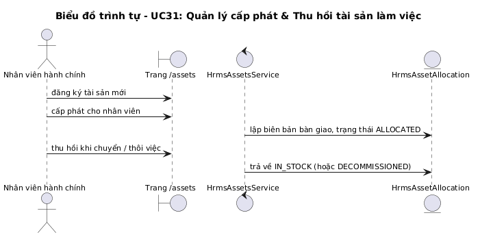

#### 2.3.1.32. Biểu đồ trình tự Use case Đề xuất & Phê duyệt điều chuyển công tác nội bộ (UC32)

Kịch bản tương tác Use Case UC32: Tác nhân Trưởng dự án, Giám đốc, Chuyên viên Hồ sơ tương tác với giao diện hệ thống; tầng điều khiển tiếp nhận và xác thực nghiệp vụ, thực hiện truy vấn và cập nhật trạng thái dữ liệu trên cơ sở dữ liệu, đồng thời tự động ghi nhận nhật ký kiểm toán hệ thống.

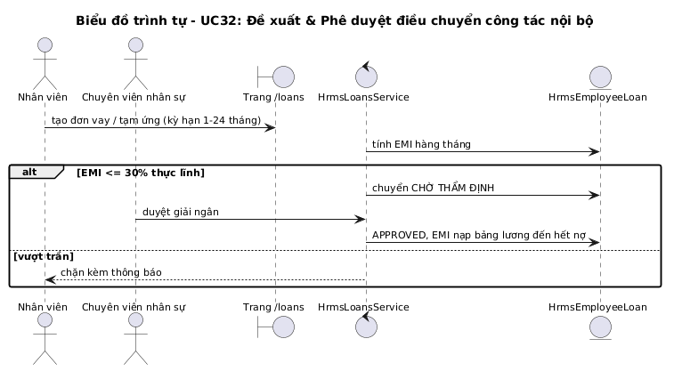

#### 2.3.1.33. Biểu đồ trình tự Use case Đề xuất & Phê duyệt điều chỉnh bậc lương (UC33)

Kịch bản tương tác Use Case UC33: Tác nhân Trưởng dự án, Giám đốc, Chuyên viên Tiền lương tương tác với giao diện hệ thống; tầng điều khiển tiếp nhận và xác thực nghiệp vụ, thực hiện truy vấn và cập nhật trạng thái dữ liệu trên cơ sở dữ liệu, đồng thời tự động ghi nhận nhật ký kiểm toán hệ thống.

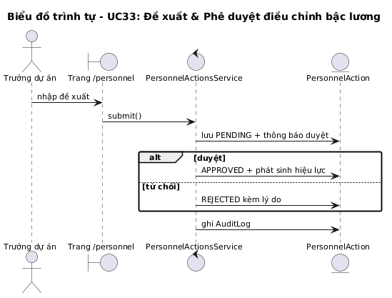

#### 2.3.1.34. Biểu đồ trình tự Use case Đề xuất & Phê duyệt khen thưởng nhân sự (UC34)

Kịch bản tương tác Use Case UC34: Tác nhân Trưởng dự án, Giám đốc, Chuyên viên Tiền lương tương tác với giao diện hệ thống; tầng điều khiển tiếp nhận và xác thực nghiệp vụ, thực hiện truy vấn và cập nhật trạng thái dữ liệu trên cơ sở dữ liệu, đồng thời tự động ghi nhận nhật ký kiểm toán hệ thống.

#### 2.3.1.35. Biểu đồ trình tự Use case Xử lý kỷ luật & Vi phạm nội quy lao động (UC35)

Kịch bản tương tác Use Case UC35: Tác nhân Trưởng dự án, Đại diện NLĐ, Giám đốc tương tác với giao diện hệ thống; tầng điều khiển tiếp nhận và xác thực nghiệp vụ, thực hiện truy vấn và cập nhật trạng thái dữ liệu trên cơ sở dữ liệu, đồng thời tự động ghi nhận nhật ký kiểm toán hệ thống.

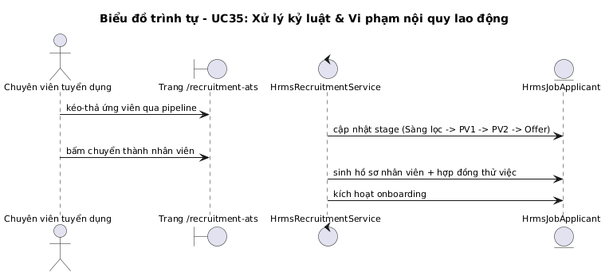

#### 2.3.1.36. Biểu đồ trình tự Use case Tiếp nhận, Xử lý thôi việc & Bàn giao đa bộ phận (UC36)

Kịch bản tương tác Use Case UC36: Tác nhân Nhân viên, Chuyên viên Hồ sơ, Các bộ phận tương tác với giao diện hệ thống; tầng điều khiển tiếp nhận và xác thực nghiệp vụ, thực hiện truy vấn và cập nhật trạng thái dữ liệu trên cơ sở dữ liệu, đồng thời tự động ghi nhận nhật ký kiểm toán hệ thống.

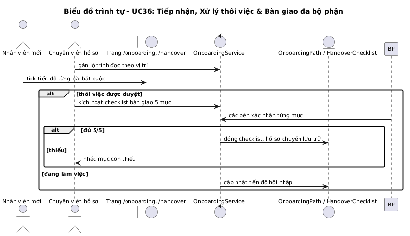

#### 2.3.1.37. Biểu đồ trình tự Use case Đánh giá hiệu suất 360 độ & Mục tiêu OKR/KPI (UC37)

Kịch bản tương tác Use Case UC37: Tác nhân Chuyên viên nhân sự, Trưởng dự án, Nhân viên tương tác với giao diện hệ thống; tầng điều khiển tiếp nhận và xác thực nghiệp vụ, thực hiện truy vấn và cập nhật trạng thái dữ liệu trên cơ sở dữ liệu, đồng thời tự động ghi nhận nhật ký kiểm toán hệ thống.

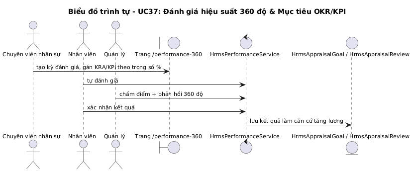

#### 2.3.1.38. Biểu đồ trình tự Use case Quản trị chương trình đào tạo nội bộ (UC38)

Kịch bản tương tác Use Case UC38: Tác nhân Chuyên viên nhân sự, Nhân viên tương tác với giao diện hệ thống; tầng điều khiển tiếp nhận và xác thực nghiệp vụ, thực hiện truy vấn và cập nhật trạng thái dữ liệu trên cơ sở dữ liệu, đồng thời tự động ghi nhận nhật ký kiểm toán hệ thống.

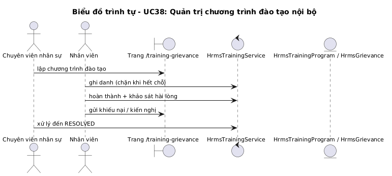

#### 2.3.1.39. Biểu đồ trình tự Use case Tiếp nhận & Giải quyết khiếu nại lao động bảo mật (UC39)

Kịch bản tương tác Use Case UC39: Tác nhân Chuyên viên nhân sự, Nhân viên tương tác với giao diện hệ thống; tầng điều khiển tiếp nhận và xác thực nghiệp vụ, thực hiện truy vấn và cập nhật trạng thái dữ liệu trên cơ sở dữ liệu, đồng thời tự động ghi nhận nhật ký kiểm toán hệ thống.

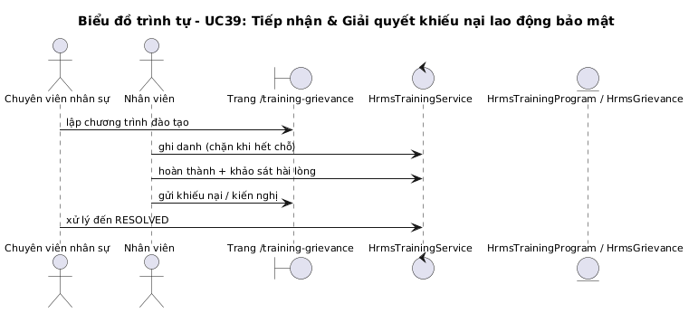

#### 2.3.1.40. Biểu đồ trình tự Use case Quản lý hồ sơ cán bộ toàn diện theo Mẫu 2C-BNV (UC40)

Kịch bản tương tác Use Case UC40: Tác nhân Chuyên viên Hồ sơ tương tác với giao diện hệ thống; tầng điều khiển tiếp nhận và xác thực nghiệp vụ, thực hiện truy vấn và cập nhật trạng thái dữ liệu trên cơ sở dữ liệu, đồng thời tự động ghi nhận nhật ký kiểm toán hệ thống.

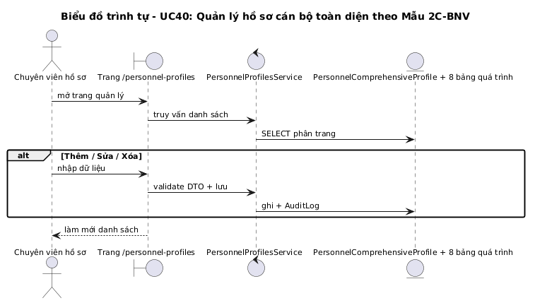

#### 2.3.1.41. Biểu đồ trình tự Use case Quản trị danh mục ngạch bậc lương chuẩn NĐ 204 (UC41)

Kịch bản tương tác Use Case UC41: Tác nhân Chuyên viên Hồ sơ tương tác với giao diện hệ thống; tầng điều khiển tiếp nhận và xác thực nghiệp vụ, thực hiện truy vấn và cập nhật trạng thái dữ liệu trên cơ sở dữ liệu, đồng thời tự động ghi nhận nhật ký kiểm toán hệ thống.

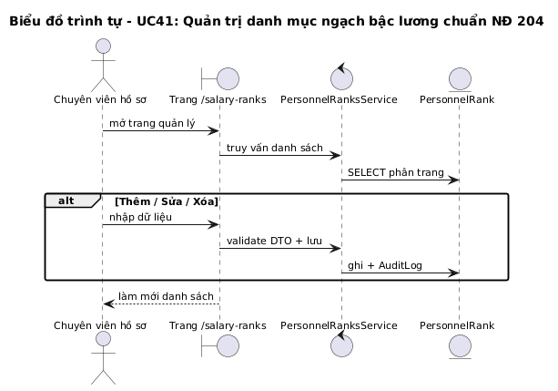

#### 2.3.1.42. Biểu đồ trình tự Use case Tự động rà soát & Phê duyệt nâng bậc lương định kỳ (UC42)

Kịch bản tương tác Use Case UC42: Tác nhân Chuyên viên Hồ sơ, Giám đốc tương tác với giao diện hệ thống; tầng điều khiển tiếp nhận và xác thực nghiệp vụ, thực hiện truy vấn và cập nhật trạng thái dữ liệu trên cơ sở dữ liệu, đồng thời tự động ghi nhận nhật ký kiểm toán hệ thống.

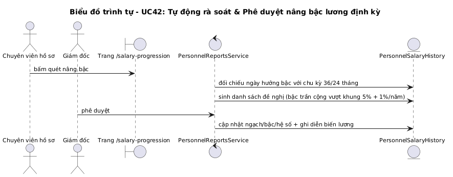

#### 2.3.1.43. Biểu đồ trình tự Use case Kết xuất biểu mẫu báo cáo nhà nước (SYLL 2C, Biểu 01-03) (UC43)

Kịch bản tương tác Use Case UC43: Tác nhân Chuyên viên Hồ sơ tương tác với giao diện hệ thống; tầng điều khiển tiếp nhận và xác thực nghiệp vụ, thực hiện truy vấn và cập nhật trạng thái dữ liệu trên cơ sở dữ liệu, đồng thời tự động ghi nhận nhật ký kiểm toán hệ thống.

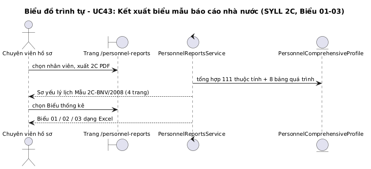

#### 2.3.1.44. Biểu đồ trình tự Use case Quản lý không gian tri thức số & Tài liệu quy trình SOP (UC44)

Kịch bản tương tác Use Case UC44: Tác nhân Toàn thể nhân viên (theo quyền không gian) tương tác với giao diện hệ thống; tầng điều khiển tiếp nhận và xác thực nghiệp vụ, thực hiện truy vấn và cập nhật trạng thái dữ liệu trên cơ sở dữ liệu, đồng thời tự động ghi nhận nhật ký kiểm toán hệ thống.

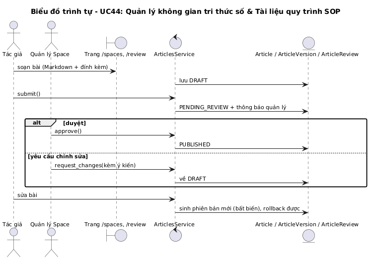

#### 2.3.1.45. Biểu đồ trình tự Use case Tìm kiếm tri thức toàn văn & Danh bạ chuyên gia (UC45)

Kịch bản tương tác Use Case UC45: Tác nhân Toàn thể nhân viên tương tác với giao diện hệ thống; tầng điều khiển tiếp nhận và xác thực nghiệp vụ, thực hiện truy vấn và cập nhật trạng thái dữ liệu trên cơ sở dữ liệu, đồng thời tự động ghi nhận nhật ký kiểm toán hệ thống.

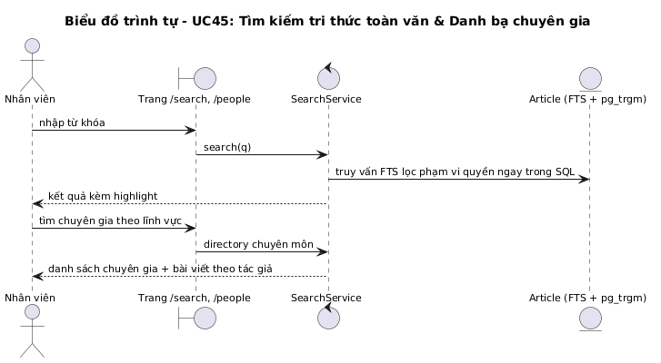

#### 2.3.1.46. Biểu đồ trình tự Use case Bảng điều khiển phân tích & Thống kê nhân sự (UC46)

Kịch bản tương tác Use Case UC46: Tác nhân Ban Giám đốc, Quản lý, Nhân viên tương tác với giao diện hệ thống; tầng điều khiển tiếp nhận và xác thực nghiệp vụ, thực hiện truy vấn và cập nhật trạng thái dữ liệu trên cơ sở dữ liệu, đồng thời tự động ghi nhận nhật ký kiểm toán hệ thống.

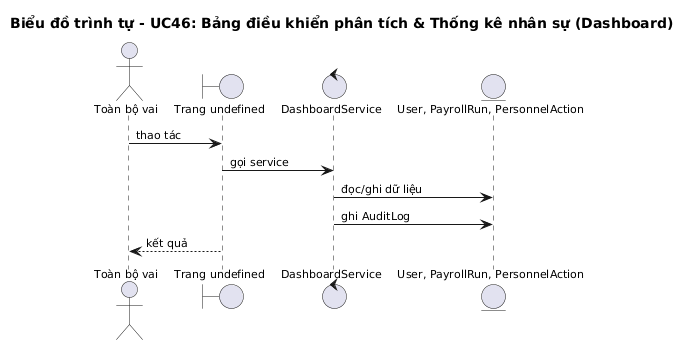

#### 2.3.1.47. Biểu đồ trình tự Use case Nhật ký kiểm toán hệ thống & Cấu hình tham số (UC47)

Kịch bản tương tác Use Case UC47: Tác nhân Nhân viên Quản trị IT tương tác với giao diện hệ thống; tầng điều khiển tiếp nhận và xác thực nghiệp vụ, thực hiện truy vấn và cập nhật trạng thái dữ liệu trên cơ sở dữ liệu, đồng thời tự động ghi nhận nhật ký kiểm toán hệ thống.

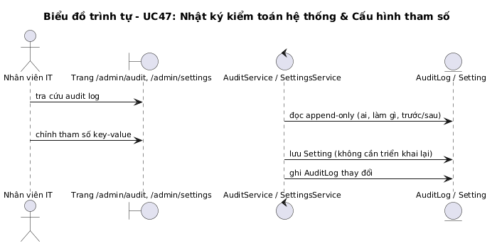

### 2.3.2. Xây dựng biểu đồ hoạt động

Biểu đồ hoạt động thể hiện luồng điều khiển xử lý nghiệp vụ, các bước tuần tự, các nhánh điều kiện rẽ nhánh và điểm kết thúc của từng tiến trình chức năng trong hệ thống. Dưới đây là đầy đủ 47 biểu đồ hoạt động tương ứng với 47 Use Case nghiệp vụ:

#### 2.3.2.1. Biểu đồ hoạt động Use case Đăng nhập & Xác thực hệ thống (UC01)

Tiến trình hoạt động Use Case UC01: Tác nhân Toàn thể nhân viên kích hoạt thao tác chức năng; hệ thống tiến hành kiểm tra điều kiện hợp lệ đầu vào, rẽ nhánh xử lý nghiệp vụ tương ứng và cập nhật trạng thái bản ghi trên cơ sở dữ liệu.

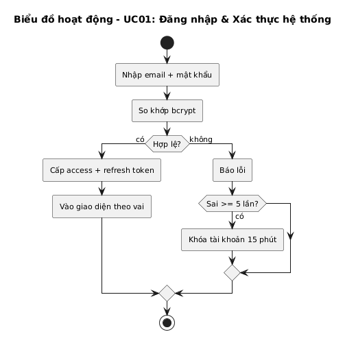

#### 2.3.2.2. Biểu đồ hoạt động Use case Quản trị người dùng & Phân quyền RBAC (UC02)

Tiến trình hoạt động Use Case UC02: Tác nhân Nhân viên Quản trị IT kích hoạt thao tác chức năng; hệ thống tiến hành kiểm tra điều kiện hợp lệ đầu vào, rẽ nhánh xử lý nghiệp vụ tương ứng và cập nhật trạng thái bản ghi trên cơ sở dữ liệu.

#### 2.3.2.3. Biểu đồ hoạt động Use case Quản trị cơ cấu tổ chức & Cây phòng ban (UC03)

Tiến trình hoạt động Use Case UC03: Tác nhân Nhân viên Quản trị IT kích hoạt thao tác chức năng; hệ thống tiến hành kiểm tra điều kiện hợp lệ đầu vào, rẽ nhánh xử lý nghiệp vụ tương ứng và cập nhật trạng thái bản ghi trên cơ sở dữ liệu.

#### 2.3.2.4. Biểu đồ hoạt động Use case Lập phiếu đề xuất tuyển dụng nhân sự (UC04)

Tiến trình hoạt động Use Case UC04: Tác nhân Trưởng dự án kích hoạt thao tác chức năng; hệ thống tiến hành kiểm tra điều kiện hợp lệ đầu vào, rẽ nhánh xử lý nghiệp vụ tương ứng và cập nhật trạng thái bản ghi trên cơ sở dữ liệu.

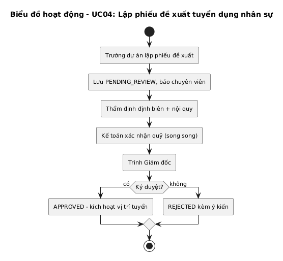

#### 2.3.2.5. Biểu đồ hoạt động Use case Thẩm định chỉ tiêu & Kiểm soát định biên tuyển dụng (UC05)

Tiến trình hoạt động Use Case UC05: Tác nhân Chuyên viên Tuyển dụng, Kế toán kích hoạt thao tác chức năng; hệ thống tiến hành kiểm tra điều kiện hợp lệ đầu vào, rẽ nhánh xử lý nghiệp vụ tương ứng và cập nhật trạng thái bản ghi trên cơ sở dữ liệu.

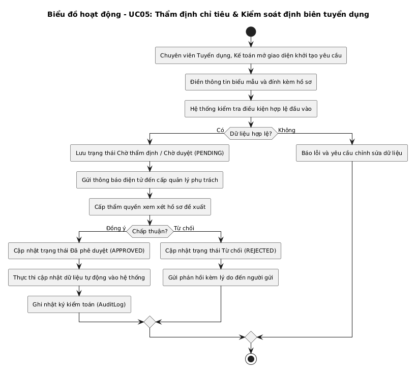

#### 2.3.2.6. Biểu đồ hoạt động Use case Phê duyệt chỉ tiêu tuyển dụng (UC06)

Tiến trình hoạt động Use Case UC06: Tác nhân Giám đốc kích hoạt thao tác chức năng; hệ thống tiến hành kiểm tra điều kiện hợp lệ đầu vào, rẽ nhánh xử lý nghiệp vụ tương ứng và cập nhật trạng thái bản ghi trên cơ sở dữ liệu.

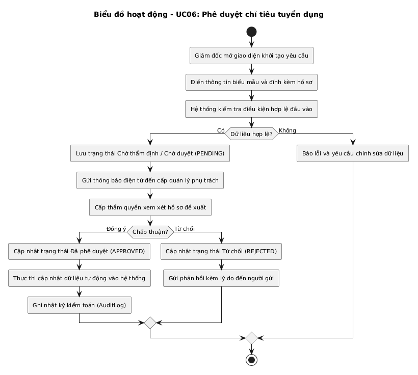

#### 2.3.2.7. Biểu đồ hoạt động Use case Quản lý hồ sơ ứng viên & Tuyển dụng ATS Kanban (UC07)

Tiến trình hoạt động Use Case UC07: Tác nhân Chuyên viên Tuyển dụng kích hoạt thao tác chức năng; hệ thống tiến hành kiểm tra điều kiện hợp lệ đầu vào, rẽ nhánh xử lý nghiệp vụ tương ứng và cập nhật trạng thái bản ghi trên cơ sở dữ liệu.

#### 2.3.2.8. Biểu đồ hoạt động Use case Gửi thư mời nhận việc & Thỏa thuận mức lương (UC08)

Tiến trình hoạt động Use Case UC08: Tác nhân Chuyên viên Tuyển dụng, Ứng viên kích hoạt thao tác chức năng; hệ thống tiến hành kiểm tra điều kiện hợp lệ đầu vào, rẽ nhánh xử lý nghiệp vụ tương ứng và cập nhật trạng thái bản ghi trên cơ sở dữ liệu.

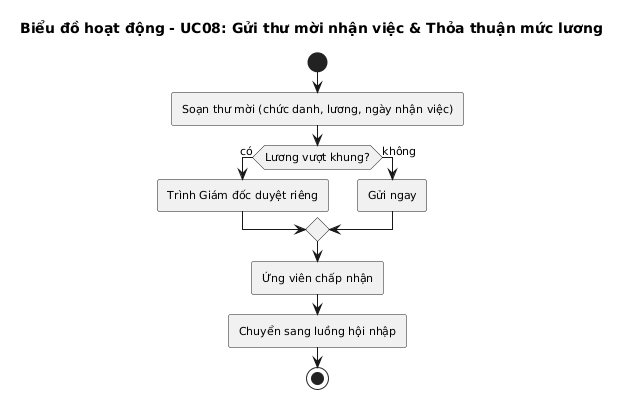

#### 2.3.2.9. Biểu đồ hoạt động Use case Quản lý hồ sơ nhân viên toàn diện (UC09)

Tiến trình hoạt động Use Case UC09: Tác nhân Chuyên viên Hồ sơ kích hoạt thao tác chức năng; hệ thống tiến hành kiểm tra điều kiện hợp lệ đầu vào, rẽ nhánh xử lý nghiệp vụ tương ứng và cập nhật trạng thái bản ghi trên cơ sở dữ liệu.

#### 2.3.2.10. Biểu đồ hoạt động Use case Quản lý hợp đồng lao động & Phụ lục hợp đồng (UC10)

Tiến trình hoạt động Use Case UC10: Tác nhân Chuyên viên Hồ sơ kích hoạt thao tác chức năng; hệ thống tiến hành kiểm tra điều kiện hợp lệ đầu vào, rẽ nhánh xử lý nghiệp vụ tương ứng và cập nhật trạng thái bản ghi trên cơ sở dữ liệu.

#### 2.3.2.11. Biểu đồ hoạt động Use case Quản lý văn bằng, chứng chỉ chuyên môn (UC11)

Tiến trình hoạt động Use Case UC11: Tác nhân Chuyên viên Hồ sơ kích hoạt thao tác chức năng; hệ thống tiến hành kiểm tra điều kiện hợp lệ đầu vào, rẽ nhánh xử lý nghiệp vụ tương ứng và cập nhật trạng thái bản ghi trên cơ sở dữ liệu.

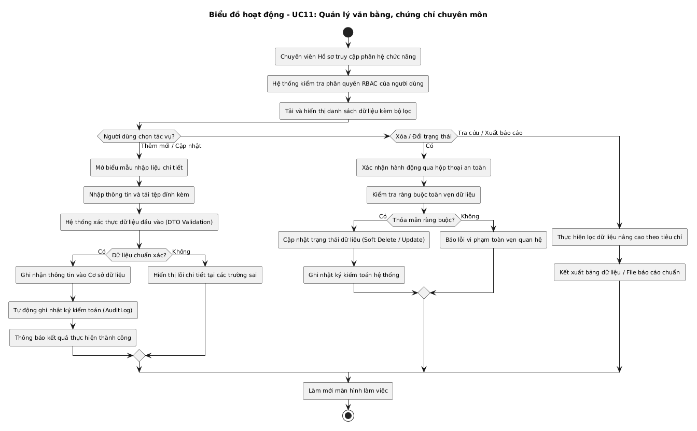

#### 2.3.2.12. Biểu đồ hoạt động Use case Mượn - trả hồ sơ, chứng chỉ bản gốc (UC12)

Tiến trình hoạt động Use Case UC12: Tác nhân Nhân viên, Chuyên viên Hồ sơ kích hoạt thao tác chức năng; hệ thống tiến hành kiểm tra điều kiện hợp lệ đầu vào, rẽ nhánh xử lý nghiệp vụ tương ứng và cập nhật trạng thái bản ghi trên cơ sở dữ liệu.

#### 2.3.2.13. Biểu đồ hoạt động Use case Đánh giá kết quả thử việc & Ký HĐLĐ chính thức (UC13)

Tiến trình hoạt động Use Case UC13: Tác nhân Trưởng dự án, Chuyên viên Hồ sơ, Giám đốc kích hoạt thao tác chức năng; hệ thống tiến hành kiểm tra điều kiện hợp lệ đầu vào, rẽ nhánh xử lý nghiệp vụ tương ứng và cập nhật trạng thái bản ghi trên cơ sở dữ liệu.

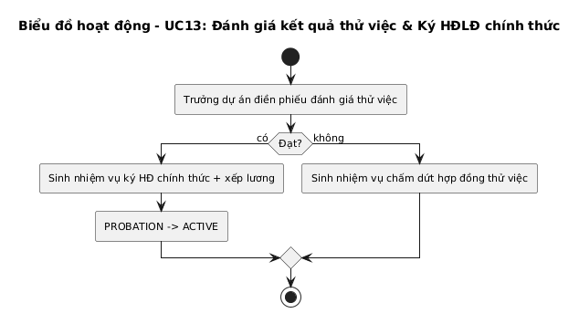

#### 2.3.2.14. Biểu đồ hoạt động Use case Lộ trình hội nhập nhân viên mới (UC14)

Tiến trình hoạt động Use Case UC14: Tác nhân Nhân viên mới, Chuyên viên Hồ sơ, Mentor kích hoạt thao tác chức năng; hệ thống tiến hành kiểm tra điều kiện hợp lệ đầu vào, rẽ nhánh xử lý nghiệp vụ tương ứng và cập nhật trạng thái bản ghi trên cơ sở dữ liệu.

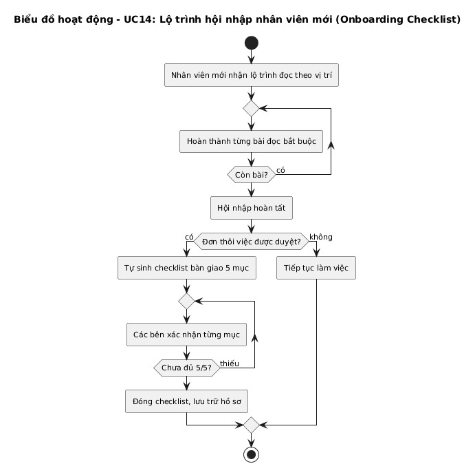

#### 2.3.2.15. Biểu đồ hoạt động Use case Cổng tự phục vụ nhân viên tập trung (UC15)

Tiến trình hoạt động Use Case UC15: Tác nhân Toàn thể nhân viên kích hoạt thao tác chức năng; hệ thống tiến hành kiểm tra điều kiện hợp lệ đầu vào, rẽ nhánh xử lý nghiệp vụ tương ứng và cập nhật trạng thái bản ghi trên cơ sở dữ liệu.

#### 2.3.2.16. Biểu đồ hoạt động Use case Quản lý thông tin cá nhân phân cấp 3 mức độ (UC16)

Tiến trình hoạt động Use Case UC16: Tác nhân Toàn thể nhân viên kích hoạt thao tác chức năng; hệ thống tiến hành kiểm tra điều kiện hợp lệ đầu vào, rẽ nhánh xử lý nghiệp vụ tương ứng và cập nhật trạng thái bản ghi trên cơ sở dữ liệu.

#### 2.3.2.17. Biểu đồ hoạt động Use case Thẩm định & Phê duyệt đề xuất điều chỉnh hồ sơ Mức 2 (UC17)

Tiến trình hoạt động Use Case UC17: Tác nhân Chuyên viên Hồ sơ, Quản trị viên kích hoạt thao tác chức năng; hệ thống tiến hành kiểm tra điều kiện hợp lệ đầu vào, rẽ nhánh xử lý nghiệp vụ tương ứng và cập nhật trạng thái bản ghi trên cơ sở dữ liệu.

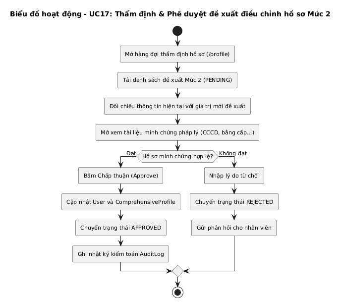

#### 2.3.2.18. Biểu đồ hoạt động Use case Ghi nhận sự kiện chấm công & Điểm danh vào/ra ca (UC18)

Tiến trình hoạt động Use Case UC18: Tác nhân Toàn thể nhân viên kích hoạt thao tác chức năng; hệ thống tiến hành kiểm tra điều kiện hợp lệ đầu vào, rẽ nhánh xử lý nghiệp vụ tương ứng và cập nhật trạng thái bản ghi trên cơ sở dữ liệu.

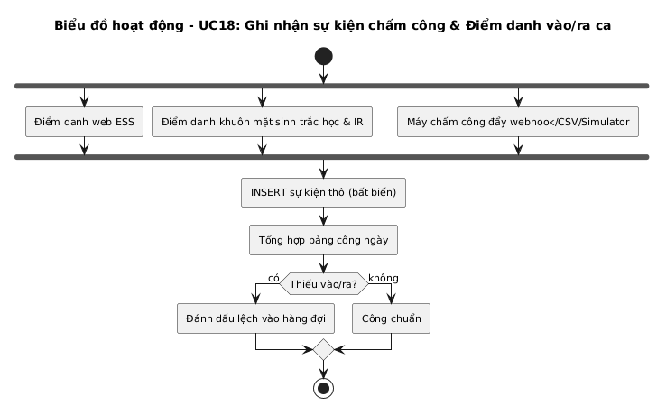

#### 2.3.2.19. Biểu đồ hoạt động Use case Điểm danh sinh trắc học khuôn mặt & Cảm biến IR (UC19)

Tiến trình hoạt động Use Case UC19: Tác nhân Nhân viên, Kiosk điểm danh kích hoạt thao tác chức năng; hệ thống tiến hành kiểm tra điều kiện hợp lệ đầu vào, rẽ nhánh xử lý nghiệp vụ tương ứng và cập nhật trạng thái bản ghi trên cơ sở dữ liệu.

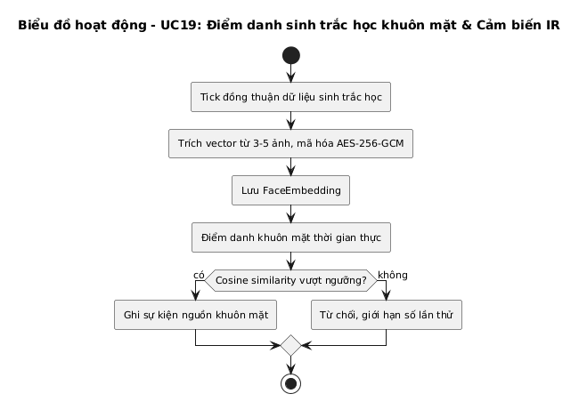

#### 2.3.2.20. Biểu đồ hoạt động Use case Quản trị kết nối thiết bị máy chấm công (UC20)

Tiến trình hoạt động Use Case UC20: Tác nhân Chuyên viên Hồ sơ, Quản trị IT kích hoạt thao tác chức năng; hệ thống tiến hành kiểm tra điều kiện hợp lệ đầu vào, rẽ nhánh xử lý nghiệp vụ tương ứng và cập nhật trạng thái bản ghi trên cơ sở dữ liệu.

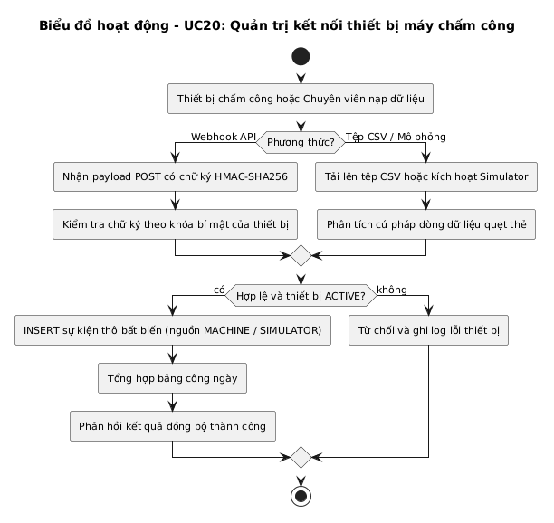

#### 2.3.2.21. Biểu đồ hoạt động Use case Đăng ký & Xét duyệt nghỉ phép trực tuyến (UC21)

Tiến trình hoạt động Use Case UC21: Tác nhân Nhân viên, Trưởng dự án, Chuyên viên Hồ sơ kích hoạt thao tác chức năng; hệ thống tiến hành kiểm tra điều kiện hợp lệ đầu vào, rẽ nhánh xử lý nghiệp vụ tương ứng và cập nhật trạng thái bản ghi trên cơ sở dữ liệu.

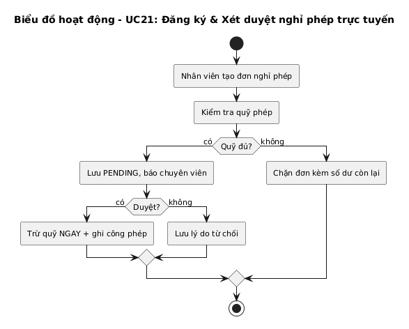

#### 2.3.2.22. Biểu đồ hoạt động Use case Đăng ký & Phê duyệt làm thêm giờ (OT) (UC22)

Tiến trình hoạt động Use Case UC22: Tác nhân Nhân viên, Trưởng dự án, Chuyên viên Tiền lương kích hoạt thao tác chức năng; hệ thống tiến hành kiểm tra điều kiện hợp lệ đầu vào, rẽ nhánh xử lý nghiệp vụ tương ứng và cập nhật trạng thái bản ghi trên cơ sở dữ liệu.

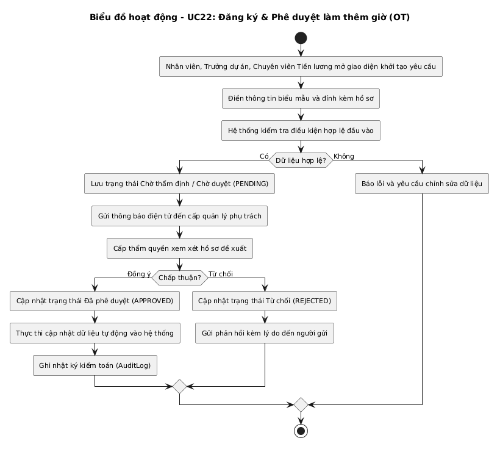

#### 2.3.2.23. Biểu đồ hoạt động Use case Lập lịch và phân ca làm việc (UC23)

Tiến trình hoạt động Use Case UC23: Tác nhân Trưởng dự án, Chuyên viên Tiền lương kích hoạt thao tác chức năng; hệ thống tiến hành kiểm tra điều kiện hợp lệ đầu vào, rẽ nhánh xử lý nghiệp vụ tương ứng và cập nhật trạng thái bản ghi trên cơ sở dữ liệu.

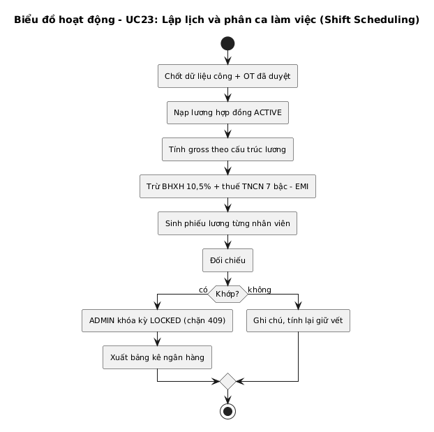

#### 2.3.2.24. Biểu đồ hoạt động Use case Giải trình bổ sung giờ công & Xử lý lệch công (UC24)

Tiến trình hoạt động Use Case UC24: Tác nhân Nhân viên, Trưởng dự án, Chuyên viên Tiền lương kích hoạt thao tác chức năng; hệ thống tiến hành kiểm tra điều kiện hợp lệ đầu vào, rẽ nhánh xử lý nghiệp vụ tương ứng và cập nhật trạng thái bản ghi trên cơ sở dữ liệu.

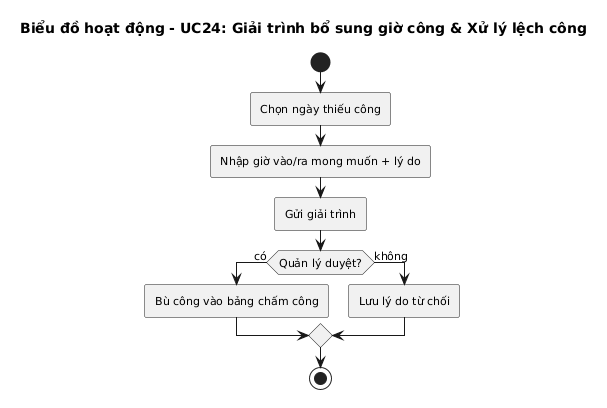

#### 2.3.2.25. Biểu đồ hoạt động Use case Tổng hợp & Chốt bảng chấm công tháng (UC25)

Tiến trình hoạt động Use Case UC25: Tác nhân Chuyên viên Tiền lương, Trưởng dự án kích hoạt thao tác chức năng; hệ thống tiến hành kiểm tra điều kiện hợp lệ đầu vào, rẽ nhánh xử lý nghiệp vụ tương ứng và cập nhật trạng thái bản ghi trên cơ sở dữ liệu.

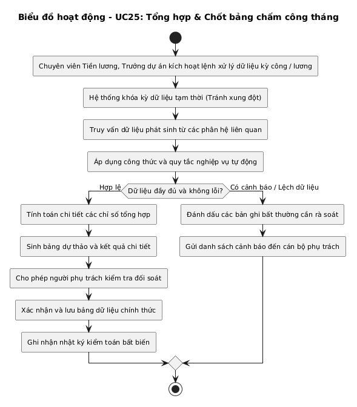

#### 2.3.2.26. Biểu đồ hoạt động Use case Cấu hình công thức và ngạch bậc lương (UC26)

Tiến trình hoạt động Use Case UC26: Tác nhân Chuyên viên Tiền lương kích hoạt thao tác chức năng; hệ thống tiến hành kiểm tra điều kiện hợp lệ đầu vào, rẽ nhánh xử lý nghiệp vụ tương ứng và cập nhật trạng thái bản ghi trên cơ sở dữ liệu.

#### 2.3.2.27. Biểu đồ hoạt động Use case Vận hành chức năng tính lương tự động (UC27)

Tiến trình hoạt động Use Case UC27: Tác nhân Chuyên viên Tiền lương kích hoạt thao tác chức năng; hệ thống tiến hành kiểm tra điều kiện hợp lệ đầu vào, rẽ nhánh xử lý nghiệp vụ tương ứng và cập nhật trạng thái bản ghi trên cơ sở dữ liệu.

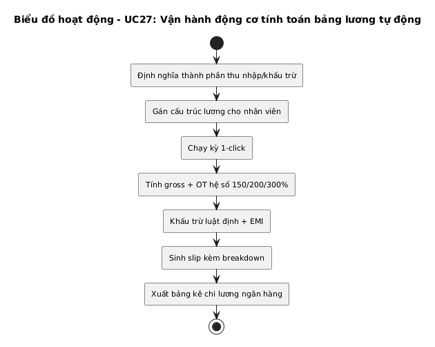

#### 2.3.2.28. Biểu đồ hoạt động Use case Phê duyệt & Khóa bất biến kỳ lương (UC28)

Tiến trình hoạt động Use Case UC28: Tác nhân Chuyên viên Tiền lương, Giám đốc kích hoạt thao tác chức năng; hệ thống tiến hành kiểm tra điều kiện hợp lệ đầu vào, rẽ nhánh xử lý nghiệp vụ tương ứng và cập nhật trạng thái bản ghi trên cơ sở dữ liệu.

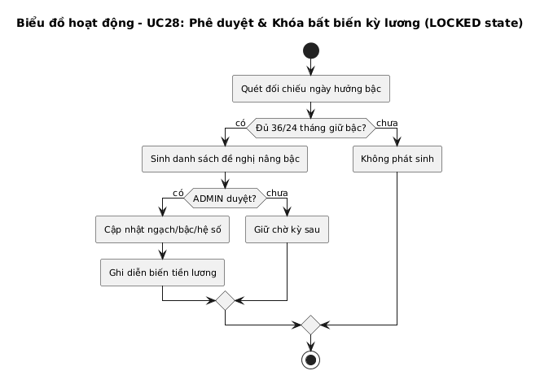

#### 2.3.2.29. Biểu đồ hoạt động Use case Quản lý tạm ứng & Khoản vay phúc lợi nhân viên (UC29)

Tiến trình hoạt động Use Case UC29: Tác nhân Nhân viên, Chuyên viên Tiền lương, Giám đốc kích hoạt thao tác chức năng; hệ thống tiến hành kiểm tra điều kiện hợp lệ đầu vào, rẽ nhánh xử lý nghiệp vụ tương ứng và cập nhật trạng thái bản ghi trên cơ sở dữ liệu.

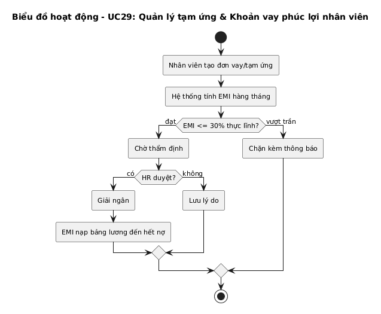

#### 2.3.2.30. Biểu đồ hoạt động Use case Quản lý đề xuất công tác & Quyết toán chi phí (UC30)

Tiến trình hoạt động Use Case UC30: Tác nhân Nhân viên, Trưởng dự án, Kế toán kích hoạt thao tác chức năng; hệ thống tiến hành kiểm tra điều kiện hợp lệ đầu vào, rẽ nhánh xử lý nghiệp vụ tương ứng và cập nhật trạng thái bản ghi trên cơ sở dữ liệu.

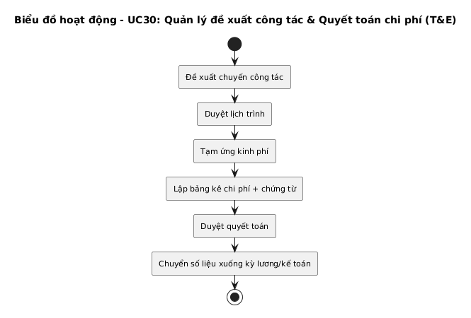

#### 2.3.2.31. Biểu đồ hoạt động Use case Quản lý cấp phát & Thu hồi tài sản làm việc (UC31)

Tiến trình hoạt động Use Case UC31: Tác nhân Nhân viên Hành chính, Nhân viên kích hoạt thao tác chức năng; hệ thống tiến hành kiểm tra điều kiện hợp lệ đầu vào, rẽ nhánh xử lý nghiệp vụ tương ứng và cập nhật trạng thái bản ghi trên cơ sở dữ liệu.

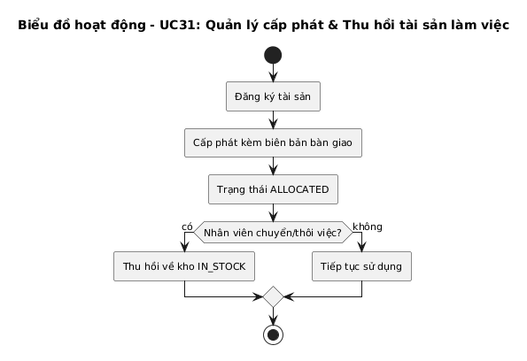

#### 2.3.2.32. Biểu đồ hoạt động Use case Đề xuất & Phê duyệt điều chuyển công tác nội bộ (UC32)

Tiến trình hoạt động Use Case UC32: Tác nhân Trưởng dự án, Giám đốc, Chuyên viên Hồ sơ kích hoạt thao tác chức năng; hệ thống tiến hành kiểm tra điều kiện hợp lệ đầu vào, rẽ nhánh xử lý nghiệp vụ tương ứng và cập nhật trạng thái bản ghi trên cơ sở dữ liệu.

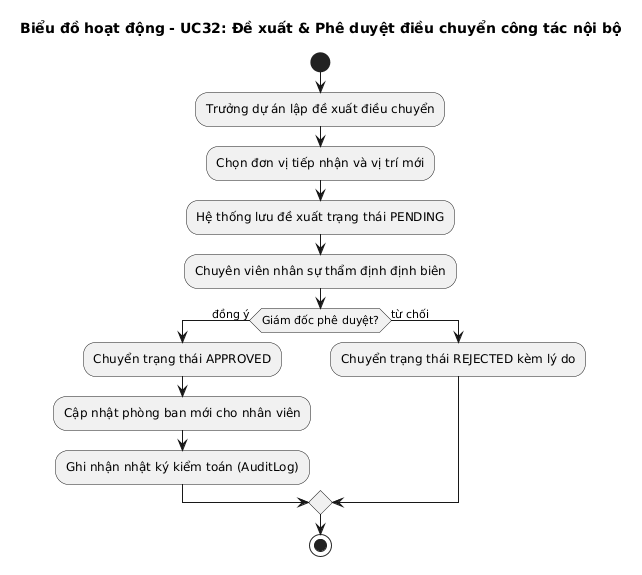

#### 2.3.2.33. Biểu đồ hoạt động Use case Đề xuất & Phê duyệt điều chỉnh bậc lương (UC33)

Tiến trình hoạt động Use Case UC33: Tác nhân Trưởng dự án, Giám đốc, Chuyên viên Tiền lương kích hoạt thao tác chức năng; hệ thống tiến hành kiểm tra điều kiện hợp lệ đầu vào, rẽ nhánh xử lý nghiệp vụ tương ứng và cập nhật trạng thái bản ghi trên cơ sở dữ liệu.

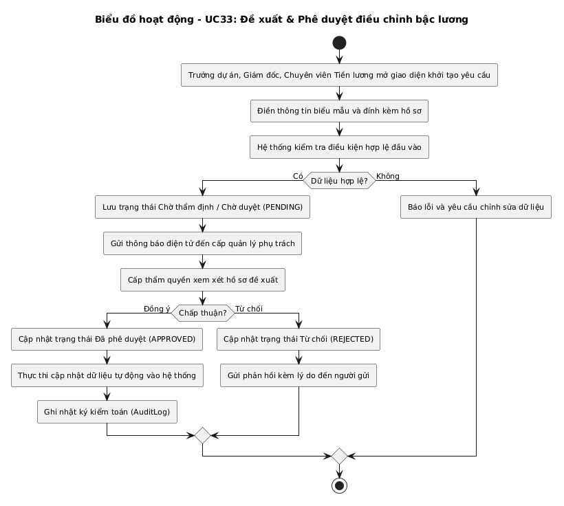

#### 2.3.2.34. Biểu đồ hoạt động Use case Đề xuất & Phê duyệt khen thưởng nhân sự (UC34)

Tiến trình hoạt động Use Case UC34: Tác nhân Trưởng dự án, Giám đốc, Chuyên viên Tiền lương kích hoạt thao tác chức năng; hệ thống tiến hành kiểm tra điều kiện hợp lệ đầu vào, rẽ nhánh xử lý nghiệp vụ tương ứng và cập nhật trạng thái bản ghi trên cơ sở dữ liệu.

#### 2.3.2.35. Biểu đồ hoạt động Use case Xử lý kỷ luật & Vi phạm nội quy lao động (UC35)

Tiến trình hoạt động Use Case UC35: Tác nhân Trưởng dự án, Đại diện NLĐ, Giám đốc kích hoạt thao tác chức năng; hệ thống tiến hành kiểm tra điều kiện hợp lệ đầu vào, rẽ nhánh xử lý nghiệp vụ tương ứng và cập nhật trạng thái bản ghi trên cơ sở dữ liệu.

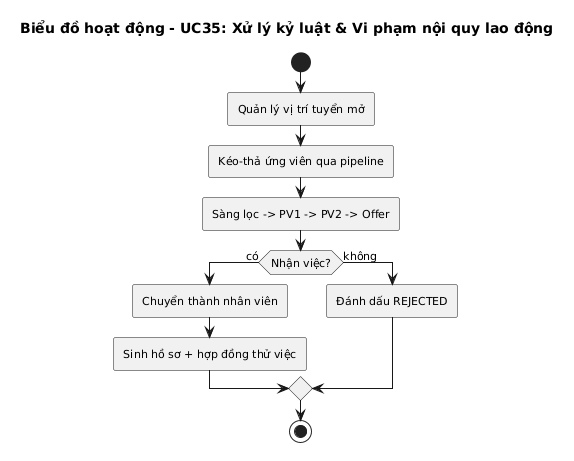

#### 2.3.2.36. Biểu đồ hoạt động Use case Tiếp nhận, Xử lý thôi việc & Bàn giao đa bộ phận (UC36)

Tiến trình hoạt động Use Case UC36: Tác nhân Nhân viên, Chuyên viên Hồ sơ, Các bộ phận kích hoạt thao tác chức năng; hệ thống tiến hành kiểm tra điều kiện hợp lệ đầu vào, rẽ nhánh xử lý nghiệp vụ tương ứng và cập nhật trạng thái bản ghi trên cơ sở dữ liệu.

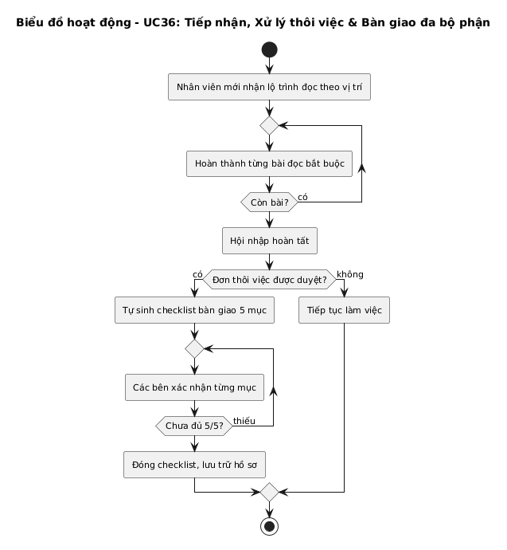

#### 2.3.2.37. Biểu đồ hoạt động Use case Đánh giá hiệu suất 360 độ & Mục tiêu OKR/KPI (UC37)

Tiến trình hoạt động Use Case UC37: Tác nhân Chuyên viên nhân sự, Trưởng dự án, Nhân viên kích hoạt thao tác chức năng; hệ thống tiến hành kiểm tra điều kiện hợp lệ đầu vào, rẽ nhánh xử lý nghiệp vụ tương ứng và cập nhật trạng thái bản ghi trên cơ sở dữ liệu.

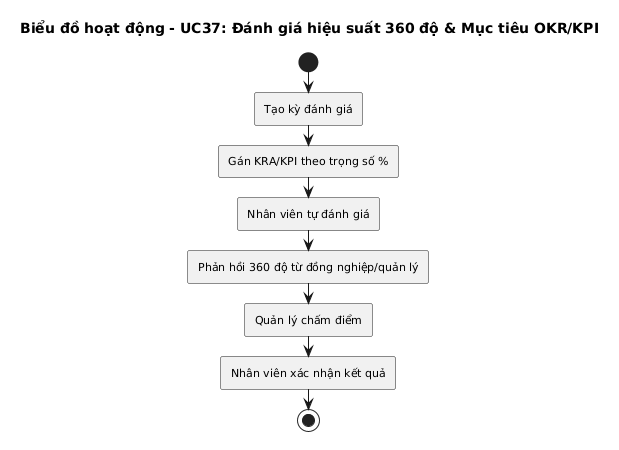

#### 2.3.2.38. Biểu đồ hoạt động Use case Quản trị chương trình đào tạo nội bộ (UC38)

Tiến trình hoạt động Use Case UC38: Tác nhân Chuyên viên nhân sự, Nhân viên kích hoạt thao tác chức năng; hệ thống tiến hành kiểm tra điều kiện hợp lệ đầu vào, rẽ nhánh xử lý nghiệp vụ tương ứng và cập nhật trạng thái bản ghi trên cơ sở dữ liệu.

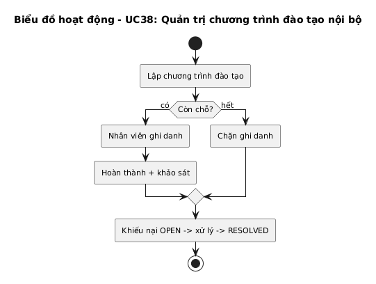

#### 2.3.2.39. Biểu đồ hoạt động Use case Tiếp nhận & Giải quyết khiếu nại lao động bảo mật (UC39)

Tiến trình hoạt động Use Case UC39: Tác nhân Chuyên viên nhân sự, Nhân viên kích hoạt thao tác chức năng; hệ thống tiến hành kiểm tra điều kiện hợp lệ đầu vào, rẽ nhánh xử lý nghiệp vụ tương ứng và cập nhật trạng thái bản ghi trên cơ sở dữ liệu.

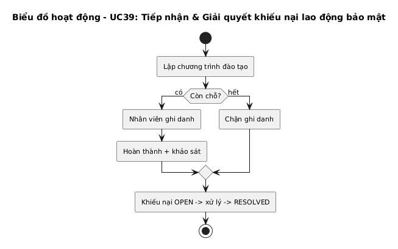

#### 2.3.2.40. Biểu đồ hoạt động Use case Quản lý hồ sơ cán bộ toàn diện theo Mẫu 2C-BNV (UC40)

Tiến trình hoạt động Use Case UC40: Tác nhân Chuyên viên Hồ sơ kích hoạt thao tác chức năng; hệ thống tiến hành kiểm tra điều kiện hợp lệ đầu vào, rẽ nhánh xử lý nghiệp vụ tương ứng và cập nhật trạng thái bản ghi trên cơ sở dữ liệu.

#### 2.3.2.41. Biểu đồ hoạt động Use case Quản trị danh mục ngạch bậc lương chuẩn NĐ 204 (UC41)

Tiến trình hoạt động Use Case UC41: Tác nhân Chuyên viên Hồ sơ kích hoạt thao tác chức năng; hệ thống tiến hành kiểm tra điều kiện hợp lệ đầu vào, rẽ nhánh xử lý nghiệp vụ tương ứng và cập nhật trạng thái bản ghi trên cơ sở dữ liệu.

#### 2.3.2.42. Biểu đồ hoạt động Use case Tự động rà soát & Phê duyệt nâng bậc lương định kỳ (UC42)

Tiến trình hoạt động Use Case UC42: Tác nhân Chuyên viên Hồ sơ, Giám đốc kích hoạt thao tác chức năng; hệ thống tiến hành kiểm tra điều kiện hợp lệ đầu vào, rẽ nhánh xử lý nghiệp vụ tương ứng và cập nhật trạng thái bản ghi trên cơ sở dữ liệu.

#### 2.3.2.43. Biểu đồ hoạt động Use case Kết xuất biểu mẫu báo cáo nhà nước (SYLL 2C, Biểu 01-03) (UC43)

Tiến trình hoạt động Use Case UC43: Tác nhân Chuyên viên Hồ sơ kích hoạt thao tác chức năng; hệ thống tiến hành kiểm tra điều kiện hợp lệ đầu vào, rẽ nhánh xử lý nghiệp vụ tương ứng và cập nhật trạng thái bản ghi trên cơ sở dữ liệu.

#### 2.3.2.44. Biểu đồ hoạt động Use case Quản lý không gian tri thức số & Tài liệu quy trình SOP (UC44)

Tiến trình hoạt động Use Case UC44: Tác nhân Toàn thể nhân viên (theo quyền không gian) kích hoạt thao tác chức năng; hệ thống tiến hành kiểm tra điều kiện hợp lệ đầu vào, rẽ nhánh xử lý nghiệp vụ tương ứng và cập nhật trạng thái bản ghi trên cơ sở dữ liệu.

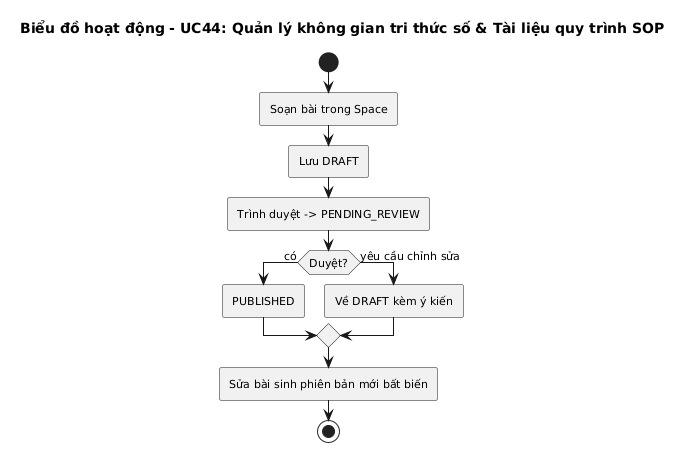

#### 2.3.2.45. Biểu đồ hoạt động Use case Tìm kiếm tri thức toàn văn & Danh bạ chuyên gia (UC45)

Tiến trình hoạt động Use Case UC45: Tác nhân Toàn thể nhân viên kích hoạt thao tác chức năng; hệ thống tiến hành kiểm tra điều kiện hợp lệ đầu vào, rẽ nhánh xử lý nghiệp vụ tương ứng và cập nhật trạng thái bản ghi trên cơ sở dữ liệu.

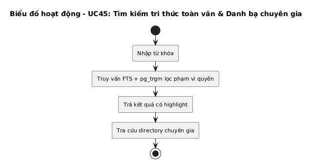

#### 2.3.2.46. Biểu đồ hoạt động Use case Bảng điều khiển phân tích & Thống kê nhân sự (UC46)

Tiến trình hoạt động Use Case UC46: Tác nhân Ban Giám đốc, Quản lý, Nhân viên kích hoạt thao tác chức năng; hệ thống tiến hành kiểm tra điều kiện hợp lệ đầu vào, rẽ nhánh xử lý nghiệp vụ tương ứng và cập nhật trạng thái bản ghi trên cơ sở dữ liệu.

#### 2.3.2.47. Biểu đồ hoạt động Use case Nhật ký kiểm toán hệ thống & Cấu hình tham số (UC47)

Tiến trình hoạt động Use Case UC47: Tác nhân Nhân viên Quản trị IT kích hoạt thao tác chức năng; hệ thống tiến hành kiểm tra điều kiện hợp lệ đầu vào, rẽ nhánh xử lý nghiệp vụ tương ứng và cập nhật trạng thái bản ghi trên cơ sở dữ liệu.

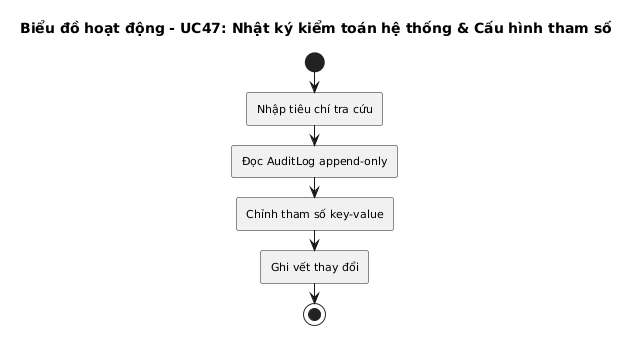

### 2.3.3. Xây dựng biểu đồ trạng thái

Biểu đồ trạng thái mô hình hóa vòng đời và các bước chuyển đổi trạng thái của các thực thể nghiệp vụ cốt lõi dưới tác động của các sự kiện phát sinh:

#### 1. Biểu đồ trạng thái vòng đời Nhân viên

Vòng đời đối tượng Nhân viên trải qua các trạng thái: Ứng viên đạt tuyển dụng (ONBOARDING) -> Thử việc (PROBATION) -> Ký hợp đồng chính thức (ACTIVE) -> Nghỉ thai sản/Tạm hoãn (SUSPENDED) -> Đã nghỉ việc (TERMINATED).

#### 2. Biểu đồ trạng thái Phiếu tuyển dụng

Vòng đời phiếu tuyển dụng: Bản nháp (DRAFT) -> Chờ thẩm định định biên (PENDING_REVIEW) -> Chờ Giám đốc duyệt (PENDING_APPROVAL) -> Đã phê duyệt mở tuyển (APPROVED) hoặc Bị từ chối (REJECTED) -> Hoàn tất tuyển dụng (CLOSED).

#### 3. Biểu đồ trạng thái Đơn nghỉ phép

Vòng đời đơn nghỉ phép: Khởi tạo (DRAFT) -> Chờ Trưởng dự án duyệt (SUBMITTED) -> Chờ HR xác nhận trừ phép (HR_CONFIRMED) -> Chấp thuận (APPROVED) hoặc Bị bác đơn (REJECTED) -> Đã hủy (CANCELLED).

#### 4. Biểu đồ trạng thái Phiếu mượn - trả hồ sơ

Vòng đời phiếu mượn hồ sơ: Yêu cầu mượn (REQUESTED) -> HR xuất kho bàn giao (BORROWED) -> Nhân viên hoàn trả hồ sơ (RETURNED) -> HR kiểm tra niêm phong và đóng phiếu (CLOSED).

#### 5. Biểu đồ trạng thái Phiếu lương

Vòng đời phiếu lương: Tính dự thảo (DRAFT) -> Kế toán trưởng thẩm định (REVIEWED) -> Giám đốc ký duyệt khóa bất biến (LOCKED) -> Phát hành qua cổng ESS (PUBLISHED) -> Đã thanh toán chuyển khoản (PAID).

### 2.3.4. Xây dựng biểu đồ cộng tác

Biểu đồ cộng tác tập trung làm nổi bật mối quan hệ cấu trúc không gian và sự phân bổ trách nhiệm giữa các đối tượng trong việc thực thi các kịch bản tương tác liên phòng ban.

Trong phân hệ quản trị tiền lương, kịch bản tính lương định kỳ thể hiện sự cộng tác chặt chẽ giữa các đối tượng: Lớp giao diện `PayrollView` tiếp nhận yêu cầu từ chuyên viên; chuyển thông điệp tới bộ điều khiển `PayrollService`; `PayrollService` gửi thông điệp truy vấn tới `AttendanceDay` để lấy tổng số ngày công thực tế, gửi thông điệp tới `Contract` để lấy mức lương đóng bảo hiểm, và gửi thông điệp tới `EmployeeLoan` để tính toán số tiền trích nợ kỳ hiện tại; sau khi hoàn tất tính toán tổng hợp, `PayrollService` gửi thông điệp khởi tạo và lưu trữ hàng loạt các đối tượng `Payslip` vào cơ sở dữ liệu.

## 2.4. Thiết kế hệ thống

### 2.4.1. Xây dựng biểu đồ lớp

Biểu đồ gói tổng quan thể hiện cấu trúc phân rã các gói chức năng và mối quan hệ phụ thuộc kiến trúc trong toàn bộ hệ thống phần mềm.

Biểu đồ lớp phân tích cho các Use Case đại diện thể hiện chi tiết cấu trúc thuộc tính, phương thức và sự liên kết giữa các lớp Boundary, Control và Entity:

**1. Biểu đồ lớp phân tích Use case Đăng nhập & Xác thực hệ thống (UC01):**

Bao gồm lớp giao diện `LoginForm`, lớp điều khiển `AuthService` và các lớp thực thể lưu trữ `User`, `Account`, `RefreshToken`.

**2. Biểu đồ lớp phân tích Use case Đăng ký nghỉ phép (UC21):**

Bao gồm lớp giao diện `LeaveRequestForm`, lớp điều khiển `LeaveService` cùng các lớp thực thể `LeaveRequest`, `LeaveBalance`, `Employee`.

**3. Biểu đồ lớp miền cốt lõi của hệ thống:**

Thể hiện mối quan hệ liên kết, hợp thành và kế thừa giữa các thực thể dữ liệu chính trong hệ thống quản trị nhân lực của doanh nghiệp.

**Bảng 2.6. Ma trận phân quyền truy cập chức năng**

| Phân hệ chức năng | Bảng dữ liệu chính | Quyền hạn vai USER | Quyền hạn vai KM_MANAGER | Quyền hạn vai ADMIN |
| :--- | :--- | :---: | :---: | :---: |
| Tài khoản & Tổ chức | User, Account, OrgUnit | R (chỉ xem bản thân) | R (xem đơn vị) | C, R, U, D |
| Tuyển dụng & ATS | JobRequisition, Candidate | C, R (trong dự án) | C, R, U, D | C, R, U, D |
| Hồ sơ & Hợp đồng | Employee, Contract, Certificate | R (xem cá nhân) | C, R, U | C, R, U, D |
| Thẩm định hồ sơ Mức 2 | ProfileChangeRequest | C, R (tạo đề xuất cá nhân) | R, U (thẩm định duyệt) | C, R, U, D |
| Chấm công & Phân ca | AttendanceEvent, WorkShift | C, R (điểm danh, xem ca) | C, R, U (hiệu chỉnh công) | C, R, U, D |
| Nghỉ phép & Làm thêm | LeaveRequest, OvertimeRequest | C, R (nộp đơn cá nhân) | C, R, U (duyệt đơn) | C, R, U, D |
| Tiền lương & Kỳ lương | PayrollPeriod, Payslip | R (chỉ xem phiếu lương cá nhân) | C, R, U (tính toán, đối chiếu) | C, R, U (phê duyệt, khóa lương) |
| Phúc lợi & Khoản vay | EmployeeLoan, ExpenseClaim | C, R (đăng ký vay, xem nợ) | C, R, U (thẩm định duyệt) | C, R, U, D |
| Biến động & Thôi việc | PersonnelAction, HandoverChecklist | C, R (nộp đơn thôi việc) | C, R, U (xác nhận bàn giao) | C, R, U, D (ký quyết định) |
| Hồ sơ cán bộ & Báo cáo | CadreProfile, SalaryGrade | - | C, R, U (quản lý, xuất biểu) | C, R, U, D |
| Tri thức số & SOP | Article, ArticleVersion | C, R (soạn thảo, tra cứu) | C, R, U, D (duyệt xuất bản) | C, R, U, D |
| Nhật ký kiểm toán | AuditLog | - | - | R (chỉ đọc) |

*(Ghi chú: C: Create - Tạo mới, R: Read - Xem/Đọc, U: Update - Chỉnh sửa, D: Delete - Xóa dữ liệu).*

### 2.4.2. Thiết kế lưu trữ dữ liệu

Cơ sở dữ liệu của hệ thống được thiết kế và cài đặt trên hệ quản trị PostgreSQL 16 thông qua công cụ Prisma ORM, bao gồm 87 model quan hệ phân bổ thành 10 miền dữ liệu nghiệp vụ:

**Bảng 2.7. Đặc tả cấu trúc lược đồ Cơ sở dữ liệu quan hệ**

| Miền dữ liệu | Model CSDL chính (Prisma ORM) | Số trường | Mục đích lưu trữ và quy tắc toàn vẹn nghiệp vụ |
| :--- | :--- | :---: | :--- |
| 1. Định danh & Hệ thống | `User`, `Role`, `UserRole`, `OrgUnit`, `RefreshToken` | 34 | Quản lý tài khoản, thông tin định danh nhân sự, mật khẩu băm bcrypt, phân quyền RBAC và cây tổ chức tự tham chiếu (`parentId`). |
| 2. Tuyển dụng & ATS | `JobRequisition`, `Candidate`, `HrmsJobOpening`, `HrmsInterviewRound`, `HrmsJobOffer` | 28 | Lưu trữ phiếu đề xuất tuyển dụng, hồ sơ ứng viên, các vòng phỏng vấn, điểm Scorecard và liên kết chuyển đổi 1-Click sang nhân viên. |
| 3. Hồ sơ & Hợp đồng | `Contract`, `Certificate`, `HrDocument`, `OnboardingAssignment` | 42 | Hợp đồng thử việc/chính thức, vị trí lưu trữ văn bằng chứng chỉ, lịch sử mượn trả hồ sơ và lộ trình hội nhập nhân viên mới. |
| 4. Phân cấp dữ liệu | `ProfileChangeRequest` | 12 | Hàng đợi thẩm định thông tin Mức 2: lưu giá trị cũ, giá trị mới đề xuất, tệp minh chứng ảnh CCCD và vết phê duyệt nguyên tử. |
| 5. Chấm công & Ca kíp | `AttendanceEvent`, `AttendanceDay`, `HrmsShiftType`, `HrmsShiftAssignment`, `AttendanceCorrection` | 36 | Lưu trữ sự kiện điểm danh bất biến (Append-Only), ca làm việc, tổng hợp ngày công và nhật ký giải trình hiệu chỉnh công. |
| 6. Điểm danh đa nguồn | `AttendanceDevice`, `FaceEmbedding` | 18 | Cấu hình máy chấm công webhook HMAC, vector mẫu khuôn mặt 128 chiều mã hóa AES-256-GCM (tuân thủ Nghị định 13). |
| 7. Nghỉ phép & Làm thêm | `LeaveRequest`, `LeaveBalance`, `OvertimeRequest` | 24 | Quỹ phép năm, lịch sử nghỉ phép tự động trừ số dư khi duyệt, đăng ký và kiểm soát trần thời gian làm thêm giờ (OT). |
| 8. Tiền lương & Phúc lợi | `PayrollPeriod`, `Payslip`, `HrmsSalaryComponent`, `HrmsSalaryStructure`, `HrmsPayrollRun` | 46 | Chu kỳ tính lương có trạng thái khóa bất biến LOCKED (chặn tính lại với HTTP 409), cấu trúc và phiếu lương chi tiết từng thành phần. |
| 9. Tài chính nhân sự | `HrmsEmployeeLoan`, `HrmsExpenseClaim`, `HrmsAssetAllocation`, `HrmsTravelRequest` | 38 | Khoản vay phúc lợi (kiểm soát trích nợ <= 30% lương Net), lịch trình hoàn nợ tự động nạp kỳ lương, công tác phí, tài sản thiết bị. |
| 10. Cán bộ & Tri thức | `PersonnelComprehensiveProfile`, `PersonnelRank`, `Article`, `ArticleVersion`, `AuditLog` | 52 | 111 thuộc tính cán bộ chuẩn Mẫu 2C-BNV, ngạch bậc lương chuẩn NĐ 204, không gian tri thức SOP và nhật ký kiểm toán Append-Only. |

Mô hình dữ liệu vật lý thể hiện các mối quan hệ khóa ngoại (Foreign Key) và các chỉ mục toàn vẹn (Unique Constraint) giữa các bảng cốt lõi:

Để mở rộng hỗ trợ thu nhận dữ liệu chấm công từ các nguồn công nghệ đa dạng, cơ sở dữ liệu tích hợp thêm các bảng chuyên biệt cho phép kết nối máy chấm công phần cứng, lưu trữ vector khuôn mặt và thu nhận bản ghi từ cổng Web:

Sơ đồ thể hiện bảng sự kiện chấm công bất biến AttendanceEvent với trường nguồn (MACHINE, WEB, FACE, SIMULATOR) cùng các bảng hỗ trợ FaceEmbedding và AttendanceDevice.

**Bảng 2.8. So sánh các phương thức điểm danh trong hệ thống**

| Tiêu chí so sánh | Kiosk Khuôn mặt sinh trắc học & IR | Máy chấm công phần cứng (Vân tay/Thẻ) | Web Check-in cổng ESS |
| :--- | :--- | :--- | :--- |
| Phương thức xác thực | Nhận diện khuôn mặt 2D + cảm biến hồng ngoại | Quẹt vân tay quang học / Thẻ từ RFID | Đăng nhập tài khoản định danh cá nhân |
| Cơ chế bảo mật & Chống giả mạo | Quét phổ nhiệt IR và chuyển động (Anti-Spoofing), không lưu ảnh gốc | Xác thực phần cứng tại chỗ qua cảm biến vân tay | Xác thực phiên làm việc JWT và lưu vết địa chỉ IP |
| Giao thức kết nối dữ liệu | Xử lý vector tại trình duyệt, gửi API thời gian thực | Đẩy bản tin HTTP POST có chữ ký HMAC-SHA256 | Gọi trực tiếp RESTful API nội bộ |
| Đối tượng áp dụng phù hợp | Toàn bộ nhân viên ra/vào sảnh văn phòng | Nhân viên làm việc cố định tại tòa nhà văn phòng | Nhân viên làm việc linh hoạt từ xa (WFH / Onsite) |
| Tuân thủ Nghị định 13/2023/NĐ-CP | Tuyệt đối tuân thủ (chỉ lưu vector mã hóa AES-256) | Dữ liệu mẫu lưu trên chip nhớ nội bộ của máy | Không thu thập dữ liệu sinh trắc học |

### 2.4.3. Thiết kế giao diện người dùng

Giao diện người dùng được thiết kế hiện đại trên nền tảng Design System trung tính của Shadcn UI và Tailwind CSS, tối ưu hóa trải nghiệm thao tác trên cả máy tính để bàn lẫn thiết bị di động. Cấu trúc điều hướng được tổ chức thành 7 phân hệ nghiệp vụ chuẩn hóa bao gồm 29 màn hình tác nghiệp trực tiếp, kết hợp cùng giao diện Kiosk điểm danh và trang đăng nhập xác thực tập trung (tổng cộng 31 màn hình):

1. Phân hệ Không gian làm việc:
- `/dashboard`: Bảng điều khiển phân tích tổng quan các chỉ số nhân sự cốt lõi, tỷ lệ hiện diện hôm nay và lối tắt tác vụ nhanh;
- `/ess`: Cổng tự phục vụ nhân viên tập trung tích hợp điểm danh trực tuyến, nộp đơn nghỉ phép, đăng ký làm thêm giờ, tra cứu phiếu lương cá nhân và theo dõi khoản vay phúc lợi;
- `/profile`: Quản trị hồ sơ cá nhân theo mô hình phân cấp 3 mức độ, tích hợp hàng đợi thẩm định đề xuất thay đổi thông tin định danh pháp lý có ảnh minh chứng;
- `/notifications`: Trung tâm thông báo hệ thống thời gian thực, quản lý các thông báo phê duyệt đơn từ, biến động nhân sự, bài viết và nhắc việc cần xử lý.

2. Phân hệ Nhân sự & Tổ chức:
- `/org-chart`: Sơ đồ cây cơ cấu tổ chức tương tác đa cấp, trực quan hóa quan hệ báo cáo cấp bậc và quản lý định biên phòng ban;
- `/employees`: Danh bạ nhân sự toàn công ty hỗ trợ tìm kiếm toàn văn, lọc đa tiêu chí và kết xuất dữ liệu;
- `/employees/[id]`: Hồ sơ nhân sự chi tiết thiết kế dạng thẻ chuyển tab (Thông tin cá nhân, Hợp đồng, Bằng cấp, Tài sản, Quá trình công tác);
- `/personnel`: Quản lý các quyết định biến động nhân sự (điều chuyển, nâng lương, khen thưởng, kỷ luật, thôi việc);
- `/salary-ranks`: Cấu hình khung ngạch bậc lương theo tiêu chuẩn Nghị định 204/2004/NĐ-CP;
- `/assets`: Quản lý vòng đời cấp phát và thu hồi tài sản làm việc (laptop, màn hình).

3. Phân hệ Chấm công & Ca làm việc:
- `/shifts`: Lập lịch phân ca làm việc, cấu hình khung giờ chuẩn và dung sai ân hạn đi muộn;
- `/attendance`: Bảng chấm công tổng hợp theo tháng, hiển thị trực quan trạng thái ngày công, nghỉ phép và làm thêm giờ;
- `/leave`: Quản lý đơn nghỉ phép với cơ chế tự động kiểm tra số dư và trừ quỹ phép ngay khi duyệt;
- `/overtime`: Đăng ký và phê duyệt làm thêm giờ, kiểm soát trần thời gian tối đa theo luật lao động.

4. Phân hệ Đãi ngộ & Tài chính:
- `/payroll-engine`: Chức năng tính toán tiền lương tự động, cấu hình thành phần thu nhập, trích nộp BHXH, thuế TNCN và thực thi khóa bất biến kỳ lương (LOCKED);
- `/loans`: Trung tâm quản trị phúc lợi và khoản vay nhân viên, tích hợp công cụ mô phỏng tài chính, kiểm soát trích nợ không quá 30% lương Net và hỗ trợ tất toán sớm;
- `/expense-claims`: Quản lý đề xuất công tác và thanh quyết toán chi phí công tác phí kèm hóa đơn điện tử.

5. Phân hệ Phát triển & Tuyển dụng:
- `/recruitment-ats`: Hệ thống tuyển dụng ứng viên với bảng điều khiển Kanban 6 giai đoạn, hỗ trợ nút "1-Click Nhận việc" để tự động chuyển ứng viên thành nhân viên chính thức;
- `/performance-360`: Đánh giá hiệu suất đa chiều kết hợp tự đánh giá, đánh giá chéo đồng nghiệp và quản lý mục tiêu OKR/KPI;
- `/training-grievance`: Quản lý các khóa đào tạo nội bộ và kênh tiếp nhận giải quyết khiếu nại lao động bảo mật.

6. Phân hệ Báo cáo & Tài liệu số:
- `/personnel-reports`: Báo cáo nhân sự và hồ sơ cán bộ quản lý 111 trường thông tin theo chuẩn Mẫu 2C-BNV/2008, hỗ trợ kết xuất biểu mẫu in ấn A4;
- `/documents`: Kho tri thức số nội bộ lưu trữ các quy trình vận hành chuẩn (SOP) với cơ chế quản lý phiên bản bất biến.

7. Phân hệ Quản trị hệ thống:
- Gồm 6 màn hình quản trị chuyên sâu dành cho vai trò ADMIN: quản trị tài khoản người dùng (`/admin/users`), quản trị cây đơn vị (`/admin/org-units`), quản trị danh mục dùng chung (`/admin/catalogs`), quản trị máy chấm công (`/admin/attendance`), cấu hình tham số (`/admin/settings`) và nhật ký kiểm toán hệ thống (`/admin/audit`).

8. Giao diện Chuyên biệt:
- `/check-in`: Giao diện Kiosk toàn màn hình phục vụ điểm danh sinh trắc học khuôn mặt 2D kết hợp cảm biến hồng ngoại IR chống giả mạo;
- `/login`: Giao diện xác thực bảo mật tập trung hỗ trợ mã thông báo JWT.

### 2.4.4. Thiết kế mô hình thành phần

Hệ thống được thiết kế và cài đặt theo mô hình kiến trúc ba tầng (3-Tier Architecture) hoàn chỉnh, bảo đảm tính độc lập cao giữa giao diện, logic xử lý và lưu trữ dữ liệu:

Tầng Giao diện người dùng: Xây dựng bằng Next.js 14 Standalone phục vụ giao diện người dùng cho toàn bộ 31 màn hình chức năng, đồng thời đóng vai trò là Reverse Proxy chuyển tiếp các yêu cầu API (`/api/*`) trực tiếp tới máy chủ backend mà không cần cấu hình thêm máy chủ web trung gian.

Tầng Xử lý nghiệp vụ: Xây dựng trên nền tảng NestJS 10 (TypeScript) bao gồm 39 module nghiệp vụ chuyên biệt, vận hành trên hai bộ máy xử lý cốt lõi: Quy trình phê duyệt biến động nhân sự và Chức năng tính lương tự động, tích hợp các dịch vụ bảo vệ phân quyền (JwtAuthGuard, RolesGuard) và cơ chế truyền thông điệp sự kiện (Event-Driven Architecture).

Tầng Lưu trữ dữ liệu: Hệ quản trị cơ sở dữ liệu PostgreSQL 16 quản lý 87 model quan hệ, kết hợp ổ lưu trữ tệp đính kèm độc lập; quản trị cấu trúc lược đồ qua Prisma Migration tự động chạy phiên bản khi khởi động container.

Kiến trúc phân tầng rõ ràng giúp hệ thống vận hành ổn định, có độ bao đóng cao, cho phép doanh nghiệp dễ dàng nâng cấp giao diện hoặc tích hợp thêm các dịch vụ công nghệ mới (như phân hệ trí tuệ nhân tạo dự báo nhân sự) trong tương lai mà không làm gián đoạn cấu trúc dữ liệu nền tảng.

## Tóm tắt chương 2

Chương 2 đã hoàn thành toàn diện nhiệm vụ thiết kế hệ thống thông tin quản trị nhân lực cho Công ty Cổ phần Phần mềm Saigon Technology. Chương đã xác định rõ 11 tác nhân nghiệp vụ ánh xạ vào 3 nhóm vai trò phân quyền; phân tầng yêu cầu từ 18 quy trình thực tế xuống danh mục 47 Use Case hoàn chỉnh theo vòng đời nhân sự; phân tích các mô hình tương tác động thông qua 6 biểu đồ trình tự, 3 biểu đồ hoạt động và 5 biểu đồ trạng thái; xây dựng cấu trúc tĩnh với biểu đồ gói, biểu đồ lớp miền, lược đồ CSDL quan hệ gồm 87 model trên PostgreSQL 16 (bao gồm các bảng mở rộng cho chấm công đa nguồn), thiết kế 31 màn hình ứng dụng phân bổ trong 7 phân hệ nghiệp vụ chuẩn hóa và thiết lập mô hình kiến trúc phần mềm 3 tầng hiện đại.

---

# CHƯƠNG 3: KẾT QUẢ ĐẠT ĐƯỢC VÀ ĐỀ XUẤT, KHUYẾN NGHỊ HOẶC HƯỚNG NGHIÊN CỨU PHÁT TRIỂN

## 3.1. Những kết quả đạt được

Sau quá trình nghiên cứu, khảo sát thực tế tại Công ty Cổ phần Phần mềm Saigon Technology, vận dụng phương pháp phân tích thiết kế hướng đối tượng (OOAD) và tiến hành lập trình cài đặt thực tế toàn bộ hệ thống, đề tài đã đạt được các kết quả cụ thể:

Về mặt nghiệp vụ và chức năng: Hệ thống đã số hóa hoàn chỉnh 18 quy trình nghiệp vụ cốt lõi, hiện thực hóa thành 47 Use Case chức năng trên 31 trang màn hình ứng dụng thực tế (bao gồm 28 màn hình nghiệp vụ phân bổ thành 7 phân hệ giao diện không gian làm việc cùng 2 giao diện chuyên biệt: Kiosk điểm danh khuôn mặt & IR và Login xác thực tập trung). Hệ thống phục vụ 11 tác nhân nghiệp vụ gói gọn trong 3 vai trò phân quyền (USER, KM_MANAGER, ADMIN), bao quát trọn vẹn vòng đời nhân sự từ tuyển dụng ATS, hồ sơ nhân viên, phân cấp quản trị dữ liệu cá nhân 3 mức độ, điểm danh đa nguồn (máy chấm công phần cứng, Kiosk nhận diện khuôn mặt sinh trắc học 2D & cảm biến hồng ngoại IR chống giả mạo, Web ESS), quản lý nghỉ phép, làm thêm giờ, chu kỳ tính lương có khóa bất biến (LOCKED), các chính sách phúc lợi (khoản vay, công tác phí, tài sản), đánh giá hiệu suất 360 độ cho đến kho tri thức nội bộ và bộ hồ sơ cán bộ theo chuẩn Mẫu 2C-BNV/2008.

Về mặt cơ sở dữ liệu: Thiết kế và cài đặt hoàn chỉnh 87 model quan hệ chia thành 10 miền dữ liệu trên hệ quản trị PostgreSQL 16, quản trị di chuyển lược đồ tự động qua Prisma Migration; kiểm chứng thành công ba ràng buộc bất biến: nhật ký kiểm toán chỉ thêm, sự kiện điểm danh bất biến, và cơ chế khóa kỳ lương chặn tính lại với lỗi HTTP 409 Conflict.

Về mặt chất lượng phần mềm: Toàn bộ mã nguồn backend và frontend đều vượt qua các bước kiểm tra cú pháp, kiểm tra kiểu tĩnh TypeScript (`tsc --noEmit`) và linter với 0 lỗi cảnh báo; bộ kịch bản kiểm thử tự động tích hợp end-to-end trên môi trường Docker chạy thật đạt kết quả 39 PASS / 0 FAIL, bao phủ đầy đủ các luồng nghiệp vụ quan trọng: thu hồi token khi đăng xuất, phân cấp hồ sơ Mức 2 có thẩm định minh chứng, kiểm soát quỹ phép, khóa kỳ lương bất biến, thôi việc tự sinh danh mục bàn giao 5 bước và xuất bản tri thức có phiên bản; toàn bộ các route giao diện nội bộ đạt thời gian phản hồi dưới 100ms với mã trạng thái HTTP 200 OK.

Về khả năng triển khai: Hệ thống được đóng gói hoàn chỉnh thành các container Docker độc lập, sẵn sàng khởi chạy và chuyển giao vận hành bằng một câu lệnh duy nhất (`docker compose up -d`).

## 3.2. Đánh giá ưu, nhược điểm

**Ưu điểm nổi bật:**
- Kiến trúc phần mềm phân tầng rõ ràng (3-Tier Architecture) kết hợp mô hình BCE giúp hệ thống có tính đóng gói cao, các thành phần giao diện, xử lý nghiệp vụ và lưu trữ dữ liệu hoạt động độc lập, thuận tiện cho việc bảo trì và mở rộng;
- Cơ cấu tổ chức doanh nghiệp được thiết kế dưới dạng cây phân cấp tự tham chiếu linh hoạt, cho phép doanh nghiệp tự do thành lập thêm chi nhánh, tách nhập phòng ban mà không phải can thiệp sửa đổi mã nguồn;
- Cơ chế quản trị dữ liệu nhân sự phân cấp 3 mức độ giúp phân định ranh giới quyền hạn chặt chẽ: cho phép nhân viên chủ động cập nhật thông tin liên lạc (Mức 1), bắt buộc thẩm định đối soát minh chứng đối với thông tin định danh pháp lý và tài chính (Mức 2) và khóa cố định đối với các dữ liệu vị trí, lương do tổ chức quản lý (Mức 3);
- Cưỡng chế tuân thủ quy trình bằng phần mềm: cơ chế khóa kỳ lương bất biến (LOCKED) chặn hoàn toàn các hành vi tính toán lại tùy tiện, và danh mục kiểm tra thôi việc 5 bước ngăn chặn việc ban hành quyết định chấm dứt hợp đồng khi chưa hoàn tất trách nhiệm bàn giao;
- Hỗ trợ đa dạng phương thức điểm danh, đặc biệt là kênh Kiosk nhận diện khuôn mặt sinh trắc học kết hợp cảm biến hồng ngoại IR chống giả mạo hình ảnh, xử lý vector tại trình duyệt và mã hóa AES-256-GCM, bảo đảm tuân thủ nghiêm ngặt Nghị định 13/2023/NĐ-CP.

**Hạn chế còn tồn tại:**
- Một số tham số pháp lý về thuế và bảo hiểm xã hội hiện đang được cấu hình cố định trong các module nghiệp vụ, cần được chuyển hóa hoàn toàn sang bảng tham số có hiệu lực theo ngày để tối ưu hóa việc quản lý lịch sử;
- Kênh kết nối máy chấm công phần cứng hiện đang kiểm thử thông qua bộ mô phỏng thiết bị (Simulator) và webhook giả lập, cần tiếp tục phát triển adapter tích hợp trực tiếp SDK chuyên dụng của các hãng phần cứng (như ZKTeco, Ronald Jack);
- Hệ thống chưa tích hợp chữ ký số công cộng (CA/PKI) để phục vụ việc ký số pháp lý đối với các quyết định hành chính và việc truyền nhận dữ liệu trực tiếp với cơ quan Bảo hiểm xã hội và Cơ quan Thuế.

## 3.3. Hướng nghiên cứu, phát triển

Để hệ thống phát huy tối đa hiệu quả trong môi trường thực tế, đề tài đề xuất một số hướng hoàn thiện và phát triển sau:

Về mặt công nghệ và tích hợp: Hoàn thiện các bộ adapter kết nối trực tiếp với phần cứng máy chấm công qua mạng nội bộ LAN; bổ sung công nghệ phát hiện chuyển động sống (Liveness Detection) đa góc nhìn cho camera nhận diện khuôn mặt; tích hợp giải pháp ký số từ xa (Remote Signing) để Giám đốc có thể ký ban hành các quyết định nhân sự có đầy đủ giá trị pháp lý.

Về mặt ứng dụng trí tuệ nhân tạo (AI): Sau giai đoạn vận hành tích lũy dữ liệu từ 1-2 năm, nghiên cứu phát triển tầng trí tuệ nhân tạo hỗ trợ dự báo nhân sự: thuật toán học máy phân tích nguy cơ thôi việc của nhân sự chủ chốt, công cụ quét định biên so với tiến độ dự án để cảnh báo thiếu hụt kỹ năng và gợi ý lộ trình đào tạo, luân chuyển cán bộ.

Về quy trình và đào tạo: Xây dựng tài liệu hướng dẫn vận hành chi tiết cho từng nhóm vai trò người dùng; tổ chức đào tạo theo lộ trình (hướng dẫn nhân viên sử dụng cổng tự phục vụ trước, tập huấn nghiệp vụ cho cán bộ quản lý và chuyên viên sau); thực hiện chạy song song hệ thống phần mềm với phương thức quản lý cũ trong 2 kỳ lương liên tiếp để đối soát độ chính xác tuyệt đối trước khi chuyển giao chính thức.

## Tóm tắt chương 3

Chương 3 đã tổng kết toàn diện các kết quả định lượng đạt được của đề tài: 47 use case trên 31 màn hình ứng dụng thực tế, 87 model cơ sở dữ liệu quan hệ, kiểm thử tích hợp 39/39 kịch bản thành công và hệ thống sẵn sàng vận hành trên nền tảng Docker. Chương cũng đánh giá khách quan các ưu điểm về mặt kiến trúc, quản trị phân cấp và tuân thủ quy trình, đồng thời chỉ ra các hạn chế cần khắc phục và vạch ra lộ trình nâng cấp công nghệ (tích hợp adapter máy chấm công, chữ ký số, tầng AI dự báo nhân sự) nhằm hỗ trợ doanh nghiệp chuyển đổi số toàn diện công tác quản trị nguồn nhân lực.

---

# TÀI LIỆU THAM KHẢO

1. TS. Trần Kim Dung. *Quản trị nguồn nhân lực*. Hà Nội: Nhà xuất bản Lao động - Xã hội, 2018.
2. PGS.TS. Nguyễn Ngọc Quân, ThS. Nguyễn Vân Điềm. *Giáo trình Quản trị nhân lực*. Hà Nội: Nhà xuất bản Đại học Kinh tế Quốc dân, 2017.
3. PGS.TS. Đặng Văn Đức. *Phân tích và thiết kế hướng đối tượng bằng UML*. Hà Nội: Nhà xuất bản Giáo dục, 2002.
4. Quốc hội nước Cộng hòa Xã hội Chủ nghĩa Việt Nam. *Bộ luật Lao động số 45/2019/QH14*, ngày 20 tháng 11 năm 2019.
5. Quốc hội nước Cộng hòa Xã hội Chủ nghĩa Việt Nam. *Luật Bảo hiểm xã hội số 58/2014/QH13*, ngày 20 tháng 11 năm 2014 và các văn bản hướng dẫn thi hành.
6. Quốc hội nước Cộng hòa Xã hội Chủ nghĩa Việt Nam. *Luật Thuế thu nhập cá nhân số 04/2007/QH12*; Ủy ban Thường vụ Quốc hội. *Nghị quyết số 954/2020/UBTVQH14* về điều chỉnh mức giảm trừ gia cảnh của thuế thu nhập cá nhân.
7. Chính phủ nước Cộng hòa Xã hội Chủ nghĩa Việt Nam. *Nghị định số 13/2023/NĐ-CP* ngày 17 tháng 04 năm 2023 về bảo vệ dữ liệu cá nhân.
8. Chính phủ nước Cộng hòa Xã hội Chủ nghĩa Việt Nam. *Nghị định số 204/2004/NĐ-CP* về chế độ tiền lương đối với cán bộ, công chức, viên chức và lực lượng vũ trang; Bộ Nội vụ. *Thông tư số 08/2013/TT-BNV*.
9. Bộ Nội vụ. *Quyết định số 06/2007/QĐ-BNV* về thành phần hồ sơ cán bộ, công chức; *Thông tư số 11/2012/TT-BNV* quy định về chế độ báo cáo thống kê và quản lý hồ sơ công chức (Mẫu 2C-BNV/2008).
10. Công ty Cổ phần Phần mềm Saigon Technology. *Quy chế quản trị nội bộ, Quy trình sản xuất phần mềm và Tài liệu khảo sát nghiệp vụ nhân sự*, 2026.
11. Martin Fowler. *UML Distilled: A Brief Guide to the Standard Object Modeling Language*. 3rd Edition, Addison-Wesley Professional, 2003.
12. Robert C. Martin. *Clean Architecture: A Craftsman's Guide to Software Structure and Design*. Prentice Hall, 2017.
