> Tổng cộng **148 biểu đồ PlantUML**.


# BỘ BIỂU ĐỒ UML ĐẦY ĐỦ 47 USE CASE - HRMIS SAIGON TECHNOLOGY

> Tài liệu kèm theo `doc/PTTK_OOP_HR.md`, sinh thống nhất cho **47 use case chia 10 nhóm**.
> **Mọi biểu đồ đều khai báo `skinparam linetype ortho` nên các đường nối được kẻ THẲNG VUÔNG GÓC.**
> Cách dùng: sao chép từng khối ```plantuml``` dán vào plantuml.com (hoặc plugin IDE) để xuất ảnh PNG/SVG chèn vào báo cáo.

**Cấu trúc:** A. Use case (tổng quát + 10 nhóm) | B. Trình tự (47 UC) | C. Hoạt động (47 UC) | D. Trạng thái (theo đối tượng) | E. Luồng dữ liệu đầu-cuối | F. Gói (tổng quan + theo nhóm) | G. Lớp (theo nhóm, gán rõ use case)


## A. BIỂU ĐỒ USE CASE

### A.00. Biểu đồ cây phân cấp Tác nhân (Actor Generalization)

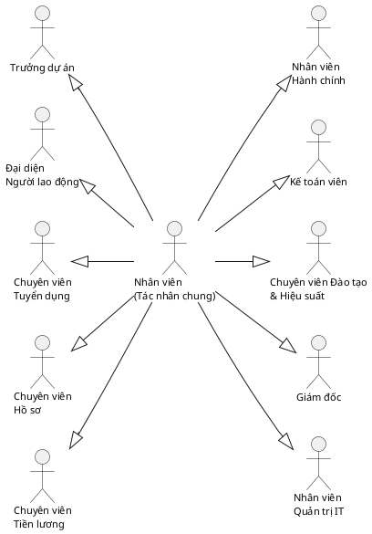
_Hình 2.1. Biểu đồ cây phân cấp Tác nhân (Actor Generalization) — "Nhân viên" làm tác nhân chung, tỏa nhánh ra 10 tác nhân chuyên biệt hóa._

### A.0. Tổng quan hệ thống (47 use case, 10 nhóm)

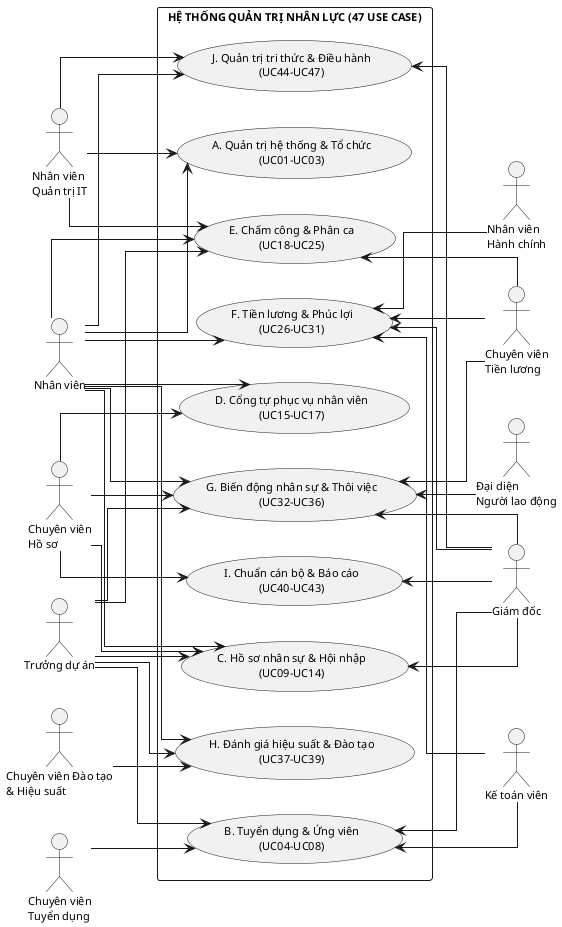
_Hình 2.2. Biểu đồ Use case tổng quan Hệ thống Quản trị nhân lực — 10 nhóm, 47 use case, tác nhân phân bố đều hai bên, đường nối thẳng vuông góc có mũi tên._


### A.A. Nhóm A - Quản trị hệ thống & Tổ chức

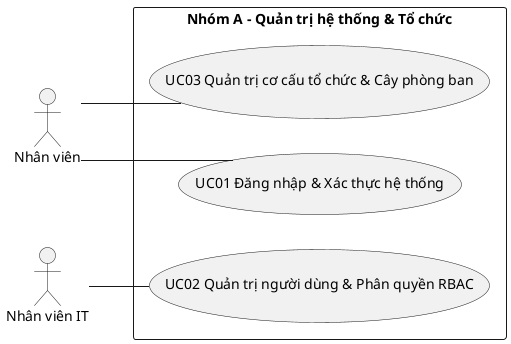
_Hình D.2. Nhóm A - Quản trị hệ thống & Tổ chức (UC01, UC02, UC03)._

### A.B. Nhóm B - Tuyển dụng & Quản lý ứng viên

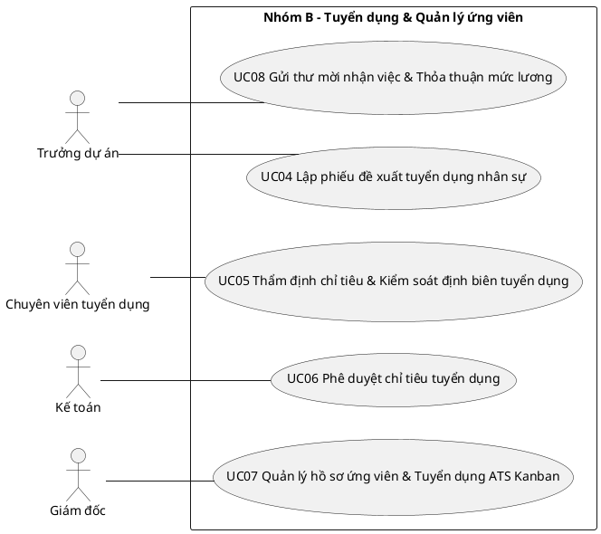
_Hình D.3. Nhóm B - Tuyển dụng & Quản lý ứng viên (UC04, UC05, UC06, UC07, UC08)._

### A.C. Nhóm C - Hồ sơ nhân sự, Hợp đồng & Hội nhập

```plantuml
@startuml
skinparam linetype ortho
skinparam shadowing false
left to right direction
actor "Chuyên viên hồ sơ" as A0
actor "Nhân viên" as A1
actor "Trưởng dự án" as A2
actor "Nhân viên mới" as A3
rectangle "Nhóm C - Hồ sơ nhân sự, Hợp đồng & Hội nhập" {
  (UC09 Quản lý hồ sơ nhân viên toàn diện) as UC09
  (UC10 Quản lý hợp đồng lao động & Phụ lục hợp đồng) as UC10
  (UC11 Quản lý văn bằng, chứng chỉ chuyên môn) as UC11
  (UC12 Mượn - trả hồ sơ, chứng chỉ bản gốc) as UC12
  (UC13 Đánh giá kết quả thử việc & Ký HĐLĐ chính thức) as UC13
  (UC14 Lộ trình hội nhập nhân viên mới (Onboarding Checklist)) as UC14
}
A0 -- UC09
A1 -- UC10
A2 -- UC11
A3 -- UC12
A0 -- UC13
A1 -- UC14
@enduml
```
_Hình D.4. Nhóm C - Hồ sơ nhân sự, Hợp đồng & Hội nhập (UC09, UC10, UC11, UC12, UC13, UC14)._

### A.D. Nhóm D - Cổng tự phục vụ & Phân cấp hồ sơ

```plantuml
@startuml
skinparam linetype ortho
skinparam shadowing false
left to right direction
actor "Toàn thể nhân viên" as A0
actor "Chuyên viên hồ sơ" as A1
actor "Quản trị viên" as A2
rectangle "Nhóm D - Cổng tự phục vụ & Phân cấp hồ sơ" {
  (UC15 Cổng tự phục vụ nhân viên tập trung (ESS Portal)) as UC15
  (UC16 Quản lý thông tin cá nhân phân cấp 3 mức độ) as UC16
  (UC17 Thẩm định & Phê duyệt đề xuất điều chỉnh hồ sơ Mức 2) as UC17
}
A0 -- UC15
A1 -- UC16
A2 -- UC17
@enduml
```
_Hình D.5. Nhóm D - Cổng tự phục vụ & Phân cấp hồ sơ (UC15, UC16, UC17)._

### A.E. Nhóm E - Chấm công, Phân ca & Điểm danh đa nguồn

```plantuml
@startuml
skinparam linetype ortho
skinparam shadowing false
left to right direction
actor "Toàn thể nhân viên" as A0
actor "Chuyên viên hồ sơ" as A1
actor "Chuyên viên tiền lương" as A2
actor "Trưởng dự án" as A3
actor "Quản trị IT" as A4
rectangle "Nhóm E - Chấm công, Phân ca & Điểm danh đa nguồn" {
  (UC18 Ghi nhận sự kiện chấm công & Điểm danh vào/ra ca) as UC18
  (UC19 Điểm danh sinh trắc học khuôn mặt & Cảm biến IR) as UC19
  (UC20 Quản trị kết nối thiết bị máy chấm công) as UC20
  (UC21 Đăng ký & Xét duyệt nghỉ phép trực tuyến) as UC21
  (UC22 Đăng ký & Phê duyệt làm thêm giờ (OT)) as UC22
  (UC23 Lập lịch và phân ca làm việc (Shift Scheduling)) as UC23
  (UC24 Giải trình bổ sung giờ công & Xử lý lệch công) as UC24
  (UC25 Tổng hợp & Chốt bảng chấm công tháng) as UC25
}
A0 -- UC18
A1 -- UC19
A2 -- UC20
A3 -- UC21
A4 -- UC22
A0 -- UC23
A1 -- UC24
A2 -- UC25
@enduml
```
_Hình D.6. Nhóm E - Chấm công, Phân ca & Điểm danh đa nguồn (UC18, UC19, UC20, UC21, UC22, UC23, UC24, UC25)._

### A.F. Nhóm F - Tiền lương, Chế độ đãi ngộ & Phúc lợi

```plantuml
@startuml
skinparam linetype ortho
skinparam shadowing false
left to right direction
actor "Chuyên viên tiền lương" as A0
actor "Giám đốc" as A1
actor "Nhân viên" as A2
actor "Kế toán" as A3
actor "Nhân viên hành chính" as A4
rectangle "Nhóm F - Tiền lương, Chế độ đãi ngộ & Phúc lợi" {
  (UC26 Cấu hình công thức và ngạch bậc lương) as UC26
  (UC27 Vận hành chức năng tính lương tự động) as UC27
  (UC28 Phê duyệt & Khóa bất biến kỳ lương (LOCKED state)) as UC28
  (UC29 Quản lý tạm ứng & Khoản vay phúc lợi nhân viên) as UC29
  (UC30 Quản lý đề xuất công tác & Quyết toán chi phí (T&E)) as UC30
  (UC31 Quản lý cấp phát & Thu hồi tài sản làm việc) as UC31
}
A0 -- UC26
A1 -- UC27
A2 -- UC28
A3 -- UC29
A4 -- UC30
A0 -- UC31
@enduml
```
_Hình D.7. Nhóm F - Tiền lương, Chế độ đãi ngộ & Phúc lợi (UC26, UC27, UC28, UC29, UC30, UC31)._

### A.G. Nhóm G - Biến động nhân sự & Thôi việc

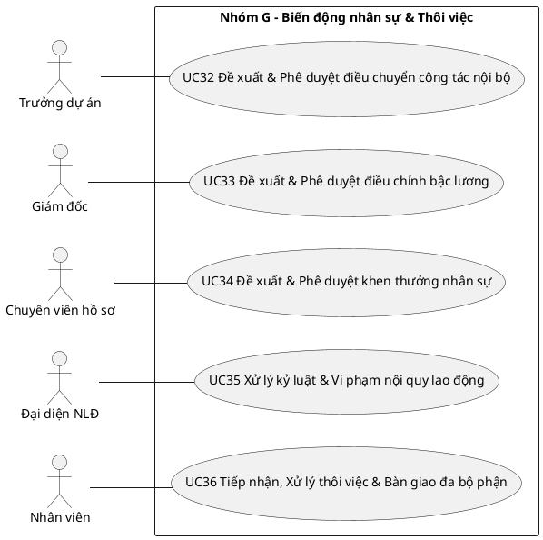
_Hình D.8. Nhóm G - Biến động nhân sự & Thôi việc (UC32, UC33, UC34, UC35, UC36)._

### A.H. Nhóm H - Đánh giá hiệu suất, Đào tạo & Phát triển

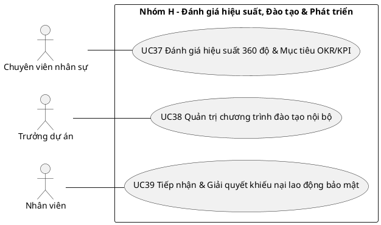
_Hình D.9. Nhóm H - Đánh giá hiệu suất, Đào tạo & Phát triển (UC37, UC38, UC39)._

### A.I. Nhóm I - Chuẩn cán bộ & Báo cáo Nhà nước

```plantuml
@startuml
skinparam linetype ortho
skinparam shadowing false
left to right direction
actor "Chuyên viên hồ sơ" as A0
actor "Giám đốc" as A1
rectangle "Nhóm I - Chuẩn cán bộ & Báo cáo Nhà nước" {
  (UC40 Quản lý hồ sơ cán bộ toàn diện theo Mẫu 2C-BNV) as UC40
  (UC41 Quản trị danh mục ngạch bậc lương chuẩn NĐ 204) as UC41
  (UC42 Tự động rà soát & Phê duyệt nâng bậc lương định kỳ) as UC42
  (UC43 Kết xuất biểu mẫu báo cáo nhà nước (SYLL 2C, Biểu 01-03)) as UC43
}
A0 -- UC40
A1 -- UC41
A0 -- UC42
A1 -- UC43
@enduml
```
_Hình D.10. Nhóm I - Chuẩn cán bộ & Báo cáo Nhà nước (UC40, UC41, UC42, UC43)._

### A.J. Nhóm J - Quản trị Tri thức & Điều hành hệ thống

```plantuml
@startuml
skinparam linetype ortho
skinparam shadowing false
left to right direction
actor "Toàn thể nhân viên" as A0
actor "Ban Giám đốc" as A1
actor "Nhân viên IT" as A2
rectangle "Nhóm J - Quản trị Tri thức & Điều hành hệ thống" {
  (UC44 Quản lý không gian tri thức số & Tài liệu quy trình SOP) as UC44
  (UC45 Tìm kiếm tri thức toàn văn & Danh bạ chuyên gia) as UC45
  (UC46 Bảng điều khiển phân tích & Thống kê nhân sự (Dashboard)) as UC46
  (UC47 Nhật ký kiểm toán hệ thống & Cấu hình tham số) as UC47
}
A0 -- UC44
A1 -- UC45
A2 -- UC46
A0 -- UC47
@enduml
```
_Hình D.11. Nhóm J - Quản trị Tri thức & Điều hành hệ thống (UC44, UC45, UC46, UC47)._

## B. BIỂU ĐỒ TRÌNH TỰ THEO TỪNG USE CASE

### B.UC01. Đăng nhập & Xác thực hệ thống

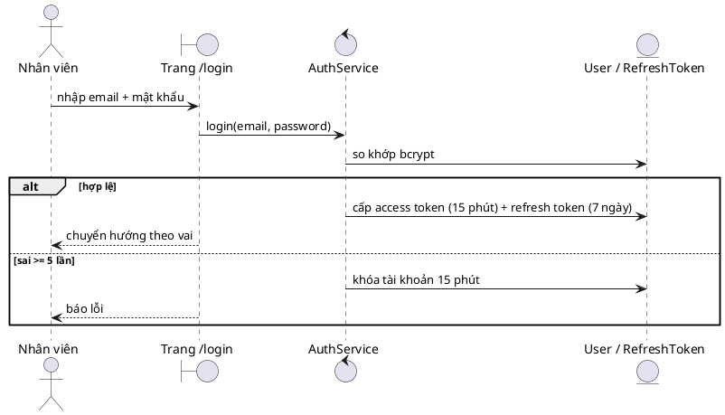
_Hình D.12. Trình tự UC01 - Đăng nhập & Xác thực hệ thống._

### B.UC02. Quản trị người dùng & Phân quyền RBAC

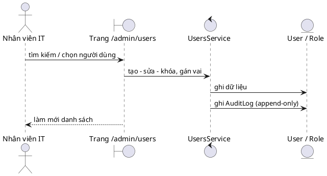
_Hình D.13. Trình tự UC02 - Quản trị người dùng & Phân quyền RBAC._

### B.UC03. Quản trị cơ cấu tổ chức & Cây phòng ban

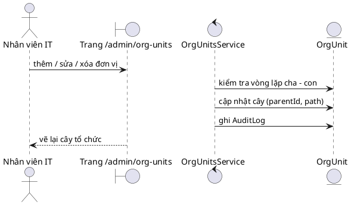
_Hình D.14. Trình tự UC03 - Quản trị cơ cấu tổ chức & Cây phòng ban._

### B.UC04. Lập phiếu đề xuất tuyển dụng nhân sự

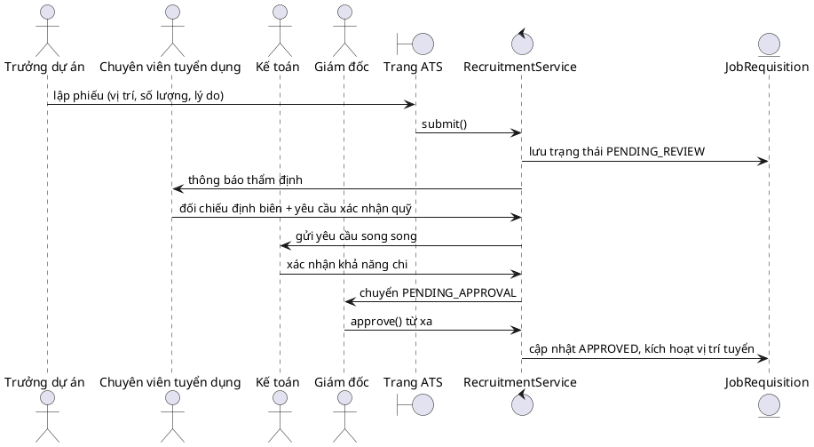
_Hình D.15. Trình tự UC04 - Lập phiếu đề xuất tuyển dụng nhân sự._

### B.UC05. Thẩm định chỉ tiêu & Kiểm soát định biên tuyển dụng

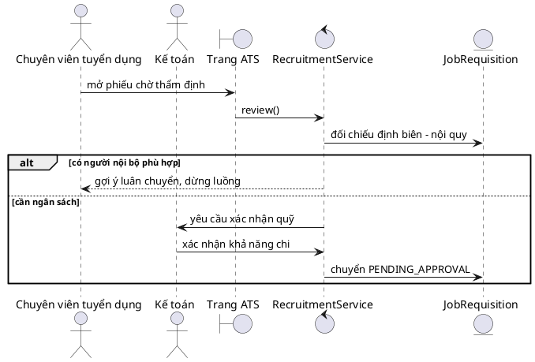
_Hình D.16. Trình tự UC05 - Thẩm định chỉ tiêu & Kiểm soát định biên tuyển dụng._

### B.UC06. Phê duyệt chỉ tiêu tuyển dụng

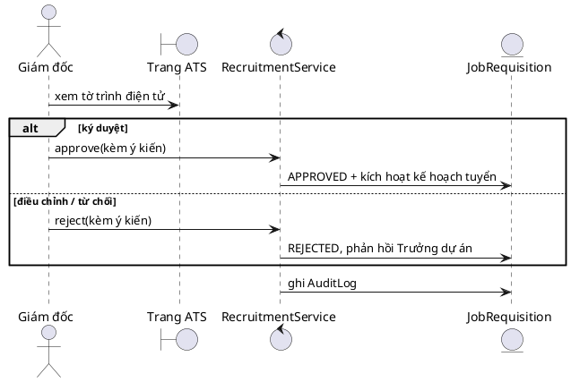
_Hình D.17. Trình tự UC06 - Phê duyệt chỉ tiêu tuyển dụng._

### B.UC07. Quản lý hồ sơ ứng viên & Tuyển dụng ATS Kanban

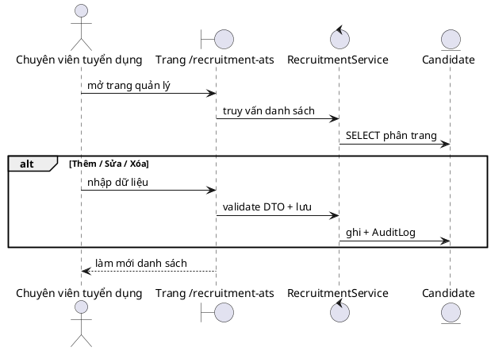
_Hình D.18. Trình tự UC07 - Quản lý hồ sơ ứng viên & Tuyển dụng ATS Kanban._

### B.UC08. Gửi thư mời nhận việc & Thỏa thuận mức lương

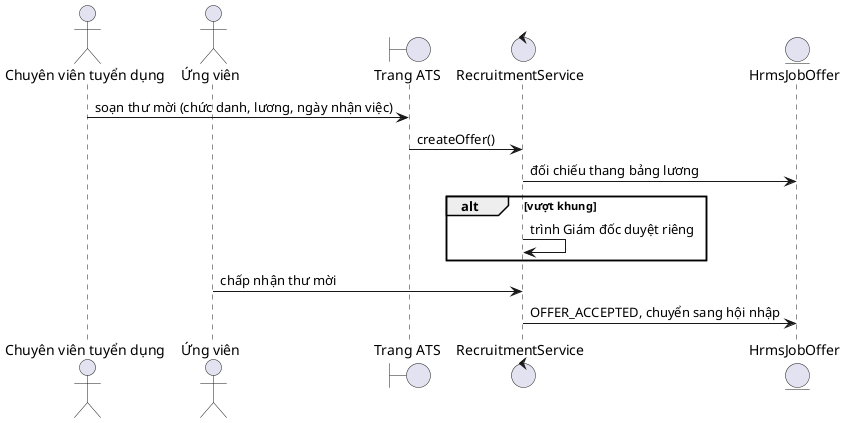
_Hình D.19. Trình tự UC08 - Gửi thư mời nhận việc & Thỏa thuận mức lương._

### B.UC09. Quản lý hồ sơ nhân viên toàn diện

```plantuml
@startuml
skinparam linetype ortho
skinparam shadowing false
actor "Chuyên viên hồ sơ" as A
boundary "Trang /employees" as B
control "EmployeesService" as C
entity "User" as E
A -> B : mở trang quản lý
B -> C : truy vấn danh sách
C -> E : SELECT phân trang
alt Thêm / Sửa / Xóa
A -> B : nhập dữ liệu
B -> C : validate DTO + lưu
C -> E : ghi + AuditLog
end
B --> A : làm mới danh sách
@enduml
```
_Hình D.20. Trình tự UC09 - Quản lý hồ sơ nhân viên toàn diện._

### B.UC10. Quản lý hợp đồng lao động & Phụ lục hợp đồng

```plantuml
@startuml
skinparam linetype ortho
skinparam shadowing false
actor "Chuyên viên hồ sơ" as A
boundary "Trang /employees/:id" as B
control "EmployeesService" as C
entity "Contract" as E
A -> B : mở trang quản lý
B -> C : truy vấn danh sách
C -> E : SELECT phân trang
alt Thêm / Sửa / Xóa
A -> B : nhập dữ liệu
B -> C : validate DTO + lưu
C -> E : ghi + AuditLog
end
B --> A : làm mới danh sách
@enduml
```
_Hình D.21. Trình tự UC10 - Quản lý hợp đồng lao động & Phụ lục hợp đồng._

### B.UC11. Quản lý văn bằng, chứng chỉ chuyên môn

```plantuml
@startuml
skinparam linetype ortho
skinparam shadowing false
actor "Chuyên viên hồ sơ" as A
boundary "Trang /employees/:id" as B
control "EmployeesService" as C
entity "Certificate" as E
A -> B : mở trang quản lý
B -> C : truy vấn danh sách
C -> E : SELECT phân trang
alt Thêm / Sửa / Xóa
A -> B : nhập dữ liệu
B -> C : validate DTO + lưu
C -> E : ghi + AuditLog
end
B --> A : làm mới danh sách
@enduml
```
_Hình D.22. Trình tự UC11 - Quản lý văn bằng, chứng chỉ chuyên môn._

### B.UC12. Mượn - trả hồ sơ, chứng chỉ bản gốc

```plantuml
@startuml
skinparam linetype ortho
skinparam shadowing false
actor "Nhân viên" as A
boundary "Trang /employees/:id" as B
control "EmployeesService" as C
entity "PhieuMuonTra (thiết kế)" as E
A -> B : nhập đề xuất
B -> C : submit()
C -> E : lưu PENDING + thông báo duyệt
alt duyệt
C -> E : APPROVED + phát sinh hiệu lực
else từ chối
C -> E : REJECTED kèm lý do
end
C -> E : ghi AuditLog
@enduml
```
_Hình D.23. Trình tự UC12 - Mượn - trả hồ sơ, chứng chỉ bản gốc._

### B.UC13. Đánh giá kết quả thử việc & Ký HĐLĐ chính thức

```plantuml
@startuml
skinparam linetype ortho
skinparam shadowing false
actor "Trưởng dự án" as PM
boundary "Trang /lifecycle" as B
control "HrmsLifecycleService" as C
entity "Contract / HrmsLifecycleEvent" as E
PM -> B : điền phiếu đánh giá thử việc
B -> C : submitEvaluation()
alt đạt
  C -> E : sinh nhiệm vụ ký HĐ chính thức + xếp lương (>= 85%)
  C -> E : PROBATION -> ACTIVE
else không đạt
  C -> E : sinh nhiệm vụ chấm dứt hợp đồng thử việc
end
@enduml
```
_Hình D.24. Trình tự UC13 - Đánh giá kết quả thử việc & Ký HĐLĐ chính thức._

### B.UC14. Lộ trình hội nhập nhân viên mới (Onboarding Checklist)

```plantuml
@startuml
skinparam linetype ortho
skinparam shadowing false
actor "Nhân viên mới" as NV
actor "Chuyên viên hồ sơ" as HR
boundary "Trang /onboarding, /handover" as B
control "OnboardingService" as C
entity "OnboardingPath / HandoverChecklist" as E
HR -> C : gán lộ trình đọc theo vị trí
NV -> B : tick tiến độ từng bài bắt buộc
alt thôi việc được duyệt
  HR -> C : kích hoạt checklist bàn giao 5 mục
  BP -> C : các bên xác nhận từng mục
  alt đủ 5/5
    C -> E : đóng checklist, hồ sơ chuyển lưu trữ
  else thiếu
    C --> HR : nhắc mục còn thiếu
  end
else đang làm việc
  C -> E : cập nhật tiến độ hội nhập
end
@enduml
```
_Hình D.25. Trình tự UC14 - Lộ trình hội nhập nhân viên mới (Onboarding Checklist)._

### B.UC15. Cổng tự phục vụ nhân viên tập trung (ESS Portal)

```plantuml
@startuml
skinparam linetype ortho
skinparam shadowing false
actor "Nhân viên" as A
boundary "Trang /ess" as B
control "DashboardService" as C
entity "LeaveBalance, Payslip, HrmsAssetAllocation" as E
A -> B : thao tác
B -> C : gọi service
C -> E : đọc/ghi dữ liệu
C -> E : ghi AuditLog
B --> A : kết quả
@enduml
```
_Hình D.26. Trình tự UC15 - Cổng tự phục vụ nhân viên tập trung (ESS Portal)._

### B.UC16. Quản lý thông tin cá nhân phân cấp 3 mức độ

```plantuml
@startuml
skinparam linetype ortho
skinparam shadowing false
actor "Nhân viên" as A
boundary "Trang /profile" as B
control "DashboardService, LeaveService" as C
entity "LeaveBalance, Payslip" as E
A -> B : thao tác
B -> C : gọi service
C -> E : đọc/ghi dữ liệu
C -> E : ghi AuditLog
B --> A : kết quả
@enduml
```
_Hình D.27. Trình tự UC16 - Quản lý thông tin cá nhân phân cấp 3 mức độ._

### B.UC17. Thẩm định & Phê duyệt đề xuất điều chỉnh hồ sơ Mức 2

```plantuml
@startuml
skinparam linetype ortho
skinparam shadowing false
actor "Chuyên viên nhân sự (HR-OPS)" as HR
boundary "Trang /profile (ReviewQueue)" as B
control "ProfileChangeRequestsService" as C
entity "ProfileChangeRequest / User / AuditLog" as E
HR -> B : mở hàng đợi thẩm định
B -> C : lấy danh sách chờ duyệt (listPending)
C -> E : truy vấn ProfileChangeRequest (PENDING)
E --> B : danh sách đề xuất kèm minh chứng
HR -> B : đối chiếu thông tin cũ/mới & xem tệp minh chứng
HR -> B : bấm Chấp thuận (hoặc Từ chối kèm lý do)
B -> C : approveRequest() / rejectRequest()
C -> E : atomic transaction: cập nhật User/ComprehensiveProfile
C -> E : đổi trạng thái APPROVED / REJECTED
C -> E : ghi AuditLog truy vết bất biến
C --> B : kết quả thẩm định thành công
@enduml
```
_Hình D.28. Trình tự UC17 - Thẩm định & Phê duyệt đề xuất điều chỉnh hồ sơ Mức 2._

### B.UC18. Ghi nhận sự kiện chấm công & Điểm danh vào/ra ca

```plantuml
@startuml
skinparam linetype ortho
skinparam shadowing false
actor "Nhân viên" as NV
actor "Máy chấm công" as MC
boundary "Trang /attendance" as B
control "AttendanceService" as C
entity "AttendanceEvent / AttendanceDay" as E
NV -> B : điểm danh web
MC -> C : webhook HMAC / import CSV
C -> E : INSERT sự kiện thô (append-only)
C -> E : tổng hợp bảng công ngày (vào/ra, muộn/sớm)
C --> B : hiển thị bảng công, đánh dấu bản ghi lệch
@enduml
```
_Hình D.29. Trình tự UC18 - Ghi nhận sự kiện chấm công & Điểm danh vào/ra ca._

### B.UC19. Điểm danh sinh trắc học khuôn mặt & Cảm biến IR

```plantuml
@startuml
skinparam linetype ortho
skinparam shadowing false
actor "Nhân viên" as NV
boundary "Trang /attendance" as B
control "FaceCryptoService" as F
control "AttendanceService" as S
entity "FaceEmbedding / AttendanceEvent" as E
NV -> B : đăng ký mẫu (tick đồng thuận)
B -> F : trích vector, mã hóa AES-256-GCM
F -> E : lưu FaceEmbedding (không lưu ảnh gốc)
NV -> B : điểm danh khuôn mặt
B -> F : so khớp cosine similarity
alt vượt ngưỡng
  F -> S : ghi sự kiện (nguồn = khuôn mặt)
else không khớp
  S --> NV : từ chối rõ ràng, giới hạn số lần thử
end
@enduml
```
_Hình D.30. Trình tự UC19 - Điểm danh sinh trắc học khuôn mặt & Cảm biến IR._

### B.UC20. Quản trị kết nối thiết bị máy chấm công

```plantuml
@startuml
skinparam linetype ortho
skinparam shadowing false
actor "Thiết bị / CV hồ sơ" as DEV
boundary "Giao diện /admin/attendance" as B
control "AttendanceDevicesService" as C
control "AttendanceService" as S
entity "AttendanceDevice / AttendanceEvent" as E
DEV -> C : Webhook POST / CSV / Simulator
C -> C : Verify HMAC-SHA256 signature / parse CSV
alt Chữ ký hợp lệ & thiết bị ACTIVE
  C -> E : INSERT sự kiện (nguồn MACHINE / SIMULATOR)
  C -> S : Kích hoạt tổng hợp bảng công ngày
  C --> DEV : 200 OK (ghi nhận thành công)
else Lỗi xác thực hoặc định dạng sai
  C --> DEV : 400 Bad Request / 401 Unauthorized
end
@enduml
```
_Hình D.31. Trình tự UC20 - Quản trị kết nối thiết bị máy chấm công._

### B.UC21. Đăng ký & Xét duyệt nghỉ phép trực tuyến

```plantuml
@startuml
skinparam linetype ortho
skinparam shadowing false
actor "Nhân viên" as NV
actor "Chuyên viên nhân sự" as HR
boundary "Trang /leave" as B
control "LeaveService" as C
entity "LeaveRequest / LeaveBalance" as E
NV -> B : tạo đơn (loại, từ ngày, đến ngày)
B -> C : checkBalance()
alt quỹ đủ
  C -> E : lưu PENDING, thông báo HR
  HR -> C : approve()
  C -> E : trừ quỹ NGAY + ghi công phép vào bảng công
else quỹ không đủ
  C --> NV : từ chối kèm số dư còn lại
end
@enduml
```
_Hình D.32. Trình tự UC21 - Đăng ký & Xét duyệt nghỉ phép trực tuyến._

### B.UC22. Đăng ký & Phê duyệt làm thêm giờ (OT)

```plantuml
@startuml
skinparam linetype ortho
skinparam shadowing false
actor "Nhân viên" as A
boundary "Trang /overtime" as B
control "OvertimeService" as C
entity "OvertimeRequest" as E
A -> B : nhập đề xuất
B -> C : submit()
C -> E : lưu PENDING + thông báo duyệt
alt duyệt
C -> E : APPROVED + phát sinh hiệu lực
else từ chối
C -> E : REJECTED kèm lý do
end
C -> E : ghi AuditLog
@enduml
```
_Hình D.33. Trình tự UC22 - Đăng ký & Phê duyệt làm thêm giờ (OT)._

### B.UC23. Lập lịch và phân ca làm việc (Shift Scheduling)

```plantuml
@startuml
skinparam linetype ortho
skinparam shadowing false
actor "Chuyên viên tiền lương" as A
boundary "Trang /shifts" as B
control "HrmsShiftsService" as C
entity "HrmsShiftType, HrmsShiftAssignment" as E
A -> B : mở trang quản lý
B -> C : truy vấn danh sách
C -> E : SELECT phân trang
alt Thêm / Sửa / Xóa
A -> B : nhập dữ liệu
B -> C : validate DTO + lưu
C -> E : ghi + AuditLog
end
B --> A : làm mới danh sách
@enduml
```
_Hình D.34. Trình tự UC23 - Lập lịch và phân ca làm việc (Shift Scheduling)._

### B.UC24. Giải trình bổ sung giờ công & Xử lý lệch công

```plantuml
@startuml
skinparam linetype ortho
skinparam shadowing false
actor "Nhân viên" as NV
actor "Quản lý" as QL
boundary "Trang /ess" as B
control "HrmsRegularizationService" as C
entity "HrmsAttendanceRegularization" as E
NV -> B : chọn ngày thiếu công, nhập giờ mong muốn + lý do
B -> C : submit()
C -> E : lưu PENDING, thông báo quản lý
QL -> C : duyệt / từ chối
alt duyệt
  C -> E : bù công vào bảng chấm công
else từ chối
  C -> E : lưu lý do
end
@enduml
```
_Hình D.35. Trình tự UC24 - Giải trình bổ sung giờ công & Xử lý lệch công._

### B.UC25. Tổng hợp & Chốt bảng chấm công tháng

```plantuml
@startuml
skinparam linetype ortho
skinparam shadowing false
actor "Chuyên viên tiền lương" as CV
actor "Trưởng dự án" as PM
boundary "Trang /attendance" as B
control "AttendanceService" as C
entity "AttendanceDay" as E
CV -> B : hợp nhất bảng công tháng
C -> E : tổng hợp sự kiện, xử lý bản ghi lệch
PM -> B : xác nhận bảng công nhóm
CV -> B : chốt ngày 25, khóa bảng công
C -> E : khóa dữ liệu công chuyển sang tính lương
@enduml
```
_Hình D.36. Trình tự UC25 - Tổng hợp & Chốt bảng chấm công tháng._

### B.UC26. Cấu hình công thức và ngạch bậc lương

```plantuml
@startuml
skinparam linetype ortho
skinparam shadowing false
actor "Chuyên viên tiền lương" as A
boundary "Trang /payroll-engine" as B
control "HrmsPayrollService" as C
entity "HrmsSalaryComponent, HrmsSalaryStructure" as E
A -> B : mở trang quản lý
B -> C : truy vấn danh sách
C -> E : SELECT phân trang
alt Thêm / Sửa / Xóa
A -> B : nhập dữ liệu
B -> C : validate DTO + lưu
C -> E : ghi + AuditLog
end
B --> A : làm mới danh sách
@enduml
```
_Hình D.37. Trình tự UC26 - Cấu hình công thức và ngạch bậc lương._

### B.UC27. Vận hành chức năng tính lương tự động

```plantuml
@startuml
skinparam linetype ortho
skinparam shadowing false
actor "Chuyên viên tiền lương" as CV
boundary "Trang /payroll" as B
control "PayrollService" as C
entity "Payslip / PayrollPeriod" as E
CV -> B : bấm tính lương kỳ đã chốt công
C -> E : nạp lương hợp đồng ACTIVE + OT đã duyệt
C -> E : trừ BHXH 10,5% + thuế TNCN 7 bậc - EMI vay
C -> E : sinh Payslip từng nhân viên
CV -> B : đối chiếu
alt khớp
  CV -> C : trình duyệt
else lệch
  C -> E : ghi chú, tính lại (giữ vết audit)
end
@enduml
```
_Hình D.38. Trình tự UC27 - Vận hành chức năng tính lương tự động._

### B.UC28. Phê duyệt & Khóa bất biến kỳ lương (LOCKED state)

```plantuml
@startuml
skinparam linetype ortho
skinparam shadowing false
actor "Chuyên viên tiền lương" as CV
actor "Quản trị viên" as AD
boundary "Trang /payroll" as B
control "PayrollService" as C
entity "PayrollPeriod" as E
CV -> B : trình kết quả REVIEWED
AD -> B : duyệt và khóa kỳ
C -> E : OPEN -> CALCULATED -> REVIEWED -> LOCKED
alt gọi tính lại sau khóa
  C --> B : chặn lỗi HTTP 409
end
C -> E : xuất bảng kê chi lương ngân hàng
@enduml
```
_Hình D.39. Trình tự UC28 - Phê duyệt & Khóa bất biến kỳ lương (LOCKED state)._

### B.UC29. Quản lý tạm ứng & Khoản vay phúc lợi nhân viên

```plantuml
@startuml
skinparam linetype ortho
skinparam shadowing false
actor "Nhân viên" as NV
actor "Chuyên viên nhân sự" as HR
boundary "Trang /loans" as B
control "HrmsLoansService" as C
entity "HrmsEmployeeLoan" as E
NV -> B : tạo đơn vay / tạm ứng (kỳ hạn 1-24 tháng)
C -> E : tính EMI hàng tháng
alt EMI <= 30% thực lĩnh
  C -> E : chuyển CHỜ THẨM ĐỊNH
  HR -> C : duyệt giải ngân
  C -> E : APPROVED, EMI nạp bảng lương đến hết nợ
else vượt trần
  C --> NV : chặn kèm thông báo
end
@enduml
```
_Hình D.40. Trình tự UC29 - Quản lý tạm ứng & Khoản vay phúc lợi nhân viên._

### B.UC30. Quản lý đề xuất công tác & Quyết toán chi phí (T&E)

```plantuml
@startuml
skinparam linetype ortho
skinparam shadowing false
actor "Nhân viên" as NV
actor "Chuyên viên nhân sự" as HR
boundary "Trang /expense-claims" as B
control "HrmsExpensesService" as C
entity "HrmsTravelRequest / HrmsExpenseClaim" as E
NV -> B : đề xuất chuyến công tác
HR -> C : duyệt lịch trình
C -> E : tạm ứng kinh phí
NV -> B : lập bảng kê chi phí + chứng từ
HR -> C : duyệt quyết toán
C -> E : chuyển số liệu xuống kỳ lương / kế toán
@enduml
```
_Hình D.41. Trình tự UC30 - Quản lý đề xuất công tác & Quyết toán chi phí (T&E)._

### B.UC31. Quản lý cấp phát & Thu hồi tài sản làm việc

```plantuml
@startuml
skinparam linetype ortho
skinparam shadowing false
actor "Nhân viên hành chính" as HC
boundary "Trang /assets" as B
control "HrmsAssetsService" as C
entity "HrmsAssetAllocation" as E
HC -> B : đăng ký tài sản mới
HC -> B : cấp phát cho nhân viên
C -> E : lập biên bản bàn giao, trạng thái ALLOCATED
HC -> B : thu hồi khi chuyển / thôi việc
C -> E : trả về IN_STOCK (hoặc DECOMMISSIONED)
@enduml
```
_Hình D.42. Trình tự UC31 - Quản lý cấp phát & Thu hồi tài sản làm việc._

### B.UC32. Đề xuất & Phê duyệt điều chuyển công tác nội bộ

```plantuml
@startuml
skinparam linetype ortho
skinparam shadowing false
actor "Trưởng dự án" as A
boundary "Trang /personnel" as B
control "PersonnelActionsService" as C
entity "PersonnelAction" as E
A -> B : nhập đề xuất
B -> C : submit()
C -> E : lưu PENDING + thông báo duyệt
alt duyệt
C -> E : APPROVED + phát sinh hiệu lực
else từ chối
C -> E : REJECTED kèm lý do
end
C -> E : ghi AuditLog
@enduml
```
_Hình D.43. Trình tự UC32 - Đề xuất & Phê duyệt điều chuyển công tác nội bộ._

### B.UC33. Đề xuất & Phê duyệt điều chỉnh bậc lương

```plantuml
@startuml
skinparam linetype ortho
skinparam shadowing false
actor "Trưởng dự án" as A
boundary "Trang /personnel" as B
control "PersonnelActionsService" as C
entity "PersonnelAction" as E
A -> B : nhập đề xuất
B -> C : submit()
C -> E : lưu PENDING + thông báo duyệt
alt duyệt
C -> E : APPROVED + phát sinh hiệu lực
else từ chối
C -> E : REJECTED kèm lý do
end
C -> E : ghi AuditLog
@enduml
```
_Hình D.44. Trình tự UC33 - Đề xuất & Phê duyệt điều chỉnh bậc lương._

### B.UC34. Đề xuất & Phê duyệt khen thưởng nhân sự

```plantuml
@startuml
skinparam linetype ortho
skinparam shadowing false
actor "Trưởng dự án" as A
boundary "Trang /personnel" as B
control "PersonnelActionsService" as C
entity "PersonnelAction" as E
A -> B : nhập đề xuất
B -> C : submit()
C -> E : lưu PENDING + thông báo duyệt
alt duyệt
C -> E : APPROVED + phát sinh hiệu lực
else từ chối
C -> E : REJECTED kèm lý do
end
C -> E : ghi AuditLog
@enduml
```
_Hình D.45. Trình tự UC34 - Đề xuất & Phê duyệt khen thưởng nhân sự._

### B.UC35. Xử lý kỷ luật & Vi phạm nội quy lao động

```plantuml
@startuml
skinparam linetype ortho
skinparam shadowing false
actor "Trưởng dự án" as A
boundary "Trang /personnel" as B
control "PersonnelActionsService" as C
entity "PersonnelAction" as E
A -> B : nhập đề xuất
B -> C : submit()
C -> E : lưu PENDING + thông báo duyệt
alt duyệt
C -> E : APPROVED + phát sinh hiệu lực
else từ chối
C -> E : REJECTED kèm lý do
end
C -> E : ghi AuditLog
@enduml
```
_Hình D.46. Trình tự UC35 - Xử lý kỷ luật & Vi phạm nội quy lao động._

### B.UC36. Tiếp nhận, Xử lý thôi việc & Bàn giao đa bộ phận

```plantuml
@startuml
skinparam linetype ortho
skinparam shadowing false
actor "Nhân viên" as NV
actor "Các bộ phận xác nhận" as BP
actor "Quản trị viên" as AD
boundary "Trang /personnel" as B
control "PersonnelActionsService" as C
entity "HandoverChecklist" as E
NV -> B : nộp đơn thôi việc
AD -> C : duyệt đơn
C -> E : tự sinh checklist 5 mục xác nhận
BP -> C : lần lượt xác nhận (1/5 -> 5/5)
alt đủ 5/5
  C -> E : bật phát hành quyết định chấm dứt hợp đồng
  C -> E : hồ sơ chuyển Lưu trữ - đã nghỉ
else thiếu
  C --> BP : nhắc mục còn thiếu
end
@enduml
```
_Hình D.47. Trình tự UC36 - Tiếp nhận, Xử lý thôi việc & Bàn giao đa bộ phận._

### B.UC37. Đánh giá hiệu suất 360 độ & Mục tiêu OKR/KPI

```plantuml
@startuml
skinparam linetype ortho
skinparam shadowing false
actor "Chuyên viên nhân sự" as HR
actor "Nhân viên" as NV
actor "Quản lý" as QL
boundary "Trang /performance-360" as B
control "HrmsPerformanceService" as C
entity "HrmsAppraisalGoal / HrmsAppraisalReview" as E
HR -> B : tạo kỳ đánh giá, gán KRA/KPI theo trọng số %
NV -> C : tự đánh giá
QL -> C : chấm điểm + phản hồi 360 độ
NV -> C : xác nhận kết quả
C -> E : lưu kết quả làm căn cứ tăng lương
@enduml
```
_Hình D.48. Trình tự UC37 - Đánh giá hiệu suất 360 độ & Mục tiêu OKR/KPI._

### B.UC38. Quản trị chương trình đào tạo nội bộ

```plantuml
@startuml
skinparam linetype ortho
skinparam shadowing false
actor "Chuyên viên nhân sự" as HR
actor "Nhân viên" as NV
boundary "Trang /training-grievance" as B
control "HrmsTrainingService" as C
entity "HrmsTrainingProgram / HrmsGrievance" as E
HR -> B : lập chương trình đào tạo
NV -> C : ghi danh (chặn khi hết chỗ)
NV -> C : hoàn thành + khảo sát hài lòng
NV -> B : gửi khiếu nại / kiến nghị
HR -> C : xử lý đến RESOLVED
@enduml
```
_Hình D.49. Trình tự UC38 - Quản trị chương trình đào tạo nội bộ._

### B.UC39. Tiếp nhận & Giải quyết khiếu nại lao động bảo mật

```plantuml
@startuml
skinparam linetype ortho
skinparam shadowing false
actor "Chuyên viên nhân sự" as HR
actor "Nhân viên" as NV
boundary "Trang /training-grievance" as B
control "HrmsTrainingService" as C
entity "HrmsTrainingProgram / HrmsGrievance" as E
HR -> B : lập chương trình đào tạo
NV -> C : ghi danh (chặn khi hết chỗ)
NV -> C : hoàn thành + khảo sát hài lòng
NV -> B : gửi khiếu nại / kiến nghị
HR -> C : xử lý đến RESOLVED
@enduml
```
_Hình D.50. Trình tự UC39 - Tiếp nhận & Giải quyết khiếu nại lao động bảo mật._

### B.UC40. Quản lý hồ sơ cán bộ toàn diện theo Mẫu 2C-BNV

```plantuml
@startuml
skinparam linetype ortho
skinparam shadowing false
actor "Chuyên viên hồ sơ" as A
boundary "Trang /personnel-profiles" as B
control "PersonnelProfilesService" as C
entity "PersonnelComprehensiveProfile + 8 bảng quá trình" as E
A -> B : mở trang quản lý
B -> C : truy vấn danh sách
C -> E : SELECT phân trang
alt Thêm / Sửa / Xóa
A -> B : nhập dữ liệu
B -> C : validate DTO + lưu
C -> E : ghi + AuditLog
end
B --> A : làm mới danh sách
@enduml
```
_Hình D.51. Trình tự UC40 - Quản lý hồ sơ cán bộ toàn diện theo Mẫu 2C-BNV._

### B.UC41. Quản trị danh mục ngạch bậc lương chuẩn NĐ 204

```plantuml
@startuml
skinparam linetype ortho
skinparam shadowing false
actor "Chuyên viên hồ sơ" as A
boundary "Trang /salary-ranks" as B
control "PersonnelRanksService" as C
entity "PersonnelRank" as E
A -> B : mở trang quản lý
B -> C : truy vấn danh sách
C -> E : SELECT phân trang
alt Thêm / Sửa / Xóa
A -> B : nhập dữ liệu
B -> C : validate DTO + lưu
C -> E : ghi + AuditLog
end
B --> A : làm mới danh sách
@enduml
```
_Hình D.52. Trình tự UC41 - Quản trị danh mục ngạch bậc lương chuẩn NĐ 204._

### B.UC42. Tự động rà soát & Phê duyệt nâng bậc lương định kỳ

```plantuml
@startuml
skinparam linetype ortho
skinparam shadowing false
actor "Chuyên viên hồ sơ" as HR
actor "Giám đốc" as GD
boundary "Trang /salary-progression" as B
control "PersonnelReportsService" as C
entity "PersonnelSalaryHistory" as E
HR -> B : bấm quét nâng bậc
C -> E : đối chiếu ngày hưởng bậc với chu kỳ 36/24 tháng
C -> E : sinh danh sách đề nghị (bậc trần cộng vượt khung 5% + 1%/năm)
GD -> C : phê duyệt
C -> E : cập nhật ngạch/bậc/hệ số + ghi diễn biến lương
@enduml
```
_Hình D.53. Trình tự UC42 - Tự động rà soát & Phê duyệt nâng bậc lương định kỳ._

### B.UC43. Kết xuất biểu mẫu báo cáo nhà nước (SYLL 2C, Biểu 01-03)

```plantuml
@startuml
skinparam linetype ortho
skinparam shadowing false
actor "Chuyên viên hồ sơ" as HR
boundary "Trang /personnel-reports" as B
control "PersonnelReportsService" as C
entity "PersonnelComprehensiveProfile" as E
HR -> B : chọn nhân viên, xuất 2C PDF
C -> E : tổng hợp 111 thuộc tính + 8 bảng quá trình
C --> HR : Sơ yếu lý lịch Mẫu 2C-BNV/2008 (4 trang)
HR -> B : chọn Biểu thống kê
C --> HR : Biểu 01 / 02 / 03 dạng Excel
@enduml
```
_Hình D.54. Trình tự UC43 - Kết xuất biểu mẫu báo cáo nhà nước (SYLL 2C, Biểu 01-03)._

### B.UC44. Quản lý không gian tri thức số & Tài liệu quy trình SOP

```plantuml
@startuml
skinparam linetype ortho
skinparam shadowing false
actor "Tác giả" as TG
actor "Quản lý Space" as QL
boundary "Trang /spaces, /review" as B
control "ArticlesService" as C
entity "Article / ArticleVersion / ArticleReview" as E
TG -> B : soạn bài (Markdown + đính kèm)
C -> E : lưu DRAFT
TG -> C : submit()
C -> E : PENDING_REVIEW + thông báo quản lý
alt duyệt
  QL -> C : approve()
  C -> E : PUBLISHED
else yêu cầu chỉnh sửa
  QL -> C : request_changes(kèm ý kiến)
  C -> E : về DRAFT
end
TG -> C : sửa bài
C -> E : sinh phiên bản mới (bất biến), rollback được
@enduml
```
_Hình D.55. Trình tự UC44 - Quản lý không gian tri thức số & Tài liệu quy trình SOP._

### B.UC45. Tìm kiếm tri thức toàn văn & Danh bạ chuyên gia

```plantuml
@startuml
skinparam linetype ortho
skinparam shadowing false
actor "Nhân viên" as NV
boundary "Trang /search, /people" as B
control "SearchService" as C
entity "Article (FTS + pg_trgm)" as E
NV -> B : nhập từ khóa
B -> C : search(q)
C -> E : truy vấn FTS lọc phạm vi quyền ngay trong SQL
C --> NV : kết quả kèm highlight
NV -> B : tìm chuyên gia theo lĩnh vực
B -> C : directory chuyên môn
C --> NV : danh sách chuyên gia + bài viết theo tác giả
@enduml
```
_Hình D.56. Trình tự UC45 - Tìm kiếm tri thức toàn văn & Danh bạ chuyên gia._

### B.UC46. Bảng điều khiển phân tích & Thống kê nhân sự (Dashboard)

```plantuml
@startuml
skinparam linetype ortho
skinparam shadowing false
actor "Toàn bộ vai" as A
boundary "Trang /dashboard" as B
control "DashboardService" as C
entity "User, PayrollRun, PersonnelAction" as E
A -> B : thao tác
B -> C : gọi service
C -> E : đọc/ghi dữ liệu
C -> E : ghi AuditLog
B --> A : kết quả
@enduml
```
_Hình D.57. Trình tự UC46 - Bảng điều khiển phân tích & Thống kê nhân sự (Dashboard)._

### B.UC47. Nhật ký kiểm toán hệ thống & Cấu hình tham số

```plantuml
@startuml
skinparam linetype ortho
skinparam shadowing false
actor "Nhân viên IT" as IT
boundary "Trang /admin/audit, /admin/settings" as B
control "AuditService / SettingsService" as C
entity "AuditLog / Setting" as E
IT -> B : tra cứu audit log
C -> E : đọc append-only (ai, làm gì, trước/sau)
IT -> B : chỉnh tham số key-value
C -> E : lưu Setting (không cần triển khai lại)
C -> E : ghi AuditLog thay đổi
@enduml
```
_Hình D.58. Trình tự UC47 - Nhật ký kiểm toán hệ thống & Cấu hình tham số._

## C. BIỂU ĐỒ HOẠT ĐỘNG THEO TỪNG USE CASE

### C.UC01. Đăng nhập & Xác thực hệ thống

```plantuml
@startuml
skinparam linetype ortho
skinparam shadowing false
start
:Nhập email + mật khẩu;
:So khớp bcrypt;
if (Hợp lệ?) then (có)
:Cấp access + refresh token;
:Vào giao diện theo vai;
else (không)
:Báo lỗi;
if (Sai >= 5 lần?) then (có)
:Khóa tài khoản 15 phút;
endif
endif
stop
@enduml
```
_Hình D.59. Hoạt động UC01 - Đăng nhập & Xác thực hệ thống._

### C.UC02. Quản trị người dùng & Phân quyền RBAC

```plantuml
@startuml
skinparam linetype ortho
skinparam shadowing false
start
Mở trang quản lý
Tìm kiếm / lọc dữ liệu
alt Thêm / Sửa / Xóa
Nhập dữ liệu trên form
Hệ thống validate DTO
Lưu qua service + ghi AuditLog
Làm mới danh sách
end alt
stop
@enduml
```
_Hình D.60. Hoạt động UC02 - Quản trị người dùng & Phân quyền RBAC._

### C.UC03. Quản trị cơ cấu tổ chức & Cây phòng ban

```plantuml
@startuml
skinparam linetype ortho
skinparam shadowing false
start
Mở trang quản lý
Tìm kiếm / lọc dữ liệu
alt Thêm / Sửa / Xóa
Nhập dữ liệu trên form
Hệ thống validate DTO
Lưu qua service + ghi AuditLog
Làm mới danh sách
end alt
stop
@enduml
```
_Hình D.61. Hoạt động UC03 - Quản trị cơ cấu tổ chức & Cây phòng ban._

### C.UC04. Lập phiếu đề xuất tuyển dụng nhân sự

```plantuml
@startuml
skinparam linetype ortho
skinparam shadowing false
start
:Trưởng dự án lập phiếu đề xuất;
:Lưu PENDING_REVIEW, báo chuyên viên;
:Thẩm định định biên + nội quy;
:Kế toán xác nhận quỹ (song song);
:Trình Giám đốc;
if (Ký duyệt?) then (có)
:APPROVED - kích hoạt vị trí tuyển;
else (không)
:REJECTED kèm ý kiến;
endif
stop
@enduml
```
_Hình D.62. Hoạt động UC04 - Lập phiếu đề xuất tuyển dụng nhân sự._

### C.UC05. Thẩm định chỉ tiêu & Kiểm soát định biên tuyển dụng

```plantuml
@startuml
skinparam linetype ortho
skinparam shadowing false
start
Mở trang
Truy vấn theo phạm vi quyền
Hiển thị dữ liệu
stop
@enduml
```
_Hình D.63. Hoạt động UC05 - Thẩm định chỉ tiêu & Kiểm soát định biên tuyển dụng._

### C.UC06. Phê duyệt chỉ tiêu tuyển dụng

```plantuml
@startuml
skinparam linetype ortho
skinparam shadowing false
start
Mở trang
Truy vấn theo phạm vi quyền
Hiển thị dữ liệu
stop
@enduml
```
_Hình D.64. Hoạt động UC06 - Phê duyệt chỉ tiêu tuyển dụng._

### C.UC07. Quản lý hồ sơ ứng viên & Tuyển dụng ATS Kanban

```plantuml
@startuml
skinparam linetype ortho
skinparam shadowing false
start
Mở trang quản lý
Tìm kiếm / lọc dữ liệu
alt Thêm / Sửa / Xóa
Nhập dữ liệu trên form
Hệ thống validate DTO
Lưu qua service + ghi AuditLog
Làm mới danh sách
end alt
stop
@enduml
```
_Hình D.65. Hoạt động UC07 - Quản lý hồ sơ ứng viên & Tuyển dụng ATS Kanban._

### C.UC08. Gửi thư mời nhận việc & Thỏa thuận mức lương

```plantuml
@startuml
skinparam linetype ortho
skinparam shadowing false
start
:Soạn thư mời (chức danh, lương, ngày nhận việc);
if (Lương vượt khung?) then (có)
:Trình Giám đốc duyệt riêng;
else (không)
:Gửi ngay;
endif
:Ứng viên chấp nhận;
:Chuyển sang luồng hội nhập;
stop
@enduml
```
_Hình D.66. Hoạt động UC08 - Gửi thư mời nhận việc & Thỏa thuận mức lương._

### C.UC09. Quản lý hồ sơ nhân viên toàn diện

```plantuml
@startuml
skinparam linetype ortho
skinparam shadowing false
start
Mở trang quản lý
Tìm kiếm / lọc dữ liệu
alt Thêm / Sửa / Xóa
Nhập dữ liệu trên form
Hệ thống validate DTO
Lưu qua service + ghi AuditLog
Làm mới danh sách
end alt
stop
@enduml
```
_Hình D.67. Hoạt động UC09 - Quản lý hồ sơ nhân viên toàn diện._

### C.UC10. Quản lý hợp đồng lao động & Phụ lục hợp đồng

```plantuml
@startuml
skinparam linetype ortho
skinparam shadowing false
start
Mở trang quản lý
Tìm kiếm / lọc dữ liệu
alt Thêm / Sửa / Xóa
Nhập dữ liệu trên form
Hệ thống validate DTO
Lưu qua service + ghi AuditLog
Làm mới danh sách
end alt
stop
@enduml
```
_Hình D.68. Hoạt động UC10 - Quản lý hợp đồng lao động & Phụ lục hợp đồng._

### C.UC11. Quản lý văn bằng, chứng chỉ chuyên môn

```plantuml
@startuml
skinparam linetype ortho
skinparam shadowing false
start
Mở trang quản lý
Tìm kiếm / lọc dữ liệu
alt Thêm / Sửa / Xóa
Nhập dữ liệu trên form
Hệ thống validate DTO
Lưu qua service + ghi AuditLog
Làm mới danh sách
end alt
stop
@enduml
```
_Hình D.69. Hoạt động UC11 - Quản lý văn bằng, chứng chỉ chuyên môn._

### C.UC12. Mượn - trả hồ sơ, chứng chỉ bản gốc

```plantuml
@startuml
skinparam linetype ortho
skinparam shadowing false
start
Mở trang
Truy vấn theo phạm vi quyền
Hiển thị dữ liệu
stop
@enduml
```
_Hình D.70. Hoạt động UC12 - Mượn - trả hồ sơ, chứng chỉ bản gốc._

### C.UC13. Đánh giá kết quả thử việc & Ký HĐLĐ chính thức

```plantuml
@startuml
skinparam linetype ortho
skinparam shadowing false
start
:Trưởng dự án điền phiếu đánh giá thử việc;
if (Đạt?) then (có)
:Sinh nhiệm vụ ký HĐ chính thức + xếp lương;
:PROBATION -> ACTIVE;
else (không)
:Sinh nhiệm vụ chấm dứt hợp đồng thử việc;
endif
stop
@enduml
```
_Hình D.71. Hoạt động UC13 - Đánh giá kết quả thử việc & Ký HĐLĐ chính thức._

### C.UC14. Lộ trình hội nhập nhân viên mới (Onboarding Checklist)

```plantuml
@startuml
skinparam linetype ortho
skinparam shadowing false
start
:Nhân viên mới nhận lộ trình đọc theo vị trí;
repeat
:Hoàn thành từng bài đọc bắt buộc;
repeat while (Còn bài?) is (có)
:Hội nhập hoàn tất;
if (Đơn thôi việc được duyệt?) then (có)
:Tự sinh checklist bàn giao 5 mục;
repeat
:Các bên xác nhận từng mục;
repeat while (Chưa đủ 5/5?) is (thiếu)
:Đóng checklist, lưu trữ hồ sơ;
else (không)
:Tiếp tục làm việc;
endif
stop
@enduml
```
_Hình D.72. Hoạt động UC14 - Lộ trình hội nhập nhân viên mới (Onboarding Checklist)._

### C.UC15. Cổng tự phục vụ nhân viên tập trung (ESS Portal)

```plantuml
@startuml
skinparam linetype ortho
skinparam shadowing false
start
Mở trang
Truy vấn theo phạm vi quyền
Hiển thị dữ liệu
stop
@enduml
```
_Hình D.73. Hoạt động UC15 - Cổng tự phục vụ nhân viên tập trung (ESS Portal)._

### C.UC16. Quản lý thông tin cá nhân phân cấp 3 mức độ

```plantuml
@startuml
skinparam linetype ortho
skinparam shadowing false
start
Mở trang
Truy vấn theo phạm vi quyền
Hiển thị dữ liệu
stop
@enduml
```
_Hình D.74. Hoạt động UC16 - Quản lý thông tin cá nhân phân cấp 3 mức độ._

### C.UC17. Thẩm định & Phê duyệt đề xuất điều chỉnh hồ sơ Mức 2

```plantuml
@startuml
skinparam linetype ortho
skinparam shadowing false
start
:Mở hàng đợi thẩm định hồ sơ (/profile);
:Tải danh sách đề xuất Mức 2 (PENDING);
:Đối chiếu thông tin hiện tại với giá trị mới đề xuất;
:Mở xem tài liệu minh chứng pháp lý (CCCD, bằng cấp...);
if (Hồ sơ minh chứng hợp lệ?) then (Đạt)
  :Bấm Chấp thuận (Approve);
  :Cập nhật User và ComprehensiveProfile;
  :Chuyển trạng thái APPROVED;
  :Ghi nhật ký kiểm toán AuditLog;
else (Không đạt)
  :Nhập lý do từ chối;
  :Chuyển trạng thái REJECTED;
  :Gửi phản hồi cho nhân viên;
endif
stop
@enduml
```
_Hình D.75. Hoạt động UC17 - Thẩm định & Phê duyệt đề xuất điều chỉnh hồ sơ Mức 2._

### C.UC18. Ghi nhận sự kiện chấm công & Điểm danh vào/ra ca

```plantuml
@startuml
skinparam linetype ortho
skinparam shadowing false
start
fork
:Điểm danh web ESS;
fork again
:Điểm danh khuôn mặt sinh trắc học & IR;
fork again
:Máy chấm công đẩy webhook/CSV/Simulator;
end fork
:INSERT sự kiện thô (bất biến);
:Tổng hợp bảng công ngày;
if (Thiếu vào/ra?) then (có)
:Đánh dấu lệch vào hàng đợi;
else (không)
:Công chuẩn;
endif
stop
@enduml
```
_Hình D.76. Hoạt động UC18 - Ghi nhận sự kiện chấm công & Điểm danh vào/ra ca._

### C.UC19. Điểm danh sinh trắc học khuôn mặt & Cảm biến IR

```plantuml
@startuml
skinparam linetype ortho
skinparam shadowing false
start
:Tick đồng thuận dữ liệu sinh trắc học;
:Trích vector từ 3-5 ảnh, mã hóa AES-256-GCM;
:Lưu FaceEmbedding;
:Điểm danh khuôn mặt thời gian thực;
if (Cosine similarity vượt ngưỡng?) then (có)
:Ghi sự kiện nguồn khuôn mặt;
else (không)
:Từ chối, giới hạn số lần thử;
endif
stop
@enduml
```
_Hình D.77. Hoạt động UC19 - Điểm danh sinh trắc học khuôn mặt & Cảm biến IR._

### C.UC20. Quản trị kết nối thiết bị máy chấm công

```plantuml
@startuml
skinparam linetype ortho
skinparam shadowing false
start
:Thiết bị chấm công hoặc Chuyên viên nạp dữ liệu;
if (Phương thức?) then (Webhook API)
  :Nhận payload POST có chữ ký HMAC-SHA256;
  :Kiểm tra chữ ký theo khóa bí mật của thiết bị;
else (Tệp CSV / Mô phỏng)
  :Tải lên tệp CSV hoặc kích hoạt Simulator;
  :Phân tích cú pháp dòng dữ liệu quẹt thẻ;
endif
if (Hợp lệ và thiết bị ACTIVE?) then (có)
  :INSERT sự kiện thô bất biến (nguồn MACHINE / SIMULATOR);
  :Tổng hợp bảng công ngày;
  :Phản hồi kết quả đồng bộ thành công;
else (không)
  :Từ chối và ghi log lỗi thiết bị;
endif
stop
@enduml
```
_Hình D.78. Hoạt động UC20 - Quản trị kết nối thiết bị máy chấm công._

### C.UC21. Đăng ký & Xét duyệt nghỉ phép trực tuyến

```plantuml
@startuml
skinparam linetype ortho
skinparam shadowing false
start
:Nhân viên tạo đơn nghỉ phép;
:Kiểm tra quỹ phép;
if (Quỹ đủ?) then (có)
:Lưu PENDING, báo chuyên viên;
if (Duyệt?) then (có)
:Trừ quỹ NGAY + ghi công phép;
else (không)
:Lưu lý do từ chối;
endif
else (không)
:Chặn đơn kèm số dư còn lại;
endif
stop
@enduml
```
_Hình D.79. Hoạt động UC21 - Đăng ký & Xét duyệt nghỉ phép trực tuyến._

### C.UC22. Đăng ký & Phê duyệt làm thêm giờ (OT)

```plantuml
@startuml
skinparam linetype ortho
skinparam shadowing false
start
Mở trang
Truy vấn theo phạm vi quyền
Hiển thị dữ liệu
stop
@enduml
```
_Hình D.80. Hoạt động UC22 - Đăng ký & Phê duyệt làm thêm giờ (OT)._

### C.UC23. Lập lịch và phân ca làm việc (Shift Scheduling)

```plantuml
@startuml
skinparam linetype ortho
skinparam shadowing false
start
Mở trang quản lý
Tìm kiếm / lọc dữ liệu
alt Thêm / Sửa / Xóa
Nhập dữ liệu trên form
Hệ thống validate DTO
Lưu qua service + ghi AuditLog
Làm mới danh sách
end alt
stop
@enduml
```
_Hình D.81. Hoạt động UC23 - Lập lịch và phân ca làm việc (Shift Scheduling)._

### C.UC24. Giải trình bổ sung giờ công & Xử lý lệch công

```plantuml
@startuml
skinparam linetype ortho
skinparam shadowing false
start
:Chọn ngày thiếu công;
:Nhập giờ vào/ra mong muốn + lý do;
:Gửi giải trình;
if (Quản lý duyệt?) then (có)
:Bù công vào bảng chấm công;
else (không)
:Lưu lý do từ chối;
endif
stop
@enduml
```
_Hình D.82. Hoạt động UC24 - Giải trình bổ sung giờ công & Xử lý lệch công._

### C.UC25. Tổng hợp & Chốt bảng chấm công tháng

```plantuml
@startuml
skinparam linetype ortho
skinparam shadowing false
start
Mở trang
Truy vấn theo phạm vi quyền
Hiển thị dữ liệu
stop
@enduml
```
_Hình D.83. Hoạt động UC25 - Tổng hợp & Chốt bảng chấm công tháng._

### C.UC26. Cấu hình công thức và ngạch bậc lương

```plantuml
@startuml
skinparam linetype ortho
skinparam shadowing false
start
Mở trang quản lý
Tìm kiếm / lọc dữ liệu
alt Thêm / Sửa / Xóa
Nhập dữ liệu trên form
Hệ thống validate DTO
Lưu qua service + ghi AuditLog
Làm mới danh sách
end alt
stop
@enduml
```
_Hình D.84. Hoạt động UC26 - Cấu hình công thức và ngạch bậc lương._

### C.UC27. Vận hành chức năng tính lương tự động

```plantuml
@startuml
skinparam linetype ortho
skinparam shadowing false
start
:Chốt dữ liệu công + OT đã duyệt;
:Nạp lương hợp đồng ACTIVE;
:Tính gross theo cấu trúc lương;
:Trừ BHXH 10,5% + thuế TNCN 7 bậc - EMI;
:Sinh phiếu lương từng nhân viên;
:Đối chiếu;
if (Khớp?) then (có)
:ADMIN khóa kỳ LOCKED (chặn 409);
:Xuất bảng kê ngân hàng;
else (không)
:Ghi chú, tính lại giữ vết;
endif
stop
@enduml
```
_Hình D.85. Hoạt động UC27 - Vận hành chức năng tính lương tự động._

### C.UC28. Phê duyệt & Khóa bất biến kỳ lương (LOCKED state)

```plantuml
@startuml
skinparam linetype ortho
skinparam shadowing false
start
Mở trang
Truy vấn theo phạm vi quyền
Hiển thị dữ liệu
stop
@enduml
```
_Hình D.86. Hoạt động UC28 - Phê duyệt & Khóa bất biến kỳ lương (LOCKED state)._

### C.UC29. Quản lý tạm ứng & Khoản vay phúc lợi nhân viên

```plantuml
@startuml
skinparam linetype ortho
skinparam shadowing false
start
:Nhân viên tạo đơn vay/tạm ứng;
:Hệ thống tính EMI hàng tháng;
if (EMI <= 30% thực lĩnh?) then (đạt)
:Chờ thẩm định;
if (HR duyệt?) then (có)
:Giải ngân;
:EMI nạp bảng lương đến hết nợ;
else (không)
:Lưu lý do;
endif
else (vượt trần)
:Chặn kèm thông báo;
endif
stop
@enduml
```
_Hình D.87. Hoạt động UC29 - Quản lý tạm ứng & Khoản vay phúc lợi nhân viên._

### C.UC30. Quản lý đề xuất công tác & Quyết toán chi phí (T&E)

```plantuml
@startuml
skinparam linetype ortho
skinparam shadowing false
start
:Đề xuất chuyến công tác;
:Duyệt lịch trình;
:Tạm ứng kinh phí;
:Lập bảng kê chi phí + chứng từ;
:Duyệt quyết toán;
:Chuyển số liệu xuống kỳ lương/kế toán;
stop
@enduml
```
_Hình D.88. Hoạt động UC30 - Quản lý đề xuất công tác & Quyết toán chi phí (T&E)._

### C.UC31. Quản lý cấp phát & Thu hồi tài sản làm việc

```plantuml
@startuml
skinparam linetype ortho
skinparam shadowing false
start
:Đăng ký tài sản;
:Cấp phát kèm biên bản bàn giao;
:Trạng thái ALLOCATED;
if (Nhân viên chuyển/thôi việc?) then (có)
:Thu hồi về kho IN_STOCK;
else (không)
:Tiếp tục sử dụng;
endif
stop
@enduml
```
_Hình D.89. Hoạt động UC31 - Quản lý cấp phát & Thu hồi tài sản làm việc._

### C.UC32. Đề xuất & Phê duyệt điều chuyển công tác nội bộ

```plantuml
@startuml
skinparam linetype ortho
skinparam shadowing false
start
Mở trang
Truy vấn theo phạm vi quyền
Hiển thị dữ liệu
stop
@enduml
```
_Hình D.90. Hoạt động UC32 - Đề xuất & Phê duyệt điều chuyển công tác nội bộ._

### C.UC33. Đề xuất & Phê duyệt điều chỉnh bậc lương

```plantuml
@startuml
skinparam linetype ortho
skinparam shadowing false
start
Mở trang
Truy vấn theo phạm vi quyền
Hiển thị dữ liệu
stop
@enduml
```
_Hình D.91. Hoạt động UC33 - Đề xuất & Phê duyệt điều chỉnh bậc lương._

### C.UC34. Đề xuất & Phê duyệt khen thưởng nhân sự

```plantuml
@startuml
skinparam linetype ortho
skinparam shadowing false
start
Mở trang
Truy vấn theo phạm vi quyền
Hiển thị dữ liệu
stop
@enduml
```
_Hình D.92. Hoạt động UC34 - Đề xuất & Phê duyệt khen thưởng nhân sự._

### C.UC35. Xử lý kỷ luật & Vi phạm nội quy lao động

```plantuml
@startuml
skinparam linetype ortho
skinparam shadowing false
start
Mở trang
Truy vấn theo phạm vi quyền
Hiển thị dữ liệu
stop
@enduml
```
_Hình D.93. Hoạt động UC35 - Xử lý kỷ luật & Vi phạm nội quy lao động._

### C.UC36. Tiếp nhận, Xử lý thôi việc & Bàn giao đa bộ phận

```plantuml
@startuml
skinparam linetype ortho
skinparam shadowing false
start
:Nhân viên nộp đơn thôi việc;
:Quản trị viên duyệt;
:Tự sinh checklist 5 mục xác nhận;
repeat
:Bộ phận tiếp theo xác nhận;
repeat while (Chưa đủ 5/5?) is (thiếu)
:Bật phát hành quyết định chấm dứt hợp đồng;
:Hồ sơ chuyển Lưu trữ - đã nghỉ;
stop
@enduml
```
_Hình D.94. Hoạt động UC36 - Tiếp nhận, Xử lý thôi việc & Bàn giao đa bộ phận._

### C.UC37. Đánh giá hiệu suất 360 độ & Mục tiêu OKR/KPI

```plantuml
@startuml
skinparam linetype ortho
skinparam shadowing false
start
:Tạo kỳ đánh giá;
:Gán KRA/KPI theo trọng số %;
:Nhân viên tự đánh giá;
:Phản hồi 360 độ từ đồng nghiệp/quản lý;
:Quản lý chấm điểm;
:Nhân viên xác nhận kết quả;
stop
@enduml
```
_Hình D.95. Hoạt động UC37 - Đánh giá hiệu suất 360 độ & Mục tiêu OKR/KPI._

### C.UC38. Quản trị chương trình đào tạo nội bộ

```plantuml
@startuml
skinparam linetype ortho
skinparam shadowing false
start
:Lập chương trình đào tạo;
if (Còn chỗ?) then (có)
:Nhân viên ghi danh;
:Hoàn thành + khảo sát;
else (hết)
:Chặn ghi danh;
endif
:Khiếu nại OPEN -> xử lý -> RESOLVED;
stop
@enduml
```
_Hình D.96. Hoạt động UC38 - Quản trị chương trình đào tạo nội bộ._

### C.UC39. Tiếp nhận & Giải quyết khiếu nại lao động bảo mật

```plantuml
@startuml
skinparam linetype ortho
skinparam shadowing false
start
:Lập chương trình đào tạo;
if (Còn chỗ?) then (có)
:Nhân viên ghi danh;
:Hoàn thành + khảo sát;
else (hết)
:Chặn ghi danh;
endif
:Khiếu nại OPEN -> xử lý -> RESOLVED;
stop
@enduml
```
_Hình D.97. Hoạt động UC39 - Tiếp nhận & Giải quyết khiếu nại lao động bảo mật._

### C.UC40. Quản lý hồ sơ cán bộ toàn diện theo Mẫu 2C-BNV

```plantuml
@startuml
skinparam linetype ortho
skinparam shadowing false
start
Mở trang quản lý
Tìm kiếm / lọc dữ liệu
alt Thêm / Sửa / Xóa
Nhập dữ liệu trên form
Hệ thống validate DTO
Lưu qua service + ghi AuditLog
Làm mới danh sách
end alt
stop
@enduml
```
_Hình D.98. Hoạt động UC40 - Quản lý hồ sơ cán bộ toàn diện theo Mẫu 2C-BNV._

### C.UC41. Quản trị danh mục ngạch bậc lương chuẩn NĐ 204

```plantuml
@startuml
skinparam linetype ortho
skinparam shadowing false
start
Mở trang quản lý
Tìm kiếm / lọc dữ liệu
alt Thêm / Sửa / Xóa
Nhập dữ liệu trên form
Hệ thống validate DTO
Lưu qua service + ghi AuditLog
Làm mới danh sách
end alt
stop
@enduml
```
_Hình D.99. Hoạt động UC41 - Quản trị danh mục ngạch bậc lương chuẩn NĐ 204._

### C.UC42. Tự động rà soát & Phê duyệt nâng bậc lương định kỳ

```plantuml
@startuml
skinparam linetype ortho
skinparam shadowing false
start
:Quét đối chiếu ngày hưởng bậc;
if (Đủ 36/24 tháng giữ bậc?) then (có)
:Sinh danh sách đề nghị nâng bậc;
if (ADMIN duyệt?) then (có)
:Cập nhật ngạch/bậc/hệ số;
:Ghi diễn biến tiền lương;
else (chưa)
:Giữ chờ kỳ sau;
endif
else (chưa)
:Không phát sinh;
endif
stop
@enduml
```
_Hình D.100. Hoạt động UC42 - Tự động rà soát & Phê duyệt nâng bậc lương định kỳ._

### C.UC43. Kết xuất biểu mẫu báo cáo nhà nước (SYLL 2C, Biểu 01-03)

```plantuml
@startuml
skinparam linetype ortho
skinparam shadowing false
start
:Chọn nhân viên / loại biểu mẫu;
:Tổng hợp 111 thuộc tính + 8 bảng quá trình;
alt SYLL 2C
:Xuất PDF 4 trang Mẫu 2C-BNV/2008;
else Biểu thống kê
:Xuất Biểu 01/02/03 Excel;
endif
stop
@enduml
```
_Hình D.101. Hoạt động UC43 - Kết xuất biểu mẫu báo cáo nhà nước (SYLL 2C, Biểu 01-03)._

### C.UC44. Quản lý không gian tri thức số & Tài liệu quy trình SOP

```plantuml
@startuml
skinparam linetype ortho
skinparam shadowing false
start
:Soạn bài trong Space;
:Lưu DRAFT;
:Trình duyệt -> PENDING_REVIEW;
if (Duyệt?) then (có)
:PUBLISHED;
else (yêu cầu chỉnh sửa)
:Về DRAFT kèm ý kiến;
endif
:Sửa bài sinh phiên bản mới bất biến;
stop
@enduml
```
_Hình D.102. Hoạt động UC44 - Quản lý không gian tri thức số & Tài liệu quy trình SOP._

### C.UC45. Tìm kiếm tri thức toàn văn & Danh bạ chuyên gia

```plantuml
@startuml
skinparam linetype ortho
skinparam shadowing false
start
:Nhập từ khóa;
:Truy vấn FTS + pg_trgm lọc phạm vi quyền;
:Trả kết quả có highlight;
:Tra cứu directory chuyên gia;
stop
@enduml
```
_Hình D.103. Hoạt động UC45 - Tìm kiếm tri thức toàn văn & Danh bạ chuyên gia._

### C.UC46. Bảng điều khiển phân tích & Thống kê nhân sự (Dashboard)

```plantuml
@startuml
skinparam linetype ortho
skinparam shadowing false
start
Mở trang
Truy vấn theo phạm vi quyền
Hiển thị dữ liệu
stop
@enduml
```
_Hình D.104. Hoạt động UC46 - Bảng điều khiển phân tích & Thống kê nhân sự (Dashboard)._

### C.UC47. Nhật ký kiểm toán hệ thống & Cấu hình tham số

```plantuml
@startuml
skinparam linetype ortho
skinparam shadowing false
start
:Nhập tiêu chí tra cứu;
:Đọc AuditLog append-only;
:Chỉnh tham số key-value;
:Ghi vết thay đổi;
stop
@enduml
```
_Hình D.105. Hoạt động UC47 - Nhật ký kiểm toán hệ thống & Cấu hình tham số._

## D. BIỂU ĐỒ TRẠNG THÁI THEO ĐỐI TƯỢNG

### D.1. Vòng đời Nhân viên (User.employmentStatus)

```plantuml
@startuml
skinparam linetype ortho
skinparam shadowing false
[*] --> PROBATION : ký HĐ thử việc
PROBATION --> ACTIVE : đánh giá đạt + xếp lương
PROBATION --> [*] : dừng thử việc
ACTIVE --> ACTIVE : thăng chức / điều chuyển / thưởng - phạt
ACTIVE --> RESIGNED : thôi việc (đủ checklist 5 mục)
ACTIVE --> RETIRED : đủ tuổi
RESIGNED --> [*] : lưu trữ bất biến
RETIRED --> [*] : lưu trữ bất biến
@enduml
```
_Hình D.106. Trạng thái - Vòng đời Nhân viên (User.employmentStatus)._

### D.2. Phiếu tuyển dụng (JobRequisition)

```plantuml
@startuml
skinparam linetype ortho
skinparam shadowing false
[*] --> DRAFT
DRAFT --> PENDING_REVIEW : trình
PENDING_REVIEW --> APPROVED : Giám đốc ký
PENDING_REVIEW --> REJECTED : từ chối
APPROVED --> CLOSED : hết chỉ tiêu
REJECTED --> [*]
@enduml
```
_Hình D.107. Trạng thái - Phiếu tuyển dụng (JobRequisition)._

### D.3. Đơn nghỉ phép (LeaveRequest)

```plantuml
@startuml
skinparam linetype ortho
skinparam shadowing false
[*] --> PENDING : gửi (kiểm quỹ)
PENDING --> APPROVED : duyệt, trừ quỹ NGAY
PENDING --> REJECTED : từ chối
PENDING --> CANCELLED : hủy
APPROVED --> [*]
@enduml
```
_Hình D.108. Trạng thái - Đơn nghỉ phép (LeaveRequest)._

### D.4. Đơn làm thêm giờ (OvertimeRequest)

```plantuml
@startuml
skinparam linetype ortho
skinparam shadowing false
[*] --> PENDING : đăng ký
PENDING --> APPROVED : duyệt (mới tính tiền)
PENDING --> REJECTED : từ chối
APPROVED --> [*] : nạp bảng lương
@enduml
```
_Hình D.109. Trạng thái - Đơn làm thêm giờ (OvertimeRequest)._

### D.5. Kỳ lương (PayrollPeriod)

```plantuml
@startuml
skinparam linetype ortho
skinparam shadowing false
[*] --> OPEN
OPEN --> CALCULATED : tính
CALCULATED --> REVIEWED : đối chiếu
REVIEWED --> LOCKED : ADMIN khóa (chặn 409)
LOCKED --> [*] : bất biến
@enduml
```
_Hình D.110. Trạng thái - Kỳ lương (PayrollPeriod)._

### D.6. Khoản vay phúc lợi (HrmsEmployeeLoan)

```plantuml
@startuml
skinparam linetype ortho
skinparam shadowing false
[*] --> PENDING : tạo đơn (EMI <= 30% net)
PENDING --> APPROVED : giải ngân
PENDING --> REJECTED : từ chối
APPROVED --> SETTLED : trả hết EMI
SETTLED --> [*]
@enduml
```
_Hình D.111. Trạng thái - Khoản vay phúc lợi (HrmsEmployeeLoan)._

### D.7. Tài sản (HrmsAssetAllocation)

```plantuml
@startuml
skinparam linetype ortho
skinparam shadowing false
[*] --> IN_STOCK : nhập kho
IN_STOCK --> ALLOCATED : cấp phát + biên bản
ALLOCATED --> IN_STOCK : thu hồi
ALLOCATED --> MAINTENANCE : bảo trì
IN_STOCK --> DECOMMISSIONED : thanh lý
DECOMMISSIONED --> [*]
@enduml
```
_Hình D.112. Trạng thái - Tài sản (HrmsAssetAllocation)._

### D.8. Công tác phí (HrmsExpenseClaim)

```plantuml
@startuml
skinparam linetype ortho
skinparam shadowing false
[*] --> DRAFT : đề xuất chuyến
DRAFT --> SUBMITTED : trình duyệt
SUBMITTED --> ADVANCED : tạm ứng
ADVANCED --> SETTLED : quyết toán chứng từ
SETTLED --> [*]
@enduml
```
_Hình D.113. Trạng thái - Công tác phí (HrmsExpenseClaim)._

### D.9. Giải trình giờ công (HrmsAttendanceRegularization)

```plantuml
@startuml
skinparam linetype ortho
skinparam shadowing false
[*] --> PENDING : nhân viên gửi
PENDING --> APPROVED : duyệt, bù công
PENDING --> REJECTED : từ chối
APPROVED --> [*]
@enduml
```
_Hình D.114. Trạng thái - Giải trình giờ công (HrmsAttendanceRegularization)._

### D.10. Bài viết tri thức (Article)

```plantuml
@startuml
skinparam linetype ortho
skinparam shadowing false
[*] --> DRAFT : soạn
DRAFT --> PENDING_REVIEW : trình
PENDING_REVIEW --> PUBLISHED : duyệt
PENDING_REVIEW --> DRAFT : yêu cầu chỉnh sửa
PUBLISHED --> ARCHIVED : lưu trữ
ARCHIVED --> PUBLISHED : khôi phục
@enduml
```
_Hình D.115. Trạng thái - Bài viết tri thức (Article)._

### D.11. Khiếu nại (HrmsGrievance)

```plantuml
@startuml
skinparam linetype ortho
skinparam shadowing false
[*] --> OPEN : nhân viên gửi
OPEN --> IN_PROGRESS : HR tiếp nhận
IN_PROGRESS --> RESOLVED : giải quyết
RESOLVED --> [*]
@enduml
```
_Hình D.116. Trạng thái - Khiếu nại (HrmsGrievance)._

### D.12. Checklist bàn giao (HandoverChecklist)

```plantuml
@startuml
skinparam linetype ortho
skinparam shadowing false
[*] --> OPEN : duyệt thôi việc tự sinh
OPEN --> OPEN : từng mục DONE (5 mục)
OPEN --> CLOSED : đủ 5/5 xác nhận
CLOSED --> [*] : đóng hồ sơ
@enduml
```
_Hình D.117. Trạng thái - Checklist bàn giao (HandoverChecklist)._

## E. LUỒNG DỮ LIỆU ĐẦU-CUỐI LIÊN PHÂN HỆ

### E.1. Luồng Tuyển dụng đến Ngày nhận việc

```plantuml
@startuml
skinparam linetype ortho
start
:Trưởng dự án lập phiếu đề xuất;
:HR thẩm định + Kế toán xác nhận quỹ;
:Giám đốc duyệt chỉ tiêu;
:Đăng tin đa kênh - tiếp nhận ứng viên;
:Kéo-thả pipeline Sàng lọc -> PV1 -> PV2 -> Offer;
if (Nhận việc?) then (có)
  :Chuyển thành nhân viên;
  fork
    :Tổ hồ sơ: giấy tờ gốc + HĐ thử việc;
  fork again
    :IT: cấp email/Git/VPN;
  fork again
    :Hành chính: chỗ ngồi + laptop;
  end fork
  :Lộ trình hội nhập bắt đầu;
else (rớt)
  :Lưu REJECTED;
endif
stop
@enduml
```

_Hình D.118. Luồng Tuyển dụng đến Ngày nhận việc._

### E.2. Luồng Chấm công đến Tiền lương

```plantuml
@startuml
skinparam linetype ortho
start
fork
  :Web ESS;
fork again
  :Khuôn mặt sinh trắc học & IR (AES-256-GCM);
fork again
  :Máy chấm công Webhook HMAC / CSV / Simulator;
end fork
:Sự kiện thô append-only;
:Tổng hợp bảng công ngày;
:Cộng OT đã duyệt - trừ phép đã duyệt;
:Tính gross -> BHXH 10,5% -> thuế TNCN 7 bậc -> EMI;
:Sinh phiếu lương;
:Đối chiếu -> ADMIN khóa LOCKED (409);
:Phiếu lương điện tử + bảng kê ngân hàng;
stop
@enduml
```

_Hình D.119. Luồng Chấm công đến Tiền lương._

### E.3. Luồng Thôi việc

```plantuml
@startuml
skinparam linetype ortho
start
:Nhân viên nộp đơn (báo trước 30/45 ngày);
:ADMIN duyệt;
:Tự sinh checklist 5 mục;
fork
  :Trưởng DA: bàn giao việc;
fork again
  :Hành chính: thu hồi tài sản;
fork again
  :IT: thu hồi tài khoản;
fork again
  :Kế toán: quyết toán;
fork again
  :Xóa mẫu khuôn mặt;
end fork
if (Đủ 5/5?) then (có)
  :Phát hành quyết định chấm dứt HĐ;
  :Hồ sơ lưu trữ bất biến;
else (chưa)
  :Chờ các bên xác nhận;
endif
stop
@enduml
```

_Hình D.120. Luồng Thôi việc._

### E.4. Luồng Xuất bản tri thức

```plantuml
@startuml
skinparam linetype ortho
start
:Tác giả soạn bài trong Space;
:Lưu DRAFT (Markdown + đính kèm);
:Trình duyệt -> PENDING_REVIEW;
if (Quản lý Space duyệt?) then (có)
  :PUBLISHED (tìm thấy bằng FTS);
else (yêu cầu chỉnh sửa)
  :Về DRAFT kèm ý kiến;
endif
:Sửa bài = phiên bản mới bất biến;
:Bình luận hỏi đáp + đánh giá hữu ích;
stop
@enduml
```

_Hình D.121. Luồng Xuất bản tri thức._

## F. BIỂU ĐỒ GÓI (PACKAGE DIAGRAM)

### F.0. Tổng quan các gói hệ thống

```plantuml
@startuml
skinparam linetype ortho
skinparam shadowing false
package "HRMIS - 10 Nhóm chức năng" {
  package "Nhóm A - Quản trị hệ thống & Tổ chức" {
    [Boundary_A]
    [Control_A]
    [Entity_A]
  }
  package "Nhóm B - Tuyển dụng & Quản lý ứng viên" {
    [Boundary_B]
    [Control_B]
    [Entity_B]
  }
  package "Nhóm C - Hồ sơ nhân sự, Hợp đồng & Hội nhập" {
    [Boundary_C]
    [Control_C]
    [Entity_C]
  }
  package "Nhóm D - Cổng tự phục vụ & Phân cấp hồ sơ" {
    [Boundary_D]
    [Control_D]
    [Entity_D]
  }
  package "Nhóm E - Chấm công, Phân ca & Điểm danh đa nguồn" {
    [Boundary_E]
    [Control_E]
    [Entity_E]
  }
  package "Nhóm F - Tiền lương, Chế độ đãi ngộ & Phúc lợi" {
    [Boundary_F]
    [Control_F]
    [Entity_F]
  }
  package "Nhóm G - Biến động nhân sự & Thôi việc" {
    [Boundary_G]
    [Control_G]
    [Entity_G]
  }
  package "Nhóm H - Đánh giá hiệu suất, Đào tạo & Phát triển" {
    [Boundary_H]
    [Control_H]
    [Entity_H]
  }
  package "Nhóm I - Chuẩn cán bộ & Báo cáo Nhà nước" {
    [Boundary_I]
    [Control_I]
    [Entity_I]
  }
  package "Nhóm J - Quản trị Tri thức & Điều hành hệ thống" {
    [Boundary_J]
    [Control_J]
    [Entity_J]
  }
}
@enduml
```
_Hình D.123. Biểu đồ gói tổng quan 10 nhóm._

### F.A. Gói Nhóm A - Quản trị hệ thống & Tổ chức (mỗi use case một gói con)

```plantuml
@startuml
skinparam linetype ortho
skinparam shadowing false
package "Nhóm A - Quản trị hệ thống & Tổ chức" {
  package "UC01 - Đăng nhập & Xác thực hệ thống" {
    [Boundary: UC01]
    [Control: UC01Service]
    [Entity: UC01Entity]
  }
  package "UC02 - Quản trị người dùng & Phân quyền RBAC" {
    [Boundary: UC02]
    [Control: UC02Service]
    [Entity: UC02Entity]
  }
  package "UC03 - Quản trị cơ cấu tổ chức & Cây phòng ban" {
    [Boundary: UC03]
    [Control: UC03Service]
    [Entity: UC03Entity]
  }
}
@enduml
```
_Hình D.106. Gói Nhóm A - Quản trị hệ thống & Tổ chức, mỗi use case một gói con Boundary-Control-Entity._

### F.B. Gói Nhóm B - Tuyển dụng & Quản lý ứng viên (mỗi use case một gói con)

```plantuml
@startuml
skinparam linetype ortho
skinparam shadowing false
package "Nhóm B - Tuyển dụng & Quản lý ứng viên" {
  package "UC04 - Lập phiếu đề xuất tuyển dụng nhân sự" {
    [Boundary: UC04]
    [Control: UC04Service]
    [Entity: UC04Entity]
  }
  package "UC05 - Thẩm định chỉ tiêu & Kiểm soát định biên tuyển dụng" {
    [Boundary: UC05]
    [Control: UC05Service]
    [Entity: UC05Entity]
  }
  package "UC06 - Phê duyệt chỉ tiêu tuyển dụng" {
    [Boundary: UC06]
    [Control: UC06Service]
    [Entity: UC06Entity]
  }
  package "UC07 - Quản lý hồ sơ ứng viên & Tuyển dụng ATS Kanban" {
    [Boundary: UC07]
    [Control: UC07Service]
    [Entity: UC07Entity]
  }
  package "UC08 - Gửi thư mời nhận việc & Thỏa thuận mức lương" {
    [Boundary: UC08]
    [Control: UC08Service]
    [Entity: UC08Entity]
  }
}
@enduml
```
_Hình D.107. Gói Nhóm B - Tuyển dụng & Quản lý ứng viên, mỗi use case một gói con Boundary-Control-Entity._

### F.C. Gói Nhóm C - Hồ sơ nhân sự, Hợp đồng & Hội nhập (mỗi use case một gói con)

```plantuml
@startuml
skinparam linetype ortho
skinparam shadowing false
package "Nhóm C - Hồ sơ nhân sự, Hợp đồng & Hội nhập" {
  package "UC09 - Quản lý hồ sơ nhân viên toàn diện" {
    [Boundary: UC09]
    [Control: UC09Service]
    [Entity: UC09Entity]
  }
  package "UC10 - Quản lý hợp đồng lao động & Phụ lục hợp đồng" {
    [Boundary: UC10]
    [Control: UC10Service]
    [Entity: UC10Entity]
  }
  package "UC11 - Quản lý văn bằng, chứng chỉ chuyên môn" {
    [Boundary: UC11]
    [Control: UC11Service]
    [Entity: UC11Entity]
  }
  package "UC12 - Mượn - trả hồ sơ, chứng chỉ bản gốc" {
    [Boundary: UC12]
    [Control: UC12Service]
    [Entity: UC12Entity]
  }
  package "UC13 - Đánh giá kết quả thử việc & Ký HĐLĐ chính thức" {
    [Boundary: UC13]
    [Control: UC13Service]
    [Entity: UC13Entity]
  }
  package "UC14 - Lộ trình hội nhập nhân viên mới (Onboarding Checklist)" {
    [Boundary: UC14]
    [Control: UC14Service]
    [Entity: UC14Entity]
  }
}
@enduml
```
_Hình D.108. Gói Nhóm C - Hồ sơ nhân sự, Hợp đồng & Hội nhập, mỗi use case một gói con Boundary-Control-Entity._

### F.D. Gói Nhóm D - Cổng tự phục vụ & Phân cấp hồ sơ (mỗi use case một gói con)

```plantuml
@startuml
skinparam linetype ortho
skinparam shadowing false
package "Nhóm D - Cổng tự phục vụ & Phân cấp hồ sơ" {
  package "UC15 - Cổng tự phục vụ nhân viên tập trung (ESS Portal)" {
    [Boundary: UC15]
    [Control: UC15Service]
    [Entity: UC15Entity]
  }
  package "UC16 - Quản lý thông tin cá nhân phân cấp 3 mức độ" {
    [Boundary: UC16]
    [Control: UC16Service]
    [Entity: UC16Entity]
  }
  package "UC17 - Thẩm định & Phê duyệt đề xuất điều chỉnh hồ sơ Mức 2" {
    [Boundary: UC17]
    [Control: UC17Service]
    [Entity: UC17Entity]
  }
}
@enduml
```
_Hình D.109. Gói Nhóm D - Cổng tự phục vụ & Phân cấp hồ sơ, mỗi use case một gói con Boundary-Control-Entity._

### F.E. Gói Nhóm E - Chấm công, Phân ca & Điểm danh đa nguồn (mỗi use case một gói con)

```plantuml
@startuml
skinparam linetype ortho
skinparam shadowing false
package "Nhóm E - Chấm công, Phân ca & Điểm danh đa nguồn" {
  package "UC18 - Ghi nhận sự kiện chấm công & Điểm danh vào/ra ca" {
    [Boundary: UC18]
    [Control: UC18Service]
    [Entity: UC18Entity]
  }
  package "UC19 - Điểm danh sinh trắc học khuôn mặt & Cảm biến IR" {
    [Boundary: UC19]
    [Control: UC19Service]
    [Entity: UC19Entity]
  }
  package "UC20 - Quản trị kết nối thiết bị máy chấm công" {
    [Boundary: UC20]
    [Control: UC20Service]
    [Entity: UC20Entity]
  }
  package "UC21 - Đăng ký & Xét duyệt nghỉ phép trực tuyến" {
    [Boundary: UC21]
    [Control: UC21Service]
    [Entity: UC21Entity]
  }
  package "UC22 - Đăng ký & Phê duyệt làm thêm giờ (OT)" {
    [Boundary: UC22]
    [Control: UC22Service]
    [Entity: UC22Entity]
  }
  package "UC23 - Lập lịch và phân ca làm việc (Shift Scheduling)" {
    [Boundary: UC23]
    [Control: UC23Service]
    [Entity: UC23Entity]
  }
  package "UC24 - Giải trình bổ sung giờ công & Xử lý lệch công" {
    [Boundary: UC24]
    [Control: UC24Service]
    [Entity: UC24Entity]
  }
  package "UC25 - Tổng hợp & Chốt bảng chấm công tháng" {
    [Boundary: UC25]
    [Control: UC25Service]
    [Entity: UC25Entity]
  }
}
@enduml
```
_Hình D.110. Gói Nhóm E - Chấm công, Phân ca & Điểm danh đa nguồn, mỗi use case một gói con Boundary-Control-Entity._

### F.F. Gói Nhóm F - Tiền lương, Chế độ đãi ngộ & Phúc lợi (mỗi use case một gói con)

```plantuml
@startuml
skinparam linetype ortho
skinparam shadowing false
package "Nhóm F - Tiền lương, Chế độ đãi ngộ & Phúc lợi" {
  package "UC26 - Cấu hình công thức và ngạch bậc lương" {
    [Boundary: UC26]
    [Control: UC26Service]
    [Entity: UC26Entity]
  }
  package "UC27 - Vận hành chức năng tính lương tự động" {
    [Boundary: UC27]
    [Control: UC27Service]
    [Entity: UC27Entity]
  }
  package "UC28 - Phê duyệt & Khóa bất biến kỳ lương (LOCKED state)" {
    [Boundary: UC28]
    [Control: UC28Service]
    [Entity: UC28Entity]
  }
  package "UC29 - Quản lý tạm ứng & Khoản vay phúc lợi nhân viên" {
    [Boundary: UC29]
    [Control: UC29Service]
    [Entity: UC29Entity]
  }
  package "UC30 - Quản lý đề xuất công tác & Quyết toán chi phí (T&E)" {
    [Boundary: UC30]
    [Control: UC30Service]
    [Entity: UC30Entity]
  }
  package "UC31 - Quản lý cấp phát & Thu hồi tài sản làm việc" {
    [Boundary: UC31]
    [Control: UC31Service]
    [Entity: UC31Entity]
  }
}
@enduml
```
_Hình D.111. Gói Nhóm F - Tiền lương, Chế độ đãi ngộ & Phúc lợi, mỗi use case một gói con Boundary-Control-Entity._

### F.G. Gói Nhóm G - Biến động nhân sự & Thôi việc (mỗi use case một gói con)

```plantuml
@startuml
skinparam linetype ortho
skinparam shadowing false
package "Nhóm G - Biến động nhân sự & Thôi việc" {
  package "UC32 - Đề xuất & Phê duyệt điều chuyển công tác nội bộ" {
    [Boundary: UC32]
    [Control: UC32Service]
    [Entity: UC32Entity]
  }
  package "UC33 - Đề xuất & Phê duyệt điều chỉnh bậc lương" {
    [Boundary: UC33]
    [Control: UC33Service]
    [Entity: UC33Entity]
  }
  package "UC34 - Đề xuất & Phê duyệt khen thưởng nhân sự" {
    [Boundary: UC34]
    [Control: UC34Service]
    [Entity: UC34Entity]
  }
  package "UC35 - Xử lý kỷ luật & Vi phạm nội quy lao động" {
    [Boundary: UC35]
    [Control: UC35Service]
    [Entity: UC35Entity]
  }
  package "UC36 - Tiếp nhận, Xử lý thôi việc & Bàn giao đa bộ phận" {
    [Boundary: UC36]
    [Control: UC36Service]
    [Entity: UC36Entity]
  }
}
@enduml
```
_Hình D.112. Gói Nhóm G - Biến động nhân sự & Thôi việc, mỗi use case một gói con Boundary-Control-Entity._

### F.H. Gói Nhóm H - Đánh giá hiệu suất, Đào tạo & Phát triển (mỗi use case một gói con)

```plantuml
@startuml
skinparam linetype ortho
skinparam shadowing false
package "Nhóm H - Đánh giá hiệu suất, Đào tạo & Phát triển" {
  package "UC37 - Đánh giá hiệu suất 360 độ & Mục tiêu OKR/KPI" {
    [Boundary: UC37]
    [Control: UC37Service]
    [Entity: UC37Entity]
  }
  package "UC38 - Quản trị chương trình đào tạo nội bộ" {
    [Boundary: UC38]
    [Control: UC38Service]
    [Entity: UC38Entity]
  }
  package "UC39 - Tiếp nhận & Giải quyết khiếu nại lao động bảo mật" {
    [Boundary: UC39]
    [Control: UC39Service]
    [Entity: UC39Entity]
  }
}
@enduml
```
_Hình D.113. Gói Nhóm H - Đánh giá hiệu suất, Đào tạo & Phát triển, mỗi use case một gói con Boundary-Control-Entity._

### F.I. Gói Nhóm I - Chuẩn cán bộ & Báo cáo Nhà nước (mỗi use case một gói con)

```plantuml
@startuml
skinparam linetype ortho
skinparam shadowing false
package "Nhóm I - Chuẩn cán bộ & Báo cáo Nhà nước" {
  package "UC40 - Quản lý hồ sơ cán bộ toàn diện theo Mẫu 2C-BNV" {
    [Boundary: UC40]
    [Control: UC40Service]
    [Entity: UC40Entity]
  }
  package "UC41 - Quản trị danh mục ngạch bậc lương chuẩn NĐ 204" {
    [Boundary: UC41]
    [Control: UC41Service]
    [Entity: UC41Entity]
  }
  package "UC42 - Tự động rà soát & Phê duyệt nâng bậc lương định kỳ" {
    [Boundary: UC42]
    [Control: UC42Service]
    [Entity: UC42Entity]
  }
  package "UC43 - Kết xuất biểu mẫu báo cáo nhà nước (SYLL 2C, Biểu 01-03)" {
    [Boundary: UC43]
    [Control: UC43Service]
    [Entity: UC43Entity]
  }
}
@enduml
```
_Hình D.114. Gói Nhóm I - Chuẩn cán bộ & Báo cáo Nhà nước, mỗi use case một gói con Boundary-Control-Entity._

### F.J. Gói Nhóm J - Quản trị Tri thức & Điều hành hệ thống (mỗi use case một gói con)

```plantuml
@startuml
skinparam linetype ortho
skinparam shadowing false
package "Nhóm J - Quản trị Tri thức & Điều hành hệ thống" {
  package "UC44 - Quản lý không gian tri thức số & Tài liệu quy trình SOP" {
    [Boundary: UC44]
    [Control: UC44Service]
    [Entity: UC44Entity]
  }
  package "UC45 - Tìm kiếm tri thức toàn văn & Danh bạ chuyên gia" {
    [Boundary: UC45]
    [Control: UC45Service]
    [Entity: UC45Entity]
  }
  package "UC46 - Bảng điều khiển phân tích & Thống kê nhân sự (Dashboard)" {
    [Boundary: UC46]
    [Control: UC46Service]
    [Entity: UC46Entity]
  }
  package "UC47 - Nhật ký kiểm toán hệ thống & Cấu hình tham số" {
    [Boundary: UC47]
    [Control: UC47Service]
    [Entity: UC47Entity]
  }
}
@enduml
```
_Hình D.115. Gói Nhóm J - Quản trị Tri thức & Điều hành hệ thống, mỗi use case một gói con Boundary-Control-Entity._

## G. BIỂU ĐỒ LỚP THEO NHÓM (GÁN RÕ USE CASE)

### G.A. Lớp Nhóm A - Quản trị hệ thống & Tổ chức

```plantuml
@startuml
skinparam linetype ortho
skinparam shadowing false
package "Boundary (Next.js)" {
  class "<<Boundary>> Page_UC01" as B_UC01
  class "<<Boundary>> Page_UC02" as B_UC02
  class "<<Boundary>> Page_UC03" as B_UC03
}
package "Control (NestJS Service)" {
  class "<<Control>> Service_UC01" as C_UC01
  class "<<Control>> Service_UC02" as C_UC02
  class "<<Control>> Service_UC03" as C_UC03
}
package "Entity (Prisma Model)" {
  class "<<Entity>> Model_UC01" as E_UC01
  class "<<Entity>> Model_UC02" as E_UC02
  class "<<Entity>> Model_UC03" as E_UC03
}
B_UC01 ..> C_UC01
C_UC01 ..> E_UC01
B_UC02 ..> C_UC02
C_UC02 ..> E_UC02
B_UC03 ..> C_UC03
C_UC03 ..> E_UC03
note bottom of C_UC01
  Phục vụ use case: UC01=Đăng nhập & Xác thực hệ thống; UC02=Quản trị người dùng & Phân quyền RBAC; UC03=Quản trị cơ cấu tổ chức & Cây phòng ban
end note
@enduml
```
_Hình D.116. Lớp Nhóm A - Quản trị hệ thống & Tổ chức - gán use case: UC01, UC02, UC03._

### G.B. Lớp Nhóm B - Tuyển dụng & Quản lý ứng viên

```plantuml
@startuml
skinparam linetype ortho
skinparam shadowing false
package "Boundary (Next.js)" {
  class "<<Boundary>> Page_UC04" as B_UC04
  class "<<Boundary>> Page_UC05" as B_UC05
  class "<<Boundary>> Page_UC06" as B_UC06
  class "<<Boundary>> Page_UC07" as B_UC07
  class "<<Boundary>> Page_UC08" as B_UC08
}
package "Control (NestJS Service)" {
  class "<<Control>> Service_UC04" as C_UC04
  class "<<Control>> Service_UC05" as C_UC05
  class "<<Control>> Service_UC06" as C_UC06
  class "<<Control>> Service_UC07" as C_UC07
  class "<<Control>> Service_UC08" as C_UC08
}
package "Entity (Prisma Model)" {
  class "<<Entity>> Model_UC04" as E_UC04
  class "<<Entity>> Model_UC05" as E_UC05
  class "<<Entity>> Model_UC06" as E_UC06
  class "<<Entity>> Model_UC07" as E_UC07
  class "<<Entity>> Model_UC08" as E_UC08
}
B_UC04 ..> C_UC04
C_UC04 ..> E_UC04
B_UC05 ..> C_UC05
C_UC05 ..> E_UC05
B_UC06 ..> C_UC06
C_UC06 ..> E_UC06
B_UC07 ..> C_UC07
C_UC07 ..> E_UC07
B_UC08 ..> C_UC08
C_UC08 ..> E_UC08
note bottom of C_UC04
  Phục vụ use case: UC04=Lập phiếu đề xuất tuyển dụng nhân sự; UC05=Thẩm định chỉ tiêu & Kiểm soát định biên tuyển dụng; UC06=Phê duyệt chỉ tiêu tuyển dụng; UC07=Quản lý hồ sơ ứng viên & Tuyển dụng ATS Kanban; UC08=Gửi thư mời nhận việc & Thỏa thuận mức lương
end note
@enduml
```
_Hình D.117. Lớp Nhóm B - Tuyển dụng & Quản lý ứng viên - gán use case: UC04, UC05, UC06, UC07, UC08._

### G.C. Lớp Nhóm C - Hồ sơ nhân sự, Hợp đồng & Hội nhập

```plantuml
@startuml
skinparam linetype ortho
skinparam shadowing false
package "Boundary (Next.js)" {
  class "<<Boundary>> Page_UC09" as B_UC09
  class "<<Boundary>> Page_UC10" as B_UC10
  class "<<Boundary>> Page_UC11" as B_UC11
  class "<<Boundary>> Page_UC12" as B_UC12
  class "<<Boundary>> Page_UC13" as B_UC13
  class "<<Boundary>> Page_UC14" as B_UC14
}
package "Control (NestJS Service)" {
  class "<<Control>> Service_UC09" as C_UC09
  class "<<Control>> Service_UC10" as C_UC10
  class "<<Control>> Service_UC11" as C_UC11
  class "<<Control>> Service_UC12" as C_UC12
  class "<<Control>> Service_UC13" as C_UC13
  class "<<Control>> Service_UC14" as C_UC14
}
package "Entity (Prisma Model)" {
  class "<<Entity>> Model_UC09" as E_UC09
  class "<<Entity>> Model_UC10" as E_UC10
  class "<<Entity>> Model_UC11" as E_UC11
  class "<<Entity>> Model_UC12" as E_UC12
  class "<<Entity>> Model_UC13" as E_UC13
  class "<<Entity>> Model_UC14" as E_UC14
}
B_UC09 ..> C_UC09
C_UC09 ..> E_UC09
B_UC10 ..> C_UC10
C_UC10 ..> E_UC10
B_UC11 ..> C_UC11
C_UC11 ..> E_UC11
B_UC12 ..> C_UC12
C_UC12 ..> E_UC12
B_UC13 ..> C_UC13
C_UC13 ..> E_UC13
B_UC14 ..> C_UC14
C_UC14 ..> E_UC14
note bottom of C_UC09
  Phục vụ use case: UC09=Quản lý hồ sơ nhân viên toàn diện; UC10=Quản lý hợp đồng lao động & Phụ lục hợp đồng; UC11=Quản lý văn bằng, chứng chỉ chuyên môn; UC12=Mượn - trả hồ sơ, chứng chỉ bản gốc; UC13=Đánh giá kết quả thử việc & Ký HĐLĐ chính thức; UC14=Lộ trình hội nhập nhân viên mới (Onboarding Checklist)
end note
@enduml
```
_Hình D.118. Lớp Nhóm C - Hồ sơ nhân sự, Hợp đồng & Hội nhập - gán use case: UC09, UC10, UC11, UC12, UC13, UC14._

### G.D. Lớp Nhóm D - Cổng tự phục vụ & Phân cấp hồ sơ

```plantuml
@startuml
skinparam linetype ortho
skinparam shadowing false
package "Boundary (Next.js)" {
  class "<<Boundary>> Page_UC15" as B_UC15
  class "<<Boundary>> Page_UC16" as B_UC16
  class "<<Boundary>> Page_UC17" as B_UC17
}
package "Control (NestJS Service)" {
  class "<<Control>> Service_UC15" as C_UC15
  class "<<Control>> Service_UC16" as C_UC16
  class "<<Control>> Service_UC17" as C_UC17
}
package "Entity (Prisma Model)" {
  class "<<Entity>> Model_UC15" as E_UC15
  class "<<Entity>> Model_UC16" as E_UC16
  class "<<Entity>> Model_UC17" as E_UC17
}
B_UC15 ..> C_UC15
C_UC15 ..> E_UC15
B_UC16 ..> C_UC16
C_UC16 ..> E_UC16
B_UC17 ..> C_UC17
C_UC17 ..> E_UC17
note bottom of C_UC15
  Phục vụ use case: UC15=Cổng tự phục vụ nhân viên tập trung (ESS Portal); UC16=Quản lý thông tin cá nhân phân cấp 3 mức độ; UC17=Thẩm định & Phê duyệt đề xuất điều chỉnh hồ sơ Mức 2
end note
@enduml
```
_Hình D.119. Lớp Nhóm D - Cổng tự phục vụ & Phân cấp hồ sơ - gán use case: UC15, UC16, UC17._

### G.E. Lớp Nhóm E - Chấm công, Phân ca & Điểm danh đa nguồn

```plantuml
@startuml
skinparam linetype ortho
skinparam shadowing false
package "Boundary (Next.js)" {
  class "<<Boundary>> Page_UC18" as B_UC18
  class "<<Boundary>> Page_UC19" as B_UC19
  class "<<Boundary>> Page_UC20" as B_UC20
  class "<<Boundary>> Page_UC21" as B_UC21
  class "<<Boundary>> Page_UC22" as B_UC22
  class "<<Boundary>> Page_UC23" as B_UC23
  class "<<Boundary>> Page_UC24" as B_UC24
  class "<<Boundary>> Page_UC25" as B_UC25
}
package "Control (NestJS Service)" {
  class "<<Control>> Service_UC18" as C_UC18
  class "<<Control>> Service_UC19" as C_UC19
  class "<<Control>> Service_UC20" as C_UC20
  class "<<Control>> Service_UC21" as C_UC21
  class "<<Control>> Service_UC22" as C_UC22
  class "<<Control>> Service_UC23" as C_UC23
  class "<<Control>> Service_UC24" as C_UC24
  class "<<Control>> Service_UC25" as C_UC25
}
package "Entity (Prisma Model)" {
  class "<<Entity>> Model_UC18" as E_UC18
  class "<<Entity>> Model_UC19" as E_UC19
  class "<<Entity>> Model_UC20" as E_UC20
  class "<<Entity>> Model_UC21" as E_UC21
  class "<<Entity>> Model_UC22" as E_UC22
  class "<<Entity>> Model_UC23" as E_UC23
  class "<<Entity>> Model_UC24" as E_UC24
  class "<<Entity>> Model_UC25" as E_UC25
}
B_UC18 ..> C_UC18
C_UC18 ..> E_UC18
B_UC19 ..> C_UC19
C_UC19 ..> E_UC19
B_UC20 ..> C_UC20
C_UC20 ..> E_UC20
B_UC21 ..> C_UC21
C_UC21 ..> E_UC21
B_UC22 ..> C_UC22
C_UC22 ..> E_UC22
B_UC23 ..> C_UC23
C_UC23 ..> E_UC23
B_UC24 ..> C_UC24
C_UC24 ..> E_UC24
B_UC25 ..> C_UC25
C_UC25 ..> E_UC25
note bottom of C_UC18
  Phục vụ use case: UC18=Ghi nhận sự kiện chấm công & Điểm danh vào/ra ca; UC19=Điểm danh sinh trắc học khuôn mặt & Cảm biến IR; UC20=Quản trị kết nối thiết bị máy chấm công; UC21=Đăng ký & Xét duyệt nghỉ phép trực tuyến; UC22=Đăng ký & Phê duyệt làm thêm giờ (OT); UC23=Lập lịch và phân ca làm việc (Shift Scheduling); UC24=Giải trình bổ sung giờ công & Xử lý lệch công; UC25=Tổng hợp & Chốt bảng chấm công tháng
end note
@enduml
```
_Hình D.120. Lớp Nhóm E - Chấm công, Phân ca & Điểm danh đa nguồn - gán use case: UC18, UC19, UC20, UC21, UC22, UC23, UC24, UC25._

### G.F. Lớp Nhóm F - Tiền lương, Chế độ đãi ngộ & Phúc lợi

```plantuml
@startuml
skinparam linetype ortho
skinparam shadowing false
package "Boundary (Next.js)" {
  class "<<Boundary>> Page_UC26" as B_UC26
  class "<<Boundary>> Page_UC27" as B_UC27
  class "<<Boundary>> Page_UC28" as B_UC28
  class "<<Boundary>> Page_UC29" as B_UC29
  class "<<Boundary>> Page_UC30" as B_UC30
  class "<<Boundary>> Page_UC31" as B_UC31
}
package "Control (NestJS Service)" {
  class "<<Control>> Service_UC26" as C_UC26
  class "<<Control>> Service_UC27" as C_UC27
  class "<<Control>> Service_UC28" as C_UC28
  class "<<Control>> Service_UC29" as C_UC29
  class "<<Control>> Service_UC30" as C_UC30
  class "<<Control>> Service_UC31" as C_UC31
}
package "Entity (Prisma Model)" {
  class "<<Entity>> Model_UC26" as E_UC26
  class "<<Entity>> Model_UC27" as E_UC27
  class "<<Entity>> Model_UC28" as E_UC28
  class "<<Entity>> Model_UC29" as E_UC29
  class "<<Entity>> Model_UC30" as E_UC30
  class "<<Entity>> Model_UC31" as E_UC31
}
B_UC26 ..> C_UC26
C_UC26 ..> E_UC26
B_UC27 ..> C_UC27
C_UC27 ..> E_UC27
B_UC28 ..> C_UC28
C_UC28 ..> E_UC28
B_UC29 ..> C_UC29
C_UC29 ..> E_UC29
B_UC30 ..> C_UC30
C_UC30 ..> E_UC30
B_UC31 ..> C_UC31
C_UC31 ..> E_UC31
note bottom of C_UC26
  Phục vụ use case: UC26=Cấu hình công thức và ngạch bậc lương; UC27=Vận hành chức năng tính lương tự động; UC28=Phê duyệt & Khóa bất biến kỳ lương (LOCKED state); UC29=Quản lý tạm ứng & Khoản vay phúc lợi nhân viên; UC30=Quản lý đề xuất công tác & Quyết toán chi phí (T&E); UC31=Quản lý cấp phát & Thu hồi tài sản làm việc
end note
@enduml
```
_Hình D.121. Lớp Nhóm F - Tiền lương, Chế độ đãi ngộ & Phúc lợi - gán use case: UC26, UC27, UC28, UC29, UC30, UC31._

### G.G. Lớp Nhóm G - Biến động nhân sự & Thôi việc

```plantuml
@startuml
skinparam linetype ortho
skinparam shadowing false
package "Boundary (Next.js)" {
  class "<<Boundary>> Page_UC32" as B_UC32
  class "<<Boundary>> Page_UC33" as B_UC33
  class "<<Boundary>> Page_UC34" as B_UC34
  class "<<Boundary>> Page_UC35" as B_UC35
  class "<<Boundary>> Page_UC36" as B_UC36
}
package "Control (NestJS Service)" {
  class "<<Control>> Service_UC32" as C_UC32
  class "<<Control>> Service_UC33" as C_UC33
  class "<<Control>> Service_UC34" as C_UC34
  class "<<Control>> Service_UC35" as C_UC35
  class "<<Control>> Service_UC36" as C_UC36
}
package "Entity (Prisma Model)" {
  class "<<Entity>> Model_UC32" as E_UC32
  class "<<Entity>> Model_UC33" as E_UC33
  class "<<Entity>> Model_UC34" as E_UC34
  class "<<Entity>> Model_UC35" as E_UC35
  class "<<Entity>> Model_UC36" as E_UC36
}
B_UC32 ..> C_UC32
C_UC32 ..> E_UC32
B_UC33 ..> C_UC33
C_UC33 ..> E_UC33
B_UC34 ..> C_UC34
C_UC34 ..> E_UC34
B_UC35 ..> C_UC35
C_UC35 ..> E_UC35
B_UC36 ..> C_UC36
C_UC36 ..> E_UC36
note bottom of C_UC32
  Phục vụ use case: UC32=Đề xuất & Phê duyệt điều chuyển công tác nội bộ; UC33=Đề xuất & Phê duyệt điều chỉnh bậc lương; UC34=Đề xuất & Phê duyệt khen thưởng nhân sự; UC35=Xử lý kỷ luật & Vi phạm nội quy lao động; UC36=Tiếp nhận, Xử lý thôi việc & Bàn giao đa bộ phận
end note
@enduml
```
_Hình D.122. Lớp Nhóm G - Biến động nhân sự & Thôi việc - gán use case: UC32, UC33, UC34, UC35, UC36._

### G.H. Lớp Nhóm H - Đánh giá hiệu suất, Đào tạo & Phát triển

```plantuml
@startuml
skinparam linetype ortho
skinparam shadowing false
package "Boundary (Next.js)" {
  class "<<Boundary>> Page_UC37" as B_UC37
  class "<<Boundary>> Page_UC38" as B_UC38
  class "<<Boundary>> Page_UC39" as B_UC39
}
package "Control (NestJS Service)" {
  class "<<Control>> Service_UC37" as C_UC37
  class "<<Control>> Service_UC38" as C_UC38
  class "<<Control>> Service_UC39" as C_UC39
}
package "Entity (Prisma Model)" {
  class "<<Entity>> Model_UC37" as E_UC37
  class "<<Entity>> Model_UC38" as E_UC38
  class "<<Entity>> Model_UC39" as E_UC39
}
B_UC37 ..> C_UC37
C_UC37 ..> E_UC37
B_UC38 ..> C_UC38
C_UC38 ..> E_UC38
B_UC39 ..> C_UC39
C_UC39 ..> E_UC39
note bottom of C_UC37
  Phục vụ use case: UC37=Đánh giá hiệu suất 360 độ & Mục tiêu OKR/KPI; UC38=Quản trị chương trình đào tạo nội bộ; UC39=Tiếp nhận & Giải quyết khiếu nại lao động bảo mật
end note
@enduml
```
_Hình D.123. Lớp Nhóm H - Đánh giá hiệu suất, Đào tạo & Phát triển - gán use case: UC37, UC38, UC39._

### G.I. Lớp Nhóm I - Chuẩn cán bộ & Báo cáo Nhà nước

```plantuml
@startuml
skinparam linetype ortho
skinparam shadowing false
package "Boundary (Next.js)" {
  class "<<Boundary>> Page_UC40" as B_UC40
  class "<<Boundary>> Page_UC41" as B_UC41
  class "<<Boundary>> Page_UC42" as B_UC42
  class "<<Boundary>> Page_UC43" as B_UC43
}
package "Control (NestJS Service)" {
  class "<<Control>> Service_UC40" as C_UC40
  class "<<Control>> Service_UC41" as C_UC41
  class "<<Control>> Service_UC42" as C_UC42
  class "<<Control>> Service_UC43" as C_UC43
}
package "Entity (Prisma Model)" {
  class "<<Entity>> Model_UC40" as E_UC40
  class "<<Entity>> Model_UC41" as E_UC41
  class "<<Entity>> Model_UC42" as E_UC42
  class "<<Entity>> Model_UC43" as E_UC43
}
B_UC40 ..> C_UC40
C_UC40 ..> E_UC40
B_UC41 ..> C_UC41
C_UC41 ..> E_UC41
B_UC42 ..> C_UC42
C_UC42 ..> E_UC42
B_UC43 ..> C_UC43
C_UC43 ..> E_UC43
note bottom of C_UC40
  Phục vụ use case: UC40=Quản lý hồ sơ cán bộ toàn diện theo Mẫu 2C-BNV; UC41=Quản trị danh mục ngạch bậc lương chuẩn NĐ 204; UC42=Tự động rà soát & Phê duyệt nâng bậc lương định kỳ; UC43=Kết xuất biểu mẫu báo cáo nhà nước (SYLL 2C, Biểu 01-03)
end note
@enduml
```
_Hình D.124. Lớp Nhóm I - Chuẩn cán bộ & Báo cáo Nhà nước - gán use case: UC40, UC41, UC42, UC43._

### G.J. Lớp Nhóm J - Quản trị Tri thức & Điều hành hệ thống

```plantuml
@startuml
skinparam linetype ortho
skinparam shadowing false
package "Boundary (Next.js)" {
  class "<<Boundary>> Page_UC44" as B_UC44
  class "<<Boundary>> Page_UC45" as B_UC45
  class "<<Boundary>> Page_UC46" as B_UC46
  class "<<Boundary>> Page_UC47" as B_UC47
}
package "Control (NestJS Service)" {
  class "<<Control>> Service_UC44" as C_UC44
  class "<<Control>> Service_UC45" as C_UC45
  class "<<Control>> Service_UC46" as C_UC46
  class "<<Control>> Service_UC47" as C_UC47
}
package "Entity (Prisma Model)" {
  class "<<Entity>> Model_UC44" as E_UC44
  class "<<Entity>> Model_UC45" as E_UC45
  class "<<Entity>> Model_UC46" as E_UC46
  class "<<Entity>> Model_UC47" as E_UC47
}
B_UC44 ..> C_UC44
C_UC44 ..> E_UC44
B_UC45 ..> C_UC45
C_UC45 ..> E_UC45
B_UC46 ..> C_UC46
C_UC46 ..> E_UC46
B_UC47 ..> C_UC47
C_UC47 ..> E_UC47
note bottom of C_UC44
  Phục vụ use case: UC44=Quản lý không gian tri thức số & Tài liệu quy trình SOP; UC45=Tìm kiếm tri thức toàn văn & Danh bạ chuyên gia; UC46=Bảng điều khiển phân tích & Thống kê nhân sự (Dashboard); UC47=Nhật ký kiểm toán hệ thống & Cấu hình tham số
end note
@enduml
```
_Hình D.125. Lớp Nhóm J - Quản trị Tri thức & Điều hành hệ thống - gán use case: UC44, UC45, UC46, UC47._

