> Tổng cộng **148 biểu đồ PlantUML**.


# BỘ BIỂU ĐỒ UML ĐẦY ĐỦ 47 USE CASE - HRMIS SAIGON TECHNOLOGY

> Tài liệu kèm theo `doc/PTTK_OOP_HR.md`, sinh thống nhất cho **47 use case chia 12 nhóm**.
> **Mọi biểu đồ đều khai báo `skinparam linetype ortho` nên các đường nối được kẻ THẲNG VUÔNG GÓC.**
> Cách dùng: sao chép từng khối ```plantuml``` dán vào plantuml.com (hoặc plugin IDE) để xuất ảnh PNG/SVG chèn vào báo cáo.

**Cấu trúc:** A. Use case (tổng quát + 12 nhóm) | B. Trình tự (47 UC) | C. Hoạt động (47 UC) | D. Trạng thái (theo đối tượng) | E. Luồng dữ liệu đầu-cuối | F. Gói (tổng quan + theo nhóm) | G. Lớp (theo nhóm, gán rõ use case)


## A. BIỂU ĐỒ USE CASE

### A.0. Tổng quan hệ thống (47 use case, 12 nhóm)

```plantuml
@startuml
skinparam linetype ortho
skinparam shadowing false
left to right direction
actor "Nhân viên" as A0
actor "Trưởng dự án" as A1
actor "Chuyên viên nhân sự" as A2
actor "Nhân viên hành chính" as A3
actor "Kế toán" as A4
actor "Nhân viên IT" as A5
actor "Giám đốc" as A6
rectangle "HRMIS - 47 use case / 12 nhóm" {
  (UC01 Đăng nhập) as UC01
  (UC02 Quản lý tài khoản) as UC02
  (UC03 Quản lý cây tổ chức) as UC03
  (UC04 Lập phiếu đề xuất tuyển dụng) as UC04
  (UC05 Thẩm định chỉ tiêu tuyển dụng) as UC05
  (UC06 Phê duyệt chỉ tiêu tuyển dụng) as UC06
  (UC07 Quản lý hồ sơ ứng viên) as UC07
  (UC08 Gửi thư mời và xếp lương) as UC08
  (UC09 Quản lý hồ sơ nhân viên) as UC09
  (UC10 Quản lý hợp đồng lao động) as UC10
  (UC11 Quản lý văn bằng - chứng chỉ) as UC11
  (UC12 Mượn - trả hồ sơ bản gốc) as UC12
  (UC13 Đánh giá thử việc) as UC13
  (UC14 Đề xuất thuyên chuyển) as UC14
  (UC15 Đề xuất điều chỉnh lương) as UC15
  (UC16 Đề xuất khen thưởng - kỷ luật) as UC16
  (UC17 Xử lý thôi việc) as UC17
  (UC18 Ghi nhận chấm công) as UC18
  (UC19 Đăng ký làm thêm giờ) as UC19
  (UC20 Đăng ký nghỉ phép) as UC20
  (UC21 Chốt bảng chấm công) as UC21
  (UC26 Điểm danh bằng mã QR) as UC26
  (UC27 Điểm danh bằng khuôn mặt) as UC27
  (UC22 Cấu hình công thức lương) as UC22
  (UC23 Tính bảng lương hằng tháng) as UC23
  (UC24 Duyệt bảng lương) as UC24
  (UC25 Xem thông tin cá nhân) as UC25
  (UC28 Sử dụng cổng tự phục vụ ESS) as UC28
  (UC29 Giải trình bổ sung giờ công) as UC29
  (UC30 Quản lý ca kíp - bảng phân ca) as UC30
  (UC31 Vận hành bảng lương tự động) as UC31
  (UC32 Quản lý khoản vay - tạm ứng) as UC32
  (UC33 Quản lý công tác phí) as UC33
  (UC34 Quản lý cấp phát - thu hồi tài sản) as UC34
  (UC35 Vận hành ATS Kanban) as UC35
  (UC36 Đánh giá hiệu suất KRA/KPI - phản hồi 360 độ) as UC36
  (UC37 Quản trị đào tạo - tiếp nhận khiếu nại) as UC37
  (UC38 Quản lý hồ sơ cán bộ toàn diện 2C-BNV) as UC38
  (UC39 Quản lý danh mục ngạch bậc lương) as UC39
  (UC40 Quét - phê duyệt nâng bậc lương tự động) as UC40
  (UC41 Xuất mẫu biểu nhà nước) as UC41
  (UC42 Quản lý không gian tri thức - bài viết) as UC42
  (UC43 Tìm kiếm tri thức - tìm chuyên gia) as UC43
  (UC44 Lộ trình hội nhập - bàn giao công việc) as UC44
  (UC45 Xem bảng điều khiển điều hành) as UC45
  (UC46 Tra cứu nhật ký kiểm toán - cấu hình tham số) as UC46
  (UC47 Thẩm định đề xuất điều chỉnh hồ sơ Mức 2) as UC47
  A0 -- UC01
  A5 -- UC02
  A5 -- UC03
  A1 -- UC04
  A0 -- UC05
  A6 -- UC06
  A0 -- UC07
  A0 -- UC08
  A0 -- UC09
  A0 -- UC10
  A0 -- UC11
  A0 -- UC12
  A1 -- UC13
  A1 -- UC14
  A1 -- UC15
  A1 -- UC16
  A0 -- UC17
  A0 -- UC18
  A0 -- UC19
  A0 -- UC20
  A0 -- UC21
  A0 -- UC26
  A0 -- UC27
  A0 -- UC22
  A0 -- UC23
  A0 -- UC24
  A0 -- UC25
  A0 -- UC28
  A0 -- UC29
  A0 -- UC30
  A0 -- UC31
  A0 -- UC32
  A0 -- UC33
  A3 -- UC34
  A0 -- UC35
  A2 -- UC36
  A2 -- UC37
  A0 -- UC38
  A0 -- UC39
  A0 -- UC40
  A0 -- UC41
  A0 -- UC42
  A0 -- UC43
  A0 -- UC44
  A0 -- UC45
  A5 -- UC46
  A2 -- UC47
}

@enduml
```
_Hình D.1. Biểu đồ Use case tổng quan 47 use case._

### A.A. Nhóm A - Quản trị hệ thống

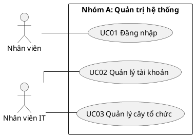
_Hình D.2. Nhóm A - Quản trị hệ thống (UC01, UC02, UC03)._

### A.B. Nhóm B - Tuyển dụng

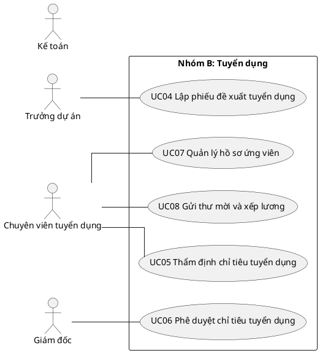
_Hình D.3. Nhóm B - Tuyển dụng (UC04, UC05, UC06, UC07, UC08)._

### A.C. Nhóm C - Hồ sơ - Thử việc

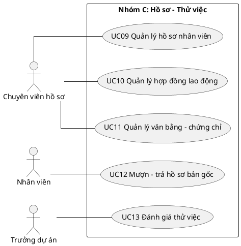
_Hình D.4. Nhóm C - Hồ sơ - Thử việc (UC09, UC10, UC11, UC12, UC13)._

### A.D. Nhóm D - Biến động nhân sự

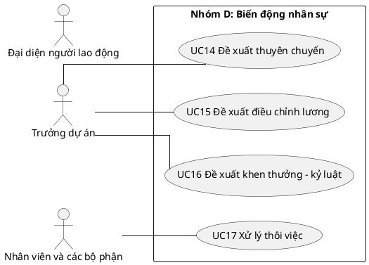
_Hình D.5. Nhóm D - Biến động nhân sự (UC14, UC15, UC16, UC17)._

### A.E. Nhóm E - Chấm công - Nghỉ phép

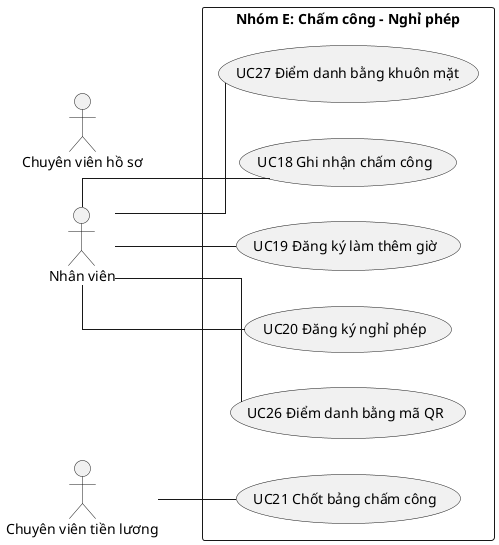
_Hình D.6. Nhóm E - Chấm công - Nghỉ phép (UC18, UC19, UC20, UC21, UC26, UC27)._

### A.F. Nhóm F - Lương - Báo cáo

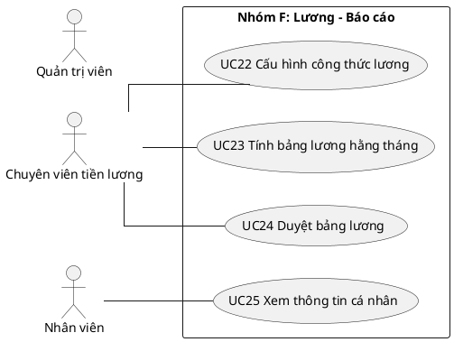
_Hình D.7. Nhóm F - Lương - Báo cáo (UC22, UC23, UC24, UC25)._

### A.G. Nhóm G - Cổng tự phục vụ - Ca kíp

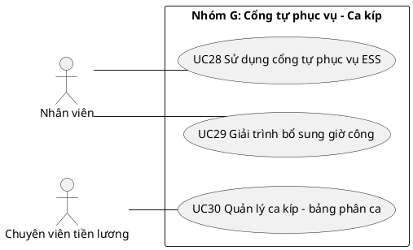
_Hình D.8. Nhóm G - Cổng tự phục vụ - Ca kíp (UC28, UC29, UC30)._

### A.H. Nhóm H - Tiền lương - Phúc lợi mở rộng

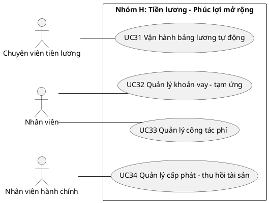
_Hình D.9. Nhóm H - Tiền lương - Phúc lợi mở rộng (UC31, UC32, UC33, UC34)._

### A.I. Nhóm I - Tuyển dụng - Phát triển nâng cao

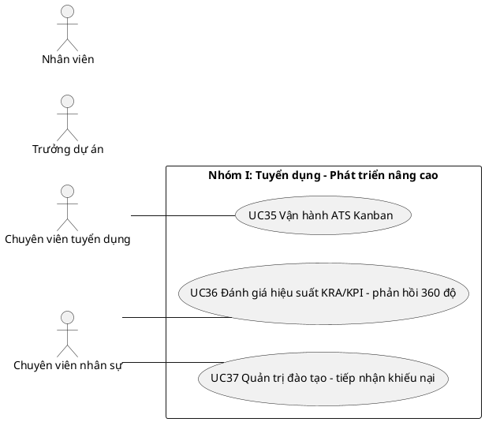
_Hình D.10. Nhóm I - Tuyển dụng - Phát triển nâng cao (UC35, UC36, UC37)._

### A.J. Nhóm J - Chuẩn cán bộ công chức (BNV)

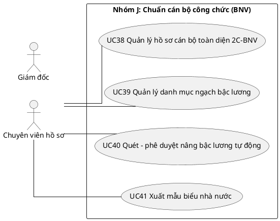
_Hình D.11. Nhóm J - Chuẩn cán bộ công chức (BNV) (UC38, UC39, UC40, UC41)._

### A.K. Nhóm K - Tri thức nội bộ

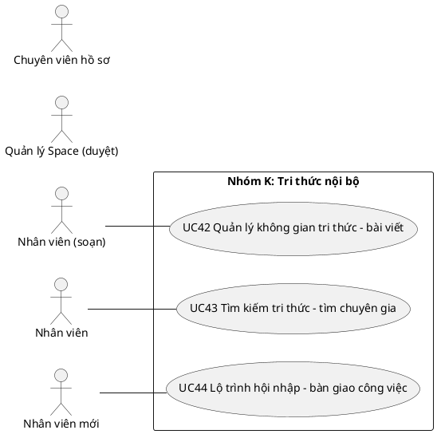
_Hình D.12. Nhóm K - Tri thức nội bộ (UC42, UC43, UC44)._

### A.L. Nhóm L - Điều hành - Quản trị

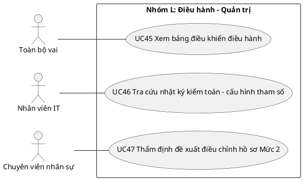
_Hình D.13. Nhóm L - Điều hành - Quản trị (UC45, UC46, UC47)._


## B. BIỂU ĐỒ TRÌNH TỰ THEO TỪNG USE CASE

### B.UC01. Đăng nhập

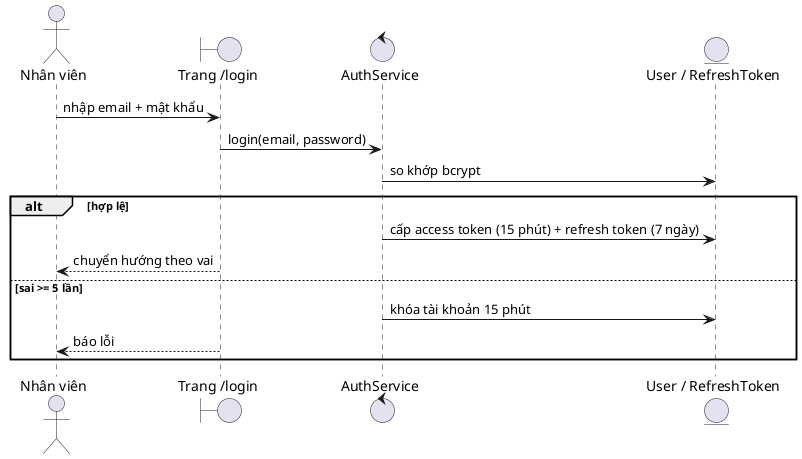
_Hình D.14. Trình tự UC01 - Đăng nhập._

### B.UC02. Quản lý tài khoản

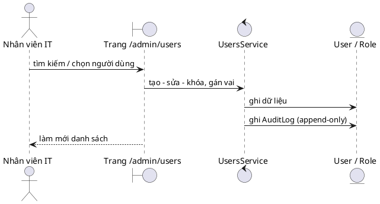
_Hình D.15. Trình tự UC02 - Quản lý tài khoản._

### B.UC03. Quản lý cây tổ chức

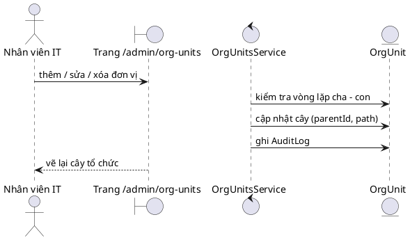
_Hình D.16. Trình tự UC03 - Quản lý cây tổ chức._

### B.UC04. Lập phiếu đề xuất tuyển dụng

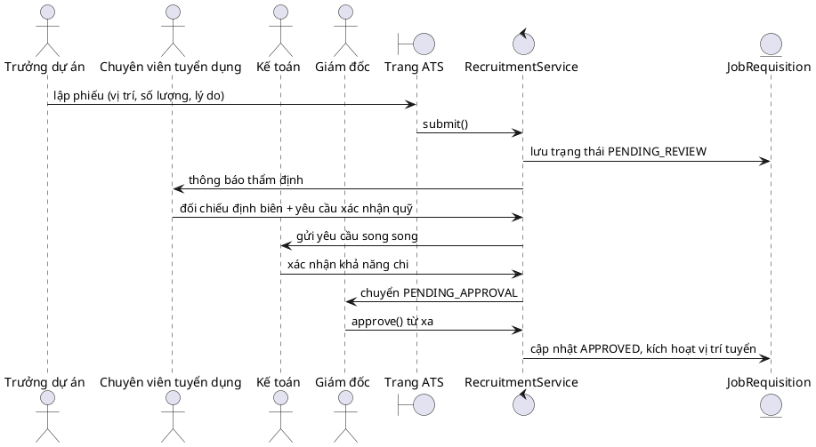
_Hình D.17. Trình tự UC04 - Lập phiếu đề xuất tuyển dụng._

### B.UC05. Thẩm định chỉ tiêu tuyển dụng

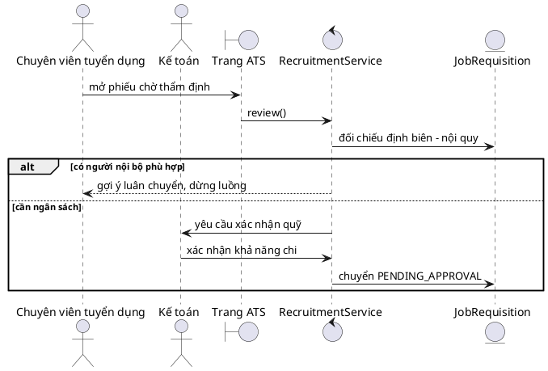
_Hình D.18. Trình tự UC05 - Thẩm định chỉ tiêu tuyển dụng._

### B.UC06. Phê duyệt chỉ tiêu tuyển dụng

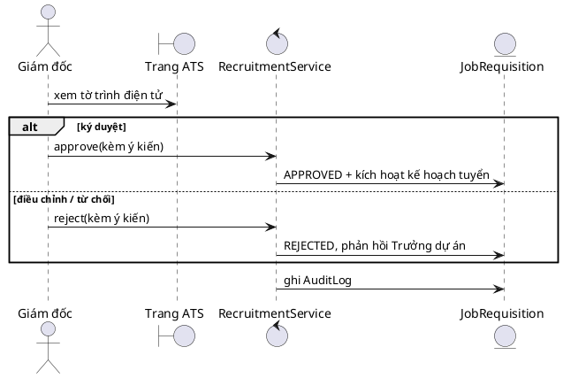
_Hình D.19. Trình tự UC06 - Phê duyệt chỉ tiêu tuyển dụng._

### B.UC07. Quản lý hồ sơ ứng viên

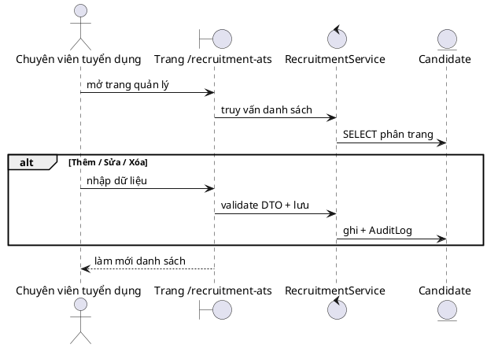
_Hình D.20. Trình tự UC07 - Quản lý hồ sơ ứng viên._

### B.UC08. Gửi thư mời và xếp lương

```plantuml
@startuml
skinparam linetype ortho
skinparam shadowing false
actor "Chuyên viên tuyển dụng" as HR
actor "Ứng viên" as UV
boundary "Trang ATS" as B
control "RecruitmentService" as C
entity "HrmsJobOffer" as E
HR -> B : soạn thư mời (chức danh, lương, ngày nhận việc)
B -> C : createOffer()
C -> E : đối chiếu thang bảng lương
alt vượt khung
  C -> C : trình Giám đốc duyệt riêng
end
UV -> C : chấp nhận thư mời
C -> E : OFFER_ACCEPTED, chuyển sang hội nhập
@enduml
```
_Hình D.21. Trình tự UC08 - Gửi thư mời và xếp lương._

### B.UC09. Quản lý hồ sơ nhân viên

```plantuml
@startuml
skinparam linetype ortho
skinparam shadowing false
actor "Chuyên viên hồ sơ" as A
boundary "Trang /employees" as B
control "EmployeesService" as C
entity "User" as E
A -> B : mở trang quản lý
B -> C : truy vấn danh sách
C -> E : SELECT phân trang
alt Thêm / Sửa / Xóa
A -> B : nhập dữ liệu
B -> C : validate DTO + lưu
C -> E : ghi + AuditLog
end
B --> A : làm mới danh sách
@enduml
```
_Hình D.22. Trình tự UC09 - Quản lý hồ sơ nhân viên._

### B.UC10. Quản lý hợp đồng lao động

```plantuml
@startuml
skinparam linetype ortho
skinparam shadowing false
actor "Chuyên viên hồ sơ" as A
boundary "Trang /employees/:id" as B
control "EmployeesService" as C
entity "Contract" as E
A -> B : mở trang quản lý
B -> C : truy vấn danh sách
C -> E : SELECT phân trang
alt Thêm / Sửa / Xóa
A -> B : nhập dữ liệu
B -> C : validate DTO + lưu
C -> E : ghi + AuditLog
end
B --> A : làm mới danh sách
@enduml
```
_Hình D.23. Trình tự UC10 - Quản lý hợp đồng lao động._

### B.UC11. Quản lý văn bằng - chứng chỉ

```plantuml
@startuml
skinparam linetype ortho
skinparam shadowing false
actor "Chuyên viên hồ sơ" as A
boundary "Trang /employees/:id" as B
control "EmployeesService" as C
entity "Certificate" as E
A -> B : mở trang quản lý
B -> C : truy vấn danh sách
C -> E : SELECT phân trang
alt Thêm / Sửa / Xóa
A -> B : nhập dữ liệu
B -> C : validate DTO + lưu
C -> E : ghi + AuditLog
end
B --> A : làm mới danh sách
@enduml
```
_Hình D.24. Trình tự UC11 - Quản lý văn bằng - chứng chỉ._

### B.UC12. Mượn - trả hồ sơ bản gốc

```plantuml
@startuml
skinparam linetype ortho
skinparam shadowing false
actor "Nhân viên" as A
boundary "Trang /employees/:id" as B
control "EmployeesService" as C
entity "PhieuMuonTra (thiết kế)" as E
A -> B : nhập đề xuất
B -> C : submit()
C -> E : lưu PENDING + thông báo duyệt
alt duyệt
C -> E : APPROVED + phát sinh hiệu lực
else từ chối
C -> E : REJECTED kèm lý do
end
C -> E : ghi AuditLog
@enduml
```
_Hình D.25. Trình tự UC12 - Mượn - trả hồ sơ bản gốc._

### B.UC13. Đánh giá thử việc

```plantuml
@startuml
skinparam linetype ortho
skinparam shadowing false
actor "Trưởng dự án" as PM
boundary "Trang /lifecycle" as B
control "HrmsLifecycleService" as C
entity "Contract / HrmsLifecycleEvent" as E
PM -> B : điền phiếu đánh giá thử việc
B -> C : submitEvaluation()
alt đạt
  C -> E : sinh nhiệm vụ ký HĐ chính thức + xếp lương (>= 85%)
  C -> E : PROBATION -> ACTIVE
else không đạt
  C -> E : sinh nhiệm vụ chấm dứt hợp đồng thử việc
end
@enduml
```
_Hình D.26. Trình tự UC13 - Đánh giá thử việc._

### B.UC14. Đề xuất thuyên chuyển

```plantuml
@startuml
skinparam linetype ortho
skinparam shadowing false
actor "Trưởng dự án" as A
boundary "Trang /personnel" as B
control "PersonnelActionsService" as C
entity "PersonnelAction" as E
A -> B : nhập đề xuất
B -> C : submit()
C -> E : lưu PENDING + thông báo duyệt
alt duyệt
C -> E : APPROVED + phát sinh hiệu lực
else từ chối
C -> E : REJECTED kèm lý do
end
C -> E : ghi AuditLog
@enduml
```
_Hình D.27. Trình tự UC14 - Đề xuất thuyên chuyển._

### B.UC15. Đề xuất điều chỉnh lương

```plantuml
@startuml
skinparam linetype ortho
skinparam shadowing false
actor "Trưởng dự án" as A
boundary "Trang /personnel" as B
control "PersonnelActionsService" as C
entity "PersonnelAction" as E
A -> B : nhập đề xuất
B -> C : submit()
C -> E : lưu PENDING + thông báo duyệt
alt duyệt
C -> E : APPROVED + phát sinh hiệu lực
else từ chối
C -> E : REJECTED kèm lý do
end
C -> E : ghi AuditLog
@enduml
```
_Hình D.28. Trình tự UC15 - Đề xuất điều chỉnh lương._

### B.UC16. Đề xuất khen thưởng - kỷ luật

```plantuml
@startuml
skinparam linetype ortho
skinparam shadowing false
actor "Trưởng dự án" as A
boundary "Trang /personnel" as B
control "PersonnelActionsService" as C
entity "PersonnelAction" as E
A -> B : nhập đề xuất
B -> C : submit()
C -> E : lưu PENDING + thông báo duyệt
alt duyệt
C -> E : APPROVED + phát sinh hiệu lực
else từ chối
C -> E : REJECTED kèm lý do
end
C -> E : ghi AuditLog
@enduml
```
_Hình D.29. Trình tự UC16 - Đề xuất khen thưởng - kỷ luật._

### B.UC17. Xử lý thôi việc

```plantuml
@startuml
skinparam linetype ortho
skinparam shadowing false
actor "Nhân viên" as NV
actor "Các bộ phận xác nhận" as BP
actor "Quản trị viên" as AD
boundary "Trang /personnel" as B
control "PersonnelActionsService" as C
entity "HandoverChecklist" as E
NV -> B : nộp đơn thôi việc
AD -> C : duyệt đơn
C -> E : tự sinh checklist 5 mục xác nhận
BP -> C : lần lượt xác nhận (1/5 -> 5/5)
alt đủ 5/5
  C -> E : bật phát hành quyết định chấm dứt hợp đồng
  C -> E : hồ sơ chuyển Lưu trữ - đã nghỉ
else thiếu
  C --> BP : nhắc mục còn thiếu
end
@enduml
```
_Hình D.30. Trình tự UC17 - Xử lý thôi việc._

### B.UC18. Ghi nhận chấm công

```plantuml
@startuml
skinparam linetype ortho
skinparam shadowing false
actor "Nhân viên" as NV
actor "Máy chấm công" as MC
boundary "Trang /attendance" as B
control "AttendanceService" as C
entity "AttendanceEvent / AttendanceDay" as E
NV -> B : điểm danh web
MC -> C : webhook HMAC / import CSV
C -> E : INSERT sự kiện thô (append-only)
C -> E : tổng hợp bảng công ngày (vào/ra, muộn/sớm)
C --> B : hiển thị bảng công, đánh dấu bản ghi lệch
@enduml
```
_Hình D.31. Trình tự UC18 - Ghi nhận chấm công._

### B.UC19. Đăng ký làm thêm giờ

```plantuml
@startuml
skinparam linetype ortho
skinparam shadowing false
actor "Nhân viên" as A
boundary "Trang /overtime" as B
control "OvertimeService" as C
entity "OvertimeRequest" as E
A -> B : nhập đề xuất
B -> C : submit()
C -> E : lưu PENDING + thông báo duyệt
alt duyệt
C -> E : APPROVED + phát sinh hiệu lực
else từ chối
C -> E : REJECTED kèm lý do
end
C -> E : ghi AuditLog
@enduml
```
_Hình D.32. Trình tự UC19 - Đăng ký làm thêm giờ._

### B.UC20. Đăng ký nghỉ phép

```plantuml
@startuml
skinparam linetype ortho
skinparam shadowing false
actor "Nhân viên" as NV
actor "Chuyên viên nhân sự" as HR
boundary "Trang /leave" as B
control "LeaveService" as C
entity "LeaveRequest / LeaveBalance" as E
NV -> B : tạo đơn (loại, từ ngày, đến ngày)
B -> C : checkBalance()
alt quỹ đủ
  C -> E : lưu PENDING, thông báo HR
  HR -> C : approve()
  C -> E : trừ quỹ NGAY + ghi công phép vào bảng công
else quỹ không đủ
  C --> NV : từ chối kèm số dư còn lại
end
@enduml
```
_Hình D.33. Trình tự UC20 - Đăng ký nghỉ phép._

### B.UC21. Chốt bảng chấm công

```plantuml
@startuml
skinparam linetype ortho
skinparam shadowing false
actor "Chuyên viên tiền lương" as CV
actor "Trưởng dự án" as PM
boundary "Trang /attendance" as B
control "AttendanceService" as C
entity "AttendanceDay" as E
CV -> B : hợp nhất bảng công tháng
C -> E : tổng hợp sự kiện, xử lý bản ghi lệch
PM -> B : xác nhận bảng công nhóm
CV -> B : chốt ngày 25, khóa bảng công
C -> E : khóa dữ liệu công chuyển sang tính lương
@enduml
```
_Hình D.34. Trình tự UC21 - Chốt bảng chấm công._

### B.UC26. Điểm danh bằng mã QR

```plantuml
@startuml
skinparam linetype ortho
skinparam shadowing false
actor "Nhân viên" as NV
boundary "Kiosk /check-in" as B
control "QrTokenService" as C
control "AttendanceService" as S
entity "AttendanceEvent" as E
B -> C : lấy token HMAC {kiosk_id, iat, jti} TTL 30 giây
NV -> B : quét mã, xác nhận
B -> S : checkIn(qr_token)
S -> C : verify chữ ký + TTL <= 60 giây + jti một lần
alt hợp lệ và không trùng ±2 phút
  S -> E : INSERT sự kiện (nguồn QR)
  S -> E : tổng hợp bảng công ngày
  B --> NV : phản hồi chấm công thành công
else vi phạm
  S --> B : từ chối, đánh dấu lệch nếu thiếu giờ ra
end
@enduml
```
_Hình D.35. Trình tự UC26 - Điểm danh bằng mã QR._

### B.UC27. Điểm danh bằng khuôn mặt

```plantuml
@startuml
skinparam linetype ortho
skinparam shadowing false
actor "Nhân viên" as NV
boundary "Trang /attendance" as B
control "FaceCryptoService" as F
control "AttendanceService" as S
entity "FaceEmbedding / AttendanceEvent" as E
NV -> B : đăng ký mẫu (tick đồng thuận)
B -> F : trích vector, mã hóa AES-256-GCM
F -> E : lưu FaceEmbedding (không lưu ảnh gốc)
NV -> B : điểm danh khuôn mặt
B -> F : so khớp cosine similarity
alt vượt ngưỡng
  F -> S : ghi sự kiện (nguồn = khuôn mặt)
else không khớp
  S --> NV : từ chối rõ ràng, giới hạn số lần thử
end
@enduml
```
_Hình D.36. Trình tự UC27 - Điểm danh bằng khuôn mặt._

### B.UC22. Cấu hình công thức lương

```plantuml
@startuml
skinparam linetype ortho
skinparam shadowing false
actor "Chuyên viên tiền lương" as A
boundary "Trang /payroll-engine" as B
control "HrmsPayrollService" as C
entity "HrmsSalaryComponent, HrmsSalaryStructure" as E
A -> B : mở trang quản lý
B -> C : truy vấn danh sách
C -> E : SELECT phân trang
alt Thêm / Sửa / Xóa
A -> B : nhập dữ liệu
B -> C : validate DTO + lưu
C -> E : ghi + AuditLog
end
B --> A : làm mới danh sách
@enduml
```
_Hình D.37. Trình tự UC22 - Cấu hình công thức lương._

### B.UC23. Tính bảng lương hằng tháng

```plantuml
@startuml
skinparam linetype ortho
skinparam shadowing false
actor "Chuyên viên tiền lương" as CV
boundary "Trang /payroll" as B
control "PayrollService" as C
entity "Payslip / PayrollPeriod" as E
CV -> B : bấm tính lương kỳ đã chốt công
C -> E : nạp lương hợp đồng ACTIVE + OT đã duyệt
C -> E : trừ BHXH 10,5% + thuế TNCN 7 bậc - EMI vay
C -> E : sinh Payslip từng nhân viên
CV -> B : đối chiếu
alt khớp
  CV -> C : trình duyệt
else lệch
  C -> E : ghi chú, tính lại (giữ vết audit)
end
@enduml
```
_Hình D.38. Trình tự UC23 - Tính bảng lương hằng tháng._

### B.UC24. Duyệt bảng lương

```plantuml
@startuml
skinparam linetype ortho
skinparam shadowing false
actor "Chuyên viên tiền lương" as CV
actor "Quản trị viên" as AD
boundary "Trang /payroll" as B
control "PayrollService" as C
entity "PayrollPeriod" as E
CV -> B : trình kết quả REVIEWED
AD -> B : duyệt và khóa kỳ
C -> E : OPEN -> CALCULATED -> REVIEWED -> LOCKED
alt gọi tính lại sau khóa
  C --> B : chặn lỗi HTTP 409
end
C -> E : xuất bảng kê chi lương ngân hàng
@enduml
```
_Hình D.39. Trình tự UC24 - Duyệt bảng lương._

### B.UC25. Xem thông tin cá nhân

```plantuml
@startuml
skinparam linetype ortho
skinparam shadowing false
actor "Nhân viên" as A
boundary "Trang undefined" as B
control "DashboardService, LeaveService" as C
entity "LeaveBalance, Payslip" as E
A -> B : thao tác
B -> C : gọi service
C -> E : đọc/ghi dữ liệu
C -> E : ghi AuditLog
B --> A : kết quả
@enduml
```
_Hình D.40. Trình tự UC25 - Xem thông tin cá nhân._

### B.UC28. Sử dụng cổng tự phục vụ ESS

```plantuml
@startuml
skinparam linetype ortho
skinparam shadowing false
actor "Nhân viên" as A
boundary "Trang undefined" as B
control "DashboardService" as C
entity "LeaveBalance, Payslip, HrmsAssetAllocation" as E
A -> B : thao tác
B -> C : gọi service
C -> E : đọc/ghi dữ liệu
C -> E : ghi AuditLog
B --> A : kết quả
@enduml
```
_Hình D.41. Trình tự UC28 - Sử dụng cổng tự phục vụ ESS._

### B.UC29. Giải trình bổ sung giờ công

```plantuml
@startuml
skinparam linetype ortho
skinparam shadowing false
actor "Nhân viên" as NV
actor "Quản lý" as QL
boundary "Trang /ess" as B
control "HrmsRegularizationService" as C
entity "HrmsAttendanceRegularization" as E
NV -> B : chọn ngày thiếu công, nhập giờ mong muốn + lý do
B -> C : submit()
C -> E : lưu PENDING, thông báo quản lý
QL -> C : duyệt / từ chối
alt duyệt
  C -> E : bù công vào bảng chấm công
else từ chối
  C -> E : lưu lý do
end
@enduml
```
_Hình D.42. Trình tự UC29 - Giải trình bổ sung giờ công._

### B.UC30. Quản lý ca kíp - bảng phân ca

```plantuml
@startuml
skinparam linetype ortho
skinparam shadowing false
actor "Chuyên viên tiền lương" as A
boundary "Trang /shifts" as B
control "HrmsShiftsService" as C
entity "HrmsShiftType, HrmsShiftAssignment" as E
A -> B : mở trang quản lý
B -> C : truy vấn danh sách
C -> E : SELECT phân trang
alt Thêm / Sửa / Xóa
A -> B : nhập dữ liệu
B -> C : validate DTO + lưu
C -> E : ghi + AuditLog
end
B --> A : làm mới danh sách
@enduml
```
_Hình D.43. Trình tự UC30 - Quản lý ca kíp - bảng phân ca._

### B.UC31. Vận hành bảng lương tự động

```plantuml
@startuml
skinparam linetype ortho
skinparam shadowing false
actor "Chuyên viên tiền lương" as CV
boundary "Trang /payroll-engine" as B
control "HrmsPayrollService" as C
entity "HrmsPayrollRun / HrmsPayrollSlip" as E
CV -> B : định nghĩa thành phần + cấu trúc lương, gán nhân viên
CV -> B : chạy kỳ 1-click
C -> E : tính gross theo cấu trúc + OT (150/200/300%)
C -> E : khấu trừ luật định + EMI vay
C -> E : sinh slip kèm breakdown từng khoản
CV -> B : xuất bảng kê chi lương ngân hàng
@enduml
```
_Hình D.44. Trình tự UC31 - Vận hành bảng lương tự động._

### B.UC32. Quản lý khoản vay - tạm ứng

```plantuml
@startuml
skinparam linetype ortho
skinparam shadowing false
actor "Nhân viên" as NV
actor "Chuyên viên nhân sự" as HR
boundary "Trang /loans" as B
control "HrmsLoansService" as C
entity "HrmsEmployeeLoan" as E
NV -> B : tạo đơn vay / tạm ứng (kỳ hạn 1-24 tháng)
C -> E : tính EMI hàng tháng
alt EMI <= 30% thực lĩnh
  C -> E : chuyển CHỜ THẨM ĐỊNH
  HR -> C : duyệt giải ngân
  C -> E : APPROVED, EMI nạp bảng lương đến hết nợ
else vượt trần
  C --> NV : chặn kèm thông báo
end
@enduml
```
_Hình D.45. Trình tự UC32 - Quản lý khoản vay - tạm ứng._

### B.UC33. Quản lý công tác phí

```plantuml
@startuml
skinparam linetype ortho
skinparam shadowing false
actor "Nhân viên" as NV
actor "Chuyên viên nhân sự" as HR
boundary "Trang /expense-claims" as B
control "HrmsExpensesService" as C
entity "HrmsTravelRequest / HrmsExpenseClaim" as E
NV -> B : đề xuất chuyến công tác
HR -> C : duyệt lịch trình
C -> E : tạm ứng kinh phí
NV -> B : lập bảng kê chi phí + chứng từ
HR -> C : duyệt quyết toán
C -> E : chuyển số liệu xuống kỳ lương / kế toán
@enduml
```
_Hình D.46. Trình tự UC33 - Quản lý công tác phí._

### B.UC34. Quản lý cấp phát - thu hồi tài sản

```plantuml
@startuml
skinparam linetype ortho
skinparam shadowing false
actor "Nhân viên hành chính" as HC
boundary "Trang /assets" as B
control "HrmsAssetsService" as C
entity "HrmsAssetAllocation" as E
HC -> B : đăng ký tài sản mới
HC -> B : cấp phát cho nhân viên
C -> E : lập biên bản bàn giao, trạng thái ALLOCATED
HC -> B : thu hồi khi chuyển / thôi việc
C -> E : trả về IN_STOCK (hoặc DECOMMISSIONED)
@enduml
```
_Hình D.47. Trình tự UC34 - Quản lý cấp phát - thu hồi tài sản._

### B.UC35. Vận hành ATS Kanban

```plantuml
@startuml
skinparam linetype ortho
skinparam shadowing false
actor "Chuyên viên tuyển dụng" as HR
boundary "Trang /recruitment-ats" as B
control "HrmsRecruitmentService" as C
entity "HrmsJobApplicant" as E
HR -> B : kéo-thả ứng viên qua pipeline
C -> E : cập nhật stage (Sàng lọc -> PV1 -> PV2 -> Offer)
HR -> B : bấm chuyển thành nhân viên
C -> E : sinh hồ sơ nhân viên + hợp đồng thử việc
C -> E : kích hoạt onboarding
@enduml
```
_Hình D.48. Trình tự UC35 - Vận hành ATS Kanban._

### B.UC36. Đánh giá hiệu suất KRA/KPI - phản hồi 360 độ

```plantuml
@startuml
skinparam linetype ortho
skinparam shadowing false
actor "Chuyên viên nhân sự" as HR
actor "Nhân viên" as NV
actor "Quản lý" as QL
boundary "Trang /performance-360" as B
control "HrmsPerformanceService" as C
entity "HrmsAppraisalGoal / HrmsAppraisalReview" as E
HR -> B : tạo kỳ đánh giá, gán KRA/KPI theo trọng số %
NV -> C : tự đánh giá
QL -> C : chấm điểm + phản hồi 360 độ
NV -> C : xác nhận kết quả
C -> E : lưu kết quả làm căn cứ tăng lương
@enduml
```
_Hình D.49. Trình tự UC36 - Đánh giá hiệu suất KRA/KPI - phản hồi 360 độ._

### B.UC37. Quản trị đào tạo - tiếp nhận khiếu nại

```plantuml
@startuml
skinparam linetype ortho
skinparam shadowing false
actor "Chuyên viên nhân sự" as HR
actor "Nhân viên" as NV
boundary "Trang /training-grievance" as B
control "HrmsTrainingService" as C
entity "HrmsTrainingProgram / HrmsGrievance" as E
HR -> B : lập chương trình đào tạo
NV -> C : ghi danh (chặn khi hết chỗ)
NV -> C : hoàn thành + khảo sát hài lòng
NV -> B : gửi khiếu nại / kiến nghị
HR -> C : xử lý đến RESOLVED
@enduml
```
_Hình D.50. Trình tự UC37 - Quản trị đào tạo - tiếp nhận khiếu nại._

### B.UC38. Quản lý hồ sơ cán bộ toàn diện 2C-BNV

```plantuml
@startuml
skinparam linetype ortho
skinparam shadowing false
actor "Chuyên viên hồ sơ" as A
boundary "Trang /personnel-profiles" as B
control "PersonnelProfilesService" as C
entity "PersonnelComprehensiveProfile + 8 bảng quá trình" as E
A -> B : mở trang quản lý
B -> C : truy vấn danh sách
C -> E : SELECT phân trang
alt Thêm / Sửa / Xóa
A -> B : nhập dữ liệu
B -> C : validate DTO + lưu
C -> E : ghi + AuditLog
end
B --> A : làm mới danh sách
@enduml
```
_Hình D.51. Trình tự UC38 - Quản lý hồ sơ cán bộ toàn diện 2C-BNV._

### B.UC39. Quản lý danh mục ngạch bậc lương

```plantuml
@startuml
skinparam linetype ortho
skinparam shadowing false
actor "Chuyên viên hồ sơ" as A
boundary "Trang /salary-ranks" as B
control "PersonnelRanksService" as C
entity "PersonnelRank" as E
A -> B : mở trang quản lý
B -> C : truy vấn danh sách
C -> E : SELECT phân trang
alt Thêm / Sửa / Xóa
A -> B : nhập dữ liệu
B -> C : validate DTO + lưu
C -> E : ghi + AuditLog
end
B --> A : làm mới danh sách
@enduml
```
_Hình D.52. Trình tự UC39 - Quản lý danh mục ngạch bậc lương._

### B.UC40. Quét - phê duyệt nâng bậc lương tự động

```plantuml
@startuml
skinparam linetype ortho
skinparam shadowing false
actor "Chuyên viên hồ sơ" as HR
actor "Giám đốc" as GD
boundary "Trang /salary-progression" as B
control "PersonnelReportsService" as C
entity "PersonnelSalaryHistory" as E
HR -> B : bấm quét nâng bậc
C -> E : đối chiếu ngày hưởng bậc với chu kỳ 36/24 tháng
C -> E : sinh danh sách đề nghị (bậc trần cộng vượt khung 5% + 1%/năm)
GD -> C : phê duyệt
C -> E : cập nhật ngạch/bậc/hệ số + ghi diễn biến lương
@enduml
```
_Hình D.53. Trình tự UC40 - Quét - phê duyệt nâng bậc lương tự động._

### B.UC41. Xuất mẫu biểu nhà nước

```plantuml
@startuml
skinparam linetype ortho
skinparam shadowing false
actor "Chuyên viên hồ sơ" as HR
boundary "Trang /personnel-reports" as B
control "PersonnelReportsService" as C
entity "PersonnelComprehensiveProfile" as E
HR -> B : chọn nhân viên, xuất 2C PDF
C -> E : tổng hợp 111 thuộc tính + 8 bảng quá trình
C --> HR : Sơ yếu lý lịch Mẫu 2C-BNV/2008 (4 trang)
HR -> B : chọn Biểu thống kê
C --> HR : Biểu 01 / 02 / 03 dạng Excel
@enduml
```
_Hình D.54. Trình tự UC41 - Xuất mẫu biểu nhà nước._

### B.UC42. Quản lý không gian tri thức - bài viết

```plantuml
@startuml
skinparam linetype ortho
skinparam shadowing false
actor "Tác giả" as TG
actor "Quản lý Space" as QL
boundary "Trang /spaces, /review" as B
control "ArticlesService" as C
entity "Article / ArticleVersion / ArticleReview" as E
TG -> B : soạn bài (Markdown + đính kèm)
C -> E : lưu DRAFT
TG -> C : submit()
C -> E : PENDING_REVIEW + thông báo quản lý
alt duyệt
  QL -> C : approve()
  C -> E : PUBLISHED
else yêu cầu chỉnh sửa
  QL -> C : request_changes(kèm ý kiến)
  C -> E : về DRAFT
end
TG -> C : sửa bài
C -> E : sinh phiên bản mới (bất biến), rollback được
@enduml
```
_Hình D.55. Trình tự UC42 - Quản lý không gian tri thức - bài viết._

### B.UC43. Tìm kiếm tri thức - tìm chuyên gia

```plantuml
@startuml
skinparam linetype ortho
skinparam shadowing false
actor "Nhân viên" as NV
boundary "Trang /search, /people" as B
control "SearchService" as C
entity "Article (FTS + pg_trgm)" as E
NV -> B : nhập từ khóa
B -> C : search(q)
C -> E : truy vấn FTS lọc phạm vi quyền ngay trong SQL
C --> NV : kết quả kèm highlight
NV -> B : tìm chuyên gia theo lĩnh vực
B -> C : directory chuyên môn
C --> NV : danh sách chuyên gia + bài viết theo tác giả
@enduml
```
_Hình D.56. Trình tự UC43 - Tìm kiếm tri thức - tìm chuyên gia._

### B.UC44. Lộ trình hội nhập - bàn giao công việc

```plantuml
@startuml
skinparam linetype ortho
skinparam shadowing false
actor "Nhân viên mới" as NV
actor "Chuyên viên hồ sơ" as HR
boundary "Trang /onboarding, /handover" as B
control "OnboardingService" as C
entity "OnboardingPath / HandoverChecklist" as E
HR -> C : gán lộ trình đọc theo vị trí
NV -> B : tick tiến độ từng bài bắt buộc
alt thôi việc được duyệt
  HR -> C : kích hoạt checklist bàn giao 5 mục
  BP -> C : các bên xác nhận từng mục
  alt đủ 5/5
    C -> E : đóng checklist, hồ sơ chuyển lưu trữ
  else thiếu
    C --> HR : nhắc mục còn thiếu
  end
else đang làm việc
  C -> E : cập nhật tiến độ hội nhập
end
@enduml
```
_Hình D.57. Trình tự UC44 - Lộ trình hội nhập - bàn giao công việc._

### B.UC45. Xem bảng điều khiển điều hành

```plantuml
@startuml
skinparam linetype ortho
skinparam shadowing false
actor "Toàn bộ vai" as A
boundary "Trang undefined" as B
control "DashboardService" as C
entity "User, PayrollRun, PersonnelAction" as E
A -> B : thao tác
B -> C : gọi service
C -> E : đọc/ghi dữ liệu
C -> E : ghi AuditLog
B --> A : kết quả
@enduml
```
_Hình D.58. Trình tự UC45 - Xem bảng điều khiển điều hành._

### B.UC46. Tra cứu nhật ký kiểm toán - cấu hình tham số

```plantuml
@startuml
skinparam linetype ortho
skinparam shadowing false
actor "Nhân viên IT" as IT
boundary "Trang /admin/audit, /admin/settings" as B
control "AuditService / SettingsService" as C
entity "AuditLog / Setting" as E
IT -> B : tra cứu audit log
C -> E : đọc append-only (ai, làm gì, trước/sau)
IT -> B : chỉnh tham số key-value
C -> E : lưu Setting (không cần triển khai lại)
C -> E : ghi AuditLog thay đổi
@enduml
```
_Hình D.59. Trình tự UC46 - Tra cứu nhật ký kiểm toán - cấu hình tham số._

### B.UC47. Thẩm định đề xuất điều chỉnh hồ sơ Mức 2

```plantuml
@startuml
skinparam linetype ortho
skinparam shadowing false
actor "Chuyên viên nhân sự (HR-OPS)" as HR
boundary "Trang /profile (ReviewQueue)" as B
control "ProfileChangeRequestsService" as C
entity "ProfileChangeRequest / User / AuditLog" as E
HR -> B : mở hàng đợi thẩm định
B -> C : lấy danh sách chờ duyệt (listPending)
C -> E : truy vấn ProfileChangeRequest (PENDING)
E --> B : danh sách đề xuất kèm minh chứng
HR -> B : đối chiếu thông tin cũ/mới & xem tệp minh chứng
HR -> B : bấm Chấp thuận (hoặc Từ chối kèm lý do)
B -> C : approveRequest() / rejectRequest()
C -> E : atomic transaction: cập nhật User/ComprehensiveProfile
C -> E : đổi trạng thái APPROVED / REJECTED
C -> E : ghi AuditLog truy vết bất biến
C --> B : kết quả thẩm định thành công
@enduml
```
_Hình D.59b. Trình tự UC47 - Thẩm định đề xuất điều chỉnh hồ sơ Mức 2._


## C. BIỂU ĐỒ HOẠT ĐỘNG THEO TỪNG USE CASE

### C.UC01. Đăng nhập

```plantuml
@startuml
skinparam linetype ortho
skinparam shadowing false
start
:Nhập email + mật khẩu;
:So khớp bcrypt;
if (Hợp lệ?) then (có)
:Cấp access + refresh token;
:Vào giao diện theo vai;
else (không)
:Báo lỗi;
if (Sai >= 5 lần?) then (có)
:Khóa tài khoản 15 phút;
endif
endif
stop
@enduml
```
_Hình D.60. Hoạt động UC01 - Đăng nhập._

### C.UC02. Quản lý tài khoản

```plantuml
@startuml
skinparam linetype ortho
skinparam shadowing false
start
Mở trang quản lý
Tìm kiếm / lọc dữ liệu
alt Thêm / Sửa / Xóa
Nhập dữ liệu trên form
Hệ thống validate DTO
Lưu qua service + ghi AuditLog
Làm mới danh sách
end alt
stop
@enduml
```
_Hình D.61. Hoạt động UC02 - Quản lý tài khoản._

### C.UC03. Quản lý cây tổ chức

```plantuml
@startuml
skinparam linetype ortho
skinparam shadowing false
start
Mở trang quản lý
Tìm kiếm / lọc dữ liệu
alt Thêm / Sửa / Xóa
Nhập dữ liệu trên form
Hệ thống validate DTO
Lưu qua service + ghi AuditLog
Làm mới danh sách
end alt
stop
@enduml
```
_Hình D.62. Hoạt động UC03 - Quản lý cây tổ chức._

### C.UC04. Lập phiếu đề xuất tuyển dụng

```plantuml
@startuml
skinparam linetype ortho
skinparam shadowing false
start
:Trưởng dự án lập phiếu đề xuất;
:Lưu PENDING_REVIEW, báo chuyên viên;
:Thẩm định định biên + nội quy;
:Kế toán xác nhận quỹ (song song);
:Trình Giám đốc;
if (Ký duyệt?) then (có)
:APPROVED - kích hoạt vị trí tuyển;
else (không)
:REJECTED kèm ý kiến;
endif
stop
@enduml
```
_Hình D.63. Hoạt động UC04 - Lập phiếu đề xuất tuyển dụng._

### C.UC05. Thẩm định chỉ tiêu tuyển dụng

```plantuml
@startuml
skinparam linetype ortho
skinparam shadowing false
start
Mở trang
Truy vấn theo phạm vi quyền
Hiển thị dữ liệu
stop
@enduml
```
_Hình D.64. Hoạt động UC05 - Thẩm định chỉ tiêu tuyển dụng._

### C.UC06. Phê duyệt chỉ tiêu tuyển dụng

```plantuml
@startuml
skinparam linetype ortho
skinparam shadowing false
start
Mở trang
Truy vấn theo phạm vi quyền
Hiển thị dữ liệu
stop
@enduml
```
_Hình D.65. Hoạt động UC06 - Phê duyệt chỉ tiêu tuyển dụng._

### C.UC07. Quản lý hồ sơ ứng viên

```plantuml
@startuml
skinparam linetype ortho
skinparam shadowing false
start
Mở trang quản lý
Tìm kiếm / lọc dữ liệu
alt Thêm / Sửa / Xóa
Nhập dữ liệu trên form
Hệ thống validate DTO
Lưu qua service + ghi AuditLog
Làm mới danh sách
end alt
stop
@enduml
```
_Hình D.66. Hoạt động UC07 - Quản lý hồ sơ ứng viên._

### C.UC08. Gửi thư mời và xếp lương

```plantuml
@startuml
skinparam linetype ortho
skinparam shadowing false
start
:Soạn thư mời (chức danh, lương, ngày nhận việc);
if (Lương vượt khung?) then (có)
:Trình Giám đốc duyệt riêng;
else (không)
:Gửi ngay;
endif
:Ứng viên chấp nhận;
:Chuyển sang luồng hội nhập;
stop
@enduml
```
_Hình D.67. Hoạt động UC08 - Gửi thư mời và xếp lương._

### C.UC09. Quản lý hồ sơ nhân viên

```plantuml
@startuml
skinparam linetype ortho
skinparam shadowing false
start
Mở trang quản lý
Tìm kiếm / lọc dữ liệu
alt Thêm / Sửa / Xóa
Nhập dữ liệu trên form
Hệ thống validate DTO
Lưu qua service + ghi AuditLog
Làm mới danh sách
end alt
stop
@enduml
```
_Hình D.68. Hoạt động UC09 - Quản lý hồ sơ nhân viên._

### C.UC10. Quản lý hợp đồng lao động

```plantuml
@startuml
skinparam linetype ortho
skinparam shadowing false
start
Mở trang quản lý
Tìm kiếm / lọc dữ liệu
alt Thêm / Sửa / Xóa
Nhập dữ liệu trên form
Hệ thống validate DTO
Lưu qua service + ghi AuditLog
Làm mới danh sách
end alt
stop
@enduml
```
_Hình D.69. Hoạt động UC10 - Quản lý hợp đồng lao động._

### C.UC11. Quản lý văn bằng - chứng chỉ

```plantuml
@startuml
skinparam linetype ortho
skinparam shadowing false
start
Mở trang quản lý
Tìm kiếm / lọc dữ liệu
alt Thêm / Sửa / Xóa
Nhập dữ liệu trên form
Hệ thống validate DTO
Lưu qua service + ghi AuditLog
Làm mới danh sách
end alt
stop
@enduml
```
_Hình D.70. Hoạt động UC11 - Quản lý văn bằng - chứng chỉ._

### C.UC12. Mượn - trả hồ sơ bản gốc

```plantuml
@startuml
skinparam linetype ortho
skinparam shadowing false
start
Mở trang
Truy vấn theo phạm vi quyền
Hiển thị dữ liệu
stop
@enduml
```
_Hình D.71. Hoạt động UC12 - Mượn - trả hồ sơ bản gốc._

### C.UC13. Đánh giá thử việc

```plantuml
@startuml
skinparam linetype ortho
skinparam shadowing false
start
:Trưởng dự án điền phiếu đánh giá thử việc;
if (Đạt?) then (có)
:Sinh nhiệm vụ ký HĐ chính thức + xếp lương;
:PROBATION -> ACTIVE;
else (không)
:Sinh nhiệm vụ chấm dứt hợp đồng thử việc;
endif
stop
@enduml
```
_Hình D.72. Hoạt động UC13 - Đánh giá thử việc._

### C.UC14. Đề xuất thuyên chuyển

```plantuml
@startuml
skinparam linetype ortho
skinparam shadowing false
start
Mở trang
Truy vấn theo phạm vi quyền
Hiển thị dữ liệu
stop
@enduml
```
_Hình D.73. Hoạt động UC14 - Đề xuất thuyên chuyển._

### C.UC15. Đề xuất điều chỉnh lương

```plantuml
@startuml
skinparam linetype ortho
skinparam shadowing false
start
Mở trang
Truy vấn theo phạm vi quyền
Hiển thị dữ liệu
stop
@enduml
```
_Hình D.74. Hoạt động UC15 - Đề xuất điều chỉnh lương._

### C.UC16. Đề xuất khen thưởng - kỷ luật

```plantuml
@startuml
skinparam linetype ortho
skinparam shadowing false
start
Mở trang
Truy vấn theo phạm vi quyền
Hiển thị dữ liệu
stop
@enduml
```
_Hình D.75. Hoạt động UC16 - Đề xuất khen thưởng - kỷ luật._

### C.UC17. Xử lý thôi việc

```plantuml
@startuml
skinparam linetype ortho
skinparam shadowing false
start
:Nhân viên nộp đơn thôi việc;
:Quản trị viên duyệt;
:Tự sinh checklist 5 mục xác nhận;
repeat
:Bộ phận tiếp theo xác nhận;
repeat while (Chưa đủ 5/5?) is (thiếu)
:Bật phát hành quyết định chấm dứt hợp đồng;
:Hồ sơ chuyển Lưu trữ - đã nghỉ;
stop
@enduml
```
_Hình D.76. Hoạt động UC17 - Xử lý thôi việc._

### C.UC18. Ghi nhận chấm công

```plantuml
@startuml
skinparam linetype ortho
skinparam shadowing false
start
fork
:Điểm danh web;
fork again
:Quét QR tại kiosk;
fork again
:Điểm danh khuôn mặt;
fork again
:Máy chấm công đẩy webhook/CSV;
end fork
:INSERT sự kiện thô (bất biến);
:Tổng hợp bảng công ngày;
if (Thiếu vào/ra?) then (có)
:Đánh dấu lệch vào hàng đợi;
else (không)
:Công chuẩn;
endif
stop
@enduml
```
_Hình D.77. Hoạt động UC18 - Ghi nhận chấm công._

### C.UC19. Đăng ký làm thêm giờ

```plantuml
@startuml
skinparam linetype ortho
skinparam shadowing false
start
Mở trang
Truy vấn theo phạm vi quyền
Hiển thị dữ liệu
stop
@enduml
```
_Hình D.78. Hoạt động UC19 - Đăng ký làm thêm giờ._

### C.UC20. Đăng ký nghỉ phép

```plantuml
@startuml
skinparam linetype ortho
skinparam shadowing false
start
:Nhân viên tạo đơn nghỉ phép;
:Kiểm tra quỹ phép;
if (Quỹ đủ?) then (có)
:Lưu PENDING, báo chuyên viên;
if (Duyệt?) then (có)
:Trừ quỹ NGAY + ghi công phép;
else (không)
:Lưu lý do từ chối;
endif
else (không)
:Chặn đơn kèm số dư còn lại;
endif
stop
@enduml
```
_Hình D.79. Hoạt động UC20 - Đăng ký nghỉ phép._

### C.UC21. Chốt bảng chấm công

```plantuml
@startuml
skinparam linetype ortho
skinparam shadowing false
start
Mở trang
Truy vấn theo phạm vi quyền
Hiển thị dữ liệu
stop
@enduml
```
_Hình D.80. Hoạt động UC21 - Chốt bảng chấm công._

### C.UC26. Điểm danh bằng mã QR

```plantuml
@startuml
skinparam linetype ortho
skinparam shadowing false
start
:Kiosk xin token HMAC TTL 30 giây;
:Hiển thị mã QR, xoay mỗi 30 giây;
:Nhân viên quét bằng điện thoại;
if (Token hợp lệ + jti chưa dùng + ngoài ±2 phút?) then (có)
:INSERT sự kiện (nguồn QR);
:Tổng hợp bảng công ngày;
:Phản hồi chấm công thành công;
else (không)
:Từ chối;
endif
stop
@enduml
```
_Hình D.81. Hoạt động UC26 - Điểm danh bằng mã QR._

### C.UC27. Điểm danh bằng khuôn mặt

```plantuml
@startuml
skinparam linetype ortho
skinparam shadowing false
start
:Tick đồng thuận dữ liệu sinh trắc học;
:Trích vector từ 3-5 ảnh, mã hóa AES-256-GCM;
:Lưu FaceEmbedding;
:Điểm danh khuôn mặt thời gian thực;
if (Cosine similarity vượt ngưỡng?) then (có)
:Ghi sự kiện nguồn khuôn mặt;
else (không)
:Từ chối, giới hạn số lần thử;
endif
stop
@enduml
```
_Hình D.82. Hoạt động UC27 - Điểm danh bằng khuôn mặt._

### C.UC22. Cấu hình công thức lương

```plantuml
@startuml
skinparam linetype ortho
skinparam shadowing false
start
Mở trang quản lý
Tìm kiếm / lọc dữ liệu
alt Thêm / Sửa / Xóa
Nhập dữ liệu trên form
Hệ thống validate DTO
Lưu qua service + ghi AuditLog
Làm mới danh sách
end alt
stop
@enduml
```
_Hình D.83. Hoạt động UC22 - Cấu hình công thức lương._

### C.UC23. Tính bảng lương hằng tháng

```plantuml
@startuml
skinparam linetype ortho
skinparam shadowing false
start
:Chốt dữ liệu công + OT đã duyệt;
:Nạp lương hợp đồng ACTIVE;
:Tính gross theo cấu trúc lương;
:Trừ BHXH 10,5% + thuế TNCN 7 bậc - EMI;
:Sinh phiếu lương từng nhân viên;
:Đối chiếu;
if (Khớp?) then (có)
:ADMIN khóa kỳ LOCKED (chặn 409);
:Xuất bảng kê ngân hàng;
else (không)
:Ghi chú, tính lại giữ vết;
endif
stop
@enduml
```
_Hình D.84. Hoạt động UC23 - Tính bảng lương hằng tháng._

### C.UC24. Duyệt bảng lương

```plantuml
@startuml
skinparam linetype ortho
skinparam shadowing false
start
Mở trang
Truy vấn theo phạm vi quyền
Hiển thị dữ liệu
stop
@enduml
```
_Hình D.85. Hoạt động UC24 - Duyệt bảng lương._

### C.UC25. Xem thông tin cá nhân

```plantuml
@startuml
skinparam linetype ortho
skinparam shadowing false
start
Mở trang
Truy vấn theo phạm vi quyền
Hiển thị dữ liệu
stop
@enduml
```
_Hình D.86. Hoạt động UC25 - Xem thông tin cá nhân._

### C.UC28. Sử dụng cổng tự phục vụ ESS

```plantuml
@startuml
skinparam linetype ortho
skinparam shadowing false
start
Mở trang
Truy vấn theo phạm vi quyền
Hiển thị dữ liệu
stop
@enduml
```
_Hình D.87. Hoạt động UC28 - Sử dụng cổng tự phục vụ ESS._

### C.UC29. Giải trình bổ sung giờ công

```plantuml
@startuml
skinparam linetype ortho
skinparam shadowing false
start
:Chọn ngày thiếu công;
:Nhập giờ vào/ra mong muốn + lý do;
:Gửi giải trình;
if (Quản lý duyệt?) then (có)
:Bù công vào bảng chấm công;
else (không)
:Lưu lý do từ chối;
endif
stop
@enduml
```
_Hình D.88. Hoạt động UC29 - Giải trình bổ sung giờ công._

### C.UC30. Quản lý ca kíp - bảng phân ca

```plantuml
@startuml
skinparam linetype ortho
skinparam shadowing false
start
Mở trang quản lý
Tìm kiếm / lọc dữ liệu
alt Thêm / Sửa / Xóa
Nhập dữ liệu trên form
Hệ thống validate DTO
Lưu qua service + ghi AuditLog
Làm mới danh sách
end alt
stop
@enduml
```
_Hình D.89. Hoạt động UC30 - Quản lý ca kíp - bảng phân ca._

### C.UC31. Vận hành bảng lương tự động

```plantuml
@startuml
skinparam linetype ortho
skinparam shadowing false
start
:Định nghĩa thành phần thu nhập/khấu trừ;
:Gán cấu trúc lương cho nhân viên;
:Chạy kỳ 1-click;
:Tính gross + OT hệ số 150/200/300%;
:Khấu trừ luật định + EMI;
:Sinh slip kèm breakdown;
:Xuất bảng kê chi lương ngân hàng;
stop
@enduml
```
_Hình D.90. Hoạt động UC31 - Vận hành bảng lương tự động._

### C.UC32. Quản lý khoản vay - tạm ứng

```plantuml
@startuml
skinparam linetype ortho
skinparam shadowing false
start
:Nhân viên tạo đơn vay/tạm ứng;
:Hệ thống tính EMI hàng tháng;
if (EMI <= 30% thực lĩnh?) then (đạt)
:Chờ thẩm định;
if (HR duyệt?) then (có)
:Giải ngân;
:EMI nạp bảng lương đến hết nợ;
else (không)
:Lưu lý do;
endif
else (vượt trần)
:Chặn kèm thông báo;
endif
stop
@enduml
```
_Hình D.91. Hoạt động UC32 - Quản lý khoản vay - tạm ứng._

### C.UC33. Quản lý công tác phí

```plantuml
@startuml
skinparam linetype ortho
skinparam shadowing false
start
:Đề xuất chuyến công tác;
:Duyệt lịch trình;
:Tạm ứng kinh phí;
:Lập bảng kê chi phí + chứng từ;
:Duyệt quyết toán;
:Chuyển số liệu xuống kỳ lương/kế toán;
stop
@enduml
```
_Hình D.92. Hoạt động UC33 - Quản lý công tác phí._

### C.UC34. Quản lý cấp phát - thu hồi tài sản

```plantuml
@startuml
skinparam linetype ortho
skinparam shadowing false
start
:Đăng ký tài sản;
:Cấp phát kèm biên bản bàn giao;
:Trạng thái ALLOCATED;
if (Nhân viên chuyển/thôi việc?) then (có)
:Thu hồi về kho IN_STOCK;
else (không)
:Tiếp tục sử dụng;
endif
stop
@enduml
```
_Hình D.93. Hoạt động UC34 - Quản lý cấp phát - thu hồi tài sản._

### C.UC35. Vận hành ATS Kanban

```plantuml
@startuml
skinparam linetype ortho
skinparam shadowing false
start
:Quản lý vị trí tuyển mở;
:Kéo-thả ứng viên qua pipeline;
:Sàng lọc -> PV1 -> PV2 -> Offer;
if (Nhận việc?) then (có)
:Chuyển thành nhân viên;
:Sinh hồ sơ + hợp đồng thử việc;
else (không)
:Đánh dấu REJECTED;
endif
stop
@enduml
```
_Hình D.94. Hoạt động UC35 - Vận hành ATS Kanban._

### C.UC36. Đánh giá hiệu suất KRA/KPI - phản hồi 360 độ

```plantuml
@startuml
skinparam linetype ortho
skinparam shadowing false
start
:Tạo kỳ đánh giá;
:Gán KRA/KPI theo trọng số %;
:Nhân viên tự đánh giá;
:Phản hồi 360 độ từ đồng nghiệp/quản lý;
:Quản lý chấm điểm;
:Nhân viên xác nhận kết quả;
stop
@enduml
```
_Hình D.95. Hoạt động UC36 - Đánh giá hiệu suất KRA/KPI - phản hồi 360 độ._

### C.UC37. Quản trị đào tạo - tiếp nhận khiếu nại

```plantuml
@startuml
skinparam linetype ortho
skinparam shadowing false
start
:Lập chương trình đào tạo;
if (Còn chỗ?) then (có)
:Nhân viên ghi danh;
:Hoàn thành + khảo sát;
else (hết)
:Chặn ghi danh;
endif
:Khiếu nại OPEN -> xử lý -> RESOLVED;
stop
@enduml
```
_Hình D.96. Hoạt động UC37 - Quản trị đào tạo - tiếp nhận khiếu nại._

### C.UC38. Quản lý hồ sơ cán bộ toàn diện 2C-BNV

```plantuml
@startuml
skinparam linetype ortho
skinparam shadowing false
start
Mở trang quản lý
Tìm kiếm / lọc dữ liệu
alt Thêm / Sửa / Xóa
Nhập dữ liệu trên form
Hệ thống validate DTO
Lưu qua service + ghi AuditLog
Làm mới danh sách
end alt
stop
@enduml
```
_Hình D.97. Hoạt động UC38 - Quản lý hồ sơ cán bộ toàn diện 2C-BNV._

### C.UC39. Quản lý danh mục ngạch bậc lương

```plantuml
@startuml
skinparam linetype ortho
skinparam shadowing false
start
Mở trang quản lý
Tìm kiếm / lọc dữ liệu
alt Thêm / Sửa / Xóa
Nhập dữ liệu trên form
Hệ thống validate DTO
Lưu qua service + ghi AuditLog
Làm mới danh sách
end alt
stop
@enduml
```
_Hình D.98. Hoạt động UC39 - Quản lý danh mục ngạch bậc lương._

### C.UC40. Quét - phê duyệt nâng bậc lương tự động

```plantuml
@startuml
skinparam linetype ortho
skinparam shadowing false
start
:Quét đối chiếu ngày hưởng bậc;
if (Đủ 36/24 tháng giữ bậc?) then (có)
:Sinh danh sách đề nghị nâng bậc;
if (ADMIN duyệt?) then (có)
:Cập nhật ngạch/bậc/hệ số;
:Ghi diễn biến tiền lương;
else (chưa)
:Giữ chờ kỳ sau;
endif
else (chưa)
:Không phát sinh;
endif
stop
@enduml
```
_Hình D.99. Hoạt động UC40 - Quét - phê duyệt nâng bậc lương tự động._

### C.UC41. Xuất mẫu biểu nhà nước

```plantuml
@startuml
skinparam linetype ortho
skinparam shadowing false
start
:Chọn nhân viên / loại biểu mẫu;
:Tổng hợp 111 thuộc tính + 8 bảng quá trình;
alt SYLL 2C
:Xuất PDF 4 trang Mẫu 2C-BNV/2008;
else Biểu thống kê
:Xuất Biểu 01/02/03 Excel;
endif
stop
@enduml
```
_Hình D.100. Hoạt động UC41 - Xuất mẫu biểu nhà nước._

### C.UC42. Quản lý không gian tri thức - bài viết

```plantuml
@startuml
skinparam linetype ortho
skinparam shadowing false
start
:Soạn bài trong Space;
:Lưu DRAFT;
:Trình duyệt -> PENDING_REVIEW;
if (Duyệt?) then (có)
:PUBLISHED;
else (yêu cầu chỉnh sửa)
:Về DRAFT kèm ý kiến;
endif
:Sửa bài sinh phiên bản mới bất biến;
stop
@enduml
```
_Hình D.101. Hoạt động UC42 - Quản lý không gian tri thức - bài viết._

### C.UC43. Tìm kiếm tri thức - tìm chuyên gia

```plantuml
@startuml
skinparam linetype ortho
skinparam shadowing false
start
:Nhập từ khóa;
:Truy vấn FTS + pg_trgm lọc phạm vi quyền;
:Trả kết quả có highlight;
:Tra cứu directory chuyên gia;
stop
@enduml
```
_Hình D.102. Hoạt động UC43 - Tìm kiếm tri thức - tìm chuyên gia._

### C.UC44. Lộ trình hội nhập - bàn giao công việc

```plantuml
@startuml
skinparam linetype ortho
skinparam shadowing false
start
:Nhân viên mới nhận lộ trình đọc theo vị trí;
repeat
:Hoàn thành từng bài đọc bắt buộc;
repeat while (Còn bài?) is (có)
:Hội nhập hoàn tất;
if (Đơn thôi việc được duyệt?) then (có)
:Tự sinh checklist bàn giao 5 mục;
repeat
:Các bên xác nhận từng mục;
repeat while (Chưa đủ 5/5?) is (thiếu)
:Đóng checklist, lưu trữ hồ sơ;
else (không)
:Tiếp tục làm việc;
endif
stop
@enduml
```
_Hình D.103. Hoạt động UC44 - Lộ trình hội nhập - bàn giao công việc._

### C.UC45. Xem bảng điều khiển điều hành

```plantuml
@startuml
skinparam linetype ortho
skinparam shadowing false
start
Mở trang
Truy vấn theo phạm vi quyền
Hiển thị dữ liệu
stop
@enduml
```
_Hình D.104. Hoạt động UC45 - Xem bảng điều khiển điều hành._

### C.UC46. Tra cứu nhật ký kiểm toán - cấu hình tham số

```plantuml
@startuml
skinparam linetype ortho
skinparam shadowing false
start
:Nhập tiêu chí tra cứu;
:Đọc AuditLog append-only;
:Chỉnh tham số key-value;
:Ghi vết thay đổi;
stop
@enduml
```
_Hình D.105. Hoạt động UC46 - Tra cứu nhật ký kiểm toán - cấu hình tham số._

### C.UC47. Thẩm định đề xuất điều chỉnh hồ sơ Mức 2

```plantuml
@startuml
skinparam linetype ortho
skinparam shadowing false
start
:Mở hàng đợi thẩm định hồ sơ (/profile);
:Tải danh sách đề xuất Mức 2 (PENDING);
:Đối chiếu thông tin hiện tại với giá trị mới đề xuất;
:Mở xem tài liệu minh chứng pháp lý (CCCD, bằng cấp...);
if (Hồ sơ minh chứng hợp lệ?) then (Đạt)
  :Bấm Chấp thuận (Approve);
  :Cập nhật User và ComprehensiveProfile;
  :Chuyển trạng thái APPROVED;
  :Ghi nhật ký kiểm toán AuditLog;
else (Không đạt)
  :Nhập lý do từ chối;
  :Chuyển trạng thái REJECTED;
  :Gửi phản hồi cho nhân viên;
endif
stop
@enduml
```
_Hình D.105b. Hoạt động UC47 - Thẩm định đề xuất điều chỉnh hồ sơ Mức 2._


## D. BIỂU ĐỒ TRẠNG THÁI THEO ĐỐI TƯỢNG

### D.1. Vòng đời Nhân viên (User.employmentStatus)

```plantuml
@startuml
skinparam linetype ortho
skinparam shadowing false
[*] --> PROBATION : ký HĐ thử việc
PROBATION --> ACTIVE : đánh giá đạt + xếp lương
PROBATION --> [*] : dừng thử việc
ACTIVE --> ACTIVE : thăng chức / điều chuyển / thưởng - phạt
ACTIVE --> RESIGNED : thôi việc (đủ checklist 5 mục)
ACTIVE --> RETIRED : đủ tuổi
RESIGNED --> [*] : lưu trữ bất biến
RETIRED --> [*] : lưu trữ bất biến
@enduml
```
_Hình D.106. Trạng thái - Vòng đời Nhân viên (User.employmentStatus)._

### D.2. Phiếu tuyển dụng (JobRequisition)

```plantuml
@startuml
skinparam linetype ortho
skinparam shadowing false
[*] --> DRAFT
DRAFT --> PENDING_REVIEW : trình
PENDING_REVIEW --> APPROVED : Giám đốc ký
PENDING_REVIEW --> REJECTED : từ chối
APPROVED --> CLOSED : hết chỉ tiêu
REJECTED --> [*]
@enduml
```
_Hình D.107. Trạng thái - Phiếu tuyển dụng (JobRequisition)._

### D.3. Đơn nghỉ phép (LeaveRequest)

```plantuml
@startuml
skinparam linetype ortho
skinparam shadowing false
[*] --> PENDING : gửi (kiểm quỹ)
PENDING --> APPROVED : duyệt, trừ quỹ NGAY
PENDING --> REJECTED : từ chối
PENDING --> CANCELLED : hủy
APPROVED --> [*]
@enduml
```
_Hình D.108. Trạng thái - Đơn nghỉ phép (LeaveRequest)._

### D.4. Đơn làm thêm giờ (OvertimeRequest)

```plantuml
@startuml
skinparam linetype ortho
skinparam shadowing false
[*] --> PENDING : đăng ký
PENDING --> APPROVED : duyệt (mới tính tiền)
PENDING --> REJECTED : từ chối
APPROVED --> [*] : nạp bảng lương
@enduml
```
_Hình D.109. Trạng thái - Đơn làm thêm giờ (OvertimeRequest)._

### D.5. Kỳ lương (PayrollPeriod)

```plantuml
@startuml
skinparam linetype ortho
skinparam shadowing false
[*] --> OPEN
OPEN --> CALCULATED : tính
CALCULATED --> REVIEWED : đối chiếu
REVIEWED --> LOCKED : ADMIN khóa (chặn 409)
LOCKED --> [*] : bất biến
@enduml
```
_Hình D.110. Trạng thái - Kỳ lương (PayrollPeriod)._

### D.6. Khoản vay phúc lợi (HrmsEmployeeLoan)

```plantuml
@startuml
skinparam linetype ortho
skinparam shadowing false
[*] --> PENDING : tạo đơn (EMI <= 30% net)
PENDING --> APPROVED : giải ngân
PENDING --> REJECTED : từ chối
APPROVED --> SETTLED : trả hết EMI
SETTLED --> [*]
@enduml
```
_Hình D.111. Trạng thái - Khoản vay phúc lợi (HrmsEmployeeLoan)._

### D.7. Tài sản (HrmsAssetAllocation)

```plantuml
@startuml
skinparam linetype ortho
skinparam shadowing false
[*] --> IN_STOCK : nhập kho
IN_STOCK --> ALLOCATED : cấp phát + biên bản
ALLOCATED --> IN_STOCK : thu hồi
ALLOCATED --> MAINTENANCE : bảo trì
IN_STOCK --> DECOMMISSIONED : thanh lý
DECOMMISSIONED --> [*]
@enduml
```
_Hình D.112. Trạng thái - Tài sản (HrmsAssetAllocation)._

### D.8. Công tác phí (HrmsExpenseClaim)

```plantuml
@startuml
skinparam linetype ortho
skinparam shadowing false
[*] --> DRAFT : đề xuất chuyến
DRAFT --> SUBMITTED : trình duyệt
SUBMITTED --> ADVANCED : tạm ứng
ADVANCED --> SETTLED : quyết toán chứng từ
SETTLED --> [*]
@enduml
```
_Hình D.113. Trạng thái - Công tác phí (HrmsExpenseClaim)._

### D.9. Giải trình giờ công (HrmsAttendanceRegularization)

```plantuml
@startuml
skinparam linetype ortho
skinparam shadowing false
[*] --> PENDING : nhân viên gửi
PENDING --> APPROVED : duyệt, bù công
PENDING --> REJECTED : từ chối
APPROVED --> [*]
@enduml
```
_Hình D.114. Trạng thái - Giải trình giờ công (HrmsAttendanceRegularization)._

### D.10. Bài viết tri thức (Article)

```plantuml
@startuml
skinparam linetype ortho
skinparam shadowing false
[*] --> DRAFT : soạn
DRAFT --> PENDING_REVIEW : trình
PENDING_REVIEW --> PUBLISHED : duyệt
PENDING_REVIEW --> DRAFT : yêu cầu chỉnh sửa
PUBLISHED --> ARCHIVED : lưu trữ
ARCHIVED --> PUBLISHED : khôi phục
@enduml
```
_Hình D.115. Trạng thái - Bài viết tri thức (Article)._

### D.11. Khiếu nại (HrmsGrievance)

```plantuml
@startuml
skinparam linetype ortho
skinparam shadowing false
[*] --> OPEN : nhân viên gửi
OPEN --> IN_PROGRESS : HR tiếp nhận
IN_PROGRESS --> RESOLVED : giải quyết
RESOLVED --> [*]
@enduml
```
_Hình D.116. Trạng thái - Khiếu nại (HrmsGrievance)._

### D.12. Checklist bàn giao (HandoverChecklist)

```plantuml
@startuml
skinparam linetype ortho
skinparam shadowing false
[*] --> OPEN : duyệt thôi việc tự sinh
OPEN --> OPEN : từng mục DONE (5 mục)
OPEN --> CLOSED : đủ 5/5 xác nhận
CLOSED --> [*] : đóng hồ sơ
@enduml
```
_Hình D.117. Trạng thái - Checklist bàn giao (HandoverChecklist)._


## E. LUỒNG DỮ LIỆU ĐẦU-CUỐI LIÊN PHÂN HỆ

### E.1. Luồng Tuyển dụng đến Ngày nhận việc

```plantuml
@startuml
skinparam linetype ortho
start
:Trưởng dự án lập phiếu đề xuất;
:HR thẩm định + Kế toán xác nhận quỹ;
:Giám đốc duyệt chỉ tiêu;
:Đăng tin đa kênh - tiếp nhận ứng viên;
:Kéo-thả pipeline Sàng lọc -> PV1 -> PV2 -> Offer;
if (Nhận việc?) then (có)
  :Chuyển thành nhân viên;
  fork
    :Tổ hồ sơ: giấy tờ gốc + HĐ thử việc;
  fork again
    :IT: cấp email/Git/VPN;
  fork again
    :Hành chính: chỗ ngồi + laptop;
  end fork
  :Lộ trình hội nhập bắt đầu;
else (rớt)
  :Lưu REJECTED;
endif
stop
@enduml
```

_Hình D.118. Luồng Tuyển dụng đến Ngày nhận việc._

### E.2. Luồng Chấm công đến Tiền lương

```plantuml
@startuml
skinparam linetype ortho
start
fork
  :Web;
fork again
  :QR kiosk (token HMAC 30 giây);
fork again
  :Khuôn mặt (AES-256-GCM);
fork again
  :Webhook HMAC / CSV;
end fork
:Sự kiện thô append-only;
:Tổng hợp bảng công ngày;
:Cộng OT đã duyệt - trừ phép đã duyệt;
:Tính gross -> BHXH 10,5% -> thuế TNCN 7 bậc -> EMI;
:Sinh phiếu lương;
:Đối chiếu -> ADMIN khóa LOCKED (409);
:Phiếu lương điện tử + bảng kê ngân hàng;
stop
@enduml
```

_Hình D.119. Luồng Chấm công đến Tiền lương._

### E.3. Luồng Thôi việc

```plantuml
@startuml
skinparam linetype ortho
start
:Nhân viên nộp đơn (báo trước 30/45 ngày);
:ADMIN duyệt;
:Tự sinh checklist 5 mục;
fork
  :Trưởng DA: bàn giao việc;
fork again
  :Hành chính: thu hồi tài sản;
fork again
  :IT: thu hồi tài khoản;
fork again
  :Kế toán: quyết toán;
fork again
  :Xóa mẫu khuôn mặt;
end fork
if (Đủ 5/5?) then (có)
  :Phát hành quyết định chấm dứt HĐ;
  :Hồ sơ lưu trữ bất biến;
else (chưa)
  :Chờ các bên xác nhận;
endif
stop
@enduml
```

_Hình D.120. Luồng Thôi việc._

### E.4. Luồng Xuất bản tri thức

```plantuml
@startuml
skinparam linetype ortho
start
:Tác giả soạn bài trong Space;
:Lưu DRAFT (Markdown + đính kèm);
:Trình duyệt -> PENDING_REVIEW;
if (Quản lý Space duyệt?) then (có)
  :PUBLISHED (tìm thấy bằng FTS);
else (yêu cầu chỉnh sửa)
  :Về DRAFT kèm ý kiến;
endif
:Sửa bài = phiên bản mới bất biến;
:Bình luận hỏi đáp + đánh giá hữu ích;
stop
@enduml
```

_Hình D.121. Luồng Xuất bản tri thức._


## F. BIỂU ĐỒ GÓI (PACKAGE)

### F.0. Gói tổng quan hệ thống

```plantuml
@startuml
skinparam linetype ortho
skinparam shadowing false
package "Nhóm A: Quản trị hệ thống" as PA {
}
package "Nhóm B: Tuyển dụng" as PB {
}
package "Nhóm C: Hồ sơ - Thử việc" as PC {
}
package "Nhóm D: Biến động nhân sự" as PD {
}
package "Nhóm E: Chấm công - Nghỉ phép" as PE {
}
package "Nhóm F: Lương - Báo cáo" as PF {
}
package "Nhóm G: Cổng tự phục vụ - Ca kíp" as PG {
}
package "Nhóm H: Tiền lương - Phúc lợi mở rộng" as PH {
}
package "Nhóm I: Tuyển dụng - Phát triển nâng cao" as PI {
}
package "Nhóm J: Chuẩn cán bộ công chức (BNV)" as PJ {
}
package "Nhóm K: Tri thức nội bộ" as PK {
}
package "Nhóm L: Điều hành - Quản trị" as PL {
}
package "Nền tảng dùng chung" as PLAT {
  [AuthModule]
  [NotificationsService]
  [AuditService]
  [SettingsService]
  [PrismaService]
}
PLAT ..> PA
PLAT ..> PD
PLAT ..> PF

@enduml
```
_Hình D.122. Gói tổng quan: 12 nhóm nghiệp vụ trên nền tảng dùng chung._

### F.A. Gói nhóm A - Quản trị hệ thống (mỗi use case một gói con)

```plantuml
@startuml
skinparam linetype ortho
skinparam shadowing false
package "Nhóm A: Quản trị hệ thống" {
  package "UC01 - Đăng nhập" {
    [Boundary: /login]
    [Control: AuthService]
    [Entity: User, RefreshToken]
  }
  package "UC02 - Quản lý tài khoản" {
    [Boundary: /admin/users]
    [Control: UsersService]
    [Entity: User, Role, UserRole]
  }
  package "UC03 - Quản lý cây tổ chức" {
    [Boundary: /admin/org-units]
    [Control: OrgUnitsService]
    [Entity: OrgUnit]
  }
}

@enduml
```
_Hình D.123. Gói nhóm A, mỗi use case một gói con Boundary-Control-Entity._

### F.B. Gói nhóm B - Tuyển dụng (mỗi use case một gói con)

```plantuml
@startuml
skinparam linetype ortho
skinparam shadowing false
package "Nhóm B: Tuyển dụng" {
  package "UC04 - Lập phiếu đề xuất tuyển dụng" {
    [Boundary: /recruitment-ats]
    [Control: RecruitmentService]
    [Entity: JobRequisition]
  }
  package "UC05 - Thẩm định chỉ tiêu tuyển dụng" {
    [Boundary: /recruitment-ats]
    [Control: RecruitmentService]
    [Entity: JobRequisition]
  }
  package "UC06 - Phê duyệt chỉ tiêu tuyển dụng" {
    [Boundary: /recruitment-ats]
    [Control: RecruitmentService]
    [Entity: JobRequisition]
  }
  package "UC07 - Quản lý hồ sơ ứng viên" {
    [Boundary: /recruitment-ats]
    [Control: RecruitmentService]
    [Entity: Candidate]
  }
  package "UC08 - Gửi thư mời và xếp lương" {
    [Boundary: /recruitment-ats]
    [Control: RecruitmentService]
    [Entity: HrmsJobOffer]
  }
}

@enduml
```
_Hình D.124. Gói nhóm B, mỗi use case một gói con Boundary-Control-Entity._

### F.C. Gói nhóm C - Hồ sơ - Thử việc (mỗi use case một gói con)

```plantuml
@startuml
skinparam linetype ortho
skinparam shadowing false
package "Nhóm C: Hồ sơ - Thử việc" {
  package "UC09 - Quản lý hồ sơ nhân viên" {
    [Boundary: /employees]
    [Control: EmployeesService]
    [Entity: User]
  }
  package "UC10 - Quản lý hợp đồng lao động" {
    [Boundary: /employees/:id]
    [Control: EmployeesService]
    [Entity: Contract]
  }
  package "UC11 - Quản lý văn bằng - chứng chỉ" {
    [Boundary: /employees/:id]
    [Control: EmployeesService]
    [Entity: Certificate]
  }
  package "UC12 - Mượn - trả hồ sơ bản gốc" {
    [Boundary: /employees/:id]
    [Control: EmployeesService]
    [Entity: PhieuMuonTra (thiết kế)]
  }
  package "UC13 - Đánh giá thử việc" {
    [Boundary: /lifecycle]
    [Control: HrmsLifecycleService]
    [Entity: Contract, HrmsLifecycleEvent]
  }
}

@enduml
```
_Hình D.125. Gói nhóm C, mỗi use case một gói con Boundary-Control-Entity._

### F.D. Gói nhóm D - Biến động nhân sự (mỗi use case một gói con)

```plantuml
@startuml
skinparam linetype ortho
skinparam shadowing false
package "Nhóm D: Biến động nhân sự" {
  package "UC14 - Đề xuất thuyên chuyển" {
    [Boundary: /personnel]
    [Control: PersonnelActionsService]
    [Entity: PersonnelAction]
  }
  package "UC15 - Đề xuất điều chỉnh lương" {
    [Boundary: /personnel]
    [Control: PersonnelActionsService]
    [Entity: PersonnelAction]
  }
  package "UC16 - Đề xuất khen thưởng - kỷ luật" {
    [Boundary: /personnel]
    [Control: PersonnelActionsService]
    [Entity: PersonnelAction]
  }
  package "UC17 - Xử lý thôi việc" {
    [Boundary: /personnel, /handover]
    [Control: PersonnelActionsService]
    [Entity: PersonnelAction, HandoverChecklist]
  }
}

@enduml
```
_Hình D.126. Gói nhóm D, mỗi use case một gói con Boundary-Control-Entity._

### F.E. Gói nhóm E - Chấm công - Nghỉ phép (mỗi use case một gói con)

```plantuml
@startuml
skinparam linetype ortho
skinparam shadowing false
package "Nhóm E: Chấm công - Nghỉ phép" {
  package "UC18 - Ghi nhận chấm công" {
    [Boundary: /attendance]
    [Control: AttendanceService]
    [Entity: AttendanceEvent, AttendanceDay]
  }
  package "UC19 - Đăng ký làm thêm giờ" {
    [Boundary: /overtime]
    [Control: OvertimeService]
    [Entity: OvertimeRequest]
  }
  package "UC20 - Đăng ký nghỉ phép" {
    [Boundary: /leave]
    [Control: LeaveService]
    [Entity: LeaveRequest, LeaveBalance]
  }
  package "UC21 - Chốt bảng chấm công" {
    [Boundary: /attendance]
    [Control: AttendanceService]
    [Entity: AttendanceDay]
  }
  package "UC26 - Điểm danh bằng mã QR" {
    [Boundary: /kiosk, /check-in]
    [Control: QrTokenService, AttendanceService]
    [Entity: AttendanceEvent]
  }
  package "UC27 - Điểm danh bằng khuôn mặt" {
    [Boundary: /attendance]
    [Control: FaceCryptoService, AttendanceService]
    [Entity: FaceEmbedding, AttendanceEvent]
  }
}

@enduml
```
_Hình D.127. Gói nhóm E, mỗi use case một gói con Boundary-Control-Entity._

### F.F. Gói nhóm F - Lương - Báo cáo (mỗi use case một gói con)

```plantuml
@startuml
skinparam linetype ortho
skinparam shadowing false
package "Nhóm F: Lương - Báo cáo" {
  package "UC22 - Cấu hình công thức lương" {
    [Boundary: /payroll-engine]
    [Control: HrmsPayrollService]
    [Entity: HrmsSalaryComponent, HrmsSalaryStructure]
  }
  package "UC23 - Tính bảng lương hằng tháng" {
    [Boundary: /payroll]
    [Control: PayrollService]
    [Entity: PayrollPeriod, Payslip]
  }
  package "UC24 - Duyệt bảng lương" {
    [Boundary: /payroll]
    [Control: PayrollService]
    [Entity: PayrollPeriod]
  }
  package "UC25 - Xem thông tin cá nhân" {
    [Boundary: undefined]
    [Control: DashboardService, LeaveService]
    [Entity: LeaveBalance, Payslip]
  }
}

@enduml
```
_Hình D.128. Gói nhóm F, mỗi use case một gói con Boundary-Control-Entity._

### F.G. Gói nhóm G - Cổng tự phục vụ - Ca kíp (mỗi use case một gói con)

```plantuml
@startuml
skinparam linetype ortho
skinparam shadowing false
package "Nhóm G: Cổng tự phục vụ - Ca kíp" {
  package "UC28 - Sử dụng cổng tự phục vụ ESS" {
    [Boundary: undefined]
    [Control: DashboardService]
    [Entity: LeaveBalance, Payslip, HrmsAssetAllocation]
  }
  package "UC29 - Giải trình bổ sung giờ công" {
    [Boundary: /ess]
    [Control: HrmsRegularizationService]
    [Entity: HrmsAttendanceRegularization]
  }
  package "UC30 - Quản lý ca kíp - bảng phân ca" {
    [Boundary: /shifts]
    [Control: HrmsShiftsService]
    [Entity: HrmsShiftType, HrmsShiftAssignment]
  }
}

@enduml
```
_Hình D.129. Gói nhóm G, mỗi use case một gói con Boundary-Control-Entity._

### F.H. Gói nhóm H - Tiền lương - Phúc lợi mở rộng (mỗi use case một gói con)

```plantuml
@startuml
skinparam linetype ortho
skinparam shadowing false
package "Nhóm H: Tiền lương - Phúc lợi mở rộng" {
  package "UC31 - Vận hành bảng lương tự động" {
    [Boundary: /payroll-engine]
    [Control: HrmsPayrollService]
    [Entity: HrmsPayrollRun, HrmsPayrollSlip]
  }
  package "UC32 - Quản lý khoản vay - tạm ứng" {
    [Boundary: /loans]
    [Control: HrmsLoansService]
    [Entity: HrmsEmployeeLoan]
  }
  package "UC33 - Quản lý công tác phí" {
    [Boundary: /expense-claims]
    [Control: HrmsExpensesService]
    [Entity: HrmsTravelRequest, HrmsExpenseClaim]
  }
  package "UC34 - Quản lý cấp phát - thu hồi tài sản" {
    [Boundary: /assets]
    [Control: HrmsAssetsService]
    [Entity: HrmsAssetAllocation]
  }
}

@enduml
```
_Hình D.130. Gói nhóm H, mỗi use case một gói con Boundary-Control-Entity._

### F.I. Gói nhóm I - Tuyển dụng - Phát triển nâng cao (mỗi use case một gói con)

```plantuml
@startuml
skinparam linetype ortho
skinparam shadowing false
package "Nhóm I: Tuyển dụng - Phát triển nâng cao" {
  package "UC35 - Vận hành ATS Kanban" {
    [Boundary: /recruitment-ats]
    [Control: HrmsRecruitmentService]
    [Entity: HrmsJobOpening, HrmsJobApplicant]
  }
  package "UC36 - Đánh giá hiệu suất KRA/KPI - phản hồi 360 độ" {
    [Boundary: /performance-360]
    [Control: HrmsPerformanceService]
    [Entity: HrmsAppraisalCycle, HrmsAppraisalGoal, HrmsAppraisalReview]
  }
  package "UC37 - Quản trị đào tạo - tiếp nhận khiếu nại" {
    [Boundary: /training-grievance]
    [Control: HrmsTrainingService]
    [Entity: HrmsTrainingProgram, HrmsGrievance]
  }
}

@enduml
```
_Hình D.131. Gói nhóm I, mỗi use case một gói con Boundary-Control-Entity._

### F.J. Gói nhóm J - Chuẩn cán bộ công chức (BNV) (mỗi use case một gói con)

```plantuml
@startuml
skinparam linetype ortho
skinparam shadowing false
package "Nhóm J: Chuẩn cán bộ công chức (BNV)" {
  package "UC38 - Quản lý hồ sơ cán bộ toàn diện 2C-BNV" {
    [Boundary: /personnel-profiles]
    [Control: PersonnelProfilesService]
    [Entity: PersonnelComprehensiveProfile + 8 bảng quá trình]
  }
  package "UC39 - Quản lý danh mục ngạch bậc lương" {
    [Boundary: /salary-ranks]
    [Control: PersonnelRanksService]
    [Entity: PersonnelRank]
  }
  package "UC40 - Quét - phê duyệt nâng bậc lương tự động" {
    [Boundary: /salary-progression]
    [Control: PersonnelReportsService]
    [Entity: PersonnelSalaryHistory]
  }
  package "UC41 - Xuất mẫu biểu nhà nước" {
    [Boundary: /personnel-reports]
    [Control: PersonnelReportsService]
    [Entity: PersonnelComprehensiveProfile]
  }
}

@enduml
```
_Hình D.132. Gói nhóm J, mỗi use case một gói con Boundary-Control-Entity._

### F.K. Gói nhóm K - Tri thức nội bộ (mỗi use case một gói con)

```plantuml
@startuml
skinparam linetype ortho
skinparam shadowing false
package "Nhóm K: Tri thức nội bộ" {
  package "UC42 - Quản lý không gian tri thức - bài viết" {
    [Boundary: /spaces, /review]
    [Control: ArticlesService]
    [Entity: Space, Article, ArticleVersion, ArticleReview]
  }
  package "UC43 - Tìm kiếm tri thức - tìm chuyên gia" {
    [Boundary: /search, /people]
    [Control: SearchService, PeopleService]
    [Entity: Article, User]
  }
  package "UC44 - Lộ trình hội nhập - bàn giao công việc" {
    [Boundary: /onboarding, /handover]
    [Control: OnboardingService, PersonnelActionsService]
    [Entity: OnboardingPath, HandoverChecklist]
  }
}

@enduml
```
_Hình D.133. Gói nhóm K, mỗi use case một gói con Boundary-Control-Entity._

### F.L. Gói nhóm L - Điều hành - Quản trị (mỗi use case một gói con)

```plantuml
@startuml
skinparam linetype ortho
skinparam shadowing false
package "Nhóm L: Điều hành - Quản trị" {
  package "UC45 - Xem bảng điều khiển điều hành" {
    [Boundary: undefined]
    [Control: DashboardService]
    [Entity: User, PayrollRun, PersonnelAction]
  }
  package "UC46 - Tra cứu nhật ký kiểm toán - cấu hình tham số" {
    [Boundary: /admin/audit, /admin/settings]
    [Control: AuditService, SettingsService]
    [Entity: AuditLog, Setting]
  }
  package "UC47 - Thẩm định đề xuất điều chỉnh hồ sơ Mức 2" {
    [Boundary: /profile, ProfileChangeReviewQueue]
    [Control: ProfileChangeRequestsService]
    [Entity: ProfileChangeRequest, User, ComprehensiveProfile, AuditLog]
  }
}

@enduml
```
_Hình D.134. Gói nhóm L, mỗi use case một gói con Boundary-Control-Entity._


## G. BIỂU ĐỒ LỚP THEO NHÓM (GÁN RÕ USE CASE)

### G.A. Lớp nhóm A - Quản trị hệ thống

```plantuml
@startuml
skinparam linetype ortho
skinparam shadowing false
package "Boundary (Next.js)" {
  class "<<Boundary>> AdminUsersPage" as B0
  class "<<Boundary>> AdminOrgUnitsPage" as B1
  class "<<Boundary>> LoginPage" as B2
}
package "Control (NestJS Service)" {
  class "<<Control>> UsersService" as C0
  class "<<Control>> OrgUnitsService" as C1
  class "<<Control>> AuthService" as C2
}
package "Entity (Prisma Model)" {
  class "<<Entity>> User" as E0
  class "<<Entity>> Role - UserRole" as E1
  class "<<Entity>> RefreshToken" as E2
  class "<<Entity>> OrgUnit" as E3
}
B0 ..> C0
B1 ..> C0
B2 ..> C0
C0 ..> E0
C1 ..> E0
C2 ..> E0
note bottom of C0
  Phục vụ use case: UC01=Đăng nhập; UC02=Quản lý tài khoản; UC03=Quản lý cây tổ chức
end note

@enduml
```
_Hình D.135. Lớp nhóm A - gán use case: UC01=Đăng nhập; UC02=Quản lý tài khoản; UC03=Quản lý cây tổ chức._

### G.B. Lớp nhóm B - Tuyển dụng

```plantuml
@startuml
skinparam linetype ortho
skinparam shadowing false
package "Boundary (Next.js)" {
  class "<<Boundary>> AtsPage" as B0
}
package "Control (NestJS Service)" {
  class "<<Control>> RecruitmentService" as C0
}
package "Entity (Prisma Model)" {
  class "<<Entity>> JobRequisition" as E0
  class "<<Entity>> Candidate" as E1
  class "<<Entity>> HrmsJobOffer" as E2
}
B0 ..> C0
C0 ..> E0
note bottom of C0
  Phục vụ use case: UC04=Lập phiếu đề xuất tuyển dụng; UC05=Thẩm định chỉ tiêu tuyển dụng; UC06=Phê duyệt chỉ tiêu tuyển dụng; UC07=Quản lý hồ sơ ứng viên; UC08=Gửi thư mời và xếp lương
end note

@enduml
```
_Hình D.136. Lớp nhóm B - gán use case: UC04=Lập phiếu đề xuất tuyển dụng; UC05=Thẩm định chỉ tiêu tuyển dụng; UC06=Phê duyệt chỉ tiêu tuyển dụng; UC07=Quản lý hồ sơ ứng viên; UC08=Gửi thư mời và xếp lương._

### G.C. Lớp nhóm C - Hồ sơ - Thử việc

```plantuml
@startuml
skinparam linetype ortho
skinparam shadowing false
package "Boundary (Next.js)" {
  class "<<Boundary>> EmployeesPage" as B0
  class "<<Boundary>> LifecyclePage" as B1
}
package "Control (NestJS Service)" {
  class "<<Control>> EmployeesService" as C0
  class "<<Control>> HrmsLifecycleService" as C1
}
package "Entity (Prisma Model)" {
  class "<<Entity>> User" as E0
  class "<<Entity>> Contract" as E1
  class "<<Entity>> Certificate" as E2
  class "<<Entity>> HrmsLifecycleEvent" as E3
}
B0 ..> C0
B1 ..> C0
C0 ..> E0
C1 ..> E0
note bottom of C0
  Phục vụ use case: UC09=Quản lý hồ sơ nhân viên; UC10=Quản lý hợp đồng lao động; UC11=Quản lý văn bằng - chứng chỉ; UC12=Mượn - trả hồ sơ bản gốc; UC13=Đánh giá thử việc
end note

@enduml
```
_Hình D.137. Lớp nhóm C - gán use case: UC09=Quản lý hồ sơ nhân viên; UC10=Quản lý hợp đồng lao động; UC11=Quản lý văn bằng - chứng chỉ; UC12=Mượn - trả hồ sơ bản gốc; UC13=Đánh giá thử việc._

### G.D. Lớp nhóm D - Biến động nhân sự

```plantuml
@startuml
skinparam linetype ortho
skinparam shadowing false
package "Boundary (Next.js)" {
  class "<<Boundary>> PersonnelPage" as B0
}
package "Control (NestJS Service)" {
  class "<<Control>> PersonnelActionsService" as C0
}
package "Entity (Prisma Model)" {
  class "<<Entity>> PersonnelAction" as E0
  class "<<Entity>> HandoverChecklist - HandoverItem" as E1
}
B0 ..> C0
C0 ..> E0
note bottom of C0
  Phục vụ use case: UC14=Đề xuất thuyên chuyển; UC15=Đề xuất điều chỉnh lương; UC16=Đề xuất khen thưởng - kỷ luật; UC17=Xử lý thôi việc
end note

@enduml
```
_Hình D.138. Lớp nhóm D - gán use case: UC14=Đề xuất thuyên chuyển; UC15=Đề xuất điều chỉnh lương; UC16=Đề xuất khen thưởng - kỷ luật; UC17=Xử lý thôi việc._

### G.E. Lớp nhóm E - Chấm công - Nghỉ phép

```plantuml
@startuml
skinparam linetype ortho
skinparam shadowing false
package "Boundary (Next.js)" {
  class "<<Boundary>> AttendancePage" as B0
  class "<<Boundary>> OvertimePage" as B1
  class "<<Boundary>> LeavePage" as B2
}
package "Control (NestJS Service)" {
  class "<<Control>> AttendanceService" as C0
  class "<<Control>> QrTokenService" as C1
  class "<<Control>> FaceCryptoService" as C2
  class "<<Control>> OvertimeService" as C3
  class "<<Control>> LeaveService" as C4
}
package "Entity (Prisma Model)" {
  class "<<Entity>> AttendanceEvent" as E0
  class "<<Entity>> AttendanceDay" as E1
  class "<<Entity>> FaceEmbedding" as E2
  class "<<Entity>> OvertimeRequest" as E3
  class "<<Entity>> LeaveRequest - LeaveBalance" as E4
}
B0 ..> C0
B1 ..> C0
B2 ..> C0
C0 ..> E0
C1 ..> E0
C2 ..> E0
C3 ..> E0
C4 ..> E0
note bottom of C0
  Phục vụ use case: UC18=Ghi nhận chấm công; UC19=Đăng ký làm thêm giờ; UC20=Đăng ký nghỉ phép; UC21=Chốt bảng chấm công; UC26=Điểm danh bằng mã QR; UC27=Điểm danh bằng khuôn mặt
end note

@enduml
```
_Hình D.139. Lớp nhóm E - gán use case: UC18=Ghi nhận chấm công; UC19=Đăng ký làm thêm giờ; UC20=Đăng ký nghỉ phép; UC21=Chốt bảng chấm công; UC26=Điểm danh bằng mã QR; UC27=Điểm danh bằng khuôn mặt._

### G.F. Lớp nhóm F - Lương - Báo cáo

```plantuml
@startuml
skinparam linetype ortho
skinparam shadowing false
package "Boundary (Next.js)" {
  class "<<Boundary>> PayrollEnginePage" as B0
  class "<<Boundary>> PayrollPage" as B1
  class "<<Boundary>> EssPage" as B2
}
package "Control (NestJS Service)" {
  class "<<Control>> HrmsPayrollService" as C0
  class "<<Control>> PayrollService" as C1
}
package "Entity (Prisma Model)" {
  class "<<Entity>> HrmsSalaryComponent - Structure" as E0
  class "<<Entity>> PayrollPeriod - Payslip" as E1
  class "<<Entity>> LeaveBalance - Payslip" as E2
}
B0 ..> C0
B1 ..> C0
B2 ..> C0
C0 ..> E0
C1 ..> E0
note bottom of C0
  Phục vụ use case: UC22=Cấu hình công thức lương; UC23=Tính bảng lương hằng tháng; UC24=Duyệt bảng lương; UC25=Xem thông tin cá nhân
end note

@enduml
```
_Hình D.140. Lớp nhóm F - gán use case: UC22=Cấu hình công thức lương; UC23=Tính bảng lương hằng tháng; UC24=Duyệt bảng lương; UC25=Xem thông tin cá nhân._

### G.G. Lớp nhóm G - Cổng tự phục vụ - Ca kíp

```plantuml
@startuml
skinparam linetype ortho
skinparam shadowing false
package "Boundary (Next.js)" {
  class "<<Boundary>> EssPage" as B0
  class "<<Boundary>> ShiftsPage" as B1
}
package "Control (NestJS Service)" {
  class "<<Control>> DashboardService" as C0
  class "<<Control>> HrmsRegularizationService" as C1
  class "<<Control>> HrmsShiftsService" as C2
}
package "Entity (Prisma Model)" {
  class "<<Entity>> LeaveBalance - Payslip - HrmsAssetAllocation" as E0
  class "<<Entity>> HrmsAttendanceRegularization" as E1
  class "<<Entity>> HrmsShiftType - Assignment" as E2
}
B0 ..> C0
B1 ..> C0
C0 ..> E0
C1 ..> E0
C2 ..> E0
note bottom of C0
  Phục vụ use case: UC28=Sử dụng cổng tự phục vụ ESS; UC29=Giải trình bổ sung giờ công; UC30=Quản lý ca kíp - bảng phân ca
end note

@enduml
```
_Hình D.141. Lớp nhóm G - gán use case: UC28=Sử dụng cổng tự phục vụ ESS; UC29=Giải trình bổ sung giờ công; UC30=Quản lý ca kíp - bảng phân ca._

### G.H. Lớp nhóm H - Tiền lương - Phúc lợi mở rộng

```plantuml
@startuml
skinparam linetype ortho
skinparam shadowing false
package "Boundary (Next.js)" {
  class "<<Boundary>> PayrollEnginePage" as B0
  class "<<Boundary>> LoansPage" as B1
  class "<<Boundary>> ExpenseClaimsPage" as B2
  class "<<Boundary>> AssetsPage" as B3
}
package "Control (NestJS Service)" {
  class "<<Control>> HrmsPayrollService" as C0
  class "<<Control>> HrmsLoansService" as C1
  class "<<Control>> HrmsExpensesService" as C2
  class "<<Control>> HrmsAssetsService" as C3
}
package "Entity (Prisma Model)" {
  class "<<Entity>> HrmsPayrollRun - Slip" as E0
  class "<<Entity>> HrmsEmployeeLoan" as E1
  class "<<Entity>> HrmsTravelRequest - ExpenseClaim" as E2
  class "<<Entity>> HrmsAssetAllocation" as E3
}
B0 ..> C0
B1 ..> C0
B2 ..> C0
B3 ..> C0
C0 ..> E0
C1 ..> E0
C2 ..> E0
C3 ..> E0
note bottom of C0
  Phục vụ use case: UC31=Vận hành bảng lương tự động; UC32=Quản lý khoản vay - tạm ứng; UC33=Quản lý công tác phí; UC34=Quản lý cấp phát - thu hồi tài sản
end note

@enduml
```
_Hình D.142. Lớp nhóm H - gán use case: UC31=Vận hành bảng lương tự động; UC32=Quản lý khoản vay - tạm ứng; UC33=Quản lý công tác phí; UC34=Quản lý cấp phát - thu hồi tài sản._

### G.I. Lớp nhóm I - Tuyển dụng - Phát triển nâng cao

```plantuml
@startuml
skinparam linetype ortho
skinparam shadowing false
package "Boundary (Next.js)" {
  class "<<Boundary>> RecruitmentAtsPage" as B0
  class "<<Boundary>> Performance360Page" as B1
  class "<<Boundary>> TrainingGrievancePage" as B2
}
package "Control (NestJS Service)" {
  class "<<Control>> HrmsRecruitmentService" as C0
  class "<<Control>> HrmsPerformanceService" as C1
  class "<<Control>> HrmsTrainingService" as C2
}
package "Entity (Prisma Model)" {
  class "<<Entity>> HrmsJobOpening - Applicant - InterviewRound - Offer" as E0
  class "<<Entity>> HrmsAppraisalCycle - Goal - Review" as E1
  class "<<Entity>> HrmsTrainingProgram - Feedback - Grievance" as E2
}
B0 ..> C0
B1 ..> C0
B2 ..> C0
C0 ..> E0
C1 ..> E0
C2 ..> E0
note bottom of C0
  Phục vụ use case: UC35=Vận hành ATS Kanban; UC36=Đánh giá hiệu suất KRA/KPI - phản hồi 360 độ; UC37=Quản trị đào tạo - tiếp nhận khiếu nại
end note

@enduml
```
_Hình D.143. Lớp nhóm I - gán use case: UC35=Vận hành ATS Kanban; UC36=Đánh giá hiệu suất KRA/KPI - phản hồi 360 độ; UC37=Quản trị đào tạo - tiếp nhận khiếu nại._

### G.J. Lớp nhóm J - Chuẩn cán bộ công chức (BNV)

```plantuml
@startuml
skinparam linetype ortho
skinparam shadowing false
package "Boundary (Next.js)" {
  class "<<Boundary>> PersonnelProfilesPage" as B0
  class "<<Boundary>> SalaryRanksPage" as B1
  class "<<Boundary>> SalaryProgressionPage" as B2
  class "<<Boundary>> PersonnelReportsPage" as B3
}
package "Control (NestJS Service)" {
  class "<<Control>> PersonnelProfilesService" as C0
  class "<<Control>> PersonnelRanksService" as C1
  class "<<Control>> PersonnelReportsService" as C2
}
package "Entity (Prisma Model)" {
  class "<<Entity>> PersonnelComprehensiveProfile + 8 bang qua trinh" as E0
  class "<<Entity>> PersonnelRank" as E1
  class "<<Entity>> PersonnelSalaryHistory" as E2
}
B0 ..> C0
B1 ..> C0
B2 ..> C0
B3 ..> C0
C0 ..> E0
C1 ..> E0
C2 ..> E0
note bottom of C0
  Phục vụ use case: UC38=Quản lý hồ sơ cán bộ toàn diện 2C-BNV; UC39=Quản lý danh mục ngạch bậc lương; UC40=Quét - phê duyệt nâng bậc lương tự động; UC41=Xuất mẫu biểu nhà nước
end note

@enduml
```
_Hình D.144. Lớp nhóm J - gán use case: UC38=Quản lý hồ sơ cán bộ toàn diện 2C-BNV; UC39=Quản lý danh mục ngạch bậc lương; UC40=Quét - phê duyệt nâng bậc lương tự động; UC41=Xuất mẫu biểu nhà nước._

### G.K. Lớp nhóm K - Tri thức nội bộ

```plantuml
@startuml
skinparam linetype ortho
skinparam shadowing false
package "Boundary (Next.js)" {
  class "<<Boundary>> SpacesPage - ArticlePage" as B0
  class "<<Boundary>> SearchPage - PeoplePage" as B1
}
package "Control (NestJS Service)" {
  class "<<Control>> ArticlesService" as C0
  class "<<Control>> SearchService" as C1
  class "<<Control>> PeopleService" as C2
}
package "Entity (Prisma Model)" {
  class "<<Entity>> Space - SpaceMember" as E0
  class "<<Entity>> Article - ArticleVersion - ArticleReview" as E1
  class "<<Entity>> Comment - Reaction" as E2
}
B0 ..> C0
B1 ..> C0
C0 ..> E0
C1 ..> E0
C2 ..> E0
note bottom of C0
  Phục vụ use case: UC42=Quản lý không gian tri thức - bài viết; UC43=Tìm kiếm tri thức - tìm chuyên gia; UC44=Lộ trình hội nhập - bàn giao công việc
end note

@enduml
```
_Hình D.145. Lớp nhóm K - gán use case: UC42=Quản lý không gian tri thức - bài viết; UC43=Tìm kiếm tri thức - tìm chuyên gia; UC44=Lộ trình hội nhập - bàn giao công việc._

### G.L. Lớp nhóm L - Điều hành - Quản trị

```plantuml
@startuml
skinparam linetype ortho
skinparam shadowing false
package "Boundary (Next.js)" {
  class "<<Boundary>> DashboardPage" as B0
  class "<<Boundary>> AdminAuditPage - AdminSettingsPage" as B1
  class "<<Boundary>> ProfilePage - ProfileChangeReviewQueue" as B2
}
package "Control (NestJS Service)" {
  class "<<Control>> DashboardService" as C0
  class "<<Control>> AuditService" as C1
  class "<<Control>> SettingsService" as C2
  class "<<Control>> ProfileChangeRequestsService" as C3
}
package "Entity (Prisma Model)" {
  class "<<Entity>> User - PayrollRun - PersonnelAction" as E0
  class "<<Entity>> AuditLog" as E1
  class "<<Entity>> Setting" as E2
  class "<<Entity>> ProfileChangeRequest" as E3
}
B0 ..> C0
B1 ..> C0
B2 ..> C3
C0 ..> E0
C1 ..> E0
C2 ..> E0
C3 ..> E3
note bottom of C0
  Phục vụ use case: UC45=Xem bảng điều khiển điều hành; UC46=Tra cứu nhật ký kiểm toán - cấu hình tham số; UC47=Thẩm định đề xuất điều chỉnh hồ sơ Mức 2
end note

@enduml
```
_Hình D.146. Lớp nhóm L - gán use case: UC45=Xem bảng điều khiển điều hành; UC46=Tra cứu nhật ký kiểm toán - cấu hình tham số; UC47=Thẩm định đề xuất điều chỉnh hồ sơ Mức 2._
