# BỘ BIỂU ĐỒ UML ĐẦY ĐỦ 47 USE CASE - HRMS THẾ GIỚI DI ĐỘNG (MWG)

> Tài liệu kèm theo `doc/PTTK_OOP_HR_MWG.md`, sinh thống nhất cho **47 Use Case chia 10 nhóm nghiệp vụ bán lẻ**.
> **Mọi biểu đồ đều khai báo `skinparam linetype ortho` nên các đường nối được kẻ THẲNG VUÔNG GÓC, không méo mó.**
> Cách dùng: sao chép từng khối ```plantuml``` dán vào plantuml.com (hoặc plugin IDE PlantUML) để xuất ảnh PNG/SVG chèn vào báo cáo.

**Cấu trúc tài liệu:**
- A. Biểu đồ Use Case (Cây phân cấp tác nhân + Tổng quát 10 nhóm + 10 nhóm phân hệ chi tiết)
- B. Biểu đồ Trình tự (Sequence Diagrams) các kịch bản bán lẻ trọng tâm
- C. Biểu đồ Hoạt động (Activity Diagrams) các quy trình then chốt
- D. Biểu đồ Trạng thái (State Machine Diagrams) các thực thể cốt lõi
- E. Biểu đồ Gói (Package Diagram) & Kiến trúc phần mềm 3 tầng
- F. Biểu đồ Lớp (Class Diagrams) 10 phân hệ nghiệp vụ & Mô hình miền Domain Model
- G. Mô hình CSDL quan hệ mở rộng cho Điểm danh đa nguồn (GPS, FaceID, Wifi, Vân tay)

---

## A. BIỂU ĐỒ USE CASE

### A.00. Biểu đồ cây phân cấp Tác nhân (Actor Generalization)

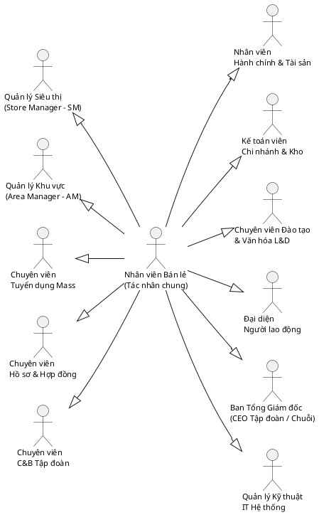
_Hình 2.1. Biểu đồ cây phân cấp Tác nhân (Actor Generalization) — "Nhân viên Bán lẻ" làm tác nhân chung kế thừa ra các vai trò chuyên biệt hóa trong hệ sinh thái bán lẻ MWG._

---

### A.0. Biểu đồ Use Case Tổng quan Hệ thống (47 Use Case, 10 Nhóm)

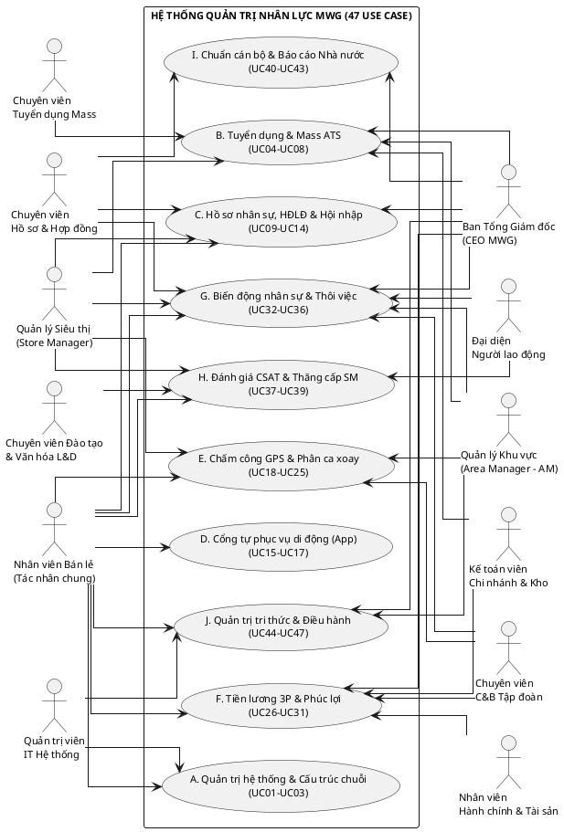
_Hình 2.2. Biểu đồ Use Case tổng quan Hệ thống Quản trị nhân lực MWG — 10 nhóm chức năng, 47 use case, tác nhân phân bố đều hai bên, đường nối thẳng vuông góc ortho có mũi tên chỉ định rõ ràng._

---

### A.1. Nhóm A - Quản trị hệ thống & Cơ cấu tổ chức chuỗi

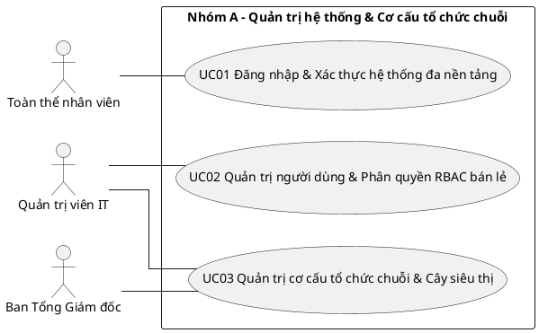
_Hình 2.3. Biểu đồ Use Case Phân hệ Quản trị hệ thống và Cơ cấu tổ chức (Nhóm A: UC01 - UC03)._

---

### A.2. Nhóm B - Tuyển dụng & Ứng viên (Mass ATS)

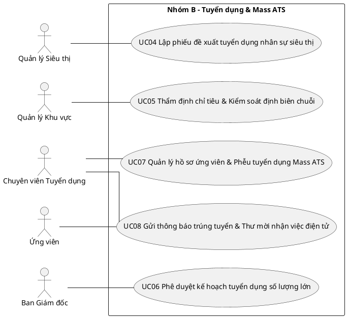
_Hình 2.4. Biểu đồ Use Case Phân hệ Tuyển dụng và Mass ATS (Nhóm B: UC04 - UC08)._

---

### A.3. Nhóm C - Hồ sơ nhân sự, Hợp đồng điện tử & Hội nhập

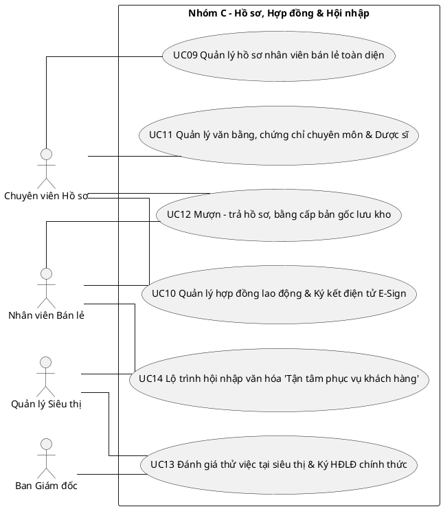
_Hình 2.5. Biểu đồ Use Case Phân hệ Hồ sơ nhân sự, Hợp đồng và Hội nhập (Nhóm C: UC09 - UC14)._

---

### A.4. Nhóm D - Cổng tự phục vụ di động (Mobile ESS)

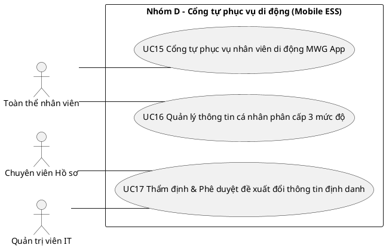
_Hình 2.6. Biểu đồ Use Case Phân hệ Cổng tự phục vụ nhân viên di động (Nhóm D: UC15 - UC17)._

---

### A.5. Nhóm E - Chấm công, Phân ca & Điểm danh đa nguồn

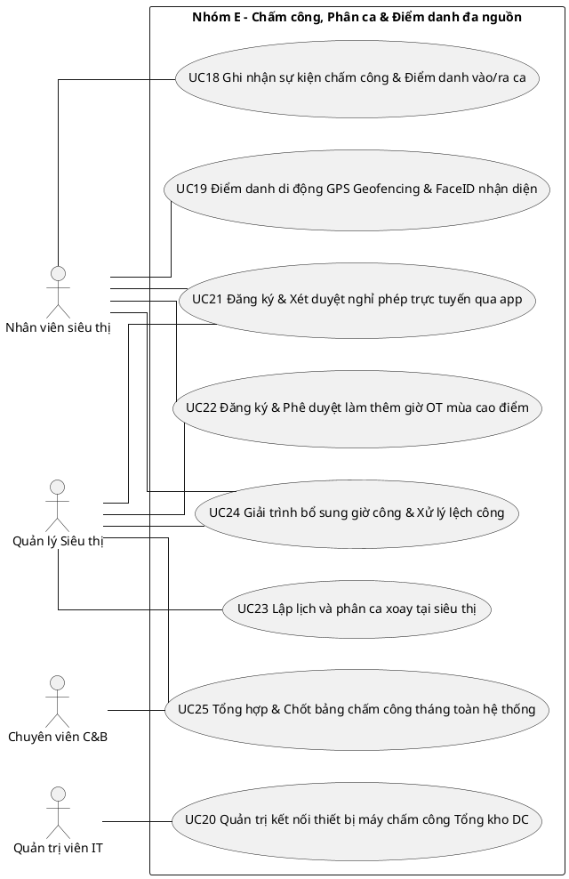
_Hình 2.7. Biểu đồ Use Case Phân hệ Chấm công, Phân ca và Điểm danh đa nguồn (Nhóm E: UC18 - UC25)._

---

### A.6. Nhóm F - Tiền lương 3P, Doanh số & Phúc lợi bán lẻ

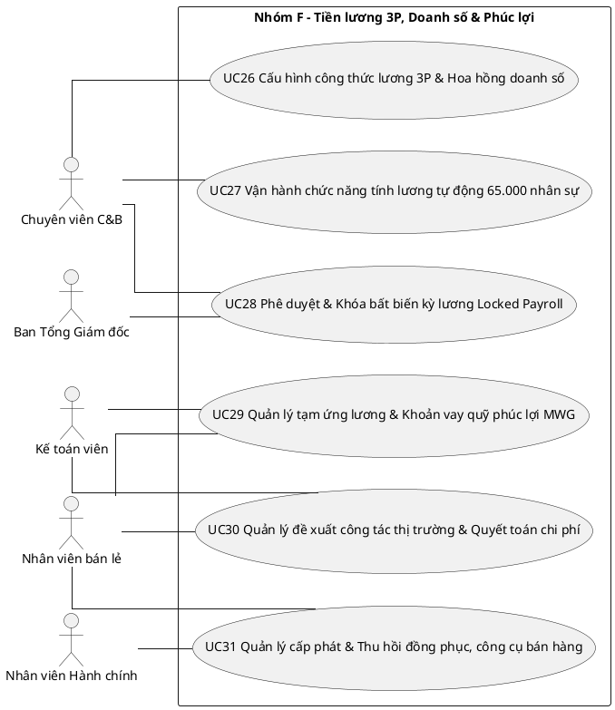
_Hình 2.8. Biểu đồ Use Case Phân hệ Tiền lương, Doanh số và Phúc lợi (Nhóm F: UC26 - UC31)._

---

### A.7. Nhóm G - Biến động nhân sự & Thôi việc tại siêu thị

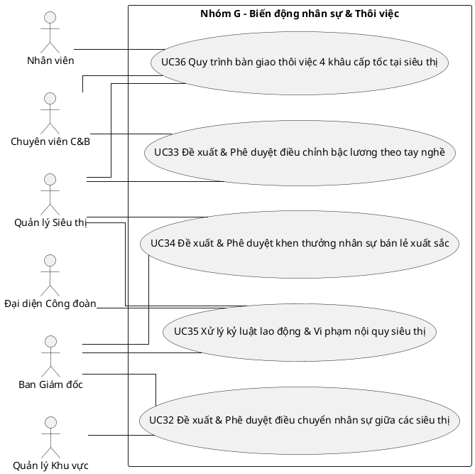
_Hình 2.9. Biểu đồ Use Case Phân hệ Biến động nhân sự và Thôi việc (Nhóm G: UC32 - UC36)._

---

### A.8. Nhóm H - Đánh giá CSAT, Đào tạo & Khiếu nại

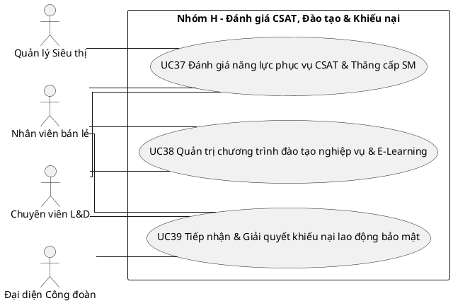
_Hình 2.10. Biểu đồ Use Case Phân hệ Đánh giá CSAT, Đào tạo và Khiếu nại (Nhóm H: UC37 - UC39)._

---

### A.9. Nhóm I - Hồ sơ cán bộ & Báo cáo cơ quan nhà nước

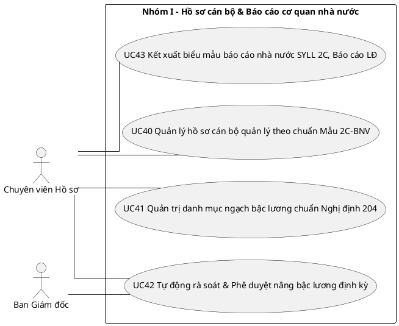
_Hình 2.11. Biểu đồ Use Case Phân hệ Hồ sơ cán bộ và Báo cáo cơ quan nhà nước (Nhóm I: UC40 - UC43)._

---

### A.10. Nhóm J - Quản trị tri thức & Điều hành hệ thống

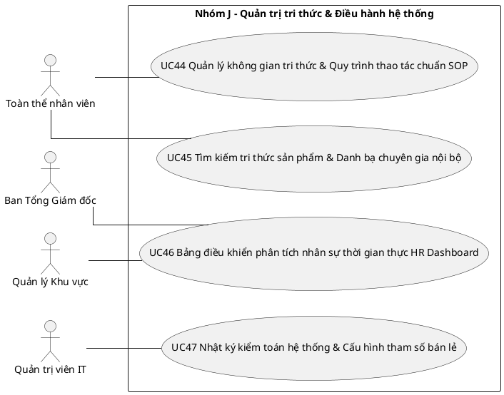
_Hình 2.12. Biểu đồ Use Case Phân hệ Quản trị tri thức và Điều hành hệ thống (Nhóm J: UC44 - UC47)._

---

## B. BIỂU ĐỒ TRÌNH TỰ (SEQUENCE DIAGRAMS)

### B.1. UC01 - Đăng nhập & Xác thực JWT đa nền tảng

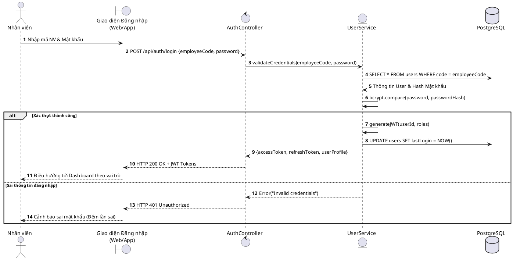
_Hình 2.13. Biểu đồ trình tự Use Case Đăng nhập & Xác thực hệ thống (UC01)._

---

### B.2. UC19 - Điểm danh di động GPS Geofencing & FaceID

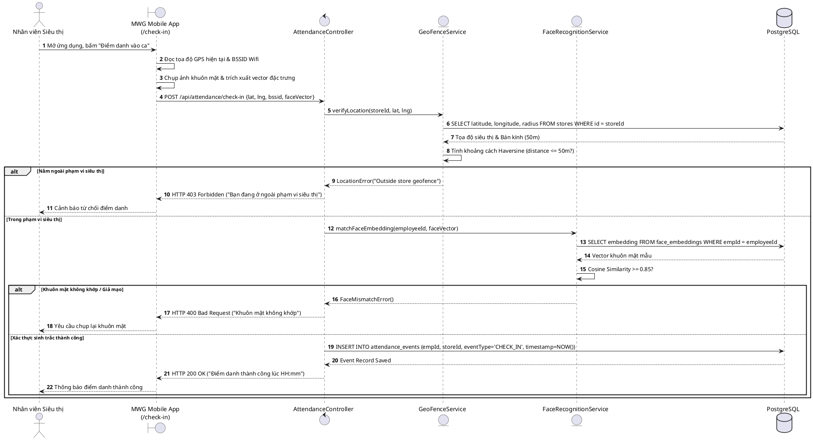
_Hình 2.14. Biểu đồ trình tự Use Case Điểm danh di động GPS Geofencing & FaceID (UC19)._

---

### B.3. UC23 - Lập lịch và phân ca xoay tại siêu thị (Store Scheduling)

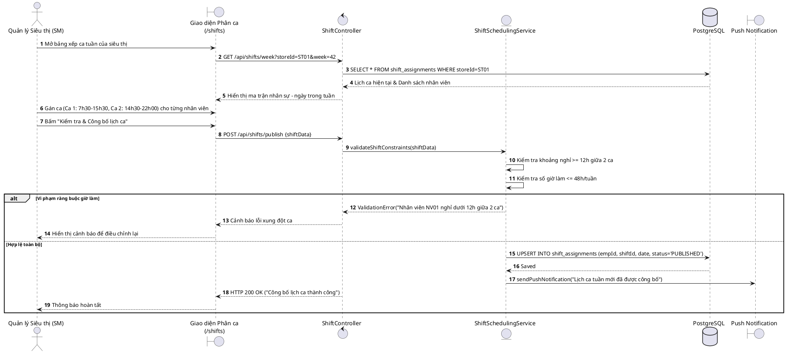
_Hình 2.15. Biểu đồ trình tự Use Case Lập lịch và phân ca xoay tại siêu thị (UC23)._

---

### B.4. UC27 - Vận hành chức năng tính lương tự động cho hơn 65.000 nhân sự

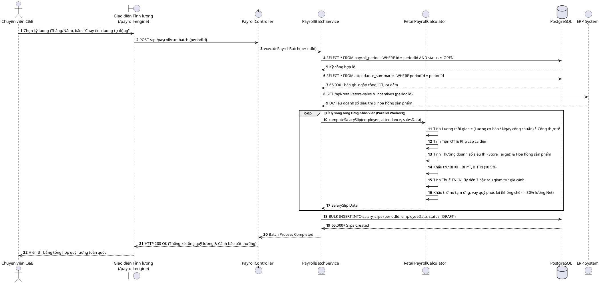
_Hình 2.16. Biểu đồ trình tự Use Case Vận hành chức năng tính lương tự động (UC27)._

---

### B.5. UC36 - Quy trình bàn giao thôi việc 4 khâu cấp tốc tại siêu thị

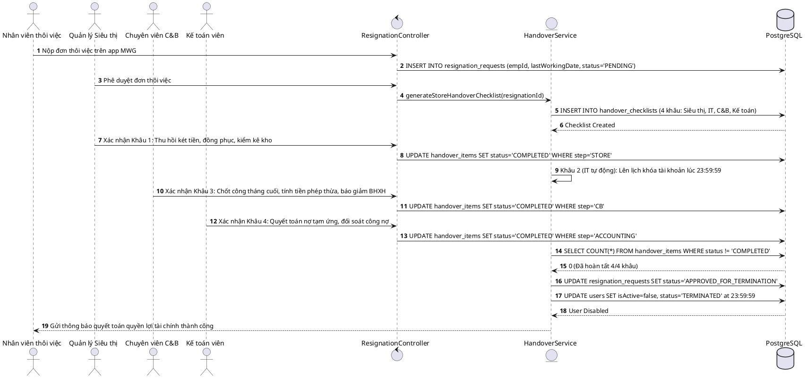
_Hình 2.17. Biểu đồ trình tự Use Case Bàn giao thôi việc 4 khâu cấp tốc tại siêu thị (UC36)._

---

## C. BIỂU ĐỒ HOẠT ĐỘNG (ACTIVITY DIAGRAMS)

### C.1. Luồng hoạt động Điểm danh di động GPS & FaceID (UC19)

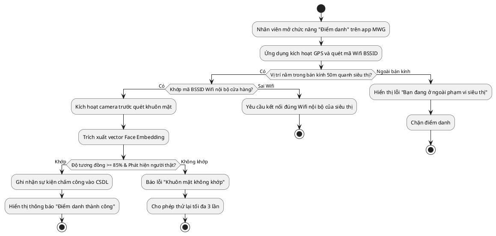
_Hình 2.18. Biểu đồ hoạt động quy trình điểm danh di động GPS & FaceID (UC19)._

---

### C.2. Luồng hoạt động Tính toán tiền lương bán lẻ 3P tự động (UC27)

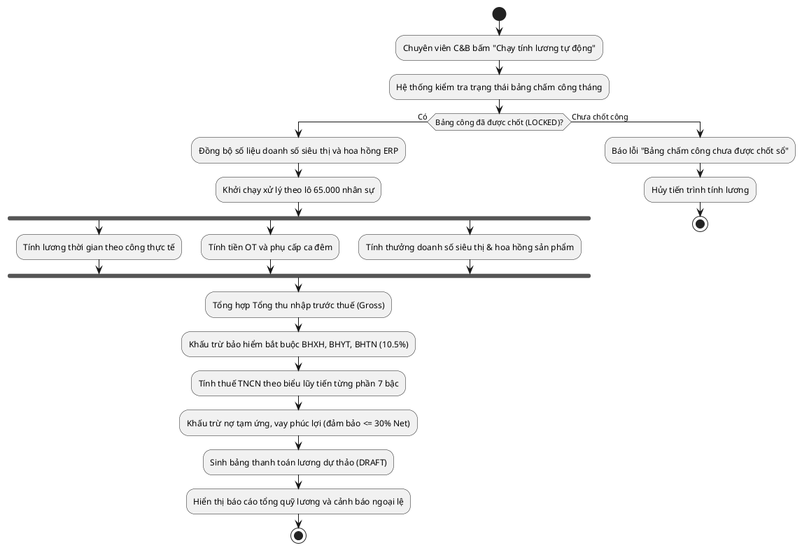
_Hình 2.19. Biểu đồ hoạt động quy trình tính toán tiền lương bán lẻ 3P (UC27)._

---

## D. BIỂU ĐỒ TRẠNG THÁI (STATE MACHINE DIAGRAMS)

### D.1. Vòng đời Nhân viên Bán lẻ MWG

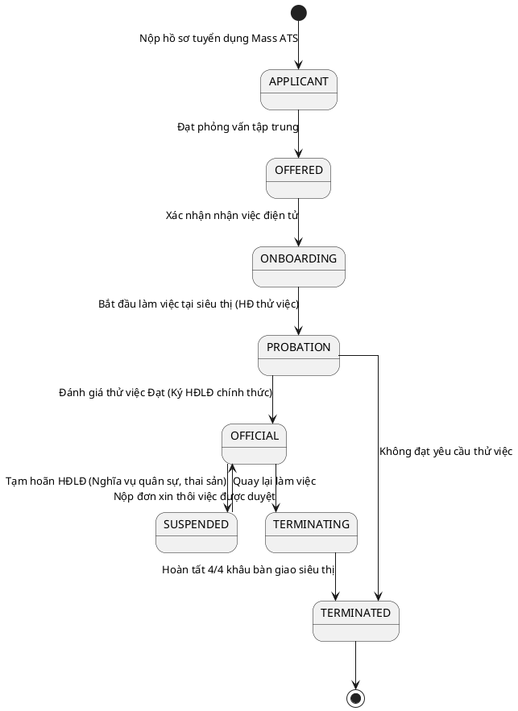
_Hình 2.20. Biểu đồ trạng thái vòng đời Nhân viên bán lẻ tại MWG._

---

### D.2. Vòng đời Kỳ tính lương (PayrollPeriod)

```plantuml
@startuml
skinparam linetype ortho
skinparam shadowing false

[*] --> DRAFT: Khởi tạo kỳ lương tháng mới
DRAFT --> CALCULATED: Chạy chức năng tính lương tự động xong
CALCULATED --> DRAFT: Phát hiện sai sót, tính toán lại
CALCULATED --> REVIEWED: Kế toán đối soát khớp đúng số liệu
REVIEWED --> APPROVED: Tổng Giám đốc ký duyệt điện tử
APPROVED --> LOCKED: Bấm "Khóa kỳ lương bất biến"
note right of LOCKED: Không thể chỉnh sửa số liệu.\nXuất file chi trả ngân hàng.
LOCKED --> [*]
@enduml
```
_Hình 2.21. Biểu đồ trạng thái Kỳ tính lương bán lẻ._

---

## E. BIỂU ĐỒ GÓI VÀ KIẾN TRÚC PHẦN MỀM 3 TẦNG

### E.1. Sơ đồ Kiến trúc Phần mềm 3 Tầng phân tán của MWG

```plantuml
@startuml
skinparam linetype ortho
skinparam shadowing false
skinparam packageStyle rectangle

package "TẦNG GIAO DIỆN NGƯỜI DÙNG (PRESENTATION TIER)" {
  [MWG Mobile App\n(React Native iOS/Android)] as MobileApp
  [Admin Web Portal\n(Next.js & Tailwind CSS)] as WebAdmin
  [Kiosk Attendance\n(Web Tablet / FaceID)] as Kiosk
}

package "TẦNG XỬ LÝ NGHIỆP VỤ (BUSINESS LOGIC TIER - NestJS)" {
  [API Gateway & Auth (JWT/RBAC)] as Gateway
  [Store Scheduling Engine (Phân ca xoay)] as ShiftEngine
  [Geo & FaceID Verification Service] as GeoService
  [Mass ATS Workflow Engine] as AtsEngine
  [Retail Payroll Engine (Lương 3P & ERP)] as PayrollEngine
  [Background Job Queue (Redis BullQueue)] as JobQueue
}

package "TẦNG LƯU TRỮ DỮ LIỆU (DATA TIER)" {
  database "PostgreSQL 16\n(87 Bảng quan hệ - Partitioned)" as MainDB
  database "Redis Cache\n(Session & Geofence Store Data)" as Cache
  [AWS S3 / MinIO\n(Tài liệu số & Hợp đồng E-Sign)] as FileStore
}

cloud "HỆ THỐNG NGOÀI (EXTERNAL SYSTEMS)" {
  [ERP Bán lẻ MWG\n(Doanh số siêu thị & Hoa hồng)] as ERP
  [Hệ thống Ngân hàng\n(Chi lương tự động VCB/BIDV)] as Bank
  [Tổng kho DC Hardware\n(Máy chấm công vân tay ZKTeco)] as DC_HW
}

MobileApp --> Gateway: HTTPS / REST API
WebAdmin --> Gateway: HTTPS / REST API
Kiosk --> Gateway: HTTPS / REST API

Gateway --> ShiftEngine
Gateway --> GeoService
Gateway --> AtsEngine
Gateway --> PayrollEngine

PayrollEngine --> ERP: Đồng bộ doanh số & Incentive
PayrollEngine --> Bank: Xuất lệnh chi lương
GeoService --> DC_HW: Đồng bộ dữ liệu quẹt thẻ kho

ShiftEngine --> JobQueue
PayrollEngine --> JobQueue

ShiftEngine --> MainDB
AtsEngine --> MainDB
PayrollEngine --> MainDB
GeoService --> Cache
Gateway --> Cache
AtsEngine --> FileStore

@enduml
```
_Hình 2.22. Sơ đồ kiến trúc phần mềm 3 tầng phân tán tối ưu hóa cho chuỗi bán lẻ quy mô lớn MWG._

---

## F. BIỂU ĐỒ LỚP CHI TIẾT (CLASS DIAGRAMS)

### F.1. Biểu đồ Lớp Miền Cốt lõi (Domain Model) của Hệ thống HRMS MWG

```plantuml
@startuml
skinparam linetype ortho
skinparam shadowing false
skinparam classAttributeIconSize 0

class OrgUnit {
  - id: String
  - code: String
  - name: String
  - type: UnitType
  - parentId: String
  + getSubUnits()
  + getHeadCount()
}

class StoreLocation {
  - id: String
  - storeCode: String
  - address: String
  - latitude: Float
  - longitude: Float
  - geofenceRadius: Float
  - wifiBssid: String
  + isWithinRange(lat, lng): Boolean
}

class Employee {
  - id: String
  - employeeCode: String
  - fullName: String
  - idCardNumber: String
  - email: String
  - phone: String
  - status: EmployeeStatus
  - currentStoreId: String
  + getActiveContract(): Contract
  + getLeaveBalance(): LeaveBalance
}

class WorkShift {
  - id: String
  - shiftCode: String
  - shiftName: String
  - startTime: Time
  - endTime: Time
  - isOvernight: Boolean
}

class ShiftAssignment {
  - id: String
  - employeeId: String
  - storeId: String
  - shiftId: String
  - date: Date
  - isSwapped: Boolean
  + swapWith(otherEmployee)
}

class AttendanceEvent {
  - id: String
  - employeeId: String
  - storeId: String
  - eventTime: DateTime
  - eventType: EventType
  - verifyMethod: VerifyMethod
  - isVerified: Boolean
}

class Contract {
  - id: String
  - contractNumber: String
  - contractType: ContractType
  - basicSalary: Decimal
  - startDate: Date
  - endDate: Date
  - eSignatureStatus: ESignStatus
  + signViaOtp(otpCode)
}

class SalarySlip {
  - id: String
  - periodId: String
  - employeeId: String
  - basicSalary: Decimal
  - storeSalesBonus: Decimal
  - productIncentive: Decimal
  - csatBonus: Decimal
  - otPay: Decimal
  - deductions: Decimal
  - netPay: Decimal
  - isLocked: Boolean
  + lockSlip()
}

OrgUnit "1" *-- "many" OrgUnit: cha - con
OrgUnit "1" -- "0..1" StoreLocation: vị trí siêu thị
OrgUnit "1" -- "many" Employee: trực thuộc
Employee "1" -- "many" Contract: ký kết
Employee "1" -- "many" ShiftAssignment: phân ca
WorkShift "1" -- "many" ShiftAssignment: mẫu ca
Employee "1" -- "many" AttendanceEvent: chấm công
Employee "1" -- "many" SalarySlip: nhận lương
@enduml
```
_Hình 2.23. Biểu đồ lớp miền cốt lõi của hệ thống Quản trị nhân lực MWG (Domain Model)._

---

## G. MÔ HÌNH CSDL MỞ RỘNG CHO ĐIỂM DANH ĐA NGUỒN

```plantuml
@startuml
skinparam linetype ortho
skinparam shadowing false
skinparam classAttributeIconSize 0

entity "StoreLocation" as store {
  * id : varchar(36) [PK]
  --
  * storeCode : varchar(20) [UQ]
  * storeName : varchar(150)
  * latitude : decimal(10,8)
  * longitude : decimal(11,8)
  * geofenceRadius : float (default 50.0)
  * wifiBssid : varchar(50)
  * isActive : boolean
}

entity "FaceEmbedding" as face {
  * id : varchar(36) [PK]
  --
  * employeeId : varchar(36) [FK]
  * vectorData : text (encrypted)
  * algorithmVersion : varchar(20)
  * registeredAt : timestamp
}

entity "AttendanceDevice" as dev {
  * id : varchar(36) [PK]
  --
  * deviceSerial : varchar(50) [UQ]
  * warehouseId : varchar(36)
  * ipAddress : varchar(45)
  * deviceType : varchar(30) (FINGERPRINT/CARD)
  * lastSyncAt : timestamp
}

entity "AttendanceEvent" as event {
  * id : varchar(36) [PK]
  --
  * employeeId : varchar(36) [FK]
  * storeId : varchar(36) [FK]
  * eventTime : timestamp
  * eventType : varchar(10) (CHECK_IN / CHECK_OUT)
  * verifyMethod : varchar(20) (GPS_FACE / WIFI / FINGERPRINT)
  * latitude : decimal(10,8)
  * longitude : decimal(11,8)
  * rawBssid : varchar(50)
  * isFraudSuspected : boolean
}

entity "AttendanceDay" as day {
  * id : varchar(36) [PK]
  --
  * employeeId : varchar(36) [FK]
  * workDate : date
  * assignedShiftId : varchar(36)
  * firstCheckIn : timestamp
  * lastCheckOut : timestamp
  * workHours : decimal(4,2)
  * otHours : decimal(4,2)
  * status : varchar(20) (FULL / LATE / EARLY / ABSENT)
}

entity "AttendanceCorrection" as corr {
  * id : varchar(36) [PK]
  --
  * attendanceDayId : varchar(36) [FK]
  * reason : varchar(255)
  * proofAttachment : varchar(255)
  * approvedBy : varchar(36) (Store Manager SM)
  * status : varchar(20) (PENDING / APPROVED / REJECTED)
}

store ||--o{ event : "được ghi nhận tại"
face ||--o{ event : "đối chiếu sinh trắc"
dev ||--o{ event : "truyền sự kiện từ kho"
event }o--|| day : "tổng hợp thành"
day ||--o{ corr : "giải trình sai lệch"
@enduml
```
_Hình 2.24. Mô hình cơ sở dữ liệu mở rộng cho phân hệ chấm công đa nguồn phân tán tại MWG._
