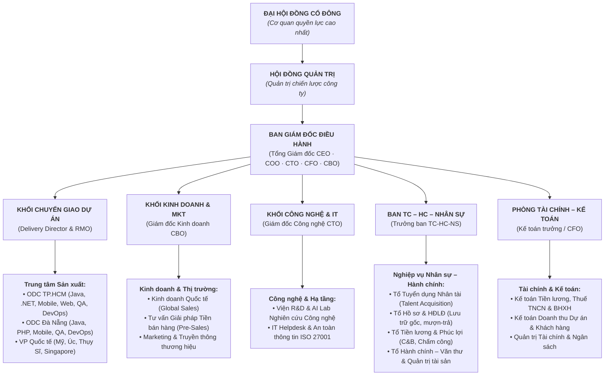
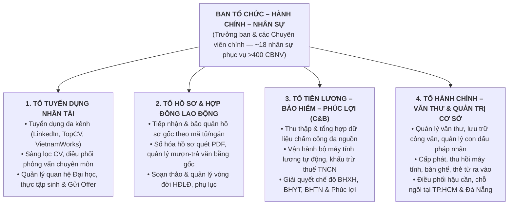
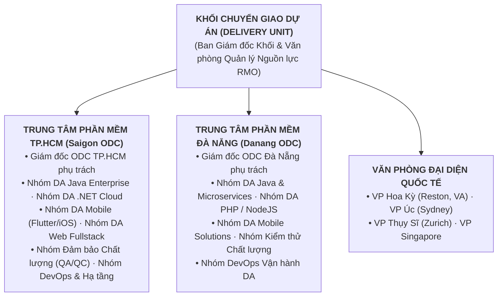
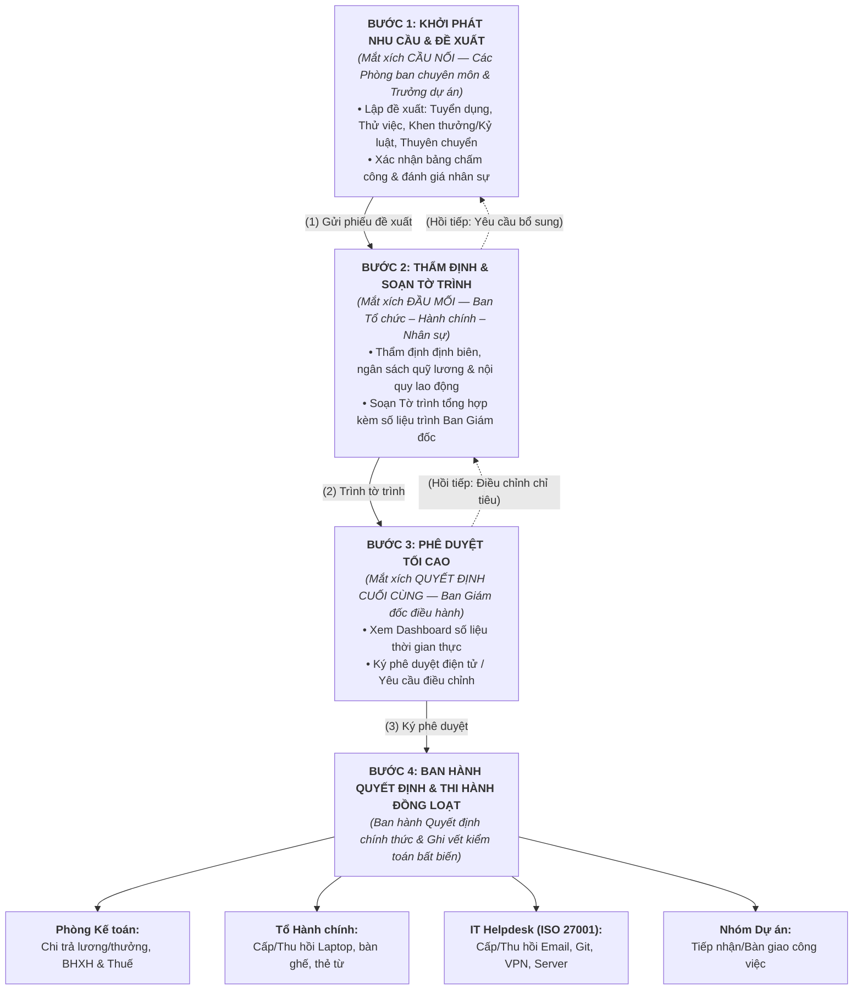
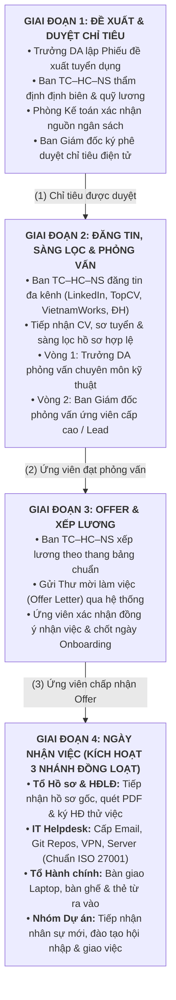
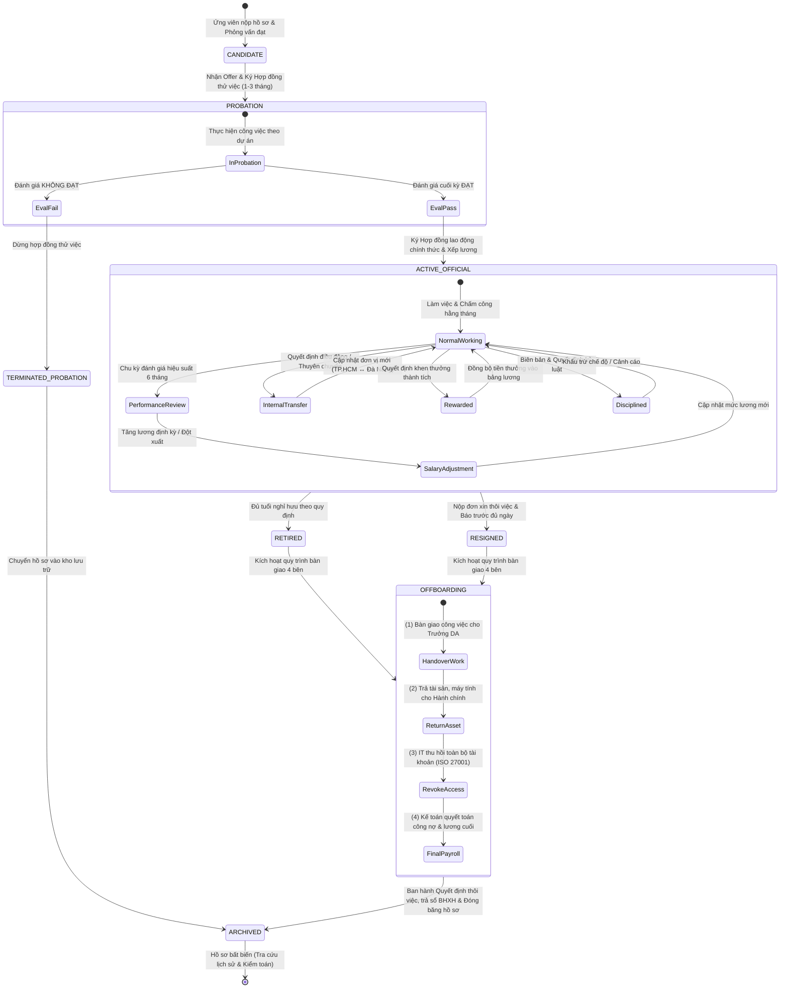
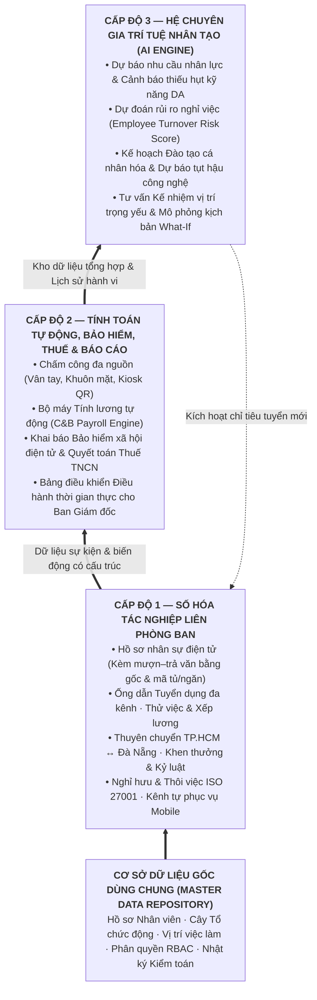

# ĐẶC TẢ HỆ THỐNG VÀ THIẾT KẾ PHẦN MỀM QUẢN TRỊ NHÂN LỰC (HRMIS)

**Đơn vị nghiên cứu tình huống: Công ty Cổ phần Phần mềm Saigon Technology (tên pháp nhân đăng ký kinh doanh: Công ty Cổ phần Công nghệ Phần mềm STS Software)**

---

## PHẦN MỘT — GIỚI THIỆU CHI TIẾT VỀ ĐƠN VỊ NGHIÊN CỨU
### 1. Lịch sử hình thành và quá trình phát triển

Công ty Cổ phần Phần mềm Saigon Technology là một doanh nghiệp công nghệ thông tin thuần Việt, hoạt động trong lĩnh vực phát triển phần mềm theo mô hình linh hoạt (Agile) và gia công phần mềm cho thị trường quốc tế:

- **Năm 2012:** Công ty được thành lập tại Thành phố Hồ Chí Minh bởi ông Phạm Thanh (Bruce Phạm) cùng đồng sáng lập, xuất phát điểm chỉ với **ba kỹ sư phần mềm**, tập trung thiết kế và phát triển ứng dụng web, ứng dụng di động cho thị trường trong nước.
- **Ngày 13 tháng 11 năm 2015:** Doanh nghiệp chuyển sang mô hình công ty cổ phần với tên pháp nhân chính thức **Công ty Cổ phần Công nghệ Phần mềm STS Software**, được cấp đăng ký kinh doanh số 0313534747, mở đường cho việc hợp tác với khách hàng nước ngoài.
- **Giai đoạn 2019 – 2020:** Đây là bước ngoặt tăng trưởng quy mô: công ty chuyển về trụ sở diện tích khoảng 2.000 mét vuông, **khai trương trung tâm phát triển phần mềm tại Thành phố Đà Nẵng** (nằm trong Khu Phần mềm Đà Nẵng, tòa nhà ICT1, quận Hải Châu), và đạt chứng nhận bảo mật thông tin quốc tế ISO/IEC 27001 do tổ chức BSI cấp vào tháng 11 năm 2020.
- **Hiện nay:** Công ty duy trì đội ngũ **khoảng 400 đến hơn 430 cán bộ, kỹ sư và nhân viên hỗ trợ**, doanh thu hằng năm ước khoảng 23 triệu đô la Mỹ, đã bàn giao **hơn 850 dự án cho hơn 350 khách hàng** tại Hoa Kỳ, châu Âu, Úc và Singapore. Ngoài hai trung tâm phát triển phần mềm tại Thành phố Hồ Chí Minh (trụ sở chính tại tòa nhà Orchard Parkview, đường Hồng Hà, quận Phú Nhuận; văn phòng Aloha trên cùng trục đường Hồng Hà; và văn phòng khu Tân Bình) và chi nhánh Đà Nẵng, công ty còn đặt văn phòng đại diện tại Hoa Kỳ (Reston, bang Virginia), Úc, Thụy Sĩ và Singapore để hỗ trợ khách hàng gần múi giờ hoạt động.

### 2. Lĩnh vực hoạt động, dịch vụ và khách hàng

Saigon Technology chuyên cung cấp các dịch vụ sau:

- **Phát triển phần mềm theo yêu cầu** (ứng dụng web, ứng dụng di động trên iOS và Android);
- **Cho thuê đội ngũ kỹ sư theo dự án hoặc theo tháng** (mô hình dedicated team — khách hàng nước ngoài thuê nguyên một nhóm lập trình viên làm việc độc quyền cho mình từ xa);
- **Trung tâm phát triển phần mềm đặt tại Việt Nam** cho khách hàng quốc tế;
- **Kiểm thử chất lượng phần mềm, dịch chuyển lên điện toán đám mây, ứng dụng trí tuệ nhân tạo và học máy** vào sản phẩm cho khách.

Về công nghệ, đội ngũ kỹ sư làm việc chủ yếu trên các nền tảng .NET Core, Java, ReactJS, Angular, NodeJS, PHP, Flutter, cùng hạ tầng Amazon Web Services và Microsoft Azure. Về khách hàng, sản phẩm của công ty hiện diện trong các lĩnh vực tài chính – ngân hàng số, chăm sóc sức khỏe, thương mại bán lẻ, giáo dục, sản xuất và logistics — nghĩa là mỗi dự án đều đòi hỏi đội ngũ có trình độ chuyên môn và chứng chỉ nghề riêng biệt, một đặc điểm sẽ tác động trực tiếp tới bài toán quản trị nhân lực ở phần sau.

### 3. Các chứng nhận và danh hiệu — căn cứ xác nhận tính thực tế của đơn vị

Việc lựa chọn một doanh nghiệp thật, đang hoạt động, có thể kiểm chứng được là điều kiện bắt buộc của bài toán. Saigon Technology hội đủ tiêu chuẩn đó qua các bằng chứng sau:

- Chứng nhận **hệ thống quản lý chất lượng ISO 9001** và **hệ thống quản lý an toàn thông tin ISO/IEC 27001** (do BSI cấp năm 2020, tái đánh giá định kỳ ba năm một lần);
- Được **Hiệp hội Phần mềm Việt Nam (VINASA)** bình chọn trong nhóm mười lăm công ty gia công phần mềm phát triển linh hoạt hàng đầu Việt Nam năm 2019 và 2020; đoạt **Giải thưởng Sao Khuê 2020** ở hạng mục dịch vụ phát triển công nghệ thông tin; lọt **Top 50 công ty phần mềm tốt nhất Việt Nam** năm 2019;
- Được nền tảng nghiên cứu thị trường Clutch (Hoa Kỳ) vinh danh là **nhà phát triển phần mềm hàng đầu đến từ Việt Nam năm 2022**, với điểm đánh giá trung bình 4,8 trên thang 5 điểm từ phía khách hàng quốc tế;
- Góp mặt trong danh sách **Fortune 100 công ty tốt nhất Đông Nam Á năm 2025** và chứng nhận Great Place to Work châu Á về môi trường làm việc.

### 4. Đặc điểm lao động của ngành công nghệ thông tin và hệ quả đối với công tác quản trị nhân lực

Điểm khiến Saigon Technology trở thành một tình huống nghiên cứu giàu tính đại diện nằm ở **bản chất lao động trí tuệ của ngành**: lực lượng lao động chủ yếu là kỹ sư phần mềm tuổi đời trẻ (phần lớn dưới 35), trình độ cao, thị trường việc làm cạnh tranh khốc liệt giữa các công ty phần mềm, tỷ lệ nghỉ việc trong ngành luôn ở mức đáng báo động, và giá trị của mỗi cá nhân gắn liền với kỹ năng công nghệ đang biến đổi không ngừng. Theo dữ liệu nghề nghiệp công khai, cơ cấu nhân sự công ty chia khoảng **43% lực lượng kỹ thuật trực tiếp**, phần còn lại là quản lý dự án, thiết kế, tư vấn, marketing, hành chính — trong khi **toàn bộ mảng nhân sự chỉ có khoảng mười tám người** phụ trách cho hơn bốn trăm nhân sự. Con số này nói lên tất cả: nếu cứ quản lý hồ sơ, chấm công, tính lương bằng sổ tay và bảng tính Excel thủ công, bộ phận nhân sự sẽ sớm bị "đè vỡ". Chính đặc điểm nghịch lý giữa quy mô nhân sự và biên chế bộ phận nhân sự mỏng là luận cứ mạnh nhất để đề xuất xây dựng hệ thống quản trị nguồn nhân lực.

### 5. Lý do chọn đơn vị này cho bài toán xây dựng phần mềm

Saigon Technology vừa đủ lớn để các quy trình nhân sự trở nên phức tạp thật sự (hàng trăm hợp đồng lao động thuộc nhiều loại hình, chấm công phân tán ở hai thành phố và nhiều ca làm việc khác nhau, nhân sự làm việc từ xa cho khách hàng nước ngoài), nhưng chưa lớn đến mức đã đầu tư sẵn một bộ giải pháp quản trị nguồn lực doanh nghiệp cồng kềnh. Hiện trạng của công ty — như sẽ đặc tả ở Phần Bốn — vẫn là sự pha trộn giữa giấy tờ, bảng tính Excel rời rạc và email, đúng bối cảnh điển hình mà một dự án phần mềm quản trị nguồn nhân lực cần giải quyết.

---

## PHẦN HAI — PHÂN TÍCH CƠ CẤU TỔ CHỨC VÀ CHỨC NĂNG CỦA ĐƠN VỊ

### 1. Nguyên tắc nền tảng: "mỗi cơ quan, đơn vị sẽ có cơ cấu chức năng riêng"

Đây là chân lý đầu tiên của nghề phân tích hệ thống: không tồn tại một sơ đồ tổ chức chuẩn dùng chung cho mọi nơi. Một cơ quan nhà nước tổ chức theo phòng – ban – lãnh đạo cơ quan; một xí nghiệp sản xuất tổ chức theo phân xưởng – tổ sản xuất; còn một công ty phần mềm như Saigon Technology tổ chức theo **dòng chảy dự án**. Cơ cấu ấy quyết định toàn bộ những điều sau đây, mà phần mềm phải phản ánh đúng: ai có quyền đề xuất, ai thẩm định, ai phê duyệt cuối cùng, hồ sơ chạy theo luồng nào, dữ liệu nhân sự được gắn nhãn theo đơn vị nào. Hệ quả thiết kế quan trọng nhất: **cây cơ cấu tổ chức không được phép cài cắm cứng vào mã nguồn chương trình**, mà phải là dữ liệu cấu hình được — vấn đề sẽ quay lại chi tiết ở phần kiến trúc.

### 2. Sơ đồ tổ chức của Công ty Saigon Technology (tái dựng theo thực tiễn vận hành)

**Hình 1 — Sơ đồ cơ cấu tổ chức tổng thể Công ty Saigon Technology (Nét thẳng, 5 Khối ngang hàng)**

_Ghi chú phân tích kèm Hình 1:_
- **Tính tổng thể và bao quát toàn diện**: Hai cấp trên cùng (Đại hội đồng cổ đông, Hội đồng quản trị) thuộc tầng quản trị sở hữu, ít tham gia nghiệp vụ nhân sự hằng ngày nên trong HRMIS chỉ cần vai trò **xem báo cáo**; tầng Ban Giám đốc là điểm hội tụ duy nhất của mọi luồng phê duyệt — căn cứ để thiết kế đúng một vai "Người phê duyệt cuối".
- **Khối Chuyển giao Dự án (Delivery Unit) gắn kết chặt chẽ trong hệ sinh thái doanh nghiệp**: Không đứng độc lập mà liên kết trực tiếp với Khối Kinh doanh (nhận dự án), Ban TC-HC-NS (nhận nhân lực, định biên, đề xuất tăng lương, đánh giá), Khối Công nghệ & IT (nhận hạ tầng, repo, tuân thủ an toàn thông tin ISO 27001) và Phòng Kế toán (kiểm soát chi phí nhân sự và nghiệm thu dự án).
- **Mô hình tổ chức là dữ liệu động**: Mọi phòng ban, trung tâm ODC và nhóm dự án đều được cấu hình động trên hệ thống HRMIS, cho phép thêm mới hoặc thuyên chuyển nhân sự dễ dàng.

**Hình 2 — Cơ cấu chi tiết Ban Tổ chức – Hành chính – Nhân sự (4 Tổ chuyên môn ngang hàng)**

Tiếp theo là trái tim sản xuất — Khối Chuyển giao Dự án:

**Hình 3 — Cơ cấu chi tiết Khối Chuyển giao Dự án (Các Trung tâm ODC & VP Quốc tế)**

_Ghi chú phân tích kèm Hình 2 và Hình 3:_ mỗi nhóm dự án ở Hình 3 do một **Trưởng dự án** đứng đầu — lớp "mắt xích cầu nối" sẽ phân tích sâu ở mục 4; nhân sự kỹ thuật được điều chuyển linh hoạt giữa hai trung tâm nên phân hệ Thuyên chuyển phải hỗ trợ cả chuyển nội địa điểm lẫn liên tỉnh; cùng một chức danh (ví dụ "Lập trình viên Java") tồn tại song song ở hai trung tâm — bài toán mà mô hình "cây tổ chức là dữ liệu" ở phần kiến trúc giải quyết triệt để. Riêng Ban Tổ chức – Hành chính – Nhân sự với bốn tổ nhưng chỉ khoảng mười tám người phục vụ hơn bốn trăm nhân sự là nút cổ chai rõ nhất, lý do trực tiếp để phần mềm gánh phần thao tác lặp lại.

### 3. Chức năng, nhiệm vụ của từng bộ phận dưới góc độ quản trị nhân lực

- **Ban Giám đốc:** phê duyệt định biên lao động hằng năm và quỹ tiền lương; ký các quyết định nhân sự trọng yếu (tuyển mới vượt định biên, xếp lương, kỷ luật sa thải, chấm dứt hợp đồng); quyết định mở rộng trung tâm phát triển mới. Đặc trưng nghiệp vụ: cấp này **không thao tác chi tiết**, chỉ xem tờ trình tóm tắt kèm số liệu rồi ra quyết định.
- **Ban Tổ chức – Hành chính – Nhân sự:** đầu mối duy nhất của mọi nghiệp vụ nhân sự — tiếp nhận đề xuất từ các khối, thẩm định tính hợp lệ đối chiếu nội quy lao động và thang bảng lương, soạn thảo tờ trình, trình Giám đốc, phát hành quyết định, lưu hồ sơ, cập nhật sổ sách, tổ chức thi hành. Đồng thời trực tiếp vận hành hai quy trình nặng thao tác: lưu trữ hồ sơ gốc và chu kỳ chấm công – tính lương hằng tháng.
- **Các Trưởng dự án và Trưởng bộ phận chuyên môn:** người nắm rõ nhất đội ngũ mình — phát sinh nhu cầu (thiếu người, đề xuất khen, đề xuất kỷ luật, đánh giá thử việc, đánh giá hiệu suất), xác nhận dữ liệu (bảng chấm công theo dự án, biên bản bàn giao khi nghỉ việc), nhưng **không có quyền ra quyết định nhân sự** — mọi thứ phải chạy qua Ban Tổ chức – Hành chính – Nhân sự lên Giám đốc.
- **Các bộ phận liên quan đến quy trình dù không phải chủ trì** — đây là lớp tác động thường bị bỏ sót trong các bài phân tích thông thường:
  - _Phòng Tài chính – Kế toán:_ chịu ảnh hưởng trực tiếp từ mọi quyết định nhân sự, vì mỗi lần tuyển thêm người, tăng lương, thưởng, kỷ luật trừ lương đều làm biến đổi quỹ lương, chi phí bảo hiểm xã hội và thuế thu nhập cá nhân phải quyết toán;
  - _Tổ Hành chính:_ phải chuẩn bị chỗ ngồi, bàn ghế, máy tính cho người mới tuyển; thu hồi tài sản khi người nghỉ việc;
  - _Bộ phận Trợ giúp kỹ thuật nội bộ:_ phải cấp tài khoản email, tài khoản hệ thống quản lý mã nguồn, quyền truy cập dự án cho nhân viên mới trong ngày nhận việc, và thu hồi toàn bộ trong ngày làm việc cuối cùng khi nhân viên nghỉ — sai sót ở khâu thu hồi là rủi ro an ninh thông tin nghiêm trọng, nhất là với một công ty đạt chứng nhận ISO/IEC 27001;
  - _Các nhóm dự án:_ là nơi hưởng lợi trực tiếp khi tuyển được người đúng, và chịu thiệt hại tiến độ ngay lập tức khi có người nghỉ việc đột xuất.

Chuẩn hóa các vai trò trên, mỗi bộ phận được mô tả theo một mẫu thống nhất gồm năm thuộc tính: _vai trò trong hệ thống — nhận vào cái gì — trả ra cái gì — nhiệm vụ chính — vai tương ứng trong phần mềm_. Đây chính là nguyên liệu trực tiếp để lập ma trận quyền hạn chi tiết của HRMIS:

**Hình 4 — Chức năng – nhiệm vụ của từng bộ phận dưới góc độ quản trị nhân sự**

**a) Ban Giám đốc**

- _Vai trò trong hệ thống:_ mắt xích quyết định cuối cùng;
- _Nhận vào:_ tờ trình tóm tắt kèm số liệu từ Ban Tổ chức – Hành chính – Nhân sự;
- _Trả ra:_ quyết định nhân sự có hiệu lực thi hành;
- _Nhiệm vụ chính:_
  - phê duyệt định biên lao động và quỹ tiền lương hằng năm;
  - ký duyệt chỉ tiêu tuyển dụng, bảng xếp lương, tờ trình tăng lương;
  - ký quyết định khen thưởng, kỷ luật, chấm dứt hợp đồng, nghỉ hưu;
  - quyết định mở rộng trung tâm phát triển mới, định hướng chiến lược nhân sự theo lộ trình công nghệ của công ty;
- _Vai trong HRMIS:_ "Người phê duyệt" — duyệt từ xa bằng ký điện tử, xem bảng điều khiển điều hành thời gian thực.

**b) Ban Tổ chức – Hành chính – Nhân sự**

- _Vai trò trong hệ thống:_ mắt xích đầu mối — van điều phối mọi dòng chảy nghiệp vụ nhân sự;
- _Nhận vào:_ phiếu đề xuất từ các phòng ban; đơn, tờ khai của người lao động; quyết định trả về từ Ban Giám đốc;
- _Trả ra:_ tờ trình trình ký; quyết định nhân sự phát hành; hồ sơ lưu trữ; bảng lương tổng hợp;
- _Nhiệm vụ chính:_
  - tiếp nhận, thẩm định tính hợp lệ của mọi loại đề xuất nhân sự;
  - soạn thảo tờ trình, phát hành và lưu vết quyết định;
  - quản lý hồ sơ gốc, mượn – trả văn bằng chứng chỉ;
  - vận hành chu kỳ chấm công – tính lương hằng tháng;
  - tư vấn tuân thủ pháp luật lao động, nội quy, thang bảng lương;
- _Vai trong HRMIS:_ "Chủ trì quy trình" — quyền cao nhất trên dữ liệu nhân sự, chịu kiểm toán truy vết.

**c) Trưởng dự án và Trưởng bộ phận chuyên môn**

- _Vai trò trong hệ thống:_ mắt xích cầu nối — phát sinh nhu cầu và cung cấp dữ liệu thực tế;
- _Nhận vào:_ yêu cầu tiến độ dự án; danh sách nhân sự được điều động; quyết định thi hành;
- _Trả ra:_ phiếu đề xuất tuyển dụng; phiếu đánh giá thử việc và hiệu suất; bảng chấm công dự án đã xác nhận; biên bản bàn giao;
- _Nhiệm vụ chính:_
  - phát hiện thiếu hụt vị trí việc làm trong nhóm mình;
  - phỏng vấn chuyên môn vòng một; đánh giá thử việc, đánh giá hiệu suất;
  - duyệt giờ làm thêm; xác nhận bảng chấm công nhóm;
  - tổ chức bàn giao khi thuyên chuyển hoặc thôi việc;
- _Vai trong HRMIS:_ "Người đề xuất / Xác nhận" — thấy đúng phạm vi nhóm mình, không can thiệp dữ liệu nhóm khác.

**d) Phòng Tài chính – Kế toán**

- _Vai trò trong hệ thống:_ bộ phận phản ánh — mọi biến động nhân sự đều đổ về đây dưới dạng chi phí;
- _Nhận vào:_ bảng lương tổng hợp; quyết định khen thưởng, kỷ luật, tăng lương đã có hiệu lực;
- _Trả ra:_ xác nhận khả năng quỹ lương khi thẩm định tuyển; lệnh chuyển khoản; báo cáo bảo hiểm xã hội; dữ liệu quyết toán thuế thu nhập cá nhân;
- _Nhiệm vụ chính:_
  - đối chiếu bảng lương trước khi trình duyệt;
  - chi trả lương – thưởng; hạch toán chi phí nhân lực;
  - làm thủ tục bảo hiểm xã hội, quyết toán thuế cuối năm;
- _Vai trong HRMIS:_ "Đối chiếu – Kế toán" — nhận dữ liệu tự động từ bộ máy tính lương, không nhập liệu kép.

**e) Bộ phận Trợ giúp kỹ thuật nội bộ**

- _Vai trò trong hệ thống:_ bộ phận bảo đảm hạ tầng truy cập;
- _Nhận vào:_ thông báo nhân viên mới / nghỉ việc / chuyển đơn vị từ hệ thống;
- _Trả ra:_ xác nhận đã cấp tài khoản ngày nhận việc; xác nhận đã thu hồi toàn bộ tài khoản và quyền truy cập ngày làm việc cuối;
- _Nhiệm vụ chính:_
  - cấp email, tài khoản quản lý mã nguồn, quyền truy cập dự án;
  - thu hồi tài khoản khi nghỉ việc — nghĩa vụ sống còn với cam kết bảo mật ISO/IEC 27001 của công ty;
- _Vai trong HRMIS:_ "Xác nhận checklist hội nhập / offboarding".

**f) Người lao động (toàn thể nhân viên)**

- _Vai trò trong hệ thống:_ chủ thể trung tâm — nguồn phát sinh đơn từ nghỉ phép, mượn hồ sơ gốc cho tới thôi việc;
- _Trả ra:_ đơn xin nghỉ phép, đăng ký làm thêm giờ, yêu cầu mượn bản gốc văn bằng chứng chỉ, đơn xin thôi việc, xác nhận thông tin cá nhân;
- _Vai trong HRMIS:_ "Tự phục vụ" — thao tác trên ứng dụng di động, không phải ra quầy văn thư.

Sáu bộ phận trên bao phủ trọn vẹn các cột "khởi tạo – chủ trì – phê duyệt – bị ảnh hưởng" trong ma trận tác động ở Phần Ba; khi xây dựng phần mềm, mỗi bộ phận chuyển hóa thành **một tập quyền (role)** trong cơ chế phân quyền theo vai trò — không thêm, không thiếu.

### 4. Phân tích sâu vai trò và sự phối hợp của ba mắt xích then chốt

Toàn bộ vòng đời nhân sự xoay quanh ba mắt xích **Ban Giám đốc — Ban Tổ chức – Hành chính – Nhân sự — các phòng ban chuyên môn**, vận hành như ba tầng của một chiếc phễu quyền lực:

- **Ban Giám đốc là mắt xích quyết định:** nắm ngân sách và định hướng; mọi tờ trình cuối cùng đều đổ về đây để ký "đồng ý" hoặc "không đồng ý". Điểm yếu cố hữu của mắt xích này trong môi trường giấy tờ: Giám đốc đi công tác nước ngoài (chuyện rất thường xuyên với một công ty có khách hàng bốn châu lục) là cả chồng tờ trình nằm chờ ký.
- **Ban Tổ chức – Hành chính – Nhân sự là mắt xích đầu mối hay "van điều phối":** mọi dòng chảy đều đi qua van này — từ phiếu xin tuyển dụng của nhóm dự án cho tới đơn xin thôi việc. Van càng xử lý chậm, cả hệ thống càng ùn tắc; với biên chế mười tám người phục vụ bốn trăm người, van này là nút cổ chai rõ ràng nhất.
- **Các phòng ban chuyên môn là mắt xích cầu nối:** vừa là nơi phát sinh nhu cầu, vừa là nơi cung cấp dữ liệu thực tế (ai giỏi, ai vi phạm, dự án thiếu mấy người), vừa là nơi chịu hậu quả trực tiếp của mọi quyết định nhân sự.

Luồng phối hợp chuẩn vì thế luôn là ba bước chữ sig-ma: **phòng ban đề xuất → Ban Tổ chức – Hành chính – Nhân sự thẩm định và tờ trình → Ban Giám đốc phê duyệt → Ban Tổ chức – Hành chính – Nhân sự phát hành quyết định và phối hợp các bên thi hành**. Mô hình ấy được trực quan hóa như sau:

**Hình 5 — Mô hình phối hợp 3 mắt xích cốt lõi và các bộ phận liên quan (Decision-Hub-Bridge Matrix)**

_Cách đọc Hình 5:_ chiều dọc từ trên xuống là chiều đi của quyền lực (đề xuất → thẩm định → phê duyệt → thi hành); hai nhánh hồi tiếp (2a) và (2b) là các vòng sửa chữa. Điểm mấu chốt: **mọi đường đều đi qua Ban Tổ chức – Hành chính – Nhân sự, không có đường tắt nào từ phòng bay thẳng lên Giám đốc** — quy tắc nghiệp vụ này sẽ được cài cứng vào bộ máy luồng xử lý của phần mềm.

---

## PHẦN BA — TÁC ĐỘNG GIỮA QUY TRÌNH NHÂN SỰ VÀ CÁC BỘ PHẬN

Trước khi đi sâu từng quy trình, cần dựng bức tranh tổng thể: mỗi quy trình nhân sự không chỉ có một bộ phận chủ trì mà kéo theo một loạt bộ phận tham gia hoặc bị ảnh hưởng. Ma trận dưới đây là bản đồ liên kết mà phần mềm sau này phải số hóa trọn vẹn:

| Quy trình nhân sự                    | Bộ phận khởi tạo                   | Bộ phận chủ trì xử lý                                       | Bộ phận phê duyệt                   | Các bộ phận bị ảnh hưởng trực tiếp                                                                                           |
| ------------------------------------ | ---------------------------------- | ----------------------------------------------------------- | ----------------------------------- | ---------------------------------------------------------------------------------------------------------------------------- |
| Tuyển dụng                           | Trưởng dự án / Trưởng bộ phận      | Ban Tổ chức – Hành chính – Nhân sự                          | Ban Giám đốc                        | Kế toán (quỹ lương); Hành chính (chỗ ngồi, trang thiết bị); Trợ giúp kỹ thuật (tài khoản); nhóm dự án (tiến độ)              |
| Tiếp nhận hồ sơ, thử việc, xếp lương | Ứng viên mới                       | Ban Tổ chức – Hành chính – Nhân sự                          | Ban Giám đốc (xếp lương vượt khung) | Kế toán (bảng lương, bảo hiểm xã hội); Trợ giúp kỹ thuật (cấp quyền truy cập); nhóm dự án (đào tạo hội nhập)                 |
| Chấm công – tính lương hằng tháng    | Máy chấm công, đơn xin nghỉ phép   | Ban Tổ chức – Hành chính – Nhân sự; Trưởng dự án xác nhận   | Ban Giám đốc duyệt bảng lương       | Toàn thể người lao động; Kế toán (chi phí, thuế); Ngân hàng (lệnh chuyển khoản)                                              |
| Tăng lương định kỳ, đột xuất         | Trưởng dự án (đánh giá hiệu suất)  | Ban Tổ chức – Hành chính – Nhân sự                          | Ban Giám đốc                        | Kế toán (quỹ lương kỳ sau); các nhóm dự án khác (so sánh nội bộ)                                                             |
| Thuyên chuyển công tác               | Trưởng dự án nguồn hoặc đích       | Ban Tổ chức – Hành chính – Nhân sự                          | Ban Giám đốc                        | Hai nhóm dự án cũ và mới (bàn giao); Trợ giúp kỹ thuật (đổi quyền truy cập); Hành chính (nếu đổi địa điểm làm việc)          |
| Khen thưởng                          | Trưởng dự án, Ban Tổ chức          | Ban Tổ chức – Hành chính – Nhân sự                          | Ban Giám đốc                        | Kế toán (chi trả thưởng vào kỳ lương); toàn công ty (phong trào thi đua)                                                     |
| Kỷ luật                              | Trưởng dự án                       | Ban Tổ chức – Hành chính – Nhân sự                          | Ban Giám đốc                        | Đại diện người lao động (thủ tục); Kế toán (khấu trừ lương nếu có); nhóm dự án (năng lực thiếu hụt)                          |
| Nghỉ hưu                             | Ban Tổ chức – Hành chính – Nhân sự | Ban Tổ chức – Hành chính – Nhân sự; cơ quan bảo hiểm xã hội | Ban Giám đốc                        | Nhóm dự án (kế thừa); Kế toán (chế độ trợ cấp); Hành chính (tài sản)                                                         |
| Nghỉ việc, thôi việc                 | Bản thân người lao động            | Ban Tổ chức – Hành chính – Nhân sự                          | Ban Giám đốc chấp thuận             | Trưởng dự án (bàn giao); Hành chính (thu hồi tài sản); Trợ giúp kỹ thuật (thu hồi tài khoản); Kế toán (quyết toán các khoản) |

Ba nhận xét rút ra từ ma trận, và chúng định hình luôn yêu cầu thiết kế phần mềm:

- Không một quy trình nhân sự nào chỉ diễn ra trong phạm vi một bộ phận — trung bình mỗi quy trình kéo theo **bốn đến năm bộ phận**; do đó phần mềm bắt buộc phải có cơ chế luồng xử lý liên phòng ban và thông báo tự động, thay vì chạy tay giữa các phòng bằng giấy và lời miệng;
- **Kế toán và Trợ giúp kỹ thuật nội bộ** là hai bộ phận "ẩn" xuất hiện trong gần như mọi dòng của ma trận nhưng hiếm khi được nhắc trong quy trình chính thức — một hệ thống thiết kế tốt phải cho hai bộ phận này vai trò rõ ràng (xác nhận công nợ, xác nhận thu hồi tài khoản) thay vì để họ biết tin qua lời kể;
- Mọi quyết định đều hội tụ về **một đầu mối (Ban Tổ chức – Hành chính – Nhân sự) và một đỉnh phê duyệt (Ban Giám đốc)** — đây chính là mẫu hình luồng xử lý chuẩn đã vẽ ở Hình 5 và sẽ được cài đặt vào phần mềm.

---

## PHẦN BỐN — ĐẶC TẢ QUY TRÌNH NGHIỆP VỤ THỦ CÔNG HIỆN TRẠNG

Trước khi số hóa, phải mô tả trung thực dòng chảy công việc bằng tay đang diễn ra. Mỗi bước dưới đây được gắn rõ: _ai làm — phối hợp với ai — sinh ra bằng chứng gì — ảnh hưởng tới đâu_.

### 1. Quy trình tuyển dụng

Quy trình khởi phát từ đáy cây tổ chức và leo dần lên đỉnh quyền lực:

- **Bước thứ nhất — Phát hiện thiếu hụt vị trí việc làm:** Trưởng dự án của một nhóm (ví dụ: nhóm ứng dụng di động nhận thêm giai đoạn hai của dự án cho khách Úc, cần thêm hai lập trình viên Flutter và một kiểm thử viên) lập **Phiếu đề xuất tuyển dụng**, ghi rõ vị trí, số lượng, yêu cầu kỹ năng, thời gian cần người, lý do (tăng cường hay thay thế người nghỉ). Phiếu gửi Ban Tổ chức – Hành chính – Nhân sự. _Ảnh hưởng lan tỏa:_ nếu tuyển chậm, tiến độ dự án trễ hẹn — khách hàng phạt hợp đồng, khối Kinh doanh mất uy tín.
- **Bước thứ hai — Ban Tổ chức – Hành chính – Nhân sự thẩm định:** tổ tuyển dụng rà soát phiếu đối chiếu với định biên lao động năm, ngân sách quỹ lương (phối hợp Phòng Tài chính – Kế toán xác nhận khả năng chi), và cân nhắc phương án luân chuyển nội bộ trước khi tuyển ngoài. Nếu hợp lệ, ban soạn **Tờ trình tuyển dụng** tổng hợp nhu cầu cả quý.
- **Bước thứ ba — Trình Ban Giám đốc phê duyệt:** Giám đốc xem xét, ký phê duyệt hoặc điều chỉnh giảm chỉ tiêu. Từ thời điểm này chỉ tiêu tuyển mới có giá trị thi hành. _Điểm nghẽn thủ công:_ tờ trình in giấy chờ ký; Giám đốc đang ở văn phòng Reston (Hoa Kỳ) thì hồ sơ nằm chờ cả tuần.
- **Bước thứ tư — Triển khai tuyển dụng đa kênh:** tổ tuyển dụng đăng tin trên website công ty, LinkedIn, VietnamWorks, TopCV; song song dùng kênh truyền thống — đăng báo, phát thông báo tuyển sinh cộng tác tại các trường đại học đối tác cho vị trí thực tập sinh. Hồ sơ ứng viên thu về hai dạng: **trực tuyến** (email, biểu mẫu trực tuyến) và **trực tiếp** (nộp tận nơi kèm phiếu đăng ký dự tuyển). Toàn bộ hồ sơ rơi rớt vào hộp thư chung, trạng thái từng ứng viên nằm trong bảng Excel của từng nhân viên phụ trách.
- **Bước thứ năm — Sàng lọc và phỏng vấn:** nhân sự sơ loại sơ yếu lý lịch, chuyển hồ sơ đạt cho Trưởng dự án phỏng vấn vòng một (chuyên môn kỹ thuật), lãnh đạo khối phỏng vấn vòng hai đối với vị trí cao cấp. Kết quả ghi vào Phiếu đánh giá ứng viên viết tay.
- **Bước thứ sáu — Thông báo kết quả và xếp lương:** ứng viên đạt được gọi điện, gửi thư mời làm việc nêu chức danh, mức lương đề nghị, ngày nhận việc. Mức lương do Ban Tổ chức – Hành chính – Nhân sự **xếp lương** theo thang bảng lương và kết quả phỏng vấn; trường hợp vượt khung thì trình Giám đốc ký riêng. _Ảnh hưởng:_ mức lương này sẽ theo suốt vòng đời nhân viên, là dữ liệu gốc cho mọi lần tăng lương sau — nếu ghi sai hoặc thất lạc phiếu xếp lương, tranh chấp là chuyện sớm muộn.

Sáu bước trên gắn với từng chủ thể thực hiện như sơ đồ sau:

**Hình 6 — Luồng quy trình tuyển dụng và Tiếp nhận nhân sự mới đa bên (Chuẩn dọc A4)**

_Bước (9) chính là nơi quy trình giấy hay gãy nhất_ — ba bộ phận phối hợp chỉ bằng lời nhắn qua nhóm trò chuyện nội bộ. Trong thiết kế phần mềm ở Phần Năm, khi nhân viên tuyển dụng bấm "chuyển ứng viên thành nhân viên", hệ thống tự động sinh **ba nhiệm vụ song song** cho ba bộ phận kèm hạn hoàn tất trước ngày nhận việc.

### 2. Quy trình quản lý hồ sơ: từ ngày đầu tiên vào làm cho đến lúc nghỉ

Đây là quy trình dài nhất, kéo suốt vòng đời người lao động, và cũng là nơi khối lượng giấy tờ tập trung dày đặc nhất. Xuyên suốt quy trình, **văn thư và tổ hồ sơ của Ban Tổ chức – Hành chính – Nhân sự đóng vai trò chủ trì**, còn mọi bộ phận khác đều ít nhiều bị tác động:

- **Ngày nhận việc — tiếp nhận hồ sơ gốc:** người lao động mới mang đến đầy đủ: sơ yếu lý lịch, đơn xin việc, căn cước công dân, sổ hộ khẩu, giấy khám sức khỏe, bằng tốt nghiệp các cấp, văn bằng chứng chỉ nghề (ví dụ chứng chỉ tiếng Anh, chứng chỉ AWS), ảnh. Văn thư kiểm đếm đối chiếu bản gốc, lập Phiếu bàn giao hồ sơ hai bên ký nhận. Đồng thời trong ngày này, bộ phận Trợ giúp kỹ thuật phải cấp tài khoản email và quyền truy cập hệ thống, tổ Hành chính bố trí chỗ ngồi và phát máy tính — tức **ngày đầu vào đã đòi hỏi tối thiểu ba bộ phận phối hợp đồng loạt**, điều mà hiện nay chỉ điều phối bằng lời nhắn qua nhóm trò chuyện nội bộ.
- **Quét và cập nhật hồ sơ điện tử:** nhân viên phụ trách hồ sơ quét toàn bộ giấy tờ thành tập tin PDF, cập nhật sổ theo dõi (hiện là bảng tính Excel) các trường: **họ tên, ngày sinh, giới tính, quê quán, dân tộc, trình độ học vấn, tên và số hiệu văn bằng chứng chỉ, nơi cấp, ngày cấp**, cùng thông tin hợp đồng lao động và mức lương thử việc.
- **Quản lý mượn – trả bản gốc:** nghiệp vụ dễ thất lạc nhất trong toàn hệ thống. Ví dụ: người lao động cần bản gốc bằng đại học để học nâng cao, vay vốn, hoặc bổ sung hồ sơ bảo hiểm xã hội — làm Phiếu mượn; khi **học xong, hoàn tất thủ tục thì trả lại bản gốc** và tổ hồ sơ ghi chú đã trả đủ. Không có sổ theo dõi chặt thì chẳng ai nhớ nổi bản gốc đang nằm trong ngăn tủ nào hay trong cặp của ai.
- **Lưu trữ vật lý theo nguyên tắc "cất hồ sơ — cần tìm thì tìm ra":** nguyên tắc vàng của kho hồ sơ gồm ba điều kiện: mỗi người một lớp hồ sơ được mã hóa theo số thứ tự nhân viên; cất vào ngăn tủ phân theo khối – phòng ban và năm vào làm; duy trì cuốn sổ mục kê song song với tủ thực để **bất kỳ lúc nào cần tra cứu cũng tìm ra ngay trong vài phút**, kể cả khi nhân viên phụ trách nghỉ phép. Mỗi lần lấy ra – trả vào đều phải ghi vết.
- **Giai đoạn thử việc:** hợp đồng thử việc một đến ba tháng tùy vị trí (thực tập sinh và fresher thường hai tháng, lập trình viên cao cấp một tháng — phổ biến trong ngành phần mềm). Trong suốt kỳ thử việc, **Trưởng dự án là người nắm dữ liệu thực tế** (chuyên môn, thái độ, tốc độ bắt nhịp dự án); cuối kỳ lập Phiếu đánh giá thử việc gửi Ban Tổ chức – Hành chính – Nhân sự. Đạt yêu cầu → ký hợp đồng lao động chính thức và **xếp lương chính thức** (theo quy định pháp luật không thấp hơn 85% lương thử việc). _Ảnh hưởng:_ nếu phiếu đánh giá trễ, hợp đồng chính thức trễ theo, người lao động mất niềm tin ngay từ những tháng đầu — nguyên nhân nghỉ việc âm thầm rất phổ biến.
- **Giai đoạn đi làm — chấm công, chấm lương hằng tháng:** dữ liệu chấm công từ máy vân tay – khuôn mặt đặt tại các văn phòng ở Thành phố Hồ Chí Minh và Đà Nẵng được xuất tập tin, đối soát với lịch dự án (ca làm việc, giờ làm thêm được Trưởng dự án duyệt trước), ngày phép năm, đơn nghỉ ốm có xác nhận → lập **Bảng chấm công tổng hợp** → chuyển Phòng Tài chính – Kế toán tính lương: lương cơ bản nhân ngày công, cộng phụ cấp, cộng làm thêm giờ, trừ bảo hiểm xã hội – bảo hiểm y tế – bảo hiểm thất nghiệp, trừ thuế thu nhập cá nhân, trừ tạm ứng → Bảng lương in ra trình Giám đốc duyệt trước khi lập lệnh chuyển khoản ngân hàng.
- **Tăng lương định kỳ và đột xuất:** theo chu kỳ đánh giá sáu tháng một lần (thói quen phổ biến của ngành công nghệ thông tin) hoặc khi thăng chức; Trưởng dự án lập bảng đánh giá hiệu suất (đóng góp dự án, chứng chỉ mới), Ban Tổ chức – Hành chính – Nhân sự tổng hợp thành tờ trình điều chỉnh lương trình Giám đốc; sau đó phát hành quyết định nâng bậc, ký phụ lục hợp đồng lao động, cập nhật sổ lương.
- **Các nghiệp vụ biến động trong quá trình công tác:**
  - _Thuyên chuyển công tác:_ điều chuyển lập trình viên từ nhóm dự án này sang nhóm khác, hoặc từ trung tâm Đà Nẵng về Thành phố Hồ Chí Minh — cần quyết định điều động, biên bản bàn giao giữa hai Trưởng dự án, cập nhật lại mã đơn vị – chức danh trong hồ sơ, đổi quyền truy cập hệ thống dự án, và nếu đổi địa điểm thì Hành chính phải sắp xếp lại chỗ ngồi, thẻ chấm công;
  - _Khen thưởng:_ thưởng sáng tạo, thưởng dự án hoàn thành sớm, khen thi đua quý – năm; bằng giấy khen và quyết định kèm mức thưởng chuyển Kế toán nhập vào kỳ lương;
  - _Kỷ luật:_ khiển trách, cảnh cáo, cách chức — thủ tục pháp lý nghiêm ngặt: biên bản họp xử lý kỷ luật, lấy ý kiến đại diện người lao động, giấy chứng minh vi phạm; sai thủ tục là rủi ro thua kiện lao động;
  - _Nghỉ hưu:_ đến tuổi luật định, Ban Tổ chức – Hành chính – Nhân sự ra quyết định nghỉ hưu, phối hợp cơ quan bảo hiểm xã hội giải quyết sổ và chế độ, đồng thời kích hoạt phương án kế thừa cho vị trí trống.
- **Xin nghỉ việc:** người lao động nộp Đơn xin thôi việc (hợp đồng xác định thời hạn phải báo trước ba mươi ngày, không xác định thời hạn bốn mươi lăm ngày) → Trưởng dự án xác nhận đã bàn giao công việc → tổ Hành chính xác nhận thu hồi tài sản → bộ phận Trợ giúp kỹ thuật xác nhận thu hồi toàn bộ tài khoản và quyền truy cập (yêu cầu sống còn với một công ty cam kết bảo mật theo chuẩn ISO/IEC 27001) → Kế toán quyết toán các khoản còn lại → Ban Tổ chức – Hành chính – Nhân sự phát hành Quyết định chấm dứt hợp đồng, trả lại hồ sơ gốc, đóng sổ bảo hiểm → lớp hồ sơ chuyển từ trạng thái "đang làm" sang "lưu trữ – đã nghỉ".

Toàn bộ vòng đời kể trên quy về một mô hình trạng thái duy nhất — đây cũng chính là khung thiết kế cho trường trạng thái của bản ghi nhân viên trong cơ sở dữ liệu:

**Hình 7 — Sơ đồ máy trạng thái vòng đời nhân sự (UML State Machine of Employee Lifecycle)**

_Ghi chú phân tích kèm Hình 7:_ mỗi mũi tên chuyển trạng thái phải đi kèm một **sự kiện pháp lý bắt buộc** — vào thử việc phải có hợp đồng thử việc; chuyển chính thức phải có phiếu đánh giá và quyết định xếp lương; rời trạng thái "đang làm" phải qua trọn bộ checklist bàn giao (Trưởng dự án – Hành chính – Trợ giúp kỹ thuật – Kế toán). Phần mềm sẽ cấm chuyển trạng thái nếu thiếu bằng chứng đầu vào — đó là cách số hóa "buộc tuân thủ thủ tục" chứ không chỉ số hóa mẫu biểu.

**Nhận xét hiện trạng:** toàn bộ vòng đời trên đang "chạy" bằng khoảng mười lăm loại biểu mẫu giấy, tối thiểu ba cuốn sổ tay (sổ mục kê hồ sơ, sổ mượn – trả, sổ theo dõi quyết định) và vô số bảng tính Excel rời rạc. Khi Ban Giám đốc hỏi một câu tưởng đơn giản — "công ty đang có bao nhiêu lập trình viên Java bậc cao cấp, bao nhiêu người sắp đủ tuổi nghỉ hưu?" — Ban Tổ chức – Hành chính – Nhân sự phải ngồi đếm tay nửa ngày, và câu trả lời có thể sai ngay tuần sau vì dữ liệu giấy không cập nhật theo thời gian thực. Khoảng trống này chính là lý do tồn tại của dự án phần mềm quản trị nguồn nhân lực.

---

## PHẦN NĂM — THIẾT KẾ VÀ XÂY DỰNG PHẦN MỀM: NÂNG CẤP QUA BA MỨC ĐỘ

Chiến lược cải tiến tuân theo triết lý kinh điển của xây dựng hệ thống thông tin: **không bỏ qua giai đoạn** — số hóa tác nghiệp trước để tạo dữ liệu sạch, tự động hóa tính toán sau, rồi mới gắn trí tuệ nhân tạo lên nền dữ liệu ấy. Ba mức dưới đây là ba giai đoạn nối tiếp của một sản phẩm duy nhất.

### 1. Nền tảng kiến trúc chung áp dụng cho cả ba mức độ

- Kiến trúc ứng dụng web ba tầng (giao diện – xử lý nghiệp vụ – cơ sở dữ liệu) kèm ứng dụng di động cho kênh **tự phục vụ của người lao động** (xin nghỉ phép, xem bảng lương, cập nhật thông tin cá nhân ngay trên điện thoại);
- **Cơ cấu tổ chức là dữ liệu cấu hình, không phải mã nguồn:** cây phòng ban, chức danh, định biên được mô hình hóa thành bảng dữ liệu quan hệ cha – con; khi Saigon Technology mở thêm trung tâm phát triển mới hay tách nhóm dự án, quản trị viên tự chỉnh cây tổ chức trên màn hình mà không cần lập trình viên can thiệp — hiện thực hóa đúng nguyên lý "mỗi đơn vị có cơ cấu chức năng riêng";
- **Phân quyền theo vai trò:** mỗi vai (người lao động, Trưởng dự án, tổ tuyển dụng, tổ hồ sơ, kế toán tiền lương, Giám đốc) nhìn thấy đúng màn hình và đúng phạm vi dữ liệu của mình; quyền gắn theo vị trí trong cây tổ chức nên khi nhân viên thuyên chuyển, hệ thống tự đổi quyền theo đơn vị mới — các vai này chính là sáu nhóm vai trò đã chuẩn hóa ở Hình 4;
- **Bộ máy luồng xử lý cấu hình được:** luồng chuẩn _phòng ban → Ban Tổ chức – Hành chính – Nhân sự → Ban Giám đốc_ (đã mô hình hóa ở Hình 5) được cài đặt một lần và tái sử dụng cho mọi loại đề xuất; mỗi bước ghi dấu thời gian, người xử lý, ý kiến; hỗ trợ ký điện tử để Giám đốc duyệt từ xa — xóa sổ điểm nghẽn "chờ tờ trình in giấy";
- **Một nguồn dữ liệu gốc dùng chung:** mọi phân hệ đọc và ghi trên cùng một cơ sở dữ liệu nhân viên trung tâm, triệt tiêu tình trạng ba bảng Excel ba con số không khớp nhau.

Toàn cảnh các phân hệ theo ba tầng và chiều chảy dữ liệu giữa chúng được khái quát như sau:

**Hình 8 — Kiến trúc phân hệ HRMIS 3 cấp độ và luồng dữ liệu thông minh (Chuẩn dọc A4)**

Chiều mũi tên hướng **từ dưới lên** là chiều chảy của dữ liệu — tầng tác nghiệp sinh sự kiện, tầng tính toán chế biến sự kiện thành con số, tầng trí tuệ nhân tạo học từ con số để dự báo; chiều ngược lại là chiều trả kết quả dưới dạng thẻ khuyến nghị hiển thị ngay trên bảng điều khiển của từng vai. Ba mục tiếp theo đi sâu vào từng tầng.

### 2. Mức độ thứ nhất — Số hóa tác nghiệp: thay thế giấy tờ bằng luồng điện tử

Ở mức này, phần mềm phủ kín các phân hệ tác nghiệp, tương ứng một-một với những loại sổ giấy đang tồn tại, và mỗi phân hệ đều gắn phân quyền đúng theo các bộ phận đã phân tích:

**a) Phân hệ Hồ sơ nhân sự điện tử:**

- Mỗi người lao động có một hồ sơ duy nhất chứa toàn bộ trường dữ liệu: họ tên, ngày sinh, quê quán, dân tộc, số căn cước, văn bằng chứng chỉ (kèm tập tin quét, số hiệu, nơi cấp, ngày cấp), lịch sử hợp đồng, lịch sử lương;
- Chức năng **mượn – trả bản gốc** được mô đun hóa hoàn chỉnh: người lao động gửi yêu cầu mượn (loại giấy tờ, lý do, ngày hẹn trả) trên ứng dụng → tổ hồ sơ duyệt, hệ thống phát hành phiếu mượn và tự động nhắc hạn trả, tô đỏ trạng thái "đang mượn" trên hồ sơ; khi học xong, hoàn tất thủ tục và trả giấy tờ, tổ hồ sơ bấm xác nhận. Từ đó không còn tình trạng không ai nhớ bản gốc bằng đại học đang nằm ở đâu;
- Kho lưu trữ kép: bản quét nằm trên hệ thống có phân quyền và sao lưu định kỳ; bản gốc nằm tủ vật lý nhưng **mã vị trí tủ – ngăn được ghi vào dữ liệu**, biến nguyên tắc "cất hồ sơ, cần tìm thì tìm ra" thành một ô tra cứu mất vài giây thay vì một buổi lật tủ.

**b) Phân hệ Cơ cấu tổ chức – chức danh – vị trí việc làm:**

- Cho phép vẽ và chỉnh sửa cây tổ chức trực quan đúng như Hình 1 (Giám đốc → các khối → phòng → nhóm dự án), gắn mô tả công việc và định biên vào từng vị trí;
- So sánh tự động **định biên so với nhân sự hiện hữu** của từng đơn vị — chính là dữ liệu đầu vào kích hoạt quy trình tuyển dụng ở phân hệ tiếp theo, và cũng là câu trả lời tức thời cho câu hỏi thống kê vốn phải đếm tay nửa ngày của Ban Giám đốc.

**c) Phân hệ Tuyển dụng:**

- Phiếu đề xuất tuyển do Trưởng dự án nhập trực tuyến, luồng duyệt điện tử chạy đúng chín bước ở Hình 6: qua Ban Tổ chức – Hành chính – Nhân sự (thẩm định kèm xác nhận của Kế toán về quỹ lương) lên Giám đốc ký duyệt từ xa; chỉ tiêu được duyệt tự động kích hoạt kế hoạch tuyển;
- Ống dẫn ứng viên hiển thị dạng bảng thẻ trực quan: _nhận hồ sơ (trực tuyến và trực tiếp đều nhập chung một nơi) → sàng lọc → phỏng vấn vòng một → phỏng vấn vòng hai → thư mời làm việc → nhận việc_; lịch phỏng vấn đồng bộ với lịch điện tử của Trưởng dự án; phiếu đánh giá ứng viên là biểu mẫu điện tử có điểm số, lưu lại để phân tích chất lượng nguồn tuyển sau này;
- Khi ứng viên nhận thư mời, một thao tác bấm **"chuyển thành nhân viên"** tự động sinh hồ sơ nhân sự mới và kích hoạt bước (9) của Hình 6 — xóa bỏ khâu nhập liệu kép giữa tổ tuyển dụng và tổ hồ sơ, đồng thời tự động gửi nhiệm vụ cho hai bộ phận "ẩn" trong ma trận ở Phần Ba: Hành chính (chuẩn bị chỗ ngồi, máy tính) và Trợ giúp kỹ thuật (cấp tài khoản trước ngày nhận việc).

**d) Phân hệ Thử việc – Xếp lương:** hợp đồng thử việc phát sinh tự động kèm ngày hết hạn; hệ thống nhắc Trưởng dự án đánh giá trước bảy ngày; phiếu đánh giá điện tử; nếu đạt, luồng ký hợp đồng chính thức và quyết định xếp lương phát hành từ mẫu, số quyết định tự đánh máy thứ tự theo năm.

**e) Phân hệ Thuyên chuyển công tác:** đề xuất điều động (đổi nhóm dự án, đổi trung tâm) chạy luồng duyệt có chữ ký xác nhận bàn giao của cả Trưởng dự án nguồn và đích; khi quyết định có hiệu lực, hệ thống **tự động cập nhật đơn vị – chức danh trong dữ liệu gốc và tự động điều chỉnh quyền truy cập** theo đơn vị mới — việc mà giấy tờ không bao giờ kịp làm.

**f) Phân hệ Khen thưởng – Kỷ luật:** biểu mẫu đề xuất kèm minh chứng đính kèm; luồng kỷ luật có bước bắt buộc lấy ý kiến đại diện người lao động; quyết định phát hành từ mẫu chuẩn, lưu vết bất biến; **mức thưởng hoặc mức khấu trừ tự động đồng bộ sang kỳ lương** ở mức độ thứ hai — Kế toán không phải nhập lại tay.

**g) Phân hệ Nghỉ hưu – Nghỉ việc:** đơn xin nghỉ nộp trực tuyến; hệ thống sinh **danh mục kiểm tra bàn giao bắt buộc** đúng theo ma trận tác động: Trưởng dự án xác nhận bàn giao việc, tổ Hành chính xác nhận thu hồi tài sản, Trợ giúp kỹ thuật xác nhận thu hồi toàn bộ tài khoản, Kế toán xác nhận quyết toán; đủ các xác nhận thì Quyết định chấm dứt hợp đồng mới được phát hành — tức phần mềm cưỡng chế thực hiện đúng các chuyển trạng thái của Hình 7; hồ sơ chuyển sang trạng thái lưu trữ nhưng toàn bộ lịch sử vẫn tra cứu được.

**Bản chất của mức độ thứ nhất:** mọi biểu mẫu giấy trở thành biểu mẫu điện tử động; mọi chữ ký trình ký trở thành luồng phê duyệt có dấu thời gian; mọi cuốn sổ tay trở thành giao diện truy vấn tức thời; và quan trọng hơn cả, mọi sự kiện nhân sự giờ để lại **dấu vết dữ liệu có cấu trúc** — nguyên liệu thô cho hai mức độ tiếp theo.

### 3. Mức độ thứ hai — Số hóa chấm công, tính công tính lương và thống kê báo cáo

**a) Phân hệ Chấm công:**

- Kết nối trực tiếp với máy vân tay – khuôn mặt tại các văn phòng Thành phố Hồ Chí Minh và Đà Nẵng, bổ sung cơ chế điểm danh qua ứng dụng di động (dựa vị trí hoặc mạng nội bộ) cho trường hợp làm việc từ xa tại khách hàng;
- Quản lý ca làm việc; đăng ký làm thêm giờ phải được Trưởng dự án duyệt trước (giờ làm thêm chưa duyệt không được tính công); đơn nghỉ phép – ốm – không lương nộp và duyệt trên ứng dụng, tự động trừ vào ngày phép năm;
- Bảng chấm công từng cá nhân hiển thị trực quan: công chuẩn, phút đi muộn – về sớm, giờ làm thêm được tính, phép còn lại; cuối kỳ, Trưởng dự án xác nhận bảng chấm công nhóm mình, Ban Tổ chức – Hành chính – Nhân sự tổng hợp toàn công ty — hết cảnh ghép tay từ nhiều tập tin.

**b) Phân hệ Tính lương:**

- Bộ máy tính lương cấu hình được: lương cơ bản, hệ số, phụ cấp (ăn trưa, đi lại, chuyên cần, trách nhiệm), thưởng (tự động lấy từ quyết định khen thưởng của phân hệ trên), các khoản trừ: bảo hiểm xã hội – y tế – thất nghiệp theo tỷ lệ luật định, thuế thu nhập cá nhân theo biểu lũy tiến và mức giảm trừ gia cảnh hiện hành, tạm ứng, khấu trừ kỷ luật;
- Luồng khóa kỳ chuẩn hóa: khóa chấm công ngày hai mươi lăm → tính nháp → Kế toán đối chiếu → Giám đốc duyệt trên hệ thống → **khóa bảng lương**; mọi điều chỉnh sau khóa phải qua quyết định riêng, tuyệt đối không sửa ngầm;
- Xuất phiếu lương điện tử gửi từng người qua ứng dụng (không in phiếu giấy), xuất tập tin lệnh chuyển khoản đúng định dạng ngân hàng, xuất báo cáo bảo hiểm xã hội điện tử và dữ liệu quyết toán thuế cuối năm cho Phòng Tài chính – Kế toán.

**c) Phân hệ Thống kê – Báo cáo:**

- Bảng điều khiển điều hành cho Ban Giám đốc: số lượng nhân sự hiện hữu theo thời gian thực theo từng đơn vị, tỷ lệ nghỉ việc, chi phí nhân lực hằng tháng, độ tuổi trung bình, cơ cấu trình độ;
- Bộ báo cáo định kỳ xuất một cú bấm: **báo cáo khen thưởng – kỷ luật** theo kỳ và theo năm, **báo cáo dự báo nghỉ hưu** (danh sách sắp đủ tuổi theo một, hai, ba năm tới — chính là đọc sẵn các trạng thái phía cuối Hình 7), biến động nhân sự vào – ra – chuyển, thống kê ngày công và giờ làm thêm theo phòng, báo cáo chi phí tuyển dụng theo kênh;
- Mọi báo cáo mang chữ ký số của người lập và người duyệt, thay cho những buổi cuối tháng tổng hợp tay.

Sau mức độ này, toàn bộ phần "việc tính" đã máy hóa: con người chỉ nhập sự kiện (đi làm, nghỉ, khen, phạt), phần mềm lo số học và tổng hợp. Nhưng hệ thống lúc này vẫn chỉ **trả lời về quá khứ**. Mức độ thứ ba sẽ khiến nó **nhìn về tương lai**.

### 4. Mức độ thứ ba — Tích hợp trí tuệ nhân tạo: hệ chuyên gia dự báo và tư vấn chiến lược nhân sự

Sau hai đến ba năm vận hành, hệ thống tích lũy được nền dữ liệu sạch hiếm có: hồ sơ năng lực, chấm công, đánh giá hiệu suất, khen thưởng – kỷ luật, biến động vào – ra, cộng thêm dữ liệu liên kết từ ống dẫn tuyển dụng và lộ trình công nghệ các dự án. Trên nền đó — tức tầng cao nhất của Hình 8 — có thể dựng **hệ chuyên gia nhân sự**: kết hợp tri thức nghiệp vụ dạng luật suy diễn (di sản của các hệ chuyên gia cổ điển) với các mô hình học máy, hoạt động theo bốn nhóm nhiệm vụ:

**a) Phân tích – đánh giá nhu cầu nhân lực:**

- Bộ máy quét định biên từng đơn vị so với hiện hữu và so với danh mục dự án đã ký: nếu quý tới nhận thêm hai dự án Java cần tổng cộng hai mươi lập trình viên mà hiện chỉ có mười bốn người khả dụng, hệ chuyên gia tự sinh **cảnh báo thiếu hụt sáu người kèm khuyến nghị**: tuyển ngoài hay chuyển nội bộ (liệt kê đúng những người đang dư năng suất ở dự án khác và có kỹ năng Java đạt mức);
- Luật tri thức ví dụ: _"Nếu thiếu hụt kỹ năng nào đó vượt ba mươi phần trăm định biên VÀ thời gian tuyển bình quân vị trí đó vượt bốn mươi lăm ngày THÌ đề xuất khởi động tuyển sớm ngay, ưu tiên kênh giới thiệu nội bộ"_ — tức máy lập luận đúng cách Ban Tổ chức – Hành chính – Nhân sự và Giám đốc vẫn suy nghĩ, nhưng trên toàn bộ dữ liệu và chỉ trong vài giây.

**b) Dự đoán nghỉ việc và nhu cầu tuyển thay thế:**

- Mô hình học máy học từ lịch sử nghỉ việc của chính công ty, dùng các đặc trưng: thâm niên, mức lương so mặt bằng ngành, tần suất làm thêm giờ, ngày phép dư cuối năm, kết quả đánh giá gần nhất, khoảng thời gian từ lần tăng lương cuối, tín hiệu hành vi (giảm tần suất điểm danh, ngừng đăng ký khóa đào tạo nội bộ);
- Với mỗi nhân viên, hệ thống tính **điểm rủi ro nghỉ việc** và hiển thị cảnh báo cho Trưởng dự án cùng Ban Tổ chức – Hành chính – Nhân sự — lưu ý nguyên tắc bất di bất dịch: máy chỉ khuyến nghị, con người quyết định, tránh kỳ thị máy móc;
- Từ điểm rủi ro, hệ chuyên gia ngoại suy thành **dự báo nhân sự tương lai**: "Dự báo mười hai tháng tới mất hai mươi lăm đến ba mươi hai người, trong đó sáu mươi phần trăm là lập trình viên .NET bậc trung → cần tuyển hai mươi người và kích hoạt kế hoạch giữ chân nhóm còn lại."

**c) Dự đoán thời điểm cần đào tạo – phát triển đội ngũ:**

- Ma trận kỹ năng của từng nhân viên được cập nhật từ hồ sơ văn bằng chứng chỉ và đánh giá dự án; hệ chuyên gia đối chiếu với yêu cầu công nghệ tương lai (ví dụ lộ trình chuyển dịch của công ty sang trí tuệ nhân tạo và điện toán đám mây) và với hạn hiệu lực chứng chỉ (Amazon Web Services, PMP, tiếng Anh sắp hết hạn);
- Sinh **kế hoạch đào tạo cá nhân hóa và theo lớp**: "Nhóm tám lập trình viên PHP có nguy cơ tụt hậu khi dự án chuyển nền tảng sang NodeJS từ quý ba → đề xuất khóa chuyển đổi sáu tuần khởi dạy từ quý một"; "Năm trưởng nhóm đủ điều kiện học chứng chỉ quản trị dự án PMP để chuẩn bị làm Trưởng dự án cho các hợp đồng mới" — nghĩa là trí tuệ nhân tạo trả lời đúng câu hỏi _khi nào cần đào tạo ai, học cái gì, trước mấy lâu_, biến đào tạo từ phản ứng bị động thành chủ động giữ chân nhân tài trong một ngành mà người tài luôn bị săn đón.

**d) Tư vấn kế thừa và mô phỏng kịch bản cho Ban Giám đốc:**

- Kế hoạch kế nhiệm: ghép dữ liệu nghỉ hưu (tuổi luật định) với điểm rủi ro nghỉ việc và mức độ sẵn sàng kế nhiệm, hệ chuyên gia cảnh báo: "Trong hai mươi bốn tháng tới, khối Chuyển giao Dự án có ba Trưởng dự án đến tuổi hoặc có nguy cơ nghỉ, hiện chỉ có một ứng viên kế nhiệm sẵn sàng → đề xuất luân chuyển và đào tạo thêm hai ứng viên ngay";
- Mô phỏng kịch bản giả định: "Nếu tăng nền lương tám phần trăm năm tới, quỹ lương tăng bao nhiêu và tỷ lệ nghỉ việc dự báo giảm bao nhiêu?" — đưa công cụ ra quyết định dựa trên dữ liệu vào tay Giám đốc thay vì cảm tính.