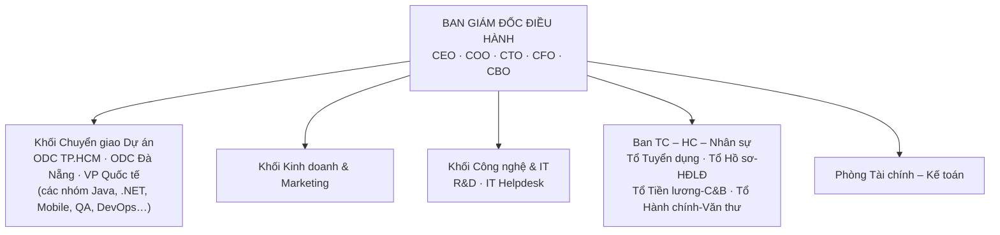
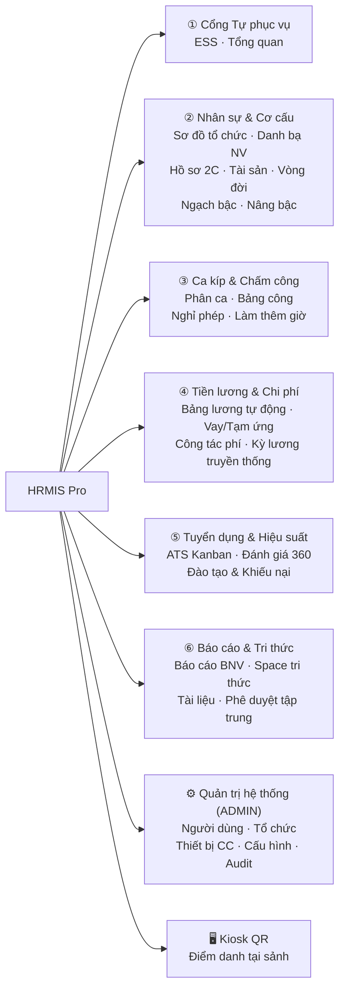

# HRMIS — TỔNG QUAN HỆ THỐNG & HƯỚNG DẪN NGHIỆP VỤ

> **Tài liệu này trả lời 4 câu hỏi, theo đúng thứ tự một người mới cần biết:**
> 1. Hệ thống này **là gì** và gồm những gì?
> 2. **Ai** sử dụng hệ thống và mỗi người làm được gì?
> 3. Các **quy trình nghiệp vụ** vận hành thế nào từ đầu đến cuối?
> 4. Từng **trang trên màn hình** dùng để làm gì và ai được dùng?
>
> Phần kỹ thuật (kiến trúc, cơ sở dữ liệu, API, kế hoạch triển khai) nằm ở tài liệu bạn đọc kèm: [`doc/KMS_PLAN.md`](KMS_PLAN.md).

---

## MỤC LỤC

1. [Hệ thống này là gì?](#1-hệ-thống-này-là-gì)
2. [Bối cảnh doanh nghiệp (tóm tắt)](#2-bối-cảnh-doanh-nghiệp-tóm-tắt)
3. [Các đối tượng sử dụng hệ thống](#3-các-đối-tượng-sử-dụng-hệ-thống)
4. [Bản đồ chức năng toàn hệ thống](#4-bản-đồ-chức-năng-toàn-hệ-thống)
5. [Các quy trình nghiệp vụ cốt lõi](#5-các-quy-trình-nghiệp-vụ-cốt-lõi)
6. [Danh mục trang — chức năng & đối tượng sử dụng](#6-danh-mục-trang--chức-năng--đối-tượng-sử-dụng)
7. [Chạy thử hệ thống — tài khoản demo](#7-chạy-thử-hệ-thống--tài-khoản-demo)
8. [Bảng thuật ngữ](#8-bảng-thuật-ngữ)

---

## 1. Hệ thống này là gì?

**Một câu:** HRMIS (Human Resource Management Information System) là ứng dụng web quản trị nhân lực trọn vòng đời cho Công ty CP Phần mềm Saigon Technology — từ lúc một ứng viên nộp hồ sơ, qua chấm công – tính lương – đánh giá hằng ngày, đến khi nhân viên nghỉ việc và hồ sơ được lưu trữ; kèm theo đó là kho tri thức nội bộ và bộ quản lý hồ sơ cán bộ theo mẫu nhà nước.

Hệ thống hợp nhất **3 miền chức năng trong một lần đăng nhập duy nhất**:

| Miền | Trả lời câu hỏi | Ví dụ chức năng |
| --- | --- | --- |
| **① Nhân sự doanh nghiệp (lõi)** | Người ta vào công ty, làm việc, được trả lương và rời công ty như thế nào? | Tuyển dụng ATS, hợp đồng, chấm công, nghỉ phép, làm thêm giờ, bảng lương, đánh giá hiệu suất, đào tạo, thôi việc |
| **② Tri thức nội bộ (KMS)** | Tri thức quy trình nằm ở đâu để người mới tự tìm ra mà không phải hỏi lại từ đầu? | Không gian tri thức (Space), bài viết có luồng duyệt, tìm kiếm toàn văn, lộ trình hội nhập, checklist bàn giao |
| **③ Cán bộ – công chức chuẩn BNV** | Quản lý lý lịch và ngạch bậc lương theo mẫu Bộ Nội Vụ? | Hồ sơ 2C-BNV/2008 (111 thuộc tính), 184 ngạch lương Nghị định 204, báo cáo Biểu 01–03 |

### Năm nguyên tắc xuyên suốt (giải thích "vì sao hệ thống thiết kế như vậy")

1. **Một nguồn dữ liệu gốc:** mọi phân hệ đọc/ghi trên cùng một hồ sơ nhân viên trung tâm — hết cảnh ba bảng Excel ba con số không khớp nhau.
2. **Cây tổ chức là dữ liệu cấu hình:** mở phòng ban mới, điều chuyển nhân sự đều làm trên màn hình, không cần sửa mã nguồn.
3. **Mọi đề xuất đi qua một luồng chuẩn:** *Đề xuất → Thẩm định (nhân sự) → Phê duyệt → Ban hành*, mỗi bước ghi vết ai – lúc nào – ý kiến gì.
4. **Dữ liệu pháp lý bất biến:** nhật ký kiểm toán chỉ thêm không sửa/xóa; bảng lương đã khóa không thể tính lại; bài viết đã xuất bản chỉ sửa bằng phiên bản mới.
5. **Tự phục vụ:** nhân viên tự điểm danh, tự xin phép, tự tra phiếu lương — không phải ra quầy văn thư.

### Thông số nhanh

| Chỉ số | Giá trị |
| --- | --- |
| Số trang màn hình (frontend) | ~46 trang |
| Số module nghiệp vụ (backend) | 35 module |
| Vai toàn cục | ADMIN · KM_MANAGER · USER |
| Cách chạy | `docker compose up -d` → mở `http://localhost:8080` |
| Chuẩn pháp lý bám theo | Bộ luật Lao động 2019, Luật BHXH, Luật Thuế TNCN, NĐ 145/2020, NĐ 204/2004, Mẫu 2C-BNV/2008 |

---

## 2. Bối cảnh doanh nghiệp (tóm tắt)

**Saigon Technology (STS Software)** — công ty phần mềm Việt Nam:

- **Quy mô:** khoảng 430 kỹ sư và nhân viên; hai trung tâm phát triển tại TP.HCM và Đà Nẵng; văn phòng đại diện tại Mỹ, Úc, Thụy Sĩ, Singapore.
- **Hoạt động:** gia công phần mềm và thuê đội ngũ kỹ sư cho khách hàng quốc tế; hơn 850 dự án cho hơn 350 khách hàng; đạt chứng nhận ISO/IEC 27001.
- **Nghịch lý dẫn tới dự án:** toàn bộ mảng nhân sự chỉ có khoảng **18 người** phục vụ hơn **400 người**, trong khi mọi thứ trước đây chạy bằng giấy tờ + Excel + email: tờ trình in giấy chờ ký, hồ sơ gốc thất lạc, chấm công ghép tay từ nhiều máy, bảng lương tính tay, ứng viên nằm trong Excel cá nhân từng người.

→ Hệ thống này số hóa toàn bộ chuỗi việc đó. (Phân tích đầy đủ về lịch sử công ty, chứng nhận, ma trận tác động giữa các bộ phận xem `doc/PTTK_OOP_HR.md`.)

### Sơ đồ tổ chức (rút gọn)



Trong phần mềm, cây tổ chức này được tạo và chỉnh trực tiếp trên trang **Cơ cấu tổ chức** (`/admin/org-units`) — không cài cứng vào code.

---

## 3. Các đối tượng sử dụng hệ thống

### 3.1. Từ bộ phận thật → vai trong phần mềm

| # | Đối tượng nghiệp vụ | Vai trong hệ thống | Họ dùng hệ thống để làm gì |
| --- | --- | --- | --- |
| 1 | **Toàn thể nhân viên** | `USER` | Điểm danh (web/QR/khuôn mặt), xin nghỉ phép, đăng ký làm thêm giờ, gửi giải trình giờ công, xem phiếu lương, khai chi phí công tác, xin vay/tạm ứng, xem tài sản đang giữ, ghi danh đào tạo, gửi khiếu nại, đọc/soạn bài tri thức, hoàn thành lộ trình hội nhập |
| 2 | **Trưởng dự án / trưởng bộ phận** | `USER` (+ quyền đề xuất & xác nhận) | Tất cả của nhân viên, cộng thêm: lập phiếu đề xuất tuyển dụng, đánh giá thử việc & hiệu suất cấp dưới, phê duyệt giải trình giờ công của nhóm, xác nhận bàn giao khi có người nghỉ |
| 3 | **Ban TC–HC–NS (chuyên viên nhân sự)** | `KM_MANAGER` | "Van điều phối" của mọi nghiệp vụ: duyệt đơn phép / OT / tuyển dụng / biến động nhân sự / khoản vay / chi phí; quản lý hợp đồng – văn bằng chứng chỉ; chạy kỳ lương; quản lý ca kíp, đào tạo, tài sản; quản trị kho tài liệu, lộ trình hội nhập, bàn giao; xuất báo cáo BNV |
| 4 | **Ban Giám đốc** | `ADMIN` (hoặc quyền xem + duyệt) | Xem bảng điều khiển điều hành thời gian thực; phê duyệt cấp cao; **khóa kỳ lương** (bước bất biến cuối cùng) |
| 5 | **Quản trị viên hệ thống** | `ADMIN` | Tạo/quản lý tài khoản, dựng cây tổ chức, kết nối thiết bị chấm công, hiệu chỉnh bản ghi công lệch (có lý do, có vết), cấu hình tham số, tra nhật ký kiểm toán |
| 6 | **Ứng viên bên ngoài** | *(không đăng nhập)* | Hồ sơ do nhân sự nhập vào ống dẫn tuyển dụng ATS thay |
| 7 | **Thiết bị chấm công / Kiosk** | Thiết bị | Đẩy sự kiện điểm danh vào hệ thống qua webhook HMAC hoặc import CSV; kiosk QR hiển thị mã xoay 30 giây |

> **Ghi chú thực tế triển khai:** hệ thống chỉ dùng 3 vai toàn cục. "Giám đốc" và "Quản trị viên" chung vai `ADMIN`; "chuyên viên nhân sự" là `KM_MANAGER`. Riêng miền tri thức (Space) có thêm vai theo từng không gian: `MANAGER` / `EDITOR` / `CONTRIBUTOR` / `VIEWER`.

### 3.2. Ma trận quyền rút gọn

| Việc cần làm | USER | KM_MANAGER | ADMIN |
| --- | :-: | :-: | :-: |
| Điểm danh, xin phép, đăng ký OT, xem phiếu lương **của mình** | ✔ | ✔ | ✔ |
| Soạn bài trong Space (cần vai CONTRIBUTOR trở lên của Space đó) | theo Space | ✔ | ✔ |
| Duyệt đơn phép / OT / tuyển dụng / biến động / vay / chi phí | ✖ | ✔ | ✔ |
| Quản lý hợp đồng, kỳ lương, ca kíp, đào tạo, tài sản, kho tài liệu | ✖ | ✔ | ✔ |
| **Khóa kỳ lương**, hiệu chỉnh bảng công, quét nâng bậc | ✖ | ✖ | ✔ |
| Tài khoản, cây tổ chức, thiết bị chấm công, tham số, audit log | ✖ | ✖ | ✔ |
| Xem báo cáo Biểu 01–03, danh sách nâng bậc | ✖ | ✔ | ✔ |

---

## 4. Bản đồ chức năng toàn hệ thống

Menu bên trái ứng dụng chia thành **6 nhóm nghiệp vụ + nhóm Quản trị + Kiosk**. Bản đồ dưới đây trùng khớp 1-1 với menu thật:



| Nhóm | Giải quyết việc gì | Ai dùng chính |
| --- | --- | --- |
| ① Cổng Tự phục vụ | Mọi thứ cá nhân nhân viên tự làm được | Toàn bộ nhân viên |
| ② Nhân sự & Cơ cấu | Quản lý "con người": danh bạ, hợp đồng, hồ sơ lý lịch, tài sản, các quyết định nhân sự | Nhân sự (HR); nhân viên xem phần của mình |
| ③ Ca kíp & Chấm công | Quản lý giờ làm: phân ca, bảng công, phép, OT | Toàn bộ (gửi đơn); HR (duyệt) |
| ④ Tiền lương & Chi phí | Quản lý "tiền": tính lương, vay, công tác phí | HR tính & duyệt; nhân viên nhận & tra cứu |
| ⑤ Tuyển dụng & Hiệu suất | Vào – ra và phát triển năng lực | Trưởng bộ phận (đề xuất); HR (vận hành) |
| ⑥ Báo cáo & Tri thức | Mẫu biểu nhà nước + kho tri thức nội bộ | HR/ADMIN (báo cáo); toàn bộ (tri thức) |
| ⚙ Quản trị | Hạ tầng hệ thống | ADMIN |
| 🖥 Kiosk | Điểm danh tại cửa | Màn hình đặt sảnh + điện thoại nhân viên |

---

## 5. Các quy trình nghiệp vụ cốt lõi

> Mỗi quy trình dưới đây được đánh số **5.1 → 5.14** để tham chiếu chéo, và được trình bày **từ thực tế doanh nghiệp** rồi mới đến **cách hệ thống số hóa**, gồm 4 khối cố định:
> - **Vì sao có quy trình này** — động cơ kinh doanh/pháp lý khiến nó phải tồn tại;
> - **Thực tế doanh nghiệp tổ chức ra sao** — các bộ phận phối hợp với nhau như thế nào ngoài đời thật (trước khi có hệ thống);
> - **Khi nào thực hiện** — thời điểm/cứu chừng kích hoạt;
> - **Các bước trên hệ thống** — ai làm gì, trên trang nào, dữ liệu chuyển trạng thái thế nào.

### 5.1. Quy trình Tuyển dụng → Ngày nhận việc

**Vì sao có quy trình này:** công ty phần mềm tăng trưởng theo dòng chảy dự án. Khi nhận thêm giai đoạn mới của hợp đồng (ví dụ khách Úc cần thêm 2 lập trình viên Flutter và 1 kiểm thử viên) hoặc khi có người nghỉ đột xuất, nhóm dự án **thiếu người ngay lập tức** — tuyển chậm nghĩa là tiến độ trễ, khách hàng phạt hợp đồng, Khối Kinh doanh mất uy tín. Ngược lại tuyển thừa người là chi phí nhân sự chết.

**Thực tế doanh nghiệp tổ chức ra sao:** quy trình khởi phát từ đáy cây tổ chức và leo dần lên đỉnh quyền lực, kéo theo 4–5 bộ phận:
1. **Trưởng dự án** (người nắm rõ nhất đội ngũ mình) phát hiện thiếu hụt, lập Phiếu đề xuất tuyển dụng ghi rõ vị trí, số lượng, kỹ năng, thời gian cần người, lý do — gửi Ban TC–HC–NS;
2. **Ban TC–HC–NS** thẩm định phiếu đối chiếu định biên lao động năm và ngân sách quỹ lương (**phối hợp Phòng Kế toán xác nhận khả năng chi**), cân nhắc luân chuyển nội bộ trước khi tuyển ngoài, rồi soạn tờ trình tổng hợp nhu cầu cả quý;
3. **Ban Giám đốc** ký duyệt chỉ tiêu — điểm nghẽn kinh điển: Giám đốc đang công tác ở văn phòng Mỹ thì tờ trình in giấy nằm chờ cả tuần;
4. Chỉ tiêu được duyệt mới có giá trị thi hành: **tổ Tuyển dụng** đăng tin đa kênh (LinkedIn, VietnamWorks, TopCV, website, kênh đại học cho thực tập sinh); CV đổ về hộp thư chung, trạng thái từng ứng viên nằm trong bảng Excel cá nhân từng nhân viên phụ trách;
5. **Sàng lọc → phỏng vấn 2 vòng:** Trưởng dự án phỏng vấn chuyên môn vòng 1; lãnh đạo khối phỏng vấn vòng 2 với vị trí cao cấp; kết quả ghi vào phiếu đánh giá viết tay;
6. **Xếp lương & Offer:** Ban TC–HC–NS xếp lương theo thang bảng (vượt khung thì trình Giám đốc ký riêng) — mức lương này theo suốt vòng đời nhân viên, ghi sai là tranh chấp sớm muộn.

**Khi nào thực hiện:** đột xuất theo nhu cầu dự án (gộp thành tờ trình theo quý); mùa tuyển sinh đại học hàng năm cho vị trí thực tập sinh.

**Các bước trên hệ thống:**

| Bước | Ai làm | Trên trang nào | Kết quả |
| --- | --- | --- | --- |
| 1. Lập phiếu đề xuất tuyển (vị trí, số lượng, lý do) | Trưởng bộ phận | Tuyển dụng ATS → tab Vị trí | Phiếu ở trạng thái *Chờ thẩm định* |
| 2. Thẩm định & phê duyệt chỉ tiêu | HR | Tuyển dụng ATS | Phiếu *Đã duyệt* → mở vị trí tuyển |
| 3. Tiếp nhận ứng viên đa kênh, kéo thả qua các vòng | HR | Tuyển dụng ATS — bảng Kanban | Ứng viên di chuyển: *Tiếp nhận → Sàng lọc → PV vòng 1 → PV vòng 2 → Offer* |
| 4. Ứng viên nhận việc → **bấm "Chuyển thành nhân viên"** | HR | Tuyển dụng ATS | Tự sinh hồ sơ nhân viên + hợp đồng thử việc + kích hoạt onboarding (mục 5.13) |

Trạng thái phiếu: `DRAFT → PENDING_REVIEW → APPROVED / REJECTED / CLOSED`.

### 5.2. Quy trình Vòng đời nhân viên & biến động

**Vì sao có quy trình này:** mỗi nhân viên là một **hồ sơ pháp lý sống** — hợp đồng lao động, quyết định xếp lương, BHXH, các quyết định khen thưởng/kỷ luật — đều phải đúng thủ tục tại đúng thời điểm. Sai thủ tục (ví dụ kỷ luật không lấy ý kiến đại diện người lao động) là rủi ro thua kiện lao động; trễ hợp đồng chính thức là mất niềm tin của người mới.

**Thực tế doanh nghiệp tổ chức ra sao:** toàn bộ vòng đời đang "chạy" bằng khoảng 15 loại biểu mẫu giấy, tối thiểu 3 cuốn sổ tay (sổ mục kê hồ sơ, sổ mượn–trả, sổ theo dõi quyết định) và vô số Excel:
- **Thử việc 1–3 tháng** tùy vị trí (fresher/thực tập sinh ~2 tháng là phổ biến ngành): Trưởng dự án là người nắm dữ liệu thực tế, cuối kỳ lập Phiếu đánh giá thử việc — nếu phiếu trễ thì hợp đồng chính thức trễ theo, nguyên nhân nghỉ việc âm thầm rất phổ biến;
- **Đang làm:** phát sinh các biến động — thăng chức/bổ nhiệm, điều chuyển giữa hai trung tâm TP.HCM ↔ Đà Nẵng (cần biên bản bàn giao giữa hai Trưởng dự án, đổi quyền truy cập hệ thống), khen thưởng (thưởng chuyển Kế toán nhập vào kỳ lương), kỷ luật (thủ tục pháp lý nghiêm ngặt);
- **Thôi việc:** đơn xin thôi việc phải báo trước **30 ngày** (hợp đồng xác định thời hạn) hoặc **45 ngày** (không xác định thời hạn); sau đó người nghỉ phải lần lượt xin **4 chữ ký xác nhận**: Trưởng dự án (bàn giao việc) → Tổ Hành chính (thu hồi tài sản) → IT Helpdesk (thu hồi toàn bộ tài khoản — yêu cầu sống còn với cam kết ISO 27001) → Kế toán (quyết toán) → Ban TC–HC–NS mới phát hành Quyết định chấm dứt hợp đồng.

**Khi nào thực hiện:** ký hợp đồng thử việc ngay ngày nhận việc; đánh giá cuối kỳ thử việc; biến động bất kỳ lúc nào theo quyết định; thôi việc theo đơn của người lao động hoặc nghỉ hưu đủ tuổi.

**Trạng thái vòng đời (hệ thống cưỡng chế đúng thứ tự):**

```
Ứng viên ──ký HĐ thử việc──▶ THỬ VIỆC ──đánh giá đạt──▶ CHÍNH THỨC ──┬─▶ THÔI VIỆC/NGHỈ HƯU ──▶ LƯU TRỮ
                        └─không đạt─▶ DỪNG THỬ VIỆC                  └─(biến động: thăng chức,
                                                                      điều chuyển, khen thưởng,
                                                                      kỷ luật, điều chỉnh lương)
```

| Việc | Ai làm | Trên trang nào |
| --- | --- | --- |
| Tạo/sửa hồ sơ, hợp đồng, văn bằng chứng chỉ | HR | Danh sách nhân sự → chi tiết nhân viên |
| Ra quyết định thăng chức / điều chuyển / khen thưởng / kỷ luật / điều chỉnh lương | HR duyệt (ai cũng đề xuất được) | Vòng đời & Quyết định; Biến động nhân sự |
| Đơn thôi việc → duyệt → **tự sinh checklist bàn giao** | Nhân viên nộp; ADMIN duyệt | Biến động nhân sự → rồi sang trang Bàn giao công việc (mục 5.13) |

### 5.3. Quy trình Chấm công hằng ngày & xử lý bản ghi lệch

**Vì sao có quy trình này:** bảng công là **đầu vào của tiền lương** — sai phút đi muộn là sai tiền. Công ty phân tán ở hai thành phố, nhiều ca làm việc, có nhân sự làm việc ngay tại trụ sở khách hàng nước ngoài, nên dữ liệu giờ công đến từ rất nhiều nguồn khác nhau.

**Thực tế doanh nghiệp tổ chức ra sao:** máy vân tay/khuôn mặt đặt tại các văn phòng TP.HCM và Đà Nẵng **xuất file** cuối kỳ; Tổ Tiền lương – C&B ngồi **ghép tay** file máy với lịch dự án (ca làm việc, OT được Trưởng dự án duyệt trước), đơn phép năm, đơn nghỉ ốm có xác nhận… để lập Bảng chấm công tổng hợp. Bản ghi lệch (quên quẹt, quẹt giúp đồng nghiệp) xử lý bằng lời miệng hoặc tin nhắn — vừa tốn công vừa không có vết.

**Khi nào thực hiện:** điểm danh hằng ngày vào/ra; cuối kỳ **khóa công ngày 25 hàng tháng** để chuyển sang tính lương (mục 5.6).

**Các nguồn điểm danh trên hệ thống:**

| Nguồn | Cách hoạt động | Trang liên quan |
| --- | --- | --- |
| Web | Bấm điểm danh ngay trên trang | `/attendance`, `/ess` |
| QR tại Kiosk | Màn hình sảnh hiển thị mã **xoay mỗi 30 giây**; nhân viên quét bằng điện thoại → xác nhận | `/kiosk` → `/check-in` |
| Khuôn mặt | Đăng ký mẫu khuôn mặt (có đồng thuận) → điểm danh bằng webcam | `/attendance` |
| Máy chấm công | Thiết bị đẩy sự kiện qua webhook ký HMAC, hoặc import file CSV | `/admin/attendance` |

Sau đó hệ thống **tự động**: ghi sự kiện thô **bất biến** (không ai sửa được dấu vết gốc) → tổng hợp thành **bảng công ngày** (giờ vào/ra, phút đi muộn/về sớm, trạng thái).

Khi có vấn đề:

| Tình huống | Ai xử lý | Trên trang nào |
| --- | --- | --- |
| Quên chấm công / đi công tác ngoài trụ sở | Nhân viên gửi **Giải trình bổ sung công** → quản lý duyệt → bù công | `/ess` |
| Dữ liệu sai cần sửa tay | ADMIN hiệu chỉnh **bắt buộc ghi lý do**, để lại vết | `/admin/attendance` |

### 5.4. Quy trình Nghỉ phép

**Vì sao có quy trình này:** nghỉ phép năm là quyền lợi pháp lý bắt buộc (**12 ngày + 1 ngày cho mỗi 5 năm thâm niên** — Điều 113–114 BLLĐ 2019), nhưng đồng thời là bài toán cân bằng nhân lực: một người trong nhóm 5 người nghỉ 2 tuần có thể làm trễ dự án, nên phải có người có thẩm quyền duyệt và nhìn thấy quỹ của cả nhóm.

**Thực tế doanh nghiệp tổ chức ra sao:** nhân viên viết đơn giấy → xin chữ ký trưởng nhóm → nộp Tổ Tiền lương – C&B. Người lao động **không bao giờ biết chắc mình còn bao nhiêu ngày phép** (sổ phép là Excel của HR); HR đối soát tay đơn giấy với sổ Excel; duyệt xong phải nhớ tay trừ quỹ và báo Tổ chấm công ghi công phép — ba chỗ ghi ba số, lệch nhau là chuyện thường.

**Khi nào thực hiện:** đột xuất theo nhu cầu cá nhân (ốm, việc gia đình, cưới hỏi); quỹ phép tính theo năm dương lịch.

**Luồng trên hệ thống:**

- Loại đơn: phép năm / ốm / không lương / thai sản.
- Nhân viên tạo đơn (`/leave`) → **hệ thống kiểm quỹ, chặn đơn vượt quỹ ngay khi gửi** → HR duyệt → **quỹ bị trừ NGAY** + ngày phép được ghi vào bảng chấm công.
- Nhân viên tra cứu quỹ còn lại của mình tại `/leave` hoặc `/ess`.

### 5.5. Quy trình Làm thêm giờ

**Vì sao có quy trình này:** deadline dự án khiến OT diễn ra thường xuyên, nhưng pháp luật yêu cầu nghiêm ngặt: phải **duyệt trước**, trả hệ số cao hơn giờ ngày thường, và giới hạn trần để bảo vệ sức khỏe người lao động. Không kiểm soát thì vừa vi phạm luật vừa mất kiểm soát chi phí.

**Thực tế doanh nghiệp tổ chức ra sao:** nhân viên đăng ký qua giấy/email xin Trưởng dự án duyệt; cuối tháng Tổ C&B đối soát **tay** giữa các đăng ký rải rác với file máy chấm công — giờ đã làm nhưng chưa kịp duyệt gây tranh cãi khi nhận lương.

**Khi nào thực hiện:** đột xuất theo tiến độ dự án; trần pháp lý ≤ 40h/tháng, ≤ 200h/năm.

**Luồng trên hệ thống:**

- Nhân viên đăng ký (`/overtime`) → HR duyệt → giờ OT đã duyệt tự chảy vào bảng lương (mục 5.6).
- Hệ số theo luật: **150%** ngày thường · **200%** cuối tuần · **300%** lễ Tết; hệ thống giám sát trần và cảnh báo vi phạm.

### 5.6. Quy trình Chu kỳ lương hàng tháng

**Vì sao có quy trình này:** trả lương đúng hạn, đúng luật là nghĩa vụ bắt buộc hàng tháng — và cũng là việc phức tạp nhất vì phải gộp nhiều nguồn: bảng công, OT đã duyệt, đơn phép, quyết định khen thưởng/kỷ luật, khoản vay, BHXH, thuế TNCN theo biểu lũy tiến.

**Thực tế doanh nghiệp tổ chức ra sao:** Tổ C&B ghép tay dữ liệu chấm công (mục 5.3) vào bảng tính Excel nhiều sheet; Phòng Kế toán đối chiếu bản in; bảng lương in giấy trình Giám đốc ký; lỗi kinh điển là **ba bảng Excel ba con số không khớp** (bảng của HR ≠ bảng của kế toán ≠ bảng của trưởng nhóm). Sau khi phát lương, mọi điều chỉnh sai phải làm bằng "quyết toán tay" không có vết.

**Khi nào thực hiện:** chu kỳ cố định hàng tháng — **khóa công ngày 25 → tính nháp → Kế toán đối chiếu → Giám đốc duyệt → khóa bảng lương → lệnh chuyển khoản ngân hàng ngày phát lương**.

**Các bước trên hệ thống:**

| Bước | Ai làm | Trên trang nào | Diễn ra gì |
| --- | --- | --- | --- |
| 1. Chốt dữ liệu công cuối kỳ | HR | `/shifts`, `/attendance` | Bảng công + OT đã duyệt + đơn phép là đầu vào |
| 2. Chạy tính lương ("1-Click Xử lý") | HR | Bảng lương Tự động `/payroll-engine` | Hệ thống lấy lương cơ bản theo cấu trúc lương + OT → **tổng thu nhập** |
| 3. Khấu trừ luật định (tự động) | Hệ thống | — | BHXH 8% + BHYT 1,5% + BHTN 1% = **10,5%**; thuế TNCN **lũy tiến 7 bậc** (giảm trừ 11 triệu + 4,4 triệu/người phụ thuộc); trừ góp vay EMI nếu có (≤ 30% thực lĩnh) |
| 4. Đối chiếu số liệu | HR | `/payroll-engine`, `/payroll` | Kiểm tra phiếu lương từng người |
| 5. **Khóa kỳ** | ADMIN | `/payroll` | Kỳ chuyển `LOCKED` — **không thể tính lại** (hệ thống chặn bằng lỗi 409) |
| 6. Tra cứu phiếu lương điện tử | Nhân viên | `/ess`, tab cá nhân của `/payroll` | Xem breakdown thu nhập – khấu trừ – thực lĩnh; in phiếu A4 |
| 7. Xuất bảng kê chi lương | HR | `/payroll-engine` | File cho ngân hàng chuyển khoản |

Trạng thái kỳ lương (bản truyền thống `/payroll`): `OPEN → CALCULATED → REVIEWED → LOCKED`. Sau khi khóa, mọi điều chỉnh phải qua quyết định riêng — tuyệt đối không sửa ngầm.

### 5.7. Quy trình Tạm ứng & khoản vay phúc lợi

**Vì sao có quy trình này:** khoản vay/tạm ứng nội bộ là phúc lợi giữ chân người (lãi suất ưu đãi hơn ngân hàng, thủ tục nhanh), nhưng nếu không kiểm soát sẽ rủi ro nợ xấu nội bộ; pháp luật cũng cứng: **khấu trừ nợ hàng tháng không được vượt quá 30% lương thực lĩnh** (Điều 102 BLLĐ 2019) để bảo đảm người lao động còn tiền sống.

**Thực tế doanh nghiệp tổ chức ra sao:** nhân viên làm đơn giấy xin lãnh đạo duyệt; Kế toán theo dõi dư nợ trên một sheet Excel riêng và **tự trừ tay** vào bảng lương mỗi tháng — người nghỉ việc mà còn nợ là chuyện lúng túng khi quyết toán.

**Khi nào thực hiện:** đột xuất theo nhu cầu cá nhân (mua thiết bị, y tế, việc gia đình); kỳ hạn trả góp 1–24 tháng.

**Luồng trên hệ thống:**

- Nhân viên tạo đơn vay/tạm ứng (`/loans`) → HR thẩm định: hệ thống **tự tính EMI và chặn nếu vượt 30% thực lĩnh** → duyệt giải ngân.
- Khoản EMI **tự động nạp vào bảng lương** mỗi tháng cho đến hết nợ; dư nợ theo dõi ngay trên trang; nhân viên xem tiến độ trả nợ của mình tại `/ess`.

### 5.8. Quy trình Công tác phí

**Vì sao có quy trình này:** đặc thù gia công phần mềm cho khách hàng bốn châu lục — nhân viên thường xuyên đi gặp khách, làm việc tại trụ sở khách, đi đào tạo onsite. Chi phí công tác là khoản chi lớn cần chứng từ đầy đủ để hạch toán và quyết toán thuế.

**Thực tế doanh nghiệp tổ chức ra sao:** đề xuất chuyến đi bằng email xin duyệt → tạm ứng tiền mặt từ Kế toán → đi về giữ hóa đơn giấy → lập bảng kê Excel cuối chuyến → nộp Kế toán đối chiếu từng tờ; thất lạc hóa đơn là tự chịu.

**Khi nào thực hiện:** theo từng chuyến đi; quyết toán ngay sau khi kết thúc chuyến.

**Luồng trên hệ thống:** đề xuất chuyến công tác (`/expense-claims`) → duyệt lịch trình → **tạm ứng kinh phí** → đi công tác → lập **bảng kê chi phí + chứng từ** → duyệt quyết toán → số liệu chuyển xuống kỳ lương/kế toán.

### 5.9. Quy trình Tài sản – thiết bị

**Vì sao có quy trình này:** laptop, màn hình, thiết bị kiểm thử là tài sản giá trị lớn; trách nhiệm vật chất của người sử dụng được luật hóa (Điều 129–130 BLLĐ 2019 — bắt buộc biên bản bàn giao 2 bên); với công ty đạt ISO 27001, kiểm soát thiết bị còn là yêu cầu an ninh thông tin.

**Thực tế doanh nghiệp tổ chức ra sao:** Tổ Hành chính giữ sổ tài sản giấy; ngày nhận việc bàn giao laptop kèm biên bản ký tay; khi người nghỉ việc, Hành chính phải nhớ hỏi "cậu còn giữ gì của công ty không?" — thiếu biên bản là không rõ trách nhiệm khi thiết bị hỏng/mất.

**Khi nào thực hiện:** khi đăng ký mua mới; khi cấp phát cho nhân viên (nhận việc/chuyển vị trí); khi thu hồi (chuyển việc/thôi việc/thanh lý).

**Luồng trên hệ thống:** đăng ký tài sản (`/assets`) → **cấp phát kèm biên bản bàn giao** khi nhân viên nhận việc → trạng thái *Đang sử dụng* → **thu hồi về kho** khi chuyển vị trí/thôi việc (liên kết checklist bàn giao — mục 5.13). Nhân viên xem tài sản mình đang giữ tại `/ess`.

### 5.10. Quy trình Đánh giá hiệu suất → tăng lương & nâng bậc

**Vì sao có quy trình này:** trong ngành mà nhân tài luôn bị săn đón, tăng lương minh bạch và đúng lúc là công cụ giữ chân quan trọng nhất; ngược lại đánh giá cảm tính là nguồn bất mãn. Kết quả đánh giá còn là căn cứ pháp lý cho quyết định tăng lương.

**Thực tế doanh nghiệp tổ chức ra sao:** Trưởng dự án lập bảng đánh giá viết tay (đóng góp dự án, chứng chỉ mới) → Ban TC–HC–NS tổng hợp thành tờ trình → Giám đốc duyệt → phát hành quyết định nâng bậc, ký phụ lục hợp đồng, cập nhật sổ lương. Riêng nâng bậc theo chuẩn nhà nước (NĐ 204), người đủ điều kiện hay bị **sót** vì không ai nhớ chính xác ngày hưởng bậc của từng người.

**Khi nào thực hiện:** đánh giá hiệu suất **chu kỳ 6 tháng/lần** (thói quen phổ biến của ngành CNTT) hoặc đột xuất khi thăng chức; nâng bậc lương NĐ 204 theo thời gian giữ bậc **36 tháng** (ngạch đại học A1/A2/A3) hoặc **24 tháng** (ngạch B/C) — hệ thống quét định kỳ.

**a) Đánh giá hiệu suất trên hệ thống:**

1. HR tạo kỳ đánh giá, gán mục tiêu **KRA/KPI theo trọng số %** (`/performance-360`);
2. Nhân viên **tự đánh giá** + nhận **phản hồi 360 độ** từ đồng nghiệp/quản lý;
3. Quản lý chấm điểm → nhân viên **xác nhận** (acknowledge);
4. Kết quả là căn cứ cho tờ trình tăng lương định kỳ.

**b) Nâng bậc lương theo Nghị định 204 trên hệ thống:**

- Trang `/salary-progression` **tự động quét** những người đủ thời gian giữ bậc (36/24 tháng) — hết cảnh sót người;
- Sinh danh sách đề nghị nâng bậc → duyệt → cập nhật ngạch/bậc/hệ số;
- Đã chạm bậc trần: tính **phụ cấp thâm niên vượt khung 5%**, năm sau cộng thêm 1%/năm;
- Danh mục 184 ngạch xem/quản lý tại `/salary-ranks`.

### 5.11. Quy trình Đào tạo & khiếu nại

**Vì sao có quy trình này:** công nghệ biến đổi nhanh và chứng chỉ có hạn hiệu lực (AWS, PMP, tiếng Anh) — không chủ động đào tạo thì đội ngũ tụt hậu so với yêu cầu dự án; còn kênh khiếu nại/kiến nghị chính thức giúp giải quyết mâu thuẫn sớm, giảm nghỉ việc và tuân thủ tinh thần luật lao động.

**Thực tế doanh nghiệp tổ chức ra sao:** khảo sát nhu cầu học bằng email, danh sách ghi danh là sheet Excel chia sẻ — đăng quá chỗ không ai chặn; khiếu nại thì "kể với HR nghe" bằng miệng, xử lý đến đâu không có hồ sơ.

**Khi nào thực hiện:** kế hoạch đào tạo theo quý/năm; ghi danh khi mở lớp; khiếu nại đột xuất (cam kết phản hồi trong 24h).

**Luồng trên hệ thống:**

- **Đào tạo:** HR lập chương trình (`/training-grievance`) → nhân viên ghi danh (hệ thống chặn khi hết chỗ) → hoàn thành → khảo sát hài lòng.
- **Khiếu nại/kiến nghị:** nhân viên gửi → HR tiếp nhận và xử lý → trạng thái *Đã giải quyết* — mọi bước có hồ sơ.

### 5.12. Quy trình Tri thức nội bộ: soạn → duyệt → xuất bản → tìm thấy

**Vì sao có quy trình này:** đây là bài toán gốc của công ty — lao động trí tuệ, tỷ lệ nghỉ việc cao, tri thức nằm trong đầu cá nhân: **mất người là mất tri thức**. Người mới cứ phải hỏi lại từ đầu những câu senior đã trả lời trăm lần; quy trình deploy đúng nằm trong đầu một người duy nhất.

**Thực tế doanh nghiệp tổ chức ra sao:** tài liệu rải rác Google Drive/đĩa mạng cá nhân, không ai biết phiên bản nào là chuẩn; quy trình quan trọng nhất chưa từng được viết ra vì "bận dự án"; người biết thì nghỉ việc mang theo tất cả.

**Khi nào thực hiện:** liên tục trong công việc hằng ngày — gặp vấn đề mới giải xong là viết lại runbook; bài quan trọng có chu kỳ xem lại định kỳ để không lỗi thời.

**Các bước trên hệ thống:**

```
Soạn bài (Nháp) ──Trình duyệt──▶ CHỜ DUYỆT ──Duyệt──▶ ĐÃ XUẤT BẢN ──Lưu trữ──▶ KHÓA LƯU
      ▲                            │
      └──────Yêu cầu chỉnh sửa─────┘
```

| Bước | Ai làm | Trên trang nào |
| --- | --- | --- |
| Soạn bài trong Space (Markdown + đính kèm) | Thành viên CONTRIBUTOR trở lên | Không gian tri thức → Soạn bài |
| Trình duyệt / Duyệt / Yêu cầu chỉnh sửa (kèm ý kiến) | Tác giả / MANAGER của Space | Phê duyệt tập trung `/review` |
| Đọc, bình luận hỏi–đáp, đánh giá hữu ích | Toàn bộ | Trang bài viết |
| Tìm kiếm toàn văn (tiêu đề + nội dung + tag) | Toàn bộ | `/search` |
| Tìm "ai giỏi về X" theo hồ sơ chuyên môn | Toàn bộ | `/people` |

Quy tắc vàng: **bài đã xuất bản không bao giờ bị sửa đè** — mỗi lần sửa sinh một phiên bản mới, giữ nguyên lịch sử và có thể khôi phục lại bản cũ.

### 5.13. Quy trình Hội nhập & bàn giao khi nghỉ việc

**Vì sao có quy trình này:** hai thời điểm rủi ro nhất của vòng đời nhân viên. **Ngày nhận việc** cần ít nhất 3 bộ phận đồng loạt (Tổ Hồ sơ tiếp nhận giấy tờ gốc + ký HĐ; IT cấp email/tài khoản Git/VPN; Hành chính bố trí chỗ ngồi, phát máy tính) — chậm một nhánh là người mới ngồi chơi cả tuần. **Ngày làm việc cuối** cần 4 xác nhận bàn giao — đặc biệt thu hồi tài khoản IT, nếu bỏ sót là lỗ hổng an ninh nghiêm trọng với công ty cam kết ISO 27001.

**Thực tế doanh nghiệp tổ chức ra sao:** điều phối hoàn toàn bằng lời nhắn qua nhóm chat nội bộ — hay quên mục, không ai biết checklist đã đủ chưa; người nghỉ việc tự "đi xin chữ ký" từng nơi; checklist bàn giao không có mẫu chuẩn.

**Khi nào thực hiện:** đúng ngày nhận việc (onboarding) và trước ngày làm việc cuối (handover — kích hoạt ngay khi đơn thôi việc được duyệt, mục 5.2).

**Trên hệ thống:**

- **Hội nhập (Onboarding):** HR tạo *lộ trình đọc bắt buộc* theo vị trí → nhân viên mới thấy nhiệm vụ của mình tại `/onboarding` và tick tiến độ từng bài.
- **Bàn giao (Handover):** khi đơn thôi việc được duyệt, hệ thống **tự sinh checklist bàn giao** gồm các xác nhận bắt buộc: bàn giao công việc cho trưởng nhóm → thu hồi tài sản → thu hồi tài khoản IT → quyết toán kế toán → xóa mẫu khuôn mặt. Nhân viên nghỉ + các bên xác nhận tại `/handover`; **thiếu một mục là chưa thể đóng hồ sơ**.

### 5.14. Quy trình Hồ sơ cán bộ chuẩn BNV & báo cáo thống kê

**Vì sao có quy trình này:** bên cạnh quản trị nhân sự doanh nghiệp, hệ thống hỗ trợ cả mô hình quản lý cán bộ theo chuẩn nhà nước (Mẫu 2C-BNV/2008, NĐ 204) — phục vụ đơn vị cần cả hai mô hình, và đáp ứng câu hỏi thống kê kinh điển của lãnh đạo: *"Công ty đang có bao nhiêu lập trình viên Java cao cấp, bao nhiêu người sắp đủ tuổi nghỉ hưu?"*

**Thực tế doanh nghiệp tổ chức ra sao:** lý lịch nằm trong hồ sơ giấy cất tủ theo mã ngăn; muốn trả lời câu hỏi thống kê, Ban TC–HC–NS phải **đếm tay nửa ngày** — và câu trả lời có thể sai ngay tuần sau vì dữ liệu giấy không cập nhật; soạn một bộ sơ yếu lý lịch 4 trang là chép tay hàng giờ.

**Khi nào thực hiện:** nhập hồ sơ khi tiếp nhận/cập nhật biến động; báo cáo thống kê định kỳ theo yêu cầu cơ quan quản lý hoặc đột xuất theo yêu cầu lãnh đạo.

**Trên hệ thống:**

- HR nhập/quản lý **hồ sơ lý lịch 111 thuộc tính + 8 bảng quá trình lịch sử** (lương, bổ nhiệm, đào tạo, công tác, khen thưởng–kỷ luật, gia đình, đánh giá, hoạt động xã hội) tại `/personnel-profiles`.
- Xuất biểu mẫu chuẩn quốc gia tại `/personnel-reports`: **Sơ yếu lý lịch Mẫu 2C-BNV/2008** (PDF 4 trang) và **Biểu 01** (tuổi × ngạch), **Biểu 02** (ngoại ngữ), **Biểu 03** (trình độ × đơn vị) dạng Excel — trả lời câu hỏi thống kê trong vài giây thay vì đếm tay nửa ngày.

---

## 6. Danh mục trang — chức năng & đối tượng sử dụng

> Cách đọc: bảng liệt kê đúng theo menu bên trái ứng dụng. Cột "Ai dùng" nêu rõ vai; dấu ➕ nghĩa là ngoài xem còn thao tác được.

### 6.0. Trang ngoài khung đăng nhập

| Trang | Đường dẫn | Chức năng | Ai dùng |
| --- | --- | --- | --- |
| Đăng nhập | `/login` | Đăng nhập JWT; hỗ trợ `?next=` quay lại mã QR đang dở | Toàn bộ |
| **Kiosk điểm danh QR** | `/kiosk` | Màn hình full-screen hiển thị mã QR xoay 30 giây đặt tại sảnh/cửa | Màn hình kiosk (ai có link cũng mở được) |
| Xác nhận check-in | `/check-in` | Trang mở ra trên điện thoại sau khi quét QR — xác nhận và ghi sự kiện điểm danh | Nhân viên |

### 6.1. Nhóm "Cổng Tự Phục Vụ"

| Trang | Đường dẫn | Chức năng | Ai dùng |
| --- | --- | --- | --- |
| **Bàn làm việc ESS** | `/ess` | Siêu ứng dụng cá nhân: điểm danh nhanh, gửi giải trình bổ sung công, quỹ phép năm, phiếu lương điện tử, tài sản đang giữ, khoản vay & tiến độ trả nợ | ➕ Toàn bộ nhân viên |
| **Tổng quan hệ thống** | `/dashboard` | Bảng điều khiển: tổng nhân sự, có mặt hôm nay, quỹ lương kỳ gần nhất, các đơn chờ duyệt | Toàn bộ (quản lý nhìn tổng thể; nhân viên thấy số liệu liên quan mình) |

### 6.2. Nhóm "Nhân sự & Cơ cấu"

| Trang | Đường dẫn | Chức năng | Ai dùng |
| --- | --- | --- | --- |
| **Sơ đồ tổ chức động** | `/org-chart` | Cây tổ chức trực quan: phòng ban, cấp quản lý, định biên nhân sự từng đơn vị | Toàn bộ xem |
| **Danh sách nhân sự** | `/employees` | Danh bạ toàn công ty; in danh sách A4 | Toàn bộ xem; HR ➕ sửa |
| Chi tiết nhân viên | `/employees/:id` | Hồ sơ đầy đủ: hợp đồng lao động, văn bằng chứng chỉ, quá trình; thêm/sửa hợp đồng & chứng chỉ | Toàn bộ xem; HR ➕ cập nhật |
| **Hồ sơ toàn diện (2C)** | `/personnel-profiles` | Lý lịch chuẩn Mẫu 2C-BNV/2008: 111 thuộc tính + 8 bảng quá trình lịch sử | HR, ADMIN |
| **Tài sản & Thiết bị** | `/assets` | Danh mục thiết bị; cấp phát kèm biên bản bàn giao; thu hồi về kho; in biên bản | HR ➕ quản lý; nhân viên xem qua ESS |
| **Vòng đời & Quyết định** | `/lifecycle` | Onboarding nhân sự mới, thăng chức/bổ nhiệm, điều chuyển, khen thưởng, thôi việc; in quyết định | HR ➕ |
| **Ngạch bậc lương** | `/salary-ranks` | Danh mục 184 ngạch (A3/A2/A1/B/C), số bậc, hệ số, chu kỳ giữ bậc | Toàn bộ xem; HR ➕ quản lý |
| **Nâng bậc lương** | `/salary-progression` | Quét tự động người đủ 36/24 tháng giữ bậc; tính vượt khung 5%+1%/năm; danh sách đề nghị | HR, ADMIN |

### 6.3. Nhóm "Ca kíp & Chấm công"

| Trang | Đường dẫn | Chức năng | Ai dùng |
| --- | --- | --- | --- |
| **Ca kíp & Bảng phân ca** | `/shifts` | Định nghĩa loại ca, dung sai đi trễ, phân ca tuần/tháng theo nhân sự | HR ➕ |
| **Bảng chấm công** | `/attendance` | Bảng công cá nhân/toàn công ty từ 4 nguồn (web, QR, khuôn mặt, máy); điểm danh web; in bảng công | Cá nhân xem của mình; HR xem tất cả ➕ |
| **Nghỉ phép** | `/leave` | Quỹ phép năm; tạo đơn (kiểm quỹ tự động); duyệt/từ chối; in danh sách đơn | ➕ Toàn bộ (gửi đơn); HR (duyệt) |
| **Làm thêm giờ** | `/overtime` | Đăng ký OT; duyệt; xem chi tiết từng đăng ký | ➕ Toàn bộ (đăng ký); HR (duyệt) |

### 6.4. Nhóm "Tiền lương & Chi phí"

| Trang | Đường dẫn | Chức năng | Ai dùng |
| --- | --- | --- | --- |
| **Bảng lương Tự động** | `/payroll-engine` | Cấu trúc lương & thành phần thu nhập/khấu trừ; chạy kỳ lương 1-click; phiếu lương chi tiết; xuất bảng kê ngân hàng | HR ➕ |
| **Khoản vay & Tạm ứng** | `/loans` | Đơn vay phúc lợi/tạm ứng; kiểm tra EMI ≤ 30% thực lĩnh; duyệt giải ngân; theo dõi dư nợ | ➕ Nhân viên (tạo đơn); HR (duyệt) |
| **Công tác & Chi phí** | `/expense-claims` | Đề xuất chuyến công tác, tạm ứng kinh phí, bảng kê thanh quyết toán | ➕ Nhân viên (khai); HR (duyệt) |
| **Lương truyền thống** | `/payroll` | Chu trình kỳ lương cổ điển: Tạo kỳ → Tính → Đối chiếu → **Khóa bất biến**; phiếu lương cá nhân | HR (tính/đối chiếu); ADMIN (khóa); nhân viên xem phiếu của mình |

### 6.5. Nhóm "Tuyển dụng & Hiệu suất"

| Trang | Đường dẫn | Chức năng | Ai dùng |
| --- | --- | --- | --- |
| **Tuyển dụng ATS Kanban** | `/recruitment-ats` | Vị trí tuyển; ứng viên kéo–thả qua pipeline (Sàng lọc → PV1 → PV2 → Offer → Nhận việc); điểm phỏng vấn; **nút chuyển ứng viên thành nhân viên** | HR ➕; trưởng bộ phận lập phiếu đề xuất |
| **Đánh giá 360 & KRA** | `/performance-360` | Kỳ đánh giá; mục tiêu KRA/KPI theo trọng số; tự đánh giá; phản hồi 360 độ; chấm điểm | HR ➕ tạo kỳ; quản lý chấm điểm; nhân viên tự đánh giá |
| **Đào tạo & Khiếu nại** | `/training-grievance` | Chương trình đào tạo + ghi danh; kênh kiến nghị/khiếu nại với trạng thái xử lý | HR ➕; nhân viên ghi danh/gửi khiếu nại |

### 6.6. Nhóm "Báo cáo & Tri thức"

| Trang | Đường dẫn | Chức năng | Ai dùng |
| --- | --- | --- | --- |
| **Trung tâm báo cáo 2C** | `/personnel-reports` | Xuất Sơ yếu lý lịch 2C-BNV/2008 (PDF 4 trang); Biểu 01/02/03 thống kê (Excel); in A4 | HR, ADMIN |
| **Không gian tri thức** | `/spaces` | Danh sách Space theo phòng ban/chủ đề; phân quyền visibility (Công khai/Hạn chế/Riêng) | Toàn bộ |
| Nội dung Space | `/spaces/:slug` | Bài viết của Space theo tab trạng thái (Nháp/Chờ duyệt/Đã xuất bản) | Thành viên Space |
| Soạn bài | `/spaces/:slug/new` | Tạo bài viết mới (Markdown + tệp đính kèm), mặc định ở trạng thái Nháp | CONTRIBUTOR trở lên |
| Đọc bài viết | `/articles/:id` | Nội dung bài; bình luận hỏi–đáp; đánh giá hữu ích; lịch sử phiên bản & khôi phục | Toàn bộ (theo quyền nhìn thấy) |
| Sửa bài viết | `/articles/:id/edit` | Sửa → tự sinh phiên bản mới, bản cũ giữ nguyên | Tác giả / EDITOR trở lên |
| **Tài liệu nhân sự** | `/documents` | Kho tài liệu quy trình: chính sách, biểu mẫu, quyết định, quy trình; upload ≤ 8MB; tải xuống | Toàn bộ đọc; HR ➕ đăng |
| **Phê duyệt tập trung** | `/review` | Hộp duyệt các bản thảo tri thức đang chờ mình xử lý | MANAGER Space, KM_MANAGER |

### 6.7. Nhóm "Quản trị hệ thống" (chỉ ADMIN)

| Trang | Đường dẫn | Chức năng |
| --- | --- | --- |
| Người dùng | `/admin/users` | Tạo tài khoản, gán vai, khóa/mở, đặt lại mật khẩu |
| Cơ cấu tổ chức | `/admin/org-units` | Dựng/sửa/xóa cây phòng ban (chặn vòng lặp, chặn xóa khi còn ràng buộc); 3 chế độ xem: Cây · Sơ đồ · Bảng |
| Thiết bị chấm công | `/admin/attendance` | Quản lý kiosk/máy chấm công; import CSV; chạy bộ mô phỏng sinh dữ liệu; hiệu chỉnh bản ghi lệch (bắt buộc ghi lý do) |
| Cấu hình | `/admin/settings` | Tham số vận hành kiểu key–value — đổi không cần triển khai lại |
| Nhật ký kiểm toán | `/admin/audit` | Audit log **append-only**: ai, làm gì, lúc nào, trước/sau như thế nào |

### 6.8. Các trang tiện ích (không nằm trên menu, mở từ icon/link)

| Trang | Đường dẫn | Chức năng | Ai dùng |
| --- | --- | --- | --- |
| Thông báo | `/notifications` | Thông báo in-app: đơn được duyệt, bài mới, bình luận, nhắc hạn | Toàn bộ |
| Hồ sơ cá nhân | `/profile` | Xem/cập nhật thông tin cá nhân | Toàn bộ |
| Tìm kiếm tri thức | `/search` | Tìm toàn văn bài viết đã xuất bản | Toàn bộ |
| Tìm chuyên gia | `/people` (+ `/people/:id`) | Directory chuyên môn: "ai biết về X", bài viết theo tác giả | Toàn bộ |
| Lộ trình hội nhập | `/onboarding` | Bài đọc bắt buộc của nhân viên mới + tick tiến độ | Nhân viên mới; HR tạo lộ trình |
| Bàn giao công việc | `/handover` | Checklist bàn giao khi nghỉ việc; xác nhận từng mục | Nhân viên nghỉ + người xác nhận + HR |

### 6.9. Các trang thế hệ trước (legacy — vẫn chạy, menu đã trỏ sang bản mới)

| Trang cũ | Đã thay bằng | Ghi chú |
| --- | --- | --- |
| `/recruitment` (phiếu đề xuất + ứng viên 6 giai đoạn) | `/recruitment-ats` | Bản cũ giữ để tra cứu dữ liệu theo luồng duyệt truyền thống |
| `/performance` (đánh giá chu kỳ 6 tháng) | `/performance-360` | Bản cũ đơn giản hơn: tạo → nộp → xác nhận |
| `/training` (khóa học, ghi danh) | `/training-grievance` | Bản cũ không có module khiếu nại |
| `/personnel` (biến động 5 loại, luồng duyệt dùng chung) | `/lifecycle` | Bản cũ vẫn là nơi tạo đơn thôi việc → sinh checklist bàn giao |
| `/payroll` so với `/payroll-engine` | song song | `/payroll` = chu trình kỳ lương có bước khóa bất biến; `/payroll-engine` = cấu trúc lương linh hoạt + chạy 1-click |

---

## 7. Chạy thử hệ thống — tài khoản demo

### Khởi chạy

```bash
git clone <repo> && cd <repo>
docker compose up -d        # đợi 3 service db/api/web healthy
# mở http://localhost:8080
```

Swagger API: `http://localhost:3001/api/docs` (tùy chọn). Reset sạch: `docker compose down -v && docker compose up -d`.

### 5 tài khoản demo

| Email | Mật khẩu | Vai | Nhân vật | Dùng để xem gì |
| --- | --- | --- | --- | --- |
| `admin@demo.local` | `Admin@123` | ADMIN | Nguyễn Hoàng Nam — Quản trị hệ thống | Toàn bộ menu + Quản trị; khóa kỳ lương; audit log; hiệu chỉnh công |
| `km.manager@demo.local` | `Manager@123` | KM_MANAGER | Võ Thị Thanh Hà — Chuyên viên chính TC-HC-NS | Đời sống HR: duyệt đơn, hợp đồng, kỳ lương, ATS, báo cáo BNV |
| `pm.java@demo.local` | `Pm@123456` | USER | Lê Minh Tuấn — Trưởng nhóm Java | Góc nhìn trưởng bộ phận: lập phiếu tuyển dụng, đánh giá cấp dưới |
| `dev.fresher@demo.local` | `Fresher@123` | USER | Đỗ Gia Hân — Lập trình viên Fresher | Góc nhìn nhân viên: ESS, xin phép, onboarding, phiếu lương |
| `editor.qa@demo.local` | `Editor@123` | USER | Hồ Ngọc Sơn — Trưởng nhóm Kiểm thử | Miền tri thức: soạn bài, hộp phê duyệt Space QA |

### Lộ trình trải nghiệm 15 phút (theo đúng quy trình ở mục 5)

1. **Đăng nhập `dev.fresher`** → `/ess`: điểm danh, xem quỹ phép, phiếu lương, tài sản đang giữ *(mục 5.3–5.6)*.
2. Vẫn tài khoản này → `/leave` tạo đơn phép 2 ngày → thấy hệ thống kiểm quỹ *(mục 5.4)*.
3. **Đổi sang `km.manager`** → `/leave` duyệt đơn vừa tạo → quỹ trừ ngay *(mục 5.4)*; vào `/recruitment-ats` kéo ứng viên qua pipeline *(mục 5.1)*.
4. **Đổi sang `admin`** → `/dashboard` nhìn tổng thể; `/payroll-engine` chạy thử kỳ lương; `/admin/audit` xem vết mọi thao tác vừa làm *(mục 5.6)*.
5. Mở `/kiosk` trên màn hình phụ → quét QR bằng điện thoại (hoặc nút giả lập) → bảng công cập nhật tức thì *(mục 5.3)*.

---

## 8. Bảng thuật ngữ

| Thuật ngữ | Nghĩa trong hệ thống |
| --- | --- |
| **ESS** (Employee Self-Service) | Cổng tự phục vụ — nơi nhân viên tự thao tác thay vì nhờ bộ phận nhân sự |
| **ATS** (Applicant Tracking System) | Ống dẫn tuyển dụng — quản lý ứng viên theo các giai đoạn |
| **Space** | Không gian tri thức gắn với một phòng ban/chủ đề; quyền nhìn thấy theo visibility |
| **KRA/KPI** | Mục tiêu đánh giá hiệu suất theo trọng số % |
| **EMI** | Số tiền góp trả khoản vay mỗi tháng, bị giới hạn ≤ 30% lương thực lĩnh |
| **Quỹ phép** | Số ngày phép còn được nghỉ trong năm = 12 + thâm niên − đã dùng |
| **Giải trình công (Regularization)** | Đơn bổ sung giờ công khi quên chấm công/đi công tác |
| **Khóa kỳ lương** | Bước chốt khiến bảng lương không thể tính lại — mọi điều chỉnh sau đó phải qua quyết định riêng |
| **Checklist bàn giao** | Danh sách xác nhận bắt buộc trước khi nhân viên rời công ty (việc – tài sản – tài khoản – kế toán – sinh trắc học) |
| **Ngạch bậc (NĐ 204)** | Thang lương chuẩn nhà nước: 184 ngạch, mỗi ngạch nhiều bậc, nâng bậc theo 24/36 tháng giữ bậc |
| **Mẫu 2C-BNV/2008** | Mẫu Sơ yếu lý lịch cán bộ 4 trang của Bộ Nội Vụ — hệ thống xuất PDF từ dữ liệu hồ sơ |
| **Audit log** | Nhật ký kiểm toán chỉ thêm không xóa — truy vết mọi thao tác quan trọng |

---

*Tài liệu này mô tả hệ thống ở góc độ nghiệp vụ. Về kiến trúc kỹ thuật, mô hình dữ liệu, API và kế hoạch triển khai — xem [`doc/KMS_PLAN.md`](KMS_PLAN.md).*
