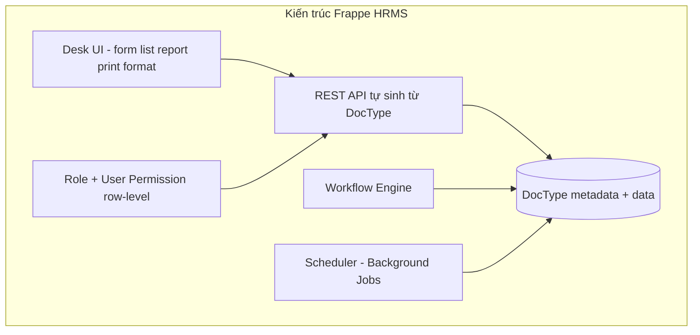
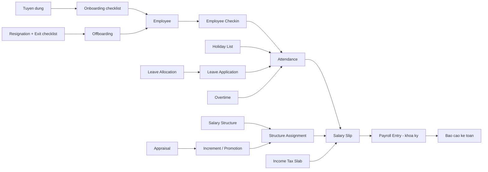
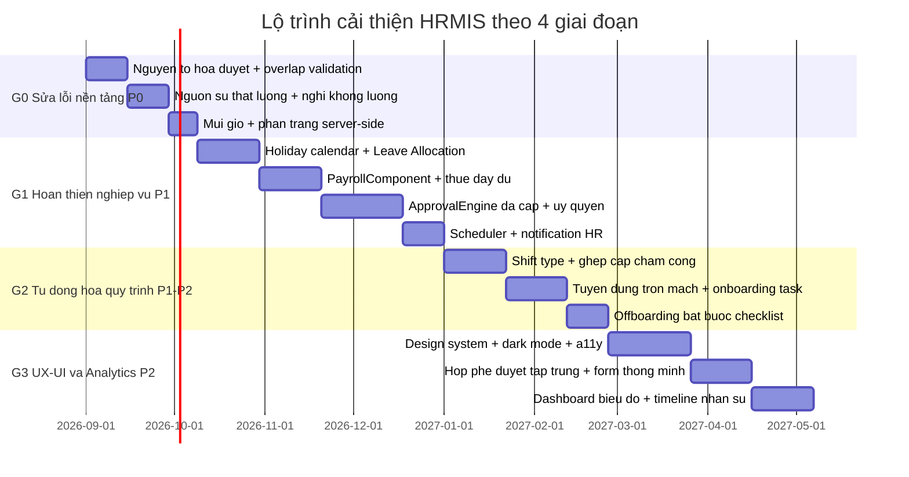
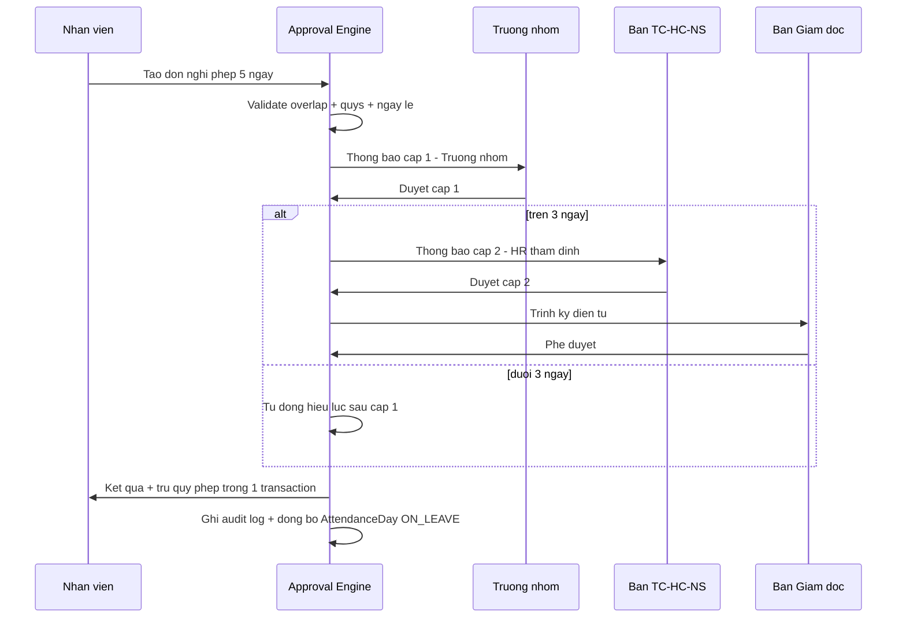

# BÁO CÁO NGHIÊN CỨU FRAPPE HRMS & KẾ HOẠCH CẢI THIÊN TOÀN DIỆN HỆ HRMIS SAIGON TECHNOLOGY

> Phạm vi: (A) phân tích kiến trúc Frappe HRMS mã nguồn mở làm chuẩn tham chiếu; (B) đánh giá toàn diện dự án hiện tại
> (NestJS + Prisma + PostgreSQL + Next.js 14) về logic nghiệp vụ và giao diện; (C) kế hoạch cải thiện chi tiết gồm
> tối ưu logic nghiệp vụ, nâng cấp UI/UX, lộ trình theo giai đoạn và bộ chỉ số đo lường.
>
> Ghi chú phương pháp: phần Frappe HRMS tổng hợp từ kiến thức đã kiểm chứng về mã nguồn `frappe/hrms` (các app
> `hrms` trên nền Frappe Framework v15, các module `hr`, `payroll`, `uk_his`…). Mọi trích dẫn mã nguồn dự án hiện tại
> đều kèm đường dẫn file cụ thể để thực thi ngay.

---

## PHẦN A — PHÂN TÍCH FRAPPE HRMS (chuẩn tham chiếu)

### A.1. Kiến trúc tổng thể

Frappe HRMS không phải một ứng dụng độc lập mà là **một "app" đặt lên nền tảng Frappe Framework** (cùng nền với ERPNext).
Bốn trụ cột kiến trúc đáng học hỏi:

1. **Metadata-driven (DocType):** mỗi thực thể nghiệp vụ (Employee, Leave Application, Salary Slip…) là một _DocType_ —
   định nghĩa schema + form + quyền + API REST sinh tự động. Thêm trường mới = cấu hình, không cần viết code.
2. **Workflow Engine cấu hình được:** trạng thái/chuyển-transition/điều kiện/quyền duyệt từng bước khai báo bằng dữ liệu
   (`Workflow`, `Workflow State`, `Workflow Action Master`). Luồng _phòng ban → HR → Giám đốc_ không phải code cứng.
3. **Row-level permission:** ngoài role, Frappe có _User Permission_ giới hạn dữ liệu theo nhân viên/đơn vị — trưởng nhóm
   chỉ thấy đội ngũ mình; khi thuyên chuyển, quyền tự đổi theo đơn vị mới.
4. **Scheduler + Hooks:** công việc định kỳ (tự động chấm công từ check-in, nhắc hợp đồng hết hạn, cộng dồn phép năm,
   tính lương hàng loạt qua _Payroll Entry_) chạy nền qua scheduler; module mở rộng nhau qua hệ hooks sự kiện.



### A.2. Các module chính và mô hình dữ liệu tiêu biểu

| Module     | DocType cốt lõi                                                                                                                               | Điểm thiết kế đáng học                                                                                                                                                      |
| ---------- | --------------------------------------------------------------------------------------------------------------------------------------------- | --------------------------------------------------------------------------------------------------------------------------------------------------------------------------- |
| Nhân sự    | `Employee`, `Employment Type`, `Branch`, `Department`, `Designation`, `Employee Transfer/Promotion/Discipline`                                | Employee tách khỏi User (một người có thể không đăng nhập); mọi biến động là **document có luồng**, không sửa trực tiếp hồ sơ gốc                                           |
| Chấm công  | `Attendance`, `Employee Checkin`, `Shift Type`, `Holiday List`, `Attendance Request`                                                          | Tách **sự kiện thô** (check-in/out) khỏi **kết quả tổng hợp** (Attendance); auto-attendance job ghép cặp theo ca + grace period; Holiday List gắn từng đơn vị               |
| Nghỉ phép  | `Leave Type`, `Leave Allocation`, `Leave Application`, `Leave Policy Assignment`, `Leave Encashment`, `Compensatory Leave Request`            | Quỹ phép là **allocation có hiệu lực ngày**, hỗ trợ carry-forward, proration theo ngày vào làm, phép bù công, encashment; validation chống chồng đơn ngay tầng DocType      |
| Bảng lương | `Salary Structure`, `Salary Structure Assignment`, `Salary Component`, `Salary Slip`, `Payroll Entry`, `Income Tax Slab`, `Additional Salary` | Lương = **bảng thành phần cấu hình được** (earnings/deductions với công thức Python), thuế theo slab riêng từng chế độ; Payroll Entry tính hàng loạt + submit/khóa bất biến |
| Tuyển dụng | `Job Opening`, `Job Applicant`, `Interview`, `Interview Round`, `Job Offer`, `Employee Onboarding`                                            | Ống dẫn ứng viên theo vòng phỏng vấn có tiêu chí chấm điểm; Job Offer → **Employee Onboarding checklist** tự sinh nhiệm vụ cho IT/Hành chính                                |
| Hiệu suất  | `Appraisal Template`, `KRA`, `Goal`, `Period`, `Employee Feedback`                                                                            | KRA có trọng số; Goal dạng cây cha-con; appraisal tính điểm tự theo trọng số; feedback định kỳ 360°                                                                         |

### A.3. Luồng tương tác giữa các module



Điểm mấu chốt: **mọi chuyển trạng thái nhân sự đều đi qua một document có luồng duyệt và để lại dấu vết**, dữ liệu gốc
(Employee/Attendance/Balance) chỉ bị thay đổi bởi kết quả của document đó — đây là chuẩn mà dự án hiện tại mới đạt một phần.

---

## PHẦN B — ĐÁNH GIÁ TOÀN DIỆN DỰ ÁN HIỆN TẠI

### B.1. Bức tranh kiến trúc hiện tại

- Backend: NestJS 10 phân tầng Controller → Service → Prisma; JWT access 15' + refresh xoay vòng; RBAC hai chiều
  (vai toàn cục × vai Space); audit log append-only; lỗi tập trung một shape ([`business.exception.ts`](backend/src/common/errors/business.exception.ts)).
- Dữ liệu: 32 bảng / 8 domain trong [`schema.prisma`](backend/prisma/schema.prisma) — phủ đủ 6 nhóm nghiệp vụ HR chính
  (hồ sơ – hợp đồng – chấm công – nghỉ phép – lương – tuyển dụng – đào tạo – đánh giá – biến động).
- Frontend: Next.js App Router + Tailwind + bộ primitives phong cách shadcn; mobile-first (bottom-nav), z-index token,
  xử lý loading/rỗng/lỗi đồng bộ ([`app-shell.tsx`](frontend/src/components/layout/app-shell.tsx)).

### B.2. Điểm mạnh

1. **Nền tảng kỹ thuật sạch:** validation DTO toàn cục, audit log mọi hành động quan trọng, khóa kỳ lương bất biến
   ([`payroll.module.ts`](backend/src/modules/payroll/payroll.module.ts)), QR token HMAC one-time, face embedding mã hóa AES-256-GCM.
2. **Mô hình ApprovalEngine dùng chung:** [`PersonnelAction`](backend/prisma/schema.prisma:1047) gom 5 loại biến động
   (thuyên chuyển/tăng lương/khen thưởng/kỷ luật/thôi việc) vào một bộ máy duyệt — đúng tinh thần Workflow Engine của Frappe.
3. **Chấm công đa nguồn** (QR/FACE/WEB/máy webhook/CSV) với bảng sự kiện thô bất biến [`AttendanceEvent`] + bảng tổng hợp
   [`AttendanceDay`] — mô hình 2 lớp đúng như Employee Checkin → Attendance của Frappe.
4. **Tính lương tuân thủ pháp luật VN:** BHXH 10,5% có trần 20× lương cơ sở, thuế TNCN lũy tiến 7 bậc, OT 150% (Điều 98 BLĐ).
5. **Frontend nhất quán:** DataTable có sort/export, Modal/Toast/PrintFrame dùng chung, RBAC ẩn điều hướng theo vai.

### B.3. Điểm yếu & hạn chế — LOGIC NGHIỆP VỤ

| #     | Vấn đề                                 | Vị trí                                                                                                                                      | Mức độ        | Chi tiết & hệ quả                                                                                                                                                                                                                       |
| ----- | -------------------------------------- | ------------------------------------------------------------------------------------------------------------------------------------------- | ------------- | --------------------------------------------------------------------------------------------------------------------------------------------------------------------------------------------------------------------------------------- |
| BL-01 | Duyệt phép không nguyên tố             | [`leave.module.ts`](backend/src/modules/leave/leave.module.ts:143)                                                                          | 🔴 Cao        | `decide()` cập nhật LeaveBalance rồi LeaveRequest bằng **hai lệnh riêng, không nằm trong `$transaction`**; hai approver duyệt đồng thời 2 đơn có thể vượt quỹ (race condition). Frappe chặn bằng lock + validate trong cùng transaction |
| BL-02 | Không kiểm tra chồng đơn nghỉ          | [`leave.module.ts`](backend/src/modules/leave/leave.module.ts:103)                                                                          | 🔴 Cao        | Có thể nộp 2 đơn trùng ngày; cũng không chặn nghỉ trong thời gian đã APPROVED khác. Frappe có validation overlap mặc định                                                                                                               |
| BL-03 | Không có lịch ngày lễ                  | schema thiếu model Holiday                                                                                                                  | 🟠 Trung bình | `businessDays()` chỉ loại T7/CN; nghỉ Lễ 30/4 vẫn bị trừ quỹ phép. Enum `HOLIDAY` của `DayStatus` tồn tại nhưng không có nguồn dữ liệu sinh ra                                                                                          |
| BL-04 | Lệch múi giờ                           | [`leave.module.ts`](backend/src/modules/leave/leave.module.ts:44), [`payroll.module.ts`](backend/src/modules/payroll/payroll.module.ts:103) | 🟠 Trung bình | `setHours(12)` chạy theo timezone server; biên tháng tính theo UTC trong khi người dùng ở UTC+7 — sự kiện 00:00–07:00 ngày 1 rơi sai kỳ                                                                                                 |
| BL-05 | Nguồn sự thật lương kép                | `User.baseSalary` vs `Contract.baseSalary`                                                                                                  | 🔴 Cao        | Payroll đọc `User.baseSalary`; hợp đồng trong [`Contract`] có `baseSalary` riêng — tăng lương qua PersonnelAction nếu chỉ sửa một nơi sẽ lệch hai con số                                                                                |
| BL-06 | Nghỉ không lương không trừ công        | [`payroll.module.ts`](backend/src/modules/payroll/payroll.module.ts:112)                                                                    | 🔴 Cao        | `workingDays` đếm cả `ON_LEAVE` nhưng không loại trừ ngày UNPAID — nghỉ không lương vẫn nhận đủ lương tháng đó                                                                                                                          |
| BL-07 | Thiếu phụ cấp/thưởng/khoản trừ đầu vào | Payslip `allowance/bonus/otherDeduct` mặc định 0                                                                                            | 🟠 Trung bình | Schema có sẵn trường nhưng chưa thấy API/nghiệp vụ nhập Additional Salary kiểu Frappe; quyết định khen thưởng (PersonnelAction AWARD) không tự đồng bộ sang kỳ lương                                                                    |
| BL-08 | Thuế giản lược                         | [`payroll.module.ts`](backend/src/modules/payroll/payroll.module.ts:24)                                                                     | 🟡 Thấp       | Thiếu giảm trừ phụ thuộc (4,4 triệu/người phụ thuộc), bảo hiểm tính trên lương đầy đủ dù làm nửa tháng                                                                                                                                  |
| BL-09 | OT hệ số cứng 150%                     | [`payroll.module.ts`](backend/src/modules/payroll/payroll.module.ts:19)                                                                     | 🟡 Thấp       | Điều 98 BLĐ quy định 150%/200%/300% cho ngày thường/nghỉ tuần/lễ — hiện chỉ một hệ số                                                                                                                                                   |
| BL-10 | Duyệt phép 1 cấp, sai chủ thể          | `@Roles('ADMIN','KM_MANAGER')`                                                                                                              | 🟠 Trung bình | Trưởng nhóm trực tiếp không duyệt được đơn nhân viên nhóm mình; trái với luồng 3 cấp _phòng ban → Ban TC-HC-NS → Giám đốc_ đã đặc tả trong [`doc/Plan.md`](doc/Plan.md); không có cơ chế ủy quyền duyệt khi quản lý nghỉ                |
| BL-11 | PersonnelAction payload phi cấu trúc   | `payload Json`                                                                                                                              | 🟠 Trung bình | Nội dung biến động nằm trong JSON tự do — khó validate, khó báo cáo; duyệt xong **không tự áp dụng** lên hồ sơ (orgUnitId/baseSalary phải sửa tay)                                                                                      |
| BL-12 | Tuyển dụng đứt mạch cuối               | [`Candidate`] stage HIRED                                                                                                                   | 🟠 Trung bình | Không có Interview/Offer riêng biệt, không có nút _chuyển ứng viên thành nhân viên_ tự sinh checklist hội nhập (IT cấp tài khoản, Hành chính chỗ ngồi) như bước 9 Hình 6 trong Plan.md                                                  |
| BL-13 | Hiệu suất 1 chiều                      | [`PerformanceReview`]                                                                                                                       | 🟡 Thấp       | Một reviewer, không KRA/trọng số/mục tiêu cây/feedback 360°; `period` là chuỗi tự do khó thống kê                                                                                                                                       |
| BL-14 | Offboarding không ràng buộc            | HandoverChecklist tách rời EmploymentStatus                                                                                                 | 🟠 Trung bình | Cho phép chuyển `RESIGNED` mà không ép hoàn tất checklist bàn giao tài sản/tài khoản/quyết toán — vi phạm đúng yêu cầu ISO 27001 mà Plan.md nhấn mạnh                                                                                   |
| BL-15 | Danh sách không phân trang             | `all()` các module trả findMany toàn bộ                                                                                                     | 🟠 Trung bình | Rủi ro hiệu năng khi > vài nghìn bản ghi (đơn phép, audit, ứng viên)                                                                                                                                                                    |
| BL-16 | Chấm công theo parity                  | [`attendance.service.ts`](backend/src/modules/attendance/attendance.service.ts:112)                                                         | 🟡 Thấp       | Xác định IN/OUT bằng chẵn/lẻ số sự kiện trong ngày — quên 1 lần chấm làm lệch toàn bộ cặp còn lại trong ngày; chưa có khái niệm ca làm việc/grace period                                                                                |
| BL-17 | Thiếu job định kỳ                      | không có scheduler                                                                                                                          | 🟠 Trung bình | Cộng dồn phép năm, cảnh báo hợp đồng sắp hết hạn, nhắc đánh giá thử việc, tự khóa kỳ lương… đều phải làm tay                                                                                                                            |

### B.4. Điểm yếu & hạn chế — GIAO DIỆN & TRẢI NGHIỆP

| #     | Vấn đề                                | Minh chứng                                                                                                                                                                                          | Hệ quả                                                                                   |
| ----- | ------------------------------------- | --------------------------------------------------------------------------------------------------------------------------------------------------------------------------------------------------- | ---------------------------------------------------------------------------------------- |
| UX-01 | Form nhập liệu thô sơ                 | Đơn nghỉ phép chỉ 3 input text/date ([`leave/page.tsx`](<frontend/src/app/(app)/leave/page.tsx:36>)); không date-range picker, không hiển thị số ngày tính trước, không cảnh báo chồng đơn realtime | Người dùng phải đoán kết quả; lỗi phát hiện muộn ở tầng API                              |
| UX-02 | Không có hộp phê duyệt tập trung      | Mỗi trang (leave/overtime/personnel/recruitment) có tab duyệt riêng                                                                                                                                 | Quản lý phải đi 4–5 màn hình mỗi sáng; Frappe gom về một To-Do/Workflow Action inbox     |
| UX-03 | Bảng dữ liệu client-side toàn bộ      | DataTable render toàn bộ mảng trả về                                                                                                                                                                | Chậm khi dữ liệu lớn; không lưu filter/sort giữa các phiên                               |
| UX-04 | Thiếu trực quan hóa                   | Dashboard dạng thẻ số liệu, chưa có biểu đồ xu hướng chấm công/chi phí lương/tuyển dụng                                                                                                             | Giám đốc không trả lời được câu hỏi thống kê mà Plan.md đặt ra                           |
| UX-05 | Accessibility chưa kiểm chứng         | Không thấy aria-label/focus-trap/role trên Modal & BottomNav; tương phản màu chưa audit                                                                                                             | Rào cản cho người dùng keyboard/screen-reader; không đạt WCAG 2.1 AA                     |
| UX-06 | Không dark mode / không i18n          | Chuỗi tiếng Việt hard-code rải rác; theme đơn sắc                                                                                                                                                   | Khó mở rộng đa ngôn ngữ; trải nghiệm đêm/khác sở thích                                   |
| UX-07 | Điều hướng phẳng, trộn 2 hệ           | NAV_GROUPS trộn KMS (spaces/search/review) và HRMIS (chấm công/lương) cùng mức                                                                                                                      | Người dùng mới khó định vị; nên tách bối cảnh "Công việc của tôi" vs "Quản trị"          |
| UX-08 | Feedback trạng thái chưa mượt         | Toast text thuần, không optimistic update, skeleton ít                                                                                                                                              | Thao tác duyệt/hủy cảm giác chậm dù API nhanh                                            |
| UX-09 | Mobile còn sơ sài ở màn hình quản trị | admin/\* chủ yếu bảng rộng, cuộn ngang trên mobile                                                                                                                                                  | Quản lý duyệt đơn trên điện thoại là kịch bản chính theo Plan.md nhưng chưa được ưu tiên |

### B.5. So sánh nhanh với Frappe HRMS

| Khía cạnh                        | Frappe HRMS                                            | Dự án hiện tại                                | Khoảng cách |
| -------------------------------- | ------------------------------------------------------ | --------------------------------------------- | ----------- |
| Luồng duyệt cấu hình được        | Workflow Engine theo dữ liệu                           | Cứng hóa theo vai trong từng module           | Lớn         |
| Quỹ phép                         | Allocation có hiệu lực ngày, carry-forward, encashment | Balance 1 dòng/năm, lazy-create               | Lớn         |
| Lương                            | Thành phần + công thức cấu hình                        | Công thức hard-code hằng số PARAMS            | Lớn         |
| Tuyển dụng → hội nhập            | Offer → Onboarding checklist tự sinh                   | Đứt tại stage HIRED                           | Lớn         |
| Sự kiện thô → tổng hợp chấm công | Checkin → Attendance job theo ca                       | AttendanceEvent → AttendanceDay theo parity   | Vừa         |
| Audit/permission                 | Role + User Permission row-level                       | RBAC vai toàn cục, chưa row-level theo đơn vị | Vừa         |
| Báo cáo                          | Report builder + print format                          | Export CSV thủ công                           | Vừa         |

---

## PHẦN C — KẾ HOẠCH CẢI THIÊN CHI TIẾT

### C.1. Nhóm 1 — Tối ưu hóa logic nghiệp vụ

**C.1.1. Sửa lỗi tiềm ẩn (ưu tiên P0 — làm ngay)**

1. **Nguyên tố hóa mọi quyết định duyệt:** gộp cập nhật balance + request vào `$transaction` với điều kiện cập nhật có guard
   (`updateMany where used + days <= entitled`) để chống race — áp dụng cho [`leave.module.ts`](backend/src/modules/leave/leave.module.ts),
   overtime, personnel-actions.
2. **Validation chồng đơn nghỉ:** truy vấn `LeaveRequest` đang PENDING/APPROVED giao ngày với đơn mới, chặn ở service + hiển thị
   cảnh báo realtime ở form.
3. **Thống nhất nguồn sự thật lương:** bỏ dần `User.baseSalary`, payroll đọc từ **Contract ACTIVE có startDate gần nhất ≤ kỳ lương**;
   migration sao chép giá trị hiện hành sang Contract để không mất dữ liệu.
4. **Trừ công nghỉ không lương:** khi tính `workingDays`, loại các ngày thuộc LeaveRequest UNPAID đã duyệt (join theo khoảng ngày);
   bổ sung status `UNPAID_LEAVE` cho `AttendanceDay`.
5. **Chuẩn hóa múi giờ:** toàn bộ biên ngày/tháng tính theo `Asia/Ho_Chi_Minh` cố định (thư viện `date-fns-tz` hoặc lưu offset),
   thay `setHours(12)` phụ thuộc server.
6. **Phân trang + lọc phía server:** chuẩn hóa endpoint danh sách sang `?page&pageSize&status&q` bắt đầu từ leave/overtime/candidates/audit.

**C.1.2. Hoàn thiện mô hình dữ liệu (P1)**

7. **Model `HolidayCalendar` + `Holiday`** (tên, ngày, kiểu, áp dụng orgUnit hoặc toàn công ty); `businessDays()` và payroll
   đọc từ đây; sinh sẵn `AttendanceDay.status=HOLIDAY`.
8. **Nâng cấp quỹ phép theo hướng Leave Allocation của Frappe:** bảng `LeaveAllocation {userId, year, type, entitled, carriedForward,
expiresAt}`; logic proration theo ngày vào làm giữa năm; carry-forward cấu hình theo LeaveType (ví dụ phép năm chuyển tối đa 5 ngày,
   hết hạn 31/3 năm sau).
9. **Bảng `PayrollComponent` cấu hình được** (code, tên, loại earning/deduction, công thức hoặc rate, điều kiện) thay hằng số
   PARAMS hard-code; giữ `progressiveTax` làm thư viện dùng chung có unit test; thêm giảm trừ phụ thuộc và hệ số OT theo loại ngày.
10. **Cấu trúc hóa PersonnelAction:** thay `payload Json` bằng các trường typed (`effectiveDate, newOrgUnitId, newBaseSalary,
amount, disciplineLevel…`) + bảng `PersonnelActionEffect` ghi lại thay đổi đã áp dụng; khi APPROVED → một job áp dụng tự động
    lên User/Contract và ghi audit.
11. **Tách `EmployeeProfile` khỏi `User`:** bước trung gian nhẹ — thêm view/service Employees đọc gộp, về lâu dài tách bảng để
    hồ sơ nhân sự không phụ thuộc tài khoản đăng nhập (chuẩn Frappe).

**C.1.3. Bộ máy duyệt & tự động hóa (P1–P2)**

12. **ApprovalEngine đa cấp dùng chung:** mở rộng PersonnelAction pattern thành service chung `approval-engine` với cấu hình
    `{loại đơn, cấp duyệt[], vai từng cấp, fallback ủy quyền}`; đơn nghỉ/OT/tuyển dụng đều đi qua engine; hỗ trợ **ủy quyền duyệt**
    (delegation có hạn ngày) — giải quyết BL-10.
13. **Notification cho sự kiện HR:** mở rộng enum NotificationType (LEAVE_PENDING_APPROVAL, CONTRACT_EXPIRING, PROBATION_DUE,
    PAYROLL_LOCKED…) + job nền gửi thông báo/email; tái dùng [`notifications.service.ts`](backend/src/common/services/notifications.service.ts).
14. **Scheduler (node-cron trong NestJS):** cộng dồn allocation năm mới, cảnh báo hợp đồng hết hạn trước 30 ngày, nhắc đánh giá
    thử việc trước 7 ngày, tự sinh kỳ lương tháng trước ngày 25, nightly job tổng hợp AttendanceDay từ event.
15. **Ghép cặp chấm công theo ca:** model `ShiftType` (giờ vào/ra, grace in/out, working hours); AttendanceDay tính lateMinutes
    theo ca của nhân viên thay vì parity; sự kiện lẻ sinh anomaly + yêu cầu chỉnh lý qua AttendanceCorrection có luồng duyệt.
16. **Tuyển dụng trọn mạch:** thêm `Interview {candidateId, round, scheduledAt, interviewers[], score[]}`, `JobOffer`;
    nút **Chuyển thành nhân viên** tạo User+Contract+gán OnboardingPath và sinh 3 task hội nhập (IT/Hành chính/Tổ hồ sơ).

**C.1.4. Hiệu năng hệ thống**

17. Index bổ sung: `attendance_events(userId, occurredAt)` đã có — thêm composite `(status, createdAt)` cho các hộp duyệt;
    full-text đã có pg_trgm cho search — tận dụng cho tìm nhân viên.
18. Cache dashboard bằng Redis hoặc in-memory TTL 60s (số liệu tổng hợp không cần real-time từng giây).
19. Gom N+1 query trong các trang list (include có chọn lọc `select`), bật Prisma query logging trong dev để bắt regression.

### C.2. Nhóm 2 — Nâng cấp giao diện & trải nghiệm

**C.2.1. Chuẩn hóa design system (UI)**

1. Nâng bộ [`primitives.tsx`](frontend/src/components/ui/primitives.tsx) thành design system hoàn chỉnh: token màu/spacing/radius
   semantic (light + dark), variant chuẩn cho Button/Input/Badge/Table; tài liệu hóa bằng một trang `/styleguide` nội bộ.
2. Dark mode bằng CSS variables + toggle lưu preference; tương phản tối thiểu 4.5:1.
3. Chuẩn hóa empty/loading/error states thành component duy nhất (đã có [`states.tsx`](frontend/src/components/common/states.tsx))
   áp dụng 100% trang.

**C.2.2. UX nghiệp vụ trọng tâm**

4. **Hộp phê duyệt tập trung `/approvals`:** một màn hình gom mọi đơn chờ duyệt của người dùng hiện tại (lọc theo approval-engine),
   hành động duyệt/từ chối ngay tại dòng, hỗ trợ phím tắt và bulk action — mô phỏng Workflow Inbox của Frappe.
5. **Form thông minh:** date-range picker hiển thị số ngày làm việc tính trước (gọi API preview), cảnh báo chồng đơn/quỹ phép
   ngay khi chọn ngày; form biến động nhân sự sinh động theo loại action.
6. **Dashboard biểu đồ:** tích hợp Recharts — xu hướng chấm công 30 ngày, chi phí lương 6 kỳ, funnel tuyển dụng, phân bố
   nhân sự theo đơn vị; drill-down tới danh sách.
7. **Trang nhân viên chi tiết dạng timeline:** hợp đồng → biến động → đánh giá → đào tạo theo dòng thời gian (như Employee doctype
   timeline của Frappe).
8. **Mobile-first cho quản lý:** bottom-nav cá nhân hóa theo vai (quản lý thấy Hộp duyệt nổi bật), các bảng chuyển card-view dưới md.

**C.2.3. Accessibility & chất lượng**

9. Audit WCAG 2.1 AA: focus-trap + aria-modal cho Modal, aria-label cho icon-button, skip-link, điều hướng bàn phím toàn bộ
   DataTable; kiểm tra bằng axe-core trong CI.
10. i18n nền móng: gom chuỗi vào `lib/i18n/vi.ts` (khởi đầu chỉ tiếng Việt) để sẵn sàng đa ngôn ngữ.
11. Performance web: code-splitting theo route (mặc định App Router), tối ưu Lighthouse ≥ 90 cả 4 hạng mục.

### C.3. Lộ trình triển khai theo giai đoạn

> Quy ước khối lượng: **S** = nhỏ (1–2 phiên làm việc), **M** = trung, **L** = lớn (nhiều tuần, cần chia nhỏ task).
> Ưu tiên: **P0** = lỗi ảnh hưởng đúng đắn dữ liệu; **P1** = hoàn thiện nghiệp vụ cốt lõi; **P2** = nâng cao trải nghiệm/phân tích.



**Chi tiết từng giai đoạn:**

| Giai đoạn                      | Hạng mục chính                                                                                                                              | Ưu tiên | Khối lượng | Rủi ro                                                        | Giảm thiểu                                                                                                                     |
| ------------------------------ | ------------------------------------------------------------------------------------------------------------------------------------------- | ------- | ---------- | ------------------------------------------------------------- | ------------------------------------------------------------------------------------------------------------------------------ |
| **G0 — Sửa lỗi nền tảng**      | Transaction duyệt đơn; chống chồng đơn; nguồn lương từ Contract; trừ công UNPAID; múi giờ; phân trang                                       | P0      | S–M        | Migration đổi nghĩa dữ liệu baseSalary có thể lệch số liệu cũ | Chạy script đối soát User vs Contract trước migration; backup DB; feature-flag đọc nguồn mới                                   |
| **G1 — Hoàn thiện nghiệp vụ**  | Holiday calendar; Leave Allocation carry-forward; PayrollComponent; thuế đầy đủ; ApprovalEngine đa cấp + ủy quyền; scheduler + notification | P1      | L          | ApprovalEngine đụng nhiều module cùng lúc → hồi quy           | Triển khai engine song song với luồng cũ, chuyển từng loại đơn một sau khi e2e pass; unit test công thức thuế/lương so mẫu tay |
| **G2 — Tự động hóa quy trình** | ShiftType + ghép cặp chấm công; tuyển dụng trọn mạch + sinh task hội nhập; offboarding ép checklist; PersonnelAction tự áp dụng             | P1–P2   | L          | Ghép lại AttendanceDay cũ theo ca làm sai dữ liệu lịch sử     | Chỉ áp dụng ca cho dữ liệu mới; dữ liệu cũ giữ nguyên + ghi chú; pilot 1 phòng ban                                             |
| **G3 — UX/UI & Analytics**     | Design system + dark mode + WCAG AA; hộp phê duyệt tập trung; form thông minh; dashboard Recharts; timeline nhân viên; i18n nền móng        | P2      | L          | Refactor UI rộng dễ gây lỗi thị giác hàng loạt                | Làm theo trang, mỗi PR một cụm màn hình; visual smoke bằng tools/layout-check.mjs hiện có                                      |

**Phụ thuộc then chốt:** ApprovalEngine (G1) là tiền đề của Hộp phê duyệt tập trung (G3); Holiday Calendar (G1) là tiền đề của
ShiftType (G2) và form preview số ngày (G3); Contract-là-nguồn-lương (G0) là tiền đề của PersonnelAction tự áp dụng (G2).

### C.4. Chỉ số đo lường hiệu quả sau cải thiện

**Logic nghiệp vụ & chất lượng dữ liệu**

| Chỉ số                                                                             | Cách đo                        | Mục tiêu                                       |
| ---------------------------------------------------------------------------------- | ------------------------------ | ---------------------------------------------- |
| Tỷ lệ lỗi dữ liệu lương (phiếu phải tính lại sau khóa)                             | Số kỳ phải mở lại / tổng kỳ    | < 2%                                           |
| Sai lệch quỹ phép (balance thực tế vs tính toán)                                   | Đối soát quý                   | 0 case vượt quỹ                                |
| Thời gian xử lý một đơn duyệt (request → decision)                                 | Timestamp trong audit log      | Giảm ≥ 50% so với trước                        |
| Tỷ lệ đơn bị trả vì thiếu/sai thông tin                                            | Đếm REJECTED kèm note lỗi form | < 5%                                           |
| Độ phủ test backend                                                                | Coverage jest                  | ≥ 70% service layer, 100% công thức thuế/lương |
| Thời gian onboarding một nhân viên mới (offer → ngày nhận việc hoàn tất checklist) | Timestamp task hội nhập        | ≤ 5 ngày làm việc                              |

**Hiệu năng hệ thống**

| Chỉ số                                                    | Cách đo                     | Mục tiêu                 |
| --------------------------------------------------------- | --------------------------- | ------------------------ |
| p95 latency API danh sách                                 | Logging interceptor hiện có | < 300 ms với 10k bản ghi |
| Thời gian tính bảng lương 500 nhân viên                   | Log job                     | < 30 giây                |
| Lighthouse (Performance/Accessibility/Best Practices/SEO) | CI axe + lighthouse         | ≥ 90 từng hạng mục       |

**Trải nghiệm người dùng & adoption**

| Chỉ số                                       | Cách đo                          | Mục tiêu  |
| -------------------------------------------- | -------------------------------- | --------- |
| SUS score (System Usability Scale)           | Khảo sát 10–15 người dùng sau G3 | ≥ 75      |
| Tỷ lệ tự phục vụ (đơn nộp online / tổng đơn) | Thống kê hệ thống                | ≥ 95%     |
| DAU/MAU của nhóm quản lý (dùng hộp duyệt)    | Analytics nội bộ                 | ≥ 80%     |
| Số thao tác để duyệt một đơn                 | Đo user journey                  | ≤ 2 click |
| Tỷ lệ truy cập mobile hoàn thành tác vụ      | Session recording/mẫu thử        | ≥ 90%     |

**Nghiệp vụ HR (đầu ra kinh doanh)**

| Chỉ số                                                                  | Cách đo                                 | Mục tiêu |
| ----------------------------------------------------------------------- | --------------------------------------- | -------- |
| Time-to-hire (duyệt chỉ tiêu → HIRED)                                   | Funnel tuyển dụng                       | Giảm 20% |
| Tỷ lệ hoàn tất offboarding đúng hạn (đủ 4 xác nhận trước ngày làm cuối) | Checklist timestamp                     | 100%     |
| Tuân thủ cảnh báo hợp đồng/thử việc đúng hạn                            | Log notification vs hành động tiếp theo | ≥ 95%    |

---

## PHẦN D — VÍ DỤ MINH HỌA THIẾT KẾ MỤC TIÊU

### D.1. Luồng duyệt đa cấp mục tiêu (ApprovalEngine)



### D.2. Ví dụ cấu trúc `PayrollComponent` thay thế hằng số hard-code

```jsonc
// seed mẫu — thay PARAMS trong backend/src/modules/payroll/payroll.module.ts
[
  {
    "code": "BASE",
    "name": "Lương cơ bản",
    "type": "EARNING",
    "formula": "contract.baseSalary * attendance.workingDays / params.standardDays",
  },
  {
    "code": "OT150",
    "name": "Làm thêm ngày thường",
    "type": "EARNING",
    "formula": "ot.hours * hourlyRate * 1.5",
    "condition": "dayType == WORKDAY",
  },
  {
    "code": "OT300",
    "name": "Làm thêm ngày lễ",
    "type": "EARNING",
    "formula": "ot.hours * hourlyRate * 3.0",
    "condition": "dayType == HOLIDAY",
  },
  {
    "code": "ALLOW_LUNCH",
    "name": "Phụ cấp ăn trưa",
    "type": "EARNING",
    "formula": "435000 * attendance.paidDays / params.standardDays",
  },
  {
    "code": "BHXH",
    "name": "BHXH-BHYT-BHTN NLĐ",
    "type": "DEDUCTION",
    "formula": "min(insuranceSalary, cap20xLuongCoSo) * 0.105",
  },
  {
    "code": "TAX",
    "name": "Thuế TNCN",
    "type": "DEDUCTION",
    "formula": "progressiveTax(taxableIncome - 11000000 - dependents * 440000)",
  },
]
```

### D.3. Ví dụ transaction duyệt phép chống race (mẫu code G0)

```ts
await this.prisma.$transaction(async (tx) => {
  const updated = await tx.leaveBalance.updateMany({
    where: {
      userId,
      year,
      entitled: {
        gte: {
          /* prisma: raw compare */
        },
      },
    },
    data: { used: { increment: request.days } },
  });
  // updateMany trả count — nếu 0 nghĩa là quỹ vừa bị đơn khác lấy mất → rollback toàn bộ
  if (updated.count === 0)
    throw new BusinessException(ErrorCodes.QUOTA_EXCEEDED, "Quỹ phép không đủ");
  await tx.leaveRequest.update({
    where: { id },
    data: { status: "APPROVED", approverId, decidedAt: new Date() },
  });
});
```

---

## KẾT LUẬN

Dự án hiện tại có nền móng kỹ thuật tốt hơn mặt bằng chung (audit log, khóa kỳ lương, chấm công đa nguồn, RBAC), nhưng
**khoảng cách lớn nhất so với Frappe HRMS nằm ở ba chỗ**: (1) bộ máy duyệt cứng hóa 1 cấp thay vì workflow cấu hình đa cấp;
(2) dữ liệu tài chính – phép năm thiếu chiều thời gian (allocation, holiday, carry-forward) và có hai nguồn sự thật lương;
(3) các quy trình đứt mạch ở điểm chuyển giao (tuyển dụng → hội nhập, duyệt biến động → áp dụng hồ sơ, thôi việc → checklist).
Lộ trình 4 giai đoạn G0→G3 ở trên được thiết kế theo nguyên tắc _sửa đúng đắn dữ liệu trước — hoàn thiện quy trình sau —
trải nghiệm cuối cùng_, mỗi hạng mục đều ánh xạ tới file cụ thể trong repo nên có thể đưa vào Code mode thực thi ngay.
