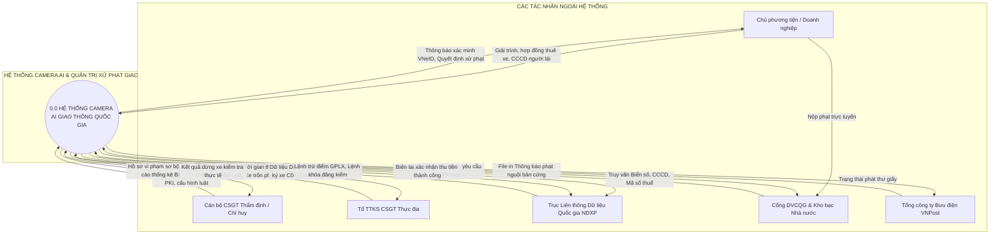
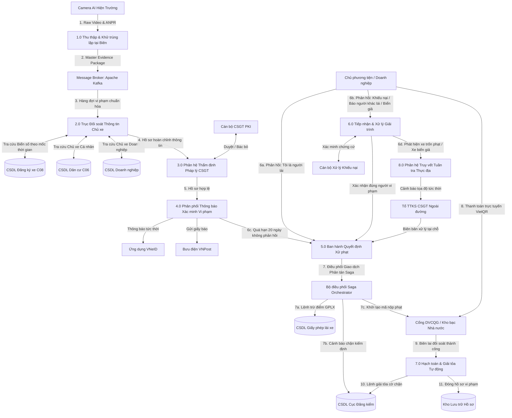
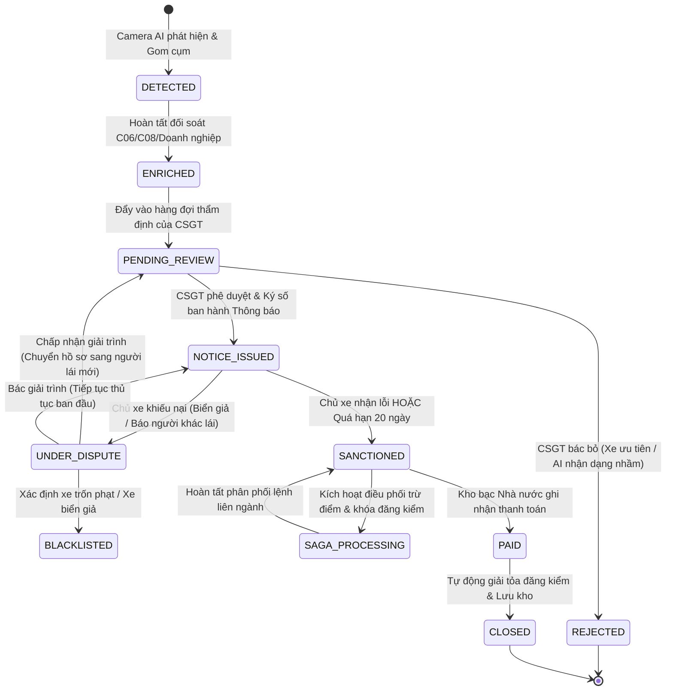

# **TÀI LIỆU THIẾT KẾ MÔ HÌNH LOGIC: HỆ THỐNG CAMERA AI GIAO THÔNG THÔNG MINH TÍCH HỢP CSDL QUỐC GIA**
*(Tài liệu chuẩn hóa kiến trúc Hệ thống Thông tin - MIS & Khung Quản trị Dữ liệu Quốc gia)*

---

## **I. Tổng Quan Kiến Trúc Và Bối Cảnh Vận Hành**

Hệ thống Camera AI Giám sát Giao thông Thông minh (Intelligent Transportation System - ITS) được thiết kế theo mô hình lai **Edge-Cloud Architecture**, đóng vai trò là một trung tâm thu thập và điều phối dữ liệu tích hợp (Data Hub). Hệ thống liên thông trực tiếp với các cơ sở dữ liệu chuyên ngành quốc gia thông qua **Trục liên thông chia sẻ dữ liệu quốc gia (NDXP / LGSP)** theo khung chiến lược **Đề án 06/CP**, **Nghị định số 13/2023/NĐ-CP** (Bảo vệ dữ liệu cá nhân), **Luật Trật tự, an toàn giao thông đường bộ 2024** (áp dụng cơ chế quản lý và trừ điểm Giấy phép lái xe), và quy định về biển số định danh (**Thông tư 24/2023/TT-BCA**).

```
                      ┌────────────────────────────────────────────────────────┐  
                      │      TRỤC LIÊN THÔNG DỮ LIỆU QUỐC GIA (NDXP / LGSP)     │  
                      └───────────────────────────┬────────────────────────────┘  
                                                  │  
         ┌────────────────────┬───────────────────┼────────────────────┬────────────────────┬───────────────────┐  
         ▼                    ▼                   ▼                    ▼                    ▼                   ▼  
  ┌──────────────┐   ┌─────────────────┐ ┌─────────────────┐ ┌─────────────────┐ ┌───────────────────┐ ┌─────────────────┐  
  │ CSDL QUỐC GIA│   │  CSDL ĐĂNG KÝ   │ │  CSDL KIỂM ĐỊNH │ │   CSDL GIẤY     │ │ CỔNG DVCQG & KHO  │ │ CSDL DOANH      │  
  │  VỀ DÂN CƯ   │   │ PHƯƠNG TIỆN C08 │ │   ĐĂNG KIỂM     │ │ PHÉP LÁI XE     │ │   BẠC NHÀ NƯỚC    │ │ NGHIỆP QUỐC GIA │  
  │  (C06 - BCA) │   │ (Biển số ĐD)    │ │   (Cục ĐK VN)   │ │ (Cục Đường Bộ)  │ │  (Bộ Tài Chính)   │ │ (Bộ KH&ĐT/Thuế) │  
  └──────────────┘   └─────────────────┘ └─────────────────┘ └─────────────────┘ └───────────────────┘ └─────────────────┘
```

### **Bốn nguyên tắc cốt lõi trong quản trị và vận hành hệ thống:**

1. **Kiểm duyệt bán tự động & Đúng chủ thể pháp lý (Human-in-the-Loop & Legal Accountability):**  
   * AI và Edge Box chỉ đóng vai trò hỗ trợ nhận diện, đo đạc dữ liệu trắc địa, đóng gói bằng chứng sơ bộ.  
   * Quyết định xử phạt bắt buộc phải do Cán bộ Cảnh sát Giao thông (CSGT) có thẩm quyền phê duyệt bằng chữ ký số cá nhân (PKI - X.509).  
   * **Phân định rõ Chủ xe vs Người lái xe thực tế:** Hệ thống tách bạch giữa *Thông báo xác minh gửi chủ phương tiện* và *Quyết định xử phạt người vi phạm thực tế*. Việc trừ điểm Giấy phép lái xe (GPLX) chỉ thực hiện đối với người trực tiếp điều khiển phương tiện vi phạm, không tùy tiện trừ điểm chủ xe nếu chủ xe không phải người cầm lái.
2. **Tính bất biến và Toàn vẹn chứng cứ số (Digital Evidence Integrity & Non-repudiation):**  
   * Toàn bộ gói dữ liệu đa phương tiện (ảnh toàn cảnh, ảnh biển số, video clip diễn tiến) được gắn tem thời gian chính xác (Trusted Timestamping - RFC 3161) và mã hóa băm SHA-256 ngay tại biên/máy chủ tiếp nhận. Mọi can thiệp hay chỉnh sửa hình ảnh đều làm sai lệch mã băm và bị hệ thống phát hiện tức thì.
3. **Bảo vệ dữ liệu cá nhân theo Nghị định 13/2023/NĐ-CP (Privacy by Design):**  
   * Dữ liệu hình ảnh người tham gia giao thông vô can, người đi bộ hoặc hành khách đi cùng xe được làm mờ (Masking/Blurring) tại tầng biên trước khi lưu trữ hoặc truyền tải ra kênh công cộng.
   * Dữ liệu định danh cá nhân (CCCD, địa chỉ, số điện thoại) tuân thủ nguyên tắc phân quyền tối thiểu (Least Privilege) và mã hóa tĩnh (Encryption at Rest - AES-256).
4. **Tự động hóa liên ngành & Đồng bộ thời gian thực (Cross-Agency Event-Driven Automation):**  
   * Sau khi hoàn tất quy trình tố tụng, hệ thống điều phối trạng thái tức thời qua các nền tảng: cảnh báo VNeID, khóa đăng kiểm tại Cục Đăng kiểm, trừ điểm trên hệ thống GPLX, và tự động gỡ bỏ phong tỏa trong vòng 5 giây sau khi Kho bạc Nhà nước xác nhận quyết toán nộp phạt.

---

## **II. Chuẩn Hóa Dữ Liệu Đầu Vào Và Đầu Ra**

### **1. Nguồn Dữ Liệu Thu Thập Đầu Vào (Data Collection Sources & Inputs)**

Theo nguyên lý Quản trị Hệ thống Thông tin (MIS), toàn bộ dữ liệu đầu vào phục vụ chu trình giám sát, phát hiện và xử phạt vi phạm hành chính được phân định thành **hai nguồn dữ liệu độc lập**:
- **Nguồn dữ liệu bên trong hệ thống (Internal Data Sources):** Phát sinh từ mạng lưới thiết bị kỹ thuật, phần mềm nghiệp vụ nội bộ và các chủ thể tác nghiệp thuộc thẩm quyền quản lý trực tiếp của Cục Cảnh sát giao thông (C08).
- **Nguồn dữ liệu bên ngoài hệ thống (External Data Sources):** Thu thập, liên thông từ các Cơ sở dữ liệu Quốc gia chuyên ngành, Cổng dịch vụ công, Hệ thống kho bạc và phản hồi từ phía công dân/doanh nghiệp.

#### **A. Nguồn Dữ Liệu Thu Thập Bên Trong Hệ Thống (Internal Data Sources)**

| Danh mục dữ liệu | Loại dữ liệu | Định dạng chuẩn | Thuộc tính kỹ thuật chính | Đơn vị chủ quản / Nền tảng phát sinh |
| :--- | :--- | :--- | :--- | :--- |
| **Dữ liệu Video / Ảnh vi phạm hiện trường** | Dữ liệu phi cấu trúc (Unstructured Media) | RTSP / H.264 / H.265; JPEG/PNG (≥ 2MP) | Frame_Rate (30fps), Resolution (FullHD/4K), Timestamp (ISO 8601 PTP ±5ms), Camera_ID, Geo_Location (WGS84), Lane_No | Mạng lưới Camera AI giám sát và Máy tính biên (Edge Box) trên các tuyến đường |
| **Dữ liệu Nhận diện Biển số & Phân tích AI** | Bán cấu trúc (AI Metadata) | JSON qua gRPC / mTLS nội bộ | Raw_Detected_Plate_No, Canonical_Plate_No, Plate_Color, Vehicle_Class, Confidence_Score (≥90%), Idempotency_Key, Hash_SHA256 | Thiết bị Edge Computing tại hiện trường & Máy chủ AI Inference Engine trung tâm |
| **Dữ liệu CSDL Đăng ký Xe nội bộ ngành** | Dữ liệu có cấu trúc (Relational Data) | CSDL quan hệ (SQL) qua mạng Bộ Công an | Plate_Number, Owner_Type (IND/ORG), Owner_ID (CCCD/MST), Chassis_No, Engine_No, Brand, Color, Plate_Color, SCD-2 History | CSDL Đăng ký quản lý phương tiện cơ giới đường bộ (Cục CSGT - C08) |
| **Dữ liệu Thẩm định & Hồ sơ Tố tụng** | Dữ liệu giao dịch pháp lý số | Bản ghi nghiệp vụ kèm Chữ ký số PKI | Officer_Badge_ID, Verification_Result (APPROVED/REJECTED), Rejection_Reason, Report_No, Decision_No, Token X.509 | Cán bộ chiến sĩ CSGT Thẩm định hồ sơ & Ban chỉ huy Đội/Phòng CSGT |
| **Dữ liệu Phản hồi Tuần tra Thực địa** | Dữ liệu thời gian thực (Real-time Stream) | WebSocket / MQTT (độ trễ ≤ 1.0 giây) | Patrol_Team_ID, Current_GPS, Interception_Result (INTERCEPTED/MISSED), Biên bản dừng xe xử lý tại chốt kiểm soát | Tổ Tuần tra kiểm soát CSGT lưu động (Ứng dụng di động trên máy tính bảng) |
| **Dữ liệu Cấu hình Luật & Danh mục** | Dữ liệu tham chiếu (Master Configuration) | Bảng danh mục Temporal (Phiên bản hóa) | Node_ID, Route_Code, Violation_Code, Min_Fine, Max_Fine, Demerit_Points, Maker_Checker_Approval_Log | Quản trị viên HTTT C08 & Lãnh đạo có thẩm quyền phê duyệt cấu hình |

#### **B. Nguồn Dữ Liệu Thu Thập Bên Ngoài Hệ Thống (External Data Sources)**

| Danh mục dữ liệu | Loại dữ liệu | Định dạng chuẩn | Thuộc tính kỹ thuật chính | Đơn vị chủ quản / Nền tảng phát sinh |
| :--- | :--- | :--- | :--- | :--- |
| **Dữ liệu CSDL Quốc gia về Dân cư** | Dữ liệu có cấu trúc liên thông | JSON qua Trục NDXP (Mã hóa AES-256) | Citizen_ID (12 số CCCD), Full_Name, Date_Of_Birth, Gender, Permanent_Address, Contact_Address, Phone_Number, VNeID_Level, Device_Token | Cục Cảnh sát QLHC về TTXH (C06 - Bộ Công an) / Nền tảng Định danh VNeID |
| **Dữ liệu Đăng ký Doanh nghiệp** | Dữ liệu có cấu trúc liên ngành | JSON qua Trục NDXP | Enterprise_Tax_Code (10-13 số), Enterprise_Name, Headquarter_Address, Legal_Rep_Citizen_ID, Contact_Phone, Contact_Email | Cục Quản lý Đăng ký Kinh doanh (Bộ Kế hoạch và Đầu tư) |
| **Dữ liệu Giấy phép Lái xe (GPLX)** | Dữ liệu có cấu trúc liên ngành | JSON qua Trục NDXP | Driving_License_No, Citizen_ID, License_Class (A1, B, C...), Total_Points (12), Current_Points, License_Status, Expiry_Date | Cục Đường bộ Việt Nam (Bộ Giao thông vận tải) |
| **Dữ liệu Kiểm định Kỹ thuật Phương tiện** | Dữ liệu có cấu trúc liên ngành | XML / JSON qua Trục NDXP | Inspection_Cert_No, Plate_Number, Expiry_Date, Chassis_No, Warning_Status (0: Bình thường / 1: Bị chặn), Last_Inspection_Date | Cục Đăng kiểm Việt Nam (Bộ Giao thông vận tải) |
| **Dữ liệu Đối soát Thanh toán Nộp phạt** | Dữ liệu giao dịch tài chính | JSON Webhook ký số HMAC-SHA256 | Transaction_ID, Decision_No, Amount_Paid, Treasury_Receipt_No, Payment_Gateway, Paid_Timestamp | Cổng Dịch vụ công Quốc gia / Kho bạc Nhà nước / Napas / Ngân hàng |
| **Dữ liệu Giải trình / Khiếu nại công dân** | Đối tượng phức hợp (Compound Object) | JSON Form + Tệp đính kèm (PDF/JPEG) | Dispute_ID, Submitter_Citizen_ID, Dispute_Type, Actual_Driver_ID, Rental_Contract_URI, Explanation_Text | Chủ phương tiện / Người điều khiển vi phạm (Gửi qua VNeID hoặc Cổng DVCQG) |
| **Dữ liệu Trạng thái Chuyển phát Bưu chính** | Dữ liệu trạng thái logistics | JSON Webhook qua API VNPost | Postal_Delivery_Code, Decision_No, Delivery_Status (Đã phát tận tay/Chuyển hoàn/Từ chối), Delivery_Timestamp, Chữ ký nhận | Tổng công ty Bưu điện Việt Nam (VNPost) |

---

### **2. Dữ liệu đầu ra (Outputs)**

#### **A. Dữ liệu Đầu ra Tác nghiệp (Operational Outputs)**
| Danh mục | Loại dữ liệu | Định dạng chuẩn | Thuộc tính kỹ thuật chính | Nơi tiếp nhận & Ứng dụng |
| :--- | :--- | :--- | :--- | :--- |
| **Gói bằng chứng số (Evidence Pack)** | Compound Object | JSON Payload + Tệp media nén (ZIP/Object Storage) | Incident_ID (UUIDv4), Detected_Plate_No, Violations_List, Confidence_Score (≥ 90%), Evidence_URIs, SHA256_Hash | Hệ thống phần mềm quản lý vi phạm CSGT |
| **Thông báo xác minh vi phạm (Mời làm việc)** | Push Message / SMS / In | JSON Push Notification, SMS Brandname, PDF bản in | Notice_ID, Plate_Number, Time, Location, Violations_List, Deadline_Date, Resolution_Portal_URL | Ứng dụng VNeID, Cổng tra cứu C08, Bưu chính VNPost |
| **Biên bản VPHC điện tử** | Legal Document | PDF/A (Ký số SHA-256) | Report_No, Offender_Citizen_ID, Offender_Type, Vehicle_Plate, Specific_Violations, Officer_Badge_ID | Đương sự vi phạm, Kho lưu trữ hồ sơ nghiệp vụ |
| **Quyết định xử phạt điện tử** | Legal Document | PDF/A (Ký số X.509/PKI) | Decision_No, Report_No, Sanctioned_Subject_ID, Fine_Amount, Demerit_Points, Officer_Digital_Signature | Cổng DVCQG, Kho bạc, VNeID, CSDL Xử phạt |
| **Lệnh cảnh báo đăng kiểm** | Transaction Msg | JSON qua RESTful API | Log_ID, Plate_Number, Decision_No, Action_Code (BLOCK / CLEAR), Reason, Effective_Date | CSDL Cục Đăng kiểm Việt Nam |
| **Lệnh trừ điểm GPLX** | Transaction Msg | JSON qua RESTful API | Sync_ID, Driving_License_No, Violator_Citizen_ID, Points_To_Deduct, Decision_No, Updated_Timestamp | CSDL GPLX (Cục Đường bộ Việt Nam) |
| **Cảnh báo truy vết thực địa thời gian thực** | Real-time Push | WebSocket / MQTT Push (≤ 1s) | Alert_ID, Plate_Number, Reason (Biển giả/Xe trốn phạt), Camera_ID, Current_GPS, Target_Patrol_Team | Máy tính bảng & Bộ đàm Tổ TTKS CSGT thực địa |

#### **B. Dữ liệu Đầu ra Quản trị Điều hành & Phân tích Thông minh (BI & Executive Analytics Outputs)**
| Danh mục Báo cáo / Dữ liệu | Tần suất kết xuất | Thuộc tính phân tích chính | Đối tượng thụ hưởng | Mục đích quản trị hệ thống thông tin |
| :--- | :--- | :--- | :--- | :--- |
| **Bản đồ nhiệt Điểm đen giao thông (Blackspot Heatmap)** | Hàng ngày / Hàng tuần | `Node_ID`, Tuyến đường, Khung giờ cao điểm, Lỗi vi phạm phổ biến, Mật độ lưu lượng | Ban chỉ huy CSGT, Sở Giao thông Vận tải | Quy hoạch lại pha đèn tín hiệu, tổ chức lại luồng giao thông, bố trí lực lượng tuần tra |
| **Ma trận Hiệu năng Thuật toán AI (AI Confusion Matrix)** | Thời gian thực (Real-time) | Tỷ lệ tự tin (`Confidence_Score`), Tỷ lệ bỏ sót (False Negative), Tỷ lệ nhận diện sai (False Positive), Điều kiện thời tiết (Nắng/Mưa/Đêm) | Quản trị viên hệ thống (SysAdmin), Kỹ sư AI | Tối ưu hóa mô hình Computer Vision, lên lịch bảo dưỡng/lau rửa ống kính camera |
| **Báo cáo Đối soát Tài chính Chéo (3-Way Financial Recon)** | 23:59 Hàng ngày (Batch Job) | Tổng tiền phạt tuyên (`QUYET_DINH_XU_PHAT`), Tổng tiền báo có (`GIAO_DICH_KHO_BAC`), Số giao dịch lệch soát (Pending/Failed) | Cục Tài chính - BCA, Kho bạc Nhà nước | Đảm bảo tính minh bạch ngân sách, phát hiện giao dịch nghẽn tiền, tự động gỡ cờ chặn đăng kiểm bị sót |
| **Báo cáo Giám sát An toàn & Kiểm toán (Audit Security Report)** | Định kỳ tuần / Bất thường | Số lượt truy vấn C06 vượt ngưỡng, Số quyết định bị hủy bỏ/miễn phạt, Địa chỉ IP lạ truy cập | Cục An ninh mạng & PCTP sử dụng CNC (A05) | Phòng chống tiêu cực, chống lạm quyền truy cập dữ liệu dân cư trái phép |

---

### **3. Quy tắc Tiền Xử Lý & Chuẩn Hóa Dữ Liệu Đầu Vào (Input Normalization Pipeline)**

Dữ liệu thô từ camera và các cảm biến tại biên phải trải qua chuỗi chuẩn hóa trước khi ghi vào kho dữ liệu hoặc gửi lên trục NDXP:

```
┌─────────────────┐     ┌──────────────────────┐     ┌─────────────────────┐     ┌──────────────────────┐
│  DỮ LIỆU THÔ    │────►│ 1. LÀM SẠCH BIỂN SỐ  │────►│ 2. CHUẨN HÓA ĐỊA LÝ │────►│ 3. ĐỒNG BỘ THỜI GIAN │
│ (Raw ANPR Data) │     │ (Canonical Formatting│     │  (WGS84 -> VN-2000) │     │   (PTP / ISO 8601)   │
└─────────────────┘     └──────────────────────┘     └─────────────────────┘     └──────────────────────┘
```

1. **Chuẩn hóa Định dạng Biển số xe (Canonical License Plate Format):**
   * Camera AI nhận dạng thô có thể cho kết quả: `"29A-123.45"`, `"29A12345"`, `"29 - A1 12345"`, `"30E \n 456.78"`.
   * **Quy tắc làm sạch:** Loại bỏ toàn bộ khoảng trắng, dấu gạch ngang (`-`), dấu chấm (`.`) và ký tự xuống dòng (`\n`). Chuyển toàn bộ ký tự chữ cái thành chữ hoa (Upper-case).
   * **Định dạng chuẩn Canonical:** Regex validation `^[0-9]{2}[A-Z]{1,2}[0-9]{4,5}$` (Ví dụ: `"29A12345"`, `"51G99999"`). Mã Canonical này là khóa duy nhất dùng để truy vấn đối soát với CSDL Đăng ký xe C08.
2. **Chuẩn hóa Thời gian Ghi nhận (Spatio-Temporal Synchronization):**
   * Thiết bị biên bắt buộc phải đồng bộ thời gian với máy chủ chuẩn quốc gia qua giao thức **PTP (Precision Time Protocol - IEEE 1588)** hoặc **NTP**, đảm bảo độ lệch thời gian $\le 5\text{ms}$.
   * Mọi mốc thời gian lưu trữ theo chuẩn **ISO 8601 UTC+7** với độ mịn đến mili-giây: `YYYY-MM-DDTHH:mm:ss.fff+07:00`.
3. **Chuẩn hóa Tọa độ Không gian:**
   * Tọa độ GPS thu thập từ cảm biến vệ tinh theo hệ `WGS84` (Decimal degrees, 6 chữ số thập phân).
   * Khi ánh xạ vào bản đồ hành chính quản lý giao thông quốc gia, hệ thống thực hiện chuyển đổi tự động sang hệ quy chiếu tọa độ phẳng quốc gia **VN-2000** (kinh tuyến trục theo từng địa phương).
4. **Chuẩn hóa Danh mục Hành chính Nhà nước:**
   * Không lưu địa chỉ hành chính dưới dạng chuỗi văn bản tự do. Chuẩn hóa theo bảng mã danh mục 3 cấp của Tổng cục Thống kê / Bộ Nội vụ: `Province_Code` (2 số) - `District_Code` (3 số) - `Ward_Code` (5 số).

---

### **4. Quy Chuẩn Gói Tin Trao Đổi Qua Trục NDXP (Data Exchange Contract & Schema)**

Mọi gói tin trao đổi giữa Hệ thống Camera với các CSDL Quốc gia đều được đóng gói theo định dạng chuẩn (Standardized Message Envelope):

```json
{
  "header": {
    "message_id": "c8f2a632-1234-4b56-8a90-7890abcdef12",
    "correlation_id": "req-9988-7766-5544",
    "producer_id": "ITS_EDGE_NODE_HN_01",
    "timestamp": "2026-09-16T08:15:30.125+07:00",
    "service_code": "NDXP_C08_VEHICLE_LOOKUP",
    "idempotency_key": "SHA256(CameraID+PlateNo+TimestampMin)",
    "signature": "MEYCIQC...[X.509 Digital Signature of Producing Device]"
  },
  "payload": {
    "canonical_plate_no": "29A12345",
    "incident_timestamp": "2026-09-16T08:15:28.980+07:00",
    "node_id": "NODE_HN_KDT_01",
    "detected_color": "WHITE",
    "detected_class": "SEDAN"
  }
}
```

* **Idempotency Key:** Khóa chống xử lý trùng lặp. Nếu đường truyền mạng bị ngắt quãng, thiết bị biên gửi lại gói tin cũ, hệ thống trung tâm phát hiện `idempotency_key` đã tồn tại trong hàng đợi thì lập tức bỏ qua, ngăn ngừa việc ghi nhận 2 lần sự kiện cho cùng 1 hành vi.

---

## **III. Quản Trị Hệ Thống Và Phân Quyền Tác Nhân (RBAC)**

Hệ thống áp dụng mô hình phân quyền dựa trên vai trò (Role-Based Access Control - RBAC) kết hợp thẩm quyền địa bàn quản lý (Spatial Data Access Control):

```
┌────────────────────────────────────────────────────────────────────────────────────────┐
│                              ROLES & PRIVILEGES (RBAC)                                 │
├──────────────────────┬─────────────────────────────────────────────────────────────────┤
│ System Administrator │ • Quản trị cấu hình hạ tầng mạng, Camera AI, Edge Box, DB cluster│
│ (Phòng Viễn thông)   │ • Cấp phát/thu hồi chứng thư số PKI, cấu hình phân quyền người dùng│
│                      │ • Giám sát độ chính xác Computer Vision, triển khai OTA Model Update│
├──────────────────────┼─────────────────────────────────────────────────────────────────┤
│ Business Admin       │ • Cấu hình bảng danh mục vi phạm, khung tiền phạt, ngưỡng đo tốc độ│
│ (Ban chỉ huy Đội/    │ • Phân luồng, chia tải hồ sơ tự động theo địa giới hành chính   │
│  Phòng CSGT)         │ • Ký duyệt quyết định xử phạt vượt thẩm quyền của cán bộ sơ cấp │
├──────────────────────┼─────────────────────────────────────────────────────────────────┤
│ Verification Officer │ • Kiểm duyệt gói bằng chứng do AI lập: đọc biển số, bối cảnh xe │
│ (Cán bộ Thẩm định)   │ • Phê duyệt hồ sơ hợp lệ hoặc bác bỏ (ghi rõ lý do: xe ưu tiên) │
│                      │ • Chuyển trạng thái ban hành Thông báo xác minh vi phạm          │
├──────────────────────┼─────────────────────────────────────────────────────────────────┤
│ Dispute Officer      │ • Tiếp nhận hồ sơ giải trình / khiếu nại của người dân từ VNeID │
│ (Cán bộ Xử lý        │ • Thẩm tra hợp đồng thuê xe, giấy tờ chuyển nhượng, xác minh biển số giả│
│  Khiếu nại)          │ • Điều chuyển trách nhiệm sang Người lái xe thực tế             │
├──────────────────────┼─────────────────────────────────────────────────────────────────┤
│ Patrol Officer       │ • Nhận cảnh báo tức thời trên máy tính bảng/bộ đàm khi phát hiện │
│ (Cán bộ Tuần tra     │   xe dùng biển giả, xe trốn phạt lưu thông trên tuyến đường     │
│  Thực địa CSGT)      │ • Dừng xe kiểm tra trực tiếp, lập biên bản và cập nhật kết quả  │
├──────────────────────┼─────────────────────────────────────────────────────────────────┤
│ Security Auditor     │ • Kiểm tra nhật ký kiểm toán (Audit Trail), chống can thiệp trái phép│
│ (Kiểm toán An ninh)  │ • Giám sát việc truy xuất dữ liệu nhân thân C06 và dữ liệu xóa/sửa hồ sơ│
├──────────────────────┼─────────────────────────────────────────────────────────────────┤
│ Data Consumers       │ • Công dân / Doanh nghiệp: Tra cứu, nhận thông báo VNeID, giải trình, nộp phạt│
│ (Đối tượng thụ hưởng)│ • Cục Đăng kiểm, Cục Đường bộ, Kho bạc: Đồng bộ dữ liệu trạng thái│
└──────────────────────┴─────────────────────────────────────────────────────────────────┘
```

---

## **IV. Từ Điển Dữ Liệu Các Thực Thể (Chuẩn Hóa 3NF Nâng Cao)**

Hệ thống quản trị cơ sở dữ liệu được chuẩn hóa theo mô hình quan hệ 3NF (Third Normal Form), phân định rõ ràng các thực thể nghiệp vụ, trường thông tin, kiểu dữ liệu logic và các ràng buộc toàn vẹn nhằm loại bỏ dư thừa dữ liệu và bảo đảm tính nhất quán pháp lý tối đa:

### **1. Phân hệ Biên & Hạ tầng Kỹ thuật (Edge & Camera Infrastructure)**

Quản lý toàn bộ danh mục điểm quan sát, thiết bị camera biên thông minh và danh mục hành vi vi phạm có quản lý phiên bản theo thời gian:

#### **Bảng 1. DM_NUT_GIAO (Danh mục Điểm giám sát / Nút giao thông)**

| Trường thông tin | Kiểu dữ liệu | Ràng buộc | Mô tả ý nghĩa nghiệp vụ & Quy tắc logic |
|:---|:---|:---|:---|
| `Node_ID` | VARCHAR(20) | Khóa chính (PK) | Mã định danh duy nhất của nút giao hoặc điểm quan sát camera. |
| `Node_Name` | NVARCHAR(100) | Bắt buộc (Not Null) | Tên địa danh nút giao, ngã ba, ngã tư hoặc lý trình trên tuyến. |
| `Route_Code` | VARCHAR(50) | Bắt buộc (Not Null) | Mã tuyến đường bộ, quốc lộ hoặc tuyến vành đai phụ trách. |
| `Geo_Lat`, `Geo_Long` | DECIMAL(9,6) | Bắt buộc (Not Null) | Tọa độ vị trí địa lý chuẩn GPS WGS84 phục vụ bản đồ số GIS. |
| `Admin_Unit_Code` | VARCHAR(20) | Bắt buộc (Not Null) | Mã đơn vị hành chính xã/phường, quận/huyện sở tại. |

#### **Bảng 2. THIET_BI_CAMERA (Thiết bị Camera AI & Máy tính biên)**

| Trường thông tin | Kiểu dữ liệu | Ràng buộc | Mô tả ý nghĩa nghiệp vụ & Quy tắc logic |
|:---|:---|:---|:---|
| `Camera_ID` | VARCHAR(30) | Khóa chính (PK) | Mã định danh quản lý duy nhất của thiết bị Camera AI. |
| `Node_ID` | VARCHAR(20) | Khóa ngoại (FK) | Tham chiếu đến `DM_NUT_GIAO` nơi thiết bị được lắp đặt. |
| `Camera_Model`, `Firmware_Ver` | VARCHAR(50) | Tùy chọn | Dòng phần cứng máy ảnh và phiên bản firmware AI biên đang chạy. |
| `IP_Address`, `MAC_Address` | VARCHAR(45/17) | Duy nhất (Unique) | Địa chỉ mạng và MAC phục vụ quản trị an ninh mạng chuyên dùng. |
| `Lane_Number`, `Direction` | INT / VARCHAR(30) | Bắt buộc | Làn đường kiểm soát (Làn 1, 2...) và hướng xe chạy quy định. |
| `Detection_Types` | VARCHAR(200) | Bắt buộc | Danh mục hành vi nhận diện (Vượt đèn đỏ, Quá tốc độ, Lấn làn...). |
| `Calibration_Cert_Date` | DATE | Bắt buộc | Ngày cấp kiểm định đo lường tốc độ (đảm bảo pháp lý chứng cứ). |
| `Operational_Status` | VARCHAR(20) | Mặc định 'ACTIVE' | Trạng thái hoạt động: ACTIVE, INACTIVE, FAULTY, MAINTENANCE. |

#### **Bảng 3. DM_LOI_VI_PHAM (Danh mục Lỗi Vi phạm Hành chính theo thời gian)**

| Trường thông tin | Kiểu dữ liệu | Ràng buộc | Mô tả ý nghĩa nghiệp vụ & Quy tắc logic |
|:---|:---|:---|:---|
| `Violation_Code` | VARCHAR(20) | Khóa chính (PK) | Mã chuẩn hóa hành vi vi phạm giao thông đường bộ. |
| `Decree_Article` | NVARCHAR(100) | Bắt buộc | Căn cứ pháp lý: Điều, khoản trong Nghị định xử phạt của Chính phủ. |
| `Description` | NVARCHAR(255) | Bắt buộc | Tên gọi và mô tả chi tiết nội dung hành vi vi phạm hành chính. |
| `Min_Fine_Amount`, `Max_Fine` | BIGINT | Bắt buộc | Khung tiền phạt tối thiểu và tối đa theo luật quy định (VNĐ). |
| `Demerit_Points` | INT | Mặc định 0 | Số điểm trừ GPLX theo Luật Trật tự ATGT đường bộ 2024 (0 - 12 điểm). |
| `Is_License_Revoked`, `Months` | BOOLEAN / INT | Tùy chọn | Hình thức tước quyền sử dụng GPLX và thời hạn tước (tháng). |
| `Effective_From` / `To_Date` | DATE | Bắt buộc | Khoảng thời gian có hiệu lực thi hành (Quản lý phiên bản theo thời gian). |

---

### **2. Phân hệ Nhận diện, Gom cụm & Bằng chứng số (Evidence Management)**

Chịu trách nhiệm khử trùng lặp đa camera tại cùng nút giao, lưu trữ sự kiện vi phạm đa lỗi và đóng gói chứng cứ bất biến:

#### **Bảng 4. DEDUPLICATION_CLUSTER_LOG (Nhật ký gom cụm khử trùng lặp đa camera)**

| Trường thông tin | Kiểu dữ liệu | Ràng buộc | Mô tả ý nghĩa nghiệp vụ & Quy tắc logic |
|:---|:---|:---|:---|
| `Cluster_Group_ID` | VARCHAR(36) | Khóa chính (PK) | Mã UUID định danh phiên gom cụm sự kiện đa góc camera. |
| `Node_ID` | VARCHAR(20) | Khóa ngoại (FK) | Nút giao nơi các góc camera cùng quan sát thấy hành vi. |
| `Canonical_Plate_No` | VARCHAR(15) | Bắt buộc | Biển số xe đã được chuẩn hóa thống nhất. |
| `Window_Start` / `End_Time` | DATETIME2 | Bắt buộc | Cửa sổ thời gian gom cụm (khoảng lệch $\Delta t \le 3.0$ giây). |
| `Total_Cameras_Captured` | INT | Mặc định 1 | Tổng số góc camera cùng ghi nhận được hành vi của phương tiện. |
| `Selected_Master_ID` | VARCHAR(36) | Khóa ngoại (FK) | `Incident_ID` có độ tin cậy cao nhất được chọn làm hồ sơ chính. |

#### **Bảng 5. SU_KIEN_VI_PHAM (Sự kiện vi phạm phát hiện bởi Camera AI)**

| Trường thông tin | Kiểu dữ liệu | Ràng buộc | Mô tả ý nghĩa nghiệp vụ & Quy tắc logic |
|:---|:---|:---|:---|
| `Incident_ID` | VARCHAR(36) | Khóa chính (PK) | Mã UUID định danh duy nhất cho từng sự kiện vi phạm. |
| `Cluster_Group_ID` | VARCHAR(36) | Khóa ngoại (FK) | Liên kết cụm gom khử trùng lặp đa camera tại nút giao. |
| `Is_Master_Incident` | BOOLEAN | Mặc định TRUE | Đánh dấu bản ghi chính (Master) hay góc chụp bổ trợ phụ. |
| `Camera_ID` | VARCHAR(30) | Khóa ngoại (FK) | Tham chiếu thiết bị camera cụ thể đã ghi nhận sự kiện. |
| `Occurred_Timestamp` | DATETIME2 | Bắt buộc | Thời điểm chính xác xảy ra hành vi (độ chính xác đến mili-giây). |
| `Raw_Plate_No`, `Canonical_No` | VARCHAR | Bắt buộc | Biển số thô do OCR đọc và biển số sau khi chuẩn hóa ký tự. |
| `Plate_Color`, `Vehicle_Class` | VARCHAR | Bắt buộc | Màu nền biển số (Trắng/Vàng/Xanh) và loại phương tiện nhận diện. |
| `Confidence_Score` | DECIMAL(5,2) | Bắt buộc | Độ tin cậy nhận diện biển số của mô hình AI (0.00% - 100.00%). |
| `Idempotency_Key` | CHAR(64) | Duy nhất (Unique) | Khóa băm chống xử lý lặp gói tin mạng khi truyền tải từ biên. |
| `Incident_Status` | VARCHAR(25) | Mặc định DETECTED | Vòng đời hồ sơ: DETECTED, ENRICHED, PENDING_REVIEW, APPROVED... |

#### **Bảng 6. CHI_TIET_VI_PHAM (Chi tiết hành vi vi phạm chuẩn 3NF)**

| Trường thông tin | Kiểu dữ liệu | Ràng buộc | Mô tả ý nghĩa nghiệp vụ & Quy tắc logic |
|:---|:---|:---|:---|
| `Detail_ID` | VARCHAR(36) | Khóa chính (PK) | Mã UUID định danh bản ghi chi tiết hành vi. |
| `Incident_ID` | VARCHAR(36) | Khóa ngoại (FK) | Tham chiếu sự kiện vi phạm (hỗ trợ 1 sự kiện vi phạm nhiều lỗi). |
| `Violation_Code` | VARCHAR(20) | Khóa ngoại (FK) | Mã hành vi vi phạm áp dụng theo `DM_LOI_VI_PHAM`. |
| `Measured_Value`, `Speed_Limit` | DECIMAL(6,2) | Tùy chọn | Giá trị tốc độ đo được và giới hạn tốc độ quy định của đoạn tuyến. |
| `Applied_Fine_Amount` | BIGINT | Bắt buộc | Mức tiền phạt đề xuất cho hành vi cụ thể (VNĐ). |
| `Demerit_Points`, `Revocation` | INT | Mặc định 0 | Số điểm trừ GPLX và thời hạn tước bằng đề xuất. |

#### **Bảng 7. BANG_CHUNG_SO (Gói bằng chứng số toàn vẹn & mã băm SHA-256)**

| Trường thông tin | Kiểu dữ liệu | Ràng buộc | Mô tả ý nghĩa nghiệp vụ & Quy tắc logic |
|:---|:---|:---|:---|
| `Evidence_ID` | VARCHAR(36) | Khóa chính (PK) | Mã UUID định danh gói tài liệu chứng cứ điện tử. |
| `Incident_ID` | VARCHAR(36) | Khóa ngoại, Duy nhất | Liên kết 1:1 với sự kiện vi phạm được thẩm định. |
| `Image_Context_URI` | VARCHAR(500) | Bắt buộc | Đường dẫn ảnh chụp toàn cảnh phương tiện và bối cảnh vi phạm. |
| `Image_Plate_URI` | VARCHAR(500) | Bắt buộc | Đường dẫn ảnh chụp cận cảnh biển kiểm soát phóng to rõ nét. |
| `Video_Clip_URI` | VARCHAR(500) | Bắt buộc | Đường dẫn đoạn video clip ghi lại hành vi (thời lượng 5 - 10 giây). |
| `Hash_SHA256` | CHAR(64) | Bắt buộc | Giá trị băm SHA-256 bảo đảm tính toàn vẹn, chống chỉnh sửa chứng cứ. |
| `Storage_Class`, `Expiry_Date` | VARCHAR / DATE | Bắt buộc | Phân lớp lưu trữ (HOT/COLD) và thời hạn bảo lưu theo luật (5 năm). |

---

### **3. Phân hệ Dữ liệu Đệm Liên thông Quốc gia (Federated Integration Layer)**

Hệ thống CSGT không tạo khóa ngoại cứng vào CSDL các bộ ngành khác mà duy trì bảng đệm liên kết lỏng (Federated Cache) đồng bộ qua Trục NDXP:

#### **Bảng 8. FEDERATED_CACHE_DAN_CU (Đệm CSDL Quốc gia về Dân cư - C06)**

| Trường thông tin | Kiểu dữ liệu | Ràng buộc | Mô tả ý nghĩa nghiệp vụ & Quy tắc logic |
|:---|:---|:---|:---|
| `Citizen_ID` | CHAR(12) | Khóa chính (PK) | Số định danh cá nhân (12 chữ số trên Căn cước công dân). |
| `Full_Name`, `DOB`, `Gender` | NVARCHAR / DATE | Bắt buộc | Họ tên, ngày sinh và giới tính của công dân sở hữu phương tiện. |
| `Permanent` / `Contact_Address` | NVARCHAR(255) | Bắt buộc | Nơi thường trú và địa chỉ liên lạc hiện tại của công dân. |
| `Phone_Number`, `VNeID_Level` | VARCHAR / INT | Tùy chọn | Số điện thoại chính chủ và cấp độ định danh điện tử VNeID. |
| `Device_Token_VNeID`, `Synced` | VARCHAR / DATETIME2 | Bắt buộc | Token đẩy tin báo VNeID và mốc thời gian đồng bộ gần nhất. |

#### **Bảng 9. FEDERATED_CACHE_DOANH_NGHIEP (Đệm CSDL Đăng ký Doanh nghiệp)**

| Trường thông tin | Kiểu dữ liệu | Ràng buộc | Mô tả ý nghĩa nghiệp vụ & Quy tắc logic |
|:---|:---|:---|:---|
| `Enterprise_Tax_Code` | VARCHAR(13) | Khóa chính (PK) | Mã số thuế / Mã số doanh nghiệp (10 hoặc 13 chữ số). |
| `Enterprise_Name`, `Address` | NVARCHAR(255) | Bắt buộc | Tên pháp nhân công ty và địa chỉ đăng ký trụ sở chính. |
| `Legal_Rep_Citizen_ID` | CHAR(12) | Bắt buộc | Số CCCD của Người đại diện theo pháp luật của doanh nghiệp. |
| `Contact_Phone` / `Email`, `Synced` | VARCHAR / DATETIME2 | Tùy chọn | Thông tin liên lạc chính thức và thời điểm đồng bộ dữ liệu. |

#### **Bảng 10. FEDERATED_CACHE_DANG_KY_XE (Đệm CSDL Đăng ký Xe C08 - Biển định danh)**

| Trường thông tin | Kiểu dữ liệu | Ràng buộc | Mô tả ý nghĩa nghiệp vụ & Quy tắc logic |
|:---|:---|:---|:---|
| `Registration_ID` | VARCHAR(36) | Khóa chính (PK) | Mã UUID định danh bản ghi đăng ký sở hữu phương tiện. |
| `Canonical_Plate_No` | VARCHAR(15) | Bắt buộc | Biển số xe định danh đã chuẩn hóa định dạng. |
| `Owner_Type`, `Owner_ID` | VARCHAR(20) | Bắt buộc | Loại chủ xe (Cá nhân/Doanh nghiệp) và mã định danh (CCCD/MST). |
| `Chassis_No`, `Engine_No` | VARCHAR(50) | Bắt buộc | Số khung và số máy xuất xưởng của phương tiện. |
| `Brand`, `Color`, `Plate_Type` | NVARCHAR / VARCHAR | Bắt buộc | Nhãn hiệu, màu sơn đăng ký và loại biển kiểm soát. |
| `Valid_From` / `To_Date`, `Active` | DATE / BOOLEAN | Bắt buộc | Quản lý lịch sử cấp - thu hồi biển định danh theo thời gian (SCD-2). |

#### **Bảng 11. FEDERATED_CACHE_DANG_KIEM & GPLX (Kiểm định & Giấy phép lái xe)**

| Bảng dữ liệu | Cơ quan chủ quản | Khóa chính nghiệp vụ | Phạm vi dữ liệu & Cơ chế đồng bộ |
|:---|:---|:---|:---|
| `FEDERATED_CACHE_DANG_KIEM` | Cục Đăng kiểm Việt Nam | `Inspection_Cert_No` | Biển số, số khung, hạn kiểm định, cờ cảnh báo chặn đăng kiểm do phạt nguội. |
| `FEDERATED_CACHE_GPLX` | Cục Đường bộ Việt Nam | `Driving_License_No` | Số CCCD, hạng bằng lái (A1, B...), tổng điểm (12 điểm), điểm khả dụng còn lại, trạng thái hiệu lực. |

---

### **4. Phân hệ Thẩm định, Xác minh & Giải trình Khiếu nại**

Hỗ trợ quy trình nghiệp vụ cán bộ CSGT kiểm duyệt bằng chứng số, gửi thông báo xác minh đa kênh và thụ lý giải trình của công dân:

#### **Bảng 12. HO_SO_THAM_DINH (Hồ sơ thẩm định kỹ thuật & pháp lý của CSGT)**

| Trường thông tin | Kiểu dữ liệu | Ràng buộc | Mô tả ý nghĩa nghiệp vụ & Quy tắc logic |
|:---|:---|:---|:---|
| `Verification_ID` | VARCHAR(36) | Khóa chính (PK) | Mã UUID hồ sơ thẩm định. |
| `Incident_ID` | VARCHAR(36) | Khóa ngoại (FK), Duy nhất | Tham chiếu sự kiện vi phạm được thẩm tra. |
| `Officer_Badge_ID` | VARCHAR(20) | Khóa ngoại (FK) | Số hiệu CAND của cán bộ CSGT thẩm định hồ sơ. |
| `Verified_Plate_No` | VARCHAR(15) | Bắt buộc | Biển số xe sau khi cán bộ đối chiếu bằng chứng ảnh thực tế. |
| `Verification_Result` | VARCHAR(30) | Bắt buộc | Kết quả: APPROVED (Hợp lệ), REJECTED (Bác bỏ), SUSPECTED_FAKE. |
| `Rejection_Reason` | NVARCHAR(255) | Tùy chọn | Lý do từ chối: Xe ưu tiên khẩn cấp, Biển mờ, Lỗi nhận diện AI. |
| `Verified_Timestamp` | DATETIME2 | Bắt buộc | Thời điểm cán bộ ký số phê duyệt hồ sơ. |

#### **Bảng 13. THONG_BAO_XAC_MINH (Thông báo mời xác minh người điều khiển vi phạm)**

| Trường thông tin | Kiểu dữ liệu | Ràng buộc | Mô tả ý nghĩa nghiệp vụ & Quy tắc logic |
|:---|:---|:---|:---|
| `Notice_ID` | VARCHAR(36) | Khóa chính (PK) | Mã văn bản thông báo xác minh. |
| `Verification_ID` | VARCHAR(36) | Khóa ngoại (FK), Duy nhất | Hồ sơ thẩm định đã phê duyệt làm căn cứ gửi thông báo. |
| `Recipient_Type`, `Recipient_ID` | VARCHAR(20) | Bắt buộc | Loại đối tượng (Cá nhân/Doanh nghiệp) và mã định danh (CCCD/MST). |
| `Plate_Number` | VARCHAR(15) | Bắt buộc | Biển số phương tiện có hành vi vi phạm. |
| `Sent_Timestamp`, `Deadline` | DATETIME2 / DATE | Bắt buộc | Thời điểm phát hành và hạn 20 ngày theo luật để giải trình. |
| `Notice_Status` | VARCHAR(20) | Mặc định 'DELIVERED' | Trạng thái: DELIVERED, EXPIRED, CONFIRMED, DISPUTED. |
| `VNeID` / `Postal_Code` | VARCHAR(50) | Tùy chọn | Trạng thái tiếp nhận trên VNeID và mã bưu gửi VNPost bảo đảm. |

#### **Bảng 14. GIAI_TRINH_KHIEU_NAI (Tiếp nhận và giải quyết Khiếu nại / Giải trình)**

| Trường thông tin | Kiểu dữ liệu | Ràng buộc | Mô tả ý nghĩa nghiệp vụ & Quy tắc logic |
|:---|:---|:---|:---|
| `Dispute_ID` | VARCHAR(36) | Khóa chính (PK) | Mã hồ sơ khiếu nại, giải trình của công dân/doanh nghiệp. |
| `Notice_ID` | VARCHAR(36) | Khóa ngoại (FK) | Thông báo xác minh liên quan bị khiếu nại. |
| `Submitter_ID` | VARCHAR(20) | Bắt buộc | CCCD hoặc MST người đứng đơn giải trình. |
| `Dispute_Type` | VARCHAR(30) | Bắt buộc | Lý do: NOT_THE_DRIVER, FAKE_PLATE, EMERGENCY_VEHICLE, VEHICLE_SOLD. |
| `Actual_Driver_Citizen_ID` | CHAR(12) | Tùy chọn | CCCD người lái xe thực tế để chuyển quyền trách nhiệm vi phạm. |
| `Evidence_Document_URI` | VARCHAR(500) | Tùy chọn | Đường dẫn tài liệu chứng minh (Hợp đồng thuê xe, Giấy mua bán...). |
| `Explanation_Text` | NVARCHAR(1000) | Bắt buộc | Nội dung giải trình chi tiết của công dân. |
| `Dispute_Status` | VARCHAR(20) | Mặc định 'IN_REVIEW' | Tiến độ: IN_REVIEW (Đang xử lý), ACCEPTED (Chấp thuận), REJECTED. |

---

### **5. Phân hệ Truy vết Thực địa & Danh sách đen (Real-time Patrol Interception)**

Theo dõi các phương tiện trốn phạt, dùng biển số giả và tự động cảnh báo lực lượng CSGT tuần tra ngoài thực địa:

#### **Bảng 15. DANH_SACH_DEN_THEO_DOI (Danh sách đen theo dõi phương tiện trọng điểm)**

| Trường thông tin | Kiểu dữ liệu | Ràng buộc | Mô tả ý nghĩa nghiệp vụ & Quy tắc logic |
|:---|:---|:---|:---|
| `Blacklist_ID` | VARCHAR(36) | Khóa chính (PK) | Mã UUID bản ghi danh sách đen. |
| `Canonical_Plate_No` | VARCHAR(15) | Bắt buộc | Biển kiểm soát phương tiện cần truy vết. |
| `Target_Reason` | VARCHAR(50) | Bắt buộc | Lý do: EVADING_FINE (Trốn phạt), FAKE_PLATE (Biển giả), ACCIDENT_ESCAPE. |
| `Associated_Incident_ID` | VARCHAR(36) | Khóa ngoại (FK) | Hồ sơ vi phạm gốc liên quan dẫn tới việc đưa vào danh sách đen. |
| `Added_Date`, `Is_Active` | DATETIME2 / BOOLEAN | Bắt buộc | Thời điểm lập danh sách và cờ kích hoạt trạng thái truy vết. |

#### **Bảng 16. CANH_BAO_TUAN_TRA_LOG (Nhật ký cảnh báo điều phối tổ tuần tra ngoài đường)**

| Trường thông tin | Kiểu dữ liệu | Ràng buộc | Mô tả ý nghĩa nghiệp vụ & Quy tắc logic |
|:---|:---|:---|:---|
| `Alert_ID` | VARCHAR(36) | Khóa chính (PK) | Mã phiên cảnh báo khẩn cấp. |
| `Blacklist_ID` | VARCHAR(36) | Khóa ngoại (FK) | Bản ghi danh sách đen kích hoạt cảnh báo. |
| `Camera_ID`, `Timestamp` | VARCHAR(30) / TIME | Bắt buộc | Vị trí camera và thời điểm phát hiện xe đang di chuyển trên tuyến. |
| `Geo_Lat`, `Geo_Long` | DECIMAL(9,6) | Bắt buộc | Tọa độ GPS thời gian thực của phương tiện vi phạm. |
| `Target_Patrol_Team_ID` | VARCHAR(50) | Bắt buộc | Tổ CSGT tuần tra cơ động phụ trách đoạn tuyến gần nhất. |
| `Interception_Result` | VARCHAR(30) | Mặc định 'DISPATCHED' | Kết quả: DISPATCHED (Đã gửi lệnh), INTERCEPTED (Đã dừng xe), MISSED. |

---

### **6. Phân hệ Đóng băng Tố tụng, Xử phạt, Kho bạc & Kiểm toán An ninh**

Bảo đảm tính toàn vẹn tố tụng tư pháp thông qua cơ chế đóng băng dữ liệu bất biến (Snapshot), điều phối giao dịch phân tán và lưu vết kiểm toán:

#### **Bảng 17. BIEN_BAN_VPHC (Biên bản VPHC điện tử - Đóng băng dữ liệu pháp lý)**

| Trường thông tin | Kiểu dữ liệu | Ràng buộc | Mô tả ý nghĩa nghiệp vụ & Quy tắc logic |
|:---|:---|:---|:---|
| `Report_No` | VARCHAR(36) | Khóa chính (PK) | Số biên bản vi phạm hành chính điện tử duy nhất. |
| `Notice_ID` | VARCHAR(36) | Khóa ngoại (FK) | Thông báo xác minh làm căn cứ lập biên bản. |
| `Offender_Type`, `Offender_ID` | VARCHAR(20) | Bắt buộc | Loại đối tượng (Cá nhân/Doanh nghiệp) và số CCCD/MST. |
| `Snapshot_Full_Name` | NVARCHAR(100) | Bắt buộc | Họ tên người vi phạm được đóng băng nguyên trạng (Immutable). |
| `Snapshot_Address` | NVARCHAR(255) | Bắt buộc | Địa chỉ cư trú được đóng băng nguyên trạng tại thời điểm lập. |
| `Snapshot_License_No`, `Plate` | VARCHAR | Bắt buộc | Số GPLX và biển số phương tiện đóng băng phục vụ tố tụng. |
| `Report_Created_Date` | DATETIME2 | Bắt buộc | Ngày giờ lập biên bản vi phạm hành chính. |
| `Officer_Digital_Sign` | TEXT | Bắt buộc | Chữ ký số chuyên dùng PKI của cán bộ lập biên bản. |

#### **Bảng 18. QUYET_DINH_XU_PHAT (Quyết định xử phạt vi phạm hành chính)**

| Trường thông tin | Kiểu dữ liệu | Ràng buộc | Mô tả ý nghĩa nghiệp vụ & Quy tắc logic |
|:---|:---|:---|:---|
| `Decision_No` | VARCHAR(30) | Khóa chính (PK) | Số quyết định xử phạt vi phạm hành chính chính thức. |
| `Report_No` | VARCHAR(36) | Khóa ngoại, Duy nhất | Biên bản VPHC tương ứng làm căn cứ ra quyết định. |
| `Sanctioned_Party_ID` | VARCHAR(20) | Bắt buộc | CCCD người lái hoặc MST chủ xe chịu trách nhiệm thi hành. |
| `Total_Fine_Amount` | BIGINT | Bắt buộc | Tổng tiền phạt phải nộp vào ngân sách nhà nước (VNĐ). |
| `Total_Points_Deducted` | INT | Mặc định 0 | Tổng số điểm trừ trên hệ thống GPLX Quốc gia. |
| `Payment_Deadline`, `Issue_Date` | DATE / DATETIME2 | Bắt buộc | Thời hạn chấp hành nộp phạt và ngày ban hành quyết định. |
| `Decision_Status` | VARCHAR(20) | Mặc định 'UNPAID' | Trạng thái: UNPAID (Chưa nộp), PAID (Đã nộp), ENFORCED (Cưỡng chế). |
| `Officer_Digital_Sign` | TEXT | Bắt buộc | Chữ ký số của Thủ trưởng cơ quan CSGT có thẩm quyền xử phạt. |

#### **Bảng 19. SAGA_TRANSACTION_LOG (Nhật ký điều phối giao dịch phân tán Saga)**

| Trường thông tin | Kiểu dữ liệu | Ràng buộc | Mô tả ý nghĩa nghiệp vụ & Quy tắc logic |
|:---|:---|:---|:---|
| `Saga_ID` | VARCHAR(36) | Khóa chính (PK) | Mã phiên giao dịch phân tán liên ngành. |
| `Decision_No` | VARCHAR(30) | Khóa ngoại (FK) | Quyết định xử phạt kích hoạt chuỗi giao dịch liên ngành. |
| `Step_Name` | VARCHAR(50) | Bắt buộc | Bước: DEDUCT_POINTS (Trừ điểm), BLOCK_INSPECTION (Chặn đăng kiểm)... |
| `Target_Service` | VARCHAR(50) | Bắt buộc | Hệ thống tiếp nhận: GPLX_SERVICE, DANG_KIEM_SERVICE, DVCQG. |
| `Status`, `Retry_Count` | VARCHAR / INT | Bắt buộc | Trạng thái (SUCCESS, PENDING, FAILED) và số lần thử lại tự động. |
| `Last_Attempt_Time`, `Error` | DATETIME2 / TEXT | Tùy chọn | Mốc thời gian xử lý gần nhất và thông báo lỗi chi tiết nếu có. |

#### **Bảng 20. GIAO_DICH_KHO_BAC & NHAT_KY_KIEM_TOAN (Kho bạc & An ninh)**

| Thực thể dữ liệu | Phân loại | Khóa chính | Ý nghĩa nghiệp vụ & Bảo đảm an ninh thông tin |
|:---|:---|:---|:---|
| `GIAO_DICH_KHO_BAC` | Thu nộp ngân sách | `Transaction_ID` | Lưu vết nộp phạt qua Cổng DVCQG/VietQR/Kho bạc; Mã biên lai thu tiền, số tiền nộp, trạng thái đối soát hạch toán. |
| `CANH_BAO_DANG_KIEM_LOG` | Chặn / gỡ đăng kiểm | `Log_ID` | Quản lý trạng thái khóa (BLOCKED) khi quá hạn và tự động giải tỏa (CLEARED) ngay sau khi công dân nộp phạt. |
| `NHAT_KY_KIEM_TOAN_HE_THONG` | Kiểm toán an ninh | `Audit_Log_ID` | Ghi nhận 100% nhật ký truy cập C06, sửa/xóa hồ sơ; Lưu User_ID, Action_Type, Old/New Payload, IP, Chữ ký số toàn vẹn. |

---
## **V. Sơ Đồ Thực Thể Liên Kết Toàn Diện (Enterprise ERD) & Phân Vùng Kiến Trúc Dữ Liệu**

### **1. Phân Tách Ranh Giới Dữ Liệu: CSDL Cục Bộ vs Dữ Liệu Liên Thông Liên Ngành**

Kiến trúc dữ liệu được phân định thành 2 vùng rõ ràng:
1. **Core Relational Zone (Vùng CSDL Cục bộ của CSGT):** Đảm bảo tính toàn vẹn tham chiếu ACID chặt chẽ giữa Thiết bị Camera $\leftrightarrow$ Sự kiện $\leftrightarrow$ Bằng chứng $\leftrightarrow$ Thẩm định $\leftrightarrow$ Biên bản $\leftrightarrow$ Quyết định xử phạt $\leftrightarrow$ Truy vết tuần tra.
2. **Federated Staging Zone (Vùng Dữ liệu Liên thông qua Trục NDXP):** Liên kết lỏng (Loosely-Coupled Association). Các bảng chuyên ngành dân cư, doanh nghiệp, kiểm định, GPLX được ánh xạ thông qua các khóa định danh nghiệp vụ (`Citizen_ID`, `Enterprise_Tax_Code`, `Canonical_Plate_No`), cập nhật trạng thái thông qua các bản tin sự kiện (Event-driven Architecture).

```mermaid
erDiagram
    DM_NUT_GIAO ||--o{ THIET_BI_CAMERA : "chứa các"
    DM_NUT_GIAO ||--o{ DEDUPLICATION_CLUSTER_LOG : "ghi nhận cụm"
    THIET_BI_CAMERA ||--o{ SU_KIEN_VI_PHAM : "thu thập"
    DEDUPLICATION_CLUSTER_LOG ||--o{ SU_KIEN_VI_PHAM : "chứa các góc quay"
    SU_KIEN_VI_PHAM ||--|| BANG_CHUNG_SO : "được đính kèm"
    SU_KIEN_VI_PHAM ||--|{ CHI_TIET_VI_PHAM : "gồm các"
    DM_LOI_VI_PHAM ||--o{ CHI_TIET_VI_PHAM : "áp dụng"
    
    SU_KIEN_VI_PHAM ||--|| HO_SO_THAM_DINH : "được xác minh bởi"
    CAN_BO_XAC_MINH ||--o{ HO_SO_THAM_DINH : "thẩm tra"
    
    HO_SO_THAM_DINH ||--|| THONG_BAO_XAC_MINH : "khởi tạo"
    THONG_BAO_XAC_MINH ||--o{ GIAI_TRINH_KHIEU_NAI : "có thể phát sinh"
    
    THONG_BAO_XAC_MINH ||--|| BIEN_BAN_VPHC : "chuyển thành"
    BIEN_BAN_VPHC ||--|| QUYET_DINH_XU_PHAT : "căn cứ ban hành"
    
    QUYET_DINH_XU_PHAT ||--o{ SAGA_TRANSACTION_LOG : "điều phối phân tán"
    QUYET_DINH_XU_PHAT ||--o{ CANH_BAO_DANG_KIEM_LOG : "kích hoạt chặn"
    QUYET_DINH_XU_PHAT ||--o{ GIAO_DICH_KHO_BAC : "thu nộp phạt"

    SU_KIEN_VI_PHAM ||--o{ DANH_SACH_DEN_THEO_DOI : "đưa vào diện theo dõi"
    DANH_SACH_DEN_THEO_DOI ||--o{ CANH_BAO_TUAN_TRA_LOG : "kích hoạt chặn bắt"

    %% Vùng liên kết lỏng (Federated Cache)
    FEDERATED_CACHE_DANG_KY_XE ||..o{ SU_KIEN_VI_PHAM : "đối soát biển số"
    FEDERATED_CACHE_DAN_CU ||..o{ THONG_BAO_XAC_MINH : "gửi chủ xe cá nhân"
    FEDERATED_CACHE_DOANH_NGHIEP ||..o{ THONG_BAO_XAC_MINH : "gửi chủ xe doanh nghiệp"
    QUYET_DINH_XU_PHAT }o..|| FEDERATED_CACHE_GPLX : "trừ điểm người lái thực tế"
    GIAO_DICH_KHO_BAC ..> FEDERATED_CACHE_DANG_KIEM : "tự động gỡ cờ cảnh báo"
```

---

## **VI. Quy Trình Xử Lý Thông Tin & Sơ Đồ Luồng Dữ Liệu (DFD Nâng Cao)**

### **1. Sơ Đồ Ngữ Cảnh Hệ Thống (Context Diagram - DFD Cấp 0)**

Sơ đồ Ngữ cảnh định vị toàn bộ ranh giới của Hệ thống ITS (Hộp đen xử lý) và các luồng thông tin vào/ra với các tác nhân môi trường bên ngoài:



```
                                  ┌────────────────────────┐
                                  │ Cán bộ CSGT Phê duyệt  │
                                  │    (Chữ ký số PKI)     │
                                  └───────────┬────────────┘
                                              │ ▲
                         Hồ sơ thẩm định sơ bộ│ │ Phê duyệt / Bác bỏ / Ký số
                                              ▼ │
┌───────────────────────┐         ┌───────────┴────────────┐         ┌───────────────────────┐
│ Chủ Xe / Người Lái Xe │◄────────┤                        ├────────►│ Cổng DVCQG & Kho Bạc  │
│      (Qua VNeID)      ├────────►│   0.0 HỆ THỐNG CAMERA  │◄────────┤   (Thanh toán nộp phạt)│
└───────────────────────┘         │    AI GIAO THÔNG       │         └───────────────────────┘
                                  │   THÔNG MINH (ITS)     │
┌───────────────────────┐         │                        │         ┌───────────────────────┐
│ Trục Liên Thông NDXP  │◄────────┤                        ├────────►│ Tổ TTKS CSGT Thực địa │
│ (CSDL C06, C08, ĐK,..)├────────►│                        │◄────────┤ (Truy vết ngoài đường)│
└───────────────────────┘         └───────────┬────────────┘         └───────────────────────┘
                                              │ ▲
                                 File in giấy │ │ Trạng thái phát
                                              ▼ │
                                  ┌───────────┴────────────┐
                                  │  Bưu điện VNPost       │
                                  └────────────────────────┘
```

---

### **2. Sơ đồ Luồng Dữ liệu Logic Cấp 1 (DFD Level 1)**



---

### **3. Đặc Tả Tiến Trình Logic Cấp Thấp (P-Spec) & Bảng Quyết Định (Decision Table)**

#### **Đặc tả Thuật toán P-Spec: Tiến trình 5.0 - Tính Mức Phạt Tổng Hợp Đa Vi Phạm**

```
ALGORITHM: Tinh_Muc_Phat_Tong_Hop_Da_Vi_Pham
INPUT: 
    Danh_Sach_Loi_Vi_Pham (List of Violation_Code),
    Doi_Tuong_Bi_Phat (Cá nhân hoặc Tổ chức),
    Co_GPLX (Boolean)
OUTPUT: 
    Tong_Tien_Phat (BIGINT),
    Tong_Diem_Tru (INT),
    Thoi_Han_Tuoc_GPLX_Thang (INT)

BEGIN
    Tong_Tien_Phat = 0
    Tong_Diem_Tru = 0
    Thoi_Han_Tuoc_GPLX_Thang = 0

    FOR EACH Loi IN Danh_Sach_Loi_Vi_Pham DO
        // 1. Tính tiền phạt: Đối với cá nhân lấy điểm giữa khung; Tổ chức phạt gấp 2 lần cá nhân
        Muc_Phat_Co_Ban = (Loi.Min_Fine_Amount + Loi.Max_Fine_Amount) / 2
        IF Doi_Tuong_Bi_Phat == 'ORGANIZATION' THEN
            Tong_Tien_Phat = Tong_Tien_Phat + (Muc_Phat_Co_Ban * 2)
        ELSE
            Tong_Tien_Phat = Tong_Tien_Phat + Muc_Phat_Co_Ban
        END IF

        // 2. Tính điểm trừ GPLX (Chỉ áp dụng nếu là cá nhân có bằng lái)
        IF Doi_Tuong_Bi_Phat == 'INDIVIDUAL' AND Co_GPLX == TRUE THEN
            Tong_Diem_Tru = Tong_Diem_Tru + Loi.Demerit_Points
        END IF

        // 3. Tính thời hạn tước bằng: Lấy thời hạn của hành vi có mức tước dài nhất
        IF Loi.Is_License_Revoked == TRUE THEN
            IF Loi.Revocation_Months > Thoi_Han_Tuoc_GPLX_Thang THEN
                Thoi_Han_Tuoc_GPLX_Thang = Loi.Revocation_Months
            END IF
        END IF
    END FOR

    // 4. Áp trần điểm trừ tối đa là 12 điểm (thu hồi bằng lái nếu trừ hết điểm)
    IF Tong_Diem_Tru > 12 THEN
        Tong_Diem_Tru = 12
    END IF

    RETURN Tong_Tien_Phat, Tong_Diem_Tru, Thoi_Han_Tuoc_GPLX_Thang
END
```

#### **Bảng Quyết Định (Decision Table) Xử Lý Giải Trình Khiếu Nại**

| Điều kiện (Conditions) | Kịch bản 1: Nhận lỗi | Kịch bản 2: Xe cho thuê/mượn | Kịch bản 3: Biển số giả | Kịch bản 4: Xe bán giấy viết tay | Kịch bản 5: Quá hạn 20 ngày |
| :--- | :---: | :---: | :---: | :---: | :---: |
| Chủ xe xác nhận mình trực tiếp lái? | **CÓ** | KHÔNG | KHÔNG | KHÔNG | - |
| Có hợp đồng thuê xe / xác nhận người lái?| - | **CÓ** | KHÔNG | KHÔNG | - |
| Chứng minh xe ở nơi khác / tem đăng kiểm lệch? | - | - | **CÓ** | KHÔNG | - |
| Có giấy tờ bán xe viết tay trước ngày vi phạm? | - | - | - | **CÓ** | - |
| Hết hạn 20 ngày không phản hồi? | - | - | - | - | **CÓ** |
| **Hành động (Actions)** | | | | | |
| Lập biên bản xử phạt chủ xe | **X** | | | | **X** |
| Trừ điểm GPLX của chủ xe | **X** | | | | *(Không trừ điểm)* |
| Chuyển thông báo sang người lái thực tế | | **X** | | | |
| Hủy thông báo & Đưa biển số vào Blacklist | | | **X** | | |
| Đưa xe vào Danh sách đen Tuần tra thực địa | | | **X** | **X** | **X** |
| Khóa kiểm định trên Cục Đăng kiểm | | | | | **X** |

---

### **4. Thuật Toán Gom Cụm & Khử Trùng Lặp Sự Kiện Đa Camera (Deduplication Window)**

```
                  ┌──────────────────────────────────────────────────────────┐
                  │                 HÀNH VI PHẠM LUẬT TẠI NÚT GIAO           │
                  └─────────────┬──────────────────────────────┬─────────────┘
                                │                              │
                        ┌───────▼──────┐                ┌──────▼───────┐
                        │   Camera 1   │                │   Camera 2   │
                        │  (Góc chính) │                │  (Góc nghiêng)│
                        └───────┬──────┘                └──────┬───────┘
                                │                              │
                                └──────────────┬───────────────┘
                                               │
                                               ▼
                        ┌──────────────────────────────────────────────┐
                        │     BỘ ĐỆM GOM CỤM (TIME-WINDOW BUFFER)      │
                        │        Điều kiện: Cùng Node_ID,              │
                        │       Cùng Canonical_Plate_No,               │
                        │     Δt = |Time_Cam1 - Time_Cam2| <= 3.0s     │
                        └──────────────────────┬───────────────────────┘
                                               │
                                               ▼
                        ┌──────────────────────────────────────────────┐
                        │        BỘ CHỌN SỰ KIỆN CHÍNH (MASTER ARBITER)│
                        │  - Chọn gói có Confidence_Score cao nhất     │
                        │    làm Master Incident (Is_Master = TRUE)    │
                        │  - Gói phụ gán Is_Master = FALSE             │
                        │    (Đính kèm làm Supplementary Evidence)     │
                        └──────────────────────┬───────────────────────┘
                                               │
                                               ▼
                        ┌──────────────────────────────────────────────┐
                        │ 01 HỒ SƠ VI PHẠM DUY NHẤT (Chống phạt lặp)   │
                        └──────────────────────────────────────────────┘
```

---

### **5. Sơ Đồ Máy Trạng Thái Vòng Đời Hồ Sơ Vi phạm (Entity State Machine)**



---

## **VII. Quản Trị Hệ Thống Thông Tin, An Toàn Dữ Liệu & Vận Hành (IT Governance Framework)**

### **1. Tuân thủ Bảo vệ Dữ liệu Cá nhân (Nghị định số 13/2023/NĐ-CP)**

Hệ thống xử lý lượng lớn dữ liệu nhạy cảm của công dân (vị trí di chuyển, lộ trình, biển số xe, số CCCD, hình ảnh). Khung quản trị an toàn dữ liệu bao gồm:

* **Nguyên tắc Thu thập Tối thiểu (Data Minimization):** Camera biên chỉ trích xuất dữ liệu khi phát hiện có hành vi vi phạm. Không lưu trữ luồng video liên tục của người tham gia giao thông bình thường quá 72 giờ.
* **Mặt nạ Dữ liệu (Automated Masking/Anonymization):** Các thuật toán tại Edge Box tự động làm mờ gương mặt của người ngồi ghế phụ, hành khách trên xe, và người đi bộ lọt vào khung hình bằng thuật toán Gaussian Blur trước khi nén gói tin đẩy về máy chủ trung tâm.
* **Mã hóa Toàn trình (End-to-End Encryption):**
  * *Dữ liệu truyền tải (In-Transit):* Bắt buộc sử dụng giao thức bảo mật tầng truyền vận hai chiều (Mutual TLS 1.3 - mTLS) giữa Camera $\leftrightarrow$ Trục NDXP $\leftrightarrow$ Máy chủ CSDL.
  * *Dữ liệu lưu trữ (At-Rest):* Toàn bộ tệp hình ảnh, video và CSDL quan hệ được mã hóa bằng tiêu chuẩn mã hóa nâng cao **AES-256**, quản lý khóa qua hệ thống HSM (Hardware Security Module) chuyên dụng của ngành Công an.

---

### **2. Phòng Vệ Tấn Công Vật Lý & Chống Đánh Lừa AI (Physical & Adversarial AI Defense)**

* **Phát hiện Sửa Biển số (Adversarial Font/Tape Tampering):**
  * Hành vi dùng băng dính đen sửa chữ `F` thành `E`, `3` thành `8`, `0` thành `8` được phát hiện thông qua **Thuật toán Đối soát Chéo Đa Chiều (Multi-modal Verification)**:
    * Khi nhận diện biển số `29A-888.88`, hệ thống đồng thời lấy thông tin đăng ký từ C08: Biển này đăng ký cho xe Mercedes màu đen.
    * Thuật toán Computer Vision nhận diện xe thực tế trong ảnh là xe Kia Morning màu bạc.
    * Hệ thống phát hiện bất thường (Discrepancy Trigger), lập tức gán cờ `SUSPECTED_TAMPERED_PLATE` và chuyển sang phân hệ Truy vết Tuần tra ngoài đường, ngăn chặn triệt để việc xử phạt oan cho chủ xe Mercedes vô can.
* **Bảo vệ Cổng Mạng Ngoài Trời (Port Security 802.1X):**
  * Cổng cáp mạng RJ45 tại chân cột camera sử dụng giao thức xác thực cổng **IEEE 802.1X Network Access Control**. Bất kỳ hành vi rút dây cắm vào laptop cá nhân đều bị cô lập cổng mạng tức thì (Port Shutdown) và kích hoạt chuông báo động an ninh về Trung tâm điều hành.
* **Phát hiện Can Thiệp Vật Lý Ống Kính (Video Tamper Detection):**
  * Tự động phát hiện các sự cố: camera bị xoay góc, bị che chắn, bị phun sơn hoặc bị chiếu đèn laser làm mù cảm biến, tự động sinh vé sự cố kỹ thuật (Maintenance Incident) trong vòng 30 giây.

---

### **3. Quản Trị Cấu Hình Luật (Dual-Control Maker - Checker) & MLOps Triển Khai AI**

* **Quy trình Quản trị Thay đổi Cấu hình Luật (ITIL Change Management):**
  * Bảng danh mục mức phạt `DM_LOI_VI_PHAM` tuyệt đối không được phép chỉnh sửa trực tiếp bằng 1 tài khoản đơn lẻ.
  * Áp dụng nguyên tắc **Hai người kiểm soát (Maker - Checker Dual Control)**: Cán bộ pháp chế nhập dự thảo tham số (`Maker`), Lãnh đạo Cục CSGT thẩm duyệt và ký số điện tử phê duyệt (`Checker`). Toàn bộ thay đổi được ghi vào `CAU_HINH_LUAT_APPROVAL_LOG`.
* **Quản trị Vòng đời Mô hình AI (MLOps & Canary Deployment):**
  * Khi cập nhật mô hình nhận diện biển số mới (v2.0), hệ thống áp dụng chiến lược **Canary Deployment**:
    * Triển khai thử nghiệm trên 5% thiết bị Camera biên trong vòng 7 ngày.
    * Giám sát tự động chỉ số `False Positive Rate`. Nếu tỷ lệ sai lệch vượt ngưỡng 1.5%, hệ thống tự động kích hoạt cơ chế Rollback về phiên bản v1.9 mà không cần sự can thiệp thủ công của kỹ sư.

---

### **4. Quản Lý Tổng Chi Phí Sở Hữu & Tối Ưu Hóa Phân Phối (Smart Notification Routing - TCO)**

Để tránh lãng phí hàng chục tỷ đồng ngân sách nhà nước cho cước bưu chính VNPost và SMS Brandname:

```
                          ┌─────────────────────────────┐
                          │   QUYẾT ĐỊNH XỬ PHẠT BAN HÀNH│
                          └──────────────┬──────────────┘
                                         │
                                         ▼
                          ┌─────────────────────────────┐
                          │ BƯỚC 1: ĐẨY THÔNG BÁO VNeID │ (Chi phí: 0 VNĐ)
                          └──────────────┬──────────────┘
                                         │
                    ┌────────────────────┴────────────────────┐
                    ▼                                         ▼
        [Công dân Mở xem trong 72h]             [Không có VNeID / Quá 72h không mở]
                    │                                         │
                    ▼                                         ▼
        [HỦY LỆNH GỬI THƯ GIẤY & SMS]           ┌─────────────────────────────┐
        (Tiết kiệm 100% chi phí bưu chính)       │ BƯỚC 2: GỬI SMS BRANDNAME   │ (~500đ/tin)
                                                └──────────────┬──────────────┘
                                                               │ (Sau 7 ngày không phản hồi)
                                                               ▼
                                                ┌─────────────────────────────┐
                                                │ BƯỚC 3: GỬI THƯ BẢO ĐẢM     │ (~18.000đ/thư)
                                                │         QUA VNPOST          │
                                                └─────────────────────────────┘
```

* Nhờ cơ chế phân luồng thông minh (Smart Routing), **hơn 85% người dân có tài khoản định danh mức 2 sẽ tiếp nhận thông báo qua VNeID**, giảm tải 85% chi phí in ấn, giấy tờ và cước bưu chuyển phát cho ngân sách nhà nước.

---

### **5. Khung Quản Trị Chất Lượng Dữ Liệu (Data Quality Management - DQM Framework)**

```
┌───────────────────────────┬────────────────────────────────────────────────────────────┐
│ Chiều Đo Lường (Dimension)│ Quy Tắc Kiểm Soát & Chuẩn Hóa trong Hệ Thống               │
├───────────────────────────┼────────────────────────────────────────────────────────────┤
│ 1. Độ chính xác           │ • Confidence_Score của thuật toán đọc biển số phải ≥ 90%.  │
│    (Accuracy)             │ • Đối soát chéo màu sơn & nhãn hiệu giữa Camera vs C08.   │
├───────────────────────────┼────────────────────────────────────────────────────────────┤
│ 2. Tính đầy đủ            │ • Gói bằng chứng bắt buộc đủ: 1 ảnh toàn cảnh, 1 ảnh biển, │
│    (Completeness)         │   1 video clip và mã băm SHA-256 không bị NULL.            │
├───────────────────────────┼────────────────────────────────────────────────────────────┤
│ 3. Tính nhất quán         │ • Đồng bộ định dạng Canonical Plate trên toàn bộ các bảng. │
│    (Consistency)          │ • Dữ liệu trạng thái xử phạt thống nhất giữa VNeID & DVCQG.│
├───────────────────────────┼────────────────────────────────────────────────────────────┤
│ 4. Tính kịp thời          │ • Thời gian từ lúc vi phạm đến khi đẩy hồ sơ sang Cán bộ    │
│    (Timeliness)           │   thẩm định CSGT ≤ 30 phút.                                │
├───────────────────────────┼────────────────────────────────────────────────────────────┤
│ 5. Tính hợp lệ            │ • Biển số xe phải tuân thủ đúng cấu trúc quy định của BCA. │
│    (Validity)             │ • Tọa độ GPS nằm trong ranh giới địa lý quản lý.          │
├───────────────────────────┼────────────────────────────────────────────────────────────┤
│ 6. Tính duy nhất          │ • Không có bản ghi vi phạm trùng lặp nhờ cơ chế gom cụm    │
│    (Uniqueness)           │   Deduplication Window và Idempotency Key.                 │
└───────────────────────────┴────────────────────────────────────────────────────────────┘
```

---

### **6. Quản lý Vòng đời Dữ liệu & Tối ưu Chi phí Lưu trữ (Data Retention & Storage Tiering)**

```
┌─────────────────────────────────────────────────────────────────────────────────────────┐
│                        DATA STORAGE LIFECYCLE MANAGEMENT POLICY                         │
├─────────────────────┬───────────────────┬──────────────────────────┬────────────────────┤
│ Tầng Lưu Trữ        │ Thời Gian Lưu Trữ │ Loại Dữ Liệu             │ Công Nghệ Hạ Tầng  │
├─────────────────────┼───────────────────┼──────────────────────────┼────────────────────┤
│ 1. HOT STORAGE      │ 0 - 60 Ngày       │ Video clip vi phạm gốc,  │ NVMe All-Flash     │
│ (Truy cập tức thời) │                   │ ảnh 4K độ phân giải cao, │ Ceph / MinIO       │
│                     │                   │ hồ sơ đang thụ lý        │ Cluster            │
├─────────────────────┼───────────────────┼──────────────────────────┼────────────────────┤
│ 2. WARM STORAGE     │ 61 - 365 Ngày     │ Ảnh bằng chứng nén,      │ S3 Standard        │
│ (Truy xuất định kỳ) │                   │ Quyết định xử phạt PDF,  │ HDD Storage Array  │
│                     │                   │ biên lai nộp tiền Kho bạc│ (RAID 6)           │
├─────────────────────┼───────────────────┼──────────────────────────┼────────────────────┤
│ 3. COLD / GLACIER   │ 1 - 5 Năm         │ Bản ghi băm SHA-256,     │ Deep Archive       │
│ (Lưu trữ pháp lý)   │ (Theo luật lưu    │ siêu dữ liệu (Metadata), │ Tape LTO-9 /       │
│                     │  trữ hồ sơ VPHC)  │ hồ sơ đã hoàn thành      │ Optical Disc       │
├─────────────────────┼───────────────────┼──────────────────────────┼────────────────────┤
│ 4. PURGE (Tiêu hủy) │ Sau 5 Năm         │ Dữ liệu hết thời hiệu     │ Xóa an toàn chuẩn  │
│                     │                   │ thi hành tố tụng         │ DoD 5220.22-M      │
└─────────────────────┴───────────────────┴──────────────────────────┴────────────────────┘
```

---

### **7. Quản trị Vận hành & Khả năng Chịu lỗi (Resilience & Edge Offline Buffering)**

* **Cơ chế Chống Đứt Đoạn Mạng tại Biên (Store-and-Forward Architecture):**
  * Mỗi thiết bị Edge Box tại nút giao thông được trang bị bộ nhớ đệm cục bộ (Local SSD Industrial grade) có khả năng lưu trữ độc lập dữ liệu vi phạm trong vòng **30 ngày liên tục** trong trường hợp đứt cáp quang hoặc nghẽn mạng truyền dẫn không dây.
  * Khi kết nối Internet / VPN chuyên dùng được khôi phục, hệ thống tự động chạy tác vụ đồng bộ nền (Background Sync Queue) với cơ chế kiểm soát tốc độ (Rate Throttling) để tránh làm nghẽn băng thông trung tâm.
* **Cơ chế Ngắt Mạch & Hàng Đợi (Circuit Breaker & Message Broker):**
  * Áp dụng **Apache Kafka** với chính sách phân vùng (Partitioning) theo mã tỉnh/thành phố để hấp thụ các đợt tải đột biến (Spike Load).
  * Khi các hệ thống bên ngoài (như CSDL Đăng kiểm hoặc CSDL GPLX) thực hiện bảo trì, API tích hợp sẽ tự động kích hoạt trạng thái Circuit Breaker, chuyển gói tin sang hàng đợi thử lại (Retry / Dead Letter Queue) thay vì làm sập luồng xử lý chính.

---

### **8. Kế Hoạch Đảm Bảo Tính Liên Tục & Phục Hồi Thảm Họa (BCP & DRP)**

Hệ thống được thiết kế theo tiêu chuẩn sẵn sàng cao (High Availability - Tier 3+ Data Center):
* **Mô hình Trung tâm Dữ liệu Song song (Active-Active Data Center):** Triển khai tại 02 địa điểm cách biệt địa lý (Trung tâm chính tại Hà Nội, Trung tâm dự phòng tại Đà Nẵng/TP.HCM).
* **Chỉ số RPO (Recovery Point Objective):** $\le 15\text{ phút}$ (Dữ liệu giao dịch xử phạt và nộp tiền Kho bạc sao lưu đồng bộ theo thời gian thực).
* **Chỉ số RTO (Recovery Time Objective):** $\le 1\text{ giờ}$ (Tự động chuyển đổi dự phòng DNS/BGP Failover khi một trung tâm dữ liệu gặp sự cố toàn phần).

---

### **9. Khung Đo Lường Hiệu Năng & Chỉ Số Quản Trị (IT KPIs & Service Level Agreements)**

```
┌──────────────────────────────────────┬────────────────────────┬─────────────────────────┐
│ Chỉ số Quản trị (KPI Metric)         │ Ngưỡng Cam kết (SLA)   │ Mục đích Giám sát       │
├──────────────────────────────────────┼────────────────────────┼─────────────────────────┤
│ Độ chính xác đọc biển số (ANPR)      │ ≥ 95% (Ban ngày)       │ Đo lường chất lượng mô  │
│                                      │ ≥ 90% (Ban đêm/Mưa)    │ hình Computer Vision    │
├──────────────────────────────────────┼────────────────────────┼─────────────────────────┤
│ Tỷ lệ Nhận diện Sai (False Positive) │ ≤ 1.5%                 │ Giảm tải công việc thẩm │
│                                      │                        │ duyệt cho Cán bộ CSGT   │
├──────────────────────────────────────┼────────────────────────┼─────────────────────────┤
│ Độ trễ đẩy cảnh báo thực địa tuần tra│ ≤ 1.0 giây             │ Kịp thời chặn bắt xe trốn│
│ (Từ lúc Camera chụp đến máy tuần tra)│                        │ phạt hoặc xe biển giả   │
├──────────────────────────────────────┼────────────────────────┼─────────────────────────┤
│ Thời gian đẩy thông báo lên VNeID    │ ≤ 2 giờ làm việc       │ Đảm bảo tính kịp thời   │
│ (Kể từ thời điểm CSGT phê duyệt)     │                        │ cho người dân xử lý     │
├──────────────────────────────────────┼────────────────────────┼─────────────────────────┤
│ Thời gian mở khóa Đăng kiểm tự động  │ ≤ 10 giây              │ Tối ưu trải nghiệm dịch │
│ (Kể từ lúc Kho bạc xác nhận nộp tiền)│                        │ vụ công, xóa bỏ phiền hà│
├──────────────────────────────────────┼────────────────────────┼─────────────────────────┤
│ Tính khả dụng toàn hệ thống (Uptime) │ ≥ 99.9%                │ Đảm bảo hệ thống vận    │
│                                      │                        │ hành liên tục 24/7/365  │
├──────────────────────────────────────┼────────────────────────┼─────────────────────────┤
│ Mức độ Tuân thủ Kiểm toán (Audit)    │ 100% các thao tác nhạy │ Chống tiêu cực, can     │
│                                      │ cảm được ký số xác thực│ thiệp dữ liệu trái phép │
└──────────────────────────────────────┴────────────────────────┴─────────────────────────┘
```